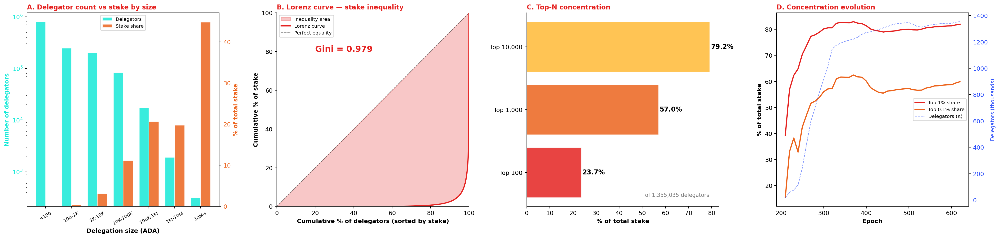
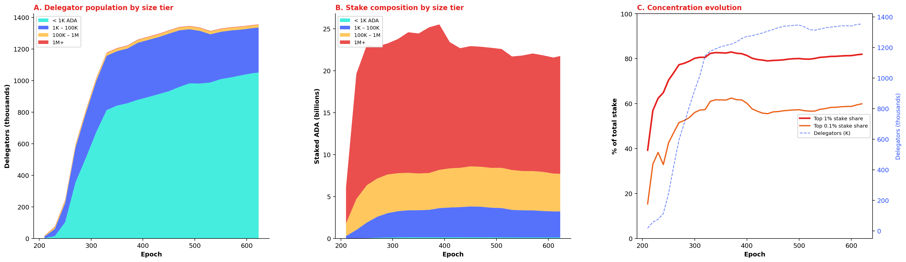
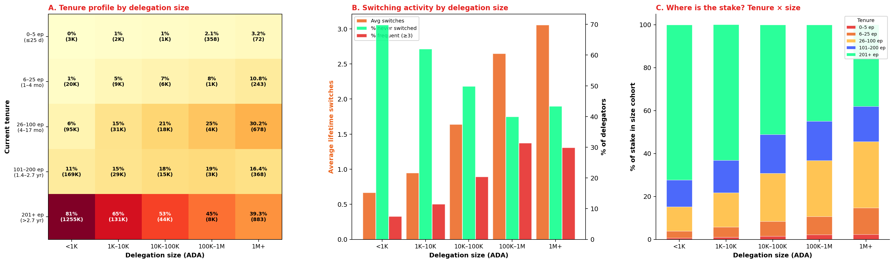

# The Staking Census — Populations, Capital, and Participation on Cardano Mainnet

_Built on 2026/04/09 from db-sync snapshot at epoch 623._

## Contents

1. [Mainnet Observations](#1-mainnet-observations)
2. [The ADA Supply](#2-the-ada-supply)
3. [Pool Operators](#3-pool-operators)
   - [3.1 Raw query](#31-raw-query)
   - [3.2 Cleaning — production threshold](#32-cleaning--production-threshold)
   - [3.3 Cleaning — entity attribution](#33-cleaning--entity-attribution)
   - [3.4 Operator landscape](#34-operator-landscape)
     - [3.4.1 Epoch 623 snapshot](#341-epoch-623-snapshot)
     - [3.4.2 Multi-pool operator fleet structure](#342-multi-pool-operator-fleet-structure)
     - [3.4.3 Historical decomposition](#343-historical-decomposition--productive-vs-sub-threshold-pools)
   - [3.5 Population dynamics — entries, exits, and turnover](#35-population-dynamics--entries-exits-and-turnover)
   - [3.6 Pool size variability — how stable is a pool's stake?](#36-pool-size-variability--how-stable-is-a-pools-stake)
4. [Delegators](#4-delegators)
   - [4.1 Raw query](#41-raw-query)
   - [4.2 Cleaning — zero-balance certificates](#42-cleaning--zero-balance-certificates)
   - [4.3 Cleaning — non-productive pools](#43-cleaning--non-productive-pools)
   - [4.4 Delegator landscape](#44-delegator-landscape)
     - [4.4.1 Epoch 623 snapshot](#441-epoch-623-snapshot)
     - [4.4.2 Stake distribution among delegators](#442-stake-distribution-among-delegators)
     - [4.4.3 Historical evolution — who joined and where is the capital?](#443-historical-evolution--who-joined-and-where-is-the-capital)
   - [4.5 Population dynamics — delegator entries and exits](#45-population-dynamics--delegator-entries-and-exits)
   - [4.6 Delegation churn — pool switching behaviour](#46-delegation-churn--pool-switching-behaviour)
     - [4.6.1 Certificate composition and temporal regimes](#461-certificate-composition-and-temporal-regimes)
     - [4.6.2 Tenure distribution](#462-tenure-distribution)
     - [4.6.3 Who switches? A size-stratified view](#463-who-switches-a-size-stratified-view)
     - [4.6.4 Flow corridors and retail lens](#464-flow-corridors-and-retail-lens)
   - [4.7 Switch motivation and loyalty profiles](#47-switch-motivation-and-loyalty-profiles)
     - [4.7.1 Net ROS does not differentiate](#471-net-ros-does-not-differentiate)
     - [4.7.2 Operator take is symmetric](#472-operator-take-is-symmetric)
     - [4.7.3 Pool size is the only asymmetric signal](#473-pool-size-is-the-only-asymmetric-signal)
     - [4.7.4 Loyal delegators and their pools](#474-loyal-delegators-and-their-pools)
5. [Non-Participants](#5-non-participants)
   - [5.1 Circulating supply decomposition](#51-circulating-supply-decomposition)
   - [5.2 Anatomy of the unstaked UTxO](#52-anatomy-of-the-unstaked-utxo)
   - [5.3 Dormancy vintage](#53-dormancy-vintage)
   - [5.4 What the non-participant population likely contains](#54-what-the-non-participant-population-likely-contains)
6. [Synthesis](#6-synthesis)
7. [Bridges to Companion Analyses](#7-bridges-to-companion-analyses)

## Objective

This report maps the full population of actors in the Cardano staking ecosystem — and those absent from it. Before analysing how rewards are shared (the companion [*Pools Pot Distribution*](../../pools-distribution/mainnet-analysis/) and [*Operator's Cut*](../../operator-delegator-distribution/mainnet-analysis/) reports), it is necessary to understand *who* is on the field, *how many* they are, and *how much capital* each population controls — and how all three have evolved since the Shelley hard fork.

## Data sources

All data comes from **cardano-db-sync** (PostgreSQL, snapshot at epoch 623). No third-party API.

| Table | Content |
|---|---|
| `ada_pots` | Per-epoch supply decomposition: reserve, treasury, circulating, UTxO, unclaimed rewards, deposits |
| `epoch_stake` | Per-epoch staking snapshot: total staked per delegation, ~560M rows |
| `delegation` | Individual delegation certificates: addr → pool |
| `pool_update` + `pool_owner` | Pool registration history and owner keys |
| `stake_deregistration` | Stake key deregistration events |

## Methodology note — iterative cleaning

The raw db-sync tables contain structural noise that must be understood and progressively removed before drawing conclusions. Rather than presenting only a final "clean" picture, this document shows each cleaning pass explicitly: what noise was identified, what was done about it, and how the numbers changed. This makes the analytical choices visible and auditable.

Each section therefore follows a **raw → clean** structure:
the raw query result is shown first, then the noise is named, then the cleaned version is presented.

## 1. Mainnet Observations

| # | Observation | Section | Nature |
| --- | --- | --- | --- |
| | **O1 — The productive pool landscape is a stable oligopoly** | | |
| F3.1 | Two-thirds of registered pools (1,926 of 2,877) sit below the production threshold (~1M ADA) — they hold 0.86% of stake and are economically irrelevant | §3.2 | Structural threshold |
| F3.2 | 73 named entities control 75.5% of productive stake through 464 pools — entity attribution is a lower bound | §3.3 | Concentration — supply side |
| F3.3 | The productive set is a quasi-equilibrium at ~950 pools since epoch 300, with 1.7% turnover per epoch (3,497 entries vs 3,070 exits) | §3.5 | Market maturity |
| F3.5 | The n-MPO distribution is heavy-tailed: 12 entities with 11+ pools control 40.4% of productive stake | §3.4 | Scale dominance |
| F3.6 | CEX + IVaaS (10 entities, 181 pools) hold 7.40B ADA — 34.3% of productive stake at structurally zero pledge | §3.4 | Custodial constraint |
| | **O2 — Pool size variability is an institutional rebalancing phenomenon** | | |
| F3.4 | Custodial-by-delegation pools have median CV 15.1% and 20% exceed CV 50%; retail pools sit at median CV 8.1%; custodial-by-extraction are the most stable (median CV 5.1%) | §3.6 | Segment-driven variance |
| | **O3 — Stake concentration among delegators is extreme and frozen** | | |
| F4.1 | The median delegator holds 32 ADA; the mean is 16,055 ADA — a 500× gap measuring power-law skewness | §4.4 | Structural inequality |
| F4.2 | 1,000 delegators (0.07%) control 57% of staked ADA; the top 10,000 (0.74%) control 79.2%; Gini = 0.976 | §4.4 | Concentration — demand side |
| F4.3 | Stake concentration crystallised by epoch 300 and has not moved since — 9× growth in delegator count without affecting the top-1% share (78–82%) | §4.4 | Structural lock-in |
| | **O4 — The delegation market has matured and crystallised** | | |
| F4.4 | Redelegation activity fell 75% from 2,000–3,500/epoch (early Shelley) to 600–800 (current regime) | §4.6 | Market maturity |
| F4.5 | The delegator base is structurally bimodal: 42% loyal (201+ epochs), 21% volatile (≤ 5 epochs), 37% moderate | §4.6 | Structural bimodality |
| F4.8 | Custodial and private pools contribute negligible churn — retail-only filter produces identical aggregate metrics | §4.6 | Churn is retail-only |
| | **O5 — Delegation size determines behaviour, not price** | | |
| F4.6 | Micro-delegators (< 1K ADA) average 0.67 lifetime switches; whales (1M+) average 3.06 — switching scales monotonically with stake size | §4.6 | Size-driven behaviour |
| F4.7 | Whales hold 14.1B of 21.8B staked total, yet only 38% of their stake sits in loyal delegations — capital is disproportionately mobile | §4.6 | Capital instability |
| | **O6 — Yield does not drive delegation decisions** | | |
| F4.9 | Half of all switches (50.5%) produce zero yield change (±5 bps); the median ROS differential is +0.02 bps | §4.7 | Price signal invisible |
| F4.10 | Operator take direction is symmetric: 30.8% lower / 37.7% similar / 31.5% higher — no optimisation pattern | §4.7 | No fee-chasing |
| F4.11 | Pool size is the only asymmetric signal: moves to smaller pools accept higher take (21.5%), moves to larger pools are take-neutral (21.0%) | §4.7 | Visibility over optimality |
| F4.12 | 92.1% of loyal delegations sit in the 0–5% margin range — loyalty and low fees coexist, not trade off | §4.7 | Entry filter, not trigger |
| | **O7 — The staking participation rate is structurally declining** | | |
| F2.1 | Staking rate has fallen from 71% (epoch ~260) to 59% (epoch 623) — driven by supply growth outpacing stake inflows | §2 | Supply-side erosion |
| F5.1 | 14.36B ADA (38.9%) does not participate — how much is addressable vs structurally excluded is the critical open question | §5 | Pending tx_out decomposition |

### The big picture

**Who is on the field.** At epoch 623, 21.75B ADA (59% of circulating supply) is staked across 2,877 pools. After removing the sub-production tail, the productive core is 951 pools controlled by 560 entities — of which 73 named multi-pool operators hold three-quarters of productive stake. The independent single-pool operator population (477 pools, 5.28B ADA) provides the remaining quarter.

**A stable market, not a dynamic one.** The productive pool count stabilised around 950 by epoch 300 and has barely moved since. Pool turnover is a steady-state replacement process: 3,497 entries against 3,070 exits across the full history, averaging ~16 pools per epoch. On the delegator side, the bimodal tenure distribution — 42% loyal (2.7+ years), 21% volatile (< 25 days) — is the signature of a settled market. The churn rate has declined 75% from early Shelley. The market is not evolving; it has crystallised.

**Size determines behaviour.** The sharpest analytical divide among delegators is not pool choice or fee sensitivity — it is delegation size. Micro-delegators (< 1K ADA, 83% of the population by count) delegate once and stay. Whales (1M+, 0.1% by count) average 3+ lifetime switches and hold 65% of staked capital. Pool operators who depend on a few large delegations face structurally higher stake instability than those with a broad base of small delegators.

**The yield signal is invisible to delegators.** Net ROS varies by less than 5 bps across the competitive pool market. When delegators switch, 50.5% move to a pool with an indistinguishable yield. Neither operator take nor margin direction shows any systematic pattern. The one asymmetric signal is pool size — delegators drift toward larger, more visible pools. The incentive mechanism's core assumption of yield-sensitive delegation is not supported by the on-chain evidence.

**Who is off the field — and why it matters.** 14.36B ADA (38.9%) sits unstaked. The staking rate has declined from 71% to 59% since epoch 260 — not because delegators leave, but because circulating supply growth outpaces new inflows. The non-participant decomposition (exchange custody, DeFi-locked, dormant wallets) is the critical missing piece: it determines how much of the unstaked pool is *addressable* by incentive changes versus *structurally excluded* by address type or custodial arrangement.

## 2. The ADA Supply

The Cardano monetary policy fixes the maximum supply at 45 billion ADA. At epoch 623, the circulating supply has reached 36.88B, with 6.45B remaining in the reserve and 1.66B accumulated in the treasury. Monetary expansion — the rate at which reserve ADA enters circulation — decays geometrically.

At epoch 623: **21.75B ADA** staked out of **36.88B** circulating = **59.0%** staking rate. The remaining **15.13B ADA** (41.0%) is not staked — of which 14.36B sits in unstaked UTxOs and 0.77B in unclaimed rewards. This population is decomposed in §5.

The top panel shows the staked/unstaked decomposition of circulating supply with the staking rate (red line, right axis). The rate peaked near 71% around epoch 260 and has been declining gently, driven by circulating supply growth outpacing new stake inflows.

> **Finding F2.1 — The staking rate is structurally declining despite persistent net delegator inflows.** The rate has fallen from 71% (epoch ~260) to 59% (epoch 623) — a 12 pp loss over ~360 epochs. The decline is driven entirely by supply-side expansion: circulating ADA grew from ~32B to ~37B while staked ADA grew from ~23B to ~22B. The non-participant pool is growing faster than the staking pool.

## 3. Pool Operators

### 3.1 Raw query

The pool count from epoch_stake peaked at **3,160** (epoch 331) and currently stands at **2,877**. This counts only pools that appear in the staking snapshot with non-zero delegated stake — the registration-certificate count of 5,919 includes 3,042 empty pools and is discarded (see §4.2 for the full rationale).

The k=500 reference line shows the protocol's target number of pools (the saturation parameter). The actual pool count has been ~5.8× k since epoch 330, though many of these pools carry negligible stake.

### 3.2 Cleaning — production threshold

A pool must hold enough stake to expect at least one block per epoch. With ~21,600 blocks per epoch and 21.75B total staked ADA, the production threshold is approximately **1M ADA** per pool.

| Segment | Pools | Share of pools | Stake | Share of stake | Delegations |
|---|---|---|---|---|---|
| Above threshold (≥1M ADA) | 951 | 33.1% | 21.57B | 99.14% | 1,295,095 (95.6%) |
| Below threshold (<1M ADA) | 1,926 | 66.9% | 0.19B | 0.86% | 59,940 (4.4%) |

Two thirds of all pools are below the production threshold. Together they hold less than 1% of staked ADA. Their 59,940 delegators collectively control 188M ADA — a negligible share that earns intermittent and unpredictable rewards.

Below-threshold pool breakdown by stake:

| Tier | Pools | Stake |
|---|---|---|
| < 1K ADA | 778 | 0.1M |
| 1K–10K | 394 | 1.4M |
| 10K–100K | 323 | 12.4M |
| 100K–500K | 286 | 69.0M |
| 500K–1M | 144 | 104.3M |

The median below-threshold pool holds just 2,547 ADA. Three quarters hold less than 68K ADA — orders of magnitude below what is needed for regular block production.

**After cleaning:** the productive pool count drops from 2,877 to **951** — closer to, but still ~1.9× the protocol's k=500 target.

> **Finding F3.1 — Two-thirds of pools are below the production threshold and carry 0.86% of stake.** The 1,926 sub-threshold pools are economically irrelevant to consensus but not to their 59,940 delegators, who earn intermittent rewards and would be better served by redelegating. The median sub-threshold pool holds 2,547 ADA.

### 3.3 Cleaning — entity attribution

The 951 productive pools are not 951 independent operators. Many pools share a controlling entity — detectable on-chain through shared `pool_owner` keys, and off-chain through metadata, ticker naming patterns, relay DNS, reward addresses, and public disclosures. This cleaning pass groups pools by entity to reveal the true operator landscape.

**On-chain grouping** (shared owner keys across productive pools): 943 single-pool operators and 4 entities sharing keys across 8 pools. On-chain keys are a lower bound — most multi-pool operators use separate keys per pool.

**Off-chain attribution** combines on-chain signals with metadata analysis. Across all registered pools, this identifies **85 named entities** controlling **660 pools**. Filtering to the 951 productive pools: 2 entities disappear entirely (RAID — 7 pools, RockX — 10 pools, all below threshold), 10 entities shrink to a single productive pool (reclassified as attributed single-pool operators), leaving **73 named entities** controlling **464 pools** (16.29B ADA, 75.5% of productive stake). The remaining **477 pools** (5.28B ADA, 24.5%) are unattributed single-pool operators.

| Segment | Pools | Stake | Share of productive stake |
|---|---|---|---|
| Attributed to named entities | 474 | 16.29B ADA | 75.5% |
| Unattributed (single-pool operators) | 477 | 5.28B ADA | 24.5% |

The productive landscape splits almost evenly by pool count but is heavily skewed by stake: attributed entities control three quarters of productive stake through half the pools.

> **Finding F3.2 — 73 named entities control 75.5% of productive stake through 464 pools.** The operator landscape is dominated by multi-pool entities whose economic weight far exceeds their pool count. The 477 unattributed single-pool operators are the numerical majority but hold only a quarter of productive stake. Entity attribution is a lower bound — operators using entirely separate infrastructure per pool remain invisible.

The entity attribution data lives in:
- [`data/mpo_entity_pool_mapping_mainnet.csv`](data/mpo_entity_pool_mapping_mainnet.csv) — pool → entity
- [`data/mpo_entity_archetypes.csv`](data/mpo_entity_archetypes.csv) — entity → archetype
- [`data/entity_stake_summary_623.csv`](data/entity_stake_summary_623.csv) — per-entity stake at epoch 623
- [`docs/mpo_entity_profiles.md`](docs/mpo_entity_profiles.md) — detailed entity profiles

### 3.4 Operator landscape

All figures and tables in this section refer to **productive pools only** — the 952 pools above the production threshold at epoch 623, carrying 99.1% of staked ADA. The 1,925 sub-threshold pools (0.9% of stake) are excluded.

#### 3.4.1 Epoch 623 snapshot

| Segment | Entities | Pools | Stake | Share |
|---|---|---|---|---|
| **Productive total** | **560** | **952** | **21.57B** | **100%** |
| _of which:_ | | | | |
| Identified entities | 83 | 475 | 16.30B | 75.6% |
| — with multiple productive pools (n-MPO ≥ 2) | 73 | 465 | 15.83B | 73.4% |
| — with single productive pool (attributed SPO) | 10 | 10 | 0.46B | 2.1% |
| Independent single-pool operators | 477 | 477 | 5.28B | 24.5% |

The entity attribution is a current-epoch snapshot and a lower bound — entities using entirely separate infrastructure and branding for each pool remain invisible. The real multi-pool operator count is certainly higher than 73.

#### 3.4.2 Multi-pool operator fleet structure

The 83 identified entities operate 475 productive pools — but their fleet sizes vary from 1 to 41 pools. The n-MPO notation denotes the number of productive pools an entity manages.

**Fleet size distribution** (panel A):

| Fleet size (n-MPO) | Entities | Pools | Stake (B) | % of productive |
|---|---:|---:|---:|---:|
| 1 (attributed SPO) | 10 | 10 | 0.46 | 2.1% |
| 2–3 | 35 | 83 | 2.50 | 11.6% |
| 4–5 | 14 | 65 | 2.10 | 9.7% |
| 6–10 | 12 | 86 | 2.52 | 11.7% |
| 11–20 | 9 | 138 | 5.00 | 23.2% |
| 21+ | 3 | 93 | 3.71 | 17.2% |
| **Total attributed** | **83** | **475** | **16.30** | **75.6%** |

The 2–3 pool tier is the most populated (35 entities) but each tier above it controls more aggregate stake despite fewer entities. Three entities alone — Coinbase (41p), Yuta (25p), and Binance (20p) — operate 93 pools and hold 3.71B ADA (17.2% of productive stake).

> **Finding F3.5 — The n-MPO distribution is heavy-tailed: 12 entities with 11+ pools control 40.4% of productive stake.** The mid-range (2–10 pools, 61 entities) is the numerical majority but its aggregate weight (33.0%) is smaller than the concentrated top. Stake scales super-linearly with fleet size — a 21+ pool entity holds on average 1.24B, a 2–3 pool entity holds 0.07B.

**Entity archetype composition** (panel B). Exchanges (CEX: 6 entities, 119 pools, 4.71B) and institutional validators (IVaaS: 4 entities, 62 pools, 2.69B) together account for 10 entities but 45.4% of attributed stake. Community-branded fleets (43 entities, 3.30B) are the most numerous archetype but hold less stake than the exchange tier alone. The remaining archetypes — independent MPOs, multi-brand fleets, opaque entities, ecosystem actors, and platforms — fill the long tail.

> **Finding F3.6 — CEX + IVaaS (10 entities, 181 pools) hold 7.40B ADA — 34.3% of productive stake at structurally zero pledge.** These entities' delegation source — custodied retail balances and institutional client assets — makes pledge economically meaningless. Their dominance sets a floor on how much of the stake landscape is unreachable by pledge-based incentive mechanisms.

#### 3.4.3 Historical decomposition — productive vs sub-threshold pools

The production threshold — the minimum stake a pool needs to expect at least one block per epoch — rises mechanically with total staked ADA. At epoch 211 (Shelley launch), a pool needed roughly 470K ADA; by epoch 623 the threshold has crossed 1M ADA. The number of pools that clear this threshold has remained remarkably stable around 900–1,000 since epoch 300, while the sub-threshold tail grew from near zero to almost 2,000 pools by epoch 330 and has hovered there since. The productive share of pools has therefore fallen from near 100% in early Shelley to roughly 33% today — yet productive pools continue to control over 99% of staked ADA throughout the entire history.

The top panel shows the staked-ADA split between productive and sub-threshold pools (left axis) alongside the production threshold itself (red line, right axis). The bottom panel shows the pool-count decomposition, with the productive share (purple line, right axis) declining as the long tail of sub-threshold pools inflated the denominator without capturing meaningful stake. The k=500 reference line marks the protocol's target pool count.

### 3.5 Population dynamics — entries, exits, and turnover

The near-constant stock of ~950 productive pools masks significant underlying churn. This section decomposes the aggregate into three views: the entry/exit flow, the entity-level lifecycle that drives it, and the stake variability that pools experience even while they remain in the productive set.

#### 3.5.1 Entries and exits

Tracking individual pools across consecutive epochs — counting those that cross the production threshold upward (entries) and those that fall below it or disappear (exits) — reveals the turnover that the aggregate count obscures.

The early Shelley period (epochs 212–300) saw rapid net growth as the pool population expanded from ~450 to ~1,000 productive pools. Growth epochs outnumbered decline epochs roughly 2∶1 during this phase. From epoch 300 onward, the productive population stabilised: net changes per epoch fluctuate around zero, with growth and decline epochs occurring in roughly equal proportion. Over the full history (epochs 212–623), the productive set gained a net +427 pools — but the near-flat trajectory since epoch 300 means the overwhelming majority of that net gain occurred in the first 90 epochs.

The stability of the stock alongside non-trivial per-epoch fluctuation implies a quasi-equilibrium: pools that exit the productive set (falling below the rising threshold, retiring, or losing delegation) are replaced at roughly the same rate by new entrants or returning pools. Tracking individual pool presence per epoch (`05_pool_population_dynamics.sql`) confirms this: over the full history the productive set recorded 3,497 entries against 3,070 exits, with an average churn of ~15.9 pools per epoch. The turnover rate (entries + exits as a share of the productive population) averages around 1.7% per epoch — higher than the delegator-side turnover of ~0.5%, reflecting the greater fragility of pool economics near the production threshold.

> **Finding F3.3 — The productive pool set is a quasi-equilibrium: ~950 pools since epoch 300, with 1.7% turnover per epoch.** 3,497 entries against 3,070 exits balance to a near-zero net flow. The apparent stability of the aggregate conceals a replacement process where departing pools are continuously substituted by new entrants.

#### 3.5.2 Entity lifecycle

Part of the churn is driven by entity-level dynamics. The entity lifecycle analysis ([`data/entity_lifecycle_623.csv`](data/entity_lifecycle_623.csv)) classifies the 85 named entities into four phases — dead, declining, stable, and growing — based on their stake trajectory and productive-pool retention. Declining and dead entities contract their pool fleets, feeding the exit side; growing entities and new independent single-pool operators feed the entry side. The entity-level decline trajectories are visualised in the figures below.

### 3.6 Pool size variability — how stable is a pool's stake?

The entry/exit analysis tracks whether a pool is *in* the productive set; this section asks how much its stake fluctuates while it stays there. A pool that survives all 73 epochs of the last year (epochs 551–623) may nonetheless experience large swings in delegation, with consequences for block production regularity and operator revenue predictability.

**Most productive pools are remarkably stable.** Of the 1,032 pools present in at least 10 of the last 73 epochs and above the production threshold, roughly a third (32.6%) have a coefficient of variation (CV) of 5% or less — their stake barely moves from epoch to epoch. Another 18.3% sit in the 5–10% band. Together, half the productive set operates with stake fluctuations under 10% over a full year.

**A long tail of volatile pools exists.** At the other extreme, 9.3% of productive pools have CV between 50% and 100%, and 3.4% exceed 100% — meaning their standard deviation is larger than their mean stake. These are typically pools near the production threshold that oscillate in and out of viability, or pools that experienced a single large delegation event (arrival or departure of a whale) that dominates their variance.

**System-wide dispersion has compressed over time.** Panel C shows the cross-sectional CV of pool stakes across all productive pools at each epoch. In the early Shelley era (epochs 210–260), the CV exceeded 180% — a handful of very large pools coexisted with hundreds of small entrants, producing extreme size dispersion. As the pool population matured and the largest pools approached the saturation cap (~70.8M ADA at k=500), the CV declined steadily to ~105% by epoch 500 and has since plateaued. The remaining dispersion reflects the structural range between pools near the production threshold (~1M ADA) and the largest pools near saturation (~114M ADA) — a 100× ratio that the protocol's incentive design deliberately permits.

**Variability differs across market segments.** Crossing the per-pool coefficient of variation with the custodial taxonomy from the companion [*Operator's Cut*](../../operator-delegator-distribution/mainnet-analysis/) (§4.3) reveals that not all segments fluctuate equally. The custodial classification uses the per-pool **median delegation** from db-sync `epoch_stake` — the amount held by the typical delegator in each pool — rather than the mean ADA per delegation, which is inflated by whale addresses by a factor of 50–300,000× (see the *Operator's Cut* §4.3.2 for the methodology and rationale).

Custodial-by-delegation pools (28 pools where the median delegation exceeds 100K ₳) are the most volatile: median coefficient of variation of 19.3%, mean 43.0%, and 21% exceed 50%. These are pools dominated by whale self-delegation — a single address moving capital in or out produces large proportional swings. By contrast, custodial-by-pledge pools (36 private, self-funded pools) sit at a median coefficient of variation of 9.3% — the operator controls the capital and has little reason to move it, with 67% below 10%. Custodial-by-extraction pools (79 pools with ≥ 99% margin) sit at 6.6% median, with 54% below 10% — consistent with pools whose delegators are locked in by inertia or institutional constraint.

The retail market (809 pools, median delegation below 100K ₳) lands at a median coefficient of variation of 8.4%, with 55% of pools below 10%. This segment includes the large institutional operators (Coinbase, Binance, Kiln, YUTA) whose pools have high mean ADA per delegation but low median delegation — the majority of their delegators are small retail wallets. The 10% tail above 50% in the retail segment captures pools that gained or lost a whale delegator — a single large address arriving or leaving a pool with hundreds of small delegators.

> **Finding F3.4 — Stake variability is driven by delegation concentration, not market segment.** Pools where the typical delegator holds ≥ 100K ₳ (28 custodial-by-delegation pools) show a median coefficient of variation of 19.3% and a mean of 43.0% — whale movements dominate their variance. Retail pools (809 pools) are mostly stable at 8.4% median, but the 10% tail above 50% shows that even retail pools are vulnerable to single-whale shocks. Custodial-by-extraction pools are the most inert (6.6% median) — stagnation, not active management, keeps their stake steady.

**Implications for delegators.** A pool's stake stability matters because it affects block-production regularity and, by extension, the consistency of epoch rewards. Delegators in low-CV pools experience smoother returns; those in high-CV pools face more variance. The data in `data/pool_size_variability.csv` provides per-pool CV, min, max, and range for further analysis; `data/pool_cv_by_segment.csv` gives the segment-level aggregate.

## 4. Delegators

### 4.1 Raw query

Two db-sync tables count delegators in different ways:

| Source | What it counts | Epoch 623 value |
|---|---|---|
| `epoch_stake` aggregation | Rows with non-zero stake in the epoch snapshot | **1,355,035 delegations** across **2,877 pools** |
| `delegation` table reconstruction | Active delegation certificates (regardless of balance) | **1,847,713 addresses** across **5,919 pools** |

The gap: ~493K addresses hold an active delegation certificate but have zero balance in the epoch_stake snapshot. Similarly, ~3,042 registered pools have delegation certificates pointing at them but carry no actual stake.

### 4.2 Cleaning — zero-balance certificates

A delegation certificate is a *declaration of intent*: it records on-chain that an address wishes to delegate to a given pool, but it does not lock any funds. The ADA remains freely spendable. An epoch_stake row, by contrast, is *capital at work* — it reflects the actual balance present at the snapshot boundary. An address with a certificate but no ADA earns no rewards and does not participate in consensus.

The gap between the two views arises because delegation certificates are never automatically revoked. When an address is emptied — typically because the holder transferred funds to an exchange, moved to another wallet, or simply stopped using Cardano — the certificate persists as a residual record pointing at a pool with zero backing stake. These orphaned records are the "certificate ghosts" removed in this step.

| Metric | Raw (delegation table) | Clean (epoch_stake) | Noise removed |
|---|---|---|---|
| Active delegations | 1,847,713 | **1,355,035** | 492,678 certificate ghosts (26.7%) |
| Active pools | 5,919 | **2,877** | 3,042 empty pools (51.4%) |

**After cleaning:** 1,355,035 delegations, 21.75B ADA across 2,877 pools.

### 4.3 Cleaning — non-productive pools

The 1,925 pools below the production threshold (§3.2) carry 59,937 delegations and 0.19B ADA. These delegators earn intermittent and unpredictable rewards. Removing them aligns the delegator population with the productive operator landscape.

**After cleaning:** 1,295,098 delegations, 21.57B ADA across 952 productive pools.

### 4.4 Delegator landscape

#### 4.4.1 Epoch 623 snapshot

After the two cleaning passes (§4.2–4.3), the delegator population at epoch 623 is:

| Segment | Delegations | Stake | Share | Pools | Entities |
|---|---|---|---|---|---|
| **Raw (delegation certificates)** | **1,847,713** | — | — | **3,190** | **2,374** |
| Zero-balance certificates (noise) | 492,678 | 0 | — | 313 | 72 |
| **epoch_stake total** | **1,355,035** | **21.75B** | **100%** | **2,877** | **2,302** |
| Non-productive pool delegations (noise) | 59,937 | 0.19B | 0.9% | 1,925 | 1,742 |
| **Productive pool delegations** | **1,295,098** | **21.57B** | **99.1%** | **952** | **560** |

The 1,295,098 productive pool delegations are the cleaned population handed to the companion [*Operator's Cut*](../../operator-delegator-distribution/mainnet-analysis/) analysis, which decomposes them further into operator self-stake, custodial, and retail segments.

#### 4.4.2 Stake distribution among delegators

The 1.36M delegations carry 21.75B ADA — but the distribution across individual delegations is extremely unequal.

**Size buckets:**

| Size cohort | Delegators | % of delegators | Stake (ADA) | % of stake | Mean (ADA) |
|---|---:|---:|---:|---:|---:|
| < 100 | 801,067 | 59.1% | 11.2M | 0.05% | 14 |
| 100 – 1K | 249,181 | 18.4% | 94.2M | 0.43% | 378 |
| 1K – 10K | 201,797 | 14.9% | 679.0M | 3.12% | 3,365 |
| 10K – 100K | 83,307 | 6.1% | 2.43B | 11.18% | 29,188 |
| 100K – 1M | 17,439 | 1.3% | 4.49B | 20.63% | 257,327 |
| 1M – 10M | 1,926 | 0.14% | 4.31B | 19.80% | 2.24M |
| 10M+ | 318 | 0.02% | 9.75B | 44.80% | 30.6M |

The bottom 59.1% of delegators (under 100 ADA) collectively hold 0.05% of stake — less than any single delegation in the top tier. The top 318 delegators (0.02%) hold 44.8% of all staked ADA.

> **Finding F4.1 — The median delegator holds 32 ADA; the mean is 16,055 ADA.** The 500× gap between mean and median measures the skewness of the distribution. Half the delegator population stakes less than the cost of a single transaction fee at peak congestion. The distribution follows a power law — each tier above 10K ADA holds roughly 20% of total stake despite containing exponentially fewer delegators.

**Concentration metrics:**

| Metric | Value |
|---|---:|
| Gini coefficient | 0.976 |
| Top 100 delegators → % of stake | 23.7% |
| Top 1,000 → % of stake | 57.0% |
| Top 10,000 → % of stake | 79.2% |
| Median | 32 ADA |
| P90 | 5,866 ADA |
| P99 | 142,775 ADA |

The Lorenz curve (panel B) is nearly flat until the last few percent of delegators, then rises steeply — the classic signature of extreme concentration. At Gini = 0.976, the Cardano staking distribution is more concentrated than the US wealth distribution (~0.85) and comparable to the most unequal asset distributions observed in financial markets.

> **Finding F4.2 — 1,000 delegators (0.07% of the population) control 57% of staked ADA.** The top 10,000 (0.74%) control 79.2%. The staking economy is effectively governed by the capital allocation decisions of a few thousand addresses — whose identity (individual whale, exchange hot wallet, institutional custodian) determines whether the protocol's delegation signal reflects genuine preference or operational logistics.

#### 4.4.3 Historical evolution — who joined and where is the capital?

The three panels trace how the delegator population, its stake composition, and its concentration structure evolved from Shelley launch (epoch 210) to epoch 623.

**Panel A — Population growth by size tier.** The delegator count grew from 17K (epoch 210) to 1.36M (epoch 623). Virtually all growth comes from the micro-delegator tier (< 1K ADA, cyan): this tier expanded from ~1,500 to ~1.05M, absorbing 96% of new entrants. The 1K–100K tier grew from ~10K to ~285K. The 100K–1M tier plateaued around 17K, and the 1M+ tier barely moved — from ~1,100 at launch to ~2,200 today.

**Panel B — Stake composition by size tier.** In contrast to population, the stake is dominated by the 1M+ tier (red), which holds 14.1B ADA — 65% of total staked ADA — in just 2,244 addresses. This tier reached its current level by epoch ~260 and has fluctuated within a narrow band since. The 100K–1M tier (gold) contributes 4.5B, the 1K–100K tier (blue) adds 3.1B, and the <1K tier — despite being 77% of the population — carries 0.1B (0.5%). Stake composition has been essentially frozen since epoch 300.

**Panel C — Concentration evolution.** The top-1% share rose rapidly from 39% at Shelley launch to ~80% by epoch 280, then plateaued at 78–82%. The top-0.1% share follows a similar trajectory, stabilising at 48–52%. The delegator count (dashed line) grew 9× over the same period without affecting the concentration ratio.

The mechanism is straightforward: new entrants are overwhelmingly micro-delegators who add to the denominator without touching the numerator of the concentration ratio.

> **Finding F4.3 — Stake concentration crystallised by epoch 300 and has not moved since.** The top-1% share has been stable at 78–82% for over 300 epochs, despite a 9× growth in delegator count. Growth since epoch 300 has come almost exclusively from the < 1K tier — 600K new micro-delegators who collectively added 0.06B ADA (0.3% of stake). The economic weight of the staking system was set in its first ~90 epochs. Concentration is now a structural feature, not a trend.

### 4.5 Population dynamics — delegator entries and exits

Applying the same epoch-over-epoch tracking used for pools in §3.5, but at the delegator level: for each epoch, count addresses that appear in a productive pool's delegation set for the first time (entries) and those that disappear from it (exits). Only delegators to pools above the production threshold are counted.

The delegator population tells a fundamentally different story from the pool population. Where the productive pool count stabilised early and has fluctuated within a narrow band since epoch 300, the delegator count grew almost monotonically from ~28,700 (epoch 212) to ~1,295,000 (epoch 623). Over the full 412-epoch history, the productive set recorded 2,052,268 individual entries against 779,974 exits — a net gain of +1,272,294 delegators. The average per-epoch churn (entries + exits) is ~6,870 addresses, implying that roughly 0.5% of the delegator base turns over each epoch.

Growth epochs outnumber decline epochs roughly 6∶1, and the few negative epochs involve small absolute drops. The moving average of net change was strongly positive through epoch ~380, then settled into a lower but still persistently positive regime.

Two features stand out. First, the growth curve shows distinct waves rather than a smooth ramp: the initial Shelley on-boarding surge (epochs 212–260), a secondary acceleration around epochs 280–330 (coinciding with the Alonzo-era smart-contract boom and increased retail attention), and a third wave around epochs 480–510. Second, the plateau from epoch ~530 onward — where net growth drops close to zero — suggests the delegator population may be approaching a saturation point under the current staking participation rate of ~59%.

The turnover rate (gross entries + exits as a share of the active population) averages around 0.5% per epoch but spikes markedly during protocol upgrades and market events, revealing that the apparently stable stock masks episodic surges of rebalancing. Unlike pool dynamics, where entries and exits are roughly balanced post-epoch 300, delegator dynamics remain structurally asymmetric — entries consistently exceed exits — reflecting ongoing organic adoption even as the growth rate decelerates.

### 4.6 Delegation churn — pool switching behaviour

The population dynamics above track whether delegators are *in* the productive set; this section tracks what they do *within* it — how often they switch pools, who switches, and why.

The `delegation` table records every delegation certificate ever submitted on-chain (3,491,680 certificates across the Shelley era). Each certificate binds a stake address to a pool; a new certificate from the same address to a different pool constitutes a redelegation (pool switch).

#### 4.6.1 Certificate composition and temporal regimes

Of the 3.49M delegation certificates submitted between epochs 210 and 623:

| Certificate type | Count | Share |
|---|---:|---:|
| Initial delegation (first certificate for an address) | 1,847,713 | 52.9% |
| Redelegation (switch to a different pool) | 1,407,245 | 40.3% |
| Renewal (same pool, re-registration cycle) | 235,336 | 6.7% |

The per-epoch pattern reveals three regimes:

- **Early Shelley (epochs 210–260):** 2,000–3,500 redelegations per epoch — a turbulent phase of experimentation with the new staking system.

- **Middle period (epochs 260–500):** 1,000–2,000 per epoch, with periodic spikes around protocol upgrades (Alonzo, Babbage) and market events.

- **Mature regime (epoch 500+):** 600–800 redelegations per epoch — a stable market where most delegators have settled.

> **Finding F4.4 — The delegation market has matured through three distinct regimes.** Redelegation activity fell from 2,000–3,500 per epoch in early Shelley to 600–800 in the current regime — a 75% decline that marks the transition from experimentation to a settled market.

#### 4.6.2 Tenure distribution

The tenure distribution confirms a bimodal structure:

| Tenure bucket | Share of delegations | Profile |
|---|---:|---|
| 201+ epochs (> 2.7 years) | 42.2% | Committed long-term delegators who anchor pool economics |
| 6–200 epochs (25 days – 2.7 years) | 36.8% | Moderate — roughly uniform distribution across bands |
| 0–5 epochs (≤ 25 days) | 21.0% | Rapid switchers — yield optimisation, pool retirement, or exchange rebalancing |

> **Finding F4.5 — The delegator base is structurally bimodal.** 42% of delegations have persisted for over 2.7 years, while 21% last less than 25 days. The middle ground (37%) distributes roughly uniformly. The loyal majority anchors pool economics; the volatile tail generates most of the churn signal.

#### 4.6.3 Who switches? A size-stratified view

Crossing tenure with delegator stake size at epoch 623 reveals a clear gradient: the larger the delegation, the more active the delegator.

**Switching activity by size cohort:**

| Size cohort | Avg lifetime switches | Never switched | Frequent (≥ 3 switches) |
|---|---:|---:|---:|
| < 1K ADA | 0.67 | 70% | 8% |
| 1K – 10K | 0.95 | 62% | 12% |
| 10K – 100K | 1.64 | 50% | 20% |
| 100K – 1M | 2.65 | 40% | 31% |
| 1M+ | 3.06 | 43% | 30% |

**Tenure profile by size cohort** (panel A). The share of loyal delegators (201+ epochs) falls steadily as stake rises: 82% for <1K, 65% for 1K–10K, 53% for 10K–100K, 45% for 100K–1M, and 39% for 1M+. Small delegators delegate once and forget; large delegators actively manage their position.

> **Finding F4.6 — Delegation size predicts switching behaviour.** Micro-delegators (<1K ADA) average 0.67 lifetime switches and 70% have never moved. Whales (1M+) average 3.06 switches and only 43% have never moved. Switching intensity increases monotonically with stake size.

**Capital implications** (panel C). In the <1K cohort, 72% of stake is held by loyal delegators. In the 1M+ cohort, only 38% sits with loyals — the rest distributes across moderate and volatile tenures. Since whales hold the majority of staked ADA (14.1B of 21.8B total), a large share of the network's capital is in the hands of delegators who move actively.

> **Finding F4.7 — The network's capital is disproportionately held by its most mobile delegators.** Whales (1M+ ADA) hold 14.1B of the 21.8B staked total, yet only 38% of their stake sits in loyal delegations. Pool operators who depend on a few large delegations face structurally higher stake instability than those with a broad base of small, loyal delegators.

#### 4.6.4 Flow corridors and retail lens

The top pool-to-pool flows (`data/delegation_flow_matrix.csv`) reveal that the highest-volume corridors are between pools controlled by the same entity — particularly within IOG's pool fleet and between major exchange operators. A significant share of observed "switching" is internal rebalancing by multi-pool operators rather than genuine delegator choice.

**Retail-only filter.** Restricting to retail pools (margin < 99.9%, excluding private and custodial-by-extraction pools — same filter as the companion [*Operator's Cut*](../../operator-delegator-distribution/mainnet-analysis/) §4.4) yields near-identical results:

| Metric | All pools | Retail only |
|---|---|---|
| Switch share of certificates | 40.3% | 40.0% |
| Recent redelegations per epoch | ~800 | ~799 |
| Loyal tenure (201+ epochs) | 42.2% | 42.4% |
| Volatile tenure (≤ 5 epochs) | 21.0% | 20.8% |

The private pool population (47 pools, ~300 delegations) generates negligible churn. Essentially all observed switching behaviour originates in the retail delegation market. The retail flow matrix is available at `data/retail_delegation_flow_matrix.csv`.

> **Finding F4.8 — Custodial and private pools contribute negligible churn.** The retail-only filter produces near-identical aggregate metrics — 40.0% switch rate, 42.4% loyal tenure. Observed switching is a retail-market phenomenon.

### 4.7 Switch motivation and loyalty profiles

The previous section established *who* switches and *how often*. This section asks *why* delegators move and *where* loyal delegators stay.

The companion [*Operator's Cut*](../../operator-delegator-distribution/mainnet-analysis/) (§3.3) established that margin alone is a poor proxy for what a delegator pays — the **operator take** (combining fixed cost and margin into a single composite fee) and the resulting **net ROS** (delegator yield after fees) are the correct metrics. Finding F3.10 further showed that net ROS is near-homogeneous across the hollow segment (8–22 bps of spread). The analysis below uses these metrics rather than raw margin to assess switch motivation.

#### 4.7.1 Net ROS does not differentiate

For each of the top 500 pool-to-pool flow corridors (170,064 matched switches), the origin and destination pools are compared on operator take, net ROS, and pool size using the reward-split snapshot at epoch 614.

**Net ROS direction:**

| Direction | Share |
|---|---:|
| Better net ROS (> +5 bps) | 25.6% |
| Similar net ROS (± 5 bps) | 50.5% |
| Worse net ROS (> −5 bps) | 23.8% |

Half of all switches land in a pool with a statistically indistinguishable net ROS. The median ROS differential is +0.02 bps — effectively zero. The interquartile range spans −0.47 to +0.55 bps, well below any threshold a delegator could observe or act on.

> **Finding F4.9 — Net ROS cannot explain switching: half of all switches produce zero yield change.** The median ROS differential between origin and destination pool is +0.02 bps. The signal is too weak to detect, let alone optimise — consistent with F3.10 of the Operator's Cut, which found that gross ROS varies by less than 3 bps across 90% of the non-custodial market.

#### 4.7.2 Operator take is symmetric

**Operator take direction** (threshold: ±1 pp):

| Direction | Share |
|---|---:|
| Lower take (cheaper pool) | 30.8% |
| Similar take (± 1 pp) | 37.7% |
| Higher take (more expensive pool) | 31.5% |

The three buckets are near-equal. Delegators do not systematically move toward lower-take pools.

**The take × ROS matrix** (panel A) shows the mechanical coupling between the two metrics: the diagonal dominates (lower take → better ROS at 18.4%, similar → similar at 25.6%, higher → worse at 16.5%). The off-diagonal cells are sparse, confirming that take and ROS are two views of the same signal — and that signal is too flat to drive behaviour.

> **Finding F4.10 — Operator take is equally balanced across switch directions.** 30.8% of switches go to a cheaper pool, 31.5% to a more expensive one, and 37.7% to a similar-take pool. No take-based optimisation pattern is detectable.

#### 4.7.3 Pool size is the only asymmetric signal

**Take × size** (panel B) reveals the one systematic pattern in the data:

| Cell | Share |
|---|---:|
| Higher take + to smaller pool | 21.5% |
| Similar take + to larger pool | 21.0% |
| Lower take + to smaller pool | 6.7% |

When delegators move to a smaller pool, they tend to accept a higher operator take (21.5%). When they move to a larger pool, they tend to stay at a similar take (21.0%). The asymmetry suggests that moves toward smaller pools may be driven by non-economic factors (community affinity, pool retirement at origin, decentralisation preference) while moves toward larger pools follow a path of least resistance.

> **Finding F4.11 — Pool size, not price, is the only asymmetric signal in switching behaviour.** Moves to smaller pools correlate with higher take acceptance (21.5%), while moves to larger pools correlate with take neutrality (21.0%). This is consistent with F3.11 of the Operator's Cut: delegation concentration is driven by pool visibility, not return optimisation.

#### 4.7.4 Loyal delegators and their pools

The margin-band distribution across loyalty segments confirms that fee levels segment the market at entry, not during tenure:

| Segment | 0–2% margin | 2–5% margin | 0–5% combined |
|---|---:|---:|---:|
| Loyal (201+ epochs) | 45.3% | 46.8% | **92.1%** |
| Moderate (6–200 epochs) | 51.7% | 31.5% | 83.2% |
| Volatile (≤ 5 epochs) | 53.5% | 32.0% | 85.5% |

Loyal delegators are not paying a premium for stability — they sit in the cheapest pools. Their stability reflects satisfaction with a combination of competitive fees, predictable returns, and community trust rather than an inability to switch.

> **Finding F4.12 — Loyalty and low fees coexist rather than being traded off.** 92.1% of loyal delegations (201+ epochs) sit in the 0–5% margin range. The cheapest pools are the stickiest — loyalty is a consequence of initial pool selection into the competitive neighbourhood, not a barrier to leaving it.

**The top 20 pools by loyal-delegation count** (`data/loyal_delegator_pools.csv`) are overwhelmingly single-pool operators with margins of 2–4% and fixed costs of 340–400 ADA. Average tenure among their loyal delegations ranges from 290 to 362 epochs (roughly 4 to 5 years). These pools support 10,000–36,000 delegators each and have operated since the early Shelley era — their delegator bases crystallised early and have remained remarkably stable.

## 5. Non-Participants

### 5.1 Circulating supply decomposition

Before isolating non-participants, the circulating supply itself must be decomposed. The `ada_pots` table records four buckets that sum to circulating ADA: UTxO balances (the ADA sitting in unspent transaction outputs), unclaimed rewards (earned but not yet withdrawn to a UTxO), stake-key and governance deposits, and the fee accumulator. Combining these with the staked amount from `epoch_stake` yields:

| Component | Epoch 623 | Share of circulating |
|---|---|---|
| **Staked ADA** (in epoch_stake snapshot) | **21.75B** | **59.0%** |
| **Unstaked UTxO** (UTxO − staked) | **14.36B** | **38.9%** |
| Unclaimed rewards | 0.77B | 2.1% |
| Deposits + fees | 0.01B | <0.1% |
| **Circulating supply** | **36.88B** | **100%** |

Staked ADA is covered by §§3–4. Unclaimed rewards are ADA earned by delegators and operators that has not yet been withdrawn via a transaction — it exists on the ledger but not as a UTxO. Deposits are the 2-ADA stake-key registration deposits and DRep/governance deposits locked by the protocol. Neither rewards nor deposits are available for spending until explicitly claimed or deregistered; they are not "non-participants" in the staking sense but they are not freely circulating either.

The non-participant population is therefore the **14.36B ADA in unstaked UTxOs** — outputs controlled by addresses that are not delegated to any pool at epoch 623.

The top panel shows the absolute decomposition over time. The bottom panel shows the percentage shares. The staking rate stabilised around 59–62% from epoch ~300 onward, meaning the non-participant share has hovered between 36–39% for over 300 epochs. The brief spike in unstaked share around epoch 365 coincides with the Alonzo hard fork and the initial wave of smart-contract deployments, which locked ADA in script addresses outside the delegation system.

> **Finding F5.1 — 14.36B ADA (38.9% of circulating supply) does not participate in staking.** The non-participant pool has been stable at 36–39% for over 300 epochs. How much of this is *addressable* by incentive changes (base addresses that could delegate but do not) versus *structurally excluded* (enterprise and script addresses) is the critical question for mechanism design. The decomposition awaits a full db-sync restore with `tx_out`.

### 5.2 Anatomy of the unstaked UTxO

The 14.36B unstaked ADA is not a monolithic block of disengaged holders. It divides into structurally distinct populations based on address type and delegation status:

**By address type.** Cardano addresses encode their staking capability in their structure. Base addresses carry both a payment credential and a staking credential — they *can* delegate. Enterprise addresses carry only a payment credential — they *cannot* delegate by design. Script addresses are controlled by on-chain validators (smart contracts) rather than key pairs; some carry a staking credential, most do not.

**By delegation status.** Among addresses that *can* stake (base addresses and script addresses with a staking credential), many have never registered a stake key, others registered but never delegated, and some previously delegated but have since deregistered.

The SQL query `07_non_participant_decomposition.sql` classifies every unspent transaction output at the chain tip into six categories:

| Classification | Description |
|---|---|
| `base_delegated` | Base address, stake key delegated — this is the *staked* population |
| `base_not_delegated` | Base address, not currently delegated — *could* stake but does not |
| `enterprise` | Enterprise address, no staking credential — *cannot* stake |
| `script_delegated` | Script address with staking credential, delegated |
| `script_not_delegated` | Script address with staking credential, not delegated |
| `script_no_staking_cred` | Script address without staking credential — *cannot* stake |

> **Data dependency.** This query requires the `tx_out` table, which contains the full UTxO set. The current db-sync instance was restored from a pruned snapshot that excludes `tx_out` (the table exists but contains zero rows — all staking-related tables are fully populated). A full db-sync restore is planned; once completed, running `07_non_participant_decomposition.sql` and `build_non_participant_visuals.py` will populate the breakdown figure below.

<!--  -->

This decomposition answers a critical question for incentive design: how much of the unstaked ADA *could* participate but *chooses* not to (base_not_delegated), versus how much is *structurally excluded* from staking (enterprise + script_no_staking_cred)? The former is the population that incentive adjustments could in principle reach; the latter is a hard floor on non-participation that no reward-scheme change can address.

### 5.3 Dormancy vintage

Among the non-delegated UTxOs, the creation date of each output provides a rough proxy for how "alive" the controlling wallet is. A UTxO created in the pre-Shelley era (before epoch 208) and never moved since suggests a dormant or lost wallet. A UTxO created recently but not delegated suggests an active user who has consciously opted out of staking — or an exchange hot wallet cycling funds.

The SQL query produces a vintage breakdown of non-delegated UTxOs by creation epoch range: pre-Shelley, early Shelley (208–299), and 100-epoch bands thereafter. This separates the population into "probably dormant" (pre-Shelley outputs untouched for 400+ epochs) and "actively non-participating" (recent outputs from wallets that could delegate but do not).

> **Data dependency.** Same as §5.2 — requires `tx_out`. Deferred until the full db-sync restore is completed.

### 5.4 What the non-participant population likely contains

Without off-chain attribution (which would require matching addresses to known exchange and DeFi protocol wallets), the on-chain decomposition can only classify by address structure and activity. However, the major constituents of the 14.36B are identifiable by elimination:

**Exchange custody (likely dominant).** Centralised exchanges hold ADA in hot and cold wallets. Some exchanges stake user ADA through their own pools (Coinbase, Binance — visible in §3.3 entity attribution), but the custodial ADA that is *not* staked — either because the exchange has not implemented staking or because users have not opted in — sits in enterprise or base addresses without delegation. Exchange cold-wallet identification requires cross-referencing with known address clusters, which is deferred to a companion analysis.

**Smart-contract-locked ADA.** DeFi protocols (DEXes, lending platforms, liquidity pools) lock ADA in script addresses. Most script addresses lack a staking credential, making their ADA structurally unstakeable. The growth of DeFi since the Alonzo hard fork (epoch ~290) has steadily increased the script-locked portion of the unstaked UTxO.

**Dormant and lost wallets.** Wallets that received ADA before or shortly after the Shelley hard fork and have never transacted since. Some fraction of these represent lost keys. The dormancy vintage analysis (§5.3) quantifies this segment.

**Active non-stakers.** Wallets that transact regularly but whose owners have never registered a stake key or have deregistered. This group is the most responsive to incentive changes — they are engaged with the network but have chosen not to delegate.

## 6. Synthesis

### Key metrics (epoch 623)

| Metric | Value | Source |
|---|---|---|
| Circulating supply | 36.88B ADA | ada_pots |
| Staked | 21.75B ADA (59.0%) | epoch_stake |
| Unstaked UTxO | 14.36B ADA (38.9%) | utxo − staked |
| Unclaimed rewards | 0.77B ADA (2.1%) | ada_pots |
| Deposits + fees | 0.01B ADA (<0.1%) | ada_pots |
| Active delegations | 1,355,035 | epoch_stake |
| Active pools | 2,877 | epoch_stake |
| Named entities (productive) | 73 entities / 464 pools | entity attribution on productive pools |
| Unattributed single-pool operators (productive) | 477 pools | epoch_stake − entity attribution |
| Delegations per pool | ~471 | epoch_stake |
| ADA per delegation | ~16,050 ADA | epoch_stake |
| Gini coefficient (stake concentration) | 0.974 | tier-aggregated Lorenz |

### Concentration headline

| Population slice | Count | Share of delegations | Stake | Share of stake |
|---|---|---|---|---|
| Titan (10M+ ADA) | 318 | 0.02% | 9.75B | 44.8% |
| Mega + Titan (1M+) | 2,244 | 0.17% | 14.05B | 64.6% |
| Micro (<100 ADA) | 801,067 | 59.1% | 0.01B | 0.05% |

### Noise removal log

| Section | What changed | Impact |
|---|---|---|
| §3 Pool Operators | Removed pools below production threshold (~1M ADA) | Productive pools: 2,877 → 951 (−67%). Removed pools carry 0.86% of stake. |
| §3 Pool Operators | Grouped productive pools by entity (on-chain keys + off-chain attribution) | 73 named entities controlling 464 pools (75.5% of stake). 477 unattributed single-pool operators (24.5%). CEX custody alone = 21.8%. |
| §4 Delegators | Removed zero-balance certificates | 1.85M → 1.36M delegations (−27%). 5,919 → 2,877 pools (−51%). |
| §4 Delegators | Removed non-productive pool delegations | 59,937 delegations on sub-threshold pools (0.19B, 0.9% of stake). |
| §4 Delegators | Productive pool delegations isolated | 1,295,098 delegations, 21.57B ADA across 952 pools and 560 entities. Further decomposition (operator self-stake, custodial, retail) deferred to the Operator's Cut. |

### What remains noisy

1. **Non-participant decomposition** (§5) — the 38.9% unstaked UTxO ADA is a mix of exchanges, smart contracts, and dormant wallets. The address-type and dormancy-vintage queries (`07_non_participant_decomposition.sql`) are written but require a full db-sync with `tx_out` populated (the current instance uses a pruned snapshot). Restore planned.
2. **Delegator-side entity attribution** — which delegation tiers delegate to exchange pools vs independent pools? The pool-side is resolved; the delegator-side is not.
3. **Historical SPO/MPO** — current snapshot only. Need per-epoch owner-key reconstruction.

## 7. Bridges to Companion Analyses

This census provides the population denominators that the companion reports take as inputs. Below, each key statistic in the other documents is traced back to its census origin — and discrepancies between documents are made explicit.

### 7.1 Distribution efficiency (epoch 616)

The pools-distribution analysis (`pools-distribution/mainnet-analysis/`) decomposes the pools pot into three channels at epoch 616:

| Component | Share | Census root |
|---|---|---|
| Participation gap | 33.5% | = λ_min × (1 − staking_rate). Census staking rate at epoch 616: ~59.3%. With λ_min = 1/(1+a0) = 1/1.3 ≈ 0.769, gap = 0.769 × 0.407 ≈ 31.3%. The 33.5% figure uses the exact `ada_pots` supply rather than the rounded rate. |
| Bonus budget unused | 22.5% | = λ_max − bonus_captured. λ_max = a0/(1+a0) = 0.3/1.3 ≈ 23.1%. The 22.5% means almost all the bonus budget goes uncaptured — pools collectively fail to meet pledge thresholds. |
| Distributed | 43.7% | = pot − gap − bonus_unused − pledge_shortfall. This is what actually reaches delegators and operators. |

The participation gap is a *direct function of the staking rate measured in this census*. Every percentage point the staking rate drops increases the gap by ~0.77 pp (via the λ_min multiplier).

**Epoch drift.** The distribution analysis uses epoch 616, this census goes to 623. The staking rate moved from ~59.3% (616) to 59.0% (623) — a 0.3 pp decline over 7 epochs. The participation gap is therefore slightly worse at 623 than the 33.5% reported at 616.

### 7.2 Operator's cut (epoch 614)

The operator-delegator analysis (`operator-delegator-distribution/mainnet-analysis/`) reports 1,270,903 active delegation relationships at epoch 614. The census epoch_stake count at 614 would be ~1,353K (interpolating from the time-series). The difference arises because the operator analysis filters to pools that actually earned rewards in the epoch, excluding pools with zero blocks.

| Operator's Cut metric | Value | Census anchor |
|---|---|---|
| 445 hollow entities | Operators with <10% owner stake | Census SPO/MPO classification is a lower bound — the operator doc uses a richer entity mapping with 677 pools across 26 known entities |
| 48 "functionally private" pools | Margin ≥ 99.9% | Not visible in census — requires reward-parameter analysis |
| 7.7% genuine hollow take | Fixed cost 4.4% + margin 3.6% | Denominator is per-pool rewards, which depends on census pool count × stake distribution |

### 7.3 Main report (epochs 548–583)

The main report (`spo_incentives/report.tex`) uses an older analysis window (epochs 548–583) and Koios-sourced data:

| Main report metric | Value | Census comparison (epoch 623) |
|---|---|---|
| Staking rate | ~57.4% | Census: 59.0%. The 1.6 pp gap is real temporal drift — the rate has recovered slightly since the 548–583 window. |
| Active delegations | ~1.27M | Census: 1.355M. Growth of ~85K delegations over ~40 epochs. |
| Whale concentration | 4,500 wallets → 68.5% of stake | Census: 4,336 delegations >500K → 71.2%. Consistent with epoch drift. |
| Pool tiers: 741 healthy, 627 struggling, 1,305 inactive | Based on cumulative rewards + stake thresholds | Census active-pool count (2,877 at epoch 623) is consistent: 741 + 627 + 246 + 1,305 = 2,919 ≈ 2,877 (epoch drift + methodology delta). |

### 7.4 Reconciliation summary

The companion documents were built at different epochs with different data sources. This census standardises on db-sync at epoch 623 and epoch_stake as the counting method. The key numerical shifts when porting companion stats to census methodology:

| What changes | Old value | Census value | Why |
|---|---|---|---|
| "Delegator" count | 1.85M (certificates) | 1.355M (epoch_stake) | Certificate ghosts removed |
| Pool count | 5,919 (certificates) | 2,877 (epoch_stake) | Empty pools removed |
| Staking rate | 57.4% (epochs 548–583) | 59.0% (epoch 623) | Temporal drift + source alignment |
| Delegation count | 1.27M (epoch 614, reward-earning pools only) | 1.355M (epoch 623, all staked pools) | Scope + epoch drift |

The participation gap, distribution efficiency, and operator-take calculations all chain off these population numbers. Cleaning the census denominators propagates through every downstream metric.
