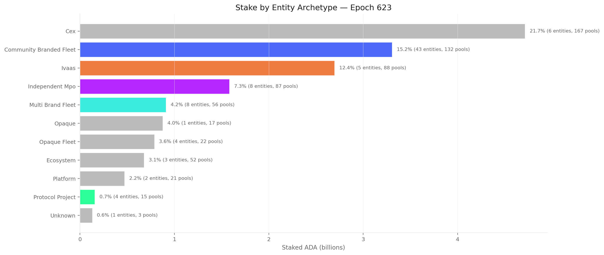
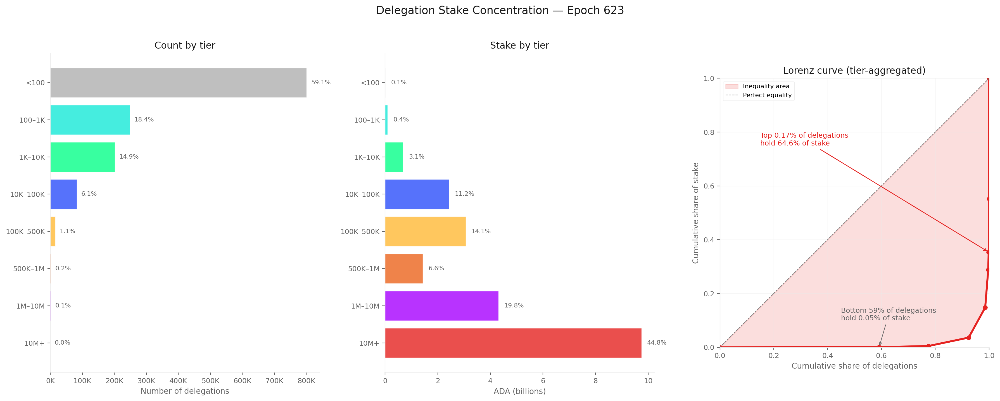
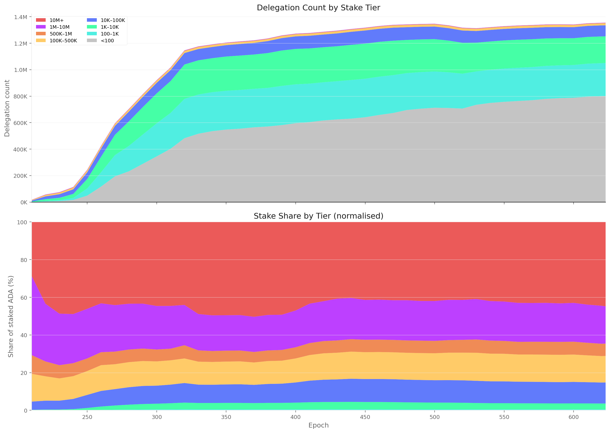

# The Staking Census — Populations, Capital, and Participation on Cardano Mainnet

_Built on 2026/04/09 from db-sync snapshot at epoch 623._

## Table of Contents

- [Objective](#objective)
- [Data sources](#data-sources)
- [Methodology note — iterative cleaning](#methodology-note--iterative-cleaning)
- [1. The ADA Supply](#1-the-ada-supply)
- [2. Pool Operators](#2-pool-operators)
  - [2.1 Raw query](#21-raw-query)
  - [2.2 Cleaning — production threshold](#22-cleaning--production-threshold)
  - [2.3 SPO vs MPO — current snapshot](#23-spo-vs-mpo--current-snapshot)
  - [2.4 Entity attribution layer](#24-entity-attribution-layer)
  - [2.5 Cleaning — entity attribution on stake](#25-cleaning--entity-attribution-on-stake)
  - [2.6 Remaining noise (future passes)](#26-remaining-noise-future-passes)
- [3. Delegators](#3-delegators)
  - [3.1 Raw query](#31-raw-query)
  - [3.2 Cleaning — certificates ≠ capital](#32-cleaning--certificates--capital)
  - [3.3 Cleaning — operator vs sovereign](#33-cleaning--operator-vs-sovereign)
  - [3.4 Cleaning — delegation choice quality](#34-cleaning--delegation-choice-quality)
  - [3.5 Cleaning — stake segmentation](#35-cleaning--stake-segmentation)
  - [3.6 Remaining noise (future passes)](#36-remaining-noise-future-passes)
- [4. Non-Participants](#4-non-participants)
- [5. Synthesis](#5-synthesis)
  - [Key metrics](#key-metrics-epoch-623)
  - [Concentration headline](#concentration-headline)
  - [Noise removal log](#noise-removal-log)
  - [What remains noisy](#what-remains-noisy)
- [6. Bridges to Companion Analyses](#6-bridges-to-companion-analyses)
  - [6.1 Distribution efficiency (epoch 616)](#61-distribution-efficiency-epoch-616)
  - [6.2 Operator's cut (epoch 614)](#62-operators-cut-epoch-614)
  - [6.3 Main report (epochs 548–583)](#63-main-report-epochs-548583)
  - [6.4 Reconciliation summary](#64-reconciliation-summary)

## Objective

This report maps the full population of actors in the Cardano staking ecosystem — and those absent from it. Before analysing how rewards are shared (the companion [*Pools Pot Distribution*](../../pools-distribution/mainnet-analysis/) and [*Operator's Cut*](../../operator-delegator-distribution/mainnet-analysis/) reports), it is necessary to understand *who* is on the field, *how many* they are, and *how much capital* each population controls — and how all three have evolved since the Shelley hard fork.

## Data sources

All data comes from **cardano-db-sync** (PostgreSQL, snapshot at epoch 623). No third-party API.

| Table | Content |
|---|---|
| `ada_pots` | Per-epoch supply decomposition: reserve, treasury, circulating, UTxO, unclaimed rewards, deposits |
| `epoch_stake` | Per-epoch staking snapshot: total staked per delegation, ~560M rows |
| `delegation` | Individual delegation certificates: addr → pool |
| `pool_update` + `pool_owner` | Pool registration history and owner keys |
| `stake_deregistration` | Stake key deregistration events |

## Methodology note — iterative cleaning

The raw db-sync tables contain structural noise that must be understood and progressively removed before drawing conclusions. Rather than presenting only a final "clean" picture, this document shows each cleaning pass explicitly: what noise was identified, what was done about it, and how the numbers changed. This makes the analytical choices visible and auditable.

Each section therefore follows a **raw → clean** structure:
the raw query result is shown first, then the noise is named, then the cleaned version is presented.

## 1. The ADA Supply

The Cardano monetary policy fixes the maximum supply at 45 billion ADA. At epoch 623, the circulating supply has reached 36.88B, with 6.45B remaining in the reserve and 1.66B accumulated in the treasury. Monetary expansion — the rate at which reserve ADA enters circulation — decays geometrically.

At epoch 623: **21.75B ADA** staked out of **36.88B** circulating = **59.0%** staking rate. The remaining **15.13B ADA** (41.0%) does not participate in staking — this population is decomposed in §4.

The top panel shows the staked/unstaked decomposition of circulating supply with the staking rate (red line, right axis). The rate peaked near 71% around epoch 260 and has been declining gently, driven by circulating supply growth outpacing new stake inflows.

## 2. Pool Operators

### 2.1 Raw query

The pool count from epoch_stake peaked at **3,160** (epoch 331) and currently stands at **2,877**. This counts only pools that appear in the staking snapshot with non-zero delegated stake — the registration-certificate count of 5,919 includes 3,042 empty pools and is discarded (see §3.2 for the full rationale).

The k=500 reference line shows the protocol's target number of pools (the saturation parameter). The actual pool count has been ~5.8× k since epoch 330, though many of these pools carry negligible stake.

### 2.2 Cleaning — production threshold

A pool must hold enough stake to expect at least one block per epoch. With ~21,600 blocks per epoch and 21.75B total staked ADA, the production threshold is approximately **1M ADA** per pool.

| Segment | Pools | Share of pools | Stake | Share of stake | Delegations |
|---|---|---|---|---|---|
| Above threshold (≥1M ADA) | 951 | 33.1% | 21.57B | 99.14% | 1,295,095 (95.6%) |
| Below threshold (<1M ADA) | 1,926 | 66.9% | 0.19B | 0.86% | 59,940 (4.4%) |

Two thirds of all pools are below the production threshold. Together they hold less than 1% of staked ADA. Their 59,940 delegators collectively control 188M ADA — a negligible share that earns intermittent and unpredictable rewards.

Below-threshold pool breakdown by stake:

| Tier | Pools | Stake |
|---|---|---|
| < 1K ADA | 778 | 0.1M |
| 1K–10K | 394 | 1.4M |
| 10K–100K | 323 | 12.4M |
| 100K–500K | 286 | 69.0M |
| 500K–1M | 144 | 104.3M |

The median below-threshold pool holds just 2,547 ADA. Three quarters hold less than 68K ADA — orders of magnitude below what is needed for regular block production.

**After cleaning:** the productive pool count drops from 2,877 to **951** — closer to, but still ~1.9× the protocol's k=500 target.

### 2.3 SPO vs MPO — current snapshot

Using the latest `pool_update` registration and `pool_owner` keys to group pools by controlling entity:

| Category | Pools | Entities | Share of pools |
|---|---|---|---|
| Single-pool operators | 5,956 | 5,956 | 97.3% |
| Multi-pool operators | 165 | 77 | 2.7% |

MPO entity breakdown: 69 entities running 2 pools, 6 entities running 3 pools, 1 entity running 4 pools, 1 entity running 5 pools.

### 2.4 Entity attribution layer

The on-chain owner-key classification (§2.3) is a lower bound. A deeper attribution, combining on-chain metadata, ticker naming patterns, relay DNS, reward addresses, and public disclosures, identifies **85 named MPO entities** controlling **901 pools** and **~16.4B ADA** — 75.4% of all staked capital (epoch 618). This analysis lives in the entity data merged into this census folder.

Key entity archetypes:

| Archetype | Entities | Pools | Description |
|---|---|---|---|
| Community branded fleet | 43 | — | Named operators with public identity and branded pool families |
| CEX custody | 6 | — | Exchange-operated pools (Binance, Coinbase, Kraken, etc.) |
| IVaaS | 5 | — | Infrastructure-as-a-Service (Figment, Blockdaemon, Kiln, etc.) |
| Protocol project | 4 | — | Pools run by Cardano-native projects |
| Independent MPO | 9 | — | Multi-pool operators without strong public branding |

The full entity profiles, pool-level mappings, and archetype classifications are in:
- [`data/mpo_entity_pool_mapping_mainnet.csv`](data/mpo_entity_pool_mapping_mainnet.csv) — pool → entity attribution
- [`data/mpo_entity_archetypes.csv`](data/mpo_entity_archetypes.csv) — entity → archetype classification
- [`data/mpo_entity_summary_mainnet.csv`](data/mpo_entity_summary_mainnet.csv) — per-entity metrics
- [`docs/mpo_entity_profiles.md`](docs/mpo_entity_profiles.md) — detailed entity profiles
- [`profiles/`](profiles/) — individual entity profile cards

### 2.5 Cleaning — entity attribution on stake

Crossing the entity pool mapping (§2.4) with epoch_stake at epoch 623, restricted to the **951 productive pools** (§2.2), reveals who stands behind the aggregate numbers. The 1,926 sub-threshold pools are excluded — they carry 0.86% of stake and contribute noise without signal.

**Attribution coverage (productive pools only):**

| Segment | Pools | Stake | Share of productive stake |
|---|---|---|---|
| Attributed to named entities | 474 | 16.29B ADA | 75.5% |
| Unattributed (single-pool operators) | 477 | 5.28B ADA | 24.5% |

The productive landscape splits almost evenly by pool count (474 vs 477) but is heavily skewed by stake: attributed entities control three quarters of productive stake through half the pools.

**By archetype (productive pools):**

| Archetype | Stake | Share | Entities | Pools |
|---|---|---|---|---|
| CEX custody | 4.71B | 21.8% | 6 | 119 |
| Community branded fleet | 3.30B | 15.3% | 43 | 107 |
| IVaaS | 2.69B | 12.5% | 4 | 61 |
| Independent MPO | 1.57B | 7.3% | 7 | 57 |
| Multi-brand fleet | 0.91B | 4.2% | 8 | 43 |
| Opaque fleet | 0.88B | 4.1% | 1+4 | 13+22 |
| Ecosystem steward | 0.68B | 3.1% | 3 | 17 |
| Platform/wallet | 0.47B | 2.2% | 2 | 20 |
| Protocol project | 0.16B | 0.7% | 4 | 12 |

**Top entities by stake (productive pools):**

| Entity | Stake | Share | Pools | Delegations |
|---|---|---|---|---|
| Coinbase / bison.run | 2.38B | 11.0% | 41 | 410 |
| CHUCK BUX | 0.88B | 4.1% | 13 | 13 |
| Figment | 0.88B | 4.1% | 26 | 32,517 |
| Binance | 0.69B | 3.2% | 20 | 839 |
| Kiln | 0.63B | 2.9% | 10 | 35,529 |
| Blockdaemon | 0.61B | 2.8% | 12 | 265 |
| Wave / Wavepool | 0.61B | 2.8% | 14 | 9,384 |
| Upbit | 0.57B | 2.7% | 20 | 28 |
| Everstake | 0.57B | 2.6% | 13 | 265,287 |
| eToro | 0.47B | 2.2% | 11 | 37 |

Filtering to productive pools sharpens the entity picture: Coinbase drops from 47 to 41 pools (6 below threshold), Figment from 37 to 26, Kiln from 11 to 10. The stake numbers barely change — the sub-threshold pools carried negligible capital — but the pool counts now reflect the operational reality.

### 2.6 Remaining noise (future passes)

This SPO/MPO classification is based solely on shared owner keys in on-chain certificates. It is a *lower bound* on multi-pool operation — entities using separate keys for each pool are classified as SPO. The real MPO count is certainly higher. Cross-referencing with off-chain metadata (ticker naming patterns, relay IP addresses, entity self-declarations) would tighten this. Additionally, the classification is a current-epoch snapshot; historical SPO/MPO decomposition requires reconstructing the owner-key graph per epoch.

## 3. Delegators

### 3.1 Raw query

Two db-sync tables count "delegators" in different ways:

| Source | What it counts | Epoch 623 value |
|---|---|---|
| `epoch_stake` aggregation | Rows with non-zero stake in the epoch snapshot | **1,355,035 delegations** across **2,877 pools** |
| `delegation` table reconstruction | Active delegation certificates (regardless of balance) | **1,847,713 addresses** across **5,919 pools** |

The gap: ~493K addresses hold an active delegation certificate but have zero balance in the epoch_stake snapshot. Similarly, ~3,042 registered pools have delegation certificates pointing at them but carry no actual stake.

The delegation count from epoch_stake has grown from ~17K at epoch 210 to **1,355,035** at epoch 623.

The top panel shows the absolute count. The bottom panel shows epoch-over-epoch change: green bars are net gains, red bars are net losses. The orange line is a 10-epoch rolling average. Growth was fastest in the first 100 epochs, then transitioned to a steadier near-linear regime. Over the last 10 epochs: **+3,070** net new delegations.

### 3.2 Cleaning — certificates ≠ capital

A delegation certificate is a *declaration of intent*. An epoch_stake row is *capital at work*. For a staking census, only the latter matters: an address with a certificate but no ADA is not participating in consensus, earns no rewards, and should not be counted as a delegator.

**Decision:** use `epoch_stake` as the single source of truth for all participation counts. The delegation-table numbers are preserved in `data/delegator_pool_count_per_epoch.csv` as raw reference, but all figures and analysis use epoch_stake exclusively.

| Metric | Raw (delegation table) | Clean (epoch_stake) | Noise removed |
|---|---|---|---|
| Active delegations | 1,847,713 | **1,355,035** | 492,678 certificate ghosts (26.7%) |
| Active pools | 5,919 | **2,877** | 3,042 empty pools (51.4%) |

### 3.3 Cleaning — operator vs sovereign

The 1,355,035 delegations in epoch_stake mix two structurally different populations: pool operators delegating their own capital (pledge/owner stake) and sovereign delegators who simply choose a pool. Using the `pool_owner` table to identify stake addresses registered as pool owners and cross-referencing with epoch_stake at epoch 623:

| Category | Delegations | Share of count | Stake | Share of stake | Avg ADA | Median ADA |
|---|---|---|---|---|---|---|
| Operator → own pool | 3,254 | 0.24% | 2.95B | 13.6% | 907,755 | 1,298 |
| Operator → other pool | 380 | 0.03% | 0.02B | 0.1% | 63,398 | 328 |
| **Sovereign delegators** | **1,351,401** | **99.73%** | **18.78B** | **86.3%** | **13,894** | **31** |

Three findings stand out.

First, the operator population is tiny (3,634 addresses, 0.27% of delegations) but controls 13.7% of all staked ADA — almost entirely through self-delegation to their own pools (2.95B of the 2.98B total). These are the pledge commitments that underpin the a0 incentive mechanism.

Second, the median operator self-delegation is just **1,298 ADA** while the average is **908K ADA**. This extreme skew means a small number of large pledgers (exchanges, IVaaS providers) pull the average up, while the majority of pool operators have negligible skin in the game. This connects directly to the "hollow operator" finding in the companion Operator's Cut analysis.

Third, 380 pool owners delegate to *someone else's* pool rather than their own — abandoning their pledge incentive entirely. Their median delegation (328 ADA) confirms these are effectively dormant operator keys.

**After cleaning:** the sovereign delegator population stands at **1,351,401** delegations controlling **18.78B ADA** (86.3% of staked capital). All subsequent delegator analysis operates on this population.

**Custodial-signature pools.** Pools with very few delegations but large amounts betray a custodial structure: a single omnibus wallet (or a handful) holds capital on behalf of many end-users. Filtering for pools with ≤20 delegations and ≥10M ADA total stake isolates this population:

| Segment | Pools | Delegations | Stake | Share of stake |
|---|---|---|---|---|
| Custodial signature (≤20 deleg, ≥10M) | 154 | 853 | 6.98B | 32.1% |
| Organic (everything else) | 2,723 | 1,354,182 | 14.77B | 67.9% |

154 pools hold a third of all staked ADA through just 853 on-chain delegations. The entity breakdown confirms the custodial nature:

| Entity | Pools | Delegations | Stake | Avg per deleg |
|---|---|---|---|---|
| Coinbase / bison.run | 36 | 231 | 2.14B | 9.3M |
| CHUCK BUX | 13 | 13 | 0.88B | 67.5M |
| Upbit | 20 | 28 | 0.57B | 20.5M |
| Binance | 18 | 212 | 0.57B | 2.7M |
| Figment | 14 | 62 | 0.50B | 8.1M |
| eToro | 10 | 31 | 0.47B | 15.1M |
| Cardano Foundation | 6 | 28 | 0.40B | 14.1M |
| Blockdaemon | 6 | 32 | 0.32B | 10.0M |

Each of these "delegations" — averaging millions to tens of millions of ADA — represents an unknown number of underlying users. The 1,355,035 on-chain delegations are therefore a lower bound for some populations (retail wallets, where one stake key = one person) and an upper bound for others (custodial accounts, where one delegation = thousands of users). The true number of staking participants is unknowable from on-chain data alone.

### 3.4 Cleaning — delegation choice quality

The protocol's incentive design rewards delegators who choose pools with specific characteristics: near saturation (40–100% of the k=500 cap, i.e. ~17–43.5M ADA), low operator take (margin ≤5%, fixed cost ≤500 ADA), and reliable block production. Classifying pools on these observable parameters — using ROS data from Koios over epochs 606–615 — reveals whether delegators are following the design:

| Choice quality | Pools | Delegations | Stake | Share of stake | Median ROS |
|---|---|---|---|---|---|
| Design-aligned | 211 | 668,366 | 11.12B | 51.1% | 2.23% |
| Reasonable | 238 | 408,309 | 4.55B | 20.9% | 2.11% |
| Suboptimal | 585 | 162,746 | 4.57B | 21.0% | 2.07% |
| Over-saturated | 9 | 59,542 | 0.70B | 3.2% | 2.05% |
| Non-productive | 1,834 | 56,072 | 0.81B | 3.7% | — |

**Design-aligned** pools (saturation 40–100%, margin ≤5%, fixed cost ≤500, blocks in ≥7 of last 10 epochs) attract roughly half of all delegations and half of all staked ADA. These 211 pools are where the incentive mechanism works as intended: delegators earn the best risk-adjusted returns, and the protocol achieves its target distribution of stake across a healthy pool set.

**Reasonable** pools (saturation 10–100%, margin ≤10%, blocks in ≥4/10 epochs) attract another 30% of delegations. These pools are functional but either undersized, slightly more expensive, or less reliable.

**Suboptimal** choices account for 21% of stake: pools that produce blocks but fail one or more design criteria — undersaturated pools far below viability, or pools with high margins that extract returns from their delegators.

The remaining 7% of stake sits in over-saturated pools (9 pools above the saturation cap, where additional stake earns diminishing returns) or non-productive pools (1,834 pools with no meaningful block production in recent epochs — the same population identified in §2.2).

The ROS differential between design-aligned and suboptimal is modest (~0.16 pp annual) — the protocol's reward curve is intentionally flat near the optimum to avoid cliff effects. But this masks the real cost: non-productive pools earn zero or near-zero returns, and over-saturated pools cap their delegators' rewards regardless of stake size.

### 3.5 Cleaning — stake segmentation

The delegation count alone hides extreme heterogeneity. A delegation of 4 ADA and a delegation of 31M ADA both count as "1 delegation" — but they represent fundamentally different actors with different economic weight and different behavioural drivers.

Querying `epoch_stake` at epoch 623 for the full amount distribution (1,355,035 rows) reveals eight natural tiers:

| Tier | Delegations | Share of count | Staked ADA | Share of stake | Median ADA |
|---|---|---|---|---|---|
| <100 ADA | 801,067 | 59.1% | 0.01B | 0.05% | 4 |
| 100–1K | 249,181 | 18.4% | 0.09B | 0.4% | 302 |
| 1K–10K | 201,797 | 14.9% | 0.68B | 3.1% | 2,543 |
| 10K–100K | 83,307 | 6.1% | 2.43B | 11.2% | 21,245 |
| 100K–500K | 15,347 | 1.1% | 3.06B | 14.1% | 164,371 |
| 500K–1M | 2,092 | 0.2% | 1.43B | 6.6% | 645,977 |
| 1M–10M | 1,926 | 0.1% | 4.31B | 19.8% | 1,575,858 |
| 10M+ | 318 | 0.02% | 9.75B | 44.8% | 31,781,076 |

The concentration is extreme: the **top 0.17%** of delegations (mega + titan tiers: 2,244 delegations) control **64.6%** of all staked ADA. The **bottom 59%** (micro tier: 801K delegations with <100 ADA each) collectively hold **0.05%** of stake. The tier-aggregated Gini coefficient is **0.974** — close to the theoretical maximum of 1.

The historical evolution of tier composition shows the structure is stable:

The top panel shows the absolute count growth: almost all the population expansion since epoch 250 has come from the micro tier (<100 ADA) — accounts with negligible economic stake. The bottom panel normalises to share of staked ADA: the titan tier (10M+) has consistently held 40–50% of all staked ADA since the Shelley launch, and this share has been remarkably stable.

**Verification of main report claim.** The main report states "~4,500 wallets holding >500K ADA each control 68.5% of delegated stake." The census finds 4,336 delegations above 500K ADA (whale + mega + titan), controlling 71.2% of staked ADA. The discrepancy is consistent with epoch drift (548–583 vs 623) and minor methodology differences. The qualitative conclusion holds: a tiny fraction of addresses controls the vast majority of staked capital.

### 3.6 Remaining noise (future passes)

The segmentation above still conflates distinct economic actors. A custodial exchange operating as a single titan delegation (e.g., 50M ADA) represents thousands of underlying users, while a whale running 10 addresses of 5M each appears as 10 mega delegations.

The entity attribution (§2.5) resolves the *pool operator* side but not the *delegator* side. The 1,355,035 delegations include both sovereign wallets and exchange-custodied accounts. A Coinbase delegation of 50M ADA is one on-chain row but represents many thousands of end-users. Decomposing delegation tiers into sovereign vs custodial requires correlating with known exchange pool IDs — the entity mapping provides the pool-level anchor, but the delegator-level attribution (how many of the titan-tier delegations delegate to exchange pools?) is the next frontier.

## 4. Non-Participants

The 41% of circulating ADA that is unstaked (15.13B ADA at epoch 623) is not a uniform population. It includes exchange cold wallets holding ADA that users have not opted to stake, smart-contract-locked ADA (DeFi protocols, DEX liquidity pools), and dormant wallets that have seen no activity since before the Shelley hard fork.

Decomposing this requires UTxO-level analysis — mapping unspent outputs to address types (base, script, enterprise) and cross-referencing with known exchange addresses. This is planned for a subsequent cleaning pass.

## 5. Synthesis

### Key metrics (epoch 623)

| Metric | Value | Source |
|---|---|---|
| Circulating supply | 36.88B ADA | ada_pots |
| Staked | 21.75B ADA (59.0%) | epoch_stake |
| Unstaked | 15.13B ADA (41.0%) | computed |
| Active delegations | 1,355,035 | epoch_stake |
| Active pools | 2,877 | epoch_stake |
| Single-pool operators | 5,956 pools | pool_owner (current snapshot) |
| Multi-pool operators | 165 pools / 77 entities | pool_owner (current snapshot) |
| Delegations per pool | ~471 | epoch_stake |
| ADA per delegation | ~16,050 ADA | epoch_stake |
| Gini coefficient (stake concentration) | 0.974 | tier-aggregated Lorenz |

### Concentration headline

| Population slice | Count | Share of delegations | Stake | Share of stake |
|---|---|---|---|---|
| Titan (10M+ ADA) | 318 | 0.02% | 9.75B | 44.8% |
| Mega + Titan (1M+) | 2,244 | 0.17% | 14.05B | 64.6% |
| Micro (<100 ADA) | 801,067 | 59.1% | 0.01B | 0.05% |

### Noise removal log

| Section | What changed | Impact |
|---|---|---|
| §2 Pool Operators | Removed pools below production threshold (~1M ADA) | Productive pools: 2,877 → 951 (−67%). Removed pools carry 0.86% of stake. |
| §2 Pool Operators | Crossed entity attribution with pool stake | 85 named entities → 75.0% of staked ADA. CEX custody alone = 21.7%. Top entity (Coinbase) = 10.9%. |
| §3 Delegators | Switched from delegation certificates to epoch_stake | Delegator count: 1.85M → 1.36M (−27%). Pool count: 5,919 → 2,877 (−51%). |
| §3 Delegators | Separated operator self-delegation from sovereign delegators | 3,634 operator addresses (0.27%) hold 2.98B ADA (13.7%). Sovereign population: 1,351,401 delegations, 18.78B ADA. |
| §3 Delegators | Identified custodial-signature pools (≤20 deleg, ≥10M ADA) | 154 pools hold 32.1% of stake through 853 delegations. Each "delegation" represents an omnibus custody wallet, not a sovereign user. |
| §3 Delegators | Classified delegation choice quality against protocol design | 51.1% of stake in design-aligned pools (211 pools). 21% in suboptimal choices. 3.7% in non-productive pools. |
| §3 Delegators | Segmented delegations by stake size | Revealed extreme concentration: 0.17% of delegations hold 64.6% of stake. Bottom 59% hold 0.05%. |

### What remains noisy

1. **Non-participant decomposition** (§4) — the 41% unstaked ADA is a mix of exchanges, smart contracts, and dormant wallets. Need UTxO-level queries.
2. **Delegator-side entity attribution** — which delegation tiers delegate to exchange pools vs independent pools? The pool-side is resolved; the delegator-side is not.
3. **Historical SPO/MPO** — current snapshot only. Need per-epoch owner-key reconstruction.

## 6. Bridges to Companion Analyses

This census provides the population denominators that the companion reports take as inputs. Below, each key statistic in the other documents is traced back to its census origin — and discrepancies between documents are made explicit.

### 6.1 Distribution efficiency (epoch 616)

The pools-distribution analysis (`pools-distribution/mainnet-analysis/`) decomposes the pools pot into three channels at epoch 616:

| Component | Share | Census root |
|---|---|---|
| Participation gap | 33.5% | = λ_min × (1 − staking_rate). Census staking rate at epoch 616: ~59.3%. With λ_min = 1/(1+a0) = 1/1.3 ≈ 0.769, gap = 0.769 × 0.407 ≈ 31.3%. The 33.5% figure uses the exact `ada_pots` supply rather than the rounded rate. |
| Bonus budget unused | 22.5% | = λ_max − bonus_captured. λ_max = a0/(1+a0) = 0.3/1.3 ≈ 23.1%. The 22.5% means almost all the bonus budget goes uncaptured — pools collectively fail to meet pledge thresholds. |
| Distributed | 43.7% | = pot − gap − bonus_unused − pledge_shortfall. This is what actually reaches delegators and operators. |

The participation gap is a *direct function of the staking rate measured in this census*. Every percentage point the staking rate drops increases the gap by ~0.77 pp (via the λ_min multiplier).

**Epoch drift.** The distribution analysis uses epoch 616, this census goes to 623. The staking rate moved from ~59.3% (616) to 59.0% (623) — a 0.3 pp decline over 7 epochs. The participation gap is therefore slightly worse at 623 than the 33.5% reported at 616.

### 6.2 Operator's cut (epoch 614)

The operator-delegator analysis (`operator-delegator-distribution/mainnet-analysis/`) reports 1,270,903 active delegation relationships at epoch 614. The census epoch_stake count at 614 would be ~1,353K (interpolating from the time-series). The difference arises because the operator analysis filters to pools that actually earned rewards in the epoch, excluding pools with zero blocks.

| Operator's Cut metric | Value | Census anchor |
|---|---|---|
| 445 hollow entities | Operators with <10% owner stake | Census SPO/MPO classification is a lower bound — the operator doc uses a richer entity mapping with 677 pools across 26 known entities |
| 48 "functionally private" pools | Margin ≥ 99.9% | Not visible in census — requires reward-parameter analysis |
| 7.7% genuine hollow take | Fixed cost 4.4% + margin 3.6% | Denominator is per-pool rewards, which depends on census pool count × stake distribution |

### 6.3 Main report (epochs 548–583)

The main report (`spo_incentives/report.tex`) uses an older analysis window (epochs 548–583) and Koios-sourced data:

| Main report metric | Value | Census comparison (epoch 623) |
|---|---|---|
| Staking rate | ~57.4% | Census: 59.0%. The 1.6 pp gap is real temporal drift — the rate has recovered slightly since the 548–583 window. |
| Active delegations | ~1.27M | Census: 1.355M. Growth of ~85K delegations over ~40 epochs. |
| Whale concentration | 4,500 wallets → 68.5% of stake | Census: 4,336 delegations >500K → 71.2%. Consistent with epoch drift. |
| Pool tiers: 741 healthy, 627 struggling, 1,305 inactive | Based on cumulative rewards + stake thresholds | Census active-pool count (2,877 at epoch 623) is consistent: 741 + 627 + 246 + 1,305 = 2,919 ≈ 2,877 (epoch drift + methodology delta). |

### 6.4 Reconciliation summary

The companion documents were built at different epochs with different data sources. This census standardises on db-sync at epoch 623 and epoch_stake as the counting method. The key numerical shifts when porting companion stats to census methodology:

| What changes | Old value | Census value | Why |
|---|---|---|---|
| "Delegator" count | 1.85M (certificates) | 1.355M (epoch_stake) | Certificate ghosts removed |
| Pool count | 5,919 (certificates) | 2,877 (epoch_stake) | Empty pools removed |
| Staking rate | 57.4% (epochs 548–583) | 59.0% (epoch 623) | Temporal drift + source alignment |
| Delegation count | 1.27M (epoch 614, reward-earning pools only) | 1.355M (epoch 623, all staked pools) | Scope + epoch drift |

The participation gap, distribution efficiency, and operator-take calculations all chain off these population numbers. Cleaning the census denominators propagates through every downstream metric.
