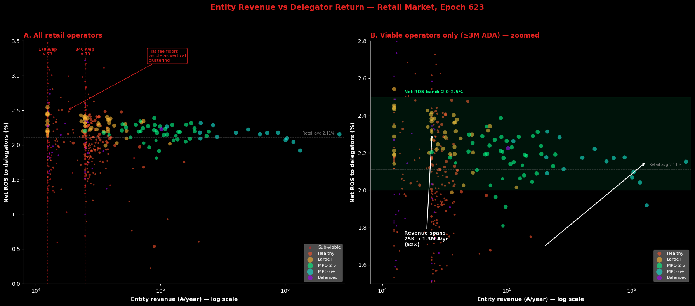
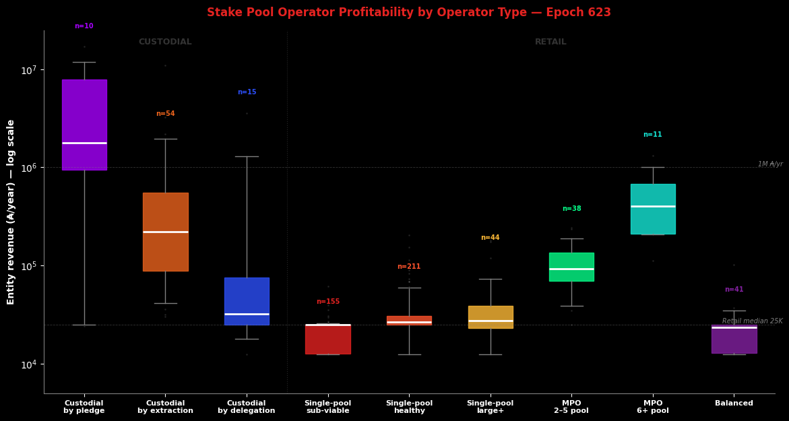

# The Operator's Cut — A Mainnet Analysis of Intra-Pool Reward Sharing

_Built on 2026/04/14 from mainnet data at epoch `623` plus historical analysis from epoch `211` (413 epochs)._

## Objective

This report analyses the **intra-pool reward split** — the third and final stage of Cardano's reward pipeline — and traces the structural forces that determine how much of each pool's reward reaches delegators versus operators. It extends the empirical baseline established in the [*Analysis of Cardano's Incentive Mechanism*](https://github.com/input-output-hk/spo-incentives/blob/main/report.pdf) (Lopez de Lara, 2025; hereafter the *Incentive Mechanism Analysis*) and operates downstream of the companion reports [*Treasury & Pool Pots Distribution*](../../treasury-and-pool-pots-distribution/mainnet-analysis/) (stage 1) and [*The Pools Pot Distribution Gaps*](../../pools-distribution/mainnet-analysis/) (stage 2).

Every epoch, once the reward curve assigns a total reward to each pool, a second mechanism activates: the **intra-pool split**. The pool operator extracts a **flat fee** (a fixed ₳ amount) and a **commission** (a proportional share); the remainder is distributed pro-rata among all delegators (including the operator's own stake). Together the flat fee and commission compose the operator's **pricing plan**; their sum — the **effective price** — is the fraction of pool reward that never reaches delegators. At epoch 623, 952 productive pools process 21.57B ADA of staked capital. After filtering the 21% of stake that is custodial (where the operator controls delegation addresses), the retail market consists of 809 pools, 516 entities, 17.02B ADA, and 1,272,836 delegators — with a median delegation of 87 ₳.

The central finding is a double asymmetry. Delegators in sub-viable pools pay 48.3% effective price for 2.04% net return; delegators in near-saturation pools pay 2.7% for 2.34% — 18× the price for 0.30 percentage points of return. On the operator side, the sub-viable operator absorbs 48.3% of pool rewards but earns 24,820 ₳/yr; an 11+ pool MPO absorbs 7.7% but earns 1,035,496 ₳/yr — 42× more revenue at 6× less price. The flat fee — a mechanism unique to Cardano — penalises small-pool delegators without compensating small-pool operators, and the return signal it produces is too narrow to drive delegation decisions. This challenges the incentive mechanism's core assumption: that delegators can differentiate pools by return.

The argument proceeds in four parts:

1. **The formula** (§2). The SL-D1 intra-pool reward-sharing specification — from the original design through a residual-split decomposition to a reader-friendly rewrite and mainnet parameterisation. The mechanism is sequential: flat fee first, commission on the remainder, then pro-rata distribution.

2. **The productive and viable populations** (§3). The scope and epoch: 952 productive pools (≥ 1M ADA) carrying 99.1% of stake and 95.6% of delegations. The operator and delegator sides of the population, from raw certificates to the viable threshold.

3. **The pricing plan landscape** (§4). The flat fee, the commission, the custodial/retail boundary (using per-pool median delegation from db-sync), and the retail effective price. The operator's profitability versus the delegator's return.

All counts and amounts use epoch **623**. Source data: `pool_choice_quality_623.csv`, `pool_median_delegation_623.csv` (db-sync `epoch_stake`), `reward_split_snapshot_623.csv` (synthetic, estimated from epoch 614 reward rate), `koios_pool_history_mainnet.csv`, `mpo_entity_pool_mapping_mainnet.csv`.

## Contents

1. [Mainnet Observations](#1-mainnet-observations)
2. [The formula — intra-pool reward sharing](#2-the-formula--intra-pool-reward-sharing)
   - 2.1 [SL-D1 (Original)](#21-sl-d1-original)
   - 2.2 [Residual split decomposition](#22-residual-split-decomposition)
   - 2.3 [Reader-friendly formulation](#23-reader-friendly-formulation)
   - 2.4 [Mainnet parameterization](#24-mainnet-parameterization)
   - 2.5 [Concept glossary](#25-concept-glossary)
3. [The productive and viable populations](#3-the-productive-and-viable-populations)
   - 3.1 [Operators](#31-operators)
      - 3.1.1 [From raw to productive](#311-from-raw-to-productive)
      - 3.1.2 [From productive to viable](#312-from-productive-to-viable)
   - 3.2 [Delegators](#32-delegators)
      - 3.2.1 [From raw to productive](#321-from-raw-to-productive)
      - 3.2.2 [From productive to viable](#322-from-productive-to-viable)
4. [The pricing plan landscape](#4-the-pricing-plan-landscape)
   - 4.1 [The flat fee (fixed cost)](#41-the-flat-fee-fixed-cost)
   - 4.2 [The commission (margin)](#42-the-commission-margin)
   - 4.3 [Custodial versus retail](#43-custodial-versus-retail)
      - 4.3.1 [Clear custodial — by pledge and by extraction](#431-clear-custodial--by-pledge-and-by-extraction)
      - 4.3.2 [Custodial by delegation — the high-concentration signal](#432-custodial-by-delegation--the-high-concentration-signal)
      - 4.3.3 [Summary](#433-summary)
   - 4.4 [Operator profitability versus delegator return](#44-operator-profitability-versus-delegator-return)

## 1. Mainnet Observations

_Terminology note._ The protocol uses "fixed cost" and "margin" for the two extraction channels. This report adopts pricing-plan terminology: the fixed cost is the **flat fee** (a fixed ₳/epoch amount), the margin is the **commission** (a proportional share), and their sum — the operator take — is the **effective price** the delegator faces. The on-chain parameter names appear in §2 (the formula) and at first use in §4. Everywhere else, the pricing-plan terms apply.

| # | Observation | Section | Nature |
| --- | --- | --- | --- |
| | **O1 — The flat fee dominates operator revenue but operators do not actively set it** | | |
| F1.1 | The flat fee accounts for 60% of all operator revenue in the retail market; the commission accounts for 40% | §4.4 | Structural — the passive channel dominates the active one |
| F1.2 | 64% of pools still declare the former floor (340 ₳) — 178 epochs after a governance action halved it to 170 ₳ | §4.1 | Governance inertia — driven by the largest entities |
| F1.3 | 89.5% of pools declare one of two floor values (170 or 340 ₳); "custom" values are mostly near-floor inertia (Binance 345, Everstake 400) or extraction | §4.1 | The flat fee is a binary choice, not a pricing parameter |
| F1.4 | The flat fee follows a $1/\sigma$ hyperbola: 47.5% of pool reward at the sub-viable tier, 1.5% at near-saturation. No other major PoS protocol uses a flat fee | §4.1 | Unique to Cardano — regressive by design |
| | **O2 — The commission market is bimodal with an empty middle** | | |
| F2.1 | 87% of pools set a commission at or below 10%; 12% set ≥ 99% (privatisation). The 89pp range between 10% and 99% contains 12 pools | §4.2 | No man's land — no economic attractor exists between pricing and extraction |
| F2.2 | Four bands: no-commission (170 pools, 17.9%), competitive (658, 69.1%), no man's land (12, 1.3%), privatisation (112, 11.8%) | §4.2 | The market self-organises into discrete tiers |
| | **O3 — 21% of productive stake is custodial — three mechanisms, three economics** | | |
| F3.1 | 79 entities operating 143 pools (4.55B, 21.1%) are custodial: by pledge (10 entities, 36 pools, 1.59B), by extraction (57 entities, 79 pools, 2.04B), by delegation (15 entities, 28 pools, 0.92B) | §4.3 | Three distinct mechanisms — each detectable from on-chain observables |
| F3.2 | Custodial-by-delegation uses the per-pool **median** delegation (db-sync `epoch_stake`) ≥ 100K ₳ — the amount held by the typical delegator. A delegation of 50K ₳ is already in the top 1.5% of the network | §4.3.2 | The median measures the delegator's experience, not capital concentration |
| F3.3 | Custodial-by-pledge entities earn 1,759,252 ₳/yr median — they capture 100% of rewards on self-funded pools. Custodial-by-extraction entities earn 281,831 ₳/yr — privatisation commission on pools with inert delegators. Custodial-by-delegation entities earn 29,329 ₳/yr — small whale pools, not revenue machines | §4.3.3 | Each custodial mechanism produces a different economic outcome |
| | **O4 — The retail market is 79% of stake and the typical delegator holds 87 ₳** | | |
| F4.1 | 809 retail pools, 516 entities, 17.02B ADA, 1,272,836 delegators. This includes institutional operators (Coinbase, Binance, Kiln) — retail by median delegation | §4.3.3 | The retail market is larger than the mean-based estimate suggested |
| F4.2 | The median retail delegation is 87 ₳ — remarkably uniform across operator types (45–962 ₳ range) | §4.4 | Retail delegators are small and homogeneous |
| | **O5 — Delegators pay 18× more for the same return** | | |
| F5.1 | A delegator in a sub-viable pool pays 48.3% effective price and receives 2.04% net return. A delegator in a near-saturation pool pays 2.7% and receives 2.34%. 18× more for 0.30pp of return | §4.4 | The effective price is a mechanical artefact of pool size, not a market signal |
| F5.2 | Net return converges to 1.95–2.34% across the entire retail market regardless of effective price, operator type, or pool size | §4.4 | The return signal is too weak to drive delegation |
| | **O6 — Stake pool operator profitability ranges from 24K to 1M ₳/yr — operators who charge the most earn the least** | | |
| F6.1 | A sub-viable single-pool operator absorbs 48.3% of pool rewards but earns 24,820 ₳/yr. An 11+ pool MPO absorbs 7.7% but earns 1,035,496 ₳/yr — 42× more at 6× less effective price | §4.4 | The flat fee penalises small-pool delegators without compensating small-pool operators |
| F6.2 | MPO revenue scales horizontally (more pools) not vertically (higher price). The 11+ pool bracket captures 26.5% of retail rewards through 7 entities | §4.4 | Fleet size, not pricing, drives operator economics |
| F6.3 | 57 hollow MPOs operate on 64.4% of retail rewards; 414 hollow single-pool operators share 31.1%; 41 balanced operators share 1.2% | §4.4 | Structural concentration |
| | **O7 — Delegation follows visibility, not return** | | |
| F7.1 | 65.9% of retail delegators sit in hollow MPO pools at 2.18% net return; hollow single-pool near-saturation pools offer 2.34% — 0.16pp more — and hold 2.7% of delegators | §4.4 | The return signal does not drive delegation |
| F7.2 | The pledge premium is negative in the retail data: balanced median net return 1.98% vs hollow 2.08%. The flat fee drag (1.06pp for balanced vs 0.47pp for hollow single-pool operators) overwhelms the pledge benefit | §4.4 | The incentive mechanism's core assumption fails |

**Scope note.** O1 describes the flat fee channel (§4.1). O2 describes the commission channel (§4.2). O3 establishes the custodial/retail boundary and custodial economics (§4.3). O4–O7 characterise the retail market economics (§4.4).

### The big picture

**How operators price.** The protocol gives operators two extraction channels: a flat fee (a fixed ₳/epoch amount deducted first) and a commission (a proportional share of the remainder). Together they compose the operator's pricing plan; their sum — the effective price — is the fraction of pool rewards that never reaches delegators. §4 analyses the pricing plan landscape and its consequences.

**The retail market.** After filtering custodial pools (21.1% of stake where the operator controls delegation addresses), the retail market consists of 809 pools, 516 entities, 17.02B ADA, and 1,272,836 delegators. The median delegation is 87 ₳. This is the population where the pricing plan produces a genuine market outcome.

**The disconnect.** The central finding is a double asymmetry. On the delegator side: a delegator in a sub-viable pool pays 48.3% effective price for 2.04% net return; a delegator in a near-saturation pool pays 2.7% for 2.34% — 18× the price for 0.30pp of return difference. On the operator side: the sub-viable operator absorbs 48.3% of pool rewards but earns 24,820 ₳/yr; an 11+ pool MPO absorbs 7.7% but earns 1,035,496 ₳/yr — 42× more revenue at 6× less effective price. The pricing plan penalises small-pool delegators without compensating small-pool operators, and the return signal it produces (0.39pp spread across the entire retail market) is too weak to drive delegation decisions. This challenges the incentive mechanism's core assumption: that delegators can differentiate pools by return and thereby discipline operator pricing.

## 2. The formula — intra-pool reward sharing

These formulas define how a pool's realized allocation is split between the operator and the rest of the pool participants. The split happens only after the pool-level reward has already been computed and adjusted by apparent performance.

The distribution logic is sequential:

- first, the operator **flat fee** (on-chain: `fixed_cost`, denoted $c$) is deducted — a fixed ₳ amount per epoch
- second, the operator **commission** (on-chain: `margin`, denoted $m$) is applied to the remaining amount — a proportional share
- finally, the residual reward is distributed proportionally across all stake holders

The sum of flat fee and commission is the **effective price** (on-chain: `pool_fees`) — the fraction of pool reward that never reaches delegators.

In this final step, the operator still receives a stake-proportional share through the pledge held inside the pool, while delegators receive the complementary share.

The intra-pool split was specified in [*Design Specification for Delegation and Incentives in Cardano*](https://github.com/IntersectMBO/cardano-ledger/releases/latest/download/shelley-delegation.pdf) (Kant, Brünjes & Coutts, IOHK, 2019 — deliverable **SL-D1**, §4.5.4). The mechanism has been operational on mainnet since the Shelley hard fork on 2020/07/29 and its governing parameters have never been modified by governance action.

### 2.1 SL-D1 (Original)

The operator and member rewards are two complementary views of the same split rule applied to the realized pool allocation.
Once the pool-level reward has been computed, the split follows the same sequence:

- cover the operator fixed cost first
- apply the operator margin to the remaining amount
- distribute the residual proportionally across stake holders

Under this rule, the operator receives both the explicit operator share and the stake-proportional share attached to the pledge held inside the pool, while each member receives a stake-proportional share of the residual amount.

Operator reward, using the operator stake-share ratio $\frac{s}{\sigma}$ as a single input:

$$
r_{\text{operator}}\left(\hat f,c,m,\frac{s}{\sigma}\right)=
\begin{cases}
\hat f, & \hat f \le c \\
 c + (\hat f-c)\left(m + (1-m)\frac{s}{\sigma}\right), & \hat f > c
\end{cases}
$$

Member reward, using the member stake-share ratio $\frac{t}{\sigma}$ as a single input:

$$
r_{\text{member}}\left(\hat f,c,m,\frac{t}{\sigma}\right)=
\begin{cases}
0, & \hat f \le c \\
(\hat f-c)(1-m)\frac{t}{\sigma}, & \hat f > c
\end{cases}
$$

### 2.2 Residual split decomposition

Before switching to reader-friendly variable names, it is useful to separate the split rule into the two regimes induced by the fixed operator cost $c$. Let

$$
\rho_{\text{operator}} = \frac{s}{\sigma}, \qquad
\rho_{\text{member}} = \frac{t}{\sigma}
$$

denote the operator and member pool-share ratios.

If the realized pool allocation does not cover the fixed cost,

$$
\hat f \le c
$$

then the operator absorbs the full realized reward and members receive nothing:

$$
r_{\text{operator}}(\hat f,c,m,\rho_{\text{operator}}) = \hat f,
\qquad
r_{\text{member}}(\hat f,c,m,\rho_{\text{member}}) = 0
$$

If instead the realized pool allocation is large enough to cover the fixed cost,

$$
\hat f > c
$$

let

$$
\mu(\hat f,c,m) := m(\hat f-c),
\qquad
\psi(\hat f,c,m) := (1-m)(\hat f-c)
$$

where $\mu(\hat f,c,m)$ is the operator margin extracted from the residual reward and $\psi(\hat f,c,m)$ is the remaining amount to be shared proportionally across stake holders.

The split then becomes

$$
r_{\text{operator}}(\hat f,c,m,\rho_{\text{operator}})
= c + \mu(\hat f,c,m) + \psi(\hat f,c,m)\,\rho_{\text{operator}}
$$

$$
r_{\text{member}}(\hat f,c,m,\rho_{\text{member}})
= \psi(\hat f,c,m)\,\rho_{\text{member}}
$$

This makes the three-layer structure explicit: fixed cost first, operator margin second, proportional sharing of the remainder third.

### 2.3 Reader-friendly formulation

Let the operator and member pool-share ratios be defined as:

$$
\rho^{\text{operator}}_{i} := \frac{\pi^{\text{pledged}}_{i}}{\sigma^{\text{totalStaked}}_{i}},
\qquad
\rho^{\text{member}}_{i} := \frac{\sigma^{\text{poolMember}}_{\text{delegated},i}}{\sigma^{\text{totalStaked}}_{i}}
$$

If the realized pool allocation does not cover the fixed cost,

$$
PoolPot^{\text{actual}}_{i} \le Cost^{\text{operator}}_{\text{fixed}}
$$

then the operator absorbs the full realized reward and members receive nothing:

$$
Reward^{\text{operator}} = PoolPot^{\text{actual}}_{i}
$$

$$
Reward^{\text{member}} = 0
$$

If instead the realized pool allocation is large enough to cover the fixed cost, define the three layers of the split directly as:

$$
Cost := Cost^{\text{operator}}_{\text{fixed}}
$$

$$
Margin := \mu^{\text{operator}}
\left(
PoolPot^{\text{actual}}_{i}-Cost^{\text{operator}}_{\text{fixed}}
\right)
$$

$$
Share := \left(1-\mu^{\text{operator}}\right)
\left(
PoolPot^{\text{actual}}_{i}-Cost^{\text{operator}}_{\text{fixed}}
\right)
$$

Then the split becomes:

$$
Reward^{\text{operator}} = Cost + Margin + Share\,\rho^{\text{operator}}_{i}
$$

$$
Reward^{\text{member}} = Share\,\rho^{\text{member}}_{i}
$$

This makes the split easy to read: fixed cost first, operator margin second, and proportional sharing of the remainder third.

A fundamental property becomes visible in this form. The operator's reward has two structurally distinct components:

$$
Reward^{\text{operator}} = \underbrace{Cost + Margin}_{\text{extracted from the pool's total reward}} + \underbrace{Share\,\rho^{\text{operator}}_{i}}_{\text{earned exactly as a delegator would}}
$$

The third term — $Share\,\rho^{\text{operator}}_{i}$ — is identical in form to any member's reward: a pro-rata share of the residual, proportional to the stake contributed. For the capital the operator pledges into the pool, the protocol treats the operator *exactly* as it treats a delegator. There is no special reward channel for pledge at this stage — the operator earns the same per-ADA yield as every other participant in the pool.

What distinguishes the operator from a delegator is the first two terms: $Cost$ and $Margin$. These are the only channels through which the operator can redirect part of the reward flow that is generated by *other participants' stake*. The fixed cost is a flat extraction; the margin is a proportional extraction. Both apply to the pool's total reward before pro-rata distribution, and both reduce the yield that delegators receive.

In other words: the operator's *own* capital is rewarded identically to delegated capital. The operator's *privilege* — the compensation for running infrastructure, bearing the pledge risk, and maintaining the pool — is expressed entirely through cost and margin. The split formula does not reward the operator *for pledging*; it rewards the operator *for operating*. The pledge mechanism that makes commitment economically significant lives upstream, in the reward curve (§2 of the [main report](../../../README.md#2-pools-distribution)), not in the intra-pool split.

### 2.4 Mainnet parameterization

| Parameter | Value | Set by |
| --- | --- | --- |
| `minPoolCost` ($c_{\min}$) | 340 ADA | Protocol parameter (governance) |
| Fixed cost ($c$) | Operator-declared, $\geq c_{\min}$ | Pool registration certificate |
| Margin ($m$) | Operator-declared, $\in [0, 1]$ | Pool registration certificate |

At epoch 614 (hollow-strategy pools): 93.5% of rewarded hollow-strategy pools declare $c = 340$ ADA (the minimum). The median declared margin is 2.0%; the entity-level median is 1.0% and the stake-weighted mean is 3.8%.

### 2.5 Concept glossary

| Symbol | Name | Definition |
| --- | --- | --- |
| $\hat{f}$ | Actual pool reward | Performance-adjusted output of the reward curve (stage 2) |
| $c$ | Declared fixed cost | Operator-declared flat ADA, $\geq c_{\min}$ |
| $c_{\text{eff}}$ | Effective fixed cost | $\min(c, \hat{f})$ — the actual ADA deducted |
| $m$ | Margin | Operator's declared share of reward after cost deduction |
| $c_{\min}$ | Minimum pool cost | Protocol-enforced floor on $c$ (currently 170 ADA; formerly 340 ADA) |
| Operator take | $c_{\text{eff}} + m(\hat{f} - c_{\text{eff}})$ | Total declared-fee extraction (= on-chain `pool_fees`) |
| Delegator pot | $(1-m)(\hat{f} - c_{\text{eff}})$ | Amount entering pro-rata distribution |
| Effective tax | Operator take / $\hat{f}$ | Fraction of pool reward extracted before pro-rata |

## 3. The productive and viable populations

All analysis from §4 onwards operates on the **productive population** at epoch **623** — the subset of pools, operators, and delegations that clear the production threshold and generate meaningful rewards. Two thresholds filter the raw population. The **production threshold** (~1M ADA) is the minimum stake a pool needs to expect at least one block per epoch. The **viable threshold** (~3M ADA) separates pools that produce blocks but cannot absorb the flat fee from those where the fee structure produces meaningful delegator returns. This section establishes both populations for the two sides of the market.

### 3.1 Operators

#### 3.1.1 From raw to productive

| Segment | Entities | Pools | Stake | Share |
|---|---:|---:|---:|---:|
| **Raw total (`epoch_stake`)** | **2,302** | **2,877** | **21.75B** | **100%** |
| Below production threshold (noise) | 1,742 | 1,925 | 0.19B | 0.9% |
| **Productive total** | **582** | **952** | **21.57B** | **99.1%** |
| *of which:* | | | | |
|   Identified entities | 83 | 453 | 15.73B | 72.3% |
|     — multiple productive pools | 73 | 443 | 15.27B | 70.2% |
|     — single productive pool | 10 | 10 | 0.46B | 2.1% |
|   Independent single-pool operators | 499 | 499 | 5.83B | 26.8% |

Entity attribution is a lower bound — operators using entirely separate infrastructure and branding for each pool remain invisible.

#### 3.1.2 From productive to viable

| Segment | Entities | Pools | Stake | Share |
|---|---:|---:|---:|---:|
| **Productive total** | **582** | **952** | **21.57B** | **100%** |
| Sub-viable (1M–3M ADA) | 213 | 219 | 0.39B | 1.8% |
| **Viable total (≥3M ADA)** | **383** | **733** | **21.18B** | **98.2%** |
| *of which:* | | | | |
|   Identified entities | 83 | 433 | 15.70B | 72.8% |
|     — multiple viable pools | 71 | 421 | 15.20B | 70.5% |
|     — single viable pool | 12 | 12 | 0.50B | 2.3% |
|   Independent single-pool operators | 300 | 300 | 5.48B | 25.4% |

The 219 sub-viable pools are productive but economically marginal: 91% are independent single-pool operators, 117 still declare 340 ₳ flat fee, and 9 reach 100% effective price — the flat fee alone consumes the entire pool reward. The 733 viable pools carry 98.2% of productive stake.

### 3.2 Delegators

The delegation pipeline starts from 1.85M raw delegation certificates and removes two layers of noise: zero-balance certificates (27% of raw — delegation records with no ADA behind them) and delegations to non-productive pools.

#### 3.2.1 From raw to productive

| Segment | Delegations | Stake | Share | Pools |
|---|---:|---:|---:|---:|
| **Raw (delegation certificates)** | **1,847,713** | **—** | **—** | **3,190** |
| Zero-balance certificates (noise) | 492,678 | 0 | — | 313 |
| **`epoch_stake` total** | **1,355,035** | **21.75B** | **100%** | **2,877** |
| Non-productive pool delegations (noise) | 59,937 | 0.19B | 0.9% | 1,925 |
| **Productive pool delegations** | **1,295,098** | **21.57B** | **99.1%** | **952** |
| *of which:* | | | | |
|   Identified entity pools | 910,509 | 15.73B | 72.3% | 453 |
|   Independent single-pool operators | 384,589 | 5.83B | 26.8% | 499 |

#### 3.2.2 From productive to viable

| Segment | Delegations | Stake | Share | Pools |
|---|---:|---:|---:|---:|
| **Productive pool delegations** | **1,295,098** | **21.57B** | **100%** | **952** |
| Sub-viable pool delegations (1M–3M) | 67,817 | 0.39B | 1.8% | 219 |
| **Viable pool delegations (≥3M)** | **1,227,281** | **21.18B** | **98.2%** | **733** |
| *of which:* | | | | |
|   Identified entity pools | 904,850 | 15.70B | 72.8% | 433 |
|   Independent single-pool operators | 322,431 | 5.48B | 25.4% | 300 |

67,817 delegations (5.2% of productive) sit in sub-viable pools where the flat fee's regressive geometry erodes most or all delegator returns — 92% of those land in independent single-pool operators. The **1,227,281 delegations** in viable pools are where the pricing plan produces meaningful outcomes. The downstream analysis (§5) decomposes the productive population into operator self-stake, custodial, and retail segments.

The companion [*Staking Census*](../../census/mainnet-analysis/) documents the full cleaning pipeline. All counts and amounts reference epoch **623** unless otherwise noted.

## 4. The pricing plan landscape

The formula gives operators two extraction channels: a fixed cost $c$ (on-chain parameter `minPoolCost`) and a proportional margin $m$ (on-chain parameter `margin`). In pricing terms, the fixed cost functions as a **flat fee** — a fixed ADA amount per epoch, independent of pool size — and the margin functions as a **commission** — a proportional share of the reward after the flat fee is deducted. Together they compose the operator's pricing plan; their sum, the **operator take**, is the effective price the delegator faces. This section categorises the pool population along each pricing channel before §5 classifies the delegation side and the downstream analysis crosses both.

### 4.1 The flat fee (fixed cost)

The flat fee is the ADA amount deducted from every pool's reward before commission and pro-rata distribution (on-chain: `minPoolCost` / declared fixed cost $c$). It is constrained by the protocol floor $c_{\min}$, currently 170 ₳ (reduced from 340 ₳ at epoch 445, on 2023/10/27). No other major PoS protocol uses a flat fee — Cosmos, Solana, Polkadot, Ethereum, and Tezos all use either a single proportional commission or no protocol-level fee at all. The flat fee is unique to Cardano and its economic weight follows a $1/\sigma$ hyperbola: confiscatory for small pools, invisible for large ones.

At epoch 623, 89.5% of the 952 productive pools declare one of the two floor values — 170 ₳ or 340 ₳. The remaining 10.5% (100 pools) declare other values. Decomposing this population reveals that the "custom" label conceals three structurally distinct behaviours: near-floor inertia (Binance at 345 ₳, Everstake at 400 ₳, OCEAN at 500 ₳), extraction (11 pools with FC > 500 ₳ and commission ≥ 99%), and a handful of independent operators at intermediate values.

| Flat-fee strategy | Definition | Pools | Share | Entities | Stake (B) | Stake share | Delegators | Del. share |
|---|---|---:|---:|---:|---:|---:|---:|---:|
| **Adopted** | $c = 170$ ₳ (current floor) | 244 | 25.6% | 186 | 5.13 | 23.8% | 223,419 | 17.2% |
| **Legacy** | $c = 340$ ₳ (former floor) | 608 | 63.9% | 350 | 14.38 | 66.7% | 679,158 | 52.4% |
| **Near-floor** | $171 < c \leq 500$, $c \neq 170, 340$ | 84 | 8.8% | 48 | 1.82 | 8.4% | 381,652 | 29.5% |
| **Extraction** | $c > 500$ | 16 | 1.7% | 14 | 0.24 | 1.1% | 10,869 | 0.8% |

The inertia is structural: 70% of floor-declaring stake remains at 340 ₳, 178 epochs after the reduction, driven by the largest entities (Coinbase, Kiln, Upbit, eToro, Wave) which have not updated.

> **Finding F1.2 — 64% of pools still declare the former floor (340 ₳) — 178 epochs after the governance action halved it.** The inertia is not transient. It is driven by the largest entities and reflects a structural feature of the network: the flat fee is a set-and-forget parameter for most operators. Among the 219 sub-viable pools (1M–3M ADA), the distribution mirrors the productive population (84 adopted, 117 legacy) — but the economic meaning is different. At this tier, a 170 ₳ flat fee absorbs ~27% of pool reward and a 340 ₳ fee absorbs ~54%. The adopted/legacy distinction, which is a governance-responsiveness signal for viable pools, becomes a confiscation-severity signal for sub-viable ones.

### 4.2 The commission (margin)

The commission is the operator's proportional share of the reward after the flat fee is deducted (on-chain: `margin` $m \in [0, 1]$). Unlike the flat fee, which clusters at two protocol-floor values, the commission is continuously variable and has no enforced floor or ceiling. It is the only fully unconstrained parameter in the intra-pool split, and the one that most directly expresses the operator's pricing intent.

The commission distribution is bimodal: the median is 2.0% and has been stable for over 400 epochs. The distribution clusters at round values — 1%, 2%, 3%, 5%, 10% account for the bulk of the competitive band.

| Band | Range | Pools | Share | Stake (B) | Stake share | Delegators | Del. share | Economic logic |
|---|---|---:|---:|---:|---:|---:|---:|---|
| **No-commission** | $m = 0\%$ | 170 | 17.9% | 2.70 | 12.5% | 146,931 | 11.3% | Flat-fee-only pricing — the operator earns through the flat fee and pro-rata owner share only |
| **Competitive** | $0 < m \leq 10\%$ | 658 | 69.1% | 15.23 | 70.6% | 1,125,795 | 86.9% | The market norm — operators blend flat fee and commission. The upper end (6–10%) includes institutional operators: Binance, Figment, Blockdaemon, Kiln |
| **No man's land** | $10\% < m < 99\%$ | 12 | 1.3% | 0.09 | 0.4% | 331 | <0.1% | Structurally empty — 12 isolated pools scattered across an 89pp range |
| **Privatisation** | $m \geq 99\%$ | 112 | 11.8% | 3.55 | 16.5% | 22,041 | 1.7% | Total extraction — de facto private operation. Top entities: CHUCK BUX, Upbit, eToro |

87% of pools price at or below 10%; density drops to near zero above 10% and resurfaces only at 99–100%. No man's land makes the bimodality explicit: the 89pp gap between competitive pricing and privatisation is a desert — an operator pricing above 10% is either extracting (and would go to 99%+) or running a niche service (and would not need more than 10%).

> **Finding F2.1 — The commission distribution is bimodal with an 89pp structural gap.** 87% of pools sit at or below 10%; 12% sit at ≥ 99%. The range between 10% and 99% contains 12 pools. No economic attractor exists between competitive pricing and total extraction.

**Commission bands × owner-stake strategy.** The bands cross-cut the three owner-stake strategies. The hollow segment fills all four bands. Balanced pools concentrate in no-commission and competitive with marginal presence in privatisation. Private pools occupy only competitive (3 pools — Wave and one anonymous) and privatisation — private × no-commission is empty because an operator who funds the pool has no reason to set commission to zero.

### 4.3 Custodial versus retail

Not all staked ADA is delegated by independent participants choosing a pool on the open market. A significant share is **custodial** — controlled by operators rather than by the on-chain delegators themselves. Identifying these pools is necessary before the profitability analysis (§4.4) can isolate the genuine pricing market.

#### 4.3.1 Clear custodial — by pledge and by extraction

Two mechanisms produce unambiguous custodial outcomes, detectable from a single on-chain observable.

**Custodial by pledge** — private-strategy entities (owner-stake ≥ 95%) that fund their pools with their own capital. The operator *is* the delegator. The commission (typically 100%) is self-directed — it never leaves the operator's control.

**Custodial by extraction** — non-private pools that declare a privatisation commission (≥ 99%). The operator does not fund the pool but captures virtually all rewards through the commission. Delegators earn near-zero yield; whether they remain through inertia, ignorance, or institutional constraint, their delegation is not a meaningful market signal.

#### 4.3.2 Custodial by delegation — the median delegation signal

The third mechanism is more subtle. Some pools appear hollow to the protocol (low owner-stake, competitive commission) but their delegation is concentrated in few, large addresses — the hallmark of operator-routed capital.

The signal is the **median delegation** per pool, computed from the full `epoch_stake` distribution (db-sync, epoch 623). The median measures the amount held by the typical delegator in the pool. When it exceeds 100K ADA — meaning the typical delegator holds more than 100K — the pool is genuinely non-retail. A delegation of 50K ₳ is already in the top 1.5% of the network; a median above 100K indicates that the majority of addresses in the pool hold capital well above any retail threshold.

At epoch 623, **28 pools** (across 15 entities) exceed this threshold, carrying 0.92B ADA and 158 delegators. They split into two sub-populations:

| Sub-type | Entities | Pools | Stake (B) | Delegators | Profile |
|---|---:|---:|---:|---:|---|
| **Median ≥ 1M ₳** | 8 | 20 | 0.84 | 68 | Whale self-delegation pools with 2–6 delegators each holding millions. Pure capital parking |
| **Median 100K–1M ₳** | 8 | 8 | 0.08 | 90 | Smaller pools where the typical delegator holds 100K–1M — a mix of high-net-worth self-delegation and small custodial arrangements |

#### 4.3.3 Summary

The table below continues the population decomposition from §3:

| Segment | Entities | Pools | Share | Stake (B) | Stake share | Delegations | Del. share | Median deleg. (₳) | Med. entity revenue (₳/yr) |
|---|---:|---:|---:|---:|---:|---:|---:|---:|---:|
| **Productive total** | **582** | **952** | **100%** | **21.57** | **100%** | **1,295,098** | **100%** | **116** | **25,763** |
| Custodial by pledge | 10 | 36 | 3.8% | 1.59 | 7.4% | 122 | <0.1% | 35,579,368 | 1,759,252 |
| Custodial by extraction | 57 | 79 | 8.3% | 2.04 | 9.5% | 21,982 | 1.7% | 9,009 | 281,831 |
| Custodial by delegation (median ≥ 100K) | 15 | 28 | 2.9% | 0.92 | 4.3% | 158 | <0.1% | 3,008,028 | 29,329 |
|   ↳ Median ≥ 1M ₳ | 8 | 20 | 2.1% | 0.84 | 3.9% | 68 | <0.1% | 12,489,163 | 55,704 |
|   ↳ Median 100K–1M ₳ | 8 | 8 | 0.8% | 0.08 | 0.4% | 90 | <0.1% | 176,666 | 25,023 |
| **Total custodial** | **79** | **143** | **15.0%** | **4.55** | **21.1%** | **22,262** | **1.7%** | **1,038,234** | **151,744** |
| **Retail market** | **516** | **809** | **85.0%** | **17.02** | **78.9%** | **1,272,836** | **98.3%** | **87** | **25,235** |

The custodial segment is smaller than the mean-APD estimate suggested — 21.1% of stake, not 49.9% — because most institutional pools (Coinbase, Binance, Kiln, YUTA) are retail by their delegation median. They route large capital through few addresses, but the majority of their delegators are small retail wallets. The retail market — **809 pools, 516 entities, 17.02B ADA, 1,272,836 delegators** — encompasses 78.9% of productive stake and 98.3% of delegation relationships.

> **Finding F3.3 — The median delegation separates custodial from retail by four orders of magnitude.** Custodial pools: 1,038,234 ₳ median. Retail pools: 87 ₳ median. A delegation of 50K ₳ is already in the top 1.5% of all delegations on the network.

> **Finding F3.3 — Each custodial mechanism produces a different economic outcome.** Custodial-by-pledge entities earn 1,759,252 ₳/yr median — they fund their own pools and capture 100% of rewards. Custodial-by-extraction entities earn 281,831 ₳/yr — privatisation commission extracts from pools whose delegators have not re-delegated. Custodial-by-delegation entities earn 29,329 ₳/yr — these are small whale pools, not institutional revenue engines. The three mechanisms share the label "custodial" but produce economics that span two orders of magnitude.

### 4.4 Operator profitability versus delegator return

The effective price is only meaningful in the retail market — where the operator does not control the delegator addresses. In custodial pools, the "price" is an internal transfer; it carries no information about market competition. This section analyses the **809 retail pools** (516 entities, 17.02B ADA, 1,272,836 delegators) identified in §4.3.

The central question is what the pricing plan produces for each side of the market. The operator earns a revenue (the operator take, annualised in ₳/year); the delegator receives a return (the net ROS, after fees). If the mechanism worked as intended, these two quantities would be linked: operators who charge more would earn more, and delegators would see a meaningful ROS difference that informs their delegation choice. The table below tests this assumption.

| Operator type | Entities | Pools | Delegators | Del. share | Stake (B) | Median deleg. (₳) | Flat fee | Commission | Effective price | Gross ROS | Net ROS | Med. entity revenue (₳/yr) | Drag (pp) | Reward share |
|---|---:|---:|---:|---:|---:|---:|---:|---:|---:|---:|---:|---:|---:|---:|
| **Hollow single-pool** | **414** | **414** | **399,089** | **31.4%** | **5.29** | **78** | **7.0%** | **2.1%** | **9.1%** | **2.48%** | **2.08%** | **24,965** | **0.47pp** | **31.1%** |
|   ↳ Sub-viable (<3M) | 155 | 155 | 52,557 | 4.1% | 0.28 | 72 | 47.5% | 0.8% | 48.3% | 3.89% | 2.04% | 24,820 | 1.59pp | 1.6% |
|   ↳ Healthy (3–38.5M) | 214 | 214 | 221,279 | 17.4% | 2.44 | 74 | 8.3% | 2.9% | 11.2% | 2.35% | 2.03% | 26,652 | 0.32pp | 14.3% |
|   ↳ Large healthy (38.5–62M) | 29 | 29 | 91,238 | 7.2% | 1.47 | 125 | 1.7% | 1.4% | 3.0% | 2.37% | 2.31% | 31,757 | 0.06pp | 8.7% |
|   ↳ Near-saturation (62–77M) | 16 | 16 | 34,015 | 2.7% | 1.11 | 962 | 1.2% | 1.5% | 2.7% | 2.40% | 2.34% | 27,244 | 0.04pp | 6.5% |
| **Hollow MPO** | **57** | **330** | **838,593** | **65.9%** | **10.95** | **107** | **3.0%** | **3.3%** | **6.3%** | **2.33%** | **2.18%** | **124,100** | **0.14pp** | **64.4%** |
|   ↳ 2-pool | 17 | 34 | 102,253 | 8.0% | 1.30 | 91 | 2.5% | 1.3% | 3.9% | 2.27% | 2.19% | 68,667 | 0.10pp | 7.7% |
|   ↳ 3–5 pool | 24 | 94 | 271,460 | 21.3% | 2.77 | 78 | 3.3% | 1.6% | 5.0% | 2.33% | 2.19% | 132,851 | 0.14pp | 16.3% |
|   ↳ 6–10 pool | 9 | 67 | 112,454 | 8.8% | 2.37 | 67 | 2.7% | 3.8% | 6.5% | 2.38% | 2.18% | 263,959 | 0.15pp | 13.9% |
|   ↳ 11+ pool | 7 | 135 | 352,426 | 27.7% | 4.51 | 292 | 3.0% | 4.7% | 7.7% | 2.31% | 2.15% | 1,035,496 | 0.20pp | 26.5% |
| **Balanced** | **41** | **42** | **15,844** | **1.2%** | **0.20** | **45** | **17.8%** | **1.4%** | **19.2%** | **3.06%** | **1.98%** | **23,513** | **1.06pp** | **1.2%** |
|   ↳ Single-pool sub-viable (<3M) | 27 | 27 | 5,041 | 0.4% | 0.04 | 45 | 49.4% | 1.0% | 50.4% | 3.70% | 1.95% | 23,513 | 2.19pp | 0.3% |
|   ↳ Single-pool healthy (≥3M) | 13 | 13 | 4,051 | 0.3% | 0.10 | 56 | 11.2% | 1.1% | 12.3% | 2.41% | 2.14% | 17,199 | 0.43pp | 0.6% |
|   ↳ MPO | 1 | 2 | 6,752 | 0.5% | 0.06 | 25 | 5.2% | 2.0% | 7.2% | 2.40% | 2.22% | 101,849 | 0.17pp | 0.4% |
| **Retail total** | **516** | **809** | **1,272,836** | **100%** | **17.02** | **87** | **4.4%** | **2.9%** | **7.4%** | **2.45%** | **2.11%** | **25,235** | **0.41pp** | **100%** |

The table reads left to right: operator type → population → pricing channels (flat fee + commission as % of pool reward) → what the pool produces (gross ROS) → what the delegator receives (net ROS) → what the operator earns (median entity revenue annualised) → the cost to the delegator (Drag (pp)) → share of total retail pool rewards.

Three observations emerge from this decomposition.

**Delegators pay 18× more for the same return — and operators who charge the most earn the least.** A delegator in a sub-viable pool pays 48.3% effective price for 2.04% net return; a delegator in a near-saturation pool pays 2.7% for 2.34%. The price differs by 18×; the return by 0.30pp. On the operator side, the sub-viable operator absorbs 48.3% of pool rewards but earns 24,820 ₳/yr; an 11+ pool MPO absorbs 7.7% but earns 1,035,496 ₳/yr — 42× more revenue at 6× less effective price.

> **Finding F5.1 — Delegators pay 18× more for the same return.** A delegator in a sub-viable pool pays 48.3% effective price and receives 2.04% net return. A delegator in a near-saturation pool pays 2.7% and receives 2.34%. The effective price varies by 18× across pool tiers; the return varies by 0.30 percentage points. The pricing plan does not produce a signal that delegators can act on.

> **Finding F6.1 — Operators who charge the most earn the least.** A sub-viable single-pool operator absorbs 48.3% of pool rewards but earns 24,820 ₳/yr. An 11+ pool MPO absorbs 7.7% but earns 1,035,496 ₳/yr — 42× more revenue at 6× less effective price. The flat fee penalises small-pool delegators without compensating the operators who run those pools.

155 sub-viable single-pool operators absorb 48.3% of their pools' output as effective price but operate on just 1.6% of total retail rewards. Meanwhile, hollow MPOs earn 3–42× more (69k–1M ₳/yr) at a lower effective price (3.9–7.7%) — the scaling is horizontal (more pools) rather than vertical (higher extraction). The reward share column makes the structural imbalance explicit: 57 hollow MPOs operate on 64.4% of the retail economy; 414 hollow single-pool operators share 31.1%; 41 balanced operators share 1.2%.

**Delegator returns are near-identical regardless of operator type.** Net ROS ranges from 1.95% (balanced single-pool sub-viable) to 2.34% (hollow single-pool near-saturation) — a 0.39 percentage-point spread across the entire retail market. The flat fee creates large differences in effective price without producing corresponding differences in delegator return. Sub-viable pools generate the highest gross ROS (3.70–3.89% — the reward curve is generous per ADA at small pool sizes) but the flat fee erases the surplus: 1.59–2.19pp of drag. Above the viable threshold, drag collapses to 0.04–0.43pp. For MPOs, drag rises gently with fleet size (0.10–0.20pp) as the commission channel takes over from the flat fee. The delegator cannot meaningfully distinguish operators by return.

**Delegation concentration does not follow return.** 65.9% of retail delegators sit in hollow MPO pools at 2.18% net ROS, while hollow single-pool near-saturation pools offer 2.34% — 0.16pp more — and hold only 2.7% of delegators. The 11+ pool MPOs concentrate 27.7% of all retail delegators (352,426) on 26.5% of rewards. This concentration reflects visibility and wallet-integration defaults, not yield optimisation.

> **Finding F7.1 — Delegation follows visibility, not return.** 65.9% of retail delegators sit in hollow MPO pools despite hollow single-pool near-saturation pools offering 0.16pp more. The return spread across the retail market (0.39 percentage points) is too narrow to inform delegation decisions.

> **Finding F7.2 — The pledge premium is negative in the retail data.** Balanced pools (genuine pledge commitment) deliver 1.98% median net return vs 2.08% for hollow. The flat fee drag (1.06pp for balanced vs 0.47pp for hollow single-pool operators) overwhelms the pledge benefit from the reward curve. The incentive mechanism's core assumption — that pledge commitment translates to better delegator outcomes — does not hold.

| Entity | Type | Pools | Delegators | Stake (M) | Effective price | Net ROS | Drag (pp) | Revenue (₳/yr) |
|---|---|---:|---:|---:|---:|---:|---:|---:|
| Everstake | 11p-MPO | 11 | 264,997 | 566.6 | 5.4% | 2.17% | 0.13pp | 717,323 |
| AWP / Atomic Wallet | 3p-MPO | 3 | 83,802 | 47.5 | 11.5% | 2.06% | 0.27pp | 127,112 |
| BERRY | single-pool | 1 | 22,053 | 32.9 | 4.7% | 2.48% | 0.12pp | 35,941 |
| Emurgo | 8p-MPO | 8 | 15,334 | 269.4 | 3.3% | 2.31% | 0.08pp | 210,097 |

Everstake dominates the retail market: 264,997 delegators (21% of retail) across 11 pools at 5.4% effective price — a competitive deal. AWP / Atomic Wallet shows the wallet-integration effect: 83,802 delegators routed by the app into 3 pools at 11.5% effective price and the lowest net ROS among top entities (2.06%). BERRY is the counter-example — a single-pool operator that attracts 22,053 delegators at the highest net ROS in the table (2.48%) through community visibility rather than platform integration. The three entities illustrate three delegation mechanisms: institutional routing (Everstake), app defaults (AWP), and community reputation (BERRY).

**The figures below synthesise the retail market economics.**

Panel A shows the full retail market. The x-axis is entity revenue (₳/year, log scale); the y-axis is net ROS (%). Two vertical clusters are visible at 12,410 ₳/yr and 24,820 ₳/yr — these are the two flat fee floor values (170 ₳ and 340 ₳) annualised (× 73 epochs). Sub-viable operators (red) are pinned to these floor values: their revenue is almost entirely the flat fee, and the commission adds negligible income. The scatter tail below 2% ROS is exclusively sub-viable — these are pools where the flat fee absorbs so much of the reward that delegator return degrades visibly.

Panel B removes the sub-viable population and zooms to the viable market (≥3M ADA). The picture sharpens: net ROS sits in a tight band between 2.0% and 2.5% across the entire revenue range from 25K to 1.3M ₳/yr — a 52× spread in operator revenue for a 0.5 percentage-point spread in delegator return. The pricing plan is invisible to the delegator in the viable market.

**The full profitability distribution.** The figure below shows the entity-level revenue distribution across all operator types — custodial and retail — on a logarithmic scale. Each box spans the interquartile range (P25–P75); whiskers extend to P5–P95; dots are outliers.

The visual makes three patterns immediately legible. First, the custodial segment spans three orders of magnitude internally: custodial-by-pledge entities (n=10) earn 1.8M ₳/yr median with a range up to 16.9M, while custodial-by-delegation (n=15) clusters near the retail baseline at 32K. Second, single-pool retail operators (sub-viable, healthy, large+) are compressed into a narrow band around 25K ₳/yr — regardless of pool size, the revenue barely moves. Third, MPO revenue scales with fleet size: 2–5 pool MPOs earn ~94K, 6+ pool MPOs earn ~402K. The jump from single-pool to 2-pool is the most significant transition in operator economics — it roughly triples entity revenue.
