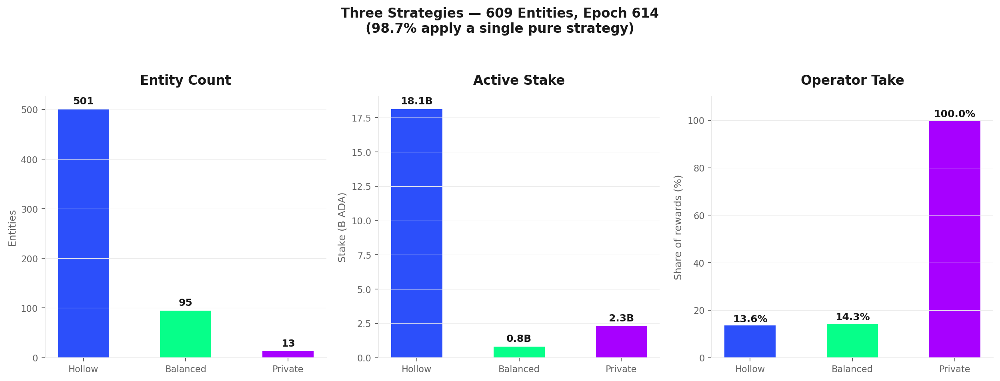
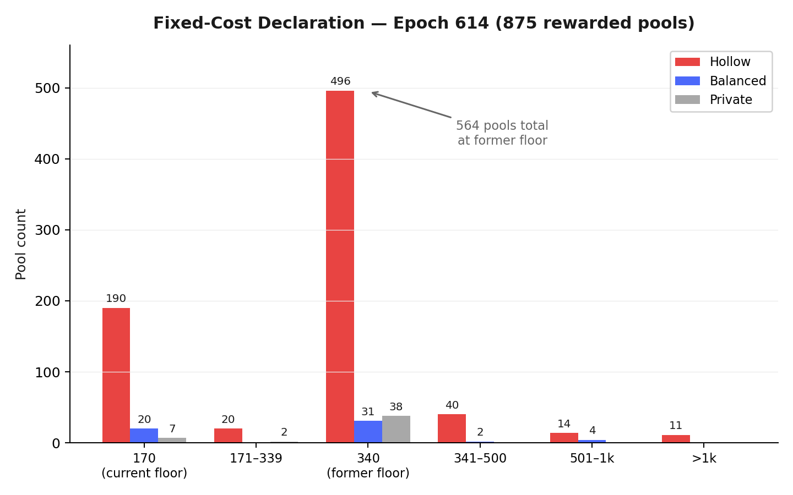
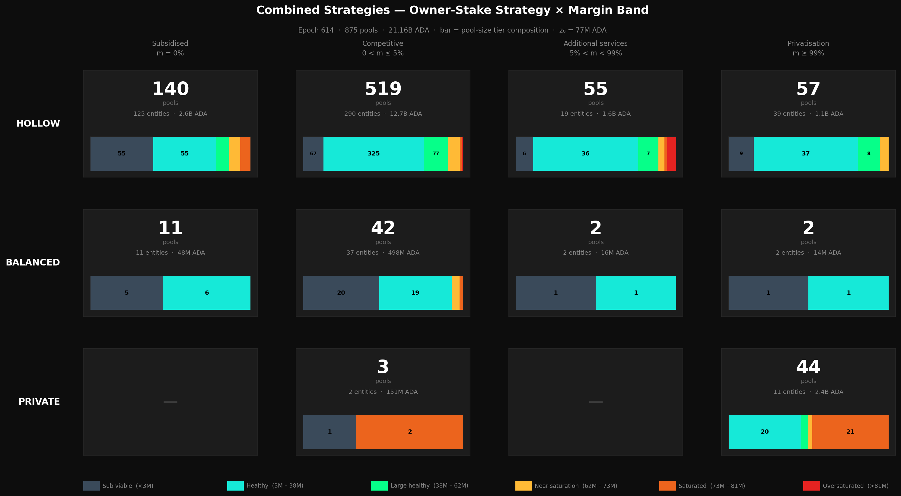
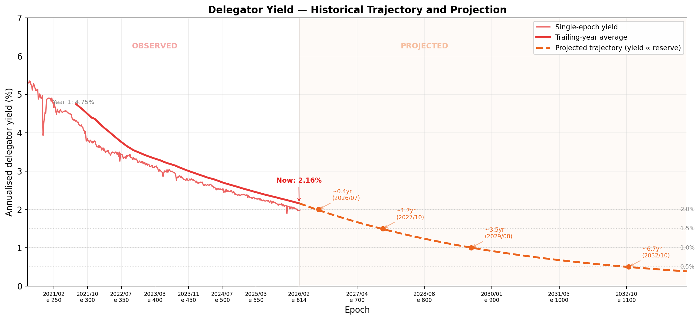
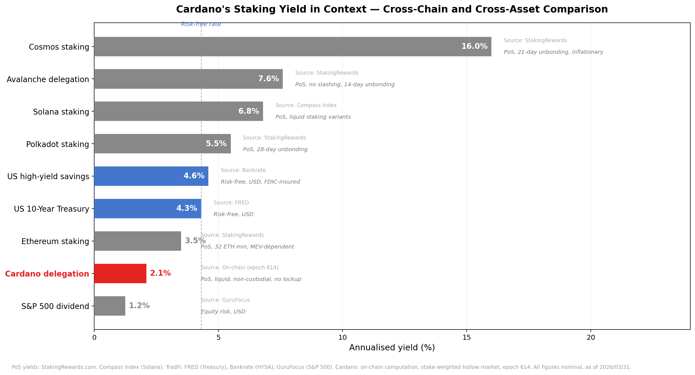
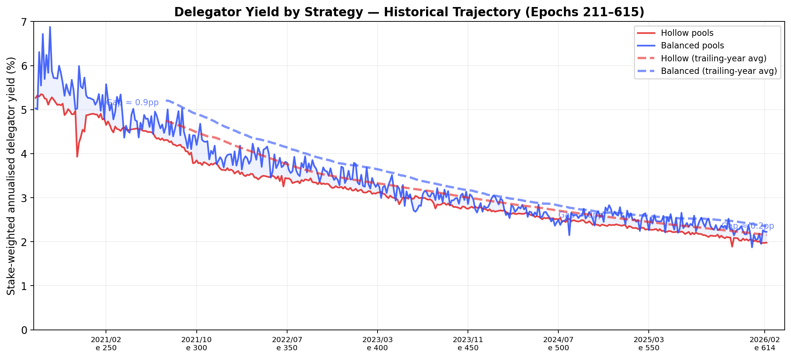
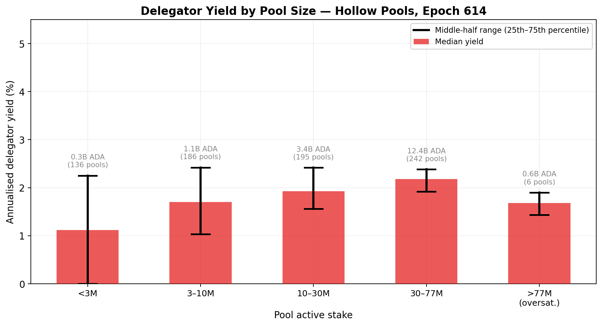
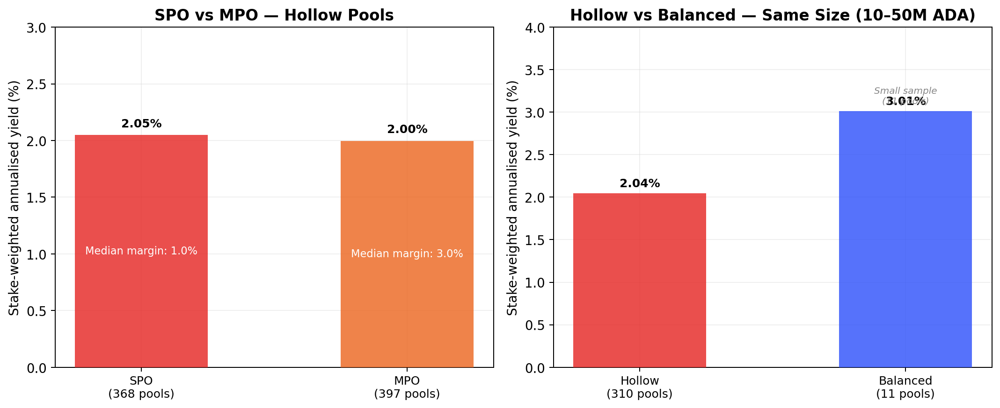
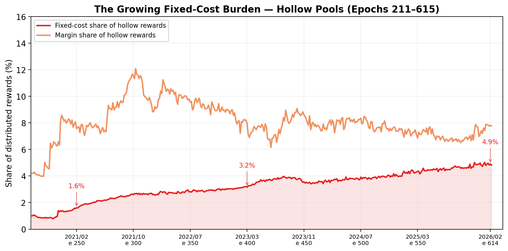
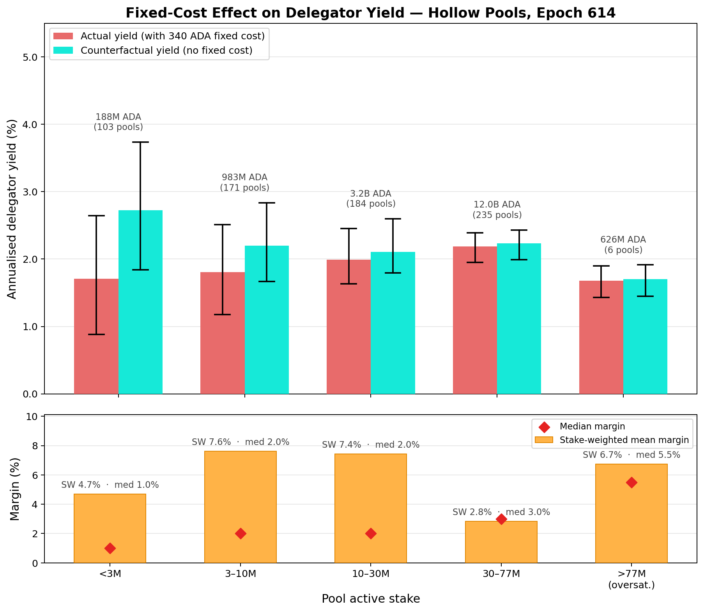

# The Operator's Cut — A Mainnet Analysis of Intra-Pool Reward Sharing

_Built on 2026/03/31 from mainnet data at epoch `614` (settled) plus historical analysis from epoch `211` (405 epochs)._

## Objective

This report analyses the **intra-pool reward split** — the third and final stage of Cardano's reward pipeline — and traces the structural forces that determine how much of each pool's reward reaches delegators versus operators. It extends the empirical baseline established in the [*Analysis of Cardano's Incentive Mechanism*](https://github.com/input-output-hk/spo-incentives/blob/main/report.pdf) (Lopez de Lara, 2025; hereafter the *Incentive Mechanism Analysis*) and operates downstream of the companion reports [*Treasury & Pool Pots Distribution*](../../treasury-and-pool-pots-distribution/mainnet-analysis/) (stage 1) and [*The Pools Pot Distribution Gaps*](../../pools-distribution/mainnet-analysis/) (stage 2).

Every epoch, once the reward curve assigns a total reward $\hat{f}$ to each pool, a second mechanism activates: the **intra-pool split**. The pool operator extracts a fixed cost $c$ and a proportional margin $m$; the remainder is distributed pro-rata among all delegators (including the operator's own stake). At epoch 614, this mechanism processed **6.75M ADA** across 875 rewarded pools — but the headline aggregate (24.3% operator take) conceals three radically different strategies. Adopting the Hollow–Private pledge spectrum from the upstream analysis ([§2.4.2](../../../README.md#242-progression--balanced-as-intended-but-private-by-design)), this report classifies entities by **owner-stake ratio** (owner active stake / pool active stake) across their pool fleets. Three strategies emerge along this spectrum: the **hollow strategy** (owner-stake ratio < 10%, 445 entities, 771 pools, 18.10B ADA, op_take=13.34%) where entities depend entirely on external delegation; the **balanced strategy** (10–95% owner-stake, 46 entities, 60 pools, 0.77B ADA, op_take=10.75%) where entities and delegators share capital with genuine alignment; and the **private strategy** (≥ 95% owner-stake, 11 entities, 44 pools, 2.29B ADA, op_take=99.97%) where entities are operator-funded. Remarkably, 495 of 502 entities (98.6%) apply a single pure strategy across all their pools, demonstrating high strategic consistency. Within hollow-strategy entities, a sub-population of 48 "functionally private" pools (margin ≥ 99.9%, typically exchanges and custodians) extract 100% via margin, leaving 723 genuine hollow pools at 7.7% operator take. The entity-level analysis reveals that margin competition is broadly active in the genuine hollow market (median entity margin 1.0%, stake-weighted 8.9%) but fixed cost, not margin, is the dominant extraction channel. Balanced-strategy entities form the smallest population but analytically most significant: they are where the pledge mechanism produces genuine alignment, with many pools carrying Material or High pledge tags and median owner-ratio 26.4%.

The argument proceeds in four parts:

1. **The formula** (§2). The SL-D1 intra-pool reward-sharing specification — from the original design through a residual-split decomposition to a reader-friendly rewrite and mainnet parameterization. The mechanism is sequential: fixed cost first, margin on the remainder, then pro-rata distribution. A critical protocol detail: when $\hat{f} < c$, the operator takes $\hat{f}$ (not $c$) — the effective fixed cost is $\min(c, \hat{f})$.

2. **Fee parameters** (§3). The fee-parameter landscape — fixed cost adoption and margin categorisation across 875 rewarded pools.

3. **The delegation landscape** (§4). Who are the 1.27M delegators? 80% of delegation relationships land in the hollow × competitive cell. 30% of stake is custodial — 12% custodial by pledge (private-strategy entities self-delegating their own capital) and 18% custodial by delegation (hollow-strategy entities routing client capital through operator-controlled addresses). Together, 35 entities control 6.42B ADA through 1,125 delegation addresses. The remaining 70% is retail, but concentrated: two entities (Everstake, Atomic Wallet) account for a quarter of all delegations through wallet integrations.

4. **The delegator's strategy** (§5). The delegator's action space reduces to a single decision — which pool — governed by two criteria: yield (annualised ROS) and the ethics of pool selection (commitment, independence, transparency). The yield trajectory is declining predictably (halving every ~3 years, R²=0.99 fit to reserve depletion), and Cardano's 2.01% sits below the risk-free rate and most PoS peers. Within the pool landscape, the yield surface is remarkably flat: the 30–77M bucket where 70% of delegation lives shows a middle-half spread of just 0.46pp, and the fixed-cost floor — not margin — is the dominant differentiator. When yield cannot meaningfully distinguish pools, the delegator's choice becomes partly an expression of values.

All counts and amounts use epoch **614** (the latest settled epoch with complete reward data). Source data: `koios_pool_history_mainnet.csv`, `koios_pool_owner_history_mainnet.csv`, `koios_pool_list_mainnet.csv`, `mpo_entity_pool_mapping_mainnet.csv` (Koios + entity attribution from the [*pools-distribution*](../../pools-distribution/mainnet-analysis/) flow).

## Contents

1. [Mainnet Observations](#1-mainnet-observations)
2. [The formula — intra-pool reward sharing](#2-the-formula--intra-pool-reward-sharing)
   - 2.1 [SL-D1 (Original)](#21-sl-d1-original)
   - 2.2 [Residual split decomposition](#22-residual-split-decomposition)
   - 2.3 [Reader-friendly formulation](#23-reader-friendly-formulation)
   - 2.4 [Mainnet parameterization](#24-mainnet-parameterization)
   - 2.5 [Concept glossary](#25-concept-glossary)
3. [Fee parameters](#3-fee-parameters)
   - 3.1 [The fixed cost](#31-the-fixed-cost)
      - 3.1.1 [Economic weight — material only for sub-viable pools](#311-economic-weight--material-only-for-sub-viable-pools)
      - 3.1.2 [The floor reduction — a governance action that does not propagate](#312-the-floor-reduction--a-governance-action-that-does-not-propagate)
         - 3.1.2.1 [By strategy](#3121-by-strategy)
         - 3.1.2.2 [By entity and stake concentration](#3122-by-entity-and-stake-concentration)
         - 3.1.2.3 [Multi-pool operators: fleet-wide policy](#3123-multi-pool-operators-fleet-wide-policy)
         - 3.1.2.4 [Single-pool operators: adoption by tier](#3124-single-pool-operators-adoption-by-tier)
      - 3.1.3 [Cross-chain comparison — a fee design without precedent](#313-cross-chain-comparison--a-fee-design-without-precedent)
      - 3.1.4 [Takeaway](#314-takeaway)
   - 3.2 [The margin](#32-the-margin)
      - 3.2.1 [The common ground — margin as the operator's sole differentiator](#321-the-common-ground--margin-as-the-operators-sole-differentiator)
      - 3.2.2 [Margin categorisation — the degree of freedom](#322-margin-categorisation--the-degree-of-freedom)
      - 3.2.3 [Entities & strategies](#323-entities--strategies)
   - 3.3 [Operator take](#33-operator-take)
4. [The delegation landscape](#4-the-delegation-landscape)
   - 4.1 [Counting productive pool delegations](#41-counting-productive-pool-delegations)
   - 4.2 [Where do delegators sit?](#42-where-do-delegators-sit)
   - 4.3 [Custodial](#43-custodial)
      - 4.3.1 [Custodial by pledge](#431-custodial-by-pledge)
      - 4.3.2 [Custodial by delegation](#432-custodial-by-delegation)
      - 4.3.3 [Custodial by extraction](#433-custodial-by-extraction)
      - 4.3.4 [Summary — from raw certificates to retail](#434-summary--from-raw-certificates-to-retail)
   - 4.4 [Retail](#44-retail)
      - 4.4.1 [Delegation concentration](#441-delegation-concentration)
      - 4.4.2 [The pool-level distribution](#442-the-pool-level-distribution)
   - 4.5 [Credential type — key versus script](#45-credential-type--key-versus-script)
5. [The delegator's strategy](#5-the-delegators-strategy)
   - 5.1 [What the formula offers](#51-what-the-formula-offers)
   - 5.2 [The yield criterion](#52-the-yield-criterion)
     - 5.2.1 [The yield trajectory — level, decline, and projection](#521-the-yield-trajectory--level-decline-and-projection)
     - 5.2.2 [Cardano's yield in context — three evaluation frames](#522-cardanos-yield-in-context--three-evaluation-frames)
     - 5.2.3 [The yield spread — how different are pools?](#523-the-yield-spread--how-different-are-pools)
       - 5.2.3.1 [Cross-strategy trajectory](#5231-cross-strategy-trajectory)
       - 5.2.3.2 [Inside the hollow market](#5232-inside-the-hollow-market)
       - 5.2.3.3 [The balanced premium — real or artefact?](#5233-the-balanced-premium--real-or-artefact)
       - 5.2.3.4 [Dead pools — hollow in name, zero in yield](#5234-dead-pools--hollow-in-name-zero-in-yield)
       - 5.2.3.5 [SPO versus MPO](#5235-spo-versus-mpo)
       - 5.2.3.6 [Oversaturation drag](#5236-oversaturation-drag)
       - 5.2.3.7 [Variance decomposition — luck versus structure](#5237-variance-decomposition--luck-versus-structure)
     - 5.2.4 [What drives the spread, and why the yield surface is flat](#524-what-drives-the-spread-and-why-the-yield-surface-is-flat)
   - 5.3 [Beyond yield — the ethics of pool selection](#53-beyond-yield--the-ethics-of-pool-selection)
   - 5.4 [Myopic and non-myopic delegation](#54-myopic-and-non-myopic-delegation)
   - 5.5 [The delegator's leverage](#55-the-delegators-leverage)
6. [Reproduction](#6-reproduction)

## 1. Mainnet Observations

| # | Observation | Summary |
| --- | --- | --- |
| O1 | **The fixed-cost floor exhibits striking inertia** | The protocol floor $c_{\min}$ was reduced from 340 to 170 ADA at epoch 445 (2023/10/27). 169 epochs later, 564 pools (64.5%) still declare 340 ADA — the former floor. Only 217 pools (24.8%) have adopted the current floor. 89.3% of pools sit at one of the two floor values; the remaining 10.7% range from 190 to 999,999 ADA. The inertia is consistent across all three strategy populations: operators overwhelmingly anchor to the floor (or the former floor), and the 564-pool residual has a material yield cost for small pools — a pool at 340 ADA pays double the minimum, eroding delegator yield by an amount that scales inversely with pool size. |
| O2 | **Margin competition is active but masked by a high-margin tail** | Margin is bimodal: 50.7% of pools declare ≤ 2%, while 11.8% declare ≥ 99% (private + functionally private). The median margin has been stable at 2.0% for 405 epochs, but the stake-weighted mean has risen from 4.2% to 18.9% — driven by the growing weight of private and captive pools in the stake distribution, not by fee increases in the competitive market. Any analysis that relies on mean or stake-weighted margin without accounting for this bimodality will overstate the fee burden on the typical delegator. |
| O3 | **Three disjoint strategies coexist on-chain with near-perfect consistency** | 445 entities follow the hollow strategy (771 pools, 18.10B ADA, < 10% owner-stake), 46 follow balanced (60 pools, 0.77B ADA, 10–95%), and 11 follow private (44 pools, 2.29B ADA, ≥ 95%). 98.6% of entities apply a single pure strategy across their entire fleet. 48 functionally private pools (exchanges, custodians at ≥ 99.9% margin) distort the hollow aggregate from 7.7% to 13.34% operator take. |
| O4 | **In the genuine hollow market, fixed cost slightly exceeds margin** | Excluding 48 captive pools, the genuine hollow market (723 pools) operates at 7.7% operator take — fixed cost 4.4%, margin 3.6%. Delegators receive 4.89M ADA (87.3% of hollow rewards) for pro-rata distribution. Entity-level median margin is 1.0%; 56.4% of entities operate below 2%. Margin competition is broadly active. |
| O5 | **The fixed cost is a regressive tax on small-pool delegators** | Effective tax ranges from ~4% (large low-margin pools) to 100% (sub-viable pools where $c \geq \hat{f}$). The fixed-cost share follows a $1/\sigma$ hyperbola. 88.8% of hollow pools declare the minimum cost — the floor is the norm. SPO pools bear a heavier effective tax (13.4% operator take) than MPO pools (12.5%) because scale dilutes the fixed-cost burden. |
| O6 | **Balanced-strategy entities are analytically significant despite small share** | 46 entities (6.9% of pool count, median owner-ratio 26.4%) form the only population where the pledge mechanism produces meaningful alignment. Many carry Material or High pledge tags — genuine skin-in-the-game. Operator take is 12.8%, dominated by fixed cost because pools tend to be small; margins are low. |
| O7 | **The delegator yield is declining on a predictable trajectory** | Stake-weighted hollow-market yield at epoch 614: 2.01% annualised (≈201 ADA/year per 10k ADA). Yield tracks reserve depletion with R²=0.99 and halves roughly every 3 years. Projected threshold crossings: < 2% in ~0.4yr, < 1.5% in ~1.7yr, < 1% in ~3.5yr, < 0.5% in ~6.7yr. The trajectory assumes constant active stake and no governance action. |
| O8 | **Cardano's yield sits below the risk-free rate and most PoS peers** | Among major PoS chains, only the S&P 500 dividend yield sits below Cardano's staking return; Ethereum delivers 1.5–2×, higher-inflation chains 3–10×. Three evaluation frames apply: same-asset (always positive), cross-asset (requires ADA price appreciation to match Treasuries), and DeFi (native staking as the risk-free rate of the ADA economy). What Cardano loses in yield it gains in design: no lockup, no slashing, no minimum, no custodial transfer. |
| O9 | **The yield spread between well-run pools is narrow** | Hollow and balanced yields correlate at 0.97 over 405 epochs — both strategies track reserve depletion in lockstep. The balanced-hollow trailing-year gap has fluctuated between 0.12pp and 0.36pp since epoch 365 — not a reliable premium. In the 30–77M bucket (70% of hollow delegation), the middle-half spread is just 0.46pp; 70.2% of delegated stake sits within ±0.5pp of the median. SPO vs MPO yield difference is negligible (2.05% vs 2.00%). |
| O10 | **Fixed cost, not margin, is the dominant yield differentiator** | The fixed-cost floor acts as a regressive levy: 54.3% effective tax for sub-3M pools, collapsing to 4.7% in the 30–77M band. A counterfactual removing the floor flattens the yield surface entirely — median yield rises +1.0pp for < 3M pools but only +0.05pp for 30–77M pools. The aggregate fixed-cost share has tripled from 1.6% (epoch 250) to 4.9% (epoch 614). Among large pools, moving from 0% to 3% margin costs only 0.07pp; small pools charge *lower* margins than large ones, so margins attenuate the size gradient rather than reinforce it. |
| O11 | **Block luck dominates single-epoch variance; structure emerges only over time** | Block-production luck explains R²=0.41 of single-epoch yield variance among large hollow pools. Over a full year, the structural spread is an order of magnitude smaller than single-epoch noise (hollow SW std dev: 0.10pp across 73 trailing epochs). Epoch-to-epoch movement is noise, not signal. |

**Scope note.** O1–O2 cover fee parameter adoption (§3). O3–O6 are structural to the intra-pool split (§3.2.3–§3.2.4). O7–O11 characterise the delegator's yield landscape (§5).

### The big picture

**What the formula does.** Once the reward curve assigns a total reward $\hat{f}$ to a pool, the intra-pool split extracts operator compensation in two steps: a **fixed cost** $\min(c, \hat{f})$ subtracted first, then a **proportional margin** $m$ applied to the remainder $\max(\hat{f} - c, 0)$. Everything left is distributed pro-rata among all pool members by stake share — including the operator's own stake.

**Three operator strategies.** At epoch 614, 502 entities operate rewarded pools — but they do not follow a single template. Following the Hollow–Private pledge spectrum from the upstream analysis, this report classifies entities by **dominant owner-stake ratio** across their fleet: the axis runs from hollow (external delegation dominates) through balanced (genuine capital-sharing) to private (operator-funded). 445 entities follow the hollow strategy (771 pools, 18.10B ADA), 46 follow the balanced strategy (60 pools, 0.77B ADA), and 11 follow the private strategy (44 pools, 2.29B ADA). Remarkably, 98.6% of entities apply a single pure strategy across their entire fleet. The pool-level heterogeneity is strategic consistency at the entity level.



**Strategy consistency.** Among 502 entities, 495 (98.6%) operate pools that all fall into the same strategy bin. Only 7 entities are hybrid (spanning multiple bins), and they cluster near threshold boundaries. This extraordinary consistency shows that entities choose a fundamental strategy and apply it coherently across their pool fleet. An entity does not run one hollow pool and one private pool — it commits to a strategy.

**The hollow-strategy market — with a caveat.** Among entities following the hollow strategy, operator take is **13.34%** in aggregate (771 pools). But 48 of these pools are *functionally private* — exchanges and custodians that own almost none of their stake (mean owner-ratio 1.75%) yet set margin ≥ 99.9%, extracting everything. Excluding them, the genuine market (723 pools) operates at **7.7%** operator take — split between fixed cost (4.4%) and margin (3.6%). Fixed cost slightly exceeds margin, reflecting a population where 91.6% declare the minimum 340 ADA cost.

**Entity-level analysis.** Counting by pool overcounts fee policies: entities operating many pools pursue a single (or a few) policy decisions per strategy, not one per pool. Across 491 distinct entities in the hollow market, the median margin is **1.0%** and 56.4% of entities operate below 2%. Margin competition is broadly active. The dominant extraction in the hollow market is the fixed-cost floor, not margin.

**The balanced-strategy population.** The 46 entities following the balanced strategy (6.9% of pool count, 3.6% of stake, median owner-ratio 26.4%) form an analytically crucial segment where the pledge mechanism produces genuine alignment. Many carry Material or High pledge tags — genuine skin-in-the-game. They are the smallest segment but structurally important: they demonstrate that entities with real capital at stake behave differently and compete fiercely on fees.

**Why it matters for mechanism design.** The two-regime structure reveals that the intra-pool split does not operate as a single, uniform mechanism. The fixed-cost floor creates a regressive tax that penalises small-pool delegators disproportionately, while margin competition functions effectively in the large-pool regime. Any revision to the fee structure should account for this bifurcation — the small-pool regime and the large-pool regime respond to different parameters and require distinct analytical treatment.

## 2. The formula — intra-pool reward sharing

These formulas define how a pool's realized allocation is split between the operator and the rest of the pool participants.
The split happens only after the pool-level reward has already been computed and adjusted by apparent performance.

The distribution logic is sequential:

- first, the operator fixed cost is covered
- second, the operator margin is applied to the remaining amount
- finally, the residual reward is distributed proportionally across stake holders

In this final step, the operator still receives a stake-proportional share through the pledge held inside the pool, while delegators receive the complementary share.

The intra-pool split was specified in [*Design Specification for Delegation and Incentives in Cardano*](https://github.com/IntersectMBO/cardano-ledger/releases/latest/download/shelley-delegation.pdf) (Kant, Brünjes & Coutts, IOHK, 2019 — deliverable **SL-D1**, §4.5.4). The mechanism has been operational on mainnet since the Shelley hard fork on 2020/07/29 and its governing parameters have never been modified by governance action.

### 2.1 SL-D1 (Original)

The operator and member rewards are two complementary views of the same split rule applied to the realized pool allocation.
Once the pool-level reward has been computed, the split follows the same sequence:

- cover the operator fixed cost first
- apply the operator margin to the remaining amount
- distribute the residual proportionally across stake holders

Under this rule, the operator receives both the explicit operator share and the stake-proportional share attached to the pledge held inside the pool, while each member receives a stake-proportional share of the residual amount.

Operator reward, using the operator stake-share ratio $\frac{s}{\sigma}$ as a single input:

$$
r_{\text{operator}}\left(\hat f,c,m,\frac{s}{\sigma}\right)=
\begin{cases}
\hat f, & \hat f \le c \\
 c + (\hat f-c)\left(m + (1-m)\frac{s}{\sigma}\right), & \hat f > c
\end{cases}
$$

Member reward, using the member stake-share ratio $\frac{t}{\sigma}$ as a single input:

$$
r_{\text{member}}\left(\hat f,c,m,\frac{t}{\sigma}\right)=
\begin{cases}
0, & \hat f \le c \\
(\hat f-c)(1-m)\frac{t}{\sigma}, & \hat f > c
\end{cases}
$$

### 2.2 Residual split decomposition

Before switching to reader-friendly variable names, it is useful to separate the split rule into the two regimes induced by the fixed operator cost $c$. Let

$$
\rho_{\text{operator}} = \frac{s}{\sigma}, \qquad
\rho_{\text{member}} = \frac{t}{\sigma}
$$

denote the operator and member pool-share ratios.

If the realized pool allocation does not cover the fixed cost,

$$
\hat f \le c
$$

then the operator absorbs the full realized reward and members receive nothing:

$$
r_{\text{operator}}(\hat f,c,m,\rho_{\text{operator}}) = \hat f,
\qquad
r_{\text{member}}(\hat f,c,m,\rho_{\text{member}}) = 0
$$

If instead the realized pool allocation is large enough to cover the fixed cost,

$$
\hat f > c
$$

let

$$
\mu(\hat f,c,m) := m(\hat f-c),
\qquad
\psi(\hat f,c,m) := (1-m)(\hat f-c)
$$

where $\mu(\hat f,c,m)$ is the operator margin extracted from the residual reward and $\psi(\hat f,c,m)$ is the remaining amount to be shared proportionally across stake holders.

The split then becomes

$$
r_{\text{operator}}(\hat f,c,m,\rho_{\text{operator}})
= c + \mu(\hat f,c,m) + \psi(\hat f,c,m)\,\rho_{\text{operator}}
$$

$$
r_{\text{member}}(\hat f,c,m,\rho_{\text{member}})
= \psi(\hat f,c,m)\,\rho_{\text{member}}
$$

This makes the three-layer structure explicit: fixed cost first, operator margin second, proportional sharing of the remainder third.

### 2.3 Reader-friendly formulation

Let the operator and member pool-share ratios be defined as:

$$
\rho^{\text{operator}}_{i} := \frac{\pi^{\text{pledged}}_{i}}{\sigma^{\text{totalStaked}}_{i}},
\qquad
\rho^{\text{member}}_{i} := \frac{\sigma^{\text{poolMember}}_{\text{delegated},i}}{\sigma^{\text{totalStaked}}_{i}}
$$

If the realized pool allocation does not cover the fixed cost,

$$
PoolPot^{\text{actual}}_{i} \le Cost^{\text{operator}}_{\text{fixed}}
$$

then the operator absorbs the full realized reward and members receive nothing:

$$
Reward^{\text{operator}} = PoolPot^{\text{actual}}_{i}
$$

$$
Reward^{\text{member}} = 0
$$

If instead the realized pool allocation is large enough to cover the fixed cost, define the three layers of the split directly as:

$$
Cost := Cost^{\text{operator}}_{\text{fixed}}
$$

$$
Margin := \mu^{\text{operator}}
\left(
PoolPot^{\text{actual}}_{i}-Cost^{\text{operator}}_{\text{fixed}}
\right)
$$

$$
Share := \left(1-\mu^{\text{operator}}\right)
\left(
PoolPot^{\text{actual}}_{i}-Cost^{\text{operator}}_{\text{fixed}}
\right)
$$

Then the split becomes:

$$
Reward^{\text{operator}} = Cost + Margin + Share\,\rho^{\text{operator}}_{i}
$$

$$
Reward^{\text{member}} = Share\,\rho^{\text{member}}_{i}
$$

This makes the split easy to read: fixed cost first, operator margin second, and proportional sharing of the remainder third.

A fundamental property becomes visible in this form. The operator's reward has two structurally distinct components:

$$
Reward^{\text{operator}} = \underbrace{Cost + Margin}_{\text{extracted from the pool's total reward}} + \underbrace{Share\,\rho^{\text{operator}}_{i}}_{\text{earned exactly as a delegator would}}
$$

The third term — $Share\,\rho^{\text{operator}}_{i}$ — is identical in form to any member's reward: a pro-rata share of the residual, proportional to the stake contributed. For the capital the operator pledges into the pool, the protocol treats the operator *exactly* as it treats a delegator. There is no special reward channel for pledge at this stage — the operator earns the same per-ADA yield as every other participant in the pool.

What distinguishes the operator from a delegator is the first two terms: $Cost$ and $Margin$. These are the only channels through which the operator can redirect part of the reward flow that is generated by *other participants' stake*. The fixed cost is a flat extraction; the margin is a proportional extraction. Both apply to the pool's total reward before pro-rata distribution, and both reduce the yield that delegators receive.

In other words: the operator's *own* capital is rewarded identically to delegated capital. The operator's *privilege* — the compensation for running infrastructure, bearing the pledge risk, and maintaining the pool — is expressed entirely through cost and margin. The split formula does not reward the operator *for pledging*; it rewards the operator *for operating*. The pledge mechanism that makes commitment economically significant lives upstream, in the reward curve (§2 of the [main report](../../../README.md#2-pools-distribution)), not in the intra-pool split.

### 2.4 Mainnet parameterization

| Parameter | Value | Set by |
| --- | --- | --- |
| `minPoolCost` ($c_{\min}$) | 340 ADA | Protocol parameter (governance) |
| Fixed cost ($c$) | Operator-declared, $\geq c_{\min}$ | Pool registration certificate |
| Margin ($m$) | Operator-declared, $\in [0, 1]$ | Pool registration certificate |

At epoch 614 (hollow-strategy pools): 93.5% of rewarded hollow-strategy pools declare $c = 340$ ADA (the minimum). The median declared margin is 2.0%; the entity-level median is 1.0% and the stake-weighted mean is 3.8%.

### 2.5 Concept glossary

| Symbol | Name | Definition |
| --- | --- | --- |
| $\hat{f}$ | Actual pool reward | Performance-adjusted output of the reward curve (stage 2) |
| $c$ | Declared fixed cost | Operator-declared flat ADA, $\geq c_{\min}$ |
| $c_{\text{eff}}$ | Effective fixed cost | $\min(c, \hat{f})$ — the actual ADA deducted |
| $m$ | Margin | Operator's declared share of reward after cost deduction |
| $c_{\min}$ | Minimum pool cost | Protocol-enforced floor on $c$ (currently 170 ADA; formerly 340 ADA) |
| Operator take | $c_{\text{eff}} + m(\hat{f} - c_{\text{eff}})$ | Total declared-fee extraction (= on-chain `pool_fees`) |
| Delegator pot | $(1-m)(\hat{f} - c_{\text{eff}})$ | Amount entering pro-rata distribution |
| Effective tax | Operator take / $\hat{f}$ | Fraction of pool reward extracted before pro-rata |

## 3. Fee parameters

The formula gives operators two extraction channels: a fixed cost $c$ (constrained by the protocol floor $c_{\min}$) and a proportional margin $m \in [0, 1]$. The fixed cost was designed to cover infrastructure expenses and shield sub-viable pools — §3.1 shows that it fails this objective. But the two-channel model has an unintended consequence: it gives operators genuine pricing flexibility. An operator can price through the fixed cost alone (setting margin to zero), through margin alone (minimising the fixed cost), or through a combination of both — adapting the fee structure to the complexity of the service offered. §3.2 examines how operators use the margin degree of freedom, and §3.3 shows that neither channel in isolation tells the full story: only the composite operator take — the fraction of pool rewards that never reaches delegators — reveals the effective price of staking.

### 3.1 The fixed cost

#### 3.1.1 Economic weight — material only for sub-viable pools

The fixed cost is the flat ADA amount deducted from every pool's reward before margin and pro-rata distribution. At epoch 614, the aggregate fixed-cost extraction across all 875 rewarded pools is 305,989 ADA — 4.5% of total pool rewards and 18.7% of total operator take. These aggregate figures understate the parameter's importance. The fixed cost is economically irrelevant for private-strategy pools (1.6% of their operator take — extraction runs through margin), but it is the dominant fee component for the delegator-facing population: among hollow and balanced pools (828 pools), fixed costs account for 39.5% of operator take — the single largest component of declared fees. For balanced pools specifically, the ratio rises to 64.2%.

The weight is sharply regressive across pool tiers ([§4.1.3](../../pools-distribution/mainnet-analysis/README.md#413-tier-definitions)): the median fixed cost absorbs 54.3% of pool rewards for sub-viable pools, 8.4% for Healthy pools, and 1.5% at near-saturation. For a small pool, the fixed cost *is* the fee.

| Tier | Median fixed cost as % of pool reward |
| --- | ---: |
| Sub-viable (1–3M) | 54.3% |
| Healthy (3–38.5M) | 8.4% |
| Large healthy (38.5–61.6M) | 2.0% |
| Near-saturation (61.6–73.1M) | 1.5% |
| Saturated (73.1–80.8M) | 1.4% |

The 170 ADA difference between the former floor (340) and the current floor (170) sharpens the picture. The table below quantifies the impact of adopting the current floor, by tier:

| Tier | Saving as % of pool reward | Saving as % of delegator pot | Gain per 10k ADA delegated / year |
| --- | ---: | ---: | ---: |
| Sub-viable (<3M) | **27.1%** | **59.9%** | **67.78 ADA** |
| Healthy (3–38.5M) | 4.5% | 6.2% | 10.00 ADA |
| Large healthy (38.5–61.6M) | 1.1% | 1.1% | 2.46 ADA |
| Near-saturation (61.6–73.1M) | 0.8% | 0.9% | 1.77 ADA |
| Saturated (>73.1M) | 0.7% | 0.8% | 1.64 ADA |

For a sub-viable pool, the 170 ADA saving represents 27.1% of the total pool reward and 59.9% of the delegator pot — the difference between meaningful delegation income and near-zero yield. For a saturated pool, the same 170 ADA is 0.7% of pool reward — a rounding error that no delegator would notice. At the sub-viable tier, 59 pools earn a total reward below 340 ADA: the operator takes *everything*, and delegators receive zero. For these pools, the fixed cost is confiscatory.

Above 38.5M ADA active stake, the fixed cost ceases to be the dominant fee component: margin accounts for 2× the fixed cost at the large-pool end (median margin share 3.0% vs fixed-cost share 1.5%). For the five largest MPOs (Coinbase, Kiln, Upbit, eToro, Wave — 4.7B ADA combined), it is a rounding error. The parameter matters most precisely where the entities that set it have the least incentive to optimise it.

> **Finding F3.1 — The fixed cost is confiscatory for small pools and irrelevant for large ones.** At the sub-viable tier it absorbs 27% of pool reward and 60% of the delegator pot; for 59 pools it exceeds the total reward — delegators receive zero. Above 38.5M ADA, margin is 2× the fixed cost and the parameter disappears into noise.

#### 3.1.2 The floor reduction — a governance action that does not propagate

The protocol floor $c_{\min}$ was set at **340 ADA** when the Shelley era launched on 2020/07/29 and remained at that level for over three years. On 2023/10/27 (epoch 445), following an SPO poll and a governance action submitted by the Cardano Foundation, the floor was halved to **170 ADA** — the first (and, as of epoch 614, the only) modification to this parameter. If all pools still declaring 340 were to adopt the current floor, the saving would be ~94,890 ADA per epoch — roughly 6.9M ADA per year redirected from operator extraction to the delegator pot.

At epoch 614 — 169 epochs after the reduction — the pool-level adoption snapshot is:

| Fixed cost declared | Pools | % of 875 |
| --- | ---: | ---: |
| 170 ADA (current floor) | 217 | 24.8% |
| 340 ADA (former floor) | 564 | 64.5% |
| Other (190–999,999 ADA) | 94 | 10.7% |

89.3% of pools declare one of the two floor values. The remaining 94 split between modest overstatements (55 pools ≤ 500 ADA) and outliers that use the fixed cost as an extraction mechanism in place of margin (11 pools above 1,000 ADA).



> **Finding F3.2 — Two-thirds of pools ignore the only governance action ever taken on this parameter.** 564 pools (64.5%) still declare 340 ADA, 169 epochs after the floor was halved. Only 24.8% have adopted the current floor — a structural feature of the landscape, not a transient adjustment lag.

##### 3.1.2.1 By strategy

The aggregate masks sharp differences across the three operator strategies. Among pools declaring a floor value (170 or 340), the adoption rate of the new floor varies from 15.6% (private) to 39.2% (balanced):

| | Hollow | Balanced | Private |
| --- | --- | --- | --- |
| Pools at 170 (current floor) | 190 (27.7%) | 20 (39.2%) | 7 (15.6%) |
| Pools at 340 (former floor) | 495 (72.3%) | 31 (60.8%) | 38 (84.4%) |

Private pools show the strongest inertia: 84.4% of floor-declaring private pools remain at 340. This is structurally expected — private-strategy operators extract via margin (typically ≥ 99%), so the fixed cost is economically negligible to them and there is no delegator-facing incentive to update it. Balanced pools are the most responsive (39.2% adoption) — consistent with their smaller pool sizes, where the 170 ADA difference is proportionally more significant. Hollow pools sit in between at 27.7%.

> **Finding F3.3 — Inertia tracks economic salience: those who care least update least.** Private pools (84.4% still at 340) extract via margin and have no reason to touch the cost; balanced pools (60.8% at 340) are small and delegator-facing, so the parameter bites — and they respond most. Hollow pools sit in between (72.3%).

##### 3.1.2.2 By entity and stake concentration

Shifting from pool-level to entity-level analysis sharpens the picture. Among the 448 entities whose entire fleet declares a floor value (170 or 340):

| | Entities | Pools | Stake |
| --- | ---: | ---: | ---: |
| All pools at 170 | 151 (33.7%) | 193 | 4.15B ADA (22.6%) |
| All pools at 340 | 290 (64.7%) | 505 | 12.89B ADA (70.3%) |
| Mixed fleet (some 170, some 340) | 7 (1.6%) | 44 | 1.31B ADA (7.1%) |

The stake-weighted inertia is more pronounced than the entity count suggests: 70.3% of stake across floor-declaring entities remains at 340. The largest entities are overwhelmingly in the non-adoption camp — Coinbase (41 pools, 2.44B ADA), Kiln (10 pools, 0.75B ADA), Upbit (15 pools, 0.52B ADA), eToro (11 pools, 0.51B ADA), and Wave (13 pools, 0.51B ADA) are all fully at 340. On the adoption side, Figment (20 pools, 0.70B ADA) is the only large MPO to have fully updated its fleet. The Cardano Foundation — the entity that submitted the governance action — adopted 170 across its 6 pools (0.46B ADA).

> **Finding F3.4 — The five largest entities (4.7B ADA) have not updated — and they set the tone for the network.** 70.3% of floor-declaring stake remains at 340. Figment and the Cardano Foundation are the only large operators to have adopted the current floor.

##### 3.1.2.3 Multi-pool operators: fleet-wide policy

Multi-pool operators manage fleets of pools under a single operational decision. The question is whether their cost declaration reflects a deliberate fleet-wide policy or a patchwork of pool-level accidents.

Among the 83 MPO entities, 69 (83.1%) apply a uniform fixed cost across their entire fleet: 11 uniformly at 170 (2.07B ADA), 52 uniformly at 340 (10.19B ADA), and 6 at a non-floor value (Binance at 345, HODL₳ at 500, CNODE at 495, among others). The remaining 14 entities (16.9%) run a mixed fleet — some pools updated, others not — totalling 2.89B ADA. The mixed-fleet group includes Everstake (2 of 12 pools at 170, the rest at 400), Blockdaemon (6/12 at 170), Emurgo (7/8 at 170), and YUTA (23 at 340, plus two outliers above 1,000 ADA). These mixed fleets suggest partial migration or operational incoherence rather than a deliberate dual-pricing strategy.

> **Finding F3.5 — Non-adoption is a deliberate fleet-wide policy, not a per-pool oversight.** 83.1% of MPOs apply a uniform fixed cost across their entire fleet. The 52 entities uniformly at 340 control 10.19B ADA — the bulk of the stake-weighted residual.

The aggregate adoption gap between multi-pool and single-pool operators confirms this structural divide. Among hollow entities declaring a floor value:

| Operator type | Adopted 170 | Still at 340 | Adoption rate | Stake at 340 |
| --- | ---: | ---: | ---: | ---: |
| Single-pool operators | 119 / 331 | 212 / 331 | 36.0% | 2.34B ADA |
| Multi-pool operators | 10 / 58 | 48 / 58 | 17.2% | 8.73B ADA |

> **Finding F3.6 — MPO inertia drives the aggregate: 48 hollow MPOs at 340 account for 8.73B ADA — 4× the single-pool residual.** Adoption rates diverge sharply: 36.0% among SPOs vs 17.2% among MPOs. The entities with the most stake are the least responsive.

##### 3.1.2.4 Single-pool operators: adoption by tier

Among single-pool operators, the adoption rate varies across the tier structure established in the pools-distribution analysis ([§4.1.3](../../pools-distribution/mainnet-analysis/README.md#413-tier-definitions)):

| Tier | Adopted 170 | Still at 340 | Adoption rate |
| --- | ---: | ---: | ---: |
| Sub-viable (1–3M) | 62 | 68 | 47.7% |
| Healthy (3–38.5M) | 57 | 152 | 27.3% |
| Large healthy (38.5–61.6M) | 12 | 11 | 52.2% |
| Near-saturation (61.6–73.1M) | 7 | 4 | 63.6% |
| Saturated (73.1–80.8M) | 2 | 3 | 40.0% |

The pattern is not monotonic. Sub-viable pools — economically precarious, where the fixed cost weighs most heavily relative to pool rewards (F3.1) — adopt at 47.7%, suggesting operators fighting for every margin of delegator yield. The Healthy tier, which contains the bulk of the single-pool population (209 pools), is the least responsive at 27.3%: large enough to be viable, but apparently not engaged enough to prioritise parameter updates. Adoption rises again above 38.5M, reaching 63.6% in the near-saturation band — consistent with professionally managed operations that actively track protocol parameters.

> **Finding F3.7 — The core operating tier — where most single-pool operators sit — is the least responsive.** Sub-viable pools adopt at 47.7% (fighting for yield), near-saturation at 63.6% (professionally managed), but the Healthy core at only 27.3%.

#### 3.1.3 Cross-chain comparison — a fee design without precedent

The two-parameter fee model (fixed cost + proportional margin) is unique to Cardano among major PoS protocols. Every other chain that implements a protocol-level operator/delegator split uses a single proportional commission rate.

| Chain | Fee mechanism | Fixed cost | Proportional commission | Protocol constraints |
| --- | --- | --- | --- | --- |
| **Cardano** | Protocol — sequential: fixed cost then margin | Yes, with enforced floor ($c_{\min}$) | Yes, $m \in [0, 1]$, unconstrained | Floor on fixed cost; no bounds on margin |
| **Cosmos Hub** | Protocol — single commission | No | Yes, single rate | Max rate and max daily change immutable at creation; 5% minimum imposed by governance |
| **Solana** | Protocol — single commission on inflation rewards | No | Yes, single rate (typically 0–10%) | No protocol minimum |
| **Polkadot** | Protocol — single commission, then pro-rata | No | Yes, percentage | No enforced bounds; equal base reward per validator in active set |
| **Ethereum** | None — protocol pays the validator directly | No | No (off-chain, platform-level) | Solo validators keep 100%; commission managed by Lido, Coinbase, etc. |
| **Tezos** | None — distribution is off-chain by the baker | No | No (off-chain, convention) | Baker decides; tools like TRD; typically 5–10% |

Three observations follow from this comparison.

**The fixed cost has no equivalent elsewhere.** No other major PoS chain deducts a flat absolute amount before applying a proportional commission. The fixed cost is a design choice specific to SL-D1. The regressive tax structure documented in F3.1 — where the fixed-cost share follows a $1/\sigma$ hyperbola — is a problem that single-commission chains do not have. A proportional-only fee applies uniformly regardless of pool size.

**The industry norm is a single proportional parameter.** Cosmos, Solana, and Polkadot all converge on the same minimal model: one commission rate, applied proportionally. Complexity is managed through *constraints* on that rate (governance-imposed floors, immutable ceilings, max daily change) rather than through additional fee parameters. Cardano's two-parameter model is not just different — it is structurally more complex than what the rest of the industry has found sufficient.

**Two chains have no protocol-level mechanism at all.** Ethereum and Tezos delegate the operator/delegator split entirely to the platform or baker layer. The protocol sees a single validator; how rewards are shared with stakers is an off-chain arrangement. This is the opposite end of the design spectrum from Cardano's protocol-enforced two-parameter model.

> **Finding F3.8 — No other major PoS protocol uses a fixed absolute cost — the mechanism is unique to Cardano.** Cosmos, Solana, Polkadot, Ethereum, and Tezos all use either a single proportional commission or no protocol-level fee at all. The $1/\sigma$ regressive extraction the fixed cost produces has no equivalent elsewhere.

### 3.2 The margin

#### 3.2.1 The common ground — margin as the primary differentiator

Section §3.1.1 established that the fixed cost is economically small for every pool above the sub-viable tier. For large pools, setting $Cost \approx 0$ in the reader-friendly formulation (§2.3) collapses the three-layer split to two:

$$
Reward^{\text{operator}} \approx Margin + Share\,\rho^{\text{operator}}_{i}
$$

$$
Reward^{\text{member}} \approx Share\,\rho^{\text{member}}_{i}
$$

The $Share\,\rho^{\cdot}_{i}$ term treats operator and delegator identically: at equal stake, they receive the same reward. Pledge and delegation are fungible ADA inside the pool. The *only* term that differentiates the operator from a delegator is the $Margin$. Without it ($\mu^{\text{operator}} = 0 \Rightarrow Margin = 0$), an operator with 10k ADA pledged earns exactly the same as a delegator with 10k ADA delegated to the same pool.

The margin is therefore not a fee in the conventional sense — it is the **operator's premium**: the compensation for running infrastructure, bearing operational risk, and maintaining the pool's availability. It is the answer to the question: *how much more should the entity that produces blocks earn, per ADA in the pool, compared to the entity that merely delegates?*

This does not mean the fixed cost is inert. Section §3.1.4 noted that the two-channel model gives operators pricing flexibility: some operators set margin to zero and price entirely through the fixed cost, others minimise the fixed cost and price through margin, and the majority blend both. The margin is the primary differentiator — it is the continuously variable, unconstrained parameter — but the fixed cost remains a deliberate channel choice, and neither parameter alone reveals the effective price a delegator faces. §3.3 resolves this by introducing the composite operator take as the metric that integrates both channels.

#### 3.2.2 Margin categorisation — the degree of freedom

The owner-stake ratio produced three strategies ([§2.4.2](../../../README.md#242-progression--balanced-as-intended-but-private-by-design)). The margin introduces a second degree of freedom — but a qualitatively different one.

The owner-stake ratio is a *compound* outcome — it depends on the operator's pledge choice and on the delegation the pool attracts, so it cannot be read as a single declaration. The margin is *explicit*: every operator chooses a value in $[0, 1]$ and publishes it on-chain. And unlike the fixed cost, which clusters at two protocol-floor values (§3.1), the margin has no enforced floor or ceiling. It is the only fully unconstrained, continuously variable parameter in the intra-pool split.

At epoch 614, the margin distribution among hollow pools clusters into four bands with clear economic meanings:

| Band | Range | Hollow pools | Stake | Economic logic |
| --- | --- | ---: | ---: | --- |
| **No-margin** | $m = 0\%$ | 140 (18.2%) | 2.60B | The operator uses the fixed cost as the sole extraction channel — margin is zero. Revenue comes only from the fixed cost and the (typically negligible) pro-rata owner share. |
| **Competitive** | $0 < m \leq 5\%$ | 519 (67.3%) | 12.72B | The market norm — modest fee, competition on yield. Five round values (1%, 2%, 3%, 4%, 5%) account for 70% of this band. |
| **Additional-services** | $5\% < m < 99\%$ | 55 (7.1%) | 1.64B | Above-market pricing reflecting services beyond staking: reporting, compliance, managed infrastructure. Almost exclusively MPOs (Figment, Kiln, Blockdaemon, Binance). |
| **Privatisation** | $m \geq 99\%$ | 57 (7.4%) | 1.11B | Total extraction — the margin converts the pool into a de facto private operation regardless of ownership. Exchanges and custodians (eToro, StakeBowl, 5BINARIES). |

The four bands are not arbitrary quantiles — they correspond to visible gaps in the distribution. The cliff between competitive and additional-services is sharp: 85.5% of hollow pools sit at or below 5%, then the density drops to near zero before resurfacing at 99–100%. The middle ground (5–99%) is sparsely populated and structurally distinct from the two clusters on either side.

These margin bands cross-cut the three owner-stake strategies. The same band label applies regardless of strategy — what changes is the economic meaning of that choice, because the operator's alternative revenue (pro-rata owner share) depends on pledge.

#### 3.2.3 Entities & strategies

Crossing the three owner-stake strategies with the four margin bands produces a 3 × 4 matrix of combined positions. At epoch 614, ten of the twelve cells are populated. The figure below shows each cell's pool count, entity count, aggregate stake, and internal composition by pool-size tier ($z_0 \approx 77\text{M ADA}$). The classification is an entity-level property: 472 of 502 entities (94.0%) place all their pools in a single cell, and 98.6% follow a single pure owner-stake strategy across their entire fleet. The 30 entities that span multiple cells are large institutional operators (Kiln, Figment, Binance) whose margin varies across pools while the owner-stake strategy remains the same.



Two cells are empty — *private × no-margin* and *private × additional-services* — for a straightforward reason: a private-strategy entity already captures the bulk of rewards through its pro-rata owner share, so there is no economic incentive to set margin to zero or to price a service towards external delegators that do not exist.

### 3.3 Operator take

Sections §3.1 and §3.2 examined each fee parameter in isolation: the fixed cost as a regressive flat deduction, the margin as the operator's proportional premium. But operators do not think in parameters — they think in pricing. The two-channel model lets an operator choose *how* to compose a fee: through the fixed cost alone (no-margin pools), through a blend of fixed cost and margin (the competitive and additional-services bands), or through near-total margin extraction (privatisation). The channel mix reflects the operator's cost structure and service model. What the delegator experiences, however, is not the channel mix — it is the composite result: the **operator take**, the fraction of pool rewards that never reaches the delegator pot.

At epoch 614, the 875 rewarded pools generated 6.75M ADA in total rewards. Of these, 184 pools operate under a custodial logic — private-strategy pools (47), non-private pools in the privatisation margin band (59), and large low-delegator pools that route capital on behalf of a controlling entity (78). Their operator take is structurally determined by the custodial arrangement, not by a pricing decision towards external delegators. §4.3 documents this population in detail. The analysis below excludes them and focuses on the **691 non-custodial pools** (452 entities, 13.95B ADA) where the operator take reflects a genuine pricing choice.

| Cell | Pools | Entities | Delegators | Stake (B) | Fixed cost | Margin | Gross ROS | Net ROS | Operator take | ROS drag |
|---|---:|---:|---:|---:|---:|---:|---:|---:|---:|---:|
| **Hollow × no-margin** | **140** | **125** | **136,635** | **2.60** | **4.7%** | **0.0%** | **2.38%** | **2.14%** | **4.7% (20.1k ₳/yr)** | **13 bps** |
|   ↳ Adopted (170 ₳) | 60 (43%) | 57 | 42,232 | 1.15 (44%) | 2.8% | 0.0% | 2.36% | 2.13% | 2.8% (12.4k ₳/yr) | 8 bps |
|   ↳ Legacy (340 ₳) | 67 (48%) | 56 | 74,641 | 1.29 (50%) | 5.5% | 0.0% | 2.38% | 2.15% | 5.5% (24.6k ₳/yr) | 14 bps |
|   ↳ Custom | 13 (9%) | 12 | 19,762 | 0.16 (6%) | 12.0% | 0.0% | 2.63% | 2.15% | 12.0% (33.1k ₳/yr) | 39 bps |
| **Hollow × competitive** | **465** | **284** | **1,015,915** | **9.80** | **4.6%** | **2.3%** | **2.35%** | **2.12%** | **7.0% (33.4k ₳/yr)** | **17 bps** |
|   ↳ Adopted (170 ₳) | 95 (20%) | 73 | 136,482 | 2.06 (21%) | 2.5% | 1.8% | 2.36% | 2.17% | 4.3% (21.1k ₳/yr) | 12 bps |
|   ↳ Legacy (340 ₳) | 336 (72%) | 199 | 519,632 | 6.88 (70%) | 5.3% | 2.4% | 2.35% | 2.11% | 7.7% (35.6k ₳/yr) | 19 bps |
|   ↳ Custom | 34 (7%) | 18 | 359,801 | 0.86 (9%) | 4.6% | 3.4% | 2.37% | 2.12% | 8.0% (45.3k ₳/yr) | 22 bps |
| **Balanced × competitive** | **42** | **37** | **25,091** | **0.50** | **7.2%** | **2.9%** | **2.63%** | **2.21%** | **10.1% (31.0k ₳/yr)** | **27 bps** |
|   ↳ Adopted (170 ₳) | 13 (31%) | 13 | 3,150 | 0.05 (9%) | 12.8% | 1.6% | 2.54% | 2.05% | 14.4% (13.9k ₳/yr) | 43 bps |
|   ↳ Legacy (340 ₳) | 23 (55%) | 20 | 12,830 | 0.37 (75%) | 5.9% | 3.3% | 2.68% | 2.37% | 9.2% (38.2k ₳/yr) | 25 bps |
|   ↳ Custom | 6 (14%) | 4 | 9,111 | 0.08 (16%) | 9.5% | 1.9% | 2.40% | 1.92% | 11.4% (40.8k ₳/yr) | 28 bps |
| **Hollow × additional-services** | **31** | **17** | **67,953** | **0.98** | **3.0%** | **10.1%** | **2.19%** | **1.82%** | **13.1% (89.6k ₳/yr)** | **32 bps** |
|   ↳ Adopted (170 ₳) | 12 (39%) | 2 | 31,819 | 0.43 (44%) | 1.7% | 7.2% | 2.07% | 2.08% | 8.9% (65.3k ₳/yr) | 21 bps |
|   ↳ Legacy (340 ₳) | 11 (35%) | 9 | 35,181 | 0.38 (38%) | 3.3% | 12.0% | 2.21% | 1.57% | 15.3% (113.4k ₳/yr) | 41 bps |
|   ↳ Custom | 8 (26%) | 7 | 953 | 0.17 (17%) | 5.1% | 12.5% | 2.45% | 1.79% | 17.5% (93.6k ₳/yr) | 40 bps |
| **Balanced × no-margin** | **11** | **11** | **2,360** | **0.05** | **17.5%** | **0.0%** | **2.64%** | **2.36%** | **17.5% (16.7k ₳/yr)** | **45 bps** |
|   ↳ Adopted (170 ₳) | 7 (64%) | 7 | 1,801 | 0.04 (84%) | 10.3% | 0.0% | 2.44% | 2.27% | 10.3% (12.4k ₳/yr) | 25 bps |
|   ↳ Legacy (340 ₳) | 4 (36%) | 4 | 559 | 0.01 (16%) | 47.3% | 0.0% | 3.88% | 2.52% | 47.3% (24.3k ₳/yr) | 164 bps |
| **Balanced × additional-services** | **2** | **2** | **1,447** | **0.02** | **11.9%** | **6.3%** | **2.82%** | **1.94%** | **18.2% (38.0k ₳/yr)** | **71 bps** |
|   ↳ Legacy (340 ₳) | 2 (100%) | 2 | 1,447 | 0.02 (100%) | 11.9% | 6.3% | 2.82% | 1.94% | 18.2% (38.0k ₳/yr) | 71 bps |
| **Non-custodial** | **691** | **452** | **1,249,401** | **13.95** | **4.7%** | **2.4%** | **2.36%** | **2.12%** | **7.1% (32.8k ₳/yr)** | **18 bps** |

The table is sorted by ascending operator take. Each cell is decomposed by fixed-cost strategy — adopted (170 ₳, the current protocol floor), legacy (340 ₳, the Shelley-era floor), and custom (any other value). Percentages in the pools and stake columns are relative to the parent cell. Operator take combines both fee channels into a single metric; the parenthetical shows the mean per-pool annualised revenue it generates. Gross ROS is the pool's annualised return before fee deduction; net ROS is the delegator's effective yield after the operator take. ROS drag is the difference, in basis points.

The fixed-cost strategy is the primary driver of within-cell take dispersion. In hollow × no-margin, the channel is identical (margin = 0) yet the take ranges from 2.8% (adopted) to 12.0% (custom) — a 4× spread produced entirely by the fixed-cost level. In hollow × competitive, the margin channel contributes a stable 1.8–2.4% across all three groups; the take gradient from 4.3% to 8.0% comes almost entirely from the fixed cost channel (2.5% vs 5.3% vs 4.6%). One cell inverts this pattern: balanced × competitive adopted pools show *higher* take (14.4%) than legacy (9.2%) because they are disproportionately small (9% of cell stake across 31% of pools) and the fixed cost's regressive geometry (§3.1.1) overrides the governance-responsiveness signal.

> **Finding F3.9 — The fixed-cost strategy, not the margin, drives take dispersion within the competitive market.** Across hollow × competitive (465 pools, 70% of non-custodial stake), the margin channel varies by only 0.6pp between FC strategies while the fixed cost channel varies by 2.8pp. The operator who has not updated the fixed cost earns 35.6k ₳/yr — 69% more than the adopted operator at 21.1k ₳/yr — for a net ROS difference of only 6 bps to the delegator.

For additional-services pools the margin channel dominates (7–12%), but the fixed-cost strategy still differentiates: adopted pools (Figment, 12 pools) reach 8.9% take and 65.3k ₳/yr while legacy pools reach 15.3% and 113.4k ₳/yr. At the other extreme, 4 balanced × no-margin legacy pools operate at 47.3% take — the fixed cost alone consumes nearly half of their pool reward, producing 164 bps of ROS drag.

> **Finding F3.10 — Gross ROS is near-homogeneous across the hollow segment; fees compress it by a barely perceptible amount.** Gross ROS ranges from 2.35% to 2.38% across hollow no-margin and hollow competitive pools regardless of operator take. The ROS drag for 90% of the non-custodial market sits between 8 and 22 bps — a signal too weak for most delegators to detect, let alone act on.

The delegator count column exposes the consequence of this homogeneity. If delegators optimised net ROS, pools with lower take should attract more capital. The data shows the opposite: hollow × competitive absorbs 81% of non-custodial delegators (1,015,915) at 2.12% net ROS, while hollow × no-margin offers a marginally better deal (2.14%) and attracts only 11% (136,635). Balanced × competitive delivers the highest net ROS in the competitive band (2.21%) yet accounts for just 2% of delegators (25,091). The 34 custom pools in hollow × competitive illustrate the pattern at its most extreme — 359,801 delegators (35% of the cell) concentrated across 7% of pools holding 9% of stake.

> **Finding F3.11 — Delegation concentration is driven by pool visibility, not return optimisation.** Delegators do not track the ROS signal — the spread is too narrow to differentiate. They default to large, recognisable pools: a choice that minimises perceived uncertainty rather than maximising yield. This is an information-asymmetry outcome that challenges the incentive mechanism's core assumption of a rational, yield-sensitive delegator.

The downstream analysis (§4) reads the delegation landscape through the operator take lens established here.

## 4. The delegation landscape

Before turning to the delegator's strategy (§5), it is necessary to understand the other side of the split: who are the delegators, how many are there, and where does their capital sit?

### 4.1 Counting productive pool delegations

The companion [*Staking Census*](../../census/mainnet-analysis/) applies a progressive cleaning pipeline to the raw delegation data before any analytical work begins. The table below reproduces the census summary (epoch 623, db-sync `epoch_stake`):

| Segment | Delegations | Stake | Share | Pools | Entities |
|---|---:|---:|---:|---:|---:|
| **Raw (delegation certificates)** | **1,847,713** | — | — | **3,190** | **2,374** |
| Zero-balance certificates (noise) | 492,678 | 0 | — | 313 | 72 |
| **epoch_stake total** | **1,355,035** | **21.75B** | **100%** | **2,877** | **2,302** |
| Non-productive pool delegations (noise) | 59,937 | 0.19B | 0.9% | 1,925 | 1,742 |
| **Productive pool delegations** | **1,295,098** | **21.57B** | **99.1%** | **952** | **560** |

Each row subtracts from the previous one, so the arithmetic is traceable end-to-end. Two noise sources are removed: zero-balance certificates (delegation records with no ADA behind them — 27% of raw rows) and delegations to non-productive pools (below the ~1M ADA production threshold). The residual — **1,295,098 delegations across 952 pools and 560 entities** — is the population this section decomposes into operator self-stake, custodial, and retail segments.

### 4.2 Where do delegators sit?

Starting from the 1,295,098 productive pool delegations (§4.1), the strategy × margin-band matrix reveals where delegators actually land. The classification combines epoch 614 strategy labels with live Koios parameters for the 90 pools that appeared after epoch 614.

| Cell | Pools | Delegations | Share | Stake (B) | Stake share | ADA / deleg | Entities |
| --- | ---: | ---: | ---: | ---: | ---: | ---: | ---: |
| **Productive pool delegations** | **952** | **1,295,098** | **100%** | **21.57** | **100%** | **16,653** | **560** |
| Hollow × competitive | 544 | 1,029,552 | 79.5% | 12.67 | 58.7% | 12,305 | 313 |
| Hollow × subsidised | 154 | 144,147 | 11.1% | 2.63 | 12.2% | 18,279 | 139 |
| Hollow × additional-services | 67 | 69,235 | 5.3% | 1.96 | 9.1% | 28,376 | 21 |
| Balanced × competitive | 54 | 26,094 | 2.0% | 0.52 | 2.4% | 20,035 | 49 |
| Hollow × privatisation | 61 | 21,215 | 1.6% | 1.14 | 5.3% | 53,517 | 43 |
| Balanced × subsidised | 15 | 2,494 | 0.2% | 0.06 | 0.3% | 22,718 | 15 |
| Balanced × additional-services | 2 | 1,450 | 0.1% | 0.01 | 0.1% | 8,800 | 2 |
| Balanced × privatisation | 2 | 607 | 0.0% | 0.04 | 0.2% | 72,745 | 2 |
| Private × privatisation | 49 | 219 | 0.0% | 2.37 | 11.0% | 10,842,179 | 10 |
| Private × competitive | 4 | 85 | 0.0% | 0.15 | 0.7% | 1,793,231 | 3 |

79.5% of all delegations land in hollow × competitive. 11.1% in hollow × subsidised. Together, these two cells — the genuine delegation market — account for 90.6% of delegations but only 70.9% of stake. The gap is explained by the privatisation cells: private × privatisation holds 11.0% of stake through just 219 delegation addresses (operator self-delegation), and hollow × privatisation holds 5.3% of stake with 21K delegations averaging 54K ADA each — the custodial regime.

### 4.3 Custodial

Not all staked ADA is delegated by independent users choosing a pool on the open market. A significant share is **custodial** — controlled by operators rather than by the on-chain delegators themselves. Three structurally distinct mechanisms produce this outcome.

| Segment | Entities | Pools | Delegations | Stake (B) | % of productive stake |
| --- | ---: | ---: | ---: | ---: | ---: |
| **Custodial by pledge** | 13 | 53 | 304 | 2.53 | 11.7% |
| **Custodial by delegation** | 15 | 85 | 611 | 3.86 | 17.9% |
| **Custodial by extraction** | 45 | 63 | 21,822 | 1.18 | 5.5% |
| **Combined** | **71** | **201** | **22,737** | **7.56** | **35.1%** |

35.1% of productive stake is custodial. The three mechanisms are economically distinct — the operator owns the capital (by pledge), routes external capital through few addresses (by delegation), or extracts through margin (by extraction) — but the outcome is the same: the delegation choice is made by the operator, not by the end-users whose ADA it represents.

#### 4.3.1 Custodial by pledge

Private-strategy entities (owner-stake ≥ 95%) who fund their pools with their own capital. The delegation addresses are operator wallets, not market participants. The operator *is* the delegator. This category includes both Private × privatisation pools (100% margin, total capture) and Private × competitive pools (low margin, but the capital is still operator-sourced).

These 8 entities operate 46 pools funded almost entirely by operator capital. Most apply 100% margin — rewards never leave the operator's control. Two entities (Wave, one anonymous) sit in the competitive band with margin ≤ 5%, but their ≥ 95% owner-stake ratio still makes them self-delegating.

| Entity | Pools | Stake (M) | Deleg | ADA / deleg | Margin |
| --- | ---: | ---: | ---: | ---: | ---: |
| CHUCK BUX | 12 | 772 | 12 | 64.3M | 100% |
| Upbit | 15 | 517 | 19 | 27.2M | 100% |
| Cardano Foundation | 6 | 456 | 30 | 15.2M | 100% |
| Adalite platform cluster | 3 | 158 | 5 | 31.6M | 100% |
| Wave | 2 | 150 | 73 | 2.1M | 4.0% |
| 3 × anonymous | 3 | 228 | 3 | 75.5M | 100% |
| 1 × anonymous | 1 | 73 | 24 | 3.0M | 100% |
| Bloom | 1 | 71 | 8 | 8.9M | 100% |
| LQWD | 2 | 47 | 17 | 2.8M | 100% |
| 1 × anonymous | 1 | 39 | 92 | 0.4M | 100% |
| 1 × anonymous | 1 | 1 | 7 | 0.2M | 1.0% |
| **Total** | **47** | **2,512** | **290** | | |

The top three — CHUCK BUX, Upbit, Cardano Foundation — hold 69.5% of custodial-by-pledge stake. CHUCK BUX is an opaque multi-pool entity (12 pools, 64M ADA per delegation address, 100% margin). Upbit is a Korean exchange. The Cardano Foundation operates its own treasury pools. Wave is the only named entity in the competitive band — a community fleet that happens to self-fund.

#### 4.3.2 Custodial by delegation

27 entities with ≥ 1M ADA per delegation address. These are exchanges, institutional validators (IVaaS), and anonymous whale pools that appear hollow to the protocol — owner-stake below 10% — but whose delegation addresses are operator-controlled.

The custodial-by-delegation stake distributes unevenly across the four hollow cells. The measurement is per entity × cell: an entity spanning two cells (e.g. Blockdaemon in competitive and additional-services) is assessed separately in each.

| Cell | Cell total (B) | Custodial entities | Custodial pools | Custodial stake (B) | % of cell stake | % of cell deleg |
| --- | ---: | ---: | ---: | ---: | ---: | ---: |
| Hollow × competitive | 12.72 | 11 | 66 | 3.65 | 28.7% | 0.1% |
| Hollow × additional-services | 1.64 | 5 | 11 | 0.33 | 20.1% | 0.4% |
| Hollow × privatisation | 1.11 | 11 | 23 | 0.78 | 70.3% | 0.6% |
| Hollow × subsidised | 2.60 | 1 | 1 | 0.01 | 0.3% | 0.0% |

The pattern is clear: custodial capital represents a large share of *stake* but a negligible share of *delegations*. In hollow × competitive, 28.7% of stake flows through 0.1% of delegation relationships. In hollow × privatisation, the cell is 70.3% custodial — confirming that "functionally private" pools (§5.5) are overwhelmingly operator-routed. The subsidised cell is essentially custodial-free.

**Hollow × competitive — the 11 custodial entities.**

| Entity | Pools | Stake (M) | Cell share | Deleg | ADA / deleg | Margin |
| --- | ---: | ---: | ---: | ---: | ---: | ---: |
| Coinbase | 41 | 2,444 | 19.2% | 403 | 6.1M | 5.0% |
| Kiln | 9 | 635 | 5.0% | 445 | 1.4M | 3.0% |
| Blockdaemon | 5 | 289 | 2.3% | 47 | 6.1M | 3.0% |
| Figment | 4 | 152 | 1.2% | 22 | 6.9M | 2.0% |
| pool106s… | 1 | 51 | 0.4% | 3 | 16.9M | 3.0% |
| Binance | 1 | 34 | 0.3% | 17 | 2.0M | 3.0% |
| pool18jq… | 1 | 13 | 0.1% | 9 | 1.5M | 2.0% |
| pool1m4n… | 1 | 12 | 0.1% | 5 | 2.4M | 1.0% |
| pool16qr… | 1 | 7 | 0.1% | 2 | 3.5M | 2.0% |
| pool1hjp… | 1 | 5 | 0.0% | 3 | 1.8M | 2.0% |
| pool1wun… | 1 | 5 | 0.0% | 3 | 1.7M | 5.0% |
| **Total** | **66** | **3,649** | **28.7%** | **959** | | |

Four named entities — Coinbase, Kiln, Blockdaemon, Figment — account for 96.5% of custodial-by-delegation stake within the cell (3.52B of 3.65B). These are the exchanges and institutional validators identified in §5.1.1: hollow by owner-stake ratio, but the delegated capital is routed by the operator, not attracted from an open market. Coinbase alone — 19.2% of the cell — holds more stake than the bottom 200 entities combined.

The remaining 7 are anonymous single-pool entities with 2 to 17 delegators each, collectively holding 0.13B. The custodial signal (millions of ADA per address) suggests whale self-delegation or small custodial operations.

#### 4.3.3 Custodial by extraction

Non-private pools that declare a privatisation margin (≥ 99%). Unlike custodial by pledge, the operator does not fund the pool — delegators do. Unlike custodial by delegation, the pool may have thousands of delegation addresses. The defining feature is the margin: the operator captures virtually all rewards, converting an otherwise open pool into a de facto private operation. Delegators in these pools earn near-zero yield; whether they remain through inertia, ignorance, or institutional constraint, their delegation is not a meaningful market signal.

At epoch 623, 63 non-private pools (61 hollow, 2 balanced) declare ≥ 99% margin, carrying 21,822 delegations and 1.18B ADA (5.5% of productive stake) across 45 entities. The contrast with custodial by delegation is stark: custodial-by-delegation pools concentrate large stake in few addresses (611 delegations, 3.86B), while custodial-by-extraction pools spread thin stake across many addresses (21,822 delegations, 1.18B). The economic outcome is the same — the operator captures the value — but the on-chain footprint is opposite.

#### 4.3.4 Summary — from raw certificates to retail

The table below combines the census cleaning pipeline (§4.1) with the strategy × margin-band decomposition (§4.2) and the three-way custodial classification developed in this section. The upper block filters noise; the lower block decomposes productive pool delegations into custodial by pledge, custodial by delegation, custodial by extraction, and retail — with their constituent cells.

| Segment | Delegations | Stake | % total | % group | Pools | Entities |
|---|---:|---:|---:|---:|---:|---:|
| **Raw (delegation certificates)** | **1,847,713** | — | — | | **3,190** | **2,374** |
| Zero-balance certificates (noise) | 492,678 | 0 | — | | 313 | 72 |
| **epoch_stake total** | **1,355,035** | **21.75B** | **100%** | | **2,877** | **2,302** |
| Non-productive pool delegations (noise) | 59,937 | 0.19B | 0.9% | | 1,925 | 1,742 |
| **Productive pool delegations** | **1,295,098** | **21.57B** | **99.1%** | | **952** | **560** |
| Operator self-stake | 3,634 | 2.98B | 13.8% | | 952 | 560 |
| **Custodial by pledge** | **304** | **2.53B** | **11.7%** | **100%** | **53** | **13** |
|   ↳ Private × privatisation | 219 | 2.37B | 11.0% | 94% | 49 | 10 |
|   ↳ Private × competitive | 85 | 0.15B | 0.7% | 6% | 4 | 3 |
| **Custodial by delegation** | **611** | **3.86B** | **17.9%** | **100%** | **85** | **15** |
|   ↳ Hollow × competitive | 352 | 2.90B | 13.5% | 75% | 54 | 13 |
|   ↳ Hollow × additional-services | 259 | 0.95B | 4.4% | 25% | 31 | 5 |
| **Custodial by extraction** | **21,822** | **1.18B** | **5.5%** | **100%** | **63** | **45** |
|   ↳ Hollow × privatisation | 21,215 | 1.14B | 5.3% | 97% | 61 | 43 |
|   ↳ Balanced × privatisation | 607 | 0.04B | 0.2% | 3% | 2 | 2 |
| **Combined custodial** | **22,737** | **7.56B** | **35.1%** | | **201** | **71** |
| **Retail** | **1,272,361** | **14.01B** | **64.9%** | **100%** | **751** | **505** |
|   ↳ Hollow × competitive | 1,029,200 | 9.77B | 45.3% | 70% | 490 | 306 |
|   ↳ Hollow × subsidised | 144,147 | 2.63B | 12.2% | 19% | 154 | 139 |
|   ↳ Hollow × additional-services | 68,976 | 1.01B | 4.7% | 7% | 36 | 19 |
|   ↳ Balanced × competitive | 26,094 | 0.52B | 2.4% | 4% | 54 | 49 |
|   ↳ Balanced × subsidised | 2,494 | 0.06B | 0.3% | <1% | 15 | 15 |
|   ↳ Balanced × additional-services | 1,450 | 0.01B | 0.1% | <1% | 2 | 2 |

### 4.4 Retail

The remaining 64.9% of productive stake (14.01B ADA) is retail: 1,272,361 delegations across 751 pools and 505 entities, where the delegator — not the operator — chooses the pool. The table below reprises the cell decomposition from §4.3.4 and contrasts both sides of the intra-pool split: operator take (decomposed into fixed cost and margin) versus the delegator's residual — the share that reaches the delegator pot and the annualised return on stake (ROS) it produces.

| Cell | Pools | Stake (B) | Operator take | Fixed cost | Margin | Delegator pot | Median ROS | Mean ROS |
|---|---:|---:|---:|---:|---:|---:|---:|---:|
| **Retail** | **751** | **14.01** | **7.1%** | **4.6%** | **2.4%** | **92.9%** | **2.12%** | **2.07%** |
|   ↳ Hollow × competitive | 490 | 9.77 | 6.9% | 4.6% | 2.3% | 93.1% | 2.12% | 2.08% |
|   ↳ Hollow × subsidised | 154 | 2.63 | 4.6% | 4.6% | 0.0% | 95.4% | 2.17% | 2.10% |
|   ↳ Hollow × additional-services | 36 | 1.01 | 13.0% | 3.0% | 10.1% | 87.0% | 1.78% | 1.62% |
|   ↳ Balanced × competitive | 54 | 0.52 | 10.1% | 7.2% | 2.9% | 89.9% | 2.05% | 2.21% |
|   ↳ Balanced × subsidised | 15 | 0.06 | 17.5% | 17.5% | 0.0% | 82.5% | 2.27% | 2.36% |
|   ↳ Balanced × additional-services | 2 | 0.01 | 18.2% | 11.9% | 6.3% | 81.8% | 1.94% | 1.94% |

The two sides of the split tell a coherent story. Across all retail pools, operator take averages 7.1% — split between fixed cost (4.6%) and margin (2.4%) — leaving 92.9% for the delegator pot, which translates into a median ROS of 2.12%.

Hollow × competitive (490 pools, 70% of retail stake) and hollow × subsidised (154 pools, 19%) together account for 92% of retail delegations and 88% of retail stake — the genuine delegation market. The operator take gap between them is narrow (6.9% vs 4.6%), driven entirely by the margin channel: subsidised pools waive it, competitive pools charge 2.3%. On the delegator side, the difference is barely visible — median ROS of 2.12% vs 2.17%. Waiving margin buys delegators 0.05 percentage points of yield.

Hollow × additional-services (36 pools, 7% of retail stake) makes the extraction legible: operator take doubles to 13.0%, the margin channel alone absorbing 10.1% of pool rewards. The delegator pot drops to 87.0% and median ROS falls to 1.78% — a 0.34 percentage-point drag relative to competitive pools. This is the retail cell where the operator's fee choice has the largest impact on delegator returns.

Balanced pools illustrate a structural tension. Their operator take (10.1–17.5%) is systematically higher than comparable hollow cells — not because of margin (which is comparable or zero) but because the fixed-cost floor weighs more heavily on smaller pools (balanced median stake ~3.2M ADA). Yet their median ROS remains comparable or higher (balanced × subsidised delivers 2.27%, the highest of any retail cell). The operator's own stake earns pro-rata returns alongside delegators, keeping these pools productive despite the higher headline extraction.

Across the 751 retail pools, 64% (carrying 85% of retail stake) deliver ROS ≥ 2.0%, while only 4% (1% of stake) fall below 1.0%. The correlation between ROS and delegation volume is weak (Spearman ρ = 0.20, p < 10⁻⁷), as is the correlation with stake (ρ = 0.22, p < 10⁻⁹). ROS is a necessary condition — pools with persistently low ROS lose delegators — but it is not a sufficient differentiator among the large majority of pools that converge toward the 2.0–2.3% band. Delegation count is driven more by wallet-integration defaults, brand visibility, and first-mover positioning than by marginal ROS differences.

**Delegation size.** The weighted average retail delegation is ~11,000 ADA, but this masks enormous variance across pools. The pool-level median is 17,050 ADA per delegator, with a heavy right tail: the 10th percentile sits at 3,300 ADA, the 90th at 225,000 ADA. This spread reflects the coexistence of mass-market wallet integrations — Everstake (~2,100 ADA per delegator, ~265K delegators across 13 pools), Atomic Wallet (~600 ADA per delegator, ~84K delegators) — and community pools where a few hundred delegators each hold 20–60K ADA.

**Saturation.** The retail pool landscape is dramatically under-utilised: median saturation is 10.8%, only 32 pools exceed 90% of the saturation cap, and 374 pools (49%) sit below 10%. This over-provisioning means the protocol has ample headroom for stake growth, but it also means that most retail pools produce blocks infrequently — reinforcing the delegation concentration toward the few dozen pools that are large enough to mint consistently.

#### 4.4.1 Delegation concentration

Within the retail segment, delegation relationships are concentrated by entity — but the concentration follows a different axis than stake concentration. The top 20 retail entities by delegator count:

| # | Entity | Delegations | Cum. deleg | ADA / deleg | Stake (M) | Cum. stake |
| ---: | --- | ---: | ---: | ---: | ---: | ---: |
| 1 | Everstake | 265,287 | 20.8% | 2K | 572 | 4.1% |
| 2 | STSH1 / Atomic Wallet | 83,802 | 27.4% | 567 | 48 | 4.4% |
| 3 | NuFi | 41,442 | 30.7% | 7K | 277 | 6.4% |
| 4 | Kiln | 35,523 | 33.5% | 16K | 551 | 10.3% |
| 5 | Figment | 32,449 | 36.0% | 11K | 366 | 13.0% |
| 6 | MANDA | 23,445 | 37.9% | 10K | 227 | 14.6% |
| 7 | CCV | 23,108 | 39.7% | 8K | 177 | 15.8% |
| 8 | BERRY | 22,053 | 41.4% | 1K | 33 | 16.1% |
| 9 | FREE | 18,418 | 42.8% | 4K | 78 | 16.6% |
| 10 | NORTH | 17,430 | 44.2% | 20K | 355 | 19.2% |
| 11 | Emurgo | 15,735 | 45.5% | 17K | 271 | 21.1% |
| 12 | Bloom | 15,377 | 46.7% | 10K | 152 | 22.2% |
| 13 | DAPP | 15,259 | 47.9% | 9K | 140 | 23.2% |
| 14 | PAUL1 | 15,071 | 49.0% | 6K | 93 | 23.9% |
| 15 | EDEN | 13,491 | 50.1% | 12K | 164 | 25.0% |
| 16 | ADV | 12,274 | 51.1% | 21K | 260 | 26.9% |
| 17 | Spire | 11,292 | 52.0% | 8K | 94 | 27.6% |
| 18 | BRAVO | 10,802 | 52.8% | 6K | 68 | 28.0% |
| 19 | CARDs | 10,640 | 53.6% | 1K | 13 | 28.1% |
| 20 | SECUR | 10,083 | 54.4% | 23K | 231 | 29.8% |

Two numbers tell the story. After 20 entities: 54.4% of retail delegations but only 29.8% of retail stake. The delegation leaders are wallet integrations and retail-facing platforms — Everstake (265K delegators, 2K ADA each), Atomic Wallet / STSH1 (84K, 567 ADA each), NuFi (41K, 7K each). They capture enormous numbers of small delegators through product UX. The stake leaders — Everstake (572M), Kiln (551M), YUTA (424M), Wave (383M), Figment (366M) — hold far more capital per delegation address.

The thresholds summarise the divergence between delegation count and stake:

| | Top entities by delegation count | Top entities by stake |
| --- | ---: | ---: |
| **Top 2** | 27.4% of deleg, 4.4% of stake | 8.0% of stake, 23.6% of deleg |
| **Top 5** | 36.0% of deleg, 13.0% of stake | 16.4% of stake, 27.1% of deleg |
| **Top 10** | 44.2% of deleg, 19.2% of stake | 26.9% of stake, 33.8% of deleg |
| **Top 20** | 54.4% of deleg, 29.8% of stake | 40.9% of stake, 42.8% of deleg |
| **Top 50** | 72.1% of deleg, 47.6% of stake | 60.8% of stake, 55.7% of deleg |

The top 2 by delegation count hold 27.4% of retail delegations but only 4.4% of retail stake — mass-market retail. The top 2 by stake hold 8.0% of retail stake but 23.6% of delegations — still retail-facing, unlike the custodial segment where top entities hold massive stake with almost no delegators. The two rankings converge only past the top 50, where the distinction between institutional-retail and community operators blurs.

This dual concentration has a governance implication: the entities that touch the most *people* (wallet platforms) are not the entities that control the most *capital* within retail. Any mechanism that counts delegators weighs the retail ecosystem differently from one that counts ADA.

#### 4.4.2 The pool-level distribution

Retail pools vary by four orders of magnitude in delegator count:

| Delegators per pool | Pools | Delegations | Stake (B) |
| --- | ---: | ---: | ---: |
| 1–10 | 24 | 132 | 0.07 |
| 10–100 | 169 | 7,681 | 1.96 |
| 100–500 | 209 | 55,119 | 2.24 |
| 500–1K | 97 | 70,504 | 1.36 |
| 1K–5K | 196 | 432,483 | 5.62 |
| 5K+ | 60 | 707,292 | 2.74 |

The median retail pool has 434 delegators. The 5K+ bracket holds 60 pools with 707K delegations — the retail-heavy pools (Everstake, Atomic, NuFi) where wallet-integration defaults accumulate delegators. The 10–100 bracket is the long tail: 169 pools carrying 1.96B ADA from fewer than 100 delegators each — mid-size community pools where a relatively small delegator base accounts for substantial capital.

Unlike the full productive pool distribution (which includes custodial pools with 1–10 delegators and 5.51B ADA), the retail distribution shows no inversion: stake and delegation count rise together across brackets. The 1–10 bracket shrinks from 140 pools (full) to just 24 (retail), confirming that the vast majority of low-delegator, high-stake pools are custodial rather than retail.

### 4.5 Credential type — key versus script

The on-chain transaction itself carries no metadata identifying the originating wallet software (Eternl, Lace, Yoroi, Daedalus, `cardano-cli`) — a `stake_delegation_certificate` is identical regardless of the interface that submitted it. The credential type, however, is encoded in the stake address: `stake1u…` for **key-based** credentials (wallet controlled by a private key) and `stake17…` for **script-based** credentials (smart contract, multisig, or governance script). This is the finest on-chain classification available.

Querying all 871 rewarded pools via Koios `pool_delegators` (epoch 614):

| Credential | Delegations | % | Stake (B) | % |
| --- | ---: | ---: | ---: | ---: |
| Key-based | 1,188,967 | 99.97% | 20.37 | 99.81% |
| Script-based | 318 | 0.03% | 0.04 | 0.19% |

Script-based delegations are negligible — 318 addresses out of 1.19M, carrying 39M ADA. DeFi vaults, DAO treasuries, and multisig governance mechanisms account for almost none of the staking capital.

By strategy, the distribution is uniformly key-dominated:

| Strategy | Key deleg | Script deleg | Script % (deleg) | Script % (stake) |
| --- | ---: | ---: | ---: | ---: |
| Hollow | 1,159,710 | 303 | 0.03% | 0.22% |
| Balanced | 28,985 | 14 | 0.05% | 0.03% |
| Private | 272 | 1 | 0.37% | 0.00% |

The only entity with material script-stake is Spire (3 script-delegations, 9.5M ADA, 9.6% of its own stake). No other entity exceeds 0.5M ADA in script-based delegation.

The closest proxy for wallet-of-origin is the default pool assignment: platforms like Everstake and Atomic Wallet capture hundreds of thousands of delegators through UX-driven defaults, but this is an inference from delegation patterns, not an on-chain datum. The key/script split confirms that the ADA-per-delegator heuristic used in §4.3 remains the most effective on-chain proxy for distinguishing custodial from retail capital — the credential type cannot separate them.

_Data: `data/delegator_credential_by_pool.csv` (871 pools, built via `scripts/build_delegator_credential_profile.py`)._


## 5. The delegator's strategy

The preceding sections describe the operator's side of the split — fee parameters (§3) and the delegation terrain (§4). The delegator's side is simpler — not because the decision is trivial, but because the formula gives delegators a narrower action space.

### 5.1 What the formula offers

A delegator who stakes $t$ ADA in a pool receives:

$$
Reward^{\text{member}} = Share\,\rho^{\text{member}}_{i} = (1-\mu^{\text{operator}})\left(PoolPot^{\text{actual}}_{i}-Cost^{\text{operator}}_{\text{fixed}}\right) \cdot \frac{t}{\sigma^{\text{totalStaked}}_{i}}
$$

The delegator controls $t$ (the amount staked) and the choice of pool. Everything else — the pool reward $PoolPot^{\text{actual}}_{i}$, the fixed cost, the margin, and the total stake $\sigma$ — is set by the operator or determined by the protocol. The delegator's entire strategic space reduces to a single decision: *which pool to delegate to*.

### 5.2 The yield criterion

From the formula, the delegator's per-ADA yield depends on three factors, none of which the delegator controls directly: pool performance (reliable block production), operator fees (the effective tax extracted before pro-rata), and pool saturation (oversaturated pools dilute returns). The annualised return on stake (ROS) — the single metric that aggregates all three — is the delegator's natural selection criterion.

#### 5.2.1 The yield trajectory — level, decline, and projection

At epoch 614, a delegator in the hollow market earns a stake-weighted annualised yield of **2.01%**. A delegation of 10,000 ADA produces approximately **201 ADA/year**, or ~2.8 ADA per epoch.

This yield has been declining since the Shelley launch, mechanically tracking the depletion of the monetary expansion reserve. Because the reserve feeds the epoch pot at a fixed draw rate ($\rho = 0.003$), each draw reduces the remaining reserve, which reduces the next draw. The yield compresses over time regardless of pool selection — the entire yield surface descends together. A calibrated model ($\text{yield} \propto \text{reserve}$) fits the historical data with $R^2 = 0.99$ and projects the continuation.



The figure shows the full trajectory: 405 epochs of observed yield (solid red) and the calibrated projection (dashed orange). The yield halves roughly every 3 years. Key threshold crossings: below 2% within ~0.4 years, below 1.5% within ~1.7 years (below the S&P 500 dividend yield), below 1% within ~3.5 years (approaching negligibility for retail delegators), and below 0.5% within ~6.7 years (delegation premium becomes symbolic).

This projection assumes constant active stake and no governance action. Both assumptions will eventually break — active stake may decline as yield compresses, and the community may revise protocol parameters before the yield reaches negligibility. But the trajectory establishes the default path: absent intervention, the native staking yield will halve roughly every 3 years, reaching sub-1% within a single governance cycle.

The declining yield also tightens the participation constraint for operators (§3.2.3): as the epoch pot shrinks, the operator's margin and cost premium shrinks proportionally. At some point, operating a pool becomes unprofitable at any margin the delegation market will bear. This is the downstream dependency that the main report ([§2.4.4.4](../../../README.md#2444-the-downstream-dependency)) identifies.

#### 5.2.2 Cardano's yield in context — three evaluation frames

At ~2.1% annualised, Cardano's native staking yield sits at the lower end of the PoS landscape and below the risk-free rate in traditional finance.



Among major PoS chains, only the S&P 500 dividend yield sits below Cardano's staking return. Ethereum delivers 1.5–2× the yield; higher-inflation chains (Cosmos, Solana) pay 3–10× more, though part of that yield is offset by token dilution — a distinction Cardano's low-inflation design avoids. Cardano also pays less than the risk-free rate: US Treasuries and high-yield savings offer 4–5% annually in USD with zero volatility.

Whether this yield is "good enough" depends on the delegator's evaluation frame:

**Frame 1 — staking vs idle ADA (same-asset).** A delegator who already holds ADA has a simple decision: stake or not. The staking premium is unconditionally positive (~2.1%/year). Every ADA held idle is diluted by the monetary expansion that funds the epoch pot; every ADA staked captures a share of it. There is no threshold at which delegation becomes irrational in this frame — the premium is always positive.

**Frame 2 — ADA staking vs risk-free alternatives (cross-asset, USD terms).** A delegator choosing between ADA staking and a USD instrument faces a different calculus. To match a 4.3% Treasury yield, the delegator needs ADA to appreciate by at least +2.1%/year on top of the staking yield. In this frame, Cardano delegation is not a yield play — it is a conviction bet on the underlying asset. The yield is a bonus on top of a price thesis, not a substitute for one.

**Frame 3 — native staking vs Cardano DeFi (same-asset, different risk).** DeFi protocols within the Cardano ecosystem typically offer higher nominal yields, but carry smart-contract risk, impermanent loss, and counterparty risk. Native staking is the *risk-free rate of the ADA economy*: the baseline that any higher-risk strategy must beat by a margin sufficient to compensate for the additional risk.

What Cardano's delegation mechanism loses in yield, it gains in liquidity and simplicity: no lockup, no unbonding delay, no slashing risk, no minimum threshold, no custodial transfer. No other major PoS chain offers this combination. The low yield is the price of a design that prioritises liquid, non-custodial participation — a deliberate trade-off, not an oversight.

#### 5.2.3 The yield spread — how different are pools?

The more important question for the delegator is not the absolute level but the *spread* — how much yield varies across the pools available for delegation. The answer depends on which segment of the pool landscape the delegator is looking at, and it changes over time as the reserve depletes. What follows is a per-strategy decomposition of the yield surface, grounded in 405 epochs of mainnet history (epochs 211–615).

##### 5.2.3.1 Cross-strategy trajectory

The figure below tracks the stake-weighted average delegator yield for each strategy across 405 epochs of mainnet history. The solid lines show single-epoch yields; the dashed lines show the trailing-year (73-epoch) average, which smooths out block-production noise. The shaded area between the two curves is the balanced-hollow gap.



Three patterns are visible across the full history:

1. **Both strategies track the reserve depletion in near-lockstep.** The epoch-to-epoch correlation between hollow and balanced yields is 0.97. The delegator yield is overwhelmingly driven by a single macro-factor — the shrinking reserve — not by strategy-level differences. Over the full 405-epoch span, hollow pools averaged 3.20% and balanced pools 3.46%.

2. **The gap between strategies is narrow and unstable.** It opened at nearly 1pp in the early Shelley era, compressed to near-zero by 2024, then reopened slightly to 0.25pp at epoch 614. The trailing-year average gap has fluctuated between 0.12pp and 0.36pp since epoch 365. This is not a reliable premium — it is noise on a small sample of balanced pools.

3. **The pool count is diverging.** Hollow pools peaked at 904 (epoch 400) and have since declined to 771. Balanced pools have declined more steeply, from 119 to 57 — a 52% drop. The balanced strategy is thinning out as yields compress.

Private pools are excluded from the figure: they have negligible third-party delegation by definition and their per-delegator yield is meaningless at the aggregate level.

At the most recent closed epoch (614), the hollow market is where almost all delegation lives: 17.75B ADA across 765 pools, with a stake-weighted average yield of 2.01%. The middle half of hollow pools fall between 1.39% and 2.38% — a spread of just 1.00 percentage point. Balanced pools (57 pools, 0.31B ADA) show a headline spread more than twice as wide (2.36pp), but this is misleading — the dispersion is driven by small-pool block luck rather than structural factors, as §6.2.3.3 explains. Private pools (47) have negligible third-party delegation.

Six additional pools are structurally hollow by their owner-stake ratio but operationally dead — they hold 0.22B ADA in nominal delegation yet pay 0% yield. They are not participants in the delegation market; §6.2.3.4 discusses them separately. The 765 hollow pools referenced above exclude these six.

##### 5.2.3.2 Inside the hollow market

Within these 765 hollow pools, yield is overwhelmingly determined by pool size — specifically, by the interaction between the 340 ADA fixed-cost floor and total pool rewards. The figure below shows the median yield (bar height) and the middle-half range (25th–75th percentile, vertical line) for each size bucket at epoch 614. The annotation above each bar indicates how much delegation and how many pools each bucket contains.



Two patterns emerge:

1. **Yield rises monotonically with size** up to the saturation point. The median ROS doubles from 1.12% in the smallest bucket to 2.18% in the 30–77M bucket. This is almost entirely a fixed-cost effect: the 340 ADA floor consumes 100% of rewards for pools near 1M ADA but only ~3.5% for pools at 30M ADA (§6.2.4).

2. **Variance collapses as pools grow.** The middle-half spread drops from 2.25pp for sub-3M pools to 0.46pp in the 30–77M band — a fivefold narrowing. Small pools are dominated by block-production luck: a pool expecting two blocks per epoch may mint zero or four, creating wild single-epoch swings that have nothing to do with pool quality. Large pools, minting 20+ blocks per epoch, converge on their expected share and the remaining spread becomes structural.

The 30–77M bucket carries 70% of all hollow delegation (12.43B ADA). This is the segment most delegators actually inhabit, and it is the flattest part of the yield surface.

##### 5.2.3.3 The balanced premium — real or artefact?

At epoch 614, balanced pools report a stake-weighted average yield of 4.08% — nearly double the hollow average of 2.01%. The historical trajectory in §6.2.3.1 shows the gap has fluctuated between −0.03pp and +0.93pp over 405 epochs, with a trailing-year average that has hovered around 0.12–0.36pp since the pool landscape stabilised. The single-epoch snapshot overstates the structural difference.

Two factors explain the inflated epoch-614 number:

1. **Small-pool block luck.** Of the 57 balanced pools, 39 (68%) have active stake below 5M ADA. At this size, a pool expects fewer than two blocks per epoch. A single lucky epoch — three blocks minted instead of one — can push the annualised yield above 6%. The high average is driven by a handful of balanced pools that happened to overproduce blocks at epoch 614.

2. **Mechanical delegation-base effect.** In a balanced pool, the operator absorbs a larger share of rewards through the proportional (ρ_operator) term of the SL-D1 split. The remaining rewards are divided among fewer delegated ADA, sometimes producing a higher per-ADA yield for the delegator.

A fair comparison controls for size. Among pools with 10–50M ADA active stake at epoch 614, balanced pools show a stake-weighted average of 3.01% versus 2.04% for hollow — a ~0.9pp premium (right panel below). But the sample is just 11 balanced pools, and the historical trajectory in §6.2.3.1 shows this gap is not stable across epochs. A delegator cannot rely on a persistent balanced premium.

##### 5.2.3.4 Dead pools — hollow in name, zero in yield

Six pools classified as hollow by their owner-stake ratio (<10%) have two or fewer delegators and pay exactly 0% delegator yield. The operator controls each pool entirely and extracts all rewards through the cost-plus-margin mechanism, leaving nothing for the residual delegation slot. Together they hold 0.22B ADA in nominal delegation — stake that earns zero return.

These pools are not competitive participants in the delegation market. They serve as a reminder that the structural label alone does not guarantee a functioning delegator relationship. A delegator who selects a pool purely on declared parameters without checking the actual yield history risks a complete loss of staking return. The phenomenon is analysed in detail in §5.1 (the hollow competitive market).

##### 5.2.3.5 SPO versus MPO

Among hollow pools, single-pool operators (SPOs) and multi-pool operators (MPOs) deliver near-identical stake-weighted yields. The left panel of the figure below shows the comparison at epoch 614.



SPOs charge lower margins (median 1.0% vs 3.0%) but tend to run smaller pools, so the fixed-cost floor erodes more of their reward. MPO pools are typically larger, which offsets their higher margins. The net effect: from the delegator's perspective, the yield difference between SPO and MPO is negligible at the portfolio level (2.05% vs 2.00%). The choice between them is driven by decentralisation preferences (§6.3) rather than return.

##### 5.2.3.6 Oversaturation drag

Six hollow pools operate above the saturation threshold (~77M ADA), with active stakes ranging from 83M to 122M ADA (108–158% saturation). Their yields range from 1.30% to 2.03%, consistently below the 2.18% median of the 30–77M bucket.

The drag is mechanical: the reward formula caps the pool's reward at the saturation level, but the rewards are still divided across all delegated ADA. Every ADA above the cap dilutes returns for all delegators in the pool. The most oversaturated pool (158% saturation) delivers only 1.56% ROS — equivalent to a normally saturated pool in the 10–30M range. A delegator in an oversaturated pool would improve their yield by roughly 0.5–0.9pp simply by moving to a non-saturated pool of any size above 10M ADA.

##### 5.2.3.7 Variance decomposition — luck versus structure

Much of the within-epoch spread overstates the *structural* differences between pools. Among 443 hollow pools above 10M ADA at epoch 614, the correlation between blocks-per-ADA and single-epoch yield is 0.64 (R² = 0.41). Block-production luck accounts for roughly 41% of single-epoch yield variance.

The historical data confirms this at the aggregate level: the standard deviation of the hollow stake-weighted yield across 73 trailing epochs is just 0.10pp. Epoch-to-epoch changes in the aggregate hollow yield average −0.008pp (the secular decline) with a standard deviation of 0.075pp — meaning most of the epoch-to-epoch movement is noise rather than signal. Over a full year (73 epochs), block luck averages out and the structural spread that persists — the part driven by pool size and operator fees — is an order of magnitude smaller than the single-epoch noise. This is the core finding that §6.2.4 synthesises.

#### 5.2.4 What drives the spread, and why the yield surface is flat

The size-bucket analysis in §6.2.3.2 demonstrates *that* yield rises with pool size; the question here is *why*, and what it means for the delegator's choice.

**The fixed-cost hyperbola.** The 340 ADA minimum cost consumes a fraction of the pool reward that depends entirely on pool size. At current reward levels, a 3M ADA pool loses 35% of its reward to the floor (leaving ~1.6% annual yield at 0% margin), while a 30M pool loses only 3.5% (yielding ~2.4%). A delegator in the smaller pool sacrifices ~0.8pp of annual yield — entirely because of the fixed cost, not because of any difference in operator quality or margin. In effective-tax terms, the 340 ADA floor acts as a regressive levy: 54.3% for pools below 3M ADA, collapsing to 4.7% in the 30–77M band.

This effect is growing over time. The figure below shows the fixed-cost share of hollow-pool rewards rising steadily across the full mainnet history, while the margin share has fluctuated without a clear trend.



The aggregate fixed-cost share has tripled from 1.6% at epoch 250 to 4.9% at epoch 614, and will continue climbing as the reserve depletes. The hyperbolic penalty that today penalises sub-3M pools will, within a few years, begin to erode yields for pools in the 5–10M range that are currently viable.

A counterfactual confirms the diagnosis. The figure below removes the 340 ADA floor from every pool and recomputes the delegator yield, keeping all margins unchanged. The bottom panel shows the actual margin profile by bucket.



Without the floor, the yield surface flattens: the median rises from 1.71% to 2.73% in the <3M bucket (+1.0pp) but barely moves in the 30–77M bucket (+0.05pp). The entire size gradient visible in §6.2.3.2 is produced by the fixed cost alone. The residual spread in the counterfactual comes from margin differences — which the bottom panel quantifies. Small pools charge lower margins (median 1.0%) than large ones (median 3.0%), so margins actually *attenuate* the size gradient rather than reinforce it. The stake-weighted mean margin is lowest in the 30–77M band (2.8%), confirming that margin competition is fiercest where most delegation lives.

**Margin.** Among large pools where the fixed cost is negligible, margin is the residual differentiator — but its impact is small. On a 30M ADA pool, moving from 0% to 3% margin reduces the delegator's annual yield by 0.07pp (from 2.37% to 2.30%). Moving from 0% to 10% costs 0.24pp. Margin explains the remaining spread once size is controlled for, but that remaining spread is narrow.

**The flat yield surface.** The per-strategy decomposition in §6.2.3 and the structural analysis above converge on a single conclusion: the delegator's yield surface is remarkably flat. Among hollow pools, 70.2% of delegated stake sits within ±0.5 percentage points of the median yield (1.96%). The middle-half spread in the 30–77M band — where 70% of delegation lives — is just 0.46pp. Once block-production noise is averaged over a year (§6.2.3.7), the structural spread that persists across epochs is an order of magnitude smaller than the single-epoch noise.

The narrowness is not a bug — it is a direct consequence of a reward curve that distributes rewards roughly proportional to stake. The fixed-cost hyperbola penalises only small pools, margin competition has compressed fees in the large-pool regime, block production is proportional to stake, and the SPO/MPO distinction has no net yield effect (§6.2.3.5). The only pools that offer materially different returns are those the delegator should avoid: dead pools that extract 100% of rewards (§6.2.3.4), oversaturated pools (penalty of 0.5–0.9pp), and sub-3M pools (median 1.12%).

A rational, yield-maximising delegator scanning the pool landscape finds that — after excluding these edge cases — most pools offer nearly identical returns. This is the structural condition that opens the door to the second criterion: when yield cannot meaningfully differentiate pools, the delegator's choice becomes partly an expression of values.

### 5.3 Beyond yield — the ethics of pool selection

The yield criterion is necessary but not sufficient. Two pools that offer identical ROS may differ in ways the formula does not capture but that matter to the delegator and to the network:

**Commitment.** A balanced-strategy pool where the operator has pledged meaningful personal capital is structurally more aligned with the delegator's long-term interest than a hollow pool of equal yield. The operator has more to lose, the accountability channel is active, and the pool is less likely to change strategy abruptly. The formula does not reward the delegator for choosing this pool over a hollow alternative — the yield may even be marginally lower — but the security properties of the network are better served.

**Independence.** Delegating to an independent single-pool operator contributes to decentralisation in a way that delegating to the tenth pool of a large MPO fleet does not. The protocol does not distinguish between the two — the formula treats every pool identically — but the delegator who values a decentralised network may deliberately choose the independent operator, accepting equal or slightly lower yield in exchange for the systemic property their delegation supports.

**Transparency and conduct.** Operators differ in how they communicate fee changes, how they maintain infrastructure, how they engage with the community. These are reputational signals that the protocol does not encode but that delegators can observe and act on. A delegator who exits a pool after a surprise margin increase is exercising the accountability mechanism described in [*The Intended Game* §2.3](../../../the-intended-game/README.md#23-delegators--the-oversight-layer) — even if the formal yield difference is negligible.

### 5.4 Myopic and non-myopic delegation

The formal literature distinguishes two delegator models that map directly onto the yield-vs-ethics tension above.

A **myopic** delegator optimises for the *current epoch*. The decision is purely backward-looking: which pool delivered the highest ROS last epoch? The myopic delegator treats delegation as a spot market — move to the best-yielding pool, every epoch, ignoring second-order effects. Under this model, delegation flows toward the largest, most reliable, lowest-fee pools — which are overwhelmingly hollow. The myopic delegator has no reason to consider pledge, operator commitment, or network-level properties: none of these affect the per-ADA yield in the next five days.

A **non-myopic** delegator anticipates the *downstream effects* of delegation decisions. This delegator recognises that moving stake into a pool changes the pool's size, affects its yield (through saturation dynamics), and — in aggregate — shapes the pool landscape. Brünjes & Kiayias (2020) prove that the $k$-pool equilibrium holds under non-myopic play: delegators who factor in the long-term consequences of their delegation converge on a distribution of $k$ pools. The non-myopic delegator is the one for whom the ethics of pool selection (§6.3) are not a luxury but a rational strategy: supporting committed, independent operators produces a more decentralised, more accountable network — which is a more valuable network — which sustains the yield the delegator depends on.

The distinction matters because the mechanism implicitly *assumes* non-myopic delegation. The equilibrium results in the formal literature require delegators who look past the current epoch. But the information environment the mechanism creates — where yield differences between pools are negligible, where pledge is invisible, where pool size is the dominant signal — rewards myopic behaviour. A delegator who delegates to the largest hollow pool is making the rational myopic choice. A delegator who deliberately chooses a smaller balanced pool, accepting marginally lower yield to support commitment and decentralisation, is making the rational non-myopic choice — but the mechanism gives no visible reward for it.

This is the core tension in the delegator's strategy. The mechanism needs non-myopic delegators to reach its intended equilibrium, but it provides myopic delegators with no reason to become non-myopic. The ethics of pool selection are real and consequential — but they operate outside the formula, sustained only by the delegator's understanding that the network they help shape is the network they depend on.

### 5.5 The delegator's leverage

The delegator's single decision — which pool — is also the protocol's primary accountability instrument. Liquid delegation means that capital can move freely, at any epoch boundary, without the operator's consent. This makes every delegation a *continuous approval signal* and every withdrawal a *credible exit threat*.

But this leverage only works if delegators actually exercise it. The formula structure creates a tension: because yield differences between well-run pools are small, the *economic* incentive to switch is weak. The *systemic* incentive — supporting commitment, independence, decentralisation — is real but does not appear in the delegator's per-ADA return. The mechanism relies on non-myopic delegators — those willing to factor commitment, independence, and network health into a decision the formula prices as nearly indifferent.

This is the delegator's strategic position: a narrow yield optimisation on the surface, resting on a deeper choice about what kind of network the delegator wants to sustain.

## 6. Reproduction


### 6.1 Full rebuild

```bash
cd spo-incentives/report/sub-flows/operator-delegator-distribution/mainnet-analysis
python3 scripts/build_operator_delegator_profile.py
python3 scripts/build_operator_delegator_visuals.py
python3 scripts/build_delegator_credential_profile.py   # §4.5 key/script classification (Koios live query, ~20 min)
```

The profiling script automatically selects the second-to-last epoch in the dataset (guaranteed settled, not pending). Entities are classified as hollow (owner-stake ratio < 10%), balanced (10–95%), or private (≥ 95%). Entity-level grouping uses the MPO entity mapping where available; unmapped pools are each treated as their own entity. The credential profile script queries Koios `pool_delegators` for each pool and classifies stake addresses by Bech32 prefix (key vs script); it is resume-safe and can be interrupted and restarted.

### 6.2 Dependencies

Both scripts read from the `pools-distribution/mainnet-analysis/data/` directory (the sister flow). No additional data fetch is required. The profiling script produces five intermediate artefacts consumed by the visual script:

| Artefact | Description |
| --- | --- |
| `data/reward_split_snapshot.csv` | Per-pool reward decomposition at epoch 614: $\hat{f}$, $c_{\text{eff}}$, $m$, operator take (on-chain), delegator pot, population flag (hollow / balanced / private) |
| `data/reward_split_timeseries.csv` | Epoch-level aggregates (all, hollow, balanced, private): fixed cost, margin, delegator pot, operator-take share (405 epochs) |
| `data/margin_fixed_cost_history.csv` | Epoch-level margin and fixed-cost parameter distributions for hollow-strategy pools (percentiles, adoption rates) |
| `data/entity_fee_policies.csv` | Entity-level fee-policy summary (non-private): 491 entities with stake-weighted margin, pool count, margin values, operator take decomposition |
| `data/reward_split_summary.json` | Headline statistics for all, hollow, balanced, and private segments; entity strategy consistency metrics |
| `data/entity_strategy_summary.csv` | Entity-level strategy assignment: dominant strategy, n_strategies, pool count, stake, operator take per entity |
| `data/delegator_credential_by_pool.csv` | Per-pool key vs script delegation counts and stake (Koios live query) |
| `data/delegator_credential_summary.csv` | Strategy-level aggregate: key vs script delegations and stake |
| `data/delegator_credential_by_entity.csv` | Entity-level key vs script delegations and stake |

### 6.3 Figures

| Figure | Description |
| --- | --- |
| `three_strategies.png` | Triptych — entity count, stake, and operator take (%) for hollow, balanced, and private strategies |
| `reward_split_waterfall.png` | Waterfall decomposition: hollow-strategy $\hat{f} \to c_{\text{eff}} \to m \to$ delegator pot (epoch 614) |
| `reward_split_area_timeseries.png` | Stacked area — hollow-strategy fixed cost, margin, delegator pot over time |
| `operator_take_pct_timeseries.png` | Line chart — operator-take share (%) for hollow-strategy pools with all-pools reference |
| `effective_tax_distribution.png` | Histogram — effective tax on delegators across hollow-strategy pools |
| `margin_rate_distribution.png` | Paired histograms — margin rate by pool count vs entity count (hollow-strategy) |
| `fixed_cost_dominance.png` | Scatter — fixed-cost share vs pool size with theoretical hyperbolic curve (hollow-strategy) |
| `fee_parameter_evolution.png` | Two-panel — margin rate percentiles and fee-parameter adoption over time (non-private) |
| `mpo_vs_spo_operator_take.png` | Grouped bars — MPO vs SPO reward and operator-take comparison (hollow-strategy) |
| `top20_entities_operator_take.png` | Horizontal bars — top 20 entities by operator take, decomposed into fixed cost and margin (hollow-strategy) |
| `yield_trajectory_by_strategy.png` | Line chart — hollow vs balanced stake-weighted delegator yield across epochs 211–615, with trailing-year averages |
| `yield_by_size_bucket.png` | Bar chart — median delegator yield and middle-half range by pool-size bucket (hollow pools, epoch 614) |
| `spo_mpo_and_balanced_comparison.png` | Dual-panel bars — SPO vs MPO yield (left) and hollow vs balanced at same size (right), epoch 614 |
| `fixed_cost_share_growth.png` | Line chart — fixed-cost and margin share of hollow rewards over epochs 211–615 |
| `yield_trajectory_and_projection.png` | Historical trajectory and calibrated projection of delegator yield with threshold crossings (epochs 211–615 + projection) |
| `yield_cross_chain_comparison.png` | Horizontal bar chart — Cardano staking yield vs major PoS peers and risk-free benchmarks |
| `yield_by_size_bucket_no_fixed_cost.png` | Dual-panel — actual vs counterfactual yield (no fixed cost) by size bucket with margin profile (hollow pools, epoch 614) |
| `fixed_cost_declaration.png` | Fixed-cost declaration distribution by strategy (epoch 614) |
| `margin_declaration.png` | Margin rate declaration distribution for hollow + balanced pools (epoch 614) |
| `margin_evolution.png` | Two-panel — margin rate percentiles over time (top) and mean–median gap as skewness measure (bottom), epochs 211–615 |
