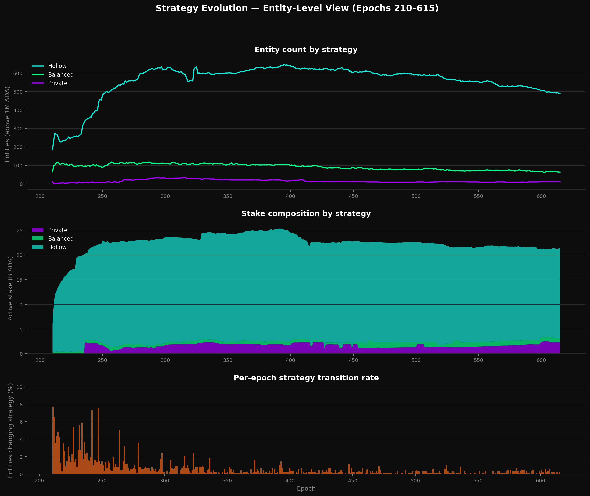
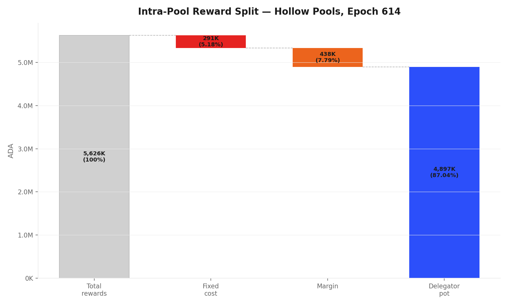
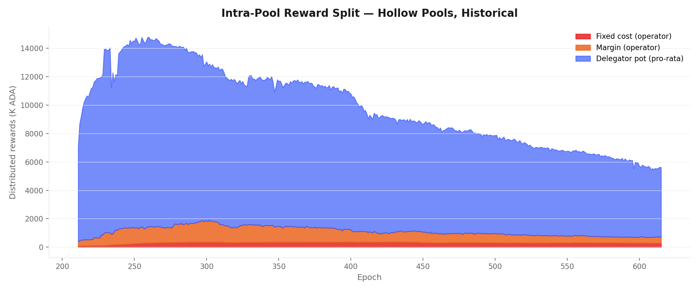
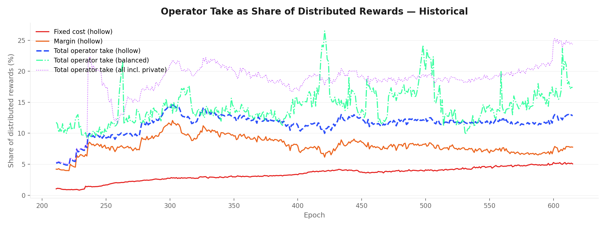
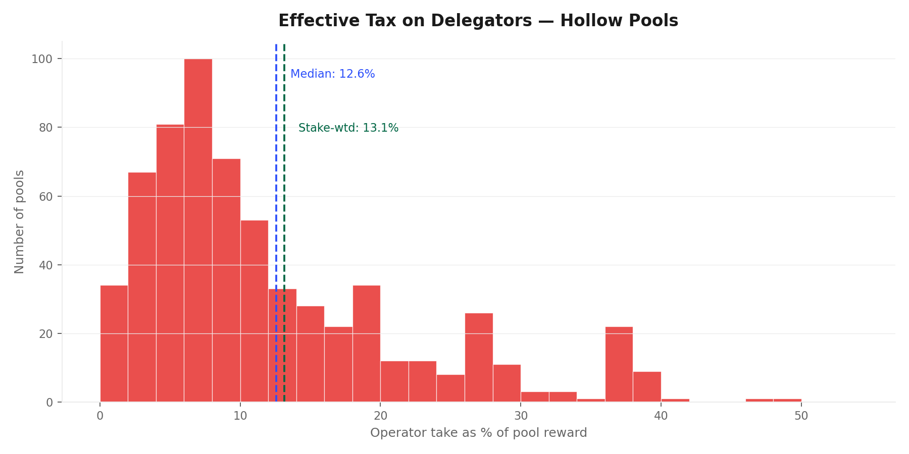
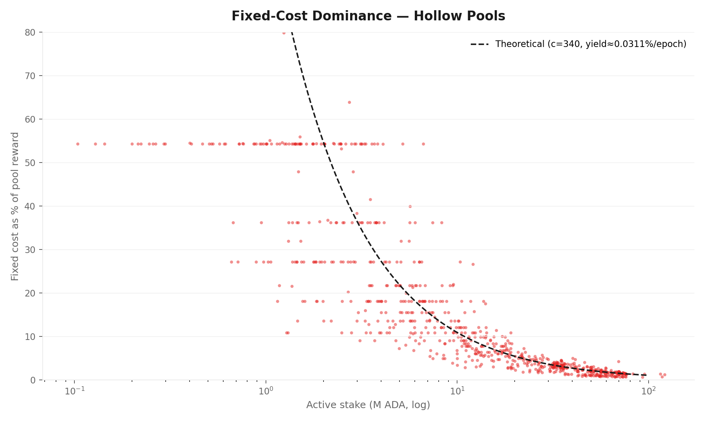
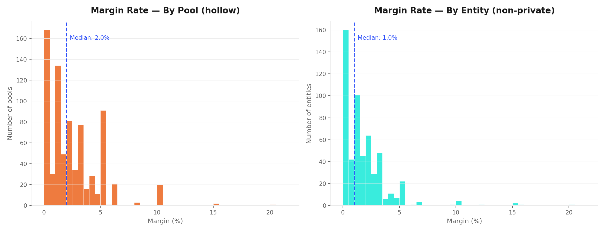
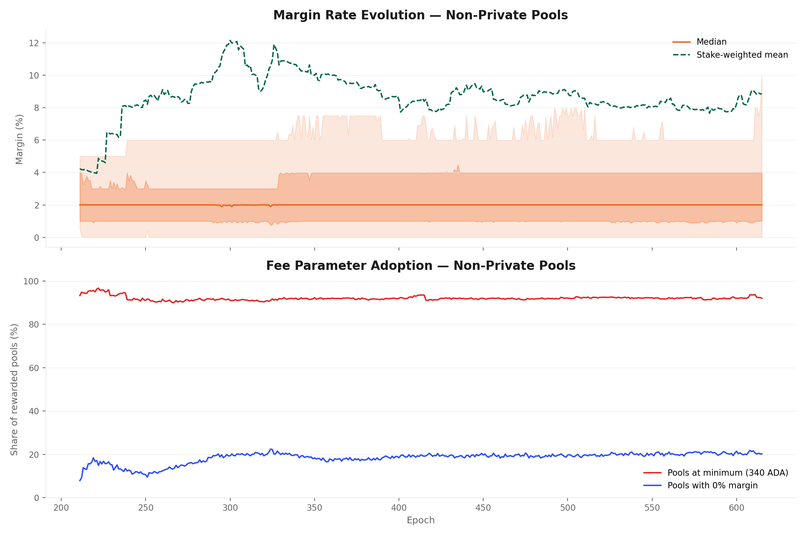
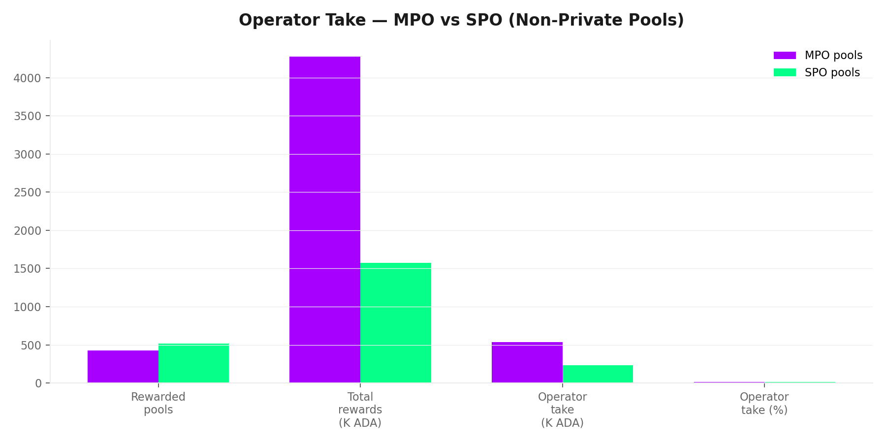
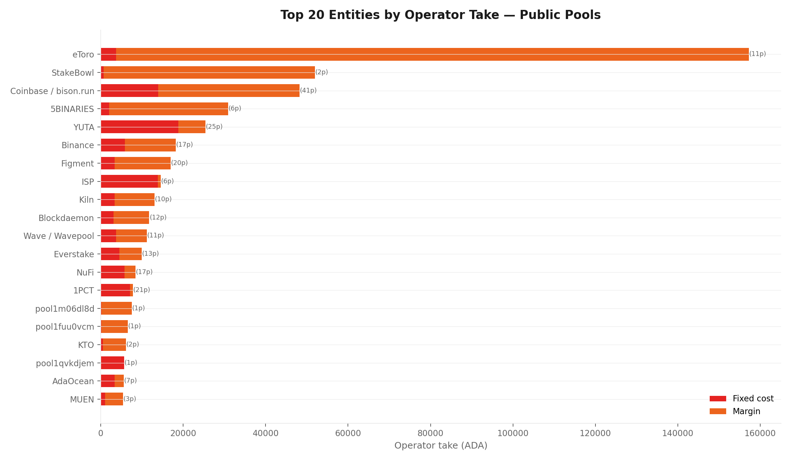

# The Operator's Cut — A Mainnet Analysis of Intra-Pool Reward Sharing

_Built on 2026/03/31 from mainnet data at epoch `614` (settled) plus historical analysis from epoch `211` (405 epochs)._

## Objective

This report analyses the **intra-pool reward split** — the third and final stage of Cardano's reward pipeline — and traces the structural forces that determine how much of each pool's reward reaches delegators versus operators. It extends the empirical baseline established in the [*Analysis of Cardano's Incentive Mechanism*](https://github.com/input-output-hk/spo-incentives/blob/main/report.pdf) (Lopez de Lara, 2025; hereafter the *Incentive Mechanism Analysis*) and operates downstream of the companion reports [*Treasury & Pool Pots Distribution*](../../treasury-and-pool-pots-distribution/mainnet-analysis/) (stage 1) and [*The Pools Pot Distribution Gaps*](../../pools-distribution/mainnet-analysis/) (stage 2).

Every epoch, once the reward curve assigns a total reward $\hat{f}$ to each pool, a second mechanism activates: the **intra-pool split**. The pool operator extracts a fixed cost $c$ and a proportional margin $m$; the remainder is distributed pro-rata among all delegators (including the operator's own stake). At epoch 614, this mechanism processed **6.75M ADA** across 875 rewarded pools — but the headline aggregate (24.3% operator take) conceals three radically different strategies. Adopting the Hollow–Private pledge spectrum from the upstream analysis ([§2.4.2](../../../README.md#242-progression--balanced-as-intended-but-private-by-design)), this report classifies entities by **owner-stake ratio** (owner active stake / pool active stake) across their pool fleets. Three strategies emerge along this spectrum: the **hollow strategy** (owner-stake ratio < 10%, 445 entities, 771 pools, 18.10B ADA, op_take=13.34%) where entities depend entirely on external delegation; the **balanced strategy** (10–95% owner-stake, 46 entities, 60 pools, 0.77B ADA, op_take=10.75%) where entities and delegators share capital with genuine alignment; and the **private strategy** (≥ 95% owner-stake, 11 entities, 44 pools, 2.29B ADA, op_take=99.97%) where entities are operator-funded. Remarkably, 495 of 502 entities (98.6%) apply a single pure strategy across all their pools, demonstrating high strategic consistency. Within hollow-strategy entities, a sub-population of 48 "functionally private" pools (margin ≥ 99.9%, typically exchanges and custodians) extract 100% via margin, leaving 723 genuine hollow pools at 7.7% operator take. The entity-level analysis reveals that margin competition is broadly active in the genuine hollow market (median entity margin 1.0%, stake-weighted 8.9%) but fixed cost, not margin, is the dominant extraction channel. Balanced-strategy entities form the smallest population but analytically most significant: they are where the pledge mechanism produces genuine alignment, with many pools carrying Material or High pledge tags and median owner-ratio 26.4%.

The argument proceeds in six steps:

1. **The formula** (§2). The SL-D1 intra-pool reward-sharing specification — from the original design through a residual-split decomposition to a reader-friendly rewrite and mainnet parameterization. The mechanism is sequential: fixed cost first, margin on the remainder, then pro-rata distribution. A critical protocol detail: when $\hat{f} < c$, the operator takes $\hat{f}$ (not $c$) — the effective fixed cost is $\min(c, \hat{f})$.

2. **Three operator strategies** (§4). The 502 entities operating rewarded pools classify into three populations by the owner-stake ratio of their fleet: hollow (< 10%), balanced (10–95%), and private (≥ 95%). Strategy classification and consistency are documented in the upstream analysis ([§2.4.3.1](../../../README.md#2431-what-mainnet-reveals)); this report applies the same framework and adds the reward-split decomposition per population (§6 private, §7 balanced, §8 hollow).

3. **The delegator's strategy** (§5). The delegator's action space reduces to a single decision — which pool — governed by two criteria: yield (annualised ROS) and the ethics of pool selection (commitment, independence, transparency). The yield trajectory is declining predictably (halving every ~3 years, R²=0.99 fit to reserve depletion), and Cardano's 2.01% sits below the risk-free rate and most PoS peers. Within the pool landscape, the yield surface is remarkably flat: the 30–77M bucket where 70% of delegation lives shows a middle-half spread of just 0.46pp, and the fixed-cost floor — not margin — is the dominant differentiator. When yield cannot meaningfully distinguish pools, the delegator's choice becomes partly an expression of values.

4. **The private strategy universe** (§6). The 11 entities following the private strategy (44 pools, 2.29B ADA, op_take=99.97%) are operator-funded and absorb 99.97% of their rewards as operator take. Margin is an accounting choice (vast majority set ≥ 99.9%), fixed cost negligible. Paradoxically, entities in this group often carry Low or Zero pledge tags despite owning the capital and facing no custodial constraint — the pledge mechanism does not appear to attract commitment even where conditions are most favourable. The intra-pool split is structurally trivial here; the analytical value lies in the pledge dimension.

5. **The balanced strategy population** (§7). The 46 entities following the balanced strategy (60 pools, 0.77B ADA, op_take=10.75%) split capital between themselves and delegators with genuine alignment. Margins are low and many pools carry Material or High pledge tags — genuine skin-in-the-game. This is the only population where the pledge mechanism produces meaningful operator alignment.

6. **The hollow strategy market** (§8). The 445 entities following the hollow strategy (771 pools, 18.10B ADA, op_take=13.34%) depend entirely on external delegation, forming the public delegation market, with 48 functionally private pools (exchanges, custodians: 100% extraction) distorting the aggregate. Excluding them, the genuine market (723 pools) operates at 7.7% operator take — with fixed cost (4.9%) slightly exceeding margin (2.8%). At the entity level, median margin is 1.5% and stake-weighted mean is 8.9%, confirming active margin competition. The dominant extraction in the genuine market is the fixed-cost floor, not margin.

7. **Structural implications** (§9). The fixed-cost floor creates a regressive tax on small-pool delegators. Margin competition is active in the genuine hollow market (median entity margin 1.5%) but the fixed cost, being a flat ADA amount, penalises small pools disproportionately. The two-regime structure — where fixed cost dominates small pools and margin dominates large pools — has direct consequences for any future mechanism revision.

All counts and amounts use epoch **614** (the latest settled epoch with complete reward data). Source data: `koios_pool_history_mainnet.csv`, `koios_pool_owner_history_mainnet.csv`, `koios_pool_list_mainnet.csv`, `mpo_entity_pool_mapping_mainnet.csv` (Koios + entity attribution from the [*pools-distribution*](../../pools-distribution/mainnet-analysis/) flow).

## Contents

1. [Mainnet Observations](#1-mainnet-observations)
2. [The formula — intra-pool reward sharing](#2-the-formula--intra-pool-reward-sharing)
   - 2.1 [SL-D1 (Original)](#21-sl-d1-original)
   - 2.2 [Residual split decomposition](#22-residual-split-decomposition)
   - 2.3 [Reader-friendly formulation](#23-reader-friendly-formulation)
   - 2.4 [Mainnet parameterization](#24-mainnet-parameterization)
   - 2.5 [Concept glossary](#25-concept-glossary)
3. [Fee parameter landscape](#3-fee-parameter-landscape)
   - 3.1 [The fixed cost](#31-the-fixed-cost)
      - 3.1.1 [Economic weight — material only for sub-viable pools](#311-economic-weight--material-only-for-sub-viable-pools)
      - 3.1.2 [The floor reduction — a governance action that does not propagate](#312-the-floor-reduction--a-governance-action-that-does-not-propagate)
         - 3.1.2.1 [By strategy](#3121-by-strategy)
         - 3.1.2.2 [By entity and stake concentration](#3122-by-entity-and-stake-concentration)
         - 3.1.2.3 [Multi-pool operators: fleet-wide policy](#3123-multi-pool-operators-fleet-wide-policy)
         - 3.1.2.4 [Single-pool operators: adoption by tier](#3124-single-pool-operators-adoption-by-tier)
      - 3.1.3 [Cross-chain comparison — a fee design without precedent](#313-cross-chain-comparison--a-fee-design-without-precedent)
      - 3.1.4 [Takeaway](#314-takeaway)
   - 3.2 [The margin](#32-the-margin)
      - 3.2.1 [The common ground — margin as the operator's sole differentiator](#321-the-common-ground--margin-as-the-operators-sole-differentiator)
      - 3.2.2 [Margin categorisation — the degree of freedom](#322-margin-categorisation--the-degree-of-freedom)
      - 3.2.3 [Economic weight of the combined positions](#323-economic-weight-of-the-combined-positions)
         - 3.2.3.1 [The delegation market — hollow competitive](#3231-the-delegation-market--hollow-competitive)
         - 3.2.3.2 [The self-funded regime — private privatisation](#3232-the-self-funded-regime--private-privatisation)
         - 3.2.3.3 [The fragile tail — hollow subsidised](#3233-the-fragile-tail--hollow-subsidised)
         - 3.2.3.4 [The blind spot — functionally private pools](#3234-the-blind-spot--functionally-private-pools)
         - 3.2.3.5 [The balanced population](#3235-the-balanced-population)
         - 3.2.3.6 [Margin extraction decomposition](#3236-margin-extraction-decomposition)
      - 3.2.4 [Strategy stability over time](#324-strategy-stability-over-time)
4. [Three operator strategies](#4-three-operator-strategies)
   - 4.1 [Strategy classification](#41-strategy-classification)
   - 4.2 [The split at a glance](#42-the-split-at-a-glance)
5. [The delegator's strategy](#5-the-delegators-strategy)
   - 5.1 [What the formula offers](#51-what-the-formula-offers)
   - 5.2 [The yield criterion](#52-the-yield-criterion)
     - 5.2.1 [The yield trajectory — level, decline, and projection](#521-the-yield-trajectory--level-decline-and-projection)
     - 5.2.2 [Cardano's yield in context — three evaluation frames](#522-cardanos-yield-in-context--three-evaluation-frames)
     - 5.2.3 [The yield spread — how different are pools?](#523-the-yield-spread--how-different-are-pools)
       - 5.2.3.1 [Cross-strategy trajectory](#5231-cross-strategy-trajectory)
       - 5.2.3.2 [Inside the hollow market](#5232-inside-the-hollow-market)
       - 5.2.3.3 [The balanced premium — real or artefact?](#5233-the-balanced-premium--real-or-artefact)
       - 5.2.3.4 [Dead pools — hollow in name, zero in yield](#5234-dead-pools--hollow-in-name-zero-in-yield)
       - 5.2.3.5 [SPO versus MPO](#5235-spo-versus-mpo)
       - 5.2.3.6 [Oversaturation drag](#5236-oversaturation-drag)
       - 5.2.3.7 [Variance decomposition — luck versus structure](#5237-variance-decomposition--luck-versus-structure)
     - 5.2.4 [What drives the spread, and why the yield surface is flat](#524-what-drives-the-spread-and-why-the-yield-surface-is-flat)
   - 5.3 [Beyond yield — the ethics of pool selection](#53-beyond-yield--the-ethics-of-pool-selection)
   - 5.4 [Myopic and non-myopic delegation](#54-myopic-and-non-myopic-delegation)
   - 5.5 [The delegator's leverage](#55-the-delegators-leverage)
6. [The private strategy](#6-the-private-strategy)
   - 6.1 [Composition](#61-composition)
   - 6.2 [Intra-pool split](#62-intra-pool-split)
   - 6.3 [Margin behaviour](#63-margin-behaviour)
   - 6.4 [Pledge behaviour](#64-pledge-behaviour)
   - 6.5 [Key findings — private strategy](#65-key-findings--private-strategy)
7. [The balanced strategy](#7-the-balanced-strategy)
   - 7.1 [Composition and structure](#71-composition-and-structure)
   - 7.2 [Intra-pool split](#72-intra-pool-split)
   - 7.3 [Margin behaviour](#73-margin-behaviour)
   - 7.4 [The pledge signal — where it works](#74-the-pledge-signal--where-it-works)
   - 7.5 [Key findings — balanced strategy](#75-key-findings--balanced-strategy)
8. [The hollow strategy](#8-the-hollow-strategy)
   - 8.1 [The functionally private sub-population](#81-the-functionally-private-sub-population)
   - 8.2 [The genuine market — current snapshot (epoch 614)](#82-the-genuine-market--current-snapshot-epoch-614)
   - 8.3 [Historical evolution of the split](#83-historical-evolution-of-the-split)
   - 8.4 [The two components — fixed cost vs margin](#84-the-two-components--fixed-cost-vs-margin)
   - 8.5 [The effective tax on delegators](#85-the-effective-tax-on-delegators)
   - 8.6 [Fixed-cost dominance at the small-pool end](#86-fixed-cost-dominance-at-the-small-pool-end)
   - 8.7 [Margin distribution — by pool and by entity](#87-margin-distribution--by-pool-and-by-entity)
   - 8.8 [Fee parameter adoption](#88-fee-parameter-adoption)
   - 8.9 [MPO vs SPO operator take](#89-mpo-vs-spo-operator-take)
   - 8.10 [Top entities by operator take](#810-top-entities-by-operator-take)
   - 8.11 [Key findings — hollow strategy](#811-key-findings--hollow-strategy)
9. [Structural implications](#9-structural-implications)
   - 9.1 [Two regimes, one mechanism](#91-two-regimes-one-mechanism)
   - 9.2 [The fixed-cost floor as a regressive tax on small pools](#92-the-fixed-cost-floor-as-a-regressive-tax-on-small-pools)
   - 9.3 [Margin competition in the hollow strategy market](#93-margin-competition-in-the-hollow-strategy-market)
   - 9.4 [Open questions](#94-open-questions)
10. [Reproduction](#10-reproduction)

## 1. Mainnet Observations

| # | Observation | Summary |
| --- | --- | --- |
| O1 | **The fixed-cost floor exhibits striking inertia** | The protocol floor $c_{\min}$ was reduced from 340 to 170 ADA at epoch 445 (2023/10/27). 169 epochs later, 564 pools (64.5%) still declare 340 ADA — the former floor. Only 217 pools (24.8%) have adopted the current floor. 89.3% of pools sit at one of the two floor values; the remaining 10.7% range from 190 to 999,999 ADA. The inertia is consistent across all three strategy populations: operators overwhelmingly anchor to the floor (or the former floor), and the 564-pool residual has a material yield cost for small pools — a pool at 340 ADA pays double the minimum, eroding delegator yield by an amount that scales inversely with pool size. |
| O2 | **Margin competition is active but masked by a high-margin tail** | Margin is bimodal: 50.7% of pools declare ≤ 2%, while 11.8% declare ≥ 99% (private + functionally private). The median margin has been stable at 2.0% for 405 epochs, but the stake-weighted mean has risen from 4.2% to 18.9% — driven by the growing weight of private and captive pools in the stake distribution, not by fee increases in the competitive market. Any analysis that relies on mean or stake-weighted margin without accounting for this bimodality will overstate the fee burden on the typical delegator. |
| O3 | **Three disjoint strategies coexist on-chain with near-perfect consistency** | 445 entities follow the hollow strategy (771 pools, 18.10B ADA, < 10% owner-stake), 46 follow balanced (60 pools, 0.77B ADA, 10–95%), and 11 follow private (44 pools, 2.29B ADA, ≥ 95%). 98.6% of entities apply a single pure strategy across their entire fleet. 48 functionally private pools (exchanges, custodians at ≥ 99.9% margin) distort the hollow aggregate from 7.7% to 13.34% operator take. |
| O4 | **In the genuine hollow market, fixed cost slightly exceeds margin** | Excluding 48 captive pools, the genuine hollow market (723 pools) operates at 7.7% operator take — fixed cost 4.4%, margin 3.6%. Delegators receive 4.89M ADA (87.3% of hollow rewards) for pro-rata distribution. Entity-level median margin is 1.0%; 56.4% of entities operate below 2%. Margin competition is broadly active. |
| O5 | **The fixed cost is a regressive tax on small-pool delegators** | Effective tax ranges from ~4% (large low-margin pools) to 100% (sub-viable pools where $c \geq \hat{f}$). The fixed-cost share follows a $1/\sigma$ hyperbola. 88.8% of hollow pools declare the minimum cost — the floor is the norm. SPO pools bear a heavier effective tax (13.4% operator take) than MPO pools (12.5%) because scale dilutes the fixed-cost burden. |
| O6 | **Balanced-strategy entities are analytically significant despite small share** | 46 entities (6.9% of pool count, median owner-ratio 26.4%) form the only population where the pledge mechanism produces meaningful alignment. Many carry Material or High pledge tags — genuine skin-in-the-game. Operator take is 12.8%, dominated by fixed cost because pools tend to be small; margins are low. |
| O7 | **The delegator yield is declining on a predictable trajectory** | Stake-weighted hollow-market yield at epoch 614: 2.01% annualised (≈201 ADA/year per 10k ADA). Yield tracks reserve depletion with R²=0.99 and halves roughly every 3 years. Projected threshold crossings: < 2% in ~0.4yr, < 1.5% in ~1.7yr, < 1% in ~3.5yr, < 0.5% in ~6.7yr. The trajectory assumes constant active stake and no governance action. |
| O8 | **Cardano's yield sits below the risk-free rate and most PoS peers** | Among major PoS chains, only the S&P 500 dividend yield sits below Cardano's staking return; Ethereum delivers 1.5–2×, higher-inflation chains 3–10×. Three evaluation frames apply: same-asset (always positive), cross-asset (requires ADA price appreciation to match Treasuries), and DeFi (native staking as the risk-free rate of the ADA economy). What Cardano loses in yield it gains in design: no lockup, no slashing, no minimum, no custodial transfer. |
| O9 | **The yield spread between well-run pools is narrow** | Hollow and balanced yields correlate at 0.97 over 405 epochs — both strategies track reserve depletion in lockstep. The balanced-hollow trailing-year gap has fluctuated between 0.12pp and 0.36pp since epoch 365 — not a reliable premium. In the 30–77M bucket (70% of hollow delegation), the middle-half spread is just 0.46pp; 70.2% of delegated stake sits within ±0.5pp of the median. SPO vs MPO yield difference is negligible (2.05% vs 2.00%). |
| O10 | **Fixed cost, not margin, is the dominant yield differentiator** | The fixed-cost floor acts as a regressive levy: 54.3% effective tax for sub-3M pools, collapsing to 4.7% in the 30–77M band. A counterfactual removing the floor flattens the yield surface entirely — median yield rises +1.0pp for < 3M pools but only +0.05pp for 30–77M pools. The aggregate fixed-cost share has tripled from 1.6% (epoch 250) to 4.9% (epoch 614). Among large pools, moving from 0% to 3% margin costs only 0.07pp; small pools charge *lower* margins than large ones, so margins attenuate the size gradient rather than reinforce it. |
| O11 | **Block luck dominates single-epoch variance; structure emerges only over time** | Block-production luck explains R²=0.41 of single-epoch yield variance among large hollow pools. Over a full year, the structural spread is an order of magnitude smaller than single-epoch noise (hollow SW std dev: 0.10pp across 73 trailing epochs). Epoch-to-epoch movement is noise, not signal. |

**Scope note.** O1–O2 cover fee parameter adoption (§3). O3–O6 are structural to the intra-pool split (§4, §6–§8). O7–O11 characterise the delegator's yield landscape (§5). The fixed-cost regressive tax (O5, O10) and the flat yield surface (O9) are the two findings with the most direct implications for mechanism revision (§9).

### The big picture

**What the formula does.** Once the reward curve assigns a total reward $\hat{f}$ to a pool, the intra-pool split extracts operator compensation in two steps: a **fixed cost** $\min(c, \hat{f})$ subtracted first, then a **proportional margin** $m$ applied to the remainder $\max(\hat{f} - c, 0)$. Everything left is distributed pro-rata among all pool members by stake share — including the operator's own stake.

**Three operator strategies.** At epoch 614, 502 entities operate rewarded pools — but they do not follow a single template. Following the Hollow–Private pledge spectrum from the upstream analysis, this report classifies entities by **dominant owner-stake ratio** across their fleet: the axis runs from hollow (external delegation dominates) through balanced (genuine capital-sharing) to private (operator-funded). 445 entities follow the hollow strategy (771 pools, 18.10B ADA), 46 follow the balanced strategy (60 pools, 0.77B ADA), and 11 follow the private strategy (44 pools, 2.29B ADA). Remarkably, 98.6% of entities apply a single pure strategy across their entire fleet. The pool-level heterogeneity is strategic consistency at the entity level.


**Strategy consistency.** Among 502 entities, 495 (98.6%) operate pools that all fall into the same strategy bin. Only 7 entities are hybrid (spanning multiple bins), and they cluster near threshold boundaries. This extraordinary consistency shows that entities choose a fundamental strategy and apply it coherently across their pool fleet. An entity does not run one hollow pool and one private pool — it commits to a strategy.

**The hollow-strategy market — with a caveat.** Among entities following the hollow strategy, operator take is **13.34%** in aggregate (771 pools). But 48 of these pools are *functionally private* — exchanges and custodians that own almost none of their stake (mean owner-ratio 1.75%) yet set margin ≥ 99.9%, extracting everything. Excluding them, the genuine market (723 pools) operates at **7.7%** operator take — split between fixed cost (4.4%) and margin (3.6%). Fixed cost slightly exceeds margin, reflecting a population where 91.6% declare the minimum 340 ADA cost.

**Entity-level analysis.** Counting by pool overcounts fee policies: entities operating many pools pursue a single (or a few) policy decisions per strategy, not one per pool. Across 491 distinct entities in the hollow market, the median margin is **1.0%** and 56.4% of entities operate below 2%. Margin competition is broadly active. The dominant extraction in the hollow market is the fixed-cost floor, not margin.

**The balanced-strategy population.** The 46 entities following the balanced strategy (6.9% of pool count, 3.6% of stake, median owner-ratio 26.4%) form an analytically crucial segment where the pledge mechanism produces genuine alignment. Many carry Material or High pledge tags — genuine skin-in-the-game. They are the smallest segment but structurally important: they demonstrate that entities with real capital at stake behave differently and compete fiercely on fees.

**Why it matters for mechanism design.** The two-regime structure reveals that the intra-pool split does not operate as a single, uniform mechanism. The fixed-cost floor creates a regressive tax that penalises small-pool delegators disproportionately, while margin competition functions effectively in the large-pool regime. Any revision to the fee structure should account for this bifurcation — the small-pool regime and the large-pool regime respond to different parameters and require distinct analytical treatment.

## 2. The formula — intra-pool reward sharing

These formulas define how a pool's realized allocation is split between the operator and the rest of the pool participants.
The split happens only after the pool-level reward has already been computed and adjusted by apparent performance.

The distribution logic is sequential:

- first, the operator fixed cost is covered
- second, the operator margin is applied to the remaining amount
- finally, the residual reward is distributed proportionally across stake holders

In this final step, the operator still receives a stake-proportional share through the pledge held inside the pool, while delegators receive the complementary share.

The intra-pool split was specified in [*Design Specification for Delegation and Incentives in Cardano*](https://github.com/IntersectMBO/cardano-ledger/releases/latest/download/shelley-delegation.pdf) (Kant, Brünjes & Coutts, IOHK, 2019 — deliverable **SL-D1**, §6.5.4). The mechanism has been operational on mainnet since the Shelley hard fork on 2020/07/29 and its governing parameters have never been modified by governance action.

### 2.1 SL-D1 (Original)

The operator and member rewards are two complementary views of the same split rule applied to the realized pool allocation.
Once the pool-level reward has been computed, the split follows the same sequence:

- cover the operator fixed cost first
- apply the operator margin to the remaining amount
- distribute the residual proportionally across stake holders

Under this rule, the operator receives both the explicit operator share and the stake-proportional share attached to the pledge held inside the pool, while each member receives a stake-proportional share of the residual amount.

Operator reward, using the operator stake-share ratio $\frac{s}{\sigma}$ as a single input:

$$
r_{\text{operator}}\left(\hat f,c,m,\frac{s}{\sigma}\right)=
\begin{cases}
\hat f, & \hat f \le c \\
 c + (\hat f-c)\left(m + (1-m)\frac{s}{\sigma}\right), & \hat f > c
\end{cases}
$$

Member reward, using the member stake-share ratio $\frac{t}{\sigma}$ as a single input:

$$
r_{\text{member}}\left(\hat f,c,m,\frac{t}{\sigma}\right)=
\begin{cases}
0, & \hat f \le c \\
(\hat f-c)(1-m)\frac{t}{\sigma}, & \hat f > c
\end{cases}
$$

### 2.2 Residual split decomposition

Before switching to reader-friendly variable names, it is useful to separate the split rule into the two regimes induced by the fixed operator cost $c$. Let

$$
\rho_{\text{operator}} = \frac{s}{\sigma}, \qquad
\rho_{\text{member}} = \frac{t}{\sigma}
$$

denote the operator and member pool-share ratios.

If the realized pool allocation does not cover the fixed cost,

$$
\hat f \le c
$$

then the operator absorbs the full realized reward and members receive nothing:

$$
r_{\text{operator}}(\hat f,c,m,\rho_{\text{operator}}) = \hat f,
\qquad
r_{\text{member}}(\hat f,c,m,\rho_{\text{member}}) = 0
$$

If instead the realized pool allocation is large enough to cover the fixed cost,

$$
\hat f > c
$$

let

$$
\mu(\hat f,c,m) := m(\hat f-c),
\qquad
\psi(\hat f,c,m) := (1-m)(\hat f-c)
$$

where $\mu(\hat f,c,m)$ is the operator margin extracted from the residual reward and $\psi(\hat f,c,m)$ is the remaining amount to be shared proportionally across stake holders.

The split then becomes

$$
r_{\text{operator}}(\hat f,c,m,\rho_{\text{operator}})
= c + \mu(\hat f,c,m) + \psi(\hat f,c,m)\,\rho_{\text{operator}}
$$

$$
r_{\text{member}}(\hat f,c,m,\rho_{\text{member}})
= \psi(\hat f,c,m)\,\rho_{\text{member}}
$$

This makes the three-layer structure explicit: fixed cost first, operator margin second, proportional sharing of the remainder third.

### 2.3 Reader-friendly formulation

Let the operator and member pool-share ratios be defined as:

$$
\rho^{\text{operator}}_{i} := \frac{\pi^{\text{pledged}}_{i}}{\sigma^{\text{totalStaked}}_{i}},
\qquad
\rho^{\text{member}}_{i} := \frac{\sigma^{\text{poolMember}}_{\text{delegated},i}}{\sigma^{\text{totalStaked}}_{i}}
$$

If the realized pool allocation does not cover the fixed cost,

$$
PoolPot^{\text{actual}}_{i} \le Cost^{\text{operator}}_{\text{fixed}}
$$

then the operator absorbs the full realized reward and members receive nothing:

$$
Reward^{\text{operator}} = PoolPot^{\text{actual}}_{i}
$$

$$
Reward^{\text{member}} = 0
$$

If instead the realized pool allocation is large enough to cover the fixed cost, define the three layers of the split directly as:

$$
Cost := Cost^{\text{operator}}_{\text{fixed}}
$$

$$
Margin := \mu^{\text{operator}}
\left(
PoolPot^{\text{actual}}_{i}-Cost^{\text{operator}}_{\text{fixed}}
\right)
$$

$$
Share := \left(1-\mu^{\text{operator}}\right)
\left(
PoolPot^{\text{actual}}_{i}-Cost^{\text{operator}}_{\text{fixed}}
\right)
$$

Then the split becomes:

$$
Reward^{\text{operator}} = Cost + Margin + Share\,\rho^{\text{operator}}_{i}
$$

$$
Reward^{\text{member}} = Share\,\rho^{\text{member}}_{i}
$$

This makes the split easy to read: fixed cost first, operator margin second, and proportional sharing of the remainder third.

A fundamental property becomes visible in this form. The operator's reward has two structurally distinct components:

$$
Reward^{\text{operator}} = \underbrace{Cost + Margin}_{\text{extracted from the pool's total reward}} + \underbrace{Share\,\rho^{\text{operator}}_{i}}_{\text{earned exactly as a delegator would}}
$$

The third term — $Share\,\rho^{\text{operator}}_{i}$ — is identical in form to any member's reward: a pro-rata share of the residual, proportional to the stake contributed. For the capital the operator pledges into the pool, the protocol treats the operator *exactly* as it treats a delegator. There is no special reward channel for pledge at this stage — the operator earns the same per-ADA yield as every other participant in the pool.

What distinguishes the operator from a delegator is the first two terms: $Cost$ and $Margin$. These are the only channels through which the operator can redirect part of the reward flow that is generated by *other participants' stake*. The fixed cost is a flat extraction; the margin is a proportional extraction. Both apply to the pool's total reward before pro-rata distribution, and both reduce the yield that delegators receive.

In other words: the operator's *own* capital is rewarded identically to delegated capital. The operator's *privilege* — the compensation for running infrastructure, bearing the pledge risk, and maintaining the pool — is expressed entirely through cost and margin. The split formula does not reward the operator *for pledging*; it rewards the operator *for operating*. The pledge mechanism that makes commitment economically significant lives upstream, in the reward curve (§2 of the [main report](../../../README.md#2-pools-distribution)), not in the intra-pool split.

### 2.4 Mainnet parameterization

| Parameter | Value | Set by |
| --- | --- | --- |
| `minPoolCost` ($c_{\min}$) | 340 ADA | Protocol parameter (governance) |
| Fixed cost ($c$) | Operator-declared, $\geq c_{\min}$ | Pool registration certificate |
| Margin ($m$) | Operator-declared, $\in [0, 1]$ | Pool registration certificate |

At epoch 614 (hollow-strategy pools): 93.5% of rewarded hollow-strategy pools declare $c = 340$ ADA (the minimum). The median declared margin is 2.0%; the entity-level median is 1.0% and the stake-weighted mean is 3.8%.

### 2.5 Concept glossary

| Symbol | Name | Definition |
| --- | --- | --- |
| $\hat{f}$ | Actual pool reward | Performance-adjusted output of the reward curve (stage 2) |
| $c$ | Declared fixed cost | Operator-declared flat ADA, $\geq c_{\min}$ |
| $c_{\text{eff}}$ | Effective fixed cost | $\min(c, \hat{f})$ — the actual ADA deducted |
| $m$ | Margin | Operator's declared share of reward after cost deduction |
| $c_{\min}$ | Minimum pool cost | Protocol-enforced floor on $c$ (currently 170 ADA; formerly 340 ADA) |
| Operator take | $c_{\text{eff}} + m(\hat{f} - c_{\text{eff}})$ | Total declared-fee extraction (= on-chain `pool_fees`) |
| Delegator pot | $(1-m)(\hat{f} - c_{\text{eff}})$ | Amount entering pro-rata distribution |
| Effective tax | Operator take / $\hat{f}$ | Fraction of pool reward extracted before pro-rata |

## 3. Fee parameter landscape

The formula gives operators two levers: a fixed cost $c$ (constrained by the protocol floor $c_{\min}$) and a proportional margin $m \in [0, 1]$. Before analysing how rewards flow through the split, it is worth examining how operators actually set these parameters — and how the distributions have evolved over 405 epochs.

### 3.1 The fixed cost

#### 3.1.1 Economic weight — material only for sub-viable pools

The fixed cost is the flat ADA amount deducted from every pool's reward before margin and pro-rata distribution. At epoch 614, the aggregate fixed-cost extraction across all 875 rewarded pools is 305,989 ADA — 4.5% of total pool rewards and 18.7% of total operator take. These aggregate figures understate the parameter's importance. The fixed cost is economically irrelevant for private-strategy pools (1.6% of their operator take — extraction runs through margin), but it is the dominant fee component for the delegator-facing population: among hollow and balanced pools (828 pools), fixed costs account for 39.5% of operator take — the single largest component of declared fees. For balanced pools specifically, the ratio rises to 64.2%.

The weight is sharply regressive across pool tiers ([§4.1.3](../../pools-distribution/mainnet-analysis/README.md#413-tier-definitions)): the median fixed cost absorbs 54.3% of pool rewards for sub-viable pools, 8.4% for Healthy pools, and 1.5% at near-saturation. For a small pool, the fixed cost *is* the fee.

| Tier | Median fixed cost as % of pool reward |
| --- | ---: |
| Sub-viable (1–3M) | 54.3% |
| Healthy (3–38.5M) | 8.4% |
| Large healthy (38.5–61.6M) | 2.0% |
| Near-saturation (61.6–73.1M) | 1.5% |
| Saturated (73.1–80.8M) | 1.4% |

The 170 ADA difference between the former floor (340) and the current floor (170) sharpens the picture. The table below quantifies the impact of adopting the current floor, by tier:

| Tier | Saving as % of pool reward | Saving as % of delegator pot | Gain per 10k ADA delegated / year |
| --- | ---: | ---: | ---: |
| Sub-viable (<3M) | **27.1%** | **59.9%** | **67.78 ADA** |
| Healthy (3–38.5M) | 4.5% | 6.2% | 10.00 ADA |
| Large healthy (38.5–61.6M) | 1.1% | 1.1% | 2.46 ADA |
| Near-saturation (61.6–73.1M) | 0.8% | 0.9% | 1.77 ADA |
| Saturated (>73.1M) | 0.7% | 0.8% | 1.64 ADA |

For a sub-viable pool, the 170 ADA saving represents 27.1% of the total pool reward and 59.9% of the delegator pot — the difference between meaningful delegation income and near-zero yield. For a saturated pool, the same 170 ADA is 0.7% of pool reward — a rounding error that no delegator would notice. At the sub-viable tier, 59 pools earn a total reward below 340 ADA: the operator takes *everything*, and delegators receive zero. For these pools, the fixed cost is confiscatory.

Above 38.5M ADA active stake, the fixed cost ceases to be the dominant fee component: margin accounts for 2× the fixed cost at the large-pool end (median margin share 3.0% vs fixed-cost share 1.5%). For the five largest MPOs (Coinbase, Kiln, Upbit, eToro, Wave — 4.7B ADA combined), it is a rounding error. The parameter matters most precisely where the entities that set it have the least incentive to optimise it.

> **Finding F3.1 — The fixed cost is confiscatory for small pools and irrelevant for large ones.** At the sub-viable tier it absorbs 27% of pool reward and 60% of the delegator pot; for 59 pools it exceeds the total reward — delegators receive zero. Above 38.5M ADA, margin is 2× the fixed cost and the parameter disappears into noise.

#### 3.1.2 The floor reduction — a governance action that does not propagate

The protocol floor $c_{\min}$ was set at **340 ADA** when the Shelley era launched on 2020/07/29 and remained at that level for over three years. On 2023/10/27 (epoch 445), following an SPO poll and a governance action submitted by the Cardano Foundation, the floor was halved to **170 ADA** — the first (and, as of epoch 614, the only) modification to this parameter. If all pools still declaring 340 were to adopt the current floor, the saving would be ~94,890 ADA per epoch — roughly 6.9M ADA per year redirected from operator extraction to the delegator pot.

At epoch 614 — 169 epochs after the reduction — the pool-level adoption snapshot is:

| Fixed cost declared | Pools | % of 875 |
| --- | ---: | ---: |
| 170 ADA (current floor) | 217 | 24.8% |
| 340 ADA (former floor) | 564 | 64.5% |
| Other (190–999,999 ADA) | 94 | 10.7% |

89.3% of pools declare one of the two floor values. The remaining 94 split between modest overstatements (55 pools ≤ 500 ADA) and outliers that use the fixed cost as an extraction mechanism in place of margin (11 pools above 1,000 ADA).


> **Finding F3.2 — Two-thirds of pools ignore the only governance action ever taken on this parameter.** 564 pools (64.5%) still declare 340 ADA, 169 epochs after the floor was halved. Only 24.8% have adopted the current floor — a structural feature of the landscape, not a transient adjustment lag.

##### 3.1.2.1 By strategy

The aggregate masks sharp differences across the three operator strategies. Among pools declaring a floor value (170 or 340), the adoption rate of the new floor varies from 15.6% (private) to 39.2% (balanced):

| | Hollow | Balanced | Private |
| --- | --- | --- | --- |
| Pools at 170 (current floor) | 190 (27.7%) | 20 (39.2%) | 7 (15.6%) |
| Pools at 340 (former floor) | 495 (72.3%) | 31 (60.8%) | 38 (84.4%) |

Private pools show the strongest inertia: 84.4% of floor-declaring private pools remain at 340. This is structurally expected — private-strategy operators extract via margin (typically ≥ 99%), so the fixed cost is economically negligible to them and there is no delegator-facing incentive to update it. Balanced pools are the most responsive (39.2% adoption) — consistent with their smaller pool sizes, where the 170 ADA difference is proportionally more significant. Hollow pools sit in between at 27.7%.

> **Finding F3.3 — Inertia tracks economic salience: those who care least update least.** Private pools (84.4% still at 340) extract via margin and have no reason to touch the cost; balanced pools (60.8% at 340) are small and delegator-facing, so the parameter bites — and they respond most. Hollow pools sit in between (72.3%).

##### 3.1.2.2 By entity and stake concentration

Shifting from pool-level to entity-level analysis sharpens the picture. Among the 448 entities whose entire fleet declares a floor value (170 or 340):

| | Entities | Pools | Stake |
| --- | ---: | ---: | ---: |
| All pools at 170 | 151 (33.7%) | 193 | 4.15B ADA (22.6%) |
| All pools at 340 | 290 (64.7%) | 505 | 12.89B ADA (70.3%) |
| Mixed fleet (some 170, some 340) | 7 (1.6%) | 44 | 1.31B ADA (7.1%) |

The stake-weighted inertia is more pronounced than the entity count suggests: 70.3% of stake across floor-declaring entities remains at 340. The largest entities are overwhelmingly in the non-adoption camp — Coinbase (41 pools, 2.44B ADA), Kiln (10 pools, 0.75B ADA), Upbit (15 pools, 0.52B ADA), eToro (11 pools, 0.51B ADA), and Wave (13 pools, 0.51B ADA) are all fully at 340. On the adoption side, Figment (20 pools, 0.70B ADA) is the only large MPO to have fully updated its fleet. The Cardano Foundation — the entity that submitted the governance action — adopted 170 across its 6 pools (0.46B ADA).

> **Finding F3.4 — The five largest entities (4.7B ADA) have not updated — and they set the tone for the network.** 70.3% of floor-declaring stake remains at 340. Figment and the Cardano Foundation are the only large operators to have adopted the current floor.

##### 3.1.2.3 Multi-pool operators: fleet-wide policy

Multi-pool operators manage fleets of pools under a single operational decision. The question is whether their cost declaration reflects a deliberate fleet-wide policy or a patchwork of pool-level accidents.

Among the 83 MPO entities, 69 (83.1%) apply a uniform fixed cost across their entire fleet: 11 uniformly at 170 (2.07B ADA), 52 uniformly at 340 (10.19B ADA), and 6 at a non-floor value (Binance at 345, HODL₳ at 500, CNODE at 495, among others). The remaining 14 entities (16.9%) run a mixed fleet — some pools updated, others not — totalling 2.89B ADA. The mixed-fleet group includes Everstake (2 of 12 pools at 170, the rest at 400), Blockdaemon (6/12 at 170), Emurgo (7/8 at 170), and YUTA (23 at 340, plus two outliers above 1,000 ADA). These mixed fleets suggest partial migration or operational incoherence rather than a deliberate dual-pricing strategy.

> **Finding F3.5 — Non-adoption is a deliberate fleet-wide policy, not a per-pool oversight.** 83.1% of MPOs apply a uniform fixed cost across their entire fleet. The 52 entities uniformly at 340 control 10.19B ADA — the bulk of the stake-weighted residual.

The aggregate adoption gap between multi-pool and single-pool operators confirms this structural divide. Among hollow entities declaring a floor value:

| Operator type | Adopted 170 | Still at 340 | Adoption rate | Stake at 340 |
| --- | ---: | ---: | ---: | ---: |
| Single-pool operators | 119 / 331 | 212 / 331 | 36.0% | 2.34B ADA |
| Multi-pool operators | 10 / 58 | 48 / 58 | 17.2% | 8.73B ADA |

> **Finding F3.6 — MPO inertia drives the aggregate: 48 hollow MPOs at 340 account for 8.73B ADA — 4× the single-pool residual.** Adoption rates diverge sharply: 36.0% among SPOs vs 17.2% among MPOs. The entities with the most stake are the least responsive.

##### 3.1.2.4 Single-pool operators: adoption by tier

Among single-pool operators, the adoption rate varies across the tier structure established in the pools-distribution analysis ([§4.1.3](../../pools-distribution/mainnet-analysis/README.md#413-tier-definitions)):

| Tier | Adopted 170 | Still at 340 | Adoption rate |
| --- | ---: | ---: | ---: |
| Sub-viable (1–3M) | 62 | 68 | 47.7% |
| Healthy (3–38.5M) | 57 | 152 | 27.3% |
| Large healthy (38.5–61.6M) | 12 | 11 | 52.2% |
| Near-saturation (61.6–73.1M) | 7 | 4 | 63.6% |
| Saturated (73.1–80.8M) | 2 | 3 | 40.0% |

The pattern is not monotonic. Sub-viable pools — economically precarious, where the fixed cost weighs most heavily relative to pool rewards (F3.1) — adopt at 47.7%, suggesting operators fighting for every margin of delegator yield. The Healthy tier, which contains the bulk of the single-pool population (209 pools), is the least responsive at 27.3%: large enough to be viable, but apparently not engaged enough to prioritise parameter updates. Adoption rises again above 38.5M, reaching 63.6% in the near-saturation band — consistent with professionally managed operations that actively track protocol parameters.

> **Finding F3.7 — The core operating tier — where most single-pool operators sit — is the least responsive.** Sub-viable pools adopt at 47.7% (fighting for yield), near-saturation at 63.6% (professionally managed), but the Healthy core at only 27.3%.

#### 3.1.3 Cross-chain comparison — a fee design without precedent

The two-parameter fee model (fixed cost + proportional margin) is unique to Cardano among major PoS protocols. Every other chain that implements a protocol-level operator/delegator split uses a single proportional commission rate.

| Chain | Fee mechanism | Fixed cost | Proportional commission | Protocol constraints |
| --- | --- | --- | --- | --- |
| **Cardano** | Protocol — sequential: fixed cost then margin | Yes, with enforced floor ($c_{\min}$) | Yes, $m \in [0, 1]$, unconstrained | Floor on fixed cost; no bounds on margin |
| **Cosmos Hub** | Protocol — single commission | No | Yes, single rate | Max rate and max daily change immutable at creation; 5% minimum imposed by governance |
| **Solana** | Protocol — single commission on inflation rewards | No | Yes, single rate (typically 0–10%) | No protocol minimum |
| **Polkadot** | Protocol — single commission, then pro-rata | No | Yes, percentage | No enforced bounds; equal base reward per validator in active set |
| **Ethereum** | None — protocol pays the validator directly | No | No (off-chain, platform-level) | Solo validators keep 100%; commission managed by Lido, Coinbase, etc. |
| **Tezos** | None — distribution is off-chain by the baker | No | No (off-chain, convention) | Baker decides; tools like TRD; typically 5–10% |

Three observations follow from this comparison.

**The fixed cost has no equivalent elsewhere.** No other major PoS chain deducts a flat absolute amount before applying a proportional commission. The fixed cost is a design choice specific to SL-D1. The regressive tax structure documented in F3.1 — where the fixed-cost share follows a $1/\sigma$ hyperbola — is a problem that single-commission chains do not have. A proportional-only fee applies uniformly regardless of pool size.

**The industry norm is a single proportional parameter.** Cosmos, Solana, and Polkadot all converge on the same minimal model: one commission rate, applied proportionally. Complexity is managed through *constraints* on that rate (governance-imposed floors, immutable ceilings, max daily change) rather than through additional fee parameters. Cardano's two-parameter model is not just different — it is structurally more complex than what the rest of the industry has found sufficient.

**Two chains have no protocol-level mechanism at all.** Ethereum and Tezos delegate the operator/delegator split entirely to the platform or baker layer. The protocol sees a single validator; how rewards are shared with stakers is an off-chain arrangement. This is the opposite end of the design spectrum from Cardano's protocol-enforced two-parameter model.

> **Finding F3.8 — No other major PoS protocol uses a fixed absolute cost — the mechanism is unique to Cardano.** Cosmos, Solana, Polkadot, Ethereum, and Tezos all use either a single proportional commission or no protocol-level fee at all. The $1/\sigma$ regressive extraction the fixed cost produces has no equivalent elsewhere.

#### 3.1.4 Takeaway

The fixed cost is economically decisive only at the sub-viable tier (§3.1.1), its sole governance adjustment has failed to propagate (§3.1.2), and no other major PoS protocol uses the mechanism (§3.1.3). These three properties compound: a parameter that matters only for small pools, that large operators have no incentive to update, and that the industry has not adopted elsewhere.

### 3.2 The margin

#### 3.2.1 The common ground — margin as the operator's sole differentiator

Section §3.1.1 established that the fixed cost is economically negligible for every pool above the sub-viable tier. For the consensus-relevant population — the pools that actually produce blocks and secure the network — the fixed cost is noise. Setting $Cost \approx 0$ in the reader-friendly formulation (§2.3) collapses the three-layer split to two:

$$
Reward^{\text{operator}} \approx Margin + Share\,\rho^{\text{operator}}_{i}
$$

$$
Reward^{\text{member}} \approx Share\,\rho^{\text{member}}_{i}
$$

The $Share\,\rho^{\cdot}_{i}$ term treats operator and delegator identically: at equal stake, they receive the same reward. Pledge and delegation are fungible ADA inside the pool. The *only* term that differentiates the operator from a delegator is the $Margin$. Without it ($\mu^{\text{operator}} = 0 \Rightarrow Margin = 0$), an operator with 10k ADA pledged earns exactly the same as a delegator with 10k ADA delegated to the same pool.

The margin is therefore not a fee in the conventional sense — it is the **operator's premium**: the compensation for running infrastructure, bearing operational risk, and maintaining the pool's availability. It is the answer to the question: *how much more should the entity that produces blocks earn, per ADA in the pool, compared to the entity that merely delegates?*

This framing clarifies what the rest of this section examines. The fixed cost is a legacy artefact that distorts small pools (§3.1). The pro-rata share is mechanical — it follows from stake weight. The margin is the only parameter where the operator makes an active economic choice about how to price their service relative to delegators. How operators use this degree of freedom — and whether the resulting strategies cluster into identifiable patterns — is the subject of what follows.

#### 3.2.2 Margin categorisation — the degree of freedom

The owner-stake ratio produced three strategies ([§2.4.2](../../../README.md#242-progression--balanced-as-intended-but-private-by-design)). The margin introduces a second degree of freedom — but a qualitatively different one.

The owner-stake ratio is a *compound* outcome — it depends on the operator's pledge choice and on the delegation the pool attracts, so it cannot be read as a single declaration. The margin is *explicit*: every operator chooses a value in $[0, 1]$ and publishes it on-chain. And unlike the fixed cost, which clusters at two protocol-floor values (§3.1), the margin has no enforced floor or ceiling. It is the only fully unconstrained, continuously variable parameter in the intra-pool split.

At epoch 614, the margin distribution among hollow pools clusters into four bands with clear economic meanings:

| Band | Range | Hollow pools | Stake | Economic logic |
| --- | --- | ---: | ---: | --- |
| **Subsidised** | $m = 0\%$ | 140 (18.2%) | 2.60B | The operator renounces the sole discretionary lever — margin extraction is zero. Revenue comes only from the fixed cost and the (typically negligible) pro-rata owner share. |
| **Competitive** | $0 < m \leq 5\%$ | 519 (67.3%) | 12.72B | The market norm — modest fee, competition on yield. Five round values (1%, 2%, 3%, 4%, 5%) account for 70% of this band. |
| **Additional-services** | $5\% < m < 99\%$ | 55 (7.1%) | 1.64B | Above-market pricing reflecting services beyond staking: reporting, compliance, managed infrastructure. Almost exclusively MPOs (Figment, Kiln, Blockdaemon, Binance). |
| **Privatisation** | $m \geq 99\%$ | 57 (7.4%) | 1.11B | Total extraction — the margin converts the pool into a de facto private operation regardless of ownership. Exchanges and custodians (eToro, StakeBowl, 5BINARIES). |

The four bands are not arbitrary quantiles — they correspond to visible gaps in the distribution. The cliff between competitive and additional-services is sharp: 85.5% of hollow pools sit at or below 5%, then the density drops to near zero before resurfacing at 99–100%. The middle ground (5–99%) is sparsely populated and structurally distinct from the two clusters on either side.

These margin bands cross-cut the three owner-stake strategies. The same band label applies regardless of strategy — what changes is the economic meaning of that choice, because the operator's alternative revenue (pro-rata owner share) depends on pledge. The next section maps the full matrix and quantifies where the economic weight actually sits.

#### 3.2.3 Economic weight of the combined positions

Crossing the three owner-stake strategies with the four margin bands produces a 3 × 4 matrix of combined positions. At epoch 614, ten of the twelve cells are populated. The figure below shows each cell's pool count, entity count, aggregate stake, and internal composition by pool-size tier ($z_0 \approx 77\text{M ADA}$). The classification is an entity-level property: 472 of 502 entities (94.0%) place all their pools in a single cell, and 98.6% follow a single pure owner-stake strategy across their entire fleet. The 30 entities that span multiple cells are large institutional operators (Kiln, Figment, Binance) whose margin varies across pools while the owner-stake strategy remains the same.


Two cells are empty — *private × subsidised* and *private × additional-services* — for a straightforward reason: a private-strategy entity already captures the bulk of rewards through its pro-rata owner share, so there is no economic incentive to set margin to zero or to price a service towards external delegators that do not exist.

The populated cells reveal four structurally distinct regimes.

##### 3.2.3.1 The delegation market — hollow competitive

519 pools, 290 entities, 12.72B ADA, 60.1% of stake.

This is where margin functions as a genuine competitive instrument. The tier composition is broadly healthy — 325 pools in the Healthy tier, 77 Large healthy — but 67 Sub-viable pools persist below the 3M ADA viability threshold. MPOs control 77% of the stake despite representing 57% of the pools. SPOs undercut them on margin (median 1.0% vs 3.0%), but delegation flows to scale, not to price. Even in this competitive band, the fixed cost accounts for 59.7% of operator take — margin has not displaced it as the primary fee component.

##### 3.2.3.2 The self-funded regime — private privatisation

44 pools, 11 entities, 2.36B ADA, 11.2%.

The tier composition contradicts the intuition that "private" means "small": 21 pools sit at Near-saturation or Saturated (> 62M ADA), and the average pool size is 54M ADA. These are well-capitalised entities — CHUCK BUX, SundaeSwap, Liqwid — that own the stake and route rewards via a ≥ 99% margin declaration. The effective tax is 100% by construction, but no independent delegator is affected.

##### 3.2.3.3 The fragile tail — hollow subsidised

140 pools, 125 entities, 2.60B ADA, 12.3%.

This is the most puzzling and most vulnerable position. The tier composition is stark: 55 pools (39%) are Sub-viable, the highest proportion of any cell. These operators renounce their sole discretionary fee lever — margin is zero, revenue comes only from the fixed cost. The effective tax is 4.7%, the lowest on the network. Unlike every other hollow band, stake splits evenly between MPOs (51%) and single-pool operators (49%), suggesting that the zero-margin choice correlates with a different operator profile — smaller, less professionalised, competing on principle rather than on infrastructure.

##### 3.2.3.4 The blind spot — functionally private pools

57 pools, 39 entities, 1.11B ADA, 5.2%.

These are exchanges, custodians, and staking-as-a-service providers — eToro (11 pools, 506M ADA), StakeBowl (2 pools, 140M), 5BINARIES (5 pools, 102M) — that exercise de facto control over delegated stake through custody. The on-chain owner-stake ratio measures *ownership*, not *control*: the exchange does not own the ADA, but it chooses the pool, sets the margin at ≥ 99%, and captures the reward. We call these **functionally private** pools: hollow by the owner-stake metric, private by economic behaviour. Their delegators are platform users, not free-market participants.

##### 3.2.3.5 The balanced population

57 pools, 52 entities, 0.58B ADA, 2.7%.

Uniformly modest in scale across all four margin bands. No pool reaches Near-saturation. This is the structural signature of genuine skin-in-the-game: entity scale is bounded by the operator's own capital, producing a population that is economically viable but never dominant.

##### 3.2.3.6 Margin extraction decomposition

These structural differences have a direct consequence for how we read the headline margin figure. Total margin extraction at epoch 614 is **1,332,699 ADA** — but 88% of it comes from populations where margin is not a competitive instrument:

| Population | Margin extraction (ADA) | Share of total | Competitive signal? |
| --- | ---: | ---: | --- |
| Declared private (47 pools) | 885,898 | 66.5% | No — accounting choice |
| Functionally private (57 pools) | 286,768 | 21.5% | No — custodial extraction |
| Genuine hollow market (714 pools) | 150,805 | 11.3% | Yes |
| Balanced (57 pools) | 9,228 | 0.7% | Yes |

In the genuine hollow market — the only population where margin operates as a pricing signal — margin extraction (150,805 ADA) is less than fixed-cost extraction (213,100 ADA). The fixed cost remains the dominant fee channel at 58.6% of operator take. Once functionally private pools are separated out, the hollow market resolves into a tight, low-fee norm: median margin 1.5%, stake-weighted mean 3.4%, 57% of pools at ≤ 2%. The apparent mean-median divergence in unseparated data was a compositional artefact created by the functionally private tail, not a sign of fee inflation in the competitive market.

> **Finding F3.9 — The strategy × margin matrix partitions 875 pools into four structurally distinct regimes.** The delegation market (*hollow competitive*, 60.1% of stake) is broadly healthy but carries a sub-viable tail. The self-funded regime (*private privatisation*, 11.2%) concentrates near saturation, not at the small-pool end. The fragile tail (*hollow subsidised*, 12.3%) has 39% sub-viable pools — the highest of any cell. And the blind spot (*hollow privatisation*, 5.2%) reveals 57 custodial pools that are *functionally private* — hollow by capital ownership, private by economic behaviour. Entity-level consistency is high: 94% of entities occupy a single cell.

> **Finding F3.10 — Margin is a competitive instrument in only 12% of its own headline extraction.** Of the 1.33M ADA extracted via margin per epoch, 88% comes from declared-private and functionally private pools where the margin serves an accounting or custodial function, not a pricing one. In the genuine hollow market, fixed cost exceeds margin as the dominant fee component (58.6% vs 41.4%), and margin competition resolves into a tight low-fee norm once the compositional artefact is removed.

#### 3.2.4 Strategy stability over time

The combined positions described above are a snapshot at epoch 614. A natural question is whether entities migrate between cells over time — i.e. whether the four regimes identified in §3.2.3 are stable structural features or transient labels that shift as delegation flows.



The figure tracks three panels across 405 epochs. The top panel shows entity counts by owner-stake strategy (restricted to pools above the 1M ADA production threshold): hollow entities have grown steadily from ~200 to ~500, balanced has peaked around 300 and declined to ~200, and private has remained flat at ~50. The middle panel shows the corresponding stake composition — hollow has dominated throughout, rising from ~8B to ~21B. The bottom panel tracks the per-epoch strategy transition rate: the fraction of entities whose dominant owner-stake strategy changed from one epoch to the next.

The transition rate is remarkably low. The median per-epoch rate is **0.28%** — meaning that in a typical epoch, fewer than 2 entities out of ~600 change strategy. The margin-band transition rate is even lower at 0.16% per epoch.

Over the full 405-epoch span, 446 of 1,830 entities tracked (24.4%) changed strategy at least once. But the nature of these transitions reveals that nearly all of them are boundary drift rather than genuine strategic pivots: 89% of the 1,431 total transition events are hollow ↔ balanced oscillations (652 balanced→hollow, 621 hollow→balanced). These occur when an entity's delegation fluctuates around the 10% owner-stake threshold — the entity's *behaviour* does not change, only the label assigned by the classification boundary. Transitions involving the private strategy are rare: 78 private→balanced, 52 balanced→private, 28 involving hollow↔private. Among entities active for at least 200 epochs (n=612), 37.9% experienced at least one label change — but the overwhelming majority are threshold oscillations, not deliberate repositionings.

The margin landscape confirms this stability. The median margin across all pools has held at 2.0% since the early Shelley era. The rising stake-weighted mean (4.2% → 18.9%) is driven entirely by the growing weight of declared-private and functionally private pools in the overall stake distribution, not by fee inflation in the competitive market.


> **Finding F3.11 — Strategies are stable structural commitments, not transient positions.** The per-epoch strategy transition rate is 0.28% (median) — fewer than 2 entities per epoch. Over 405 epochs, 89% of all transitions are boundary drift between hollow and balanced, not genuine regime changes. The four positions identified in §3.2.3 are durable features of the network's economic structure, not artefacts of a single snapshot. Margin competition in the hollow market has been stable at a median of 2.0% for the entire Shelley era — the apparent rise in the stake-weighted mean is a compositional effect from the growing weight of private-strategy pools.

## 4. Three operator strategies

### 4.1 Strategy classification

This report classifies entities using the **owner-stake ratio** spectrum defined in the upstream analysis ([§2.4.2.1](../../../README.md#2421-the-three-strategies), [§2.4.3.1](../../../README.md#2431-what-mainnet-reveals)). The classification is applied at the **entity level** (dominant owner-stake ratio across the entity's pool fleet) and divides the 502 entities operating rewarded pools into three populations: **hollow** (< 10%, 445 entities), **balanced** (10–95%, 46 entities), and **private** (≥ 95%, 11 entities). Strategy consistency is high: 495 of 502 entities (98.6%) apply a single pure strategy across their entire fleet ([§2.4.3.1.2](../../../README.md#24312-strategies-are-entity-level-commitments-not-pool-level-accidents)). This justifies the entity-level framing used throughout the rest of this report.

### 4.2 The split at a glance

| | Hollow | Balanced | Private | All |
| --- | --- | --- | --- | --- |
| Entities | 445 | 46 | 11 | 502 |
| Pools | 771 | 60 | 44 | 875 |
| Active stake | 18.10B ADA (85.6%) | 0.77B ADA (3.6%) | 2.29B ADA (10.8%) | 21.16B ADA |
| Owner stake | 0.18B ADA (1.0%) | 0.40B ADA (52.5%) | 2.29B ADA (100.0%) | 2.87B ADA (13.6%) |
| Total rewards | 5,618,212 ADA | 272,854 ADA | 860,280 ADA | 6,751,346 ADA |
| Operator take | 749,373 (13.34%) | 29,320 (10.75%) | 860,000 (99.97%) | 1,638,693 (24.27%) |
| Delegator pot | 4,868,839 (86.66%) | 243,534 (89.25%) | 280 (0.03%) | 5,112,653 (75.73%) |


The entity-level view clarifies what the pool-level framing obscured. The hollow strategy encompasses 85.6% of delegated stake across 445 entities that collectively operate 771 pools — a coherent market segment. The balanced strategy encompasses 3.6% of stake across 46 entities — analytically small but structurally important (pledge works here). The private strategy encompasses 10.8% of stake across 11 entities that operate 44 pools as internal capital allocation. These are not three arbitrary buckets; they are three radically different models observed with remarkable consistency.

The three strategies operate under different logics — private-strategy entities are internal accounting operations for self-funded operators, balanced-strategy entities split capital with committed delegators, and hollow-strategy entities compete for external delegation. The following three sections (§6, §7, §8) apply the same analytical framework to each strategy independently, progressing from the structurally simplest case to the richest delegation market.

## 5. The delegator's strategy

The three strategies above describe the operator's side of the split. The delegator's side is simpler — not because the decision is trivial, but because the formula gives delegators a narrower action space.

### 5.1 What the formula offers

A delegator who stakes $t$ ADA in a pool receives:

$$
Reward^{\text{member}} = Share\,\rho^{\text{member}}_{i} = (1-\mu^{\text{operator}})\left(PoolPot^{\text{actual}}_{i}-Cost^{\text{operator}}_{\text{fixed}}\right) \cdot \frac{t}{\sigma^{\text{totalStaked}}_{i}}
$$

The delegator controls $t$ (the amount staked) and the choice of pool. Everything else — the pool reward $PoolPot^{\text{actual}}_{i}$, the fixed cost, the margin, and the total stake $\sigma$ — is set by the operator or determined by the protocol. The delegator's entire strategic space reduces to a single decision: *which pool to delegate to*.

### 5.2 The yield criterion

From the formula, the delegator's per-ADA yield depends on three factors, none of which the delegator controls directly: pool performance (reliable block production), operator fees (the effective tax extracted before pro-rata), and pool saturation (oversaturated pools dilute returns). The annualised return on stake (ROS) — the single metric that aggregates all three — is the delegator's natural selection criterion.

#### 5.2.1 The yield trajectory — level, decline, and projection

At epoch 614, a delegator in the hollow market earns a stake-weighted annualised yield of **2.01%**. A delegation of 10,000 ADA produces approximately **201 ADA/year**, or ~2.8 ADA per epoch.

This yield has been declining since the Shelley launch, mechanically tracking the depletion of the monetary expansion reserve. Because the reserve feeds the epoch pot at a fixed draw rate ($\rho = 0.003$), each draw reduces the remaining reserve, which reduces the next draw. The yield compresses over time regardless of pool selection — the entire yield surface descends together. A calibrated model ($\text{yield} \propto \text{reserve}$) fits the historical data with $R^2 = 0.99$ and projects the continuation.


The figure shows the full trajectory: 405 epochs of observed yield (solid red) and the calibrated projection (dashed orange). The yield halves roughly every 3 years. Key threshold crossings: below 2% within ~0.4 years, below 1.5% within ~1.7 years (below the S&P 500 dividend yield), below 1% within ~3.5 years (approaching negligibility for retail delegators), and below 0.5% within ~6.7 years (delegation premium becomes symbolic).

This projection assumes constant active stake and no governance action. Both assumptions will eventually break — active stake may decline as yield compresses, and the community may revise protocol parameters before the yield reaches negligibility. But the trajectory establishes the default path: absent intervention, the native staking yield will halve roughly every 3 years, reaching sub-1% within a single governance cycle.

The declining yield also tightens the participation constraint for operators (§6, §7, §8): as the epoch pot shrinks, the operator's margin and cost premium shrinks proportionally. At some point, operating a pool becomes unprofitable at any margin the delegation market will bear. This is the downstream dependency that the main report ([§2.4.4.4](../../../README.md#2444-the-downstream-dependency)) identifies.

#### 5.2.2 Cardano's yield in context — three evaluation frames

At ~2.1% annualised, Cardano's native staking yield sits at the lower end of the PoS landscape and below the risk-free rate in traditional finance.


Among major PoS chains, only the S&P 500 dividend yield sits below Cardano's staking return. Ethereum delivers 1.5–2× the yield; higher-inflation chains (Cosmos, Solana) pay 3–10× more, though part of that yield is offset by token dilution — a distinction Cardano's low-inflation design avoids. Cardano also pays less than the risk-free rate: US Treasuries and high-yield savings offer 4–5% annually in USD with zero volatility.

Whether this yield is "good enough" depends on the delegator's evaluation frame:

**Frame 1 — staking vs idle ADA (same-asset).** A delegator who already holds ADA has a simple decision: stake or not. The staking premium is unconditionally positive (~2.1%/year). Every ADA held idle is diluted by the monetary expansion that funds the epoch pot; every ADA staked captures a share of it. There is no threshold at which delegation becomes irrational in this frame — the premium is always positive.

**Frame 2 — ADA staking vs risk-free alternatives (cross-asset, USD terms).** A delegator choosing between ADA staking and a USD instrument faces a different calculus. To match a 4.3% Treasury yield, the delegator needs ADA to appreciate by at least +2.1%/year on top of the staking yield. In this frame, Cardano delegation is not a yield play — it is a conviction bet on the underlying asset. The yield is a bonus on top of a price thesis, not a substitute for one.

**Frame 3 — native staking vs Cardano DeFi (same-asset, different risk).** DeFi protocols within the Cardano ecosystem typically offer higher nominal yields, but carry smart-contract risk, impermanent loss, and counterparty risk. Native staking is the *risk-free rate of the ADA economy*: the baseline that any higher-risk strategy must beat by a margin sufficient to compensate for the additional risk.

What Cardano's delegation mechanism loses in yield, it gains in liquidity and simplicity: no lockup, no unbonding delay, no slashing risk, no minimum threshold, no custodial transfer. No other major PoS chain offers this combination. The low yield is the price of a design that prioritises liquid, non-custodial participation — a deliberate trade-off, not an oversight.

#### 5.2.3 The yield spread — how different are pools?

The more important question for the delegator is not the absolute level but the *spread* — how much yield varies across the pools available for delegation. The answer depends on which segment of the pool landscape the delegator is looking at, and it changes over time as the reserve depletes. What follows is a per-strategy decomposition of the yield surface, grounded in 405 epochs of mainnet history (epochs 211–615).

##### 5.2.3.1 Cross-strategy trajectory

The figure below tracks the stake-weighted average delegator yield for each strategy across 405 epochs of mainnet history. The solid lines show single-epoch yields; the dashed lines show the trailing-year (73-epoch) average, which smooths out block-production noise. The shaded area between the two curves is the balanced-hollow gap.


Three patterns are visible across the full history:

1. **Both strategies track the reserve depletion in near-lockstep.** The epoch-to-epoch correlation between hollow and balanced yields is 0.97. The delegator yield is overwhelmingly driven by a single macro-factor — the shrinking reserve — not by strategy-level differences. Over the full 405-epoch span, hollow pools averaged 3.20% and balanced pools 3.46%.

2. **The gap between strategies is narrow and unstable.** It opened at nearly 1pp in the early Shelley era, compressed to near-zero by 2024, then reopened slightly to 0.25pp at epoch 614. The trailing-year average gap has fluctuated between 0.12pp and 0.36pp since epoch 365. This is not a reliable premium — it is noise on a small sample of balanced pools.

3. **The pool count is diverging.** Hollow pools peaked at 904 (epoch 400) and have since declined to 771. Balanced pools have declined more steeply, from 119 to 57 — a 52% drop. The balanced strategy is thinning out as yields compress.

Private pools are excluded from the figure: they have negligible third-party delegation by definition and their per-delegator yield is meaningless at the aggregate level.

At the most recent closed epoch (614), the hollow market is where almost all delegation lives: 17.75B ADA across 765 pools, with a stake-weighted average yield of 2.01%. The middle half of hollow pools fall between 1.39% and 2.38% — a spread of just 1.00 percentage point. Balanced pools (57 pools, 0.31B ADA) show a headline spread more than twice as wide (2.36pp), but this is misleading — the dispersion is driven by small-pool block luck rather than structural factors, as §5.2.3.3 explains. Private pools (47) have negligible third-party delegation.

Six additional pools are structurally hollow by their owner-stake ratio but operationally dead — they hold 0.22B ADA in nominal delegation yet pay 0% yield. They are not participants in the delegation market; §5.2.3.4 discusses them separately. The 765 hollow pools referenced above exclude these six.

##### 5.2.3.2 Inside the hollow market

Within these 765 hollow pools, yield is overwhelmingly determined by pool size — specifically, by the interaction between the 340 ADA fixed-cost floor and total pool rewards. The figure below shows the median yield (bar height) and the middle-half range (25th–75th percentile, vertical line) for each size bucket at epoch 614. The annotation above each bar indicates how much delegation and how many pools each bucket contains.


Two patterns emerge:

1. **Yield rises monotonically with size** up to the saturation point. The median ROS doubles from 1.12% in the smallest bucket to 2.18% in the 30–77M bucket. This is almost entirely a fixed-cost effect: the 340 ADA floor consumes 100% of rewards for pools near 1M ADA but only ~3.5% for pools at 30M ADA (§5.2.4).

2. **Variance collapses as pools grow.** The middle-half spread drops from 2.25pp for sub-3M pools to 0.46pp in the 30–77M band — a fivefold narrowing. Small pools are dominated by block-production luck: a pool expecting two blocks per epoch may mint zero or four, creating wild single-epoch swings that have nothing to do with pool quality. Large pools, minting 20+ blocks per epoch, converge on their expected share and the remaining spread becomes structural.

The 30–77M bucket carries 70% of all hollow delegation (12.43B ADA). This is the segment most delegators actually inhabit, and it is the flattest part of the yield surface.

##### 5.2.3.3 The balanced premium — real or artefact?

At epoch 614, balanced pools report a stake-weighted average yield of 4.08% — nearly double the hollow average of 2.01%. The historical trajectory in §5.2.3.1 shows the gap has fluctuated between −0.03pp and +0.93pp over 405 epochs, with a trailing-year average that has hovered around 0.12–0.36pp since the pool landscape stabilised. The single-epoch snapshot overstates the structural difference.

Two factors explain the inflated epoch-614 number:

1. **Small-pool block luck.** Of the 57 balanced pools, 39 (68%) have active stake below 5M ADA. At this size, a pool expects fewer than two blocks per epoch. A single lucky epoch — three blocks minted instead of one — can push the annualised yield above 6%. The high average is driven by a handful of balanced pools that happened to overproduce blocks at epoch 614.

2. **Mechanical delegation-base effect.** In a balanced pool, the operator absorbs a larger share of rewards through the proportional (ρ_operator) term of the SL-D1 split. The remaining rewards are divided among fewer delegated ADA, sometimes producing a higher per-ADA yield for the delegator.

A fair comparison controls for size. Among pools with 10–50M ADA active stake at epoch 614, balanced pools show a stake-weighted average of 3.01% versus 2.04% for hollow — a ~0.9pp premium (right panel below). But the sample is just 11 balanced pools, and the historical trajectory in §5.2.3.1 shows this gap is not stable across epochs. A delegator cannot rely on a persistent balanced premium.

##### 5.2.3.4 Dead pools — hollow in name, zero in yield

Six pools classified as hollow by their owner-stake ratio (<10%) have two or fewer delegators and pay exactly 0% delegator yield. The operator controls each pool entirely and extracts all rewards through the cost-plus-margin mechanism, leaving nothing for the residual delegation slot. Together they hold 0.22B ADA in nominal delegation — stake that earns zero return.

These pools are not competitive participants in the delegation market. They serve as a reminder that the structural label alone does not guarantee a functioning delegator relationship. A delegator who selects a pool purely on declared parameters without checking the actual yield history risks a complete loss of staking return. The phenomenon is analysed in detail in §8 (the hollow strategy).

##### 5.2.3.5 SPO versus MPO

Among hollow pools, single-pool operators (SPOs) and multi-pool operators (MPOs) deliver near-identical stake-weighted yields. The left panel of the figure below shows the comparison at epoch 614.


SPOs charge lower margins (median 1.0% vs 3.0%) but tend to run smaller pools, so the fixed-cost floor erodes more of their reward. MPO pools are typically larger, which offsets their higher margins. The net effect: from the delegator's perspective, the yield difference between SPO and MPO is negligible at the portfolio level (2.05% vs 2.00%). The choice between them is driven by decentralisation preferences (§5.3) rather than return.

##### 5.2.3.6 Oversaturation drag

Six hollow pools operate above the saturation threshold (~77M ADA), with active stakes ranging from 83M to 122M ADA (108–158% saturation). Their yields range from 1.30% to 2.03%, consistently below the 2.18% median of the 30–77M bucket.

The drag is mechanical: the reward formula caps the pool's reward at the saturation level, but the rewards are still divided across all delegated ADA. Every ADA above the cap dilutes returns for all delegators in the pool. The most oversaturated pool (158% saturation) delivers only 1.56% ROS — equivalent to a normally saturated pool in the 10–30M range. A delegator in an oversaturated pool would improve their yield by roughly 0.5–0.9pp simply by moving to a non-saturated pool of any size above 10M ADA.

##### 5.2.3.7 Variance decomposition — luck versus structure

Much of the within-epoch spread overstates the *structural* differences between pools. Among 443 hollow pools above 10M ADA at epoch 614, the correlation between blocks-per-ADA and single-epoch yield is 0.64 (R² = 0.41). Block-production luck accounts for roughly 41% of single-epoch yield variance.

The historical data confirms this at the aggregate level: the standard deviation of the hollow stake-weighted yield across 73 trailing epochs is just 0.10pp. Epoch-to-epoch changes in the aggregate hollow yield average −0.008pp (the secular decline) with a standard deviation of 0.075pp — meaning most of the epoch-to-epoch movement is noise rather than signal. Over a full year (73 epochs), block luck averages out and the structural spread that persists — the part driven by pool size and operator fees — is an order of magnitude smaller than the single-epoch noise. This is the core finding that §5.2.4 synthesises.

#### 5.2.4 What drives the spread, and why the yield surface is flat

The size-bucket analysis in §5.2.3.2 demonstrates *that* yield rises with pool size; the question here is *why*, and what it means for the delegator's choice.

**The fixed-cost hyperbola.** The 340 ADA minimum cost consumes a fraction of the pool reward that depends entirely on pool size. At current reward levels, a 3M ADA pool loses 35% of its reward to the floor (leaving ~1.6% annual yield at 0% margin), while a 30M pool loses only 3.5% (yielding ~2.4%). A delegator in the smaller pool sacrifices ~0.8pp of annual yield — entirely because of the fixed cost, not because of any difference in operator quality or margin. In effective-tax terms, the 340 ADA floor acts as a regressive levy: 54.3% for pools below 3M ADA, collapsing to 4.7% in the 30–77M band.

This effect is growing over time. The figure below shows the fixed-cost share of hollow-pool rewards rising steadily across the full mainnet history, while the margin share has fluctuated without a clear trend.


The aggregate fixed-cost share has tripled from 1.6% at epoch 250 to 4.9% at epoch 614, and will continue climbing as the reserve depletes. The hyperbolic penalty that today penalises sub-3M pools will, within a few years, begin to erode yields for pools in the 5–10M range that are currently viable.

A counterfactual confirms the diagnosis. The figure below removes the 340 ADA floor from every pool and recomputes the delegator yield, keeping all margins unchanged. The bottom panel shows the actual margin profile by bucket.


Without the floor, the yield surface flattens: the median rises from 1.71% to 2.73% in the <3M bucket (+1.0pp) but barely moves in the 30–77M bucket (+0.05pp). The entire size gradient visible in §5.2.3.2 is produced by the fixed cost alone. The residual spread in the counterfactual comes from margin differences — which the bottom panel quantifies. Small pools charge lower margins (median 1.0%) than large ones (median 3.0%), so margins actually *attenuate* the size gradient rather than reinforce it. The stake-weighted mean margin is lowest in the 30–77M band (2.8%), confirming that margin competition is fiercest where most delegation lives.

**Margin.** Among large pools where the fixed cost is negligible, margin is the residual differentiator — but its impact is small. On a 30M ADA pool, moving from 0% to 3% margin reduces the delegator's annual yield by 0.07pp (from 2.37% to 2.30%). Moving from 0% to 10% costs 0.24pp. Margin explains the remaining spread once size is controlled for, but that remaining spread is narrow.

**The flat yield surface.** The per-strategy decomposition in §5.2.3 and the structural analysis above converge on a single conclusion: the delegator's yield surface is remarkably flat. Among hollow pools, 70.2% of delegated stake sits within ±0.5 percentage points of the median yield (1.96%). The middle-half spread in the 30–77M band — where 70% of delegation lives — is just 0.46pp. Once block-production noise is averaged over a year (§5.2.3.7), the structural spread that persists across epochs is an order of magnitude smaller than the single-epoch noise.

The narrowness is not a bug — it is a direct consequence of a reward curve that distributes rewards roughly proportional to stake. The fixed-cost hyperbola penalises only small pools, margin competition has compressed fees in the large-pool regime, block production is proportional to stake, and the SPO/MPO distinction has no net yield effect (§5.2.3.5). The only pools that offer materially different returns are those the delegator should avoid: dead pools that extract 100% of rewards (§5.2.3.4), oversaturated pools (penalty of 0.5–0.9pp), and sub-3M pools (median 1.12%).

A rational, yield-maximising delegator scanning the pool landscape finds that — after excluding these edge cases — most pools offer nearly identical returns. This is the structural condition that opens the door to the second criterion: when yield cannot meaningfully differentiate pools, the delegator's choice becomes partly an expression of values.

### 5.3 Beyond yield — the ethics of pool selection

The yield criterion is necessary but not sufficient. Two pools that offer identical ROS may differ in ways the formula does not capture but that matter to the delegator and to the network:

**Commitment.** A balanced-strategy pool where the operator has pledged meaningful personal capital is structurally more aligned with the delegator's long-term interest than a hollow pool of equal yield. The operator has more to lose, the accountability channel is active, and the pool is less likely to change strategy abruptly. The formula does not reward the delegator for choosing this pool over a hollow alternative — the yield may even be marginally lower — but the security properties of the network are better served.

**Independence.** Delegating to an independent single-pool operator contributes to decentralisation in a way that delegating to the tenth pool of a large MPO fleet does not. The protocol does not distinguish between the two — the formula treats every pool identically — but the delegator who values a decentralised network may deliberately choose the independent operator, accepting equal or slightly lower yield in exchange for the systemic property their delegation supports.

**Transparency and conduct.** Operators differ in how they communicate fee changes, how they maintain infrastructure, how they engage with the community. These are reputational signals that the protocol does not encode but that delegators can observe and act on. A delegator who exits a pool after a surprise margin increase is exercising the accountability mechanism described in [*The Intended Game* §2.3](../../../the-intended-game/README.md#23-delegators--the-oversight-layer) — even if the formal yield difference is negligible.

### 5.4 Myopic and non-myopic delegation

The formal literature distinguishes two delegator models that map directly onto the yield-vs-ethics tension above.

A **myopic** delegator optimises for the *current epoch*. The decision is purely backward-looking: which pool delivered the highest ROS last epoch? The myopic delegator treats delegation as a spot market — move to the best-yielding pool, every epoch, ignoring second-order effects. Under this model, delegation flows toward the largest, most reliable, lowest-fee pools — which are overwhelmingly hollow. The myopic delegator has no reason to consider pledge, operator commitment, or network-level properties: none of these affect the per-ADA yield in the next five days.

A **non-myopic** delegator anticipates the *downstream effects* of delegation decisions. This delegator recognises that moving stake into a pool changes the pool's size, affects its yield (through saturation dynamics), and — in aggregate — shapes the pool landscape. Brünjes & Kiayias (2020) prove that the $k$-pool equilibrium holds under non-myopic play: delegators who factor in the long-term consequences of their delegation converge on a distribution of $k$ pools. The non-myopic delegator is the one for whom the ethics of pool selection (§5.3) are not a luxury but a rational strategy: supporting committed, independent operators produces a more decentralised, more accountable network — which is a more valuable network — which sustains the yield the delegator depends on.

The distinction matters because the mechanism implicitly *assumes* non-myopic delegation. The equilibrium results in the formal literature require delegators who look past the current epoch. But the information environment the mechanism creates — where yield differences between pools are negligible, where pledge is invisible, where pool size is the dominant signal — rewards myopic behaviour. A delegator who delegates to the largest hollow pool is making the rational myopic choice. A delegator who deliberately chooses a smaller balanced pool, accepting marginally lower yield to support commitment and decentralisation, is making the rational non-myopic choice — but the mechanism gives no visible reward for it.

This is the core tension in the delegator's strategy. The mechanism needs non-myopic delegators to reach its intended equilibrium, but it provides myopic delegators with no reason to become non-myopic. The ethics of pool selection are real and consequential — but they operate outside the formula, sustained only by the delegator's understanding that the network they help shape is the network they depend on.

### 5.5 The delegator's leverage

The delegator's single decision — which pool — is also the protocol's primary accountability instrument. Liquid delegation means that capital can move freely, at any epoch boundary, without the operator's consent. This makes every delegation a *continuous approval signal* and every withdrawal a *credible exit threat*.

But this leverage only works if delegators actually exercise it. The formula structure creates a tension: because yield differences between well-run pools are small, the *economic* incentive to switch is weak. The *systemic* incentive — supporting commitment, independence, decentralisation — is real but does not appear in the delegator's per-ADA return. The mechanism relies on non-myopic delegators — those willing to factor commitment, independence, and network health into a decision the formula prices as nearly indifferent.

This is the delegator's strategic position: a narrow yield optimisation on the surface, resting on a deeper choice about what kind of network the delegator wants to sustain.

## 6. The private strategy

All analysis in this section is restricted to the **11 entities following the private strategy** (owner-stake ratio ≥ 95%, 44 pools). These entities are operator-funded: the owner provides effectively all of the stake, and the intra-pool split is an internal accounting operation rather than a market transaction.

### 6.1 Composition

The 11 entities following the private strategy control 2.29B ADA (10.8% of total active stake) and generate 860K ADA/epoch in rewards. Owner-stake ratio averages 99.5% — outside delegation is negligible.

The population is predominantly multi-pool entities operating across the 44 pools. These private-strategy pools represent operator-funded infrastructure with minimal external delegation, reflecting pure self-provisioning of stake and rewards.

### 6.2 Intra-pool split

| Component | ADA | Share of private distributed |
| --- | --- | --- |
| Total distributed rewards | 948,441 | 100% |
| **Operator take** (fees) | **900,508** | **94.95%** |
| · Effective fixed cost ($c_{\text{eff}}$) | 14,610 | 1.54% |
| · Margin ($m \cdot (\hat{f} - c_{\text{eff}})$) | 885,898 | 93.41% |
| **Delegator pot** (pro-rata) | **47,932** | **5.05%** |

The operator extracts 94.95% of rewards. Margin (93.41%) dominates entirely — fixed cost is negligible (1.54%), both because the pools are large (diluting the flat 340 ADA floor) and because extraction is driven by declared margin, not the cost mechanism. The 5.05% that reaches the delegator pot reflects the few private pools with competitive margins (§6.3).

### 6.3 Margin behaviour

| Margin range | Pools | Stake (B ADA) | Operator take |
| --- | --- | --- | --- |
| ≥ 99.9% | 44 (93.6%) | 2.19 | ~100% |
| 2–5% | 2 | 0.08 | 4–5% |
| < 2% | 1 | 0.001 | < 2% |

44 of the 47 pools operated by private-strategy entities set margin ≥ 99.9%, absorbing effectively all rewards through the margin mechanism. This is the expected behaviour: when the operator is the sole funder, margin is an accounting choice — the fee is paid to oneself. Fixed cost is universally at the minimum (340 ADA across all 47 pools).

The three pools operated by private-strategy entities with competitive margins (1–4%) are the structural exception. These are self-funded operators that nonetheless participate in the fee market, either to attract marginal external delegation or for signalling purposes. They demonstrate that being private (by capital composition) does not mechanically imply being extractive (by margin choice).

### 6.4 Pledge behaviour

Among the 41 pools operated by private-strategy entities with upstream health metadata:

| Pledge tag | Pools | Stake |
| --- | --- | --- |
| High pledge | 22 | 1.55B ADA |
| Low pledge | 15 | 517M ADA |
| Zero pledge | 3 | 96M ADA |
| Material pledge | 1 | 6M ADA |

22 pools are private in both the capital-composition and pledge-commitment senses — their operators fund the pool *and* formally pledge a significant share. But 18 of 41 (15 Low pledge + 3 Zero pledge) fund the pool from owner wallets without formally pledging the capital. These pools are **private by capital, hollow by pledge** — precisely the pattern the upstream analysis ([§2.4.3](../../../README.md#243-endgame--the-hollow-strategy-is-the-dominant-one)) predicts: pledging imposes liquidity constraints and the pledge-unmet cliff, while the bonus it produces is negligible. Even operators who *could* pledge — they own the capital, there is no custodial constraint — rationally choose not to.

This finding reinforces the upstream observation: the pledge mechanism does not appear to attract commitment — not because operators lack capital, but because the incentive may be too weak to justify the constraints it imposes.

### 6.5 Key findings — private strategy

The intra-pool split at this stage is structurally trivial for entities following the private strategy — the operator funds the pools and collects the reward. Margin is an accounting choice (93.6% at ≥99.9%), fixed cost is negligible, and the delegator pot is effectively zero. The mechanism's fee-competition logic does not apply: there is no external delegation to compete for.

The analytical value lies in the pledge dimension. Entities following the private strategy are the population *most able* to pledge — they own the capital, face no custodial constraint, and would benefit most from the pledge bonus (their high owner-stake ratio maximises the bonus function). Yet a significant portion of mapped private-strategy pools do not pledge meaningfully. The pledge mechanism's limited effectiveness is most visible precisely where conditions for its success are most favourable.

## 7. The balanced strategy

All analysis in this section is restricted to the **46 entities following the balanced strategy** (owner-stake ratio 10–95%, 60 pools). These entities have genuine capital commitment and form the segment where the pledge mechanism produces meaningful alignment.

### 7.1 Composition and structure

The 46 entities following the balanced strategy control 0.77B ADA (3.6% of total active stake) and generate 273K ADA/epoch in rewards. The median owner-stake ratio across entities is 26.4%, indicating genuine operator capital commitment. Operator owner-ratio averages 40.0% — these are entities where the operator has real skin in the game.

The population is predominantly single-pool operators across the 60 pools. These independent operators form a segment where committed capital and competitive participation coexist, demonstrating genuine skin-in-the-game alignment.

### 7.2 Intra-pool split

| Component | ADA | Share of balanced distributed |
| --- | --- | --- |
| Total distributed rewards | 201,558 | 100% |
| **Operator take** (fees) | **25,809** | **12.8%** |
| · Effective fixed cost ($c_{\text{eff}}$) | 16,581 | 8.23% |
| · Margin ($m \cdot (\hat{f} - c_{\text{eff}})$) | 9,228 | 4.58% |
| **Delegator pot** (pro-rata) | **175,749** | **87.2%** |

In the balanced segment (60 pools operated by balanced-strategy entities), operator take is 12.8%. Fixed cost dominates (8.23%) because these pools are smaller on average than the hollow large-pool regime — the 340 ADA floor consumes a larger fraction of smaller rewards. Margin (4.58%) is low, reflecting competitive dynamics and the presence of committed operators with skin-in-the-game.

### 7.3 Margin behaviour

| Margin range | Pools | Stake (B ADA) |
| --- | --- | --- |
| < 2% | 25 (43.9%) | 0.14 |
| 2–5% | 28 (49.1%) | 0.48 |
| > 5% | 4 (7.0%) | 0.02 |

43.9% of pools operated by balanced-strategy entities set margin below 2%, reflecting a population where fee competition is active and operators have committed capital. The median margin is 1.5%, confirming competitive pricing. The 2–5% bracket holds the most stake (0.48B ADA) because it includes several larger balanced-strategy pools with moderate margin policies.

### 7.4 The pledge signal — where it works

Among the 15 pools operated by balanced-strategy entities with upstream health metadata (the coverage is partial — the upstream health dataset maps 466 of 875 rewarded pools):

| Pledge tag | Pools | Stake |
| --- | --- | --- |
| Material pledge | 9 | 0.07B ADA |
| High pledge | 6 | 0.32B ADA |

All 15 mapped pools operated by balanced-strategy entities carry Material or High pledge tags — genuine, formal capital commitment. No Low or Zero pledge tags appear in this population. While the coverage is limited, the pattern is structurally significant: entities following the balanced strategy who are visible in the health dataset consistently pledge meaningfully.

This is the only population where meaningful pledge adoption occurs in tandem with competitive margins (median 1.5%). The entities following the balanced strategy — those with 10–95% owner-stake ratio — demonstrate genuine alignment: they own enough capital to absorb loss, they formally pledge it, and they compete on fees. This population proves that the pledge mechanism *can* work when operators have committed capital.

### 7.5 Key findings — balanced strategy

Entities following the balanced strategy form a tiny segment (3.6% of delegated stake, 46 entities, 60 pools) but are analytically significant: they are the *only* population where the pledge mechanism produces meaningful operator alignment. The presence of high pledge-commitment signals in balanced-strategy entities, paired with aggressive fee competition (median margin 1.5%), demonstrates that when operators have genuine capital at stake, the incentive mechanism works as intended. The network is polarized between hollow (externally-funded) and private (operator-funded) entities, with almost nothing in between — the balanced segment proves that genuinely committed intermediate operators exist but are rare. Their structural behaviour (low margins, high pledge commitment) should inform the design of future incentive mechanisms aimed at attracting committed operators.

## 8. The hollow strategy

All analysis in this section is restricted to the **445 entities following the hollow strategy** (owner-stake ratio < 10%, 771 pools). These entities depend entirely on external delegation and form the public delegation market where fee-competition dynamics apply.

### 8.1 The functionally private sub-population

Before analysing the hollow-strategy market, a distortion must be isolated. 48 pools operated by hollow-strategy entities set margin ≥ 99.9% despite owning on average only 1.75% of their stake. These are exchanges and custodial operators running captive staking infrastructure: the delegated capital belongs to their users, not to the operator. They are *hollow* in the capital-composition sense — minimal owner stake — yet they extract 100% of rewards via margin.

| | Functionally private | Genuine hollow | All hollow |
| --- | --- | --- | --- |
| Pools | 48 | 723 | 771 |
| Active stake | 0.98B ADA | 17.10B ADA | 18.07B ADA |
| Total rewards | 307K ADA | 5.29M ADA | 5.60M ADA |
| Operator take | 307K ADA (100.0%) | 405K ADA (7.7%) | 712K ADA (12.72%) |
| Delegator pot | ~0 ADA (0.0%) | 4.89M ADA (92.3%) | 4.89M ADA (87.28%) |

Among functionally private pools with upstream health metadata: 15 carry Zero pledge, 6 Minimal pledge. The upstream analysis identifies the architectural constraint: custodial operators cannot pledge the capital they manage ([§2.4.3.2](../../../README.md#2432-delegating-is-inherently-less-constraining-than-pledging)). They reached the extraction endpoint without traversing the pledge arc. Their 0.98B ADA in stake exists in the hollow universe by capital composition but outside the fee market by behaviour — their delegators (exchange customers) do not choose pools based on on-chain fee parameters.

All subsequent analysis in this section covers the full 771-pool hollow segment (all pools operated by hollow-strategy entities). Where the functionally private distortion materially affects an aggregate, it is noted.

### 8.2 The genuine market — current snapshot (epoch 614)

| Component | ADA | Share of hollow distributed |
| --- | --- | --- |
| Total distributed rewards | 5,601,347 | 100% |
| **Operator take** (fees) | **712,372** | **12.72%** |
| · Effective fixed cost ($c_{\text{eff}}$) | 274,798 | 4.91% |
| · Margin ($m \cdot (\hat{f} - c_{\text{eff}})$) | 437,573 | 7.81% |
| **Delegator pot** (pro-rata) | **4,888,975** | **87.28%** |



In the full hollow segment (771 pools operated by hollow-strategy entities), operator take is 12.72%. This aggregate is inflated by 48 functionally private pools (§8.1) that extract 100% via margin despite owning almost none of the stake. In the genuine hollow market (723 pools, excluding functionally private), operator take is 7.7% — with fixed cost (4.9%) slightly exceeding margin (2.8%). The waterfall above reflects the full 771-pool hollow segment.

### 8.3 Historical evolution of the split



The stacked-area timeseries decomposes the hollow-segment distributed reward into its three components — effective fixed cost, margin, and delegator pot — across 405 epochs. The delegator pot dominates throughout the observation window. The fixed-cost and margin bands are thin and roughly comparable in magnitude. The absolute size of distributed rewards has declined, tracking the monetary expansion draw (documented in the [*Treasury & Pool Pots*](../../treasury-and-pool-pots-distribution/mainnet-analysis/) companion report).

### 8.4 The two components — fixed cost vs margin



The line chart decomposes the operator-take percentage over time for pools operated by hollow-strategy entities:

- **Fixed-cost share (~4–6%)** is slowly rising as per-pool rewards decrease with declining monetary expansion — the flat 340 ADA floor consumes a growing fraction of shrinking rewards.
- **Margin share (~3–4%)** is stable and low, reflecting the competitive dynamics in the hollow-strategy market.
- **Total operator take (hollow, ~8–10%)** is the sum of both, trending slowly upward — driven by the fixed-cost component.

The dotted line shows the all-pools aggregate (including private and balanced) for reference — the gap between the hollow and all-pools lines is entirely attributable to private-strategy-pool absorption.

### 8.5 The effective tax on delegators

The effective tax is defined as the operator take (on-chain `pool_fees`) divided by the total pool reward: $\text{pool\_fees} / \hat{f}$. It measures the fraction of the pool's reward that is extracted before pro-rata distribution.



| Statistic | Value |
| --- | --- |
| Mean (unweighted) | 25.4% |
| Median | 11.1% |
| Stake-weighted mean | 13.0% |
| 10th percentile | 3.2% |
| 90th percentile | 100.0% |

The divergence between unweighted mean (25.4%) and stake-weighted mean (13.0%) reveals the size effect: small pools face high effective tax (driven by the fixed-cost floor) but hold little stake. The bulk of delegated ADA sits in large pools with low effective tax. The median (11.1%) lies between these because small pools are numerous.

### 8.6 Fixed-cost dominance at the small-pool end



The scatter of fixed-cost share versus pool size reveals the structural mechanism at the small-pool end:

$$
\frac{c_{\text{eff}}}{\hat{f}} \approx \frac{c_{\min}}{\sigma \cdot y}
$$

where $\sigma$ is the pool's active stake and $y$ is the per-ADA-per-epoch yield (~0.032% at epoch 614). This is a **hyperbola in pool size** — the fixed cost's share of the reward decays as $1/\sigma$.

The empirical points follow the theoretical curve closely. At 1M ADA stake, the fixed cost consumes ~100% of the reward. At 10M ADA, it consumes ~10%. At the saturation threshold (~77M ADA), it consumes ~1.4%. For pools above ~10M ADA, the fixed-cost share is negligible and margin becomes the dominant extraction. The viability threshold — the stake below which the fixed cost exceeds the total reward — aligns with the ~1.1M ADA boundary identified in the companion [*pools-distribution*](../../pools-distribution/mainnet-analysis/) analysis.

### 8.7 Margin distribution — by pool and by entity



**Pool-level statistics (771 pools operated by hollow-strategy entities):**

| Statistic | Value |
| --- | --- |
| Mean (unweighted) | 10.1% |
| Median | 2.0% |
| Stake-weighted mean | 9.0% |
| Pools at 0% margin | 18.2% |
| Pools below 2% margin | 43.8% |
| Pools above 5% margin | 14.5% |

**Entity-level statistics (445 hollow-strategy entities):**

| Statistic | Value |
| --- | --- |
| Mean (unweighted) | 9.6% |
| Median | 1.5% |
| Stake-weighted mean | 8.9% |
| Entities at 0% margin | 121 (27.2%) |
| Entities below 2% margin | 277 (62.3%) |
| Entities 2–5% margin | 155 (34.8%) |
| Entities above 5% margin | 59 (13.3%) |

The entity-level view is more informative than the pool-level view because fee-policy decisions are made per entity, not per pool. Entities like Coinbase run many pools at a tiered margin strategy — that is one (or a few) policy decisions, not one per pool. 35 entities use **mixed margin policies** across their pool fleets, typically with slight variation (e.g. Blockdaemon: 3%, 6%, 8%, 10%) that may reflect vintage, client tier, or pricing segmentation.

The median entity margin of 1.5% confirms that margin competition is broadly active in the hollow-strategy market. The bulk of entities cluster at 0–2%, with a thin tail extending to 10%. The stake-weighted mean (8.9%) is close to the unweighted mean (9.6%), indicating that margin policy does not vary dramatically with entity size — a healthy sign of competitive equilibrium.

### 8.8 Fee parameter adoption



The historical evolution of fee parameter adoption among pools operated by hollow-strategy entities shows:

- **91.6% of rewarded pools operated by hollow-strategy entities** declare the minimum fixed cost (340 ADA). This fraction has remained stable at ~90% throughout the observation window. Operators treat the minimum as the norm.

- **~20% of rewarded pools operated by hollow-strategy entities** declare 0% margin, a share that has grown slowly over time — a sign of increasing competitive pressure.

The margin-rate evolution panel shows the median (solid) and stake-weighted mean (dashed) margin for hollow-strategy pools. Both have converged toward low single digits, confirming active competition.

### 8.9 MPO vs SPO operator take



| Entity type | Pools | Total rewards (ADA) | Operator take (ADA) | Operator take (%) |
| --- | --- | --- | --- | --- |
| MPO | 415 | 4,268,576 | 531,908 | 12.46% |
| SPO | 413 | 1,534,328 | 206,273 | 13.44% |

In the hollow-strategy market, **SPO pools bear a higher effective operator take** (13.44% vs 12.46%) — the reverse of the all-pools picture. The explanation is straightforward: SPO pools are smaller on average, and the fixed-cost floor extracts a larger share of their smaller rewards. MPO pools benefit from economies of scale — their larger $\hat{f}$ dilutes the flat 340 ADA cost. This is a structural consequence of the fixed-cost floor, not a margin-competition failure.

### 8.10 Top entities by operator take



The top 20 entities by absolute operator take in the hollow-strategy market are dominated by large MPO operators. The decomposition shows the balance between fixed cost (red) and margin (orange) for each entity. For entities running many pools (e.g. Coinbase: 41 pools), fixed cost accumulates through pool count even at low per-pool cost — this is an entity-level consequence of the cost floor that is invisible at the pool level.

### 8.11 Key findings — hollow strategy

The intra-pool split in the hollow-strategy market operates as a genuine competitive mechanism — but with two distortions. First, 48 functionally private pools inflate the aggregate operator take from 7.7% to 12.72%; they sit in the hollow universe by capital composition but outside the fee market by behaviour. Second, the fixed-cost floor creates a regressive tax that penalises small-pool delegators: the effective tax for a 3M ADA pool is ~35%, versus ~4% for a large pool. Margin competition is broadly active in the hollow-strategy market (median entity margin 1.5%), but fixed cost — not margin — is the dominant extraction channel in the genuine market. The competitive dynamics envisioned in SL-D1 function in this universe; the structural concern is the cost floor, not the margin mechanism.

## 9. Structural implications

### 9.1 Two regimes, one mechanism

The hollow-strategy-market data reveal that the intra-pool split operates as **two distinct regimes** depending on pool size:

**The small-pool regime** (below ~10M ADA stake): the 340 ADA fixed cost dominates the effective tax. For a pool at 3M ADA stake, the cost is ~35% of the reward; at 1M ADA, it exceeds the reward entirely. Margin, even when declared, contributes little because the reward after cost deduction is small. This regime affects ~73% of hollow-strategy pools but only a small fraction of delegated stake.

**The large-pool regime** (above ~10M ADA stake): the fixed cost is negligible (< 2% of reward). Margin is the binding parameter. A pool at 60M ADA stake and 3% margin extracts ~560 ADA/epoch through margin — modest but proportional. This regime holds most of the delegated stake and determines the stake-weighted aggregate.

In the genuine hollow-strategy market (excluding functionally private pools), both regimes produce moderate effective taxes. The aggregate 7.7% operator take is low by design — the competitive dynamics envisioned in SL-D1 function in this universe. The policy concern is concentrated in the small-pool regime, where the cost floor creates disproportionate extraction.

### 9.2 The fixed-cost floor as a regressive tax on small pools

The 340 ADA minimum cost was designed to ensure operational sustainability. In practice, it functions as a **regressive tax on small-pool delegators**:

- At the saturation threshold (~77M ADA, $\hat{f}$ ≈ 24,000 ADA): 1.4% — negligible.
- At 3M ADA stake ($\hat{f}$ ≈ 960 ADA): 35% — material.
- At 1M ADA stake ($\hat{f}$ ≈ 320 ADA): exceeds the reward — the pool is non-viable.

The tax is regressive because it falls disproportionately on delegators in smaller pools — the participants with the least ability to switch (community-attached delegators, delegators who chose small pools for decentralisation reasons) bear the highest proportional extraction.

The entity-level view adds another dimension: entities operating many small pools multiply the cost-floor impact. An entity with 10 pools at 3M ADA stake each pays 3,400 ADA in fixed costs — 35% of its combined reward — while a single pool at 30M ADA pays only 340 ADA (3.5%). The cost floor penalises both small pools and multi-pool entities disproportionately.

### 9.3 Margin competition in the hollow strategy market

With private-strategy entities removed from the picture, the hollow-strategy market shows **healthy margin competition**. The entity-level median margin of 1.0% and the fact that 56.4% of entities operate below 2% indicate that the SL-D1 mechanism creates genuine competitive pressure in the hollow-strategy delegation market.

The small number of entities above 5% margin (59 out of 445) are not analogous to the private-strategy entities — they are hollow-strategy operators choosing to charge higher margins, presumably on differentiated service. The delegation market can discipline these margins if delegators are price-sensitive.

The previous analysis, which mixed private- and hollow-strategy entities, suggested that "margin competition exists where it matters least and fails where it matters most." With the private-strategy confound removed and the hollow and balanced populations distinguished, the revised finding is that margin competition is broadly active in the hollow-strategy market. The absence of competition is restricted to the private-strategy universe, where it is structural and deliberate — not a mechanism shortcoming but an out-of-scope use of pool infrastructure. The balanced-strategy population demonstrates that intermediate operators *can* compete on margins and pledge simultaneously, but they are rare.

### 9.4 Open questions

1. **Captive delegation volume.** What fraction of delegated ADA in the *hollow-strategy* market is subject to soft captivity (exchange-intermediated delegation to hollow-strategy pools at moderate margins)? This would refine the competition analysis.

2. **Delegator price sensitivity.** Do delegators respond to margin differences? Natural experiments exist in pools that changed their margin: measuring delegation flows before and after would reveal whether the competitive mechanism has empirical traction.

3. **Optimal cost floor.** If $c_{\min}$ were reduced below 340 ADA, at what level does operational sustainability begin to erode? Cross-referencing with actual operator infrastructure costs would establish the economically meaningful floor.

4. **Cross-stage interaction.** The fixed-cost tax interacts with the reward curve's unused pledge budget (documented in the companion [*pools-distribution*](../../pools-distribution/mainnet-analysis/) analysis). Pools that already lose rewards through incomplete pledge activation then lose further rewards through the fixed-cost extraction — a double inefficiency for small pools.

5. **Balanced-strategy persistence.** Why are genuinely committed operators (balanced-strategy entities with 10–95% owner-ratio) so rare? Understanding the barriers to entry for this segment would illuminate whether they represent a viable alternative to the hollow–private dichotomy.

## 10. Reproduction

### 10.1 Full rebuild

```bash
cd spo-incentives/report/sub-flows/operator-delegator-distribution/mainnet-analysis
python3 scripts/build_operator_delegator_profile.py
python3 scripts/build_operator_delegator_visuals.py
```

The profiling script automatically selects the second-to-last epoch in the dataset (guaranteed settled, not pending). Entities are classified as hollow (owner-stake ratio < 10%), balanced (10–95%), or private (≥ 95%). Entity-level grouping uses the MPO entity mapping where available; unmapped pools are each treated as their own entity.

### 10.2 Dependencies

Both scripts read from the `pools-distribution/mainnet-analysis/data/` directory (the sister flow). No additional data fetch is required. The profiling script produces five intermediate artefacts consumed by the visual script:

| Artefact | Description |
| --- | --- |
| `data/reward_split_snapshot.csv` | Per-pool reward decomposition at epoch 614: $\hat{f}$, $c_{\text{eff}}$, $m$, operator take (on-chain), delegator pot, population flag (hollow / balanced / private) |
| `data/reward_split_timeseries.csv` | Epoch-level aggregates (all, hollow, balanced, private): fixed cost, margin, delegator pot, operator-take share (405 epochs) |
| `data/margin_fixed_cost_history.csv` | Epoch-level margin and fixed-cost parameter distributions for hollow-strategy pools (percentiles, adoption rates) |
| `data/entity_fee_policies.csv` | Entity-level fee-policy summary (non-private): 491 entities with stake-weighted margin, pool count, margin values, operator take decomposition |
| `data/reward_split_summary.json` | Headline statistics for all, hollow, balanced, and private segments; entity strategy consistency metrics |
| `data/entity_strategy_summary.csv` | Entity-level strategy assignment: dominant strategy, n_strategies, pool count, stake, operator take per entity |

### 10.3 Figures

| Figure | Description |
| --- | --- |
| `three_strategies.png` | Triptych — entity count, stake, and operator take (%) for hollow, balanced, and private strategies |
| `reward_split_waterfall.png` | Waterfall decomposition: hollow-strategy $\hat{f} \to c_{\text{eff}} \to m \to$ delegator pot (epoch 614) |
| `reward_split_area_timeseries.png` | Stacked area — hollow-strategy fixed cost, margin, delegator pot over time |
| `operator_take_pct_timeseries.png` | Line chart — operator-take share (%) for hollow-strategy pools with all-pools reference |
| `effective_tax_distribution.png` | Histogram — effective tax on delegators across hollow-strategy pools |
| `margin_rate_distribution.png` | Paired histograms — margin rate by pool count vs entity count (hollow-strategy) |
| `fixed_cost_dominance.png` | Scatter — fixed-cost share vs pool size with theoretical hyperbolic curve (hollow-strategy) |
| `fee_parameter_evolution.png` | Two-panel — margin rate percentiles and fee-parameter adoption over time (non-private) |
| `mpo_vs_spo_operator_take.png` | Grouped bars — MPO vs SPO reward and operator-take comparison (hollow-strategy) |
| `top20_entities_operator_take.png` | Horizontal bars — top 20 entities by operator take, decomposed into fixed cost and margin (hollow-strategy) |
| `yield_trajectory_by_strategy.png` | Line chart — hollow vs balanced stake-weighted delegator yield across epochs 211–615, with trailing-year averages |
| `yield_by_size_bucket.png` | Bar chart — median delegator yield and middle-half range by pool-size bucket (hollow pools, epoch 614) |
| `spo_mpo_and_balanced_comparison.png` | Dual-panel bars — SPO vs MPO yield (left) and hollow vs balanced at same size (right), epoch 614 |
| `fixed_cost_share_growth.png` | Line chart — fixed-cost and margin share of hollow rewards over epochs 211–615 |
| `yield_trajectory_and_projection.png` | Historical trajectory and calibrated projection of delegator yield with threshold crossings (epochs 211–615 + projection) |
| `yield_cross_chain_comparison.png` | Horizontal bar chart — Cardano staking yield vs major PoS peers and risk-free benchmarks |
| `yield_by_size_bucket_no_fixed_cost.png` | Dual-panel — actual vs counterfactual yield (no fixed cost) by size bucket with margin profile (hollow pools, epoch 614) |
| `fixed_cost_declaration.png` | Fixed-cost declaration distribution by strategy (epoch 614) |
| `margin_declaration.png` | Margin rate declaration distribution for hollow + balanced pools (epoch 614) |
| `margin_evolution.png` | Two-panel — margin rate percentiles over time (top) and mean–median gap as skewness measure (bottom), epochs 211–615 |
