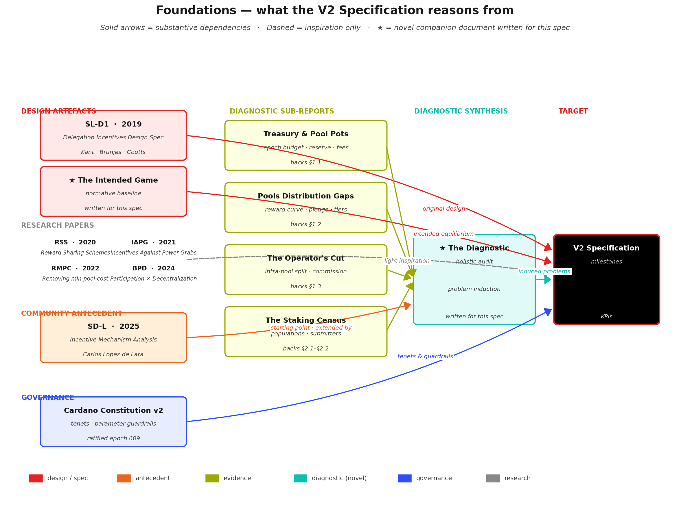
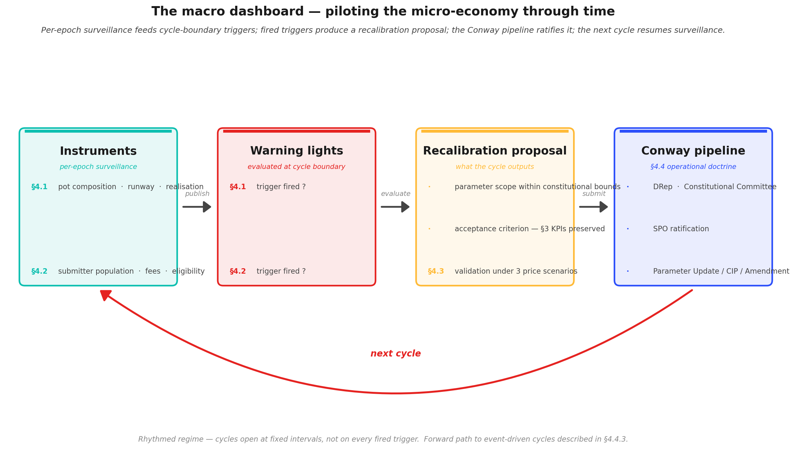

# The Cardano Reward System V2 — Specification for a Sustainable Successor

Cardano's reward mechanism is the rule that decides, every five days, how newly minted ADA is shared among the participants who keep the network running — the **stake-pool operators** who produce blocks, and the **delegators** who back them with their stake.

Those rules were written in **2019**, went live in **August 2020**, and have **not been revisited since**.

For most of that period the surrounding protocol was unfinished: smart contracts had not yet arrived, there was no on-chain governance process to adjust anything, the fee-paying economy that smart contracts would later generate did not exist, and the reserve from which rewards are minted was large enough that questions of long-term sustainability could be postponed. The mechanism was, in effect, **calibrated for a simpler chain** — governed off-chain, with a single kind of participant, and a runway measured in decades.

Five years of on-chain evidence tell a different story.

- The operator population has **stratified into a thin viable tier and a long non-viable tail**.
- **Pledge** — the personal ADA an operator commits to their own pool, designed as the central signal of skin in the game — has become **functionally irrelevant** for most of the network.
- Block production has drifted toward a handful of **concentrated multi-pool entities**, while billions of ADA sit outside consensus, held by accounts that cannot or do not stake.
- The reserve is **depleting on the mathematical schedule set in 2019**, with no transition plan for the moment it runs out.

These outcomes are not the result of parameters tuned to the wrong value; they are **structural consequences of rules designed for a chain, a population, and an institutional context that no longer exist**. The full evidence is laid out in the companion [*Diagnostic — Mainnet Observatory*](diagnostic/README.md), which this specification builds on.

What has also changed, fortunately, is the toolkit a successor can draw on:

- **On-chain governance** — a community process for reviewing and adjusting parameters, which did not exist when the original values were locked in.
- **A treasury**, funded by a share of every epoch's pot, already large enough to serve as a stabilisation instrument.
- **A fee base driven by smart contracts** — a new class of fee-paying activity that did not exist when the original mechanism was written, with further throughput expansion on the roadmap.
- **Five years of empirical record** to reason from.

With all of that in place, the question is no longer whether the reward mechanism needs revision; it is **what a replacement must satisfy to count as an improvement**. This document answers that question.

It does *not* prescribe a new reward curve, new parameter values, or a specific implementation — those are *design* questions, to be resolved in the community proposals and simulation work that respond to this specification. Instead, it defines the **outcomes** a successor mechanism must achieve, each grounded in the evidence of the Diagnostic, each stated as **a problem paired with a measurable acceptance criterion**.

The aim is a **common ground** on which candidate designs can be proposed, compared, and evaluated — rather than debated in the abstract.

The problems the specification addresses are not independent. They form a **dependency chain** — some must be resolved before others become tractable — and the milestones in the sections that follow are ordered along that chain. Each milestone is framed as an **outcome**, broken into **sub-milestones** that can be worked on sequentially, and paired with **Key Performance Indicators** that serve as its acceptance criteria.

**Naming convention.** Throughout this document, milestones are referred to by name — *Operator Viability*, *Pledge*, *Delegator Yield*, *Deconcentration*, *Pot Survival*, *Fee Policy*, *Price Robustness*, *Recalibration Pipeline*. Each named reference is a link to the section that defines it. The chapter and section numbers in the table of contents below serve navigation; the names carry the meaning.

## Table of Contents

- [1. Foundations](#1-foundations)
  - [1.1 Prior art — what V2 draws on](#11-prior-art--what-v2-draws-on)
  - [1.2 The Diagnostic — the empirical layer](#12-the-diagnostic--the-empirical-layer)
  - [1.3 Governance — the Cardano Constitution](#13-governance--the-cardano-constitution)
- [2. Constitutional framework](#2-constitutional-framework)
  - [2.1 The normative foundation — three tenets](#21-the-normative-foundation--three-tenets)
  - [2.2 The governance pathway — parameter updates within guardrails](#22-the-governance-pathway--parameter-updates-within-guardrails)
  - [2.3 The entity gap — a pool-level Constitution meeting an entity-level problem](#23-the-entity-gap--a-pool-level-constitution-meeting-an-entity-level-problem)
  - [2.4 How the milestones below cite the Constitution](#24-how-the-milestones-below-cite-the-constitution)
- [3. Microeconomics — participant incentives and market structure](#3-microeconomics--participant-incentives-and-market-structure)
  - [3.1 Guarantee operator viability across the entire productive population](#31-guarantee-operator-viability-across-the-entire-productive-population)
    - [3.1.1 Problem statement](#311-problem-statement)
      - [3.1.1.1 Evidence base](#3111-evidence-base)
    - [3.1.2 Structural: enforce the production threshold](#312-structural-enforce-the-production-threshold)
    - [3.1.3 Economic: every productive pool must be profitable](#313-economic-every-productive-pool-must-be-profitable)
  - [3.2 Restore the notion of pledge among operators](#32-restore-the-notion-of-pledge-among-operators)
    - [3.2.1 Problem statement](#321-problem-statement)
      - [3.2.1.1 Evidence base](#3211-evidence-base)
    - [3.2.2 Specification](#322-specification)
  - [3.3 Maintain and diversify a competitive delegator yield](#33-maintain-and-diversify-a-competitive-delegator-yield)
    - [3.3.1 Make the base yield competitive](#331-make-the-base-yield-competitive)
    - [3.3.2 Make the yield reward operators who play the game](#332-make-the-yield-reward-operators-who-play-the-game)
    - [3.3.3 Diversify the delegation offer](#333-diversify-the-delegation-offer)
  - [3.4 Reduce the concentration effects that distort both populations](#34-reduce-the-concentration-effects-that-distort-both-populations)
    - [3.4.1 Problem statement](#341-problem-statement)
      - [3.4.1.1 The operator side — multi-pool entity concentration](#3411-the-operator-side--multi-pool-entity-concentration)
      - [3.4.1.2 The delegator side — titan delegators versus the micro-delegation tail](#3412-the-delegator-side--titan-delegators-versus-the-micro-delegation-tail)
      - [3.4.1.3 Evidence base](#3413-evidence-base)
    - [3.4.2 Entity-level awareness in reward distribution](#342-entity-level-awareness-in-reward-distribution)
    - [3.4.3 Differentiated delegation incentives — titans versus micro-delegators](#343-differentiated-delegation-incentives--titans-versus-micro-delegators)
- [4. Macroeconomics — a self-sustaining and governable mechanism](#4-macroeconomics--a-self-sustaining-and-governable-mechanism)
  - [4.1 The staking pot must survive reserve depletion](#41-the-staking-pot-must-survive-reserve-depletion)
    - [4.1.1 Problem statement](#411-problem-statement)
      - [4.1.1.1 Evidence base](#4111-evidence-base)
    - [4.1.2 Surveillance and recalibration of $\rho$ and $\tau$](#412-surveillance-and-recalibration-of-rho-and-tau)
  - [4.2 The fee-generating population must expand](#42-the-fee-generating-population-must-expand)
    - [4.2.1 Problem statement](#421-problem-statement)
      - [4.2.1.1 Evidence base](#4211-evidence-base)
    - [4.2.2 Surveillance and recalibration of fee policy](#422-surveillance-and-recalibration-of-fee-policy)
  - [4.3 The mechanism must function across a range of ADA price scenarios](#43-the-mechanism-must-function-across-a-range-of-ada-price-scenarios)
    - [4.3.1 The price-scenario validation clause](#431-the-price-scenario-validation-clause)
    - [4.3.2 Why this is a clause, not a cycle](#432-why-this-is-a-clause-not-a-cycle)
  - [4.4 The mechanism must be governable](#44-the-mechanism-must-be-governable)
    - [4.4.1 Why a defined process is the specification, not the design](#441-why-a-defined-process-is-the-specification-not-the-design)
    - [4.4.2 The Conway-era recalibration pipeline](#442-the-conway-era-recalibration-pipeline)
    - [4.4.3 Forward path — toward ad-hoc readiness](#443-forward-path--toward-ad-hoc-readiness)
- [5. Evaluation framework](#5-evaluation-framework)

## 1. Foundations

This specification does not start from scratch.

Two **design artefacts** define what the mechanism was intended to do — they are the **normative reference** every milestone measures divergence from. Four **research papers** sit around this subject as adjacent inspiration; the spec draws on them lightly but does not extend them.

A prior **community analysis** gives the empirical work its starting point, and a new companion document — ***The Diagnostic*** — builds a **holistic audit** on top of it, grounded in four dedicated sub-reports. The **Cardano Constitution** sits alongside the spec as the governance layer the specification must comply with.

The diagram below maps these documents and how they feed into the specification.

**Reading the diagram.** Solid arrows mark substantive dependencies; the dashed arrow marks **inspiration only** — the four research papers frame questions this document also addresses but are not extended. The ★ marks the **two novel companion documents** written for this specification. The constitutional framework is developed in [Constitutional framework](#2-constitutional-framework); the [Cardano Constitution v2](https://github.com/IntersectMBO/cardano-constitution/tree/main/cardano-constitution-2) is the governing reference.

### 1.1 Prior art — what V2 draws on

**Design artefacts — the normative reference.** The specification reasons against two documents:

- **[SL-D1](references/design-specs/delegation-incentives-design-spec_kant-brunjes-coutts_2019.pdf) — *Delegation Incentives Design Specification*, Level 1** (Kant, Brünjes, Coutts, 2019). The original Shelley-era engineering artefact. Every parameter in the current mechanism — $a_0$, $k$, $\rho$, $\tau$, $minPoolCost$ — has its canonical definition here.
- **★ [*The Intended Game*](the-intended-game/README.md)** *(written for this spec)*. The intended equilibrium was implicit in SL-D1 but nowhere stated as a coherent narrative. This companion document makes it **explicit and testable**: the three player populations, the operator progression from first pledge to full commitment, the four security properties (liveness, safety, Sybil resistance, non-triviality), and the virtuous cycle aligned play is meant to produce.

Without a codified baseline, "divergence" has no reference point — which is why *The Intended Game* had to be written before the spec could be.

**Research papers — adjacent inspiration only.** Four papers frame questions this document also addresses, but are **not extended or adopted as backbone**:

- **[RSS-2020](references/research-papers/reward-sharing-schemes_brunjes-kiayias-et-al_2020.pdf) — *Reward Sharing Schemes for Stake Pools*** (Brünjes, Kiayias et al., 2020). The formal game-theoretic paper that accompanied SL-D1.
- **[IAPG-2021](references/research-papers/incentives-against-power-grabs_kiayias-et-al_2021.pdf) — *Incentives Against Power Grabs*** (Kiayias et al., 2021). Analyses the Sybil defence pledge is meant to provide.
- **[RMPC-2022](references/research-papers/removing-min-pool-cost_stouka-brunjes-kiayias-koutsoupias_2022.pdf) — *Removing the min-pool-cost floor*** (Stouka, Brünjes, Kiayias, Koutsoupias, 2022). Revisits $minPoolCost$ in light of early mainnet evidence.
- **[BPD-2024](references/research-papers/balancing-participation-decentralization_kiayias-et-al_2024.pdf) — *Balancing Participation and Decentralization*** (Kiayias et al., 2024). The most recent theoretical refinement.

These are cited where their framing informs a milestone. **None is a constructive foundation this spec builds upon.**

### 1.2 The Diagnostic — the empirical layer

The second pillar is **empirical, not normative** — a measurement of what the mechanism actually produced over **five years of mainnet operation**. ***[The Diagnostic](diagnostic/README.md)*** — written for this spec — starts from a prior community analysis and extends it into a holistic, methodically structured audit.

**Starting point — Carlos's prior analysis.** The empirical work begins where [**SD-L** — *Analysis of Cardano's Incentive Mechanism*](references/previous-analasys/spo-incentives-analysis_lopez-de-lara_2025.pdf) (Lopez de Lara, 2025) left off. SD-L established many of the observations — pledge dilution, fee-structure regressivity, delegator immobility — that the Diagnostic revisits, systematises, and grounds in primary on-chain data. The Diagnostic extends it along two axes: **broader scope** (a holistic view of the whole mechanism) and **systematic methodology** (everything decomposed into findings and observations that can be tracked, cited, and contested).

**Two structural lenses.** Rather than chasing isolated questions, the Diagnostic audits the mechanism holistically through two lenses:

- **The reward flow** — how ADA moves from the reserve, through fees, into epoch budgets, into pool pots, and finally into operator and delegator rewards: [budget assembly](diagnostic/README.md#11-treasury-pool-pots-distribution) → [pool pots](diagnostic/README.md#12-pools-distribution) → [operator-delegator split](diagnostic/README.md#13-operator-delegator-distribution).
- **The player populations** — operators and delegators ([staking populations](diagnostic/README.md#21-the-staking-populations)) and the [transaction submitters](diagnostic/README.md#22-transaction-submitters) that fund the fee component of the reward.

An additional stage audits the [ADA price constraint](diagnostic/README.md#3-the-price-constraint) that binds the mechanism to the exogenous economy.

**Four sub-reports — the evidence layer.** Each pipeline stage is backed by a dedicated, self-contained sub-report with its own formulas, data, figures, and reproduction scripts:

- **[Treasury & Pool Pots Distribution](diagnostic/sub-flows/treasury-and-pool-pots-distribution/mainnet-analysis/README.md)** — epoch-budget assembly, reserve trajectory, fee composition. Feeds the diagnostic's [budget-assembly](diagnostic/README.md#11-treasury-pool-pots-distribution) analysis.
- **[The Pools Pot Distribution Gaps](diagnostic/sub-flows/pools-distribution/mainnet-analysis/README.md)** — reward-curve behaviour, pledge economics, tier stratification. Feeds the diagnostic's [pool-pots](diagnostic/README.md#12-pools-distribution) analysis.
- **[The Operator's Cut](diagnostic/sub-flows/operator-delegator-distribution/mainnet-analysis/README.md)** — intra-pool reward split, commission market. Feeds the diagnostic's [operator-delegator split](diagnostic/README.md#13-operator-delegator-distribution) analysis.
- **[The Staking Census](diagnostic/sub-flows/census/mainnet-analysis/README.md)** — populations, transaction submitters, fee-base concentration. Feeds the diagnostic's [staking populations](diagnostic/README.md#21-the-staking-populations) and [transaction submitters](diagnostic/README.md#22-transaction-submitters) analyses.

Each sub-report organises its content as a two-level hierarchy: **findings** (F1.1, F1.2, …) — fine-grained empirical atoms backed by on-chain data — cluster into **observations** (O1, O2, …) — structural claims about mechanism behaviour. No structural claim ever stands alone; each is backed by an explicit cluster of empirical atoms.

**Problem induction — the Diagnostic itself.** [*The Diagnostic*](diagnostic/README.md) is the glue. It does not re-derive findings — it imports a condensed observations table from each sub-report and performs the step the sub-reports stop short of. Each pipeline stage carries a dedicated *Problem Induction* subsection that reads the observations against the normative baseline from *The Intended Game* and promotes them from factual claims into **structural problem statements** — the problems each milestone in this specification then answers.

The infrastructure that powers these queries — a local cardano-node + cardano-db-sync stack — lives at [`mainnet-indexer/`](../mainnet-indexer/README.md) and is the **reproducibility layer** behind every empirical claim.

### 1.3 Governance — the Cardano Constitution

The [Cardano Constitution v2](https://github.com/IntersectMBO/cardano-constitution/tree/main/cardano-constitution-2) (ratified at epoch 609) is the governance document the protocol currently operates under — and therefore **the one this specification must comply with**. Two practical consequences flow from this:

- every milestone below has to be checked against the **constitutional tenets** that apply to it (fair compensation, fair treatment, monetary stability…);
- every parameter change the milestones imply has to fit within the **guardrails** the Constitution defines (e.g., $a_0 \in [0.1, 1.0]$, $k \in [250, 2000]$, $minPoolCost \in [0, 500]$ ADA) and go through the **governance process** it prescribes.

The constitutional framework is developed in full in [Constitutional framework](#2-constitutional-framework).

## 2. Constitutional framework

The [Cardano Constitution v2](https://github.com/IntersectMBO/cardano-constitution/tree/main/cardano-constitution-2) (ratified at epoch 609) provides both the **normative foundation** and the **governance pathway** for the milestones that follow.

### 2.1 The normative foundation — three tenets

Three tenets are directly relevant.

**Tenet 4 — Fair compensation.** Operators and delegators who maintain the network are entitled to fair compensation for their contribution.

This tenet grounds three milestones:

- [Operator Viability](#31-guarantee-operator-viability-across-the-entire-productive-population);
- [Delegator Yield](#33-maintain-and-diversify-a-competitive-delegator-yield);
- [Pot Survival](#41-the-staking-pot-must-survive-reserve-depletion) — reserve sustainability.

Any mechanism that **systematically under-compensates productive participants** violates the Constitution's own standard.

**Tenet 9 — Fair treatment.** All participants in the Cardano ecosystem shall be treated fairly and shall not be subject to unjustifiable discrimination.

Two features of the current mechanism fall short of this standard:

- the fee structure imposes a **48% effective cost on sub-viable operators** while charging **1.5% near saturation** ([DIA.1.3.O1](diagnostic/README.md#132-mainnet-observations));
- the pledge mechanism provides **no material reward for commitment** ([DIA.1.2.O6](diagnostic/README.md#122-mainnet-observations)).

Three milestones address this gap, each along a different dimension:

- [Operator Viability](#31-guarantee-operator-viability-across-the-entire-productive-population);
- [Pledge](#32-restore-the-notion-of-pledge-among-operators);
- [Deconcentration](#34-reduce-the-concentration-effects-that-distort-both-populations) — entity-level accounting.

**Tenet 10 — Monetary stability.** The protocol shall not dilute or inflate ada in a manner that is inconsistent with the long-term sustainability and integrity of the ecosystem.

This tenet constrains:

- [Pot Survival](#41-the-staking-pot-must-survive-reserve-depletion) — the funding-model transition;
- [Price Robustness](#43-the-mechanism-must-function-across-a-range-of-ada-price-scenarios) — the monetary-expansion parameters;
- any instrument that draws on the **reserve or treasury** to fund operator support.

### 2.2 The governance pathway — parameter updates within guardrails

The Constitution also defines the **governance pathway**.

Five parameters shape the reward mechanism. Each is bounded by a **guardrail range** and modifiable through **Parameter Update governance actions**:

| Parameter | CIP range | Guardrail range |
| --- | --- | --- |
| $minPoolCost$ | MPC-01 to MPC-03 | $[0, 500]$ ADA |
| $a_0$ | PPI-01 to PPI-04 | $[0.1, 1.0]$ |
| $k$ | SPTN-01 to SPTN-04 | $[250, 2000]$ |
| $\rho$ | ME-01 to ME-05 | $[0.001, 0.005]$ |
| $\tau$ | TC-01 to TC-05 | $[0.1, 0.3]$ |

Parameter Updates require a **51–75% approval threshold** depending on the parameter class. Changes to critical parameters must additionally observe a **90-day publication-to-submission timeline**.

This is a lower bar than Constitutional amendment (Article IV). The milestones in this section can, in principle, be advanced through the existing governance machinery **without amending the Constitution itself**.

### 2.3 The entity gap — a pool-level Constitution meeting an entity-level problem

The Constitution operates at the **pool level**: it governs pool parameters and pool-level constraints.

The concept of operator *entity* — a cluster of pools sharing a common controller — has **no constitutional anchor**.

[Deconcentration](#34-reduce-the-concentration-effects-that-distort-both-populations) therefore occupies a distinct position. It can be resolved along one of two paths:

- **constitutional evolution** — recognise entities as first-class participants;
- a **protocol-level mechanism** — achieve entity-level accounting within the existing constitutional framework.

### 2.4 How the milestones below cite the Constitution

The milestones below reference their constitutional grounding explicitly:

- where a tenet supports the milestone, it is cited;
- where a guardrail constrains the parameter space, the bounds are noted;
- where a gap exists, it is identified.

**The Constitution is not decoration** — it is the governance instrument through which these specifications become actionable.

## 3. Microeconomics — participant incentives and market structure

The first group of milestones addresses the **microeconomics** of the mechanism: the participant-level incentive structures that shape **operator behaviour**, **pledge commitment**, **delegator yield**, and **market concentration**.

These are the problems that manifest at the individual actor level — the reward curve, the fee structure, the pledge function, and the entity-recognition gap. Their resolution is a **precondition** for the macroeconomic sustainability addressed in [Macroeconomics](#4-macroeconomics--a-self-sustaining-and-governable-mechanism).

### 3.1 Guarantee operator viability across the entire productive population

This is the **foundational specification**. Every other problem — delegator yield, staking-pot sustainability, population dynamics — rests on a network of operators that can sustain themselves economically. **If operators cannot survive, nothing else matters.**

**Constitutional alignment.** Tenet 4 (fair compensation) requires that operators who maintain the network receive adequate remuneration. Tenet 9 (fair treatment) prohibits the unjustifiable discrimination that the current $1/\sigma$ fee structure imposes on small operators. The relevant governance parameters — $minPoolCost$ (MPC-01 to MPC-03, range [0, 500] ADA) and $k$ (SPTN-01 to SPTN-04, range [250, 2000]) — are modifiable through Parameter Update actions, making the structural and economic specifications below **actionable within the existing governance framework**.

#### 3.1.1 Problem statement

The mechanism was designed so that a new operator who pledges an initial amount and attracts delegation follows a **legible progression** — from new pool to established pool to fully committed pool — with delegation providing the growth path beyond the initial commitment ([*The Intended Game* — operator progression](the-intended-game/README.md#32-operators-from-first-pledge-to-full-commitment)).

Today's single-pool operator with 2M ADA of delegation and a proven track record should be tomorrow's established entity. The mechanism must support this trajectory. **Two structural gaps prevent it from doing so.**

**The viability gap.** The fixed-cost floor ($minPoolCost$) absorbs **47.5% of pool reward at the sub-viable tier** but only **1.5% near saturation** ([DIA.1.3.O1](diagnostic/README.md#132-mainnet-observations)).

This opens a gap of **~870 pools** between the production threshold (~1M ADA) and the viability threshold (~3M ADA), where pools produce blocks but cannot sustain their operators economically ([viability-gap analysis](diagnostic/README.md#1331-guarantee-operator-viability-across-the-productive-population)). No single-pool operator in the retail market earns a competitive wage: the median earns **~25,000 ADA/yr** — enough to cover infrastructure but not the 5–15 hrs/month of skilled work ([DIA.1.3.O6](diagnostic/README.md#132-mainnet-observations)).

The floor follows a $1/\sigma$ hyperbola: *the operators who charge the most earn the least.*

**The operator growth path is not functioning as intended.** The census finds **no trace** of the designed growth trajectory on mainnet.

The independent single-pool operator population peaked at **555 pools and 39.1% of productive stake** around epoch 300, then contracted continuously to **291 pools and 24%** at epoch 623 — a **48% loss in pool count** and **15 percentage points** in stake share ([*Staking Census* CEN.O1.F6](diagnostic/sub-flows/census/mainnet-analysis/README.md#353-cohort-decomposition-who-holds-the-productive-set)).

The replacement pools that sustain the ~950-pool total are **entity-operated, not new independents**: multi-pool entities grew from 23 to 85, their pool count from 135 to 660 ([*Staking Census* CEN.O1.F7](diagnostic/sub-flows/census/mainnet-analysis/README.md#353-cohort-decomposition-who-holds-the-productive-set)). Capital flows from declining community fleets toward institutional entrants and exchanges — **not** toward the independent tail growing into established entities ([*Staking Census* CEN.O1.F8](diagnostic/sub-flows/census/mainnet-analysis/README.md#354-the-independent-pipeline-what-the-mechanism-was-designed-to-produce)).

*The absence of evidence for the designed growth path is itself the diagnosis.*

##### 3.1.1.1 Evidence base

| Dimension | Key observation | Source |
| --- | --- | --- |
| **Fee structure** | The distortion comes from the fixed-cost floor, not from the commission market. A sub-viable operator absorbs 48.3% of pool rewards yet earns 24,820 ADA/yr; an 11+ pool MPO absorbs 7.7% yet earns 1,035,496 ADA/yr — 42× more revenue at 6× less effective price. The commission market is healthy: 69% competitive, median margin stable for 405 epochs. | [DIA.1.3.O1, DIA.1.3.O2, DIA.1.3.O6](diagnostic/README.md#132-mainnet-observations) |
| **Fee floor trajectory** | The floor's burden grows as the reserve depletes: the fixed-cost share of pool rewards rises mechanically, progressively extending the viability gap toward pools in the 5–10M range. | [DIA.1.3.O8](diagnostic/README.md#132-mainnet-observations) |
| **Population dynamics** | The productive pool count has held near 950 since epoch 300, but this masks 3,497 entries against 3,070 exits — ~16 pools/epoch turnover (1.7%/epoch). Turnover falls disproportionately on small independent operators near the production threshold. | [Census — population dynamics](diagnostic/sub-flows/census/mainnet-analysis/README.md#35-population-dynamics-entries-exits-and-turnover) |
| **Stake variability** | Pools near the production threshold oscillate in and out of viability: 9.3% have CV between 50–100%, 3.4% exceed 100%. | [Census — pool-size variability](diagnostic/sub-flows/census/mainnet-analysis/README.md#36-pool-size-variability-how-stable-is-a-pools-stake) |
| **Thresholds** | The production threshold rises mechanically with total staked ADA — from ~470K at Shelley launch to ~1M at epoch 623. The independent single-pool operator population stands at 477 pools (5.28B ADA, 24.5% of productive stake), share in slow decline; only 283 above the viability threshold. 116 sub-threshold pools carry 0.31% of active stake. | [Census — historical decomposition](diagnostic/sub-flows/census/mainnet-analysis/README.md#343-historical-decomposition-productive-vs-sub-threshold-pools), [DIA.1.2.O5](diagnostic/README.md#122-mainnet-observations), [the production-threshold proposal](diagnostic/README.md#12441-enforce-the-production-threshold-build-a-rocket-pool-for-cardano) |
| **Incentive alignment** | The current fee structure favours operators who amortise the fixed cost across large fleets. Small independent operators — from whom tomorrow's established entities should emerge — face the highest effective cost burden. The incentive gradient runs counter to the mechanism's design intent. | [DIA.1.3.O1](diagnostic/README.md#132-mainnet-observations), [DIA.1.3.O6](diagnostic/README.md#132-mainnet-observations) |

#### 3.1.2 Structural: enforce the production threshold

The protocol must make the production threshold **explicit and enforceable**. Below this threshold, pools cannot reliably produce blocks — their existence **misleads delegators** and **dilutes the operator marketplace**.

**Specification.** The mechanism must define a minimum active-stake threshold ($\sigma_{\min}$) below which pool registration is not permitted. Two requirements.

**R1 — The threshold must enforce the structural production boundary.** Currently **~1M ADA**, derived from the Poisson statistics of block production ([the structural floor](diagnostic/README.md#12411-the-structural-floor)) — a **mathematical property of the protocol**, not an empirical observation.

The protocol already defines this boundary **indirectly**; the specification requires making it **explicit and enforced**. A pool below this threshold cannot reliably produce blocks; its presence in the registry is **noise**.

**R2 — A legitimate sub-threshold path must exist.** A protocol-level or smart-contract-based **pooling service** (analogous to Rocket Pool on Ethereum — [the production-threshold proposal](diagnostic/README.md#12441-enforce-the-production-threshold-build-a-rocket-pool-for-cardano)) must allow technically capable participants with insufficient capital to combine operational commitment with pooled delegation, **cross the threshold collectively**, and operate a full pool.

The pooling service transforms the empty corridor between *"committed to this network"* and *"producing blocks for this network"* into a **supported trajectory**. An operator who enters the alliance with 100K ADA, proves operational competence, and graduates to independent operation is exactly the kind of participant the protocol should incubate. The current mechanism offers that participant nothing but a misleading registration form.

The effect is a **clean marketplace**:

- every registered pool can produce blocks;
- the sub-threshold space is served by a dedicated mechanism rather than abandoned to noise;
- the operator entry experience becomes legible — **one gate, one threshold, one supported path below it**.

| KPI | Definition | Current | Target |
| --- | --- | --- | --- |
| Sub-threshold pool count | Pools below $\sigma_{\min}$ | ~116 | 0 (structurally enforced) |
| Pooling-service participation | Operators in sub-threshold pooling mechanism | 0 (does not exist) | > 0 — the path must exist |

#### 3.1.3 Economic: every productive pool must be profitable

Enforcing the production threshold eliminates the structural noise. But the viability gap is not only structural — **it is economic**.

The $minPoolCost$ floor creates a viability threshold (**~3M ADA**) *above* the production threshold (**~1M ADA**). A pool that crosses $\sigma_{\min}$ and produces blocks is **not automatically profitable**. This milestone closes that gap.

**Specification.** The mechanism must ensure that every pool at or above $\sigma_{\min}$ generates sufficient operator revenue to cover real-world operating costs. Three requirements.

**R1 — The fixed-cost floor must be eliminated or replaced by a proportional mechanism.** The current $minPoolCost$ follows a **regressive $1/\sigma$ hyperbola** that penalises small pools and subsidises large ones. A percentage-based $minPoolRate$ that scales with pool reward would close the viability gap **by construction**: a pool earning 1,000 ADA pays the same *fraction* as a pool earning 100,000 ADA.

**R2 — The profitability logic must be described and legible.** Operators must be able to compute, **before registering a pool**, whether that pool will be profitable at a given stake level and ADA price. The current system requires navigating an implicit cost structure that only reveals its regressive nature *after* operation begins.

**R3 — The profitability parameters must be reviewable by governance.** Operator costs are **fiat-denominated** while operator revenue is **ADA-denominated**. The mechanism must provide governance with the instruments to manage this asymmetry — whether through periodic parameter review (linked to the [Recalibration Pipeline](#44-the-mechanism-must-be-governable)), oracle-informed adjustment, or treasury-funded operator support during sustained price downturns.

The third point is **critical**. The current mechanism defines $minPoolCost$ as a fixed ADA amount that has been adjusted **exactly once** (340 → 170 ADA) since Shelley launch. Its fiat-equivalent value has fluctuated from **~$170 to ~$17** depending on ADA price, with **no protocol-level awareness** of this variation.

A successor mechanism must acknowledge the fiat/ADA asymmetry *structurally*, and give governance concrete instruments to manage it — periodic review, oracle-informed adjustment, or treasury-funded operator support during sustained price downturns.

The combined effect of the [Production Threshold](#312-structural-enforce-the-production-threshold) and [Pool Profitability](#313-economic-every-productive-pool-must-be-profitable) sub-specs is a **single legible gate**: below $\sigma_{\min}$, the pooling service operates; at $\sigma_{\min}$, the operator is **immediately economically viable**. The viability gap disappears: the capital barrier is reduced to the production minimum, the economic barrier is eliminated, and **expertise and commitment weigh more than capital alone**.

| KPI | Definition | Current | Target |
| --- | --- | --- | --- |
| Dead-zone population | Pools between production and viability thresholds | ~870 | 0 |
| Operator viability rate | Productive pools where revenue > fiat operating cost | ~60% (at $0.30/ADA) | >90% across the productive set |
| Independent operator count | Viable independent single-pool operators | 283 | >$k/2$ (currently 250) |
| Viability at stress price | Productive pools viable at ADA = $0.10 | <20% est. | >50% |

> **Dependency note.** [Operator Viability](#31-guarantee-operator-viability-across-the-entire-productive-population) is the foundation. [Pledge](#32-restore-the-notion-of-pledge-among-operators) depends on it: pledge is only meaningful once operators are viable. [Delegator Yield](#33-maintain-and-diversify-a-competitive-delegator-yield) depends on it: the yield that reaches delegators is shaped by the fee structure Operator Viability reforms. [Pot Survival](#41-the-staking-pot-must-survive-reserve-depletion) depends on it: a viable operator population is a prerequisite for any funding-model transition. The reward curve — the design instrument that implements the economic incentives — must be calibrated to serve Operator Viability through Delegator Yield simultaneously; it is a tool, not a specification.

### 3.2 Restore the notion of pledge among operators

*Depends on [Operator Viability](#31-guarantee-operator-viability-across-the-entire-productive-population).* With operators viable across the productive population, the question becomes:

> Does the mechanism distinguish between an operator who **commits capital** to the network, and one who — without pledging — has nonetheless captured saturating delegation through **brand, scale, or exchange custody**?

**Constitutional alignment.** Tenet 9 (fair treatment) supports the restoration of pledge as an economic signal: treating committed operators identically to hollow fleets that contribute no capital is itself a form of **unjustifiable discrimination** — it penalises commitment.

The key parameter, $a_0$ (poolPledgeInfluence, PPI-01 to PPI-04), is bounded by the Constitution at **[0.1, 1.0]** and modifiable through Parameter Update actions. The current value ($a_0 = 0.3$) sits near the bottom of the range; the guardrail permits up to a **threefold increase** without constitutional amendment. The $k$ parameter (SPTN-01 to SPTN-04, range [250, 2000]) also shapes the pledge dynamics: the ratio of pledged capital to saturation level determines whether the Sybil tax binds.

#### 3.2.1 Problem statement

**Why pledge exists.** The security model of the Cardano consensus layer requires that the $k$-pool target represents $k$ *independent* block-producing entities — **not** $k$ certificates controlled by a handful of actors.

The property that makes this assumption defensible is *Sybil resistance*: creating additional block-producing identities must carry a cost high enough that fragmentation is **economically dominated** by honest, single-pool operation ([*The Intended Game* — Sybil resistance](the-intended-game/README.md#343-sybil-resistance-making-fragmentation-expensive)).

In **proof of work**, Sybil resistance is physical — each identity requires hardware and electricity that cannot be shared. In **proof of stake**, identity is cheap: registering a new pool costs a certificate deposit (~500 ADA) and an operational setup that an experienced operator can replicate in hours.

The saturation cap ($k$) was designed to limit concentration by capping the delegation any single pool can receive — but the cap operates on *pools*, not on *entities*. An operator who saturates one pool registers a second and continues growing. **The cap fragments pools, not power.**

Pledge is the mechanism's answer. Brünjes & Kiayias ([2020, §4](references/research-papers/reward-sharing-schemes_brunjes-kiayias-et-al_2020.pdf)) formalise this through the $a_0$ parameter: the reward function includes a **pledge-sensitive component** designed so that splitting capital across $n$ pools **dilutes the pledge bonus per pool**. The intended cost of a Sybil attack scales as $O(n)$ in committed capital — the *Sybil tax*. If the reward formula penalises low-pledge pools sufficiently, the marginal cost of the $n$-th pool exceeds its marginal reward and the expansion becomes **unprofitable**.

There is a critical distinction in *how* this cost operates:

- when it comes from the **pledge mechanism itself** — forfeiting a meaningful bonus by fragmenting — the *design* provides the defence;
- when it comes from **raw capital requirements alone**, the defence is incidental, not engineered ([*The Intended Game* — Sybil resistance](the-intended-game/README.md#343-sybil-resistance-making-fragmentation-expensive)).

**What went wrong.** At $a_0 = 0.3$, the relationship between pledge and reward is so weak that it provides **no behavioural incentive**. A pool pledging 1M ADA receives a bonus that amounts to **fractions of a percent** of its total reward — invisible to delegators, irrelevant to the operator's business case ([mainnet pledge data](diagnostic/README.md#12431-what-mainnet-reveals)).

The marginal cost of registering an additional pool is **~500 ADA**; the marginal reward is a **full share** of the curve. The rational strategy — which the market has discovered — is to **expand**.

The mechanism creates **three structural populations** that respond to pledge differently:

- **Custodial operators** who *cannot* pledge — the constraint is architectural;
- **MPO fleets** who *choose not to* — the rational response to a negligible incentive;
- **Independent operators** who pledge **out of conviction** rather than economic rationality.

The net result is a proof-of-stake system where the Sybil defence operates through **incidental wealth constraints** — not through the designed pledge mechanism — and where **85 entities** operating **901 pools** control **75.4% of staked supply** with no protocol-level cost for having done so.

$k = 500$ implies 500 independent entities sharing consensus power; the effective operator count is an **order of magnitude below** that target. The saturation cap has produced ~3,000 pool certificates — far more than $k$ — but the power behind those certificates is concentrated in fewer hands than the equilibrium requires.

*Pools have fragmented; power has not.*

##### 3.2.1.1 Evidence base

| Dimension | Key observation | Source |
| --- | --- | --- |
| **Pledge-bonus utilisation** | 95.6% of the pledge-bonus budget returns to the reserve unused. The instrument exists in the formula but is economically inert. | [DIA.1.2.O6](diagnostic/README.md#122-mainnet-observations) |
| **Entity-level pledge behaviour** | 78 of 85 multi-pool entities are outside the pledge-response path entirely. Only 7 entities (8%) respond to the pledge signal. | [multi-pool entity analysis](diagnostic/README.md#12443-multi-pool-operators-and-the-need-for-anti-monopoly-countermeasures) |
| **Custodial constraint** | CEX + IVaaS operators (10 entities, 181 pools, 7.40B ADA) cannot pledge the capital they manage — delegated ADA belongs to end users. The constraint is architectural, not strategic. | [the hollow-strategy analysis](diagnostic/README.md#124313-the-hollow-strategy-dominates-at-every-level-of-aggregation) |
| **Fleet expansion cost** | The marginal cost of a new pool is ~500 ADA (certificate deposit). The marginal reward is a full share of the reward curve. The Sybil tax is effectively priced at zero. | [mainnet pledge data](diagnostic/README.md#12431-what-mainnet-reveals) |
| **Independent operators** | Single-pool operators pledge out of conviction rather than economic rationality, receiving almost nothing in return. Their share of active stake is in slow decline. | [the hollow-strategy analysis](diagnostic/README.md#124313-the-hollow-strategy-dominates-at-every-level-of-aggregation), [operator concentration](diagnostic/README.md#2131-the-operator-population-is-highly-concentrated-and-stable) |
| **Market structure outcome** | 85 multi-pool entities control 75.4% of staked supply through 901 pools. The effective entity-level concentration is an order of magnitude above the $k$-target equilibrium. | [DIA.1.2.O4](diagnostic/README.md#122-mainnet-observations), [operator concentration](diagnostic/README.md#2131-the-operator-population-is-highly-concentrated-and-stable) |

#### 3.2.2 Specification

A successor mechanism must reintroduce pledge as a **consequential economic force** that makes identity multiplication **progressively expensive**. The Sybil cost must operate through the *designed reward structure*, not through incidental wealth constraints.

Four requirements.

**R1 — The reward penalty for low pledge must be behaviourally significant.** The marginal cost of the $n$-th pool must exceed its marginal reward at a fleet size **well below** the current unchecked expansion frontier.

The target is a yield differential **>0.5pp** between meaningfully pledged and minimally pledged pools — **visible to delegators** and **material to the operator's business case**. At the current near-zero differential, the rational strategy is to expand; the revised mechanism must make that strategy **dominated**.

**R2 — Pledge must be evaluated at the entity level, not the pool level.** An entity splitting 1M ADA across ten pools must **not** receive the same aggregate pledge benefit as ten independent operators each pledging 1M ADA. The entire point of pledge is to impose the $O(n)$ capital cost on exactly this behaviour.

Entity-level pledge accounting is the mechanism through which [Pledge](#32-restore-the-notion-of-pledge-among-operators) and [Deconcentration](#34-reduce-the-concentration-effects-that-distort-both-populations) interact.

**R3 — The mechanism must distinguish inability to pledge from choice not to pledge.** Custodial operators (CEX, IVaaS) **cannot** pledge delegated capital — the constraint is architectural, not strategic. The design must accommodate this structural reality rather than treating **custodial inability** and **strategic extraction** as the same signal.

**R4 — The pledge parameters must be governable.** The real cost of pledging ADA depends on the ADA price, the DeFi opportunity cost of locked capital, and the composition of the operator population — **all of which evolve**. The pledge parameters must be reviewable and adjustable through the Conway-era governance process, not **frozen at deployment values** as $a_0$ has been since Shelley launch.

Pledge is **not** a reward bonus for good behaviour. It is the protocol's **only on-chain instrument** for making the $k$-pool equilibrium a **Nash equilibrium** rather than a theoretical construct.

Without a credible Sybil tax, the $k$ target is unreachable, and the system converges on the concentrated structure the analysis documents. Restoring this tax — through the **designed pledge mechanism**, not through wealth alone — is the **prerequisite** for every subsequent milestone that touches market structure ([Delegator Yield](#33-maintain-and-diversify-a-competitive-delegator-yield), [Deconcentration](#34-reduce-the-concentration-effects-that-distort-both-populations)).

| KPI | Definition | Current | Target |
| --- | --- | --- | --- |
| Pledge-bonus utilisation | Fraction of available pledge-bonus budget actually distributed | <5% | >50% — the instrument must be in active use |
| Pledge-responsive entities | MPO entities within the pledge-response path | 7 of 85 (8%) | >50% of entities by stake weight |
| Yield differential (pledged vs unpledged) | Delegator yield gap between meaningfully pledged and minimally pledged pools | ~0 | >0.5pp — visible to delegators |
| Pledge cost of fleet expansion | Marginal pledge capital required for the $n$-th pool in a fleet | ~0 | Positive and increasing with $n$ |

> **Dependency note.** [Pledge](#32-restore-the-notion-of-pledge-among-operators) depends on [Operator Viability](#31-guarantee-operator-viability-across-the-entire-productive-population): pledge is only meaningful once the viability gap is closed — requiring pledge from operators who cannot sustain themselves is not Sybil resistance, it is exclusion. Pledge feeds directly into [Deconcentration](#34-reduce-the-concentration-effects-that-distort-both-populations): entity-level pledge evaluation is the mechanism through which Pledge and Deconcentration interact. [Delegator Yield](#33-maintain-and-diversify-a-competitive-delegator-yield) depends on Pledge: the yield differential that makes delegation consequential is partially driven by the pledge signal. Pledge also interacts with [Price Robustness](#43-the-mechanism-must-function-across-a-range-of-ada-price-scenarios): the real cost of pledging ADA depends on the ADA price and the opportunity cost in DeFi — parameters that fluctuate with market conditions.

### 3.3 Maintain and diversify a competitive delegator yield

*Depends on [Operator Viability](#31-guarantee-operator-viability-across-the-entire-productive-population), [Pledge](#32-restore-the-notion-of-pledge-among-operators).* With operators viable and pledge restored as an economic signal, the question becomes:

> Does the delegation market **reward the participants who sustain the network** — and does it offer them anything beyond a **single, undifferentiated product**?

**Constitutional alignment.** Tenet 4 (fair compensation) extends to delegators: participants who commit capital to consensus security are entitled to a return that reflects that contribution. Tenet 10 (monetary stability) constrains the instruments: the yield cannot be sustained by inflationary mechanisms that dilute ada's long-term value.

The monetary-expansion parameter $\rho$ (ME-01 to ME-05, range [0.001, 0.005]) and the treasury cut $\tau$ (TC-01 to TC-05, range [0.1, 0.3]) define the **funding envelope** within which delegation yield operates — both are modifiable through governance but **bounded by the Constitution**.

The problem has **three faces**:

- **Competitive as an investment.** Staking competes for capital with DeFi protocols, liquid markets, and off-chain alternatives. If the return is not attractive in absolute terms, **rational capital leaves the staking pool** regardless of how well the mechanism distributes it.
- **Rewarding the right operators.** Balanced independent operators return **1.98%** while hollow MPO fleets return **2.08%** — the operator who commits capital is *penalised* for commitment ([DIA.1.3.O5](diagnostic/README.md#132-mainnet-observations)). The yield spread is **0.39pp (noise)**, and **half of all pool switches produce zero yield change** ([DIA.2.1.O6](diagnostic/README.md#212-mainnet-observations)).
- **A product range frozen in 2020.** In Shelley's era, **no smart-contract capability existed** — the only product was liquid delegation at a uniform yield. Five years later, Plutus scripts and the extended UTXO model provide infrastructure for a richer staking market that **Cardano has not yet exploited**.

#### 3.3.1 Make the base yield competitive

**Staking is an investment.** The delegator who commits ADA to a pool forgoes DeFi yield, liquidity premiums, and off-chain alternatives.

If the base staking return is not competitive with those alternatives, **rational capital migrates** — and the consensus layer loses the participation it depends on. The base yield must be attractive enough, in absolute terms, that staking remains **a credible allocation** for a diversified ADA holder.

**Specification.** Two requirements.

**R1 — The base yield must be competitive with risk-adjusted on-chain alternatives.** This does **not** mean matching the highest DeFi yield — staking carries lower risk and provides a public good. But the gap must be **narrow enough** that the opportunity cost of staking does not drive **systematic capital flight** from the consensus layer.

**R2 — The yield must remain robust across ADA price scenarios.** A return that is competitive at $0.50 but irrelevant at $2.00 — or vice versa — **fails the test**.

This connects directly to [Price Robustness](#43-the-mechanism-must-function-across-a-range-of-ada-price-scenarios): the base yield is not a fixed parameter but a **function** of the funding model, the ADA price, and the DeFi opportunity cost of capital.

| KPI | Definition | Current | Target |
| --- | --- | --- | --- |
| Base delegator yield | Net annualised return to a delegator in a productive pool | ~2% | Competitive with risk-adjusted DeFi lending rates |
| Staking participation rate | Fraction of circulating ADA staked | ~63% | ≥60% — sustained through market cycles |
| Capital retention | Net flow of ADA between staking and DeFi per epoch | Not tracked | Net neutral or positive toward staking |

#### 3.3.2 Make the yield reward operators who play the game

The base yield being competitive is **necessary but not sufficient**. The mechanism must also ensure that the yield *differentiates* between operator types — that delegators who choose a balanced, pledged, independent operator receive a **materially better return** than those who park stake in a hollow fleet.

Today, the spread is **noise**: 0.39pp across the retail market ([DIA.1.3.O5](diagnostic/README.md#132-mainnet-observations)), invisible to delegators, with **delegation following visibility rather than return** ([DIA.1.3.O7](diagnostic/README.md#132-mainnet-observations)).

The $minPoolCost$ floor absorbs a disproportionate share of small-pool rewards **before any yield reaches delegators** ([DIA.1.3.O1](diagnostic/README.md#132-mainnet-observations), [DIA.1.3.O8](diagnostic/README.md#132-mainnet-observations)). And entity-level information — fleet size, aggregate pledge ratio, operator profitability — is **absent from the on-chain data**, so delegators cannot distinguish a committed independent operator from one node in an anonymous fleet ([the size-visibility loop](diagnostic/README.md#12435-the-size-visibility-delegation-loop)).

**Specification.** Three requirements.

**R1 — The yield differential between entity types must be material.** The spread between balanced, hollow, and custodial operators at equivalent pool sizes must **exceed 1pp**. The current 0.39pp spread is noise ([DIA.1.3.O5](diagnostic/README.md#132-mainnet-observations)); delegators must be able to **see** a material difference between committing to a balanced independent operator and parking stake in a hollow fleet.

*The mechanism must make commitment pay — visibly.*

**R2 — Entity-level information must be visible to delegators.** Fleet size, aggregate pledge ratio, and entity-level profitability must be available **on-chain**, so that delegation decisions can be informed by the structural attributes the mechanism rewards — not only by pool-level brand and size ([the size-visibility loop](diagnostic/README.md#12435-the-size-visibility-delegation-loop)).

Without this information, the yield signal from R1 is **uninterpretable**.

**R3 — Delegator mobility must produce competitive pressure.** The current regime where half of all switches produce **zero yield change** ([DIA.2.1.O6](diagnostic/README.md#212-mainnet-observations)) must give way to a market where redelegation **carries information** and **exerts discipline**.

When a delegator moves, **the move must matter** — to the delegator's return, and to the operator's revenue.

| KPI | Definition | Current | Target |
| --- | --- | --- | --- |
| Yield differential (balanced vs hollow) | Net delegator yield gap between balanced and hollow pools at equivalent size | ~0 (or negative: balanced 1.98% vs hollow 2.08%) | >1pp in favour of balanced |
| Entity-info visibility | Delegator-visible entity-level metadata on-chain | None | Fleet size, aggregate pledge, entity yield — available on-chain |
| Delegation responsiveness | Fraction of redelegations producing >50bp yield change | <50% | >60% |

#### 3.3.3 Diversify the delegation offer

The Shelley delegation model was designed **before Plutus existed**. The only product was — and still is — **liquid delegation at a uniform yield**.

The smart-contract infrastructure now available on Cardano opens a design space that the original mechanism could not exploit: delegation products where the delegator accepts a **stronger commitment** or a **different risk profile**, and receives a **differentiated remuneration** in return.

**Specification.** The mechanism — or its smart-contract extensions — must enable delegation products that go beyond the Shelley baseline. Three requirements.

**R1 — Lock-up tiers with differentiated APY.** Delegators who commit capital for a defined period (e.g., 6 epochs, 36 epochs, 73 epochs) accept **reduced liquidity** in exchange for a **yield premium**. The result is a **term structure** that rewards long-horizon commitment and stabilises the stake base that independent operators depend on.

**R2 — Liquid staking derivatives.** Smart-contract wrappers that issue **transferable tokens** representing staked ADA, allowing delegators to **maintain liquidity** (trade, lend, use as collateral in DeFi) while their underlying stake continues to earn rewards and contribute to consensus security.

*This is the product that brings capital currently parked in DeFi back into the staking pool.*

**R3 — Automated delegation strategies.** Programmable vaults that rebalance across pools according to defined criteria (yield optimisation, decentralisation weighting, entity-level quality scores), **lowering the information and operational burden** on individual delegators.

The baseline liquid delegation model **remains**. These products build *above* it, so that the delegation market offers a **spectrum of commitment-remuneration profiles** rather than a single undifferentiated choice.

The relationship is explicit: **higher commitment — longer lock-up, less liquidity, more exposure — earns a higher return**. This is the mechanism through which the delegation market becomes **a market in the economic sense**: multiple products, multiple risk-return points, and a price signal that reflects the value of the commitment each delegator makes.

| KPI | Definition | Current | Target |
| --- | --- | --- | --- |
| Delegation product diversity | Number of structurally distinct staking products available | 1 (liquid delegation only) | ≥3 (liquid + lock-up tiers + liquid staking derivative) |
| Lock-up participation rate | Fraction of staked ADA committed to lock-up tiers | 0% | >10% — enough to stabilise the stake base |
| DeFi-staking overlap | ADA simultaneously staked and deployed in DeFi via liquid staking | 0 | >0 — the path must exist |

> **Dependency note.** [Delegator Yield](#33-maintain-and-diversify-a-competitive-delegator-yield) depends on [Operator Viability](#31-guarantee-operator-viability-across-the-entire-productive-population) and [Pledge](#32-restore-the-notion-of-pledge-among-operators): a competitive yield is meaningless if operators cannot sustain themselves, and the yield signal that drives delegation must be anchored in a pledge mechanism that works. The [base-yield sub-spec](#331-make-the-base-yield-competitive) interacts with [Pot Survival](#41-the-staking-pot-must-survive-reserve-depletion) and [Price Robustness](#43-the-mechanism-must-function-across-a-range-of-ada-price-scenarios): the absolute yield level depends on the funding model and the ADA price. The [yield-differentiation sub-spec](#332-make-the-yield-reward-operators-who-play-the-game) interacts directly with [Deconcentration](#34-reduce-the-concentration-effects-that-distort-both-populations): the yield differential and entity-info visibility it requires depend on the entity-level reward accounting Deconcentration introduces. The [delegation-diversification sub-spec](#333-diversify-the-delegation-offer) leverages post-Alonzo smart-contract infrastructure and interacts with [Fee Policy](#42-the-fee-generating-population-must-expand): liquid staking derivatives and DeFi-staking overlap expand the fee base while reinforcing staking participation.

### 3.4 Reduce the concentration effects that distort both populations

*Depends on [Operator Viability](#31-guarantee-operator-viability-across-the-entire-productive-population), [Pledge](#32-restore-the-notion-of-pledge-among-operators), [Delegator Yield](#33-maintain-and-diversify-a-competitive-delegator-yield).* With operators viable, pledge restored as economic signal, and delegation diversified, the question becomes:

> Does the market structure that distributes rewards actually serve decentralisation — or does concentration on *both sides* of the market prevent the equilibrium from emerging?

The analysis documents concentration on **two fronts**:

- **Supply side.** **85 multi-pool entities** control **75.4%** of staked supply through **901 pools** ([DIA.1.2.O4](diagnostic/README.md#122-mainnet-observations)), while independent single-pool operators shrink to **283 viable pools and 25%** of productive stake ([DIA.1.2.O5](diagnostic/README.md#122-mainnet-observations)).
- **Demand side.** **1,000 delegators** (0.07% of the base) control **57% of staked ADA**; the Gini coefficient is **0.976** ([DIA.2.1.O3](diagnostic/README.md#212-mainnet-observations)).

Both concentrations are **structural**, both **crystallised early**, and **neither responds** to the current incentive design.

**Constitutional alignment.** Tenet 9 (fair treatment) supports action on both fronts: a mechanism that rewards fleet expansion at near-zero marginal cost while penalising independent operators **does not treat participants fairly**; a mechanism that produces identical outcomes for a 32-ADA micro-delegator and a 50M-ADA titan offers **no differentiated incentive** for the capital commitment each represents.

However, the Constitution currently operates at the **pool level** — its guardrails govern pool parameters ($k$, $a_0$, $minPoolCost$), not entity-level or delegator-tier constructs. The concept of operator *entity* has **no constitutional anchor**.

Implementing entity-level reward accounting may therefore require either:

- a **protocol-level mechanism** within existing pool-level parameters; or
- a **constitutional evolution** if the design requires new on-chain primitives.

The existing $a_0$ and $k$ guardrails provide substantial design space, but the most ambitious versions of this milestone may eventually require **governance action beyond parameter adjustment**.

#### 3.4.1 Problem statement

##### 3.4.1.1 The operator side — multi-pool entity concentration

The reward formula evaluates pools **independently** — it does not know that twenty pools share the same controller. The saturation cap, intended to prevent concentration, fragments *pools* but not *entities*: an operator who saturates registers a new pool and continues growing, at **negligible marginal cost** ([multi-pool entity analysis](diagnostic/README.md#12443-multi-pool-operators-and-the-need-for-anti-monopoly-countermeasures)).

The mechanism was designed for $k$ independent operators converging on a balanced equilibrium (Brünjes & Kiayias, 2020). It encounters instead a **highly concentrated and segmented market** where three structurally distinct sub-populations coexist:

- **Custodial operators** (CEX + IVaaS: 10 entities, 181 pools, 7.40B ADA) who *cannot* pledge the capital they manage — the constraint is **architectural**;
- **Community and opaque MPO fleets** (41 of 48 capital-sufficient entities) who have *chosen* not to pledge — the **rational response** to the current incentive structure;
- **Independent single-pool operators** who bear the full weight of the fee structure while their market share erodes ([operator concentration](diagnostic/README.md#2131-the-operator-population-is-highly-concentrated-and-stable)).

The deeper failure is that **the formula's unit of accounting — the pool — is the wrong unit**. Rewards, saturation caps, and pledge calculations all operate at the pool level. But the **entity** that controls the pools is the economic actor that makes strategic decisions.

An entity operating twenty pools with negligible pledge in each is **indistinguishable, at the formula level**, from twenty independent operators. The mechanism does not merely fail to prevent concentration; *it is structurally blind to it*.

##### 3.4.1.2 The delegator side — titan delegators versus the micro-delegation tail

The demand side exhibits a concentration that **mirrors the supply side**. The median delegator holds **32 ADA**; the mean holds **16,055 ADA** — a **500× gap** ([DIA.2.1.O3](diagnostic/README.md#212-mainnet-observations)).

This is not a transient distribution: concentration **crystallised by epoch 300**, and a subsequent **9× growth** in delegator count produced **no measurable change** in the top-1% share ([Census — historical evolution](diagnostic/sub-flows/census/mainnet-analysis/README.md#443-historical-evolution--who-joined-and-where-is-the-capital)). The delegation market is **structurally bimodal**: 42% of delegators are **loyal** (201+ epochs), 21% **volatile** (≤ 5 epochs), with little in between ([DIA.2.1.O4](diagnostic/README.md#212-mainnet-observations)).

**Titan delegators** — those holding 1M+ ADA — average **3.06 lifetime pool switches** against **0.67** for micro-delegators ([DIA.2.1.O5](diagnostic/README.md#212-mainnet-observations)). They hold **11B of 21.8B** staked ADA, and only **38%** of their stake sits in loyal delegations: capital is **disproportionately mobile**.

Yet this mobility does **not produce competitive pressure** because it is **not yield-driven**: half of all switches produce zero yield change (±5 bps), operator-take direction is symmetric, and **the only asymmetric signal is pool size** — delegators drift toward larger, more visible pools, not toward more committed ones ([DIA.2.1.O6](diagnostic/README.md#212-mainnet-observations)).

The mechanism treats a 32-ADA micro-delegation and a 50M-ADA titan delegation **identically**: both earn the same proportional return, both have the same governance weight per ADA, and neither receives any incentive differentiated by the scale or stability of commitment.

The consequence is:

- the population with the **power to discipline operators** — titans — has **no structured reason** to exercise it;
- the population the protocol depends on for **broad participation** — micro-delegators — receives **no signal** that their commitment matters.

##### 3.4.1.3 Evidence base

| Dimension | Key observation | Source |
| --- | --- | --- |
| **MPO fleet structure** | 85 entities, 901 pools, 75.4% of staked supply. 12 entities with 11+ pools control 40.4% of productive stake. | [DIA.1.2.O4](diagnostic/README.md#122-mainnet-observations), [operator concentration](diagnostic/README.md#2131-the-operator-population-is-highly-concentrated-and-stable) |
| **Sybil cost** | Marginal cost of a new pool is ~500 ADA; marginal reward is a full share of the curve. 78 of 85 MPO entities are outside the pledge-response path. | [DIA.1.2.O6](diagnostic/README.md#122-mainnet-observations), [mainnet pledge data](diagnostic/README.md#12431-what-mainnet-reveals) |
| **Independent operator decline** | 283 viable single-pool operators, stake share in slow decline from 39% to 25% since epoch 300. | [DIA.1.2.O5](diagnostic/README.md#122-mainnet-observations), [Census — the independent pipeline](diagnostic/sub-flows/census/mainnet-analysis/README.md#354-the-independent-pipeline--what-the-mechanism-was-intended-to-produce) |
| **Delegator concentration** | 1,000 delegators (0.07%) control 57% of staked ADA. Gini = 0.976. Frozen since epoch 300. | [DIA.2.1.O3](diagnostic/README.md#212-mainnet-observations) |
| **Titan mobility** | Whales (1M+) average 3.06 switches; micro (<1K) average 0.67. Mobility scales with size but is not yield-driven. | [DIA.2.1.O5](diagnostic/README.md#212-mainnet-observations), [DIA.2.1.O6](diagnostic/README.md#212-mainnet-observations) |
| **Yield signal failure** | 50.5% of switches produce zero yield change. Pool size is the only asymmetric signal. | [DIA.2.1.O6](diagnostic/README.md#212-mainnet-observations) |

#### 3.4.2 Entity-level awareness in reward distribution

The reward mechanism must transition from **pool-level** to **entity-level** accounting for the economic parameters that shape market structure.

This does **not** mean collapsing all pools into a single reward calculation — pools remain the unit of block production and consensus participation. It means that the **economic incentives** (pledge accounting, saturation behaviour, reward scaling) must recognise **the entity behind the pools**.

This transition raises a **constitutional question**. The Cardano Constitution (v2) governs pool-level parameters — $k$, $a_0$, $minPoolCost$ — and its guardrails are defined in terms of pools, not entities. The concept of operator *entity* has **no constitutional standing**. Yet the evidence is unambiguous: **85 entities operating 901 pools control 75.4%** of staked supply, and the formula's blindness to this structure is the **root cause of the Sybil defence failure** ([multi-pool entity analysis](diagnostic/README.md#12443-multi-pool-operators-and-the-need-for-anti-monopoly-countermeasures)).

Two paths exist.

- **Within the current constitutional perimeter.** The existing $a_0$ guardrail (PPI-01 to PPI-04, range [0.1, 1.0]) and $k$ guardrail (SPTN-01 to SPTN-04, range [250, 2000]) provide design space for **entity-aware incentive structures** that do not require new on-chain primitives. A reward curve calibrated so that pledge dilution across multiple pools carries real economic cost can **approximate** entity-level accounting through pool-level instruments alone.
- **Through constitutional evolution.** Introducing an **on-chain entity registry** and evaluating pledge, saturation, and reward-scaling at the entity level directly. This path demands a CIP, a governance vote, and potentially a constitutional amendment under Article IV — a higher bar, but one that **addresses the structural blindness** rather than working around it.

The specification below is compatible with **both paths**. The requirements define *what* the mechanism must achieve; whether it achieves it through entity-level primitives or through calibrated pool-level instruments is a **design choice**.

**Specification.** Four requirements.

**R1 — Define a protocol-level concept of operator entity.** A cluster of pools sharing a common controller, identifiable through the existing owner-key registration or an equivalent on-chain attribution mechanism.

*The entity is the economic actor; the pool is the consensus unit. The mechanism must distinguish between the two.*

**R2 — Evaluate pledge, saturation, and reward-scaling at the entity level.** An entity that splits 1M ADA of pledge across 10 pools must **not** receive the same aggregate pledge benefit as 10 independent operators each pledging 1M ADA.

Pool-level evaluation is the **root cause** of the current Sybil blindness ([multi-pool entity analysis](diagnostic/README.md#12443-multi-pool-operators-and-the-need-for-anti-monopoly-countermeasures)); entity-level evaluation is **the structural fix**.

**R3 — Define how the saturation cap interacts with entity-level accounting.** Whether through an **entity-wide saturation ceiling** (total delegation across all pools), a **graduated penalty** for fleet expansion, or a **cap on the number of pools per entity** that receive full rewards — the mechanism must prevent the current pattern where saturating a pool and registering a new one carries negligible marginal cost.

**R4 — Preserve market freedom.** Entities must remain free to operate multiple pools. The specification does **not** call for prohibition. What it requires is that the economic advantage of fleet expansion *decrease* rather than *increase* with fleet size — the **opposite** of the current regime, where an additional pool costs a certificate registration and yields a full share of the reward curve.

The research literature supports this direction. Kiayias et al. (2021) demonstrate that anti-cartel properties emerge from the **interaction** of pledge cost, delegation dynamics, and capacity constraints — not from any single instrument.

Entity-level pledge accounting **reactivates the Sybil tax** that exists in the formula but is currently inoperative at the pool level ([multi-pool entity analysis](diagnostic/README.md#12443-multi-pool-operators-and-the-need-for-anti-monopoly-countermeasures)): if pledge is evaluated per entity, splitting capital across $n$ pools dilutes the per-pool pledge benefit with **real economic cost**, not merely notional cost.

| KPI | Definition | Current | Target |
| --- | --- | --- | --- |
| Entity-level Herfindahl index | Concentration of staked supply across entities (not pools) | ~0.02 (85 entities, 75% of stake) | < 0.015 — measurable deconcentration |
| MPO fleet cost gradient | Marginal pledge cost of the $n$-th pool in a fleet | ~0 (negligible) | Positive and increasing with $n$ |
| Independent operator stake share | Productive stake in single-pool independent operators | ~25% (declining) | >35% — the independent base must stabilise and grow |

#### 3.4.3 Differentiated delegation incentives — titans versus micro-delegators

The demand side of the market requires its own structural intervention. The mechanism currently produces a **flat yield per ADA** regardless of the size, stability, or governance engagement of the delegation.

A 50M-ADA titan and a 32-ADA micro-delegator earn the **same proportional return** and exert the **same per-ADA governance weight**. Neither receives any incentive to behave in ways that serve the equilibrium the protocol targets.

**Specification.** Three requirements.

**R1 — The mechanism must differentiate delegation tiers by commitment profile.** Delegation **size**, **tenure**, and **governance participation** represent distinct levels of commitment to the network. The mechanism — or its smart-contract extensions — must offer **differentiated returns** that reflect these profiles.

This interacts directly with the [delegation-diversification sub-spec](#333-diversify-the-delegation-offer) (lock-up tiers, liquid staking): the delegation product spectrum provides the **instrument** through which differentiation operates.

**R2 — Titan delegations must carry governance responsibility.** Delegators controlling disproportionate stake exert disproportionate influence on pool selection, operator viability, and — through the Conway-era governance process — on protocol parameters. The mechanism must make this influence **visible** and, where possible, **channel it toward decentralisation** rather than further concentration.

The mechanism may act through:

- **delegation-weighted governance signals**;
- **transparency requirements** for large delegations;
- **incentive structures** that reward titan delegators who spread capital across multiple independent operators rather than concentrating in a single fleet.

A 50M-ADA delegation is **not merely a larger version** of a 32-ADA delegation; it is a **qualitatively different act with qualitatively different consequences**.

**R3 — Micro-delegations must remain viable and meaningful.** The median 32-ADA delegator earns **~0.64 ADA/year** in staking rewards. This is economically negligible, but the **participation it represents is not**.

The mechanism must preserve — and ideally strengthen — the viability of micro-delegation as a **participation channel**, ensuring that transaction costs, minimum thresholds, and governance complexity do not exclude the **broad base** on which the protocol's legitimacy rests.

| KPI | Definition | Current | Target |
| --- | --- | --- | --- |
| Titan delegation spread | Average number of distinct entities receiving delegation from top-1000 delegators | Not tracked | >3 — titans should diversify across operators |
| Titan governance participation | Fraction of top-1% delegators participating in governance votes | Not tracked | >30% — the power must be exercised |
| Micro-delegator retention | Epoch-over-epoch retention rate for delegators below 1K ADA | Not tracked | >95% — broad participation must be sustained |
| Delegation-tier yield differential | Yield difference between long-tenure and short-tenure delegations | 0 (uniform) | >0 — tenure must be rewarded |

> **Dependency note.** [Deconcentration](#34-reduce-the-concentration-effects-that-distort-both-populations) depends on [Operator Viability](#31-guarantee-operator-viability-across-the-entire-productive-population), [Pledge](#32-restore-the-notion-of-pledge-among-operators), and [Delegator Yield](#33-maintain-and-diversify-a-competitive-delegator-yield). The entity-level pledge accounting operates through the reward curve — the design instrument that serves Operator Viability through Deconcentration simultaneously. The [delegation-tier sub-spec](#343-differentiated-delegation-incentives--titans-versus-micro-delegators) interacts directly with the [delegation-diversification sub-spec](#333-diversify-the-delegation-offer): the delegation products defined in Delegator Yield provide the instruments through which delegation-tier differentiation operates. Deconcentration also interacts with [Price Robustness](#43-the-mechanism-must-function-across-a-range-of-ada-price-scenarios): entity-level economics and delegation-tier incentives must remain coherent across ADA-price scenarios.

## 4. Macroeconomics — a self-sustaining and governable mechanism

[Microeconomics](#3-microeconomics--participant-incentives-and-market-structure) defines what the micro-economy must satisfy at any given epoch: viable operators, meaningful pledge, competitive delegation, deconcentrated populations. **This chapter defines the dashboard from which those conditions are kept true through time.**

The metaphor is operational. A reward mechanism is a system the protocol pilots — not a static contract it signs and forgets. Five years of inertia on $\rho$, $\tau$ and $minPoolCost$ ([DIA.1.1.O4](diagnostic/README.md#112-mainnet-observations)) document the failure mode of flying without instruments: the parameters could not be observed, could not be questioned, and were therefore never adjusted. **A specification that produces the correct equilibrium once but offers no instrumentation to pilot it is not a specification of the mechanism — it is a snapshot of one of its states.**

This chapter closes that gap. For each macro-condition the system must preserve, it defines four operational components.

| Component | Function | Where it lives |
|---|---|---|
| **Surveillance KPIs** | The instruments — what the protocol observes, per epoch, to know whether the condition still holds | [Pot Survival](#41-the-staking-pot-must-survive-reserve-depletion), [Fee Policy](#42-the-fee-generating-population-must-expand) |
| **Trigger conditions** | The warning lights — the structural form of the conditions under which a recalibration is justified | [Pot Survival](#41-the-staking-pot-must-survive-reserve-depletion), [Fee Policy](#42-the-fee-generating-population-must-expand) |
| **Recalibration scope** | The flight controls — which parameters can be moved, within which constitutional bounds | [Pot Survival](#41-the-staking-pot-must-survive-reserve-depletion), [Fee Policy](#42-the-fee-generating-population-must-expand), [Recalibration Pipeline](#44-the-mechanism-must-be-governable) |
| **Acceptance criterion** | The validation discipline — the [Microeconomics](#3-microeconomics--participant-incentives-and-market-structure) KPIs every proposed value must preserve, across the [Price Robustness](#43-the-mechanism-must-function-across-a-range-of-ada-price-scenarios) scenarios | All milestones |

**Rhythmed, not ad-hoc — a pragmatic principle.** The ideal regime is event-driven: a cycle opens the moment a warning light comes on. Conway-era governance is not yet mature enough to operate that regime safely — proposals require deliberation windows, the Constitutional Committee is still establishing its review cadence, and SPO ratification thresholds have not yet been stress-tested against contested proposals. **Until that machinery has matured, the spec adopts a rhythmed regime: cycles open at fixed intervals, warning lights are read at each cycle boundary, and a fired warning determines whether the cycle produces a recalibration proposal or renews the parameters at their current values.** The forward path back to an event-driven regime is described in the [Forward Path](#443-forward-path--toward-ad-hoc-readiness) section below.

**Constitutional anchor.** This chapter operationalises the **parameter-guardrail discipline** of the [Governance Pathway](#22-the-governance-pathway--parameter-updates-within-guardrails). Every cycle defined below proposes movements **inside** the constitutional ranges (ME-01..ME-05 for $\rho$, TC-01..TC-05 for $\tau$, fee-related parameters within their declared bounds). Movements outside the ranges remain available but require a constitutional amendment, not a Parameter Update Action — a distinction the [Recalibration Pipeline](#442-the-conway-era-recalibration-pipeline) codifies.

Two **recalibration cycles** instrument the macro-conditions on which long-term sustainability rests: [Pot Survival](#41-the-staking-pot-must-survive-reserve-depletion), which keeps the staking pot fundable through reserve depletion, and [Fee Policy](#42-the-fee-generating-population-must-expand), which keeps the fee-generating population on a path that can replace monetary expansion. A **validation clause** — [Price Robustness](#43-the-mechanism-must-function-across-a-range-of-ada-price-scenarios) — imposes a three-scenario stress test on every proposal those cycles produce. An **operational doctrine** — the [Recalibration Pipeline](#44-the-mechanism-must-be-governable) — defines cadence, governance pathway, composition rule, and the forward path back toward an ad-hoc regime.

### 4.1 The staking pot must survive reserve depletion

*Depends on [Operator Viability](#31-guarantee-operator-viability-across-the-entire-productive-population), [Pledge](#32-restore-the-notion-of-pledge-among-operators), [Delegator Yield](#33-maintain-and-diversify-a-competitive-delegator-yield), [Deconcentration](#34-reduce-the-concentration-effects-that-distort-both-populations).*

The staking pot is **~99.8% reserve-funded** ([DIA.1.1.O1](diagnostic/README.md#112-mainnet-observations)). The reserve has crossed its half-life ([DIA.1.1.O2](diagnostic/README.md#112-mainnet-observations)) and will deplete on the mathematical schedule set in 2019, with **no transition plan** for the moment fee revenue must take over. The two parameters governing the draw — $\rho$ (reserve-to-pot rate) and $\tau$ (treasury share) — have **never been adjusted since Shelley** ([DIA.1.1.O4](diagnostic/README.md#112-mainnet-observations)).

**The problem this section addresses is not whether to lower $\rho$ or raise $\tau$ to specific values; it is the absence of any process under which those parameters could be observed, questioned, or recalibrated.** The Pot Survival cycle below specifies that process.

Without [Operator Viability](#31-guarantee-operator-viability-across-the-entire-productive-population), [Pledge](#32-restore-the-notion-of-pledge-among-operators), [Delegator Yield](#33-maintain-and-diversify-a-competitive-delegator-yield), and [Deconcentration](#34-reduce-the-concentration-effects-that-distort-both-populations) in place, the funding-model transition is **academic** — there is no system worth piloting through it.

**Constitutional alignment.** Tenet 10 (monetary stability) directly constrains the funding-model transition. The reserve draw-down rate ($\rho$, ME-01 to ME-05, range $[0.001, 0.005]$) and the treasury allocation ($\tau$, TC-01 to TC-05, range $[0.1, 0.3]$) are the primary levers, both **bounded by guardrails**. Any transition path that draws more aggressively from the reserve or inflates the supply beyond guardrail bounds requires **constitutional amendment**, not merely a governance vote.

#### 4.1.1 Problem statement

The reserve-to-pot rate ($\rho$) determines how fast the reserve is consumed; the treasury share ($\tau$) determines how much of the resulting pot returns to the staking layer rather than to the treasury. Together they govern the **runway** in epochs over which the current funding model can operate.

The current values ($\rho = 0.003$, $\tau = 0.2$) were chosen in 2019 when the chain had no smart-contract economy, no on-chain governance, and a fee base of structural irrelevance. Five years on, **none of these conditions hold**, yet **neither parameter has been subject to a single governance proposal** ([DIA.1.1.O4](diagnostic/README.md#112-mainnet-observations)).

The diagnostic establishes the funding-model context: monetary expansion provides ~99.8% of the pot today; closing the fee gap to self-sufficiency requires **12–16× current fee capacity** ([DIA.1.1.O1](diagnostic/README.md#112-mainnet-observations)). That capacity expansion has no defined timeline. Reserve depletion does ([DIA.1.1.O2](diagnostic/README.md#112-mainnet-observations)).

The mechanism cannot be allowed to discover its funding-model transition by *running out of reserve*. A surveillance and recalibration cycle must be in place **before** the trajectory becomes binding.

##### 4.1.1.1 Evidence base

| Dimension | Key observation | Source |
|---|---|---|
| **Funding composition** | Monetary expansion provides ~99.8% of the epoch pot; fees ~0.19%. Self-sufficiency requires 12–16× current fee capacity. | [DIA.1.1.O1](diagnostic/README.md#112-mainnet-observations) |
| **Reserve trajectory** | Reserve half-depleted (13.29B → 6.53B ADA) in 5.5 years. Significant reward pressure expected at epochs 1000–1200 (~2028–2029). | [DIA.1.1.O2](diagnostic/README.md#112-mainnet-observations) |
| **Realised vs. potential** | Only ~44% of the budget reaches operators/delegators; 4.55B ADA cumulative (~70% of current reserve) has returned to the reserve as undistributed rewards. | [DIA.1.1.O3](diagnostic/README.md#112-mainnet-observations) |
| **Parameter inertia** | $\rho = 0.3\%$ and $\tau = 20\%$ unchanged since Shelley; no governance proposal has ever targeted them. | [DIA.1.1.O4](diagnostic/README.md#112-mainnet-observations) |

#### 4.1.2 Surveillance and recalibration of $\rho$ and $\tau$

The cycle defined below operates under the cadence specified by the [Recalibration Pipeline](#442-the-conway-era-recalibration-pipeline). Triggers are evaluated **at each cycle boundary**; a fired trigger does not open an emergency window.

**R1 — The instruments.** The mechanism must publish, **per epoch**, the following observable quantities:

- **pot composition** — the ratio of fee-funded to expansion-funded pot revenue;
- **runway** — projected number of epochs to reserve depletion under current $\rho$;
- **realised-to-potential ratio** — fraction of the budget that reaches the staking layer rather than returning to reserve.

These KPIs are observable on-chain without additional instrumentation; their computation must be specified in protocol-level terms so that surveillance does not depend on external tooling.

**R2 — The warning lights.** The pot-survival cycle must produce a proposal **whenever any of the following structural conditions holds at the cycle boundary**:

- the **runway** falls below a constitutional minimum (form: a fixed lower bound on epochs-to-depletion under current parameters);
- the **pot composition** drifts away from the trajectory toward fee-funded sustainability (form: fee share decreases or fails to grow over a multi-cycle window);
- the **realised-to-potential ratio** drops below the level at which the funding model can support the [Operator Viability](#31-guarantee-operator-viability-across-the-entire-productive-population) KPIs.

The specification fixes the **form** of these conditions. The numeric thresholds — minimum runway, required fee-share growth rate, realisation floor — are **design choices** to be set by the candidate proposal that implements this milestone.

**R3 — The flight controls.** A pot-survival proposal may move:

- $\rho$ within ME-01..ME-05 ($[0.001, 0.005]$);
- $\tau$ within TC-01..TC-05 ($[0.1, 0.3]$);
- the joint $(\rho, \tau)$ allocation, treated as a coupled decision rather than two independent levers.

A proposal that requires $\rho$ or $\tau$ outside their constitutional ranges is **out of scope** for the pot-survival cycle and falls under the amendment pathway codified in the [recalibration pipeline](#442-the-conway-era-recalibration-pipeline).

**R4 — The acceptance criterion.** Any proposed $(\rho', \tau')$ pair must, **under simulation**, preserve the KPIs of:

- [Operator Viability](#31-guarantee-operator-viability-across-the-entire-productive-population) — viability across the productive population;
- [Pledge](#32-restore-the-notion-of-pledge-among-operators) — pledge as a meaningful economic signal;
- [Delegator Yield](#33-maintain-and-diversify-a-competitive-delegator-yield) — competitive yield to delegators;
- [Deconcentration](#34-reduce-the-concentration-effects-that-distort-both-populations) — entity-level deconcentration;

and satisfy [Price Robustness](#43-the-mechanism-must-function-across-a-range-of-ada-price-scenarios) (validation under three ADA price scenarios).

The proposal admitted to the Conway pipeline must include three artefacts: **(i)** the proposed $(\rho', \tau')$ values, **(ii)** the simulation evidence that those values preserve the [Microeconomics KPIs](#3-microeconomics--participant-incentives-and-market-structure) above, and **(iii)** the price-scenario validation per [Price Robustness](#43-the-mechanism-must-function-across-a-range-of-ada-price-scenarios). **A proposal that improves Pot Survival while degrading any Microeconomics KPI does not satisfy this milestone.** The acceptance criterion is **conjunctive on preservation, disjunctive on improvement**.

| Surveillance KPI | Definition | Form of trigger |
|---|---|---|
| Pot composition | $\text{fees}_t / \text{pot}_t$ | Multi-cycle decline or stagnation below trajectory |
| Runway | Epochs to reserve depletion under current $\rho$ | Drops below constitutional minimum |
| Realised-to-potential ratio | Pot reaching staking layer ÷ pot defined by formula | Drops below floor required by [Operator Viability](#31-guarantee-operator-viability-across-the-entire-productive-population) |

> **Dependency note.** Pot Survival is meaningful only once the four [Microeconomics](#3-microeconomics--participant-incentives-and-market-structure) milestones — Operator Viability, Pledge, Delegator Yield, Deconcentration — are satisfied: a recalibration cycle that preserves a degraded micro-economy preserves the wrong target. Conversely, the micro-economy drifts over time without surveillance. The relationship is **bidirectional but temporally ordered** — the micro-economy must be reached first, then Pot Survival keeps it true.

### 4.2 The fee-generating population must expand

*Depends on [Deconcentration](#34-reduce-the-concentration-effects-that-distort-both-populations).*

The funding-model transition is a question of **revenue**, not only of expense. [Pot Survival](#41-the-staking-pot-must-survive-reserve-depletion) governs the rate at which the reserve funds the pot; **Fee Policy** below governs the rate at which fees replace it. The two are not interchangeable — a recalibration that lowers $\rho$ without growing fees does not improve sustainability; it accelerates depletion of the staking-layer income.

The diagnostic establishes that the fee-generating population is **contracting**: unique input addresses per epoch fell from ~512K (epoch 300) to ~158K (epoch 384) — a **69% decline** — while transaction count remained above 300K ([DIA.2.2.O8](diagnostic/README.md#222-mainnet-observations)). Fee revenue is consolidating toward fewer, more active actors. The most fee-intensive segment — script transactions, paying 3× the per-tx average — comes disproportionately from addresses that **structurally cannot delegate** ([DIA.2.2.O9, DIA.2.2.O10](diagnostic/README.md#222-mainnet-observations)).

Fee Policy specifies the surveillance and recalibration machinery that addresses this divergence.

**Constitutional alignment.** Tenet 4 (fair compensation) applies symmetrically: transaction submitters whose activity sustains the network are participants whose contribution must be recognised. Tenet 10 (monetary stability) constrains the response from the inflationary side — as fee revenue grows, the corresponding reduction in expansion must respect the guardrails on $\rho$ and $\tau$. The parameter scope of Fee Policy **exceeds the current protocol parameter set**: it comprises both Parameter Update levers (e.g., $minFeeA$, $minFeeB$, governance-action deposits) and structural choices outside the parameter system (rebate mechanisms, submitter reward schemes, eligibility-bridging instruments). Recalibration of fee policy therefore mobilises **both** Conway pathways: Parameter Update Actions for the parameters that exist, and CIPs for the structural choices that do not.

#### 4.2.1 Problem statement

The reward pipeline's long-term viability rests on a single assumption: that fees will eventually replace expansion as the dominant pot revenue source ([fee-input insufficiency](diagnostic/README.md#2231-the-fee-input-is-structurally-insufficient), [submitter expansion requirement](diagnostic/README.md#2232-the-fee-generating-population-must-expand-for-the-pipeline-to-survive)).

Today, fees contribute ~0.19% of the pot; reaching parity requires 12–16× current fee revenue at current transaction volumes. **The submitter population is moving in the opposite direction** ([DIA.2.2.O8](diagnostic/README.md#222-mainnet-observations)) and the most lucrative submitters are **excluded from the rewards their activity funds** ([DIA.2.2.O9](diagnostic/README.md#222-mainnet-observations)).

The mechanism currently has **no instrument** to detect this divergence at the protocol layer. Fee revenue is observable; submitter population dynamics are not part of any governance review. A specification that requires fee growth as a condition of long-term solvency must include the surveillance and recalibration machinery for the population that produces those fees.

##### 4.2.1.1 Evidence base

| Dimension | Key observation | Source |
|---|---|---|
| **Population trajectory** | Unique input addresses per epoch: ~512K (epoch 300) → ~158K (epoch 384) — a 69% decline. Transaction count held above 300K. | [DIA.2.2.O8](diagnostic/README.md#222-mainnet-observations) |
| **Eligibility mismatch** | 82% of submitter addresses carry a staking credential by headcount; 30.6% of fee revenue comes from enterprise/script addresses that cannot delegate. | [DIA.2.2.O9](diagnostic/README.md#222-mainnet-observations) |
| **Fee concentration** | Script transactions: 12.6% of count, 29.7% of fees; >40% during high-DeFi epochs. | [DIA.2.2.O10](diagnostic/README.md#222-mainnet-observations) |
| **Revenue concentration** | Top 10 fee-paying addresses: 30.5% of fees; top 500: 51.5%. Heavy-tailed but below delegation Gini. | [DIA.2.2.O11](diagnostic/README.md#222-mainnet-observations) |
| **Structural insufficiency** | Closing the funding gap requires 12–16× current fee capacity; submitter base is shrinking, not growing. | [fee-input insufficiency](diagnostic/README.md#2231-the-fee-input-is-structurally-insufficient) |

#### 4.2.2 Surveillance and recalibration of fee policy

**R1 — The instruments.** The mechanism must publish, **per epoch**:

- **submitter count** — distinct fee-paying addresses;
- **submitter composition** — share of fees from delegation-eligible vs. structurally-ineligible addresses (script, enterprise);
- **fee revenue trajectory** — multi-cycle moving average of total fees and the $\text{fees}/\text{pot}$ ratio.

**R2 — The warning lights.** Fee Policy must produce a proposal whenever:

- the **submitter count** declines over a multi-cycle window;
- the **fee revenue trajectory** fails to track the path Pot Survival requires at the planned cadence;
- the **share of fees from ineligible addresses** rises beyond the level at which [Deconcentration](#34-reduce-the-concentration-effects-that-distort-both-populations) KPIs can hold.

The numeric thresholds — minimum window, required growth rate, ineligibility ceiling — remain design choices.

**R3 — The flight controls.** A Fee Policy proposal may move:

- the **fee parameters that exist in the protocol parameter set**, subject to their constitutional ranges (Parameter Update Action pathway);
- the **fee-policy structures that do not yet exist** — submitter reward schemes, rebate mechanisms, eligibility-bridging instruments — through the **CIP pathway**, which a Parameter Update Action cannot reach.

This dual-pathway character is not optional. A candidate that uses only Parameter Update Actions is bounded by the existing parameter expressivity, which the diagnostic shows is structurally insufficient. A candidate that uses only CIPs forfeits the recalibration agility that Parameter Update Actions provide.

**R4 — The acceptance criterion.** A Fee Policy proposal must:

- preserve the [Deconcentration](#34-reduce-the-concentration-effects-that-distort-both-populations) KPIs (entity-level Gini, top-10 stake share);
- be **compatible with Pot Survival** — the proposed fee-policy change must not require a $(\rho, \tau)$ adjustment that exceeds the Pot Survival parameter scope;
- satisfy [Price Robustness](#43-the-mechanism-must-function-across-a-range-of-ada-price-scenarios).

Compatibility with Pot Survival is the **critical coupling**: a fee policy that grows revenue only at one ADA price level is not a transition path; it is a single-scenario calibration.

| Surveillance KPI | Definition | Form of trigger |
|---|---|---|
| Submitter count | Distinct fee-paying addresses per epoch | Multi-cycle decline |
| Eligible-fee share | Fees from delegation-eligible addresses ÷ total fees | Drops below floor required by [Deconcentration](#34-reduce-the-concentration-effects-that-distort-both-populations) |
| Fee revenue trajectory | Multi-cycle MA of fees and $\text{fees}/\text{pot}$ | Diverges from path required by [Pot Survival](#41-the-staking-pot-must-survive-reserve-depletion) |

> **Dependency note.** Fee Policy interacts with [Deconcentration](#34-reduce-the-concentration-effects-that-distort-both-populations): an eligibility-bridging instrument that brings script/enterprise addresses into delegation must do so without re-introducing the entity-level concentration that Deconcentration is calibrated to dissolve. Fee Policy and Pot Survival are **coupled** — a proposal under one that violates the other is not admissible.

### 4.3 The mechanism must function across a range of ADA price scenarios

*Transversal — applies as a validation clause to every proposal opened by Pot Survival or Fee Policy.*

The ADA price is **not a parameter the protocol can move**. It is the **boundary condition** under which every parameter the protocol can move must be evaluated. Price Robustness is therefore not a milestone that triggers its own cycle; it is a **validation discipline imposed on every cycle** opened by the two milestones above.

**Constitutional alignment.** Tenet 10 (monetary stability) is the primary anchor: the protocol shall not dilute or inflate ada in a manner inconsistent with long-term sustainability. This binds every instrument that touches the ADA price channel — reserve draw-down, fee policy, treasury-funded operator support. The guardrail ranges on $\rho$ and $\tau$ define the **corridor** within which price-robust solutions must operate.

#### 4.3.1 The price-scenario validation clause

Every proposal $\mathcal{P}$ produced by Pot Survival or Fee Policy must be simulated against **at least three ADA-price scenarios** before admission to the Conway pipeline:

- **stress** — sustained price below the level at which fiat-denominated [Pool Profitability](#313-economic-every-productive-pool-must-be-profitable) costs collapse the Operator Viability KPIs;
- **stable** — price within the band observed over the surveillance window preceding the cycle;
- **appreciating** — sustained price above the surveillance window, at which ADA-denominated rewards exceed fiat operating costs by a margin that reduces the dependency on $\rho$ and $\tau$ levers.

The numeric definition of each scenario is a design choice. The **structure** of the validation — three scenarios, each with the [Microeconomics](#3-microeconomics--participant-incentives-and-market-structure), Pot Survival, and Fee Policy KPIs computed in full — is the specification.

A proposal that satisfies its KPIs in only one or two of the three scenarios is **not admissible**. The acceptance criterion is **conjunctive across scenarios**, mirroring the conjunctive structure of preservation at the milestone level.

#### 4.3.2 Why this is a clause, not a cycle

Price Robustness does not have its own surveillance KPIs because the ADA price is not under protocol control. It does not have its own warning lights because price movement does not, in itself, justify a recalibration — only price movement that **causes a Pot Survival or Fee Policy trigger to fire** justifies one, and that case is already covered by those cycles. Price Robustness ensures that whenever such a recalibration happens, the proposal is **robust to the price scenarios the protocol cannot control**, not optimised for the price observed at the cycle boundary.

This is the architectural difference between a *milestone* and a *clause* in the V2 specification: milestones produce proposals; clauses validate them.

> **Dependency note.** Price Robustness is the discipline that prevents single-scenario calibration. A proposal that improves Pot Survival or Fee Policy KPIs only at the prevailing price is no improvement at all; it is a recalibration that the next price movement will reverse. Price Robustness makes this failure mode **inadmissible by construction**.

### 4.4 The mechanism must be governable

*Transversal — applies to every milestone above.*

Pot Survival, Fee Policy and Price Robustness specify **what** must be observed, when a proposal is justified, and what that proposal must satisfy. This section specifies **how the cycle operates**: its cadence, its pipeline through Conway-era governance, its rule for composing simultaneous triggers, and its forward path back toward an ad-hoc regime.

**Constitutional alignment.** This milestone is *about* the Constitution's governance machinery itself. **Article II §6** establishes the standards for governance actions; **Article IV** defines the amendment process. The Conway-era infrastructure ([CIP-1694](https://github.com/cardano-foundation/CIPs/blob/master/CIP-1694/README.md)) provides the on-chain mechanisms — DRep voting, Constitutional Committee review, SPO ratification.

#### 4.4.1 Why a defined process is the specification, not the design

The pre-V2 mechanism was governed off-chain, with a single class of decision-maker and no codified review cadence. Five years of inertia on $\rho$, $\tau$, and $minPoolCost$ ([DIA.1.1.O4](diagnostic/README.md#112-mainnet-observations)) document the failure mode of an undefined process: parameters that cannot be moved are equivalent to parameters that cannot be wrong.

V2 must not repeat this failure. **Pot Survival, Fee Policy and Price Robustness are meaningful only if the loop they describe is itself specified** — cadence, pipeline, scope, composition. Without that specification, the milestones above describe a loop that has no clock.

The cadence itself, the exact thresholds on the trigger conditions, and the precise pipeline timings are **design choices** to be set by the candidate proposal that implements V2. This section fixes the **structural form** of those choices and the **constitutional bounds** within which they must fall.

#### 4.4.2 The Conway-era recalibration pipeline

**R1 — Cadence.** The cycle must operate on a **fixed periodicity** at least as long as the **90-day publication-to-submission window** mandated for critical parameters by the Constitution. The exact periodicity — annual, biennial, aligned to a reserve-depletion milestone — is a design choice. The specification fixes only the **form**: cycles are scheduled, not event-driven, and the cadence must respect the constitutional floor on deliberation.

**R2 — Pipeline.** A proposal admitted to a cycle must traverse the Conway pipeline as defined by [CIP-1694](https://github.com/cardano-foundation/CIPs/blob/master/CIP-1694/README.md): DRep deliberation and vote, Constitutional Committee review for compatibility with the tenets and guardrails, SPO ratification under the threshold appropriate to the action class:

- **Parameter Update Actions** within the constitutional ranges — threshold per CIP-1694, typically in the **51–75%** band depending on the parameter group;
- **Constitutional amendments** for proposals that exceed the ranges — the higher-threshold pathway codified in **Article IV**.

The distinction between the two action classes is **strict**: a proposal whose parameter scope exits the constitutional ranges cannot be smuggled through the Parameter Update path. This pipeline makes the distinction enforceable at the cycle boundary by requiring the proposal to declare its action class as part of admission.

**R3 — Composition rule for simultaneous triggers.** When the Pot Survival and Fee Policy triggers fire at the same cycle boundary, the cycle must produce a **single composed proposal** that addresses both, not a sequence of independent proposals. Composition is required because:

- the acceptance criteria of the two cycles are bidirectional — a Fee Policy proposal that violates Pot Survival is inadmissible, and vice versa;
- separate proposals for coupled cycles produce **trajectory ambiguity** — each is admissible in isolation, but the combined effect is uncharacterised.

When only one trigger fires, the proposal addresses that cycle alone; the surveillance KPIs of the silent cycle are reported as evidence that no recalibration is required there.

**R4 — Triggers as evidence, not authorisation.** A fired trigger establishes that a recalibration *is justified*; it does not establish *what the new values should be*. The proposal's authorisation comes from the Conway pipeline, not from the trigger. This separation is what allows the mechanism to remain **recalibratable without being unstable**: a fired trigger is a question, not a command.

#### 4.4.3 Forward path — toward ad-hoc readiness

The rhythmed regime specified above is a **pragmatic compromise**. The ideal regime is **event-driven**: a cycle opens the moment a trigger fires, regardless of the calendar. The rhythmed regime is adopted because Conway-era governance has not yet operated long enough to support event-driven cycles safely.

The transition criteria — what would have to be true for ad-hoc cycles to become feasible — are themselves part of the specification:

- **DRep cadence maturity** — DRep deliberation must demonstrate the capacity to produce proposals within the surveillance window without compromising review quality;
- **Constitutional Committee throughput** — the Committee must establish a review cadence that does not become the bottleneck of an event-driven cycle;
- **SPO ratification stability** — ratification thresholds must be stress-tested against contested proposals before they govern emergency cycles.

When these conditions hold, the spec admits a transition to an **event-driven** regime in which fired triggers open cycles directly. The transition itself is a governance action subject to the Recalibration Pipeline.

> **Dependency note.** The Recalibration Pipeline applies to every preceding milestone. [Microeconomics](#3-microeconomics--participant-incentives-and-market-structure) parameter changes flow through the same Conway pipeline as Pot Survival and Fee Policy proposals; the difference is in the cycle scope — Microeconomics is open continuously to candidate proposals, while this chapter is operated on cadence. Every candidate proposed under Microeconomics must be implementable through the Conway pathway this section defines, and every cycle opened on the macro dashboard must respect the [Microeconomics KPIs](#3-microeconomics--participant-incentives-and-market-structure) as its preservation condition.

## 5. Evaluation framework

The eight milestones above define **what** a successor mechanism must achieve. The KPI tables embedded in each milestone define **how to measure** whether a proposed solution succeeds.

The dependency chain follows a strict order:

> [Operator Viability](#31-guarantee-operator-viability-across-the-entire-productive-population) → [Pledge](#32-restore-the-notion-of-pledge-among-operators) → [Delegator Yield](#33-maintain-and-diversify-a-competitive-delegator-yield) → [Deconcentration](#34-reduce-the-concentration-effects-that-distort-both-populations) → [Pot Survival](#41-the-staking-pot-must-survive-reserve-depletion) → [Fee Policy](#42-the-fee-generating-population-must-expand),
> with [Price Robustness](#43-the-mechanism-must-function-across-a-range-of-ada-price-scenarios) and the [Recalibration Pipeline](#44-the-mechanism-must-be-governable) **transversal**.

A candidate that addresses Deconcentration without first satisfying Operator Viability, Pledge, and Delegator Yield is **building on a foundation that does not exist**.

Any candidate design — whether a single CIP, a coordinated package of parameter changes, or a full mechanism replacement — can be evaluated by the following process.

**Simulation against current mainnet state.** The candidate must be initialised from the **actual population structure** at a recent epoch (not from a clean-slate $k$-pool equilibrium). The simulation must run forward under **at least three ADA-price scenarios** (stress, stable, appreciating) and report the trajectory of **every KPI** listed in the relevant specifications.

**Transition path from V1.** The candidate must specify the migration mechanics: which parameters change, in what sequence, with what governance approvals, and over what time horizon.

*A mechanism that is optimal in steady state but unreachable from the current state is not a solution.*

**Interaction audit.** The milestones interact through the dependency chain. A solution to [Operator Viability](#31-guarantee-operator-viability-across-the-entire-productive-population) reshapes the pool landscape on which [Delegator Yield](#33-maintain-and-diversify-a-competitive-delegator-yield) operates. A solution to [Fee Policy](#42-the-fee-generating-population-must-expand) can conflict with [Price Robustness](#43-the-mechanism-must-function-across-a-range-of-ada-price-scenarios) if it requires fee reductions that suppress revenue.

The candidate must demonstrate that it does **not solve one milestone at the cost of another**. The reward curve — the design instrument that serves Operator Viability, Pledge, Delegator Yield and Deconcentration **simultaneously** — must be evaluated as a **single coherent system**, not as a collection of independent parameter choices.

**Conway-era governance compatibility.** The candidate must be implementable through the on-chain governance process. Parameter changes must map to existing governance actions; structural changes must specify the CIP path.

A design that requires **off-chain coordination without on-chain enforcement** is not a protocol-level solution. The [Recalibration Pipeline](#44-the-mechanism-must-be-governable) applies to every candidate: the proposed mechanism must embed its own review and recalibration triggers.

The milestones are intentionally framed as *what must be true*, not *how to make it true*. The design space is large — the community may converge on:

- a **single coordinated redesign**,
- a **sequence of targeted CIPs**, or
- a **hybrid approach**.

What this analysis provides is the **shared problem definition** that any such effort must be scoped against.

The era in which the mechanism could be left untouched because the reserve was large and governance was absent is **over**.

The tools exist. The evidence is in. *The roadmap is here.*
