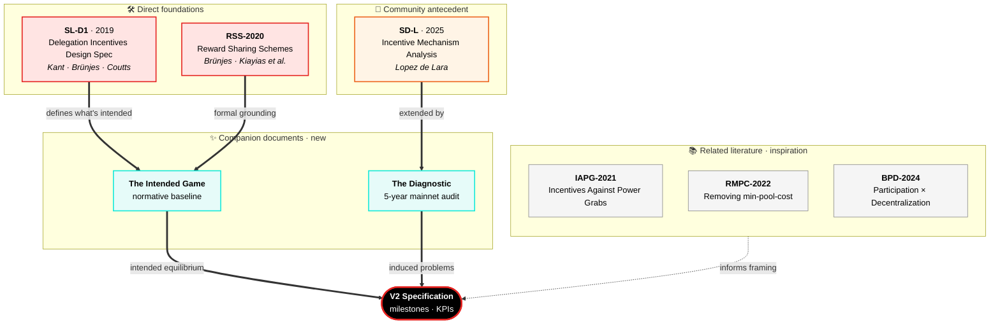

# The Cardano Reward System V2 — Specification for a Sustainable Successor

The Shelley-era reward mechanism was designed in 2019 and deployed at epoch 208 (August 2020). The formal game theory (*Reward Sharing Schemes for Stake Pools*, Brünjes & Kiayias, 2020) and the engineering specification (SL-D1) were written under a set of assumptions that reflected the state of the protocol at the time: Plutus smart contracts did not yet exist; no on-chain governance mechanism was available; the DeFi economy that would later generate the majority of per-transaction fee revenue had not begun; and the reserve stood at 14 billion ADA — large enough that sustainability questions seemed distant. The mechanism was designed for a simpler chain, governed off-chain, with a single population of stakers and a reserve runway measured in decades.

Five years of mainnet operation have changed every one of those conditions. Smart contracts (Plutus, post-Alonzo) now account for ~30% of fee revenue and introduce a structurally distinct submitter population — script-based addresses that pay the highest per-transaction fees but cannot participate in staking. On-chain governance (CIP-1694, the Conway era) provides the institutional machinery to review and adjust protocol parameters — machinery that did not exist when $\rho$, $\tau$, $k$, $a_0$, and $minPoolCost$ were set and then never touched. The treasury, funded by 20% of each epoch's pot, has accumulated a substantial balance that could serve as a stabilisation instrument. Leios promises throughput improvements that could expand the fee base by an order of magnitude.

The problems documented in [§1](diagnostic/README.md#1-the-reward-flow)–[§3](diagnostic/README.md#3-the-price-constraint) are not the result of parameter mis-calibration within an otherwise sound design. They are structural consequences of a mechanism that was built without the tools, the populations, and the on-chain institutions that now exist. The analysis demonstrates this empirically at every layer: the reserve is depleting on schedule with no transition plan ([§1.1](diagnostic/README.md#11-treasury-pool-pots-distribution)), the reward curve produces the opposite of the intended equilibrium ([§1.2](diagnostic/README.md#12-pools-distribution)), the fee structure creates a viability gap that penalises the operators the system needs most ([§1.3](diagnostic/README.md#13-operator-delegator-distribution)), the populations have frozen into configurations the mechanism cannot alter ([§2.1](diagnostic/README.md#21-the-staking-populations)), the fee-generating population is contracting while the mechanism depends on its expansion ([§2.2](diagnostic/README.md#22-transaction-submitters)), and the ADA price constraint binds the entire system to an exogenous variable it cannot influence ([§3](diagnostic/README.md#3-the-price-constraint)).

With five years of empirical evidence and a governance infrastructure that can act on it, the question is no longer whether the reward mechanism needs revision. The question is what a successor mechanism must satisfy to be considered an improvement. This document answers that question. It consolidates the induced problems into formal specifications — each grounded in the observations documented above, each measurable by on-chain KPIs — to provide the community with a structured framework for proposing, evaluating, and comparing candidate designs.

The problems induced in [§1](diagnostic/README.md#1-the-reward-flow)–[§3](diagnostic/README.md#3-the-price-constraint) are not independent. They form a dependency chain: some must be resolved before others become tractable. The milestones below follow that chain. Each is framed as an *outcome* the mechanism must achieve — not a design prescription for how to achieve it. The format is consistent: the problem is stated, the evidence is referenced, and the milestone is split into sub-milestones that can be addressed sequentially. The associated KPIs are the acceptance criteria.

A note on design versus specification. This document deliberately avoids prescribing reward-curve formulas, parameter values, or implementation strategies. Those are *design* questions — they belong in the CIPs and simulation work that respond to these milestones. The reward curve, for instance, is a tool that serves multiple milestones simultaneously ([§3.1](#31-guarantee-operator-viability-across-the-entire-productive-population), [§3.2](#32-restore-the-notion-of-pledge-among-operators), [§3.3](#33-maintain-and-diversify-a-competitive-delegator-yield), [§3.4](#34-reduce-the-concentration-effects-that-distort-both-populations)); it is not a milestone in itself. What follows defines what the system must accomplish. How it accomplishes it is the community's design space.

## Table of Contents

- [1. Foundations](#1-foundations)
  - [1.1 Prior work](#11-prior-work)
    - [1.1.1 Direct foundations — the normative reference](#111-direct-foundations--the-normative-reference)
    - [1.1.2 Related theoretical literature — context, not direct extension](#112-related-theoretical-literature--context-not-direct-extension)
    - [1.1.3 Community antecedent — the empirical precursor](#113-community-antecedent--the-empirical-precursor)
  - [1.2 Companion documents — written for this spec](#12-companion-documents--written-for-this-spec)
    - [1.2.1 The Intended Game — the normative baseline](#121-the-intended-game--the-normative-baseline)
    - [1.2.2 The Diagnostic — the empirical evidence](#122-the-diagnostic--the-empirical-evidence)
  - [1.3 How the pieces connect](#13-how-the-pieces-connect)
- [2. Constitutional framework](#2-constitutional-framework)
- [3. Microeconomics — participant incentives and market structure](#3-microeconomics--participant-incentives-and-market-structure)
  - [3.1 Guarantee operator viability across the entire productive population](#31-guarantee-operator-viability-across-the-entire-productive-population)
  - [3.2 Restore the notion of pledge among operators](#32-restore-the-notion-of-pledge-among-operators)
  - [3.3 Maintain and diversify a competitive delegator yield](#33-maintain-and-diversify-a-competitive-delegator-yield)
  - [3.4 Reduce the concentration effects that distort both populations](#34-reduce-the-concentration-effects-that-distort-both-populations)
- [4. Macroeconomics — a self-sustaining and governable mechanism](#4-macroeconomics--a-self-sustaining-and-governable-mechanism)
  - [4.1 The staking pot must survive reserve depletion](#41-the-staking-pot-must-survive-reserve-depletion)
  - [4.2 The fee-generating population must expand](#42-the-fee-generating-population-must-expand)
  - [4.3 The mechanism must function across a range of ADA price scenarios](#43-the-mechanism-must-function-across-a-range-of-ada-price-scenarios)
  - [4.4 The mechanism must be governable](#44-the-mechanism-must-be-governable)
- [5. Evaluation framework](#5-evaluation-framework)

## 1. Foundations

This specification does not start from scratch. It stands on six years of engineering, game-theoretic research, and community analysis — and on two new companion documents written alongside this spec to make that inheritance usable.

The diagram below maps the eight documents that ground this work and how they relate to the specification.

Solid arrows mark direct dependencies — the spec reasons from these documents. The dashed arrow marks inspiration only — the related literature is read for framing, not extended. The two companion documents sit between prior work and the spec: they consolidate what was inherited into what can be reasoned against.

### 1.1 Prior work

The spec inherits from three distinct strata of prior work, each with a different relationship to the current document.

#### 1.1.1 Direct foundations — the normative reference

Two artefacts form the backbone this spec reasons against: the engineering specification and the formal model it was built on.

- **[SL-D1](references/design-specs/delegation-incentives-design-spec_kant-brunjes-coutts_2019.pdf) — *Delegation Incentives Design Specification*, Level 1** (Kant, Brünjes, Coutts, 2019). The original Shelley-era engineering artefact against which the reward mechanism was implemented. Every parameter in the current mechanism — $a_0$, $k$, $\rho$, $\tau$, $minPoolCost$ — has its canonical definition here.
- **[RSS-2020](references/research-papers/reward-sharing-schemes_brunjes-kiayias-et-al_2020.pdf) — *Reward Sharing Schemes for Stake Pools*** (Brünjes, Kiayias, et al., 2020). The formal model behind SL-D1: a non-cooperative game in which rational operators compete for saturating delegation under a reward curve parameterised by $a_0$. Establishes the $k$-pool equilibrium under a set of assumptions about operator rationality and delegator behaviour.

SL-D1 and RSS-2020 are the documents every milestone below is measured against.

#### 1.1.2 Related theoretical literature — context, not direct extension

Three later papers revisit aspects of the original model. This spec draws on them as prior art in the adjacent problem space — they frame questions this document also addresses — but it does not extend their results or adopt their mechanisms.

- **[IAPG-2021](references/research-papers/incentives-against-power-grabs_kiayias-et-al_2021.pdf) — *Incentives Against Power Grabs*** (Kiayias et al., 2021). Analyses the Sybil defence pledge is meant to provide and the conditions under which it fails.
- **[RMPC-2022](references/research-papers/removing-min-pool-cost_stouka-brunjes-kiayias-koutsoupias_2022.pdf) — *Removing the min-pool-cost floor*** (Stouka, Brünjes, Kiayias, Koutsoupias, 2022). Revisits $minPoolCost$ in light of early mainnet evidence of its distortionary effect on small operators.
- **[BPD-2024](references/research-papers/balancing-participation-decentralization_kiayias-et-al_2024.pdf) — *Balancing Participation and Decentralization*** (Kiayias et al., 2024). The most recent theoretical refinement of the original model, accounting for heterogeneous participation.

These papers are cited where their framing informs a milestone. They are not constructive foundations this spec builds upon.

#### 1.1.3 Community antecedent — the empirical precursor

- **[SD-L](references/previous-analasys/spo-incentives-analysis_lopez-de-lara_2025.pdf) — *Analysis of Cardano's Incentive Mechanism*** (Lopez de Lara, 2025). The prior empirical analysis this project builds directly on. Established many of the observations — pledge dilution, fee-structure regressivity, delegator immobility — that the Diagnostic revisits, extends, and grounds in on-chain data.

Taken together: SL-D1 and RSS-2020 describe what the mechanism was designed to be; SD-L is the community-side precursor this work extends; the related literature informs the problem space without providing its scaffolding. What none of these documents provide — and what makes them insufficient on their own as a foundation for a successor mechanism — is two-fold. The intended equilibrium is legible only to a reader willing to hold SL-D1 and RSS-2020 side-by-side; it has no standalone narrative statement. And the five-year mainnet record has never been audited stage-by-stage against that intended equilibrium. Closing these gaps is the purpose of the two companion documents below.

### 1.2 Companion documents — written for this spec

Two documents have been produced alongside this specification. Both are novel: neither existed before this project.

#### 1.2.1 The Intended Game — the normative baseline

This document did not exist before. The intended equilibrium it describes was implicit in SL-D1 and RSS-2020, but nowhere stated as a coherent narrative. [*The Intended Game*](the-intended-game/README.md) consolidates that implicit design into an explicit, testable baseline:

- the three player populations (operators, delegators, transaction submitters) and their motivations;
- the operator progression from first pledge to full commitment;
- the four security properties the equilibrium must satisfy (liveness, safety, Sybil resistance, non-triviality);
- the virtuous cycle aligned play is meant to produce.

Every milestone in this specification measures divergence from this baseline. Without a codified baseline, "divergence" has no reference point — which is why this document had to be written before the spec could be.

#### 1.2.2 The Diagnostic — the empirical evidence

[*The Diagnostic*](diagnostic/README.md) is a stage-by-stage audit of the current reward pipeline across five years of mainnet operation, built specifically for this spec. It decomposes the analysis into:

- the **reward flow** — epoch-budget assembly ([§1.1](diagnostic/README.md#11-treasury-pool-pots-distribution)), pool-level distribution ([§1.2](diagnostic/README.md#12-pools-distribution)), and operator/delegator split ([§1.3](diagnostic/README.md#13-operator-delegator-distribution));
- the **player populations** on which the pipeline operates ([§2](diagnostic/README.md#2-the-player-populations));
- the **ADA price constraint** that binds the mechanism to the external economy ([§3](diagnostic/README.md#3-the-price-constraint)).

**The evidence layer — the sub-reports.** The Diagnostic is not a single monolithic document. Each pipeline stage is backed by a dedicated sub-report: a self-contained analytical document with its own formulas, data, figures, and reproduction scripts. Four sub-reports carry the empirical weight:

- **[Treasury & Pool Pots Distribution](diagnostic/sub-flows/treasury-and-pool-pots-distribution/mainnet-analysis/README.md)** — epoch-budget assembly, reserve trajectory, fee composition, return-to-reserve mechanism. Backs [§1.1](diagnostic/README.md#11-treasury-pool-pots-distribution).
- **[The Pools Pot Distribution Gaps](diagnostic/sub-flows/pools-distribution/mainnet-analysis/README.md)** — reward-curve behaviour, pledge economics, tier stratification, entity-level concentration. Backs [§1.2](diagnostic/README.md#12-pools-distribution).
- **[The Operator's Cut](diagnostic/sub-flows/operator-delegator-distribution/mainnet-analysis/README.md)** — intra-pool reward split, flat-fee hyperbola, commission market structure. Backs [§1.3](diagnostic/README.md#13-operator-delegator-distribution).
- **[The Staking Census](diagnostic/sub-flows/census/mainnet-analysis/README.md)** — staking populations, transaction submitters, address-type composition, fee-base concentration. Backs [§2.1](diagnostic/README.md#21-the-staking-populations) and [§2.2](diagnostic/README.md#22-transaction-submitters).

Each sub-report organises its empirical content as a two-level hierarchy:

- **Findings** (F1.1, F1.2, …) — fine-grained empirical atoms. Each finding states a quantitative fact backed by on-chain data, cites its section and figures within the sub-report, and carries a one-line significance label.
- **Observations** (O1, O2, …) — structural claims the findings authorise. An observation clusters a group of findings (F1.1–F1.4, F2.1–F2.3, …) into a single reader-scale statement about the mechanism's behaviour.

Findings are testable against the data; observations are the structural claims the findings substantiate.

**The induction layer — the Diagnostic itself.** The Diagnostic is the glue. It does not re-derive findings — it imports a condensed Observations table from each sub-report and performs the step the sub-reports stop short of: **problem induction**.

Each pipeline stage in the Diagnostic carries a dedicated *Problem Induction* subsection. These subsections read the observations against the normative baseline from *The Intended Game* and promote them from factual claims into structural problem statements — the problems each milestone in this specification then answers.

The layering is one-directional:

- the **sub-reports** produce findings, cluster them into observations, and stop there;
- the **Diagnostic** aggregates observations across stages, reads them against the intended equilibrium, and elevates them into the structural problems this spec is built to address.

The infrastructure that powers these queries — a local cardano-node + cardano-db-sync stack — lives at [`mainnet-indexer/`](../mainnet-indexer/README.md) at the root of this repository and is the reproducibility layer behind every empirical claim.

### 1.3 How the pieces connect

Each milestone below reads against all three layers:

- the **prior work** (SL-D1 and RSS-2020) fixes what the mechanism was intended to do;
- the **Intended Game** translates that intent into a testable normative baseline;
- the **Diagnostic** measures what the mechanism actually produced over five years of mainnet.

Where a tenet of the Constitution supports a milestone, it is cited. Where a guardrail constrains the parameter space, the bounds are noted. Where a gap exists between intent and reality, the Diagnostic quantifies it and the milestone specifies what a successor must restore.

## 2. Constitutional framework

The Cardano Constitution (v2, ratified at epoch 609) provides both the normative foundation and the governance pathway for the milestones that follow. Three tenets are directly relevant:

**Tenet 4 — Fair compensation.** Operators and delegators who maintain the network are entitled to fair compensation for their contribution. This tenet grounds the operator-viability milestone ([§3.1](#31-guarantee-operator-viability-across-the-entire-productive-population)), the delegator-yield milestone ([§3.3](#33-maintain-and-diversify-a-competitive-delegator-yield)), and the reserve-sustainability milestone ([§4.1](#41-the-staking-pot-must-survive-reserve-depletion)): any mechanism that systematically under-compensates productive participants violates the Constitution's own standard.

**Tenet 9 — Fair treatment.** All participants in the Cardano ecosystem shall be treated fairly and shall not be subject to unjustifiable discrimination. The current fee structure, which imposes a 48% effective cost on sub-viable operators while charging 1.5% near saturation ([[§1.3](diagnostic/README.md#13-operator-delegator-distribution) O1](diagnostic/README.md#132-mainnet-observations)), and the pledge mechanism, which provides no material reward for commitment ([[§1.2](diagnostic/README.md#12-pools-distribution) O6](diagnostic/README.md#122-mainnet-observations)), fall short of this standard. [§3.1](#31-guarantee-operator-viability-across-the-entire-productive-population) (viability), [§3.2](#32-restore-the-notion-of-pledge-among-operators) (pledge), and [§3.4](#34-reduce-the-concentration-effects-that-distort-both-populations) (entity-level accounting) each address a dimension of this gap.

**Tenet 10 — Monetary stability.** The protocol shall not dilute or inflate ada in a manner that is inconsistent with the long-term sustainability and integrity of the ecosystem. This tenet constrains the funding-model transition ([§4.1](#41-the-staking-pot-must-survive-reserve-depletion)), the monetary-expansion parameters ([§4.3](#43-the-mechanism-must-function-across-a-range-of-ada-price-scenarios)), and any instrument that draws on the reserve or treasury to fund operator support.

The Constitution also defines the governance pathway. The parameters that shape the reward mechanism — $minPoolCost$ (MPC-01 through MPC-03), $a_0$ (PPI-01 through PPI-04), $k$ (SPTN-01 through SPTN-04), $\rho$ (ME-01 through ME-05), and $\tau$ (TC-01 through TC-05) — are modifiable through Parameter Update governance actions, which require a 51–75% approval threshold depending on the parameter class. This is a lower bar than Constitutional amendment (Article IV), meaning that the milestones in this section can, in principle, be advanced through the existing governance machinery without amending the Constitution itself. However, each parameter is bounded by guardrail ranges (e.g., $a_0 \in [0.1, 1.0]$, $k \in [250, 2000]$, $minPoolCost \in [0, 500]$ ADA, $\rho \in [0.001, 0.005]$, $\tau \in [0.1, 0.3]$), and changes to critical parameters must observe a 90-day publication-to-submission timeline.

One gap deserves attention. The Constitution operates at the pool level — it governs pool parameters and pool-level constraints. The concept of operator *entity* — a cluster of pools sharing a common controller — has no constitutional anchor. [§3.4](#34-reduce-the-concentration-effects-that-distort-both-populations) (entity-level awareness) therefore occupies a distinct position: it requires either constitutional evolution to recognise entities as first-class participants, or a protocol-level mechanism that achieves entity-level accounting within the existing constitutional framework.

The milestones below reference their constitutional grounding explicitly. Where a tenet supports the milestone, it is cited. Where a guardrail constrains the parameter space, the bounds are noted. Where a gap exists, it is identified. The Constitution is not decoration — it is the governance instrument through which these specifications become actionable.

## 3. Microeconomics — participant incentives and market structure

The first group of milestones addresses the microeconomics of the mechanism: the participant-level incentive structures that shape operator behaviour, pledge commitment, delegator yield, and market concentration. These are the problems that manifest at the individual actor level — the reward curve, the fee structure, the pledge function, and the entity-recognition gap — and their resolution is a precondition for the macroeconomic sustainability addressed in [§4](#4-macroeconomics--a-self-sustaining-and-governable-mechanism).

### 3.1 Guarantee operator viability across the entire productive population

This is the foundational specification. Every other problem — delegator yield, staking-pot sustainability, population dynamics — rests on a network of operators that can sustain themselves economically. If operators cannot survive, nothing else matters.

**Constitutional alignment.** Tenet 4 (fair compensation) requires that operators who maintain the network receive adequate remuneration. Tenet 9 (fair treatment) prohibits the unjustifiable discrimination that the current $1/\sigma$ fee structure imposes on small operators. The relevant governance parameters — $minPoolCost$ (MPC-01 through MPC-03, range [0, 500] ADA) and $k$ (SPTN-01 through SPTN-04, range [250, 2000]) — are modifiable through Parameter Update actions, making the structural and economic specifications below actionable within the existing governance framework.

#### 3.1.1 Problem statement

The mechanism was designed so that a new operator who pledges an initial amount and attracts delegation follows a legible progression — from new pool to established pool to fully committed pool — with delegation providing the growth path beyond the initial commitment ([*The Intended Game* §3.2, §3.4.4](the-intended-game/README.md#32-operators-from-first-pledge-to-full-commitment)). Today's single-pool operator with 2M ADA of delegation and a proven track record should be tomorrow's established entity. The mechanism must support this trajectory.

Two structural gaps prevent it from doing so.

**The viability gap.** The fixed-cost floor ($minPoolCost$) absorbs 47.5% of pool reward at the sub-viable tier but only 1.5% near saturation ([[§1.3](diagnostic/README.md#13-operator-delegator-distribution) O1](diagnostic/README.md#132-mainnet-observations)). This opens a gap of ~870 pools between the production threshold (~1M ADA) and the viability threshold (~3M ADA), where pools produce blocks but cannot sustain their operators economically ([§1.3.3.1](diagnostic/README.md#1331-guarantee-operator-viability-across-the-productive-population)). No single-pool operator in the retail market earns a competitive wage: the median earns ~25,000 ADA/yr — enough to cover infrastructure but not the 5–15 hrs/month of skilled work ([[§1.3](diagnostic/README.md#13-operator-delegator-distribution) O6](diagnostic/README.md#132-mainnet-observations)). The floor follows a $1/\sigma$ hyperbola: the operators who charge the most earn the least.

**The operator growth path is not functioning as intended.** The census finds no trace of the designed growth trajectory on mainnet. The independent single-pool operator population peaked at 555 pools and 39.1% of productive stake around epoch 300, then contracted continuously to 291 pools and 24% at epoch 623 — a 48% loss in pool count and 15 percentage points in stake share ([*Staking Census* F3.7](diagnostic/sub-flows/census/mainnet-analysis/README.md#353-cohort-decomposition-who-holds-the-productive-set)). The replacement pools that sustain the ~950-pool total are entity-operated, not new independents: multi-pool entities grew from 23 to 85, their pool count from 135 to 660 ([*Staking Census* F3.8](diagnostic/sub-flows/census/mainnet-analysis/README.md#353-cohort-decomposition-who-holds-the-productive-set)). Capital flows from declining community fleets toward institutional entrants and exchanges — not toward the independent tail growing into established entities ([*Staking Census* F3.9](diagnostic/sub-flows/census/mainnet-analysis/README.md#354-the-independent-pipeline-what-the-mechanism-was-designed-to-produce)). The absence of evidence for the designed growth path is itself the diagnosis.

##### Evidence base

| Dimension | Key observation | Source |
| --- | --- | --- |
| **Fee structure** | The distortion comes from the fixed-cost floor, not from the commission market. A sub-viable operator absorbs 48.3% of pool rewards yet earns 24,820 ADA/yr; an 11+ pool MPO absorbs 7.7% yet earns 1,035,496 ADA/yr — 42× more revenue at 6× less effective price. The commission market is healthy: 69% competitive, median margin stable for 405 epochs. | [§1.3 O1, O2, O6](diagnostic/README.md#132-mainnet-observations) |
| **Fee floor trajectory** | The floor's burden grows as the reserve depletes: the fixed-cost share of pool rewards rises mechanically, progressively extending the viability gap toward pools in the 5–10M range. | [§1.3 O8](diagnostic/README.md#132-mainnet-observations) |
| **Population dynamics** | The productive pool count has held near 950 since epoch 300, but this masks 3,497 entries against 3,070 exits — ~16 pools/epoch turnover (1.7%/epoch). Turnover falls disproportionately on small independent operators near the production threshold. | [Census §3.5](diagnostic/sub-flows/census/mainnet-analysis/README.md#35-population-dynamics-entries-exits-and-turnover) |
| **Stake variability** | Pools near the production threshold oscillate in and out of viability: 9.3% have CV between 50–100%, 3.4% exceed 100%. | [Census §3.6](diagnostic/sub-flows/census/mainnet-analysis/README.md#36-pool-size-variability-how-stable-is-a-pools-stake) |
| **Thresholds** | The production threshold rises mechanically with total staked ADA — from ~470K at Shelley launch to ~1M at epoch 623. The independent single-pool operator population stands at 477 pools (5.28B ADA, 24.5% of productive stake), share in slow decline; only 283 above the viability threshold. 116 sub-threshold pools carry 0.31% of active stake. | [Census §3.4.3](diagnostic/sub-flows/census/mainnet-analysis/README.md#343-historical-decomposition-productive-vs-sub-threshold-pools), [§1.2 O5](diagnostic/README.md#122-mainnet-observations), [§1.2.4.4.1](diagnostic/README.md#12441-enforce-the-production-threshold-build-a-rocket-pool-for-cardano) |
| **Incentive alignment** | The current fee structure favours operators who amortise the fixed cost across large fleets. Small independent operators — from whom tomorrow's established entities should emerge — face the highest effective cost burden. The incentive gradient runs counter to the mechanism's design intent. | [§1.3 O1](diagnostic/README.md#132-mainnet-observations), [§1.3 O6](diagnostic/README.md#132-mainnet-observations) |

#### 3.1.2 Structural: enforce the production threshold

The protocol must make the production threshold explicit and enforceable. Below this threshold, pools cannot reliably produce blocks — their existence misleads delegators and dilutes the operator marketplace.

**Specification.** The mechanism must define a minimum active-stake threshold ($\sigma_{\min}$) below which pool registration is not permitted. Two requirements:

**R1 — The threshold must enforce the structural production boundary.** Currently ~1M ADA, derived from the Poisson statistics of block production ([§1.2.4.1.1](diagnostic/README.md#12411-the-structural-floor)) — a mathematical property of the protocol, not an empirical observation. The protocol already defines this boundary indirectly; the specification requires making it explicit and enforced. A pool below this threshold cannot reliably produce blocks; its presence in the registry is noise.

**R2 — A legitimate sub-threshold path must exist.** A protocol-level or smart-contract-based pooling service (analogous to Rocket Pool on Ethereum — [§1.2.4.4.1](diagnostic/README.md#12441-enforce-the-production-threshold-build-a-rocket-pool-for-cardano)) must allow technically capable participants with insufficient capital to combine operational commitment with pooled delegation, cross the threshold collectively, and operate a full pool.

The pooling service transforms the empty corridor between "committed to this network" and "producing blocks for this network" into a supported trajectory. An operator who enters the alliance with 100K ADA, proves operational competence, and graduates to independent operation is exactly the kind of participant the protocol should incubate. The current mechanism offers that participant nothing but a misleading registration form.

The effect is a clean marketplace: every registered pool can produce blocks; the sub-threshold space is served by a dedicated mechanism rather than abandoned to noise; and the operator entry experience becomes legible — one gate, one threshold, one supported path below it.

| KPI | Definition | Current | Target |
| --- | --- | --- | --- |
| Sub-threshold pool count | Pools below $\sigma_{\min}$ | ~116 | 0 (structurally enforced) |
| Pooling-service participation | Operators in sub-threshold pooling mechanism | 0 (does not exist) | > 0 — the path must exist |

#### 3.1.3 Economic: every productive pool must be profitable

Enforcing the production threshold eliminates the structural noise. But the viability gap is not only structural — it is economic. The $minPoolCost$ floor creates a viability threshold (~3M ADA) *above* the production threshold (~1M ADA). A pool that crosses $\sigma_{\min}$ and produces blocks is not automatically profitable. This milestone closes that gap.

**Specification.** The mechanism must ensure that every pool at or above $\sigma_{\min}$ generates sufficient operator revenue to cover real-world operating costs. Three requirements:

**R1 — The fixed-cost floor must be eliminated or replaced by a proportional mechanism.** The current $minPoolCost$ follows a regressive $1/\sigma$ hyperbola that penalises small pools and subsidises large ones. A percentage-based $minPoolRate$ that scales with pool reward would close the viability gap by construction: a pool earning 1,000 ADA pays the same *fraction* as a pool earning 100,000 ADA.

**R2 — The profitability logic must be described and legible.** Operators must be able to compute, before registering a pool, whether that pool will be profitable at a given stake level and ADA price. The current system requires navigating an implicit cost structure that only reveals its regressive nature after operation begins.

**R3 — The profitability parameters must be reviewable by governance.** Operator costs are fiat-denominated while operator revenue is ADA-denominated. The mechanism must provide governance with the instruments to manage this asymmetry — whether through periodic parameter review (linked to [§4.4](#44-the-mechanism-must-be-governable)), oracle-informed adjustment, or treasury-funded operator support during sustained price downturns.

The third point is critical. The current mechanism defines $minPoolCost$ as a fixed ADA amount that has been adjusted exactly once (340 → 170 ADA) since Shelley launch. Its fiat-equivalent value has fluctuated from ~$170 to ~$17 depending on ADA price, with no protocol-level awareness of this variation. A successor mechanism must acknowledge that operator costs are fiat-denominated while operator revenue is ADA-denominated, and must provide governance with the instruments to manage this asymmetry — whether through periodic parameter review (linked to [§4.4](#44-the-mechanism-must-be-governable)), oracle-informed adjustment, or treasury-funded operator support during sustained price downturns.

The combined effect of [§3.1.2](#312-structural-enforce-the-production-threshold) and [§3.1.3](#313-economic-every-productive-pool-must-be-profitable) is a single legible gate: below $\sigma_{\min}$, the pooling service operates; at $\sigma_{\min}$, the operator is immediately economically viable. The viability gap disappears: the capital barrier is reduced to the production minimum, the economic barrier is eliminated, and expertise and commitment weigh more than capital alone.

| KPI | Definition | Current | Target |
| --- | --- | --- | --- |
| Dead-zone population | Pools between production and viability thresholds | ~870 | 0 |
| Operator viability rate | Productive pools where revenue > fiat operating cost | ~60% (at $0.30/ADA) | >90% across the productive set |
| Independent operator count | Viable independent single-pool operators | 283 | >$k/2$ (currently 250) |
| Viability at stress price | Productive pools viable at ADA = $0.10 | <20% est. | >50% |

> **Dependency note.** [§3.1](#31-guarantee-operator-viability-across-the-entire-productive-population) is the foundation. [§3.2](#32-restore-the-notion-of-pledge-among-operators) (pledge) depends on it: pledge is only meaningful once operators are viable. [§3.3](#33-maintain-and-diversify-a-competitive-delegator-yield) (delegation) depends on it: the yield that reaches delegators is shaped by the fee structure that [§3.1](#31-guarantee-operator-viability-across-the-entire-productive-population) reforms. [§4.1](#41-the-staking-pot-must-survive-reserve-depletion) (staking-pot sustainability) depends on it: a viable operator population is a prerequisite for any funding-model transition. The reward curve — the design instrument that implements the economic incentives — must be calibrated to serve [§3.1](#31-guarantee-operator-viability-across-the-entire-productive-population) through [§3.3](#33-maintain-and-diversify-a-competitive-delegator-yield) simultaneously; it is a tool, not a specification.

### 3.2 Restore the notion of pledge among operators

*Depends on: [§3.1](#31-guarantee-operator-viability-across-the-entire-productive-population).* With operators viable across the productive population, the question becomes: does the mechanism distinguish between an operator who commits capital to the network and one who, without pledging, has nonetheless captured saturating delegation through brand, scale, or exchange custody?

**Constitutional alignment.** Tenet 9 (fair treatment) supports the restoration of pledge as an economic signal: treating committed operators identically to hollow fleets that contribute no capital is itself a form of unjustifiable discrimination — it penalises commitment. The key parameter, $a_0$ (poolPledgeInfluence, PPI-01 through PPI-04), is bounded by the Constitution at [0.1, 1.0] and modifiable through Parameter Update actions. The current value ($a_0 = 0.3$) sits near the bottom of the range; the guardrail permits up to a threefold increase without constitutional amendment. The $k$ parameter (SPTN-01 through SPTN-04, range [250, 2000]) also shapes the pledge dynamics: the ratio of pledged capital to saturation level determines whether the Sybil tax binds.

#### 3.2.1 Problem statement

**Why pledge exists.** The security model of the Cardano consensus layer requires that the $k$-pool target represents $k$ *independent* block-producing entities — not $k$ certificates controlled by a handful of actors. The property that makes this assumption defensible is *Sybil resistance*: creating additional block-producing identities must carry a cost high enough that fragmentation is economically dominated by honest, single-pool operation ([*The Intended Game* §3.4.3](the-intended-game/README.md#343-sybil-resistance-making-fragmentation-expensive)).

In proof of work, Sybil resistance is physical — each identity requires hardware and electricity that cannot be shared. In proof of stake, identity is cheap: registering a new pool costs a certificate deposit (~500 ADA) and an operational setup that an experienced operator can replicate in hours. The saturation cap ($k$) was designed to limit concentration by capping the delegation any single pool can receive — but the cap operates on *pools*, not on *entities*. An operator who saturates one pool registers a second and continues growing. The cap fragments pools, not power.

Pledge is the mechanism's answer. Brünjes & Kiayias ([2020, §4](references/research-papers/reward-sharing-schemes_brunjes-kiayias-et-al_2020.pdf)) formalise this through the $a_0$ parameter: the reward function includes a pledge-sensitive component designed so that splitting capital across $n$ pools dilutes the pledge bonus per pool. The intended cost of a Sybil attack scales as $O(n)$ in committed capital — the *Sybil tax*. If the reward formula penalises low-pledge pools sufficiently, the marginal cost of the $n$-th pool exceeds its marginal reward and the expansion becomes unprofitable. There is a critical distinction in *how* this cost operates: when it comes from the pledge mechanism itself — forfeiting a meaningful bonus by fragmenting — the *design* provides the defence; when it comes from raw capital requirements alone, the defence is incidental, not engineered ([*The Intended Game* §3.4.3](the-intended-game/README.md#343-sybil-resistance-making-fragmentation-expensive)).

**What went wrong.** At $a_0 = 0.3$, the relationship between pledge and reward is so weak that it provides no behavioural incentive. A pool pledging 1M ADA receives a bonus that amounts to fractions of a percent of its total reward — invisible to delegators, irrelevant to the operator's business case ([§1.2.4.3.1](diagnostic/README.md#12431-what-mainnet-reveals)). The marginal cost of registering an additional pool is ~500 ADA; the marginal reward is a full share of the curve. The rational strategy — which the market has discovered — is to expand. The mechanism creates three structural populations that respond to pledge differently: custodial operators who *cannot* pledge (the constraint is architectural); MPO fleets who *choose not to* (the rational response to a negligible incentive); and independent operators who pledge out of conviction rather than economic rationality.

The net result is a proof-of-stake system where the Sybil defence operates through incidental wealth constraints — not through the designed pledge mechanism — and where 85 entities operating 901 pools control 75.4% of staked supply with no protocol-level cost for having done so. $k = 500$ implies 500 independent entities sharing consensus power; the effective operator count is an order of magnitude below that target. The saturation cap has produced ~3,000 pool certificates — far more than $k$ — but the power behind those certificates is concentrated in fewer hands than the equilibrium requires. Pools have fragmented; power has not.

##### Evidence base

| Dimension | Key observation | Source |
| --- | --- | --- |
| **Pledge-bonus utilisation** | 95.6% of the pledge-bonus budget returns to the reserve unused. The instrument exists in the formula but is economically inert. | [§1.2 O6](diagnostic/README.md#122-mainnet-observations) |
| **Entity-level pledge behaviour** | 78 of 85 multi-pool entities are outside the pledge-response path entirely. Only 7 entities (8%) respond to the pledge signal. | [§1.2.4.4.3](diagnostic/README.md#12443-multi-pool-operators-and-the-need-for-anti-monopoly-countermeasures) |
| **Custodial constraint** | CEX + IVaaS operators (10 entities, 181 pools, 7.40B ADA) cannot pledge the capital they manage — delegated ADA belongs to end users. The constraint is architectural, not strategic. | [§1.2.4.3.1.3](diagnostic/README.md#124313-the-hollow-strategy-dominates-at-every-level-of-aggregation) |
| **Fleet expansion cost** | The marginal cost of a new pool is ~500 ADA (certificate deposit). The marginal reward is a full share of the reward curve. The Sybil tax is effectively priced at zero. | [§1.2.4.3.1](diagnostic/README.md#12431-what-mainnet-reveals) |
| **Independent operators** | Single-pool operators pledge out of conviction rather than economic rationality, receiving almost nothing in return. Their share of active stake is in slow decline. | [§1.2.4.3.1.3](diagnostic/README.md#124313-the-hollow-strategy-dominates-at-every-level-of-aggregation), [§2.1.3.1](diagnostic/README.md#2131-the-operator-population-is-highly-concentrated-and-stable) |
| **Market structure outcome** | 85 multi-pool entities control 75.4% of staked supply through 901 pools. The effective entity-level concentration is an order of magnitude above the $k$-target equilibrium. | [§1.2 O4](diagnostic/README.md#122-mainnet-observations), [§2.1.3.1](diagnostic/README.md#2131-the-operator-population-is-highly-concentrated-and-stable) |

#### 3.2.2 Specification

A successor mechanism must reintroduce pledge as a consequential economic force that makes identity multiplication progressively expensive. The Sybil cost must operate through the *designed reward structure*, not through incidental wealth constraints. Four requirements:

**R1 — The reward penalty for low pledge must be behaviourally significant.** The marginal cost of the $n$-th pool must exceed its marginal reward at a fleet size well below the current unchecked expansion frontier. The target is a yield differential >0.5pp between meaningfully pledged and minimally pledged pools — visible to delegators and material to the operator's business case. At the current near-zero differential, the rational strategy is to expand; the revised mechanism must make that strategy dominated.

**R2 — Pledge must be evaluated at the entity level, not the pool level.** An entity splitting 1M ADA across ten pools must not receive the same aggregate pledge benefit as ten independent operators each pledging 1M ADA. The entire point of pledge is to impose the $O(n)$ capital cost on exactly this behaviour. Entity-level pledge accounting is the mechanism through which [§3.2](#32-restore-the-notion-of-pledge-among-operators) and [§3.4](#34-reduce-the-concentration-effects-that-distort-both-populations) interact.

**R3 — The mechanism must distinguish inability to pledge from choice not to pledge.** Custodial operators (CEX, IVaaS) cannot pledge delegated capital — the constraint is architectural, not strategic. The design must accommodate this structural reality rather than treating custodial inability and strategic extraction as the same signal.

**R4 — The pledge parameters must be governable.** The real cost of pledging ADA depends on the ADA price, the DeFi opportunity cost of locked capital, and the composition of the operator population — all of which evolve. The pledge parameters must be reviewable and adjustable through the Conway-era governance process, not frozen at deployment values as $a_0$ has been since Shelley launch.

Pledge is not a reward bonus for good behaviour. It is the protocol's only on-chain instrument for making the $k$-pool equilibrium a Nash equilibrium rather than a theoretical construct. Without a credible Sybil tax, the $k$ target is unreachable, and the system converges on the concentrated structure the analysis documents. Restoring this tax — through the designed pledge mechanism, not through wealth alone — is the prerequisite for every subsequent milestone that touches market structure ([§3.3](#33-maintain-and-diversify-a-competitive-delegator-yield), [§3.4](#34-reduce-the-concentration-effects-that-distort-both-populations)).

| KPI | Definition | Current | Target |
| --- | --- | --- | --- |
| Pledge-bonus utilisation | Fraction of available pledge-bonus budget actually distributed | <5% | >50% — the instrument must be in active use |
| Pledge-responsive entities | MPO entities within the pledge-response path | 7 of 85 (8%) | >50% of entities by stake weight |
| Yield differential (pledged vs unpledged) | Delegator yield gap between meaningfully pledged and minimally pledged pools | ~0 | >0.5pp — visible to delegators |
| Pledge cost of fleet expansion | Marginal pledge capital required for the $n$-th pool in a fleet | ~0 | Positive and increasing with $n$ |

> **Dependency note.** [§3.2](#32-restore-the-notion-of-pledge-among-operators) depends on [§3.1](#31-guarantee-operator-viability-across-the-entire-productive-population) (viable operators): pledge is only meaningful once the viability gap is closed — requiring pledge from operators who cannot sustain themselves is not Sybil resistance, it is exclusion. [§3.2](#32-restore-the-notion-of-pledge-among-operators) feeds directly into [§3.4](#34-reduce-the-concentration-effects-that-distort-both-populations) (entity-level accounting): entity-level pledge evaluation is the mechanism through which [§3.2](#32-restore-the-notion-of-pledge-among-operators) and [§3.4](#34-reduce-the-concentration-effects-that-distort-both-populations) interact. [§3.3](#33-maintain-and-diversify-a-competitive-delegator-yield) (delegation) depends on [§3.2](#32-restore-the-notion-of-pledge-among-operators): the yield differential that makes delegation consequential is partially driven by the pledge signal. [§3.2](#32-restore-the-notion-of-pledge-among-operators) also interacts with [§4.3](#43-the-mechanism-must-function-across-a-range-of-ada-price-scenarios) (price robustness): the real cost of pledging ADA depends on the ADA price and the opportunity cost in DeFi — parameters that fluctuate with market conditions.

### 3.3 Maintain and diversify a competitive delegator yield

*Depends on: [§3.1](#31-guarantee-operator-viability-across-the-entire-productive-population), [§3.1](#31-guarantee-operator-viability-across-the-entire-productive-population).* With operators viable and pledge restored as an economic signal, the question becomes: does the delegation market reward the participants who sustain the network — and does it offer them anything beyond a single, undifferentiated product?

**Constitutional alignment.** Tenet 4 (fair compensation) extends to delegators: participants who commit capital to consensus security are entitled to a return that reflects that contribution. Tenet 10 (monetary stability) constrains the instruments: the yield cannot be sustained by inflationary mechanisms that dilute ada's long-term value. The monetary-expansion parameter $\rho$ (ME-01 through ME-05, range [0.001, 0.005]) and the treasury cut $\tau$ (TC-01 through TC-05, range [0.1, 0.3]) define the funding envelope within which delegation yield operates — both are modifiable through governance but bounded by the Constitution.

The problem has three faces. First, the base yield must be competitive as an investment: staking competes for capital with DeFi protocols, liquid markets, and off-chain alternatives — if the return is not attractive in absolute terms, rational capital leaves the staking pool regardless of how well the mechanism distributes it. Second, the yield must reward operators who play the game the mechanism was designed to produce: balanced independent operators return 1.98% while hollow MPO fleets return 2.08% — the operator who commits capital is *penalised* for commitment ([[§1.3](diagnostic/README.md#13-operator-delegator-distribution) O5](diagnostic/README.md#132-mainnet-observations)), the yield spread is 0.39pp (noise), and half of all pool switches produce zero yield change ([[§2.1](diagnostic/README.md#21-the-staking-populations) O6](diagnostic/README.md#212-mainnet-observations)). Third, the delegation model has not evolved since Shelley: in 2020, no smart-contract capability existed — the only product was liquid delegation at a uniform yield. Five years later, Plutus scripts and the extended UTXO model provide infrastructure for a richer staking market that Cardano has not yet exploited.

#### 3.3.1 Make the base yield competitive

Staking is an investment. The delegator who commits ADA to a pool forgoes DeFi yield, liquidity premiums, and off-chain alternatives. If the base staking return is not competitive with those alternatives, rational capital migrates — and the consensus layer loses the participation it depends on. The base yield must be attractive enough, in absolute terms, that staking remains a credible allocation for a diversified ADA holder.

**Specification.** Two requirements:

**R1 — The base yield must be competitive with risk-adjusted on-chain alternatives.** This does not mean matching the highest DeFi yield — staking carries lower risk and provides a public good — but the gap must be narrow enough that the opportunity cost of staking does not drive systematic capital flight from the consensus layer.

**R2 — The yield must remain robust across ADA price scenarios.** A return that is competitive at $0.50 but irrelevant at $2.00 — or vice versa — fails the test. This connects directly to [§4.3](#43-the-mechanism-must-function-across-a-range-of-ada-price-scenarios) (price robustness): the base yield is not a fixed parameter but a function of the funding model, the ADA price, and the DeFi opportunity cost of capital.

| KPI | Definition | Current | Target |
| --- | --- | --- | --- |
| Base delegator yield | Net annualised return to a delegator in a productive pool | ~2% | Competitive with risk-adjusted DeFi lending rates |
| Staking participation rate | Fraction of circulating ADA staked | ~63% | ≥60% — sustained through market cycles |
| Capital retention | Net flow of ADA between staking and DeFi per epoch | Not tracked | Net neutral or positive toward staking |

#### 3.3.2 Make the yield reward operators who play the game

The base yield being competitive is necessary but not sufficient. The mechanism must also ensure that the yield *differentiates* between operator types — that delegators who choose a balanced, pledged, independent operator receive a materially better return than those who park stake in a hollow fleet. Today, the spread is noise: 0.39pp across the retail market ([[§1.3](diagnostic/README.md#13-operator-delegator-distribution) O5](diagnostic/README.md#132-mainnet-observations)), invisible to delegators, with delegation following visibility rather than return ([[§1.3](diagnostic/README.md#13-operator-delegator-distribution) O7](diagnostic/README.md#132-mainnet-observations)). The $minPoolCost$ floor absorbs a disproportionate share of small-pool rewards before any yield reaches delegators ([[§1.3](diagnostic/README.md#13-operator-delegator-distribution) O1](diagnostic/README.md#132-mainnet-observations), [§1.3 O8](diagnostic/README.md#132-mainnet-observations)). Entity-level information — fleet size, aggregate pledge ratio, operator profitability — is absent from the on-chain data, so delegators cannot distinguish a committed independent operator from one node in an anonymous fleet ([§1.2.4.3.5](diagnostic/README.md#12435-the-size-visibility-delegation-loop)).

**Specification.** Three requirements:

**R1 — The yield differential between entity types must be material.** The spread between balanced, hollow, and custodial operators at equivalent pool sizes must exceed 1pp. The current 0.39pp spread is noise ([[§1.3](diagnostic/README.md#13-operator-delegator-distribution) O5](diagnostic/README.md#132-mainnet-observations)); delegators must be able to *see* a material difference between committing to a balanced independent operator and parking stake in a hollow fleet. The mechanism must make commitment pay — visibly.

**R2 — Entity-level information must be visible to delegators.** Fleet size, aggregate pledge ratio, and entity-level profitability must be available on-chain so that delegation decisions can be informed by the structural attributes the mechanism rewards, not only by pool-level brand and size ([§1.2.4.3.5](diagnostic/README.md#12435-the-size-visibility-delegation-loop)). Without this information, the yield signal from R1 is uninterpretable.

**R3 — Delegator mobility must produce competitive pressure.** The current regime where half of all switches produce zero yield change ([[§2.1](diagnostic/README.md#21-the-staking-populations) O6](diagnostic/README.md#212-mainnet-observations)) must give way to a market where redelegation carries information and exerts discipline. When a delegator moves, the move must matter — to the delegator's return, and to the operator's revenue.

| KPI | Definition | Current | Target |
| --- | --- | --- | --- |
| Yield differential (balanced vs hollow) | Net delegator yield gap between balanced and hollow pools at equivalent size | ~0 (or negative: balanced 1.98% vs hollow 2.08%) | >1pp in favour of balanced |
| Entity-info visibility | Delegator-visible entity-level metadata on-chain | None | Fleet size, aggregate pledge, entity yield — available on-chain |
| Delegation responsiveness | Fraction of redelegations producing >50bp yield change | <50% | >60% |

#### 3.3.3 Diversify the delegation offer

The Shelley delegation model was designed before Plutus existed. The only product was — and still is — liquid delegation at a uniform yield. The smart-contract infrastructure now available on Cardano opens a design space that the original mechanism could not exploit: delegation products where the delegator accepts a stronger commitment or a different risk profile and receives a differentiated remuneration in return.

**Specification.** The mechanism — or its smart-contract extensions — must enable delegation products that go beyond the Shelley baseline. Three requirements:

**R1 — Lock-up tiers with differentiated APY.** Delegators who commit capital for a defined period (e.g., 6 epochs, 36 epochs, 73 epochs) accept reduced liquidity in exchange for a yield premium. The result is a term structure that rewards long-horizon commitment and stabilises the stake base that independent operators depend on.

**R2 — Liquid staking derivatives.** Smart-contract wrappers that issue transferable tokens representing staked ADA, allowing delegators to maintain liquidity (trade, lend, use as collateral in DeFi) while their underlying stake continues to earn rewards and contribute to consensus security. This is the product that brings capital currently parked in DeFi back into the staking pool.

**R3 — Automated delegation strategies.** Programmable vaults that rebalance across pools according to defined criteria (yield optimisation, decentralisation weighting, entity-level quality scores), lowering the information and operational burden on individual delegators.

The baseline liquid delegation model remains. These products build *above* it, so that the delegation market offers a spectrum of commitment-remuneration profiles rather than a single undifferentiated choice. The relationship is explicit: higher commitment — longer lock-up, less liquidity, more exposure — earns a higher return. This is the mechanism through which the delegation market becomes a market in the economic sense: multiple products, multiple risk-return points, and a price signal that reflects the value of the commitment each delegator makes.

| KPI | Definition | Current | Target |
| --- | --- | --- | --- |
| Delegation product diversity | Number of structurally distinct staking products available | 1 (liquid delegation only) | ≥3 (liquid + lock-up tiers + liquid staking derivative) |
| Lock-up participation rate | Fraction of staked ADA committed to lock-up tiers | 0% | >10% — enough to stabilise the stake base |
| DeFi-staking overlap | ADA simultaneously staked and deployed in DeFi via liquid staking | 0 | >0 — the path must exist |

> **Dependency note.** [§3.3](#33-maintain-and-diversify-a-competitive-delegator-yield) depends on [§3.1](#31-guarantee-operator-viability-across-the-entire-productive-population) (viable operators) and [§3.2](#32-restore-the-notion-of-pledge-among-operators) (meaningful pledge): a competitive yield is meaningless if operators cannot sustain themselves, and the yield signal that drives delegation must be anchored in a pledge mechanism that works. [§3.3.1](#331-make-the-base-yield-competitive) (base yield) interacts with [§4.1](#41-the-staking-pot-must-survive-reserve-depletion) (reserve depletion) and [§4.3](#43-the-mechanism-must-function-across-a-range-of-ada-price-scenarios) (price robustness): the absolute yield level depends on the funding model and the ADA price. [§3.3.2](#332-make-the-yield-reward-operators-who-play-the-game) (yield differentiation) interacts directly with [§3.4](#34-reduce-the-concentration-effects-that-distort-both-populations) (entity-level awareness): the yield differential and entity-info visibility that [§3.3.2](#332-make-the-yield-reward-operators-who-play-the-game) requires depend on the entity-level reward accounting that [§3.4](#34-reduce-the-concentration-effects-that-distort-both-populations) introduces. [§3.3.3](#333-diversify-the-delegation-offer) (diversified products) leverages post-Alonzo smart-contract infrastructure and interacts with [§4.2](#42-the-fee-generating-population-must-expand) (fee-generating population): liquid staking derivatives and DeFi-staking overlap expand the fee base while reinforcing staking participation.

### 3.4 Reduce the concentration effects that distort both populations

*Depends on: [§3.1](#31-guarantee-operator-viability-across-the-entire-productive-population), [§3.2](#32-restore-the-notion-of-pledge-among-operators), [§3.3](#33-maintain-and-diversify-a-competitive-delegator-yield).* With operators viable ([§3.1](#31-guarantee-operator-viability-across-the-entire-productive-population)), pledge restored as economic signal ([§3.2](#32-restore-the-notion-of-pledge-among-operators)), and delegation diversified ([§3.3](#33-maintain-and-diversify-a-competitive-delegator-yield)), the question becomes: does the market structure that distributes rewards actually serve decentralisation — or does concentration on *both sides* of the market prevent the equilibrium from emerging?

The analysis documents concentration on two fronts. On the supply side, 85 multi-pool entities control 75.4% of staked supply through 901 pools ([§1.2 O4](diagnostic/README.md#122-mainnet-observations)), while independent single-pool operators shrink to 283 viable pools and 25% of productive stake ([§1.2 O5](diagnostic/README.md#122-mainnet-observations)). On the demand side, 1,000 delegators (0.07% of the base) control 57% of staked ADA; the Gini coefficient is 0.976 ([§2.1 O3](diagnostic/README.md#212-mainnet-observations)). Both concentrations are structural, both crystallised early, and neither responds to the current incentive design.

**Constitutional alignment.** Tenet 9 (fair treatment) supports action on both fronts: a mechanism that rewards fleet expansion at near-zero marginal cost while penalising independent operators does not treat participants fairly; a mechanism that produces identical outcomes for a 32-ADA micro-delegator and a 50M-ADA titan offers no differentiated incentive for the capital commitment each represents. However, the Constitution currently operates at the pool level — its guardrails govern pool parameters ($k$, $a_0$, $minPoolCost$), not entity-level or delegator-tier constructs. The concept of operator *entity* has no constitutional anchor. Implementing entity-level reward accounting may therefore require either a protocol-level mechanism within existing pool-level parameters, or — if the design requires new on-chain primitives — a constitutional evolution. The existing $a_0$ and $k$ guardrails provide substantial design space, but the most ambitious versions of this milestone may eventually require governance action beyond parameter adjustment.

#### 3.4.1 Problem statement

##### The operator side — multi-pool entity concentration

The reward formula evaluates pools independently — it does not know that twenty pools share the same controller. The saturation cap, intended to prevent concentration, fragments *pools* but not *entities*: an operator who saturates registers a new pool and continues growing, at negligible marginal cost ([§1.2.4.4.3](diagnostic/README.md#12443-multi-pool-operators-and-the-need-for-anti-monopoly-countermeasures)).

The mechanism was designed for $k$ independent operators converging on a balanced equilibrium (Brünjes & Kiayias, 2020). It encounters instead a highly concentrated and segmented market where three structurally distinct sub-populations coexist: custodial operators (CEX + IVaaS: 10 entities, 181 pools, 7.40B ADA) who *cannot* pledge the capital they manage — the constraint is architectural; community and opaque MPO fleets (41 of 48 capital-sufficient entities) who have *chosen* not to pledge — the rational response to the current incentive structure; and independent single-pool operators who bear the full weight of the fee structure while their market share erodes ([§2.1.3.1](diagnostic/README.md#2131-the-operator-population-is-highly-concentrated-and-stable)).

The deeper failure is that the formula's unit of accounting — the pool — is the wrong unit. Rewards, saturation caps, and pledge calculations all operate at the pool level. But the entity that controls the pools is the economic actor that makes strategic decisions. An entity operating twenty pools with negligible pledge in each is indistinguishable, at the formula level, from twenty independent operators. The mechanism does not merely fail to prevent concentration; it is structurally blind to it.

##### The delegator side — titan delegators versus the micro-delegation tail

The demand side exhibits a concentration that mirrors the supply side. The median delegator holds 32 ADA; the mean holds 16,055 ADA — a 500× gap ([§2.1 O3](diagnostic/README.md#212-mainnet-observations)). This is not a transient distribution: concentration crystallised by epoch 300, and a subsequent 9× growth in delegator count produced no measurable change in the top-1% share ([Census §4.4.3](diagnostic/sub-flows/census/mainnet-analysis/README.md#443-historical-evolution--who-joined-and-where-is-the-capital)). The delegation market is structurally bimodal: 42% of delegators are loyal (201+ epochs), 21% volatile (≤ 5 epochs), with little in between ([§2.1 O4](diagnostic/README.md#212-mainnet-observations)).

Titan delegators — those holding 1M+ ADA — average 3.06 lifetime pool switches against 0.67 for micro-delegators ([§2.1 O5](diagnostic/README.md#212-mainnet-observations)). They hold 11B of 21.8B staked ADA, and only 38% of their stake sits in loyal delegations: capital is disproportionately mobile. Yet this mobility does not produce competitive pressure because it is not yield-driven: half of all switches produce zero yield change (±5 bps), operator-take direction is symmetric, and the only asymmetric signal is pool size — delegators drift toward larger, more visible pools, not toward more committed ones ([§2.1 O6](diagnostic/README.md#212-mainnet-observations)).

The mechanism treats a 32-ADA micro-delegation and a 50M-ADA titan delegation identically: both earn the same proportional return, both have the same governance weight per ADA, and neither receives any incentive differentiated by the scale or stability of commitment. The consequence is that the population with the power to discipline operators — titans — has no structured reason to exercise it, while the population that the protocol depends on for broad participation — micro-delegators — receives no signal that their commitment matters.

##### Evidence base

| Dimension | Key observation | Source |
| --- | --- | --- |
| **MPO fleet structure** | 85 entities, 901 pools, 75.4% of staked supply. 12 entities with 11+ pools control 40.4% of productive stake. | [§1.2 O4](diagnostic/README.md#122-mainnet-observations), [§2.1.3.1](diagnostic/README.md#2131-the-operator-population-is-highly-concentrated-and-stable) |
| **Sybil cost** | Marginal cost of a new pool is ~500 ADA; marginal reward is a full share of the curve. 78 of 85 MPO entities are outside the pledge-response path. | [§1.2 O6](diagnostic/README.md#122-mainnet-observations), [§1.2.4.3.1](diagnostic/README.md#12431-what-mainnet-reveals) |
| **Independent operator decline** | 283 viable single-pool operators, stake share in slow decline from 39% to 25% since epoch 300. | [§1.2 O5](diagnostic/README.md#122-mainnet-observations), [Census §3.5.4](diagnostic/sub-flows/census/mainnet-analysis/README.md#354-the-independent-pipeline--what-the-mechanism-was-intended-to-produce) |
| **Delegator concentration** | 1,000 delegators (0.07%) control 57% of staked ADA. Gini = 0.976. Frozen since epoch 300. | [§2.1 O3](diagnostic/README.md#212-mainnet-observations) |
| **Titan mobility** | Whales (1M+) average 3.06 switches; micro (<1K) average 0.67. Mobility scales with size but is not yield-driven. | [§2.1 O5](diagnostic/README.md#212-mainnet-observations), [§2.1 O6](diagnostic/README.md#212-mainnet-observations) |
| **Yield signal failure** | 50.5% of switches produce zero yield change. Pool size is the only asymmetric signal. | [§2.1 O6](diagnostic/README.md#212-mainnet-observations) |

#### 3.4.2 Entity-level awareness in reward distribution

The reward mechanism must transition from pool-level to entity-level accounting for the economic parameters that shape market structure. This does not mean collapsing all pools into a single reward calculation — pools remain the unit of block production and consensus participation. It means that the economic incentives (pledge accounting, saturation behaviour, reward scaling) must recognise the entity behind the pools.

This transition raises a constitutional question. The Cardano Constitution (v2) governs pool-level parameters — $k$, $a_0$, $minPoolCost$ — and its guardrails are defined in terms of pools, not entities. The concept of operator *entity* — a cluster of pools sharing a common controller — has no constitutional standing. Yet the evidence is unambiguous: 85 entities operating 901 pools control 75.4% of staked supply, and the formula's blindness to this structure is the root cause of the Sybil defence failure ([§1.2.4.4.3](diagnostic/README.md#12443-multi-pool-operators-and-the-need-for-anti-monopoly-countermeasures)). Two paths exist. The first operates within the current constitutional perimeter: the existing $a_0$ guardrail (PPI-01 through PPI-04, range [0.1, 1.0]) and $k$ guardrail (SPTN-01 through SPTN-04, range [250, 2000]) provide design space for entity-aware incentive structures that do not require new on-chain primitives — a reward curve calibrated so that pledge dilution across multiple pools carries real economic cost can approximate entity-level accounting through pool-level instruments alone. The second path requires constitutional evolution: introducing an on-chain entity registry and evaluating pledge, saturation, and reward-scaling at the entity level directly. This path demands a CIP, a governance vote, and potentially a constitutional amendment under Article IV — a higher bar, but one that addresses the structural blindness rather than working around it. The specification below is compatible with both paths. The requirements define *what* the mechanism must achieve; whether it achieves it through entity-level primitives or through calibrated pool-level instruments is a design choice.

**Specification.** Four requirements:

**R1 — Define a protocol-level concept of operator entity.** A cluster of pools sharing a common controller, identifiable through the existing owner-key registration or an equivalent on-chain attribution mechanism. The entity is the economic actor; the pool is the consensus unit. The mechanism must distinguish between the two.

**R2 — Evaluate pledge, saturation, and reward-scaling at the entity level.** An entity that splits 1M ADA of pledge across 10 pools must not receive the same aggregate pledge benefit as 10 independent operators each pledging 1M ADA. Pool-level evaluation is the root cause of the current Sybil blindness ([§1.2.4.4.3](diagnostic/README.md#12443-multi-pool-operators-and-the-need-for-anti-monopoly-countermeasures)); entity-level evaluation is the structural fix.

**R3 — Define how the saturation cap interacts with entity-level accounting.** Whether through an entity-wide saturation ceiling (total delegation across all pools), a graduated penalty for fleet expansion, or a cap on the number of pools per entity that receive full rewards — the mechanism must prevent the current pattern where saturating a pool and registering a new one carries negligible marginal cost.

**R4 — Preserve market freedom.** Entities must remain free to operate multiple pools. The specification does not call for prohibition. What it requires is that the economic advantage of fleet expansion *decrease* rather than increase with fleet size — the opposite of the current regime, where an additional pool costs a certificate registration and yields a full share of the reward curve.

The research literature supports this direction. Kiayias et al. (2021) demonstrate that anti-cartel properties emerge from the *interaction* of pledge cost, delegation dynamics, and capacity constraints — not from any single instrument. Entity-level pledge accounting reactivates the Sybil tax that exists in the formula but is currently inoperative at the pool level ([§1.2.4.4.3](diagnostic/README.md#12443-multi-pool-operators-and-the-need-for-anti-monopoly-countermeasures)): if pledge is evaluated per entity, splitting capital across $n$ pools dilutes the per-pool pledge benefit with real economic cost, not merely notional cost.

| KPI | Definition | Current | Target |
| --- | --- | --- | --- |
| Entity-level Herfindahl index | Concentration of staked supply across entities (not pools) | ~0.02 (85 entities, 75% of stake) | < 0.015 — measurable deconcentration |
| MPO fleet cost gradient | Marginal pledge cost of the $n$-th pool in a fleet | ~0 (negligible) | Positive and increasing with $n$ |
| Independent operator stake share | Productive stake in single-pool independent operators | ~25% (declining) | >35% — the independent base must stabilise and grow |

#### 3.4.3 Differentiated delegation incentives — titans versus micro-delegators

The demand side of the market requires its own structural intervention. The mechanism currently produces a flat yield per ADA regardless of the size, stability, or governance engagement of the delegation. A 50M-ADA titan and a 32-ADA micro-delegator earn the same proportional return and exert the same per-ADA governance weight. Neither receives any incentive to behave in ways that serve the equilibrium the protocol targets.

**Specification.** Three requirements:

**R1 — The mechanism must differentiate delegation tiers by commitment profile.** Delegation size, tenure, and governance participation represent distinct levels of commitment to the network. The mechanism — or its smart-contract extensions — must offer differentiated returns that reflect these profiles. This interacts directly with [§3.3.3](#333-diversify-the-delegation-offer) (lock-up tiers, liquid staking): the delegation product spectrum provides the instrument through which differentiation operates.

**R2 — Titan delegations must carry governance responsibility.** Delegators controlling disproportionate stake exert disproportionate influence on pool selection, operator viability, and — through the Conway-era governance process — on protocol parameters. The mechanism must make this influence visible and, where possible, channel it toward decentralisation rather than further concentration. Whether through delegation-weighted governance signals, transparency requirements for large delegations, or incentive structures that reward titan delegators who spread capital across multiple independent operators rather than concentrating in a single fleet — the mechanism must acknowledge that a 50M-ADA delegation is not merely a larger version of a 32-ADA delegation; it is a qualitatively different act with qualitatively different consequences.

**R3 — Micro-delegations must remain viable and meaningful.** The median 32-ADA delegator earns ~0.64 ADA/year in staking rewards. This is economically negligible, but the participation it represents is not. The mechanism must preserve — and ideally strengthen — the viability of micro-delegation as a participation channel, ensuring that transaction costs, minimum thresholds, and governance complexity do not exclude the broad base on which the protocol's legitimacy rests.

| KPI | Definition | Current | Target |
| --- | --- | --- | --- |
| Titan delegation spread | Average number of distinct entities receiving delegation from top-1000 delegators | Not tracked | >3 — titans should diversify across operators |
| Titan governance participation | Fraction of top-1% delegators participating in governance votes | Not tracked | >30% — the power must be exercised |
| Micro-delegator retention | Epoch-over-epoch retention rate for delegators below 1K ADA | Not tracked | >95% — broad participation must be sustained |
| Delegation-tier yield differential | Yield difference between long-tenure and short-tenure delegations | 0 (uniform) | >0 — tenure must be rewarded |

> **Dependency note.** [§3.4](#34-reduce-the-concentration-effects-that-distort-both-populations) depends on [§3.1](#31-guarantee-operator-viability-across-the-entire-productive-population) (viable operators), [§3.2](#32-restore-the-notion-of-pledge-among-operators) (meaningful pledge), and [§3.3](#33-maintain-and-diversify-a-competitive-delegator-yield) (diversified delegation). The entity-level pledge accounting operates through the reward curve — the design instrument that serves [§3.1](#31-guarantee-operator-viability-across-the-entire-productive-population) through [§3.4](#34-reduce-the-concentration-effects-that-distort-both-populations) simultaneously. [§3.4.3](#343-differentiated-delegation-incentives--titans-versus-micro-delegators) interacts directly with [§3.3.3](#333-diversify-the-delegation-offer): the delegation products defined in [§3.3](#33-maintain-and-diversify-a-competitive-delegator-yield) provide the instruments through which delegation-tier differentiation operates. [§3.4](#34-reduce-the-concentration-effects-that-distort-both-populations) also interacts with [§4.3](#43-the-mechanism-must-function-across-a-range-of-ada-price-scenarios) (price robustness): entity-level economics and delegation-tier incentives must remain coherent across ADA-price scenarios.

## 4. Macroeconomics — a self-sustaining and governable mechanism

The second group of milestones addresses the macroeconomics of the mechanism: the system-level sustainability conditions that determine whether the reward pipeline can fund itself beyond reserve depletion, expand its fee base, withstand external price shocks, and be recalibrated through on-chain governance. These milestones depend on the microeconomic foundations established in [§3](#3-microeconomics--participant-incentives-and-market-structure): a self-sustaining mechanism presupposes viable operators, meaningful pledge, competitive delegation, and a deconcentrated market.

### 4.1 The staking pot must survive reserve depletion

*Depends on: [§3.1](#31-guarantee-operator-viability-across-the-entire-productive-population), [§3.2](#32-restore-the-notion-of-pledge-among-operators), [§3.3](#33-maintain-and-diversify-a-competitive-delegator-yield), [§3.3](#33-maintain-and-diversify-a-competitive-delegator-yield).* The staking pot is ~99.8% reserve-funded. Without viable operators ([§3.1](#31-guarantee-operator-viability-across-the-entire-productive-population)), meaningful pledge ([§3.2](#32-restore-the-notion-of-pledge-among-operators)), competitive delegation ([§3.3](#33-maintain-and-diversify-a-competitive-delegator-yield)), and a deconcentrated market ([§3.4](#34-reduce-the-concentration-effects-that-distort-both-populations)), the funding-model transition is academic.

**Constitutional alignment.** Tenet 10 (monetary stability) directly constrains the funding-model transition: the reserve draw-down rate ($\rho$, ME-01 through ME-05, range [0.001, 0.005]) and the treasury allocation ($\tau$, TC-01 through TC-05, range [0.1, 0.3]) are the primary levers, both bounded by guardrails. Any transition plan that draws more aggressively from the reserve or inflates the supply beyond guardrail bounds requires constitutional amendment, not merely a governance vote.

<!-- TODO — to be drafted. Evidence base: [§1.1 O1/O2/O4](diagnostic/README.md#112-mainnet-observations), [§2.2 O8/O9/O10/O11](diagnostic/README.md#222-mainnet-observations). -->

### 4.2 The fee-generating population must expand

*Depends on: [§3.4](#34-reduce-the-concentration-effects-that-distort-both-populations).* The submitter population question is inseparable from the staking-pot funding model.

**Constitutional alignment.** Tenet 4 (fair compensation) applies symmetrically: transaction submitters who generate fee revenue are participants whose contribution sustains the system. Fee-policy parameters interact with the guardrails on $\rho$ and $\tau$ through the epoch-pot assembly: as the reserve share of the pot declines, fee revenue must grow to compensate — a transition that Tenet 10 (monetary stability) constrains from the inflationary side.

<!-- TODO — to be drafted. Evidence base: [§2.2 O8/O9/O10/O11](diagnostic/README.md#222-mainnet-observations), [§2.2.3.1](diagnostic/README.md#2231-the-fee-input-is-structurally-insufficient), [§2.2.3.2](diagnostic/README.md#2232-the-fee-generating-population-must-expand-for-the-pipeline-to-survive). -->

### 4.3 The mechanism must function across a range of ADA price scenarios

*Transversal — tests all preceding milestones.* This is not a problem to solve independently; it is the boundary condition within which every solution must operate.

**Constitutional alignment.** Tenet 10 (monetary stability) is the primary anchor: the protocol shall not dilute or inflate ada in a manner inconsistent with long-term sustainability. This tenet binds every instrument that touches the ADA price channel — reserve draw-down, fee policy, treasury-funded operator support. The guardrail ranges on $\rho$ and $\tau$ define the corridor within which price-robust solutions must operate.

<!-- TODO — to be drafted. Evidence base: [§3.1](diagnostic/README.md#31-overview), [§3.2](diagnostic/README.md#32-the-structural-requirement), [§3.3.1](diagnostic/README.md#331-the-mechanism-assumes-deflation-but-cannot-produce-it), [§3.3.2](diagnostic/README.md#332-the-three-constraints-pull-in-different-directions). -->

### 4.4 The mechanism must be governable

*Transversal — applies to every milestone.* Each milestone must embed governance review cycles and recalibration triggers leveraging the Conway-era infrastructure.

**Constitutional alignment.** This milestone is *about* the Constitution's governance machinery. Article II §6 establishes the standards for governance actions; Article IV defines the amendment process. The Conway-era infrastructure (CIP-1694) provides the on-chain mechanisms — DRep voting, Constitutional Committee review, SPO ratification — through which parameter changes become effective. The 90-day publication-to-submission timeline for critical parameters (guardrail baseline) sets the pace at which recalibration cycles can operate. Every preceding milestone that proposes parameter changes must be compatible with this timeline and these thresholds: 51–75% approval for Parameter Update actions, higher for constitutional amendments.

<!-- TODO — to be drafted. Evidence base: [§1.1 O4](diagnostic/README.md#112-mainnet-observations), Conway-era governance (CIP-1694). -->

## 5. Evaluation framework

The eight milestones above define what a successor mechanism must achieve. The KPI tables embedded in each milestone define how to measure whether a proposed solution succeeds. The dependency chain ([§3.1](#31-guarantee-operator-viability-across-the-entire-productive-population) → [§3.2](#32-restore-the-notion-of-pledge-among-operators) → [§3.3](#33-maintain-and-diversify-a-competitive-delegator-yield) → [§3.4](#34-reduce-the-concentration-effects-that-distort-both-populations) → [§4.1](#41-the-staking-pot-must-survive-reserve-depletion) → [§4.2](#42-the-fee-generating-population-must-expand), with [§4.3](#43-the-mechanism-must-function-across-a-range-of-ada-price-scenarios) and [§4.4](#44-the-mechanism-must-be-governable) transversal) defines the order in which solutions should be evaluated: a candidate that addresses [§3.4](#34-reduce-the-concentration-effects-that-distort-both-populations) without first satisfying [§3.1](#31-guarantee-operator-viability-across-the-entire-productive-population), [§3.2](#32-restore-the-notion-of-pledge-among-operators), and [§3.3](#33-maintain-and-diversify-a-competitive-delegator-yield) is building on a foundation that does not exist.

Any candidate design — whether a single CIP, a coordinated package of parameter changes, or a full mechanism replacement — can be evaluated by the following process:

**Simulation against current mainnet state.** The candidate must be initialised from the actual population structure at a recent epoch (not from a clean-slate $k$-pool equilibrium). The simulation must run forward under at least three ADA-price scenarios (stress, stable, appreciating) and report the trajectory of every KPI listed in the relevant specifications.

**Transition path from V1.** The candidate must specify the migration mechanics: which parameters change, in what sequence, with what governance approvals, and over what time horizon. A mechanism that is optimal in steady state but unreachable from the current state is not a solution.

**Interaction audit.** The milestones interact through the dependency chain. A solution to [§3.1](#31-guarantee-operator-viability-across-the-entire-productive-population) (operator viability) reshapes the pool landscape on which [§3.3](#33-maintain-and-diversify-a-competitive-delegator-yield) (delegation) operates. A solution to [§4.2](#42-the-fee-generating-population-must-expand) (fee-generating population) can conflict with [§4.3](#43-the-mechanism-must-function-across-a-range-of-ada-price-scenarios) (price robustness) if it requires fee reductions that suppress revenue. The candidate must demonstrate that it does not solve one milestone at the cost of another. The reward curve — the design instrument that serves [§3.1](#31-guarantee-operator-viability-across-the-entire-productive-population), [§3.2](#32-restore-the-notion-of-pledge-among-operators), [§3.3](#33-maintain-and-diversify-a-competitive-delegator-yield), and [§3.4](#34-reduce-the-concentration-effects-that-distort-both-populations) simultaneously — must be evaluated as a single coherent system, not as a collection of independent parameter choices.

**Conway-era governance compatibility.** The candidate must be implementable through the on-chain governance process. Parameter changes must map to existing governance actions; structural changes must specify the CIP path. A design that requires off-chain coordination without on-chain enforcement is not a protocol-level solution. [§4.4](#44-the-mechanism-must-be-governable) applies to every candidate: the proposed mechanism must embed its own review and recalibration triggers.

The milestones are intentionally framed as *what must be true*, not *how to make it true*. The design space is large — the community may converge on a single coordinated redesign, a sequence of targeted CIPs, or a hybrid approach. What this analysis provides is the shared problem definition that any such effort must be scoped against. The era in which the mechanism could be left untouched because the reserve was large and governance was absent is over. The tools exist. The evidence is in. The roadmap is here.
