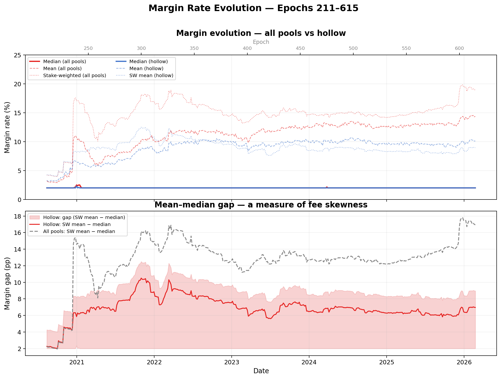
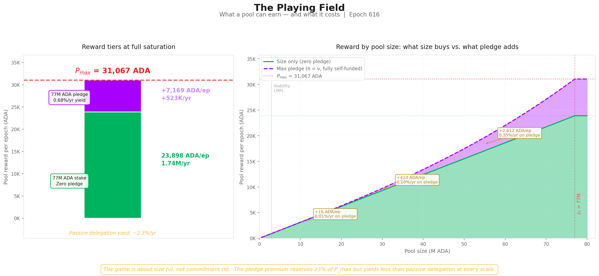
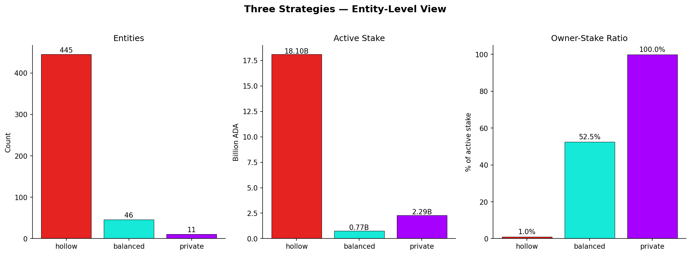
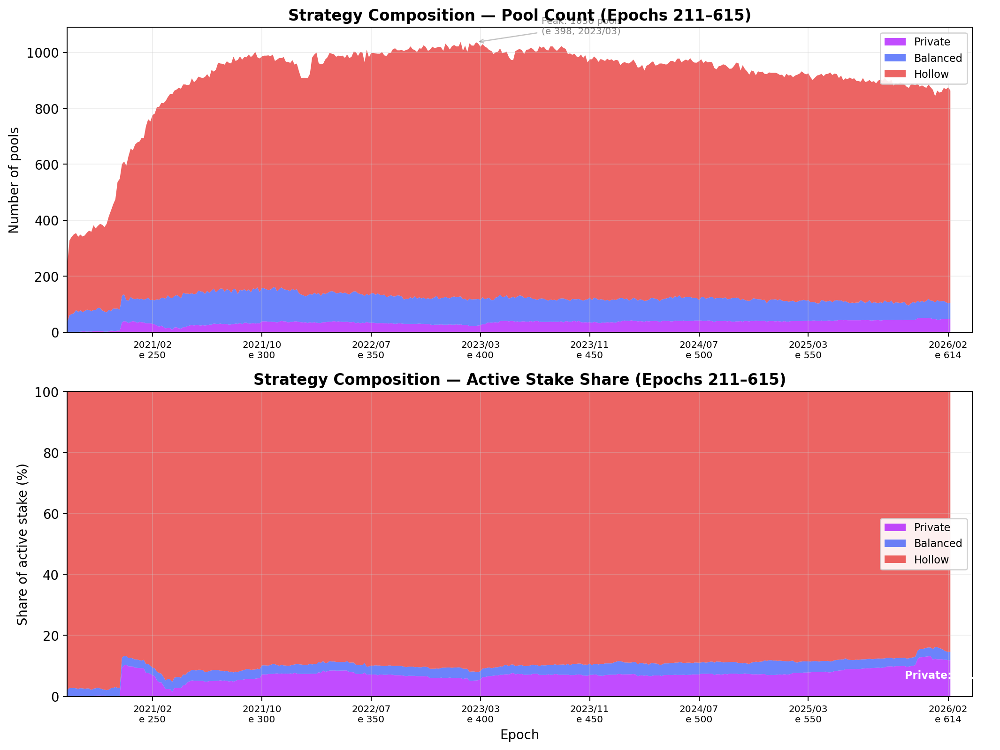
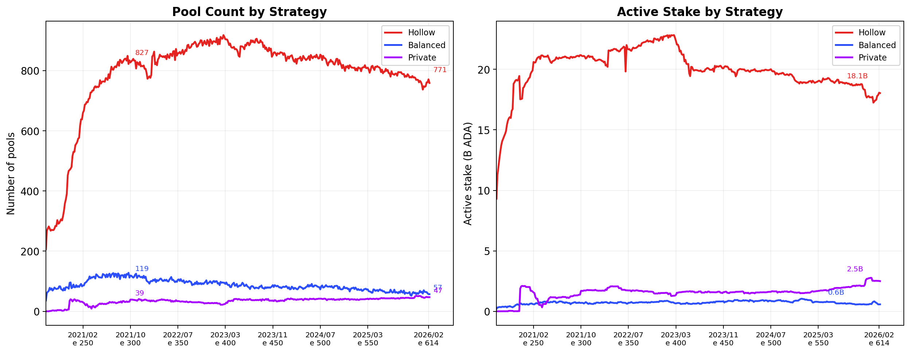

# The Diagnostic — Mainnet Observatory: Synthesis of Observations Across the Reward Pipeline

The *Shelley-era Delegation and Incentives Design Specification* (SL-D1) defined the economic rules that were to guide Cardano toward a stable, decentralised equilibrium of $k$ well-funded stake pools. Five years of mainnet operation have exposed **structural divergences** between that design and the on-chain reality.

This document is the **mainnet observatory**: it follows the reward through every stage of the pipeline, confronts each design intent with the cleaned mainnet evidence, and inducts the structural problems that emerge. Where a stage exhibits a failure for which no *Cardano Problem Statement* (CPS) currently exists in the CIP governance process, this analysis produces the missing CPS so the V2 specification can be scoped against a well-defined problem statement. The diagnostic feeds [**The Cardano Reward System V2 — Specification for a Sustainable Successor**](../README.md).

**The pipeline is read as a single dependency chain.** The epoch budget sets the ceiling, the reward curve allocates within it, and the fee structure determines how much of each allocation actually reaches operators and delegators. These stages are not independent layers — a failure at any stage propagates downstream, and a fix at one stage can be undone by a distortion at another. The pipeline runs on populations ([§2](#2-the-player-populations)) and against an exchange-rate boundary ([§3](#3-the-price-constraint)) that closes the system. The companion [*The Intended Game*](../the-intended-game/README.md) supplies the normative baseline — what the mechanism was supposed to produce — against which each divergence is measured.

**The reward formula is at war with its own security model.** SL-D1's reward function reaches its global maximum at a *private* pool — fully self-pledged by a single wealthy operator, with no delegator participation. The security model SL-D1 references requires the *opposite*: a *balanced* configuration where operator commitment and delegator power coexist, so that accountability, delegation as counter-power, Sybil resistance, and decentralisation hold simultaneously. The formula's gradient and the security model's requirement run in opposite directions.

**Mainnet's resolution: neither private nor balanced — *hollow*.** Five years have produced a settled landscape where the pledge mechanism is economically inoperative — stake-weighted median pool pledge ratio **0.07%**, best-case pledge-bonus yield **0.68%/yr** below the **~2.3%/yr** passive-delegation alternative — and **445 of 502 above-threshold entities** (controlling **85.6%** of active stake) operate at zero or near-zero pledge. The reward pipeline runs at **~44% distribution efficiency**: **54%** of the pools pot returns to reserve every epoch, dominated by a participation gap (**31.6%**) and a pledge-bonus budget that goes **95.6% unclaimed** (**22.1%** of the pot). The wasted bonus is the *single largest addressable inefficiency in the system* — and unlike the participation gap, it is entirely within reach of formula reform.

**The independent operator base has collapsed; entities have filled the gap.** From a peak of **555 productive pools / 39.1%** of stake at epoch 300 to **291 pools / 24.4%** at epoch 623 — a **48%** loss in the segment the mechanism was supposed to grow. The replacement pools that keep the productive total at ~950 are entity-operated: multi-pool fleets grew from **23 to 85 entities** controlling **464 productive pools (75.5% of stake)**, of which ten centralised exchanges and institutional validators alone hold **34.3%** at architecturally zero pledge. *The designed progression path from new entrant to established operator has no observable expression in the mainnet data.*

**The mechanism is on a structural clock.** The reserve has crossed its half-life (**13.29B → 6.53B ADA** in 5.5 years) and trends toward exhaustion around **epoch 1000–1200 (~2028–2029)**. Fees the design assumes will replace monetary expansion contribute **~0.19%** of the current epoch pot; closing the gap requires **12–16×** current capacity. The fee-generating population is contracting and consolidating: the submitter base has fallen by an order of magnitude since its peak, the top 500 addresses now pay the majority of fees, and roughly **30%** of fee revenue comes from enterprise and script addresses that structurally cannot delegate — *the mechanism taxes a constituency it excludes from rewards*. Meanwhile delegator yield has fallen from **5.3% → 2.0%** with $R^2 = 0.99$ against the reserve curve, compressing past the threshold where delegators can differentiate pools.

**Most non-participation is unreachable by incentive design.** **14.36B ADA (39.8%)** of circulating supply sits outside delegation. Only **134.6M (0.37%)** belongs to accounts with a registered stake credential that have simply not delegated — the *addressable* pool that incentive changes can, in principle, reach. The remaining **14.2B** sits in addresses with no stake credential at all (enterprise custody, DeFi-locked Plutus contracts, Byron-era legacy, unregistered base addresses). Moving the structural fraction requires protocol-level changes — enabling enterprise-address staking, mandating staking-capable script addresses in DeFi standards — not parameter tuning.

The remainder of the document follows the pipeline stage by stage: [the reward flow](#1-the-reward-flow) decomposes the SL-D1 pipeline into its three stages with a shared arc at each — *design intent → mainnet confrontation → problem induction → CPS check*; [the player populations](#2-the-player-populations) ground the pipeline failures in the structural dynamics of operators, delegators, non-participants, and transaction submitters; [the ADA price constraint](#3-the-price-constraint) sets the boundary conditions within which any solution must operate. Each pipeline stage is backed by a [dedicated sub-report](#sub-reports) listed at the bottom of this document.

# Table of Contents

- [1. The Reward Flow](#1-the-reward-flow)
  - [1.1. Treasury & Pool Pots Distribution](#11-treasury-pool-pots-distribution)
    - [1.1.1. Flow Overview](#111-flow-overview)
    - [1.1.2. Mainnet Observations](#112-mainnet-observations)
    - [1.1.3. Problem Induction → Funding the Protocol Without a Reserve](#113-problem-induction-funding-the-protocol-without-a-reserve)
  - [1.2. Pools Distribution](#12-pools-distribution)
    - [1.2.1. Flow Overview](#121-flow-overview)
    - [1.2.2. Mainnet Observations](#122-mainnet-observations)
    - [1.2.3. Problem Induction → Closing the Consensus Incentive Gap](#123-problem-induction-closing-the-consensus-incentive-gap)
    - [1.2.4. Divergence with intended equilibrium](#124-divergence-with-intended-equilibrium)
      - [1.2.4.1. Entry — below 1M ₳, too committed to just delegate, too small to operate](#1241-entry-below-1m-too-committed-to-just-delegate-too-small-to-operate)
        - [1.2.4.1.1. The structural floor](#12411-the-structural-floor)
        - [1.2.4.1.2. A gate with no sign](#12412-a-gate-with-no-sign)
        - [1.2.4.1.3. Capital over competence](#12413-capital-over-competence)
        - [1.2.4.1.4. The sub-threshold problem — what Rocket Pool tells us](#12414-the-sub-threshold-problem-what-rocket-pool-tells-us)
        - [1.2.4.1.5. Analytical scope — pools above the production threshold](#12415-analytical-scope-pools-above-the-production-threshold)
      - [1.2.4.2. Progression — balanced as intended, but private by design](#1242-progression-balanced-as-intended-but-private-by-design)
        - [1.2.4.2.1. The three strategies](#12421-the-three-strategies)
          - [1.2.4.2.1.1. The common endgame — saturate, then become an MPO](#124211-the-common-endgame-saturate-then-become-an-mpo)
          - [1.2.4.2.1.2. The degree of freedom](#124212-the-degree-of-freedom)
          - [1.2.4.2.1.3. Strategy stability over time](#124213-strategy-stability-over-time)
          - [1.2.4.2.1.4. The balanced strategy](#124214-the-balanced-strategy)
          - [1.2.4.2.1.5. The private strategy](#124215-the-private-strategy)
          - [1.2.4.2.1.6. The hollow strategy](#124216-the-hollow-strategy)
        - [1.2.4.2.2. Why balanced should be the intended equilibrium](#12422-why-balanced-should-be-the-intended-equilibrium)
        - [1.2.4.2.3. The current design incentivises the private strategy](#12423-the-current-design-incentivises-the-private-strategy)
      - [1.2.4.3. Endgame — the hollow strategy is the dominant one](#1243-endgame-the-hollow-strategy-is-the-dominant-one)
        - [1.2.4.3.1. What mainnet reveals](#12431-what-mainnet-reveals)
          - [1.2.4.3.1.1. Three operator strategies, one dominant](#124311-three-operator-strategies-one-dominant)
          - [1.2.4.3.1.2. Strategies are entity-level commitments, not pool-level accidents](#124312-strategies-are-entity-level-commitments-not-pool-level-accidents)
          - [1.2.4.3.1.3. The hollow strategy dominates at every level of aggregation](#124313-the-hollow-strategy-dominates-at-every-level-of-aggregation)
          - [1.2.4.3.1.4. The pledge bonus is a dead letter](#124314-the-pledge-bonus-is-a-dead-letter)
        - [1.2.4.3.2. Delegating is inherently less constraining than pledging](#12432-delegating-is-inherently-less-constraining-than-pledging)
        - [1.2.4.3.3. The reward structure weights size, not commitment](#12433-the-reward-structure-weights-size-not-commitment)
        - [1.2.4.3.4. The pledge bonus is inoperative at realistic scale](#12434-the-pledge-bonus-is-inoperative-at-realistic-scale)
        - [1.2.4.3.5. The size-visibility-delegation loop](#12435-the-size-visibility-delegation-loop)
        - [1.2.4.3.6. The inversion](#12436-the-inversion)
      - [1.2.4.4. Conclusion](#1244-conclusion)
        - [1.2.4.4.1. Enforce the production threshold — build a Rocket Pool for Cardano](#12441-enforce-the-production-threshold-build-a-rocket-pool-for-cardano)
        - [1.2.4.4.2. The reward curve must target the balanced strategy](#12442-the-reward-curve-must-target-the-balanced-strategy)
        - [1.2.4.4.3. Multi-pool operators and the need for anti-monopoly countermeasures](#12443-multi-pool-operators-and-the-need-for-anti-monopoly-countermeasures)
        - [1.2.4.4.4. The downstream dependency](#12444-the-downstream-dependency)
  - [1.3. Operator / Delegator Distribution](#13-operator-delegator-distribution)
    - [1.3.1. Flow Overview](#131-flow-overview)
    - [1.3.2. Mainnet Observations](#132-mainnet-observations)
    - [1.3.3. Problem Induction](#133-problem-induction)
      - [1.3.3.1. Guarantee operator viability across the productive population](#1331-guarantee-operator-viability-across-the-productive-population)
      - [1.3.3.2. Restore a competitive delegator yield](#1332-restore-a-competitive-delegator-yield)
- [2. The Player Populations](#2-the-player-populations)
  - [2.1. The Staking Populations](#21-the-staking-populations)
    - [2.1.1. Overview](#211-overview)
    - [2.1.2. Mainnet Observations](#212-mainnet-observations)
    - [2.1.3. Problem Induction](#213-problem-induction)
      - [2.1.3.1. The operator population is highly concentrated and stable](#2131-the-operator-population-is-highly-concentrated-and-stable)
      - [2.1.3.2. The stake-holder population is a frozen power law](#2132-the-stake-holder-population-is-a-frozen-power-law)
      - [2.1.3.3. The non-participant population](#2133-the-non-participant-population)
  - [2.2. Transaction Submitters](#22-transaction-submitters)
    - [2.2.1. Overview](#221-overview)
    - [2.2.2. Mainnet Observations](#222-mainnet-observations)
    - [2.2.3. Problem Induction](#223-problem-induction)
      - [2.2.3.1. The fee input is structurally insufficient](#2231-the-fee-input-is-structurally-insufficient)
      - [2.2.3.2. The fee-generating population must expand for the pipeline to survive](#2232-the-fee-generating-population-must-expand-for-the-pipeline-to-survive)
- [3. The ₳ Price Constraint](#3-the-price-constraint)
  - [3.1. Overview](#31-overview)
  - [3.2. The structural requirement](#32-the-structural-requirement)
  - [3.3. Problem Induction](#33-problem-induction)
    - [3.3.1. The mechanism assumes deflation but cannot produce it](#331-the-mechanism-assumes-deflation-but-cannot-produce-it)
    - [3.3.2. The three constraints pull in different directions](#332-the-three-constraints-pull-in-different-directions)
- [Sub-reports](#sub-reports)

# 1. The Reward Flow

The SL-D1 reward pipeline transforms a finite reserve into per-participant rewards through **three sequential stages**:

- **Epoch-budget assembly** ([§1.1](#11-treasury-pool-pots-distribution));
- **Pool-level distribution** ([§1.2](#12-pools-distribution));
- **Operator/delegator split** ([§1.3](#13-operator-delegator-distribution)).

**Each stage embeds design choices that constrain the next.** The analysis follows a common arc at every stage — design intent, mainnet confrontation, problem induction — so that the structural failures compound visibly across the full pipeline rather than appearing as isolated parameter issues.

The three stages are **not independent layers** that can be tuned in isolation. The epoch budget ([§1.1](#11-treasury-pool-pots-distribution)) **sets the ceiling**; the reward curve ([§1.2](#12-pools-distribution)) **allocates within it**; the fee structure ([§1.3](#13-operator-delegator-distribution)) **determines how much of each allocation reaches operators and delegators**.

A failure at any stage propagates downstream, and a fix at one stage can be undone by a distortion at another.

*The pipeline must be read — and ultimately redesigned — as a single system.*

## 1.1. Treasury & Pool Pots Distribution

### 1.1.1. Flow Overview

Before any individual pool receives rewards, the protocol must first answer one question:
**how much ADA is available for distribution this epoch?**

This stage assembles the **epoch pot** from three on-chain sources:

- transaction fees;
- non-refundable deposits;
- a monetary expansion draw from the reserve.

It then splits the pot in two: a fixed share goes to the **treasury**, and the remainder becomes the **pools pot** — the total budget that the next stage ([§1.2](#12-pools-distribution)) will distribute across individual pools.

Two design choices embedded at this stage matter for the rest of the analysis:

- **Cooperative-behavior gate.** The monetary expansion draw is scaled by the ratio of blocks actually produced to blocks expected. If pools collectively miss slots, the entire epoch pot shrinks. This discourages sabotage but also means the pot depends on aggregate network health.

- **Fixed split rule.** The treasury/pools ratio is a protocol constant ($\tau$), not a function of network activity or reserve level. It does not adapt as the balance between fees and expansion shifts over time.

> **Formulas.** The epoch-pot assembly and treasury/pools split formulas — from the original SL-D1 notation through a reader-friendly rewrite to mainnet parameterization — are in the dedicated sub-report: [`Treasury & Pool Pots Distribution`](sub-flows/treasury-and-pool-pots-distribution/mainnet-analysis/README.md) — [§1.2.1](#121-flow-overview).

### 1.1.2. Mainnet Observations

The epoch-level analysis (epochs 208–623) yields four observations at this pipeline stage. The full data, visuals, and methodology are in the dedicated sub-report: [`Treasury & Pool Pots Distribution`](sub-flows/treasury-and-pool-pots-distribution/mainnet-analysis/README.md).

| # | Observation | Summary |
| --- | --- | --- |
| **TRE.O1** | **The epoch pot is a single-source budget** | Monetary expansion provides ~99.8% of the pot. Fees cover ~0.19%; self-sufficiency would require 12–16× current capacity. Block production is reliable (η ≈ 0.977). |
| **TRE.O2** | **The reserve has crossed its half-life** | Reserve is half-depleted (13.29B → 6.53B ADA) in 5.5 years. Significant reward pressure expected at epochs 1000–1200 (~2028–2029). |
| **TRE.O3** | **The reward mechanism operates at ~44% of its potential** | Only ~6.8M of ~15.5M ADA pools pot reaches operators/delegators — the rest returns to reserve. 4.55B ADA cumulative (~70% of current reserve) exists because of this. Root cause: ~17B ADA (~44%) does not participate in delegation. |
| **TRE.O4** | **Reward parameters have never been adjusted** | $\rho = 0.3\%$ and $\tau = 20\%$ are unchanged since Shelley. Neither has been subject to a governance proposal. |

> **Scope note.** Observations TRE.O1–TRE.O4 are structural to the epoch-budget layer. No existing CIP targets this stage — they all operate downstream ([§1.2](#12-pools-distribution), [§1.3](#13-operator-delegator-distribution)). These observations document the sustainability context within which all downstream proposals operate.

### 1.1.3. Problem Induction → Funding the Protocol Without a Reserve

Each observation above constrains what the system can do. Read together, they reveal what it *cannot* do.

The epoch pot is **funded almost entirely by monetary expansion** from the reserve (TRE.O1). That reserve is **finite and has already crossed its half-life** (TRE.O2).

Transaction fees — the only sustainable alternative — cover **~0.19% of the pot today**, and even at full realistic throughput would reach only **~1.3%** (TRE.O1). Closing this gap requires **12–16× today's capacity**, implying both a throughput upgrade (Leios) and a structural increase in transaction demand — **neither of which is on a defined timeline**.

Meanwhile, the two parameters governing the draw ($\rho$, $\tau$) have **never been reviewed since Shelley launch** (TRE.O4), and no governance process exists to do so.

These constraints compose into a single structural problem: **the reward system has no viable path from reserve-funded to fee-funded sustainability.**

The reserve is depleting on a known schedule, the only alternative revenue source is orders of magnitude too small, and the parameters governing the transition have never been subject to governance.

*This is not a failure of any individual parameter — it is a design gap at the epoch-budget layer.* No protocol-level or governance-level instrument currently exists to manage this transition.

TRE.O3 — the **~44% distribution efficiency** — is **not a problem *at this layer***. It is a consequence of participation levels, which are shaped by incentives defined downstream ([§1.2](#12-pools-distribution), [§1.3](#13-operator-delegator-distribution)).

But it interacts directly with the sustainability problem: **activating inactive ADA would improve distribution efficiency while accelerating reserve consumption**. Any solution to the epoch-budget problem must account for this tension — and any change to the downstream incentive structure ([§1.2](#12-pools-distribution), [§1.3](#13-operator-delegator-distribution)) that affects participation will feed back into reserve dynamics here.

**CPS identified.** No *Cardano Problem Statement* (CPS) has been formally written for this problem. The CIP governance process requires that solutions (CIPs) be scoped against a well-defined problem statement (CPS). This foundational sustainability problem has **remained formally unstated**.

This analysis identifies the gap and produces the missing CPS — *Funding the Protocol Without a Reserve* — derived from the mainnet evidence in the dedicated [sub-report](sub-flows/treasury-and-pool-pots-distribution/mainnet-analysis/README.md) and defined in [`../sub-flows/treasury-and-pool-pots-distribution/cps/`](sub-flows/treasury-and-pool-pots-distribution/cps/).

The epoch budget sets the ceiling for everything that follows. But how that budget reaches individual participants — and whether the distribution mechanism itself works as intended — is a separate question. That is the subject of [§1.2](#12-pools-distribution).

## 1.2. Pools Distribution

### 1.2.1. Flow Overview

This stage takes the **pools pot** ($PoolsPot^{\text{epoch}}$) produced by [§1.1](#11-treasury-pool-pots-distribution) and distributes it across individual pools.

The output is a per-pool allocation ($PoolPot^{\text{actual}}_i$) that feeds into [§1.3](#13-operator-delegator-distribution) (operator/delegator split).

For each pool $i$, the protocol performs three steps:

1. **Saturation clipping.** Both total stake ($\sigma_i$) and pledge ($s_i$) are capped at the saturation threshold $z_0 = 1/k$. This prevents any single pool from capturing a disproportionate share.

2. **Reward curve evaluation.** A reward function $f$ computes the pool's *optimal* allocation from its clipped stake and pledge. The curve has two components: a **base stake term** (proportional to delegation) and a **pledge-bonus term** (nonlinear, governed by $a_0$). The pledge bonus is meant to reward operator commitment ("skin in the game").

3. **Performance adjustment.** The optimal allocation is scaled by apparent performance $\bar{p}_i$ to produce the *actual* allocation. Pools that miss blocks receive less. If the registered pledge is not met, the allocation is zeroed entirely.

Any rewards not distributed (because $\sum_i \hat{f}_i < R$) **return to the reserve** — this is the mechanism behind TRE.O3 in [§1.1](#11-treasury-pool-pots-distribution).

Two design choices matter for the rest of the analysis:

- **Pledge sensitivity via $a_0$.** The parameter $a_0$ controls how much additional reward a pool can earn through pledge. At $a_0 = 0.3$, the pledge bonus represents at most ~23% of the optimal allocation. Whether this is sufficient to meaningfully incentivise pledge is a central question at this layer.

- **Uniform saturation threshold.** All pools share the same cap $z_0 = 1/k$. There is no mechanism to differentiate saturation based on pledge level or pool characteristics.

> **Formulas.** The pool-level reward formulas — from the original SL-D1 reward curve through the normalized saturation coordinates rewrite to mainnet parameterization — are in the dedicated sub-report: [`The Pools Pot Distribution Gaps`](sub-flows/pools-distribution/mainnet-analysis/README.md) — [§1.2.3](#123-problem-induction-closing-the-consensus-incentive-gap).

### 1.2.2. Mainnet Observations

The pool-level analysis (epochs 208–618, with the latest complete reward epoch at 616) yields six observations at this pipeline stage. The full data, figures, entity analysis, and reproduction scripts are in the dedicated sub-report: [*The Pools Pot Distribution Gaps*](sub-flows/pools-distribution/mainnet-analysis/README.md).

| # | Observation | Summary |
| --- | --- | --- |
| **POL.O1** | **Two causes account for 54% of the pools pot returning to reserve** | Only 6.79M of 15.53M ADA/epoch reaches operators and delegators — 44% distribution efficiency. The participation gap (unstaked ADA) returns 4.91M ADA/epoch (31.6%), and the unused pledge-incentive budget returns 3.43M ADA/epoch (22.1%, 95.6% of the bonus budget wasted). These two causes together (53.7%) dwarf all others: pledge-not-met confiscation (2.1%), performance (0.5%), oversaturation (0.3%) are secondary. |
| **POL.O2** | **The pledge mechanism is economically broken** | 78% of staked ADA sits in pools with pledge ratio < 1%; stake-weighted median ratio is 0.07%. Yield on pledge capital is 0.68%/yr at best (full saturation) — below passive delegation yield of 2.3%/yr. 3.4M ADA/epoch (22% of pot) is reserved for the pledge bonus but returns to reserve unused. |
| **POL.O3** | **The pool landscape is stratified into four tiers** | Regular block production requires ~3M ADA stake — the emergent viability boundary. Below 1.1M ADA, the fixed cost exceeds pool reward — operators are in economic loss (1,987 below-viability pools). Only 8 pools reach the saturation threshold ($z_0$ = 77M ADA); the cap designed for 500 pools is nearly inactive. Active stake fills only 56.5% of theoretical capacity — at most 282 pools could saturate. Tier boundaries are dynamic and shift with active stake, fixed costs, and $k$. |
| **POL.O4** | **Multi-pool operators control 75% of staked supply** | 85 MPO entities operate 901 pools holding 16.4B ADA (75.4% of participating stake). 48 capital-sufficient MPOs could play the pledge game; 37 cannot. Of the 48, 41 are non-compliant — forfeiting ~550K ADA/epoch in pledge bonus. CEX + IVaaS alone hold 7.4B ADA (19.2% of supply) at structurally zero pledge. 3 exemplary MPOs capture 82% of bonus ADA among pledging entities — the mechanism's output rests on 2 private entities. |
| **POL.O5** | **The independent operator base is far smaller and weaker than it appears** | The 741 healthy pools collapse to 283 independent viable operators once MPO fleet members are removed — the competitive field is 3× smaller than the headline. 78% of independent single-pool stake is non-compliant. 561 marginal single-pool operators partially pledge — the narrow policy-sensitive population. The independent base is in slow structural decline: its share of active stake has fallen from 28.0% to 25.0% since epoch 583. |
| **POL.O6** | **The incentive-responsive field is a fraction of the network** | 78 of 85 MPO entities (13.74B ADA, 63% of active stake) are outside the pledge-response path — multi-game optimisation, not calibration failure. CEX cannot pledge custodied funds; IVaaS cannot pledge client assets; community fleets choose not to — three distinct mechanisms. The filtered proxy (single-pool operators + retained MPOs) holds 7.89B ADA — only 36% of active stake responds to the pledge signal. |

> **Scope note.** POL.O1–POL.O3 are structural to the pool-distribution layer. POL.O4–POL.O6 characterise the entity landscape and the incentive-responsive arena. The participation gap (POL.O1) and capital constraint (POL.O4) are the same upstream conditions documented at [§1.1](#11-treasury-pool-pots-distribution) — they set the playing field within which the reward curve operates.

### 1.2.3. Problem Induction → Closing the Consensus Incentive Gap

Each observation above constrains what the reward curve can accomplish. Read together, they reveal a **gap between the equilibrium the mechanism was designed to produce and the equilibrium it actually produces**.

- **Return to reserve.** Two causes account for **54% of the pools pot returning to reserve** (POL.O1): the participation gap (**31.6%**) and the unused pledge-incentive budget (**22.1%**, **95.6% wasted**).
- **Broken pledge economics.** The pledge mechanism is economically broken (POL.O2): yield on pledge capital is **0.68%/yr at best** — below passive delegation — and **78% of staked ADA** sits in pools with pledge ratio < 1%.
- **Stratified pool landscape.** The pool landscape is stratified into four tiers far from the $k = 500$ target (POL.O3): **73% of pools sit below viability**, and **only 8 reach saturation**.
- **MPO concentration.** Multi-pool operators control **75% of staked supply** (POL.O4): **85 MPO entities** hold **16.4B ADA**, and **41 of 48 capital-sufficient MPOs are non-compliant**.
- **Collapsed independent base.** The independent operator base has collapsed to **283 viable operators** once MPO fleets are removed (POL.O5).
- **Narrow response arena.** The incentive-responsive field — the arena that actually reacts to the pledge signal — holds **only 36% of active stake** (POL.O6).

The pool reward curve is **not merely a reward-distribution mechanism**. It is the protocol's **only tool for shaping the operator ecosystem that secures consensus**.

Its purpose is to produce an *incentive-compatible equilibrium*: a state where rational, self-interested participants — operators competing on pledge commitment, delegators rewarding the most committed operators — collectively maintain the security invariants the consensus layer depends on (**decentralisation, Sybil resistance, accountability**).

The formal game-theoretic properties of this mechanism were established in *Reward Sharing Schemes for Stake Pools* (Brünjes, Kiayias et al., 2020), which proves that $k$ pools is a **Nash equilibrium** under certain assumptions. The engineering specification *SL-D1* translates those results into protocol-level formulas.

However, **neither document provides a narrative description of the game as it should play out** — the players, their motivations, how they enter and progress, and the equilibrium they should converge toward. Evaluating whether the mechanism works requires a clear picture of what working looks like. That narrative description is produced in a dedicated companion document: [*The Intended Game*](../the-intended-game/README.md).

The observations above, confronted with this intended design, reveal **two interrelated failures**.

**The playing field is half the size the design assumed.** $k = 500$ implicitly required near-complete participation. At **56.5%**, the target is **structurally unreachable** — at most **282 pools** could saturate (POL.O3). The saturation cap binds for **only 8 pools** (POL.O3).

No formula change at this layer can close this gap; it requires upstream intervention to bring inactive ADA into delegation.

**The incentive game does not converge toward the intended equilibrium.** The reward curve's theoretical optimum ($\pi = 1, \nu = 1$) is a **fully-pledged private pool with no delegator** — eliminating the accountability mechanism at the endgame.

Reaching it requires **77M ADA** at a yield of **~0.68%/yr**, below passive delegation (**~2.3%/yr**) — making the endgame **economically irrational** (POL.O2). The progression is invisible: the pledge bonus adds **~0.006%** at median pledge, **undetectable by delegators** (POL.O2). The entry creates a **viability cliff, not a ramp** (POL.O3).

The dominant strategy at every level — entry, progression, endgame — is to **maximise delegation and minimise pledge**, the exact opposite of what consensus security requires. The full analysis of these distortions from the operator's perspective is in [§1.2.4](#124-divergence-with-intended-equilibrium) below.

The evidence confirms this at scale: **95.6% of the pledge-bonus budget returns to reserve unused** (POL.O1), the independent operator base has collapsed to **283 viable operators** (POL.O5), the incentive-responsive field holds **only 36%** of active stake (POL.O6), and structural populations totalling **7.4B ADA cannot pledge by architectural constraint** (POL.O4).

**CPS identified.** No *Cardano Problem Statement* (CPS) has been formally written for this problem. CIP-0050 and CIP-0037 both propose modifications to the reward curve at this layer — but **they were designed without a shared, formal problem definition to scope them against**.

This analysis identifies the gap and produces the missing CPS — *Closing the Consensus Incentive Gap* — derived from the mainnet evidence in the dedicated [sub-report](sub-flows/pools-distribution/mainnet-analysis/README.md) and defined in [`../sub-flows/pools-distribution/cps/`](sub-flows/pools-distribution/cps/).

The evaluation of proposed solutions (CIP-0050, CIP-0037, and the downstream CIPs that interact with them) is deferred to a future synthesis section, after the operator/delegator distribution analysis in [§1.3](#13-operator-delegator-distribution) and the population analysis in §2 complete the picture.

### 1.2.4. Divergence with intended equilibrium

The observations above document *what* the reward curve produces. This section examines *why* — by following an operator through the trajectory the mechanism promises (**entry → progression → endgame**) and identifying the point at which the reward curve stops rewarding the intended strategy.

The baseline for this analysis is [*The Intended Game*](../the-intended-game/README.md), which describes the game as it should play out.

#### 1.2.4.1. Entry — below 1M ₳, too committed to just delegate, too small to operate

An operator registers a pool, pledges what they can — say **50K ADA** — and starts looking for delegators.

The promise ([*The Intended Game* §1.3.2](../the-intended-game/README.md#32-operators-from-first-pledge-to-full-commitment)) is clear: **pledge commitment is the competitive dimension**, and increasing it should produce visible, measurable advantages that attract delegation. The game should feel like a ramp — each step forward in commitment unlocking the next level of reward and reputation.

*The first step is high.*

##### 1.2.4.1.1. The structural floor

Block production is a **Poisson process**, and below **~1M ₳** in total stake a pool expects less than one block per epoch. **Reward variance equals its own mean** — yield is noise, not signal.

This is the *production threshold* (F3.1): a **hard structural floor** set by the physics of the consensus protocol, not by a tuneable parameter.

Above that sits the *viability threshold* (**~3M ₳**, F3.2): below it, the **340 ₳ fixed cost per epoch exceeds the pool's expected reward**. This second boundary is softer — it depends on the reward curve's parameters and narrows over time as node implementations improve and hardware costs decline.

*But the production threshold is irreducible.*

##### 1.2.4.1.2. A gate with no sign

Crucially, the mechanism **does not communicate this floor**. Nothing in the protocol tells a prospective operator "do not register a pool below 1M ₳ — it will not produce blocks." **Registration is open at any amount.**

*The game lets participants in, takes their operational costs, and gives nothing in return.*

The result is visible on mainnet: **73% of pools sit below the viability threshold**.

These pools have **no reason to exist** — not from a consensus perspective (they contribute negligibly to block production), not from an investment perspective (they destroy value for their delegators), not from any perspective.

And the damage extends beyond the pools themselves. **They pollute the landscape for every other participant.**

- **Delegators** browsing a pool explorer must navigate hundreds of sub-viable pools that look superficially legitimate but cannot deliver reliable yield.
- **Wallet developers** building staking features must decide how to present a pool set where the majority are economically inert.
- **Viable operators** must compete for visibility in a catalogue diluted by pools that the mechanism should never have admitted.

The **signal-to-noise ratio** of the entire pool marketplace degrades — making delegation decisions harder, accountability less effective, and the competitive environment less legible for everyone.

They are **artifacts of a mechanism that defines a structural floor but does not signal it**. The protocol silently accepts participants it cannot serve — and in doing so, degrades the experience for those it can.

##### 1.2.4.1.3. Capital over competence

Below the structural floor, the rational move is to **delegate — not operate**. An operator can still accumulate the deflationary asset, but as a **passive participant**.

Delegation earns yield, but it does not earn the *leverage* that comes with consensus participation. The skin in the game is **capital**; it is not *commitment* to the network.

A prospective operator may have exceptional technical knowledge — capable of running a reliable, performant node — but **the mechanism does not value knowledge**. It values **capital at scale**.

An operator with deep expertise and **100K ₳ is invisible** to the reward curve. A capital holder with no expertise and **5M ₳ can hire the expertise**.

*The game's entry filter selects for capital, not for the operational competence the protocol actually needs.*

##### 1.2.4.1.4. The sub-threshold problem — what Rocket Pool tells us

The preceding sections establish a **structural contradiction**: the protocol allows anyone to register a pool, but the physics of block production imposes a floor (**~1M ₳**) below which operation is noise, and the economics of the fee structure impose a higher floor (**~3M ₳**) below which operation destroys value.

Between registration and viability lies a corridor that the mechanism does not bridge — *an open door that leads to an empty room*.

This is **not unique to Cardano**. Ethereum's consensus layer requires exactly **32 ETH** (~€55K at current prices) to activate a validator — an **explicit production threshold** enforced at the protocol level. The design acknowledges that consensus participation has a minimum scale, and makes that minimum **legible** rather than leaving participants to discover it through economic loss.

Cardano's production threshold is **implicit** — emergent from Poisson statistics, not declared as a parameter. The result is a marketplace where **116 sub-threshold pools** (**11.7%** of rewarded pools) carry **0.31% of stake** and serve no consensus function. They dilute the pool marketplace, mislead delegators, and impose a cost (in operator time, in delegator lost yield) that the protocol could avoid by making the threshold explicit.

The more interesting question is **what lies on the other side of enforcement**.

Ethereum's explicit threshold created demand for **pooling services** that allow sub-threshold participants to contribute capital toward consensus participation without operating a validator themselves. Rocket Pool — the **largest decentralised liquid staking protocol on Ethereum** (**~4,000 independent node operators**, **~800K ETH staked**) — fills exactly this gap.

A participant bonds as little as **4 ETH** alongside pooled capital from passive stakers, and the protocol assembles a full 32 ETH validator. The operator runs the infrastructure; the stakers provide the capital; a smart contract enforces the split. **Permissionless entry**, **transparent commission**, and a collateral bond (RPL tokens, **10–150%** of operator ETH) as skin-in-the-game.

The parallel to Cardano is **instructive but not direct**. Rocket Pool exists because Ethereum *requires* 32 ETH — the structural need for pooling is baked into the protocol. Cardano has no minimum stake to register a pool, so the need is different: it is **not access to consensus** that is blocked, but ***economic viability***.

A Cardano equivalent would not pool capital to meet a protocol-level gate; it would **pool commitment to cross the emergent viability threshold** — combining the operational competence of a technically capable participant with the capital of delegators who want to support the network at a level above passive delegation.

The design space this opens is explored in [§1.2.4.4.1](#12441-enforce-the-production-threshold-build-a-rocket-pool-for-cardano).

##### 1.2.4.1.5. Analytical scope — pools above the production threshold

The preceding sub-sections establish that pools below the production threshold (**~1M ₳**) are **structural artefacts**: they cannot produce blocks reliably, they destroy value for their delegators, and they dilute the legibility of the pool marketplace for every other participant.

Including them in the downstream analysis — strategy classification ([§1.2.4.2](#1242-progression-balanced-as-intended-but-private-by-design)), mainnet landscape ([§1.2.4.3](#1243-endgame-the-hollow-strategy-is-the-dominant-one)), intra-pool split ([§1.3](#13-operator-delegator-distribution)) — would contaminate every aggregate with noise from a population that the mechanism cannot serve and that has no bearing on the incentive dynamics the analysis evaluates.

At epoch 614, the production threshold partitions the rewarded pool set as follows:

| | Below 1M ₳ | Above 1M ₳ | Total rewarded |
| --- | --- | --- | --- |
| Pools | 116 (11.7%) | 875 (88.3%) | 991 |
| Active stake | 0.07B ADA (0.31%) | 21.16B ADA (99.69%) | 21.23B ADA |
| Epoch rewards | 0.05M ADA (0.67%) | 6.75M ADA (99.33%) | 6.80M ADA |

The **116 sub-threshold pools** carry **0.31% of active stake** and **0.67% of distributed rewards**. They add noise to entity counts (107 of 609 entities operate exclusively below threshold) but contribute nothing to the structural picture. Their inclusion would inflate the entity count and compress the strategy distributions without changing any finding.

All analysis from [§1.2.4.2](#1242-progression-balanced-as-intended-but-private-by-design) onward restricts the pool set to **rewarded pools above the production threshold** (active stake ≥ 1M ₳). The companion sub-reports — [*The Pools Pot Distribution Gaps*](sub-flows/pools-distribution/mainnet-analysis/README.md), [*The Operator's Cut*](sub-flows/operator-delegator-distribution/mainnet-analysis/README.md) — apply the same filter.

Where the sub-threshold population is relevant ([§1.2.4.1](#1241-entry-below-1m-too-committed-to-just-delegate-too-small-to-operate)), it is analysed in its own right.

#### 1.2.4.2. Progression — balanced as intended, but private by design

An operator has crossed the production threshold. The pool produces blocks, earns rewards, and the deflationary accumulation thesis from [*The Intended Game* §1.2.2.1](../the-intended-game/README.md#221-an-open-seat-at-the-deflationary-table) is finally in play.

> The question becomes: how does the operator grow?

The mechanism's answer ([*The Intended Game* §1.3.2.2](../the-intended-game/README.md#224-the-arc-from-newcomer-to-pillar)) is *pledge*. Increasing personal commitment should produce a **measurable competitive advantage** — visible to delegators, economically meaningful to the operator — creating a legible progression from **"new pool"** to **"established pool"** to **"fully committed pool"**.

Before examining what the pledge mechanism delivers in practice, it is worth mapping the **strategic landscape** it creates.

##### 1.2.4.2.1. The three strategies

Every entity that crosses the production threshold enters a game defined by **two structural facts**:

- a **shared endgame** that all entities converge on;
- a **single degree of freedom** that separates their paths.

Together, these two facts define the full strategic landscape.

###### 1.2.4.2.1.1. The common endgame — saturate, then become an MPO

The reward formula caps individual pool rewards at $P_{\max}$: once a pool reaches the saturation point ($\sigma = z_0 \approx$ **77M ₳**), every additional ADA of stake produces ***zero* marginal reward**. Worse — it **dilutes the per-ADA yield** for every existing participant, operator and delegator alike. **The saturation cap is a hard ceiling, not a soft one.**

An entity whose capital or delegation-attracting capacity exceeds $z_0$ therefore faces a **binary choice**: stop growing, or register a second pool. Since the entity's motivation for entering the game — the deflationary accumulation thesis ([*The Intended Game* §1.2.2.1](../the-intended-game/README.md#221-an-open-seat-at-the-deflationary-table)) — is driven by continuous compounding, **stopping is irrational**.

The mechanism's natural growth path is **not deeper commitment to a single pool**; it is **fleet expansion**: becoming a **multi-pool operator (MPO)**. Saturate the current pool, register a new one, repeat.

This endgame is **strategy-independent**. Whether an entity fills pools with personal capital, with external delegation, or with a mix of both, the saturation cap forces the same MPO trajectory. The distinction between entities lies not in the destination but in **how they staff each pool along the way**.

And it is worth noting that the mechanism **says nothing about this transition** — there is no special reward for operating a single pool, no penalty for splitting across many. The formula evaluates each pool independently. *The entity-level strategy that spans multiple pools is invisible to the protocol.*

###### 1.2.4.2.1.2. The degree of freedom

Within the shared endgame, an entity retains **one strategic variable per pool**: the ratio between *owner commitment* (pledge and self-delegation) and *third-party delegation*.

This ratio defines the entity's **posture** — the answer to the question *"who funds this pool, and therefore who benefits from it?"*

The spectrum is continuous. At one extreme, the operator funds the entire pool with personal capital — **no delegator plays any role**. At the other, the operator contributes nothing but infrastructure and a registration certificate — **every ADA in the pool belongs to someone else**. Between these poles lies every possible split.

The reward formula is sensitive to this ratio through the pledge bonus ($\lambda_{\text{pledge}} \cdot A(\nu, \pi)$), which depends on the within-pool pledge ratio $\pi = s/\sigma$. In principle, the bonus should pull operators toward higher commitment. Whether it does so in practice — **with sufficient force to overcome the costs it imposes** — is the question the rest of this section examines.

**Three archetypes** capture the essential strategic postures along this spectrum. They are not discrete options — real operators occupy every point on the continuum — but they define the poles and the centre in terms that map cleanly onto the security properties the protocol depends on.

###### 1.2.4.2.1.3. Strategy stability over time

The three strategies described below are **not transient labels**. A natural question is whether entities migrate between postures over time — i.e. whether the archetypes are stable structural features or shift as delegation flows.

The figure tracks three panels across **405 epochs**:

- **Top panel** — entity counts by owner-stake strategy (restricted to pools above the 1M ADA production threshold): hollow entities have grown steadily from **~200 to ~500**, balanced has peaked around **300 and declined to ~200**, and private has remained flat at **~50**.
- **Middle panel** — the corresponding stake composition: hollow has dominated throughout, rising from **~8B to ~21B**.
- **Bottom panel** — the per-epoch strategy transition rate: the fraction of entities whose dominant owner-stake strategy changed from one epoch to the next.

**The transition rate is remarkably low.** The median per-epoch rate is **0.28%** — meaning that in a typical epoch, **fewer than 2 entities out of ~600 change strategy**. The margin-band transition rate is even lower at **0.16%** per epoch.

Over the full 405-epoch span, **446 of 1,830 entities tracked (24.4%)** changed strategy at least once. But the nature of these transitions reveals that **nearly all of them are boundary drift rather than genuine strategic pivots**: **89%** of the **1,431 total transition events** are hollow ↔ balanced oscillations (652 balanced→hollow, 621 hollow→balanced).

These occur when an entity's delegation fluctuates around the **10% owner-stake threshold** — the entity's *behaviour* does not change, only the label assigned by the classification boundary. Transitions involving the private strategy are rare: 78 private→balanced, 52 balanced→private, 28 involving hollow↔private.

Among entities active for at least 200 epochs (n=612), **37.9%** experienced at least one label change — but the overwhelming majority are threshold oscillations, not deliberate repositionings.

The margin landscape confirms this stability. The **median margin across all pools has held at 2.0%** since the early Shelley era. The rising stake-weighted mean (**4.2% → 18.9%**) is driven entirely by the growing weight of declared-private and functionally private pools in the overall stake distribution, **not by fee inflation in the competitive market**.

> The per-epoch strategy transition rate is 0.28% (median) — fewer than 2 entities per epoch. Over 405 epochs, 89% of all transitions are boundary drift between hollow and balanced, not genuine regime changes. The three strategies are durable features of the network's economic structure, not artefacts of a single snapshot. Margin competition in the hollow market has been stable at a median of 2.0% for the entire Shelley era — the apparent rise in the stake-weighted mean is a compositional effect from the growing weight of private-strategy pools.

###### 1.2.4.2.1.4. The balanced strategy

The balanced strategy maintains a **meaningful owner-stake ratio** while leaving substantial room for delegation. Both the operator and external delegators contribute to the pool's stake. The exact split — whether **20/80, 50/50, or 80/20** in favour of owner commitment — varies across entities, but the defining characteristic is that **neither party fills the pool alone**.

The economic logic is **partnership**: the operator commits personal capital and operational infrastructure; delegators provide the remaining stake that carries the pool toward saturation. The operator earns the fixed fee, the margin, *and* a share of the pool's size-based reward on their own stake, plus whatever the pledge bonus adds. Delegators earn the residual yield after the operator's cut.

Both parties have a reason to remain — and both have a **credible exit option** that the other must respect.

This is **the posture the mechanism was designed to encourage**. The operator's progression described in [*The Intended Game* §1.3.2](../the-intended-game/README.md#32-operators-from-first-pledge-to-full-commitment) — build reputation, attract delegation, deepen pledge, compound — presupposes a balanced configuration where increasing commitment produces a measurable competitive edge.

###### 1.2.4.2.1.5. The private strategy

The operator pledges and self-delegates the **majority or totality** of the pool's stake, minimising or eliminating external delegation. The pool operates as a **closed vehicle**: the operator funds it, produces blocks, and collects the full reward.

The economic logic is **self-sufficiency**: the operator needs no one else. There is no margin to set (the operator captures everything), no delegator to attract (or lose), no reputation to build in the marketplace. The pool's competitiveness is a function of **one variable — the operator's treasury size**.

The reward formula **explicitly endorses this posture**. The maximum pool reward $P_{\max}$ is defined at $\pi = 1$ and $\nu = 1$: the operator pledges the entire saturation amount, the pool is full, and the operator is the sole beneficiary. This is not an incidental corner case — **it is the *designed optimum* of the reward curve**. The formula's "dream" is a pool where the operator funds everything and needs nobody.

Private pools are therefore **not deviations from the mechanism's intent — they are its literal target**. The tension this creates with the security properties the protocol depends on (which require delegation to be present and pledge to be an active competitive dimension, not a wealth filter) is the subject of [§1.2.4.2.2](#12422-why-balanced-should-be-the-intended-equilibrium).

###### 1.2.4.2.1.6. The hollow strategy

The operator pledges **nothing or near-nothing** and fills the pool entirely through external delegation. The pool operates at **zero or near-zero owner commitment** — block-production rewards are generated almost entirely from third-party stake.

The economic logic is **leverage**: the operator contributes infrastructure and a registration certificate, then captures the fixed fee plus margin on *other people's capital*. In the current parameter regime (**340 ₳ fixed cost**, typical margins of **1–5%**), this means the operator extracts a **guaranteed income stream without committing personal capital** to the pool.

The opportunity cost is zero — the operator's own ADA can be delegated elsewhere, used as collateral, or held liquid. The only "pledge" is whatever token amount the operator registers to satisfy the certificate requirement.

This is the **rational response** when the pledge bonus is too small to justify the costs it imposes (liquidity lock-up, pledge-unmet risk — detailed in [§1.2.4.3](#1243-endgame-the-hollow-strategy-is-the-dominant-one)). If deepening commitment earns nothing detectable, the dominant move is to **minimise commitment and maximise the capital base** over which the operator extracts fees.

It is also the **only available strategy** for custodial operators (exchanges, staking-as-a-service providers) who cannot pledge the capital they manage for legal and fiduciary reasons — a population examined in [§1.2.4.2.3](#12423-the-current-design-incentivises-the-private-strategy).

These three archetypes span the full spectrum of the pledge/delegation ratio. **They are not equally desirable.** A network of balanced pools and a network of hollow pools may look similar on a pool explorer — both have delegation, both produce blocks — but **their security properties are fundamentally different**. The section that follows evaluates each against the invariants the consensus layer depends on.

##### 1.2.4.2.2. Why balanced should be the intended equilibrium

The consensus layer does not care which strategy operators prefer. It cares whether the resulting equilibrium preserves a set of **structural properties without which the security model breaks down**.

[*The Intended Game* §1.3.4](../the-intended-game/README.md#34-the-security-properties-the-equilibrium-must-satisfy) derives **four such properties** from the formal literature and the SL-D1 specification:

- **Accountability** — block producers must bear a real economic cost for misbehaviour.
- **Delegation as counter-power** — delegators must have the leverage to discipline operators through credible exit.
- **Sybil resistance** — creating additional block-producing identities must carry a cost that scales through the *mechanism*, not merely through wealth.
- **Decentralisation** — the entry barrier must admit diverse, independent operators rather than concentrating production among the capital-rich or the brand-dominant.

These properties are **not independent** — accountability requires delegation to have an enforcer, delegation requires accountability to have consequence, Sybil resistance and decentralisation must be jointly calibrated — and the structural requirement they impose is that **each pool must combine meaningful operator commitment with meaningful external delegation** ([§1.3.4.6](../the-intended-game/README.md#346-the-structural-requirement)).

The three strategies defined above map directly onto this framework. The question is **which, if any, produces an equilibrium that satisfies all four properties simultaneously**.

###### What happens if the equilibrium is not balanced

The argument is sharpened by examining the alternatives as *systemic* outcomes — not as individual pool strategies, but as the equilibrium the entire network converges toward.

**If the equilibrium is all-private:** every pool is funded entirely by its operator. The operator landscape shrinks to the **few dozen entities** with enough capital to saturate a pool (~77M ₳ each). Delegators are **excluded from consensus entirely** — they can still delegate, but no pool needs their stake.

The accountability mechanism collapses: **operators answer only to themselves**. The network is secure against external Sybil attacks (the capital barrier is enormous) but has **no defence against collusion** among the small set of plutocratic operators. Consensus power is **concentrated by construction**. *The protocol has produced a permissioned system with extra steps.*

**If the equilibrium is all-hollow:** every pool operates at zero or near-zero pledge. Registering a new pool costs nothing beyond infrastructure — **the Sybil defence is gone**. A well-capitalised attacker can register hundreds of pools, attract delegation through marketing or exchange integration, and accumulate consensus power without committing personal capital.

The accountability mechanism is **formally present** (delegators can exit) but **economically inverted**: the operator has nothing at risk, so the "consequence" of delegator exit is that the operator loses a revenue stream they can rebuild by registering another pool. Delegation concentration follows **brand and convenience**, producing the concentrated market structure visible on mainnet today. *The protocol has produced a system where the entities with the most consensus power are the ones with the least to lose.*

**If the equilibrium is balanced:** operators commit meaningful personal capital (**the bond exists**), delegators provide the growth path and the continuous oversight (**the enforcement mechanism exists**), fragmentation is costly because it dilutes pledge across pools (**the Sybil tax operates**), and the entry barrier is calibrated to admit operators of moderate means (**the operator set is diverse**).

**All four properties hold simultaneously.** The balanced equilibrium is not a compromise between private and hollow — it is the *only* configuration in which the dependency chain described in [*The Intended Game* §1.2.4](../the-intended-game/README.md#24-the-dependency-chain) functions as designed.

###### Evaluation against the four properties

The following table evaluates each strategy against the security properties. Each cell contains the *reasoning*, not just the conclusion.

| Property | Balanced | Private | Hollow |
| --- | --- | --- | --- |
| **Accountability** | Operator commits meaningful capital — a legible bond that is costly to abandon. The bond exists independently of delegator attention, providing a baseline cost of misbehaviour even when oversight is imperfect. | Maximal capital exposure, but self-referential. The operator is accountable only to themselves. In a system without slashing, self-accountability has no enforcement mechanism — the operator both commits the offence and decides the penalty. No external interest is at risk. | Eliminated. Zero pledge means zero cost of exit. The operator can abandon a misbehaving pool and register a new one without forfeiting anything. The accountability structure exists on paper but has no economic content. |
| **Delegation as counter-power** | Delegators are present and their departure is costly to the operator — the pool shrinks, rewards drop, competitive position degrades. The feedback loop is intact: delegator exit is a *credible threat* because the operator depends on delegation for a material share of pool stake. | No delegators, no exit threat. The pool is a closed system. The operator can degrade performance, raise margin to 100%, or go offline — the only consequence is self-inflicted. The disciplinary mechanism has no input. | Formally present but *inverted*. Delegators provide all capital, but the operator has nothing at stake. If delegators exit, the operator loses a revenue stream — but can rebuild it by registering a new pool at near-zero cost. The exit cost falls on the delegator (search cost, epoch delay) more than on the operator. The power asymmetry runs the wrong way. |
| **Sybil resistance** | Real cost of fragmentation: splitting into $n$ pools requires dividing pledge across $n$ certificates, diluting the bonus per pool and reducing competitiveness in each. The Sybil tax operates *through the mechanism* — it is the pledge bonus that makes fragmentation suboptimal. | High capital cost per pool, but the constraint is *wealth*, not the pledge mechanism. An entity with enough capital can operate as many saturated pools as their treasury permits. The pledge bonus is negligible relative to the capital deployed; what prevents fragmentation is running out of money, not forfeiting a bonus. The mechanism's Sybil defence is irrelevant — raw wealth does the work. | Near zero. Registering a new pool requires only infrastructure and a certificate fee. The 85 MPO entities on mainnet — some operating dozens of pools with minimal or zero pledge — demonstrate that fragmentation is cheap when no pledge is required. The mechanism's Sybil defence is absent. |
| **Decentralisation** | Capital is shared between operator and delegators — the entry barrier admits operators of moderate means. Operators compete on commitment and community trust, not on treasury size alone. The competitive field is wide enough for diverse, independent operators to coexist. | Concentrated among the capital-rich. The effective entry barrier is the saturation cap (~77M ₳ per pool). The operator set is bounded by the number of entities with eight-figure treasuries — a vanishingly small population. Block production is permissioned by wealth. | Entry barrier near zero, but delegation flows to the most *visible*, not the most *committed*. Exchange pools, custodial services, and brand-driven fleets attract delegation through convenience. Concentration emerges through market dynamics: 85 MPO entities control ~51% of staked ADA. The long tail of independent operators is structurally starved. |

**The balanced strategy is the only one that satisfies all four properties simultaneously** — not as a theoretical possibility, but as a stable configuration in which each property *reinforces* the others.

- **Private** preserves accountability in a narrow, self-referential sense but eliminates the delegation feedback loop, renders the Sybil mechanism redundant, and concentrates production among the capital-rich.
- **Hollow** preserves the *appearance* of delegation but strips it of disciplinary power, removes every cost that the consensus layer depends on, and produces concentration through market dynamics rather than capital barriers.

The question that follows — and that the rest of this section examines — is whether the current mechanism **actually *produces* this balanced equilibrium**, or whether its parameter regime drives rational actors toward one of the alternatives.

##### 1.2.4.2.3. The current design incentivises the private strategy

The maximum pool reward $P_{\max}$ is defined at $\pi = 1$ and $\nu = 1$: the operator pledges the entire saturation amount ($z_0 \approx$ **77M ₳**) and the pool is fully saturated. Since pledge counts as stake, this means **the operator funds the entire pool with personal capital**. There are **no delegators**.

The reward curve's global maximum is a **closed vehicle** where the operator is the sole funder, the sole block producer, and the sole beneficiary.

This is **not an incidental corner case** or a mathematical artefact. It is the *explicit target* of the reward function — the point toward which the formula's gradient pulls any rational operator. The entire reward surface is oriented so that increasing $\pi$ and increasing $\nu$ both increase the reward, and the global maximum sits at the intersection of both maxima: **full pledge, full saturation, zero delegation**.

The endgame the mechanism defines — reached by every operator who follows the formula's gradient to its conclusion — requires **~77M ₳ (~30M USD)** of personal capital, locked. The total yield on a fully-pledged saturated pool is **~2.95%/yr**, of which only **+0.68%/yr** comes from the pledge bonus above the ~2.27%/yr base.

The mechanism's ideal operator is **not the committed community member who grew from a modest start**; it is **a solitary whale who locks a fortune for a marginal uplift** to run a pool that no one else participates in.

This creates a direct contradiction with the security requirement established in [§1.2.4.2.2](#12422-why-balanced-should-be-the-intended-equilibrium). The equilibrium the formula optimises for — **$k$ private pools, each fully funded by a single wealthy operator, with no delegator participation** — is precisely the all-private scenario that eliminates delegation as counter-power, restricts participation to the capital-rich, and concentrates consensus among a small plutocratic set.

**The formula's designed optimum breaks two of the four security properties it was supposed to preserve.**

> The formula says: *the best pool is a private pool.*
> The security model says: *the best pool is a balanced pool.*

*The mechanism is at war with itself.*

*Figure 1 — Left: reward composition at full saturation — the ceiling is $P_{\max}$ at full pledge, full saturation. Right: reward by pool size, comparing size-only reward (green) to the pledge premium (purple). The left panel shows where the formula points; the right panel shows why the journey there is irrelevant. Data: epoch 616 pool-history snapshot (the formula shape is parameter-driven and unchanged through epoch 623).*

#### 1.2.4.3. Endgame — the hollow strategy is the dominant one

The formula points toward **private** ([§1.2.4.2.3](#12423-the-current-design-incentivises-the-private-strategy)). Mainnet converges on **hollow**. This section explains the gap — not as a single failure, but as a **series of compounding factors** that make hollow the rational outcome at every decision point an operator faces.

The argument builds in layers:

- **First**, what the network actually looks like.
- **Then**, why the game's structure favours delegation over pledge *before* any reward calculation enters the picture.
- **Then**, why the reward formula reinforces rather than counteracts this default.
- **Finally**, why the resulting dynamic is self-reinforcing.

##### 1.2.4.3.1. What mainnet reveals

The three archetypes defined in [§1.2.4.2.1](#12421-the-three-strategies) — **hollow, balanced, private** — are conceptual. To confront them with five years of mainnet data, a single observable criterion is needed: the **owner-stake ratio** (owner active stake / pool active stake).

Computed at the **entity level** — averaged across all pools in an entity's fleet — the ratio captures **who funds the pool**. It is **orthogonal to fee policy**: a hollow entity can charge high margins; a balanced entity can charge nothing. What the ratio measures is the *funding structure*, not the pricing decision.

The spectrum divides into three populations:

- **Hollow** (owner-stake ratio < 10%): entities that depend entirely on external delegation.
- **Balanced** (10–95%): entities with genuine capital at stake alongside delegators.
- **Private** (≥ 95%): operator-funded entities where external delegation is negligible.

The entity-level strategy profiles, population breakdowns, and consistency data that follow are drawn from [*The Operator's Cut*](sub-flows/operator-delegator-distribution/mainnet-analysis/README.md), a companion analysis of the intra-pool reward split ([§1.3](#13-operator-delegator-distribution)) that applies this classification across all 502 entities operating rewarded pools above the production threshold at epoch 614 ([§1.2.4.1.5](#12415-analytical-scope-pools-above-the-production-threshold)).

###### 1.2.4.3.1.1. Three operator strategies, one dominant

The distribution is not ambiguous.

| | Hollow | Balanced | Private | All |
| --- | --- | --- | --- | --- |
| Entities | 445 (88.6%) | 46 (9.2%) | 11 (2.2%) | 502 |
| Pools | 771 | 60 | 44 | 875 |
| Active stake | 18.10B ADA (85.6%) | 0.77B ADA (3.6%) | 2.29B ADA (10.8%) | 21.16B ADA |
| Owner stake | 0.18B ADA (1.0%) | 0.40B ADA (52.5%) | 2.29B ADA (100.0%) | 2.87B ADA (13.6%) |

- **Hollow entities** control **18.10B ₳ (85.6% of active stake)** with a collective owner-ratio of **1.0%** — for every 100 ADA staked in hollow pools, about 1 ADA comes from the operator.
- **Private entities** control **2.29B ₳ (10.8%)**, almost entirely self-funded.
- **Balanced entities** hold **0.77B ₳ (3.6%)** — the smallest segment but **the only one where the pledge mechanism produces genuine alignment**.

This snapshot captures the end-state of a trajectory that has been **remarkably stable** since the early Shelley era. The figures below track both pool counts and active stake per strategy across 405 epochs (2020–2026).

The **hollow strategy established dominance within the first 50 epochs** of Shelley and has held **85–92% of active stake** ever since. Pool count peaked at **904** around epoch 400 (2023/03) and has since declined to **771** — a **15% contraction** — as the shrinking epoch pot makes marginal pools unprofitable.

**Balanced pools have thinned more sharply**: from a peak of **119** (epoch 300) to **57** today, a **52% drop**. Their stake share has fluctuated between **2.1% and 3.9%** without a clear trend — *the balanced strategy has neither grown nor consolidated*.

The most visible shift is in the **private segment**. Private pool count has risen from zero at genesis to **47**, and their stake share has nearly doubled from **~7% to 11.9%** over the last 200 epochs. This growth is driven by **exchange and custodial operators internalising staking** rather than delegating to third-party pools — a structural trend that the reward formula **neither encourages nor penalises**.

###### 1.2.4.3.1.2. Strategies are entity-level commitments, not pool-level accidents

A critical empirical finding validates the entity-level framing: **strategy choice is highly consistent across pool fleets**.

| | Count | Percentage |
| --- | --- | --- |
| **Pure-strategy entities** | | |
| Hollow only | 438 | 87.3% |
| Balanced only | 44 | 8.8% |
| Private only | 13 | 2.6% |
| **Subtotal pure** | **495** | **98.6%** |
| **Hybrid entities** | | |
| Mixed (spanning 2+ bins) | 7 | 1.4% |
| **Total** | **502** | **100%** |

**495 of 502 entities (98.6%)** operate pools that all fall into a single strategy bin. Only **7 are hybrid** — spanning two strategy bins — and they cluster at or near the threshold boundaries (owner-stake ratios around 10% or 95%), suggesting **measurement noise or near-threshold entities** rather than deliberate multi-strategy positioning.

Examining the 7 hybrid entities reveals that most sit near decision boundaries (owner-ratios 8–12% or 93–97%), several have very small secondary-strategy pools suggesting pilot or transitional operations, and **none blur the distinction meaningfully**.

This matters for the analysis in two ways.

**First**, entity-level strategy grouping is **not a modelling convenience** — it reflects a real structural choice. An entity does not run one hollow pool and one private pool; **it commits to a strategy and applies it coherently across its entire fleet**. The three strategies are game-theoretic choices, not artifacts of pool-level composition.

**Second**, counting by pool **systematically overcounts** the number of independent strategic decisions on the network. The 445 hollow entities operate 771 pools, but most fee-policy and capital-allocation decisions are made per entity, not per pool. Analysing the staking landscape per pool rather than per entity **inflates the apparent diversity of the system while masking the concentration of strategic decision-making**.

###### 1.2.4.3.1.3. The hollow strategy dominates at every level of aggregation

The dominance is **not a pool-count artifact** — it holds across every meaningful aggregation dimension. Hollow entities comprise **88.6%** of the entity population, control **85.6%** of active stake, and operate **88.1%** of above-threshold pools.

For every 100 ADA staked in hollow pools, about 1 ADA comes from the operator — a collective owner-stake ratio of **1.0%**. These 445 entities command **18.10B ₳** in third-party delegation while committing only **0.18B ₳** of their own capital: a **leverage ratio of roughly 100:1**.

The pool-level pledge data reinforces the picture. Of **2,718 pools** with active stake, **2,262 (83.2%)** pledge less than 100K ₳. The median pledge-to-stake ratio across healthy pools is **0.14%** — the median pool pledges roughly **one ADA for every 700 it manages**. **226 pools declare zero pledge outright**. *The hollow strategy is not adopted by a fringe — it is the norm*, and the pledge mechanism has not altered this.

Among multi-pool operators — entities that have scaled beyond a single pool and thus revealed a deliberate growth strategy — the skew is **sharper still**. Of **75 MPOs**: **67 (89.3%) are hollow**, **3 (4.0%) operate as balanced**, and **5 (6.7%) as private**.

The entities that have *chosen* how to grow have **overwhelmingly chosen to grow through delegation, not pledge**. Fleet expansion dilutes any per-pool pledge commitment: an entity operating ten hollow pools spreads its pledge budget across ten certificates, each one negligible relative to the pool's total stake. The mechanism imposes **no cost on this fragmentation** — the formula evaluates each pool independently, so the entity-level strategic choice is **invisible to the protocol**.

###### 1.2.4.3.1.4. The pledge bonus is a dead letter

The pledge bonus mechanism — the formula's entire budget for making the degree of freedom identified in [§1.2.4.2.1.2](#124212-the-degree-of-freedom) consequential — **captures 1.0% of its theoretical allocation**.

At the median pledge level, the bonus adds approximately **0.006%** to pool rewards — a quantity **undetectable against normal reward variance**.

The budget that goes unclaimed is **not negligible**: **3.43M ADA per epoch** (~250M ADA per year), representing **22.1% of the entire pools pot**, returns to the reserve unused ([§1.3.4.1](sub-flows/pools-distribution/mainnet-analysis/README.md#341-why-pledge-matters-and-why-this-is-not-zero-sum)).

*This is the single largest addressable inefficiency in the reward pipeline* — unlike the participation gap (unstaked ADA, outside the formula's control), the pledge-bonus waste is **entirely within reach of parameter or formula reform**.

The bonus fails **not because operators are unaware of it**, but because **the cost of capturing it exceeds its value** at every realistic operating point. Pledging imposes a liquidity lock, a binary penalty risk (pledge-unmet → zero rewards for the entire pool), and an opportunity cost relative to passive delegation — and the reward it offers in return is **too flat, too small, and too dominated by the base stake term** to shift behaviour ([§1.2.4.3.2](#12432-delegating-is-inherently-less-constraining-than-pledging)–[§1.2.4.3.4](#12434-the-pledge-bonus-is-inoperative-at-realistic-scale)).

The mainnet outcome — **445 hollow entities controlling 85.6% of stake** with a collective owner-ratio of **1.0%** — is the **rational response** to a bonus that the formula has priced **below the threshold of economic relevance**.

##### 1.2.4.3.2. Delegating is inherently less constraining than pledging

Before examining the reward formula, a **prior question** must be settled: if two operators hold the same amount of ADA and face the same pool, and the only difference is whether they *pledge* that ADA or *delegate* it, **which action is less costly?**

The answer is **unambiguous**, and it holds **regardless of any bonus** the formula may attach to pledge.

**Liquidity.** Pledged ADA must remain in the operator's wallet for the duration of the pool's operation. It is registered on-chain as a commitment to the pool certificate and cannot be redeployed, used as collateral, lent, or moved to another pool without modifying the certificate.

Delegated ADA, by contrast, remains **fully liquid**. The holder can redirect it to another pool at any epoch boundary, use it in DeFi protocols, or sell it — **the delegation is a preference signal, not a capital lock**.

For an operator managing a treasury, pledging transforms a **liquid asset into a frozen one**. Delegating does not.

**Reversibility.** Delegation is revocable within a **single epoch boundary** — the delegator signs a new delegation certificate and the redirect takes effect at the next snapshot. De-pledging is formally possible but **operationally fraught**: the operator must update the pool certificate to lower the declared pledge, and the change takes effect at the next epoch boundary.

During the transition, any fluctuation in the pledged UTxO set that brings the balance below the *still-active* declared amount triggers the **pledge-unmet penalty**. *The act of reducing commitment is itself a risk event.* Delegation carries **no equivalent penalty** for changing one's mind.

**Risk profile.** The protocol imposes a **binary, catastrophic penalty** on pledge shortfalls: if the on-chain pledge balance drops below the declared amount at any snapshot during an epoch — due to a transaction, a wallet synchronisation issue, or any fluctuation — the pool's ***entire* reward** for that epoch is zeroed.

Not the pledge bonus — **the entire reward, size component included**, for the operator and every delegator in the pool. The penalty is **not proportional** to the shortfall. **One ADA below threshold triggers the same total loss as a complete withdrawal.**

Delegation carries **no protocol-level penalty of any kind**. A delegator who withdraws or redirects ADA does not trigger any penalty — neither for themselves nor for the pool.

The asymmetry is **structural**: the more an operator pledges, the larger the balance that must remain untouched, and the more catastrophic the penalty if anything goes wrong. **The upside is a small, linear bonus; the downside is a total, binary wipe.**

*Pledging is the only action in the Cardano staking protocol where the risk profile is inversely proportional to the reward.* Delegating has no risk profile at all.

**Opportunity cost.** ADA delegated to a pool earns the same base yield as the pool delivers to all participants — **and the holder retains all other options**. ADA pledged to a pool earns the same base yield *plus* a marginal pledge bonus — **but the holder forfeits every other use**.

In a protocol ecosystem with growing DeFi activity, lending markets, and liquidity provision opportunities, the opportunity cost of locking capital as pledge is **real and increasing**. The bonus would need to exceed not just zero, but the *best alternative return* available to that capital — a threshold that **rises as the ecosystem matures**.

**Custodial exclusion.** A significant class of operators — exchanges, custodial wallets, institutional funds, staking-as-a-service providers — manages capital that is **not their own**. For these entities, pledging is **not a question of incentive but of legal possibility**.

Pledged capital must remain in the operator's wallet; capital held on behalf of clients must be **returnable on demand**. The constraint is **categorical**: custodial operators **cannot pledge** the capital they manage, regardless of how attractive the mechanism makes it.

They are not choosing to ignore pledge — **they are architecturally excluded from it**. The reward formula asks them to play a game whose rules they cannot legally follow.

On mainnet, these entities — exchanges like Coinbase, Binance, Upbit, eToro; institutional validators like Figment, Kiln, Blockdaemon, Everstake — collectively manage **billions of ADA in pools with near-zero pledge**. Their strategy is hollow **not by choice but by constraint**.

**The rational default.** Each of these asymmetries — **liquidity, reversibility, risk, opportunity cost, legal constraint** — pushes independently toward delegation over pledge.

Taken together, they define a *prior*: before any reward is calculated, before any bonus is evaluated, **the rational default for any ADA holder deciding how to participate in a pool is to delegate rather than pledge**.

Pledging is the **strictly more constrained action**. It carries costs that delegation does not, risks that delegation does not, and restrictions that delegation does not. The only reason to pledge rather than delegate is **if the reward formula compensates for all of these asymmetries** — if the pledge bonus is large enough to overcome the liquidity cost, the reversal risk, the cliff penalty exposure, and the opportunity cost of locking capital.

The question that follows is **whether the formula actually provides this compensation**. The answer, as the following sub-sections show, is that **it does not — and not by a narrow margin**.

##### 1.2.4.3.3. The reward structure weights size, not commitment

The degree of freedom — the pledge/delegation ratio — is governed by a **single component** of the reward formula: the pledge bonus ($\lambda_{\text{pledge}} \cdot A(\nu, \pi)$). Everything else in the pool's reward is sensitive to *size* ($\nu$), **not to *commitment* ($\pi$)**.

The **structural weight** tells the story:

- The **size-only component** ($\lambda_{\text{size}} \cdot \nu$, where $\lambda_{\text{size}} \approx 76.9\%$ of $P_{\max}$) represents **~77% of the maximum reward**.
- The **pledge component** ($\lambda_{\text{pledge}} \cdot A(\nu, \pi)$, where $\lambda_{\text{pledge}} \approx 23.1\%$) represents the remaining **~23%**.

A pool that grows from **5M to 30M ₳** in total stake sees its per-epoch reward climb from **~2,000 to ~12,000 ADA** — **entirely from the size fraction, entirely insensitive to pledge**.

The right panel of Figure 1 makes this visible. The green area — reward earned from stake size alone, with zero pledge — **dominates at every scale**. *An operator who pledges nothing and one who pledges everything earn the same green area.* The only strategic variable that moves this component is *delegation attraction* — and **delegation responds to yield, brand, and convenience, not to pledge**.

The signal the mechanism sends is unambiguous: **~77% of the maximum reward is reserved for growing the pool**; **~23% for deepening commitment within it**.

Given the inherent asymmetry established in [§1.2.4.3.2](#12432-delegating-is-inherently-less-constraining-than-pledging) — that pledging is the strictly more constrained action — the formula needed to weight commitment *more* heavily than size to overcome the natural gravitational pull toward delegation.

**Instead, it weights size more than three to one.** *The formula does not counteract the prior; it reinforces it.*

##### 1.2.4.3.4. The pledge bonus is inoperative at realistic scale

The **23% allocated to the pledge component** is the mechanism's *entire* budget for making commitment matter. Whether the degree of freedom is real or illusory depends on whether this budget produces **detectable economic differences between strategies at the scales operators actually operate**.

The following tables trace the pledge bonus across **four pool sizes** — from the production threshold to full saturation — for **five allocation strategies** within a pool of fixed total size.

**At 1M ₳ (production threshold, ν ≈ 0.013):**

| Strategy | Pledge | Self-delegation | Pool reward | Pledge bonus | Total yield | Bonus yield on pledge | Yield uplift |
| --- | --- | --- | --- | --- | --- | --- | --- |
| **Hollow** (0/100) | 0 | 1M | 310.4 ADA/ep | — | 2.27%/yr | — | baseline |
| **Healthy delegation** (20/80) | 200K | 800K | 310.6 ADA/ep | +0.2 ADA/ep | 2.27%/yr | 0.007%/yr | +0.06% |
| **Balanced** (50/50) | 500K | 500K | 310.7 ADA/ep | +0.3 ADA/ep | 2.27%/yr | 0.004%/yr | +0.10% |
| **Healthy pledge** (80/20) | 800K | 200K | 310.6 ADA/ep | +0.2 ADA/ep | 2.27%/yr | 0.002%/yr | +0.07% |
| **Private** (100/0) | 1M | 0 | 310.4 ADA/ep | <0.1 ADA/ep | 2.27%/yr | <0.001%/yr | <0.01% |

At the production threshold, **the pledge bonus is undetectable**. Every strategy yields **2.27%/yr**. The best bonus — **Balanced**, at **+0.3 ADA per five-day epoch** — is buried so far below block-production variance that **no delegator, and no operator, can observe it**.

Private is ***worse*** than Balanced and Healthy pledge: the concavity of $A(\nu, \pi)$ at low saturation means the bonus peaks around $\pi^* = 1/(2(1-\nu)) \approx 0.51$ and declines beyond. *Full commitment already destroys bonus value at this scale.*

**At 20M ₳ (ν ≈ 0.26):**

| Strategy | Pledge | Self-delegation | Pool reward | Pledge bonus | Total yield | Bonus yield on pledge | Yield uplift |
| --- | --- | --- | --- | --- | --- | --- | --- |
| **Hollow** (0/100) | 0 | 20M | 6,208 ADA/ep | — | 2.27%/yr | — | baseline |
| **Healthy delegation** (20/80) | 4M | 16M | 6,291 ADA/ep | +82 ADA/ep | 2.30%/yr | 0.15%/yr | +1.3% |
| **Balanced** (50/50) | 10M | 10M | 6,361 ADA/ep | +152 ADA/ep | 2.32%/yr | 0.11%/yr | +2.5% |
| **Healthy pledge** (80/20) | 16M | 4M | 6,366 ADA/ep | +158 ADA/ep | 2.32%/yr | 0.07%/yr | +2.5% |
| **Private** (100/0) | 20M | 0 | 6,334 ADA/ep | +126 ADA/ep | 2.31%/yr | 0.05%/yr | +2.0% |

The bonus becomes visible but reveals a **structural inversion**: **Private earns less bonus than Healthy pledge and Balanced.** The operator who pledges everything — the strategy the formula's global maximum endorses — earns **+126 ADA/ep**, while the one who pledges 80% earns **+158 ADA/ep**. Beyond the concavity peak ($\pi^* \approx 0.68$ at this saturation level), **each additional ADA pledged *reduces* the total bonus**.

*The formula punishes the very commitment its optimum was designed to incentivise.*

**At 40M ₳ (ν ≈ 0.52):**

| Strategy | Pledge | Self-delegation | Pool reward | Pledge bonus | Total yield | Bonus yield on pledge | Yield uplift |
| --- | --- | --- | --- | --- | --- | --- | --- |
| **Hollow** (0/100) | 0 | 40M | 12,416 ADA/ep | — | 2.27%/yr | — | baseline |
| **Healthy delegation** (20/80) | 8M | 32M | 12,766 ADA/ep | +350 ADA/ep | 2.33%/yr | 0.32%/yr | +2.8% |
| **Balanced** (50/50) | 20M | 20M | 13,151 ADA/ep | +735 ADA/ep | 2.40%/yr | 0.27%/yr | +5.9% |
| **Healthy pledge** (80/20) | 32M | 8M | 13,369 ADA/ep | +953 ADA/ep | 2.44%/yr | 0.22%/yr | +7.7% |
| **Private** (100/0) | 40M | 0 | 13,422 ADA/ep | +1,006 ADA/ep | 2.45%/yr | 0.18%/yr | +8.1% |

The concavity peak has moved past $\pi = 1$ at this saturation ($\pi^* \approx 1.04$), so Private no longer loses to Healthy pledge in absolute bonus. But the **bonus yield per pledged ADA continues to decline**: from **0.32%/yr** (Healthy delegation) to **0.18%/yr** (Private). The total yield spread from Hollow to Private is **0.18%/yr — for locking 40M ₳ as pledge**.

**At saturation (77M ₳, ν = 1) — the theoretical ceiling:**

| Strategy | Pledge | Self-delegation | Pool reward | Pledge bonus | Total yield | Bonus yield on pledge | Yield uplift |
| --- | --- | --- | --- | --- | --- | --- | --- |
| **Hollow** (0/100) | 0 | 77M | 23,898 ADA/ep | — | 2.27%/yr | — | baseline |
| **Healthy delegation** (20/80) | 15.4M | 61.6M | 25,332 ADA/ep | +1,434 ADA/ep | 2.40%/yr | 0.68%/yr | +6.0% |
| **Balanced** (50/50) | 38.5M | 38.5M | 27,483 ADA/ep | +3,585 ADA/ep | 2.61%/yr | 0.68%/yr | +15.0% |
| **Healthy pledge** (80/20) | 61.6M | 15.4M | 29,634 ADA/ep | +5,736 ADA/ep | 2.81%/yr | 0.68%/yr | +24.0% |
| **Private** (100/0) | 77M | 0 | 31,068 ADA/ep | +7,170 ADA/ep | 2.95%/yr | 0.68%/yr | +30.0% |

Only at full saturation does $A(1, \pi) = \pi$ become linear, eliminating the concavity penalty. The bonus yield stabilises at **0.68%/yr per pledged ADA regardless of allocation**. This is **the best case the mechanism offers** — and it requires **77M ₳ (~30M USD) of personal capital**. The total yield from Hollow to Private moves from **2.27% to 2.95%**: a **+0.68%/yr uplift for locking the entire saturation cap**.

Reading the four tables together, the pattern is clear:

- At the production threshold, the bonus **does not exist**.
- As the pool grows, it emerges but remains **small, concave, and — below saturation — *inverted*** at the extreme the formula was designed to optimise.
- Only at the **unreachable limit of full saturation** does the bonus behave as intended, and even there the uplift is **modest**.

##### 1.2.4.3.5. The size-visibility-delegation loop

The preceding sub-sections explain why an operator would *not* pledge. The mechanism the formula does not model explains why an operator ***would* invest in delegation instead**.

Delegators choosing a pool observe **yield, reliability, and brand** — all of which are functions of pool *size*, not pledge. A large hollow pool and a large pledged pool deliver **nearly identical yields** to their delegators (the pledge bonus is ~23% of the reward weight, split across all participants). *From the delegator's perspective, pool size is the signal; pledge is noise.*

This creates a **self-reinforcing loop**: large pools attract more delegation, which makes them larger, which makes them more visible and more reliable, which attracts more delegation. **Pledge is orthogonal to this dynamic.**

An operator who invests effort in **delegation attraction** — through brand, exchange partnerships, or multi-pool infrastructure — **enters this virtuous cycle**. An operator who invests capital in pledge **does not**.

The result is **not that pledging is a bad investment** in the traditional sense — the bonus is positive. It is that pledging is a ***dominated strategy***: the same capital and effort, deployed toward delegation attraction, generate returns that **compound** through the size-visibility-delegation loop, while the pledge bonus remains **flat, small, and constrained by costs the formula ignores**.

##### 1.2.4.3.6. The inversion

The mechanism was designed to reward commitment: **pledge more, earn more, compound the advantage**. The intended arc runs from **Hollow toward Balanced** — with the formula's gradient pointing beyond, toward **Private** ([§1.2.4.2.3](#12423-the-current-design-incentivises-the-private-strategy)).

**The actual incentive arc runs in the opposite direction.**

- **Foundation.** Delegating is inherently less constraining than pledging — the rational default before any reward enters the picture ([§1.2.4.3.2](#12432-delegating-is-inherently-less-constraining-than-pledging)).
- **Formula weight.** The formula reinforces this default by weighting size over commitment by **more than three to one** ([§1.2.4.3.3](#12433-the-reward-structure-weights-size-not-commitment)).
- **Inoperative bonus.** The **23% it allocates to pledge is inoperative** at every realistic scale ([§1.2.4.3.4](#12434-the-pledge-bonus-is-inoperative-at-realistic-scale)).
- **Compounding.** The size-visibility-delegation loop turns the initial advantage of delegation into a **compounding** one ([§1.2.4.3.5](#12435-the-size-visibility-delegation-loop)).

A competing operator who pledges nothing and deploys that capital toward marketing, multi-pool infrastructure, or exchange partnerships will enter the **snowball dynamic**: *more delegation → more size → more visibility → more delegation*. An operator who pledges the same capital earns a **small, flat bonus that does not compound and does not attract anyone**.

*The mechanism has inverted its own logic.* The formula points toward private ([§1.2.4.2.3](#12423-the-current-design-incentivises-the-private-strategy)); **the game converges on hollow**.

The strategy the formula was supposed to make suboptimal — capital deployed outside the pledge mechanism toward delegation growth — is the one that **dominates**.

The mainnet data in [§1.2.4.3.1](#12431-what-mainnet-reveals) is **not a failure of adoption**. *It is the rational response to a mechanism at war with itself.*

<!-- SANDBOX — 2.5 Proposed Solutions Evaluation (to be revisited)

### 1.2.5. Proposed Solutions Evaluation

CIP-0050 and CIP-0037 are listed as *Proposed Solutions* in the CPS [*Closing the Consensus Incentive Gap*](sub-flows/pools-distribution/cps/README.md). Both modify the reward curve at this layer — CIP-0050 by capping pledge leverage, CIP-0037 by linking saturation to pledge. They were authored before the CPS existed: each proposal defines its own local problem statement and evaluates itself against it. This section evaluates them against the CPS instead.

Evaluating a CIP against a CPS requires a shared understanding of what the mechanism *should* produce — the intended game, its players, their progression, and the equilibrium they should converge toward. The formal game-theoretic foundation exists in *Reward Sharing Schemes for Stake Pools* (Brünjes, Kiayias et al., 2020), which proves that $k$ pools is a Nash equilibrium under certain assumptions. SL-D1 translates those results into formulas. But neither document provides a narrative description of how the game should play out in practice — the kind of description needed to assess whether a proposed curve modification actually moves the equilibrium in the right direction. That narrative is produced in [*The Intended Game*](../the-intended-game/README.md), which serves as the evaluation baseline for the CIP assessments below.

The evaluation criteria derive directly from the CPS goals: does the proposal align the endgame with the security model? Does it make pledge a legible competitive dimension? Does it create a credible entry-to-endgame progression? Does it ensure the dominant strategy aligns with consensus security? And does it work within the participation constraint (~56.5% active stake)?

#### 1.2.5.1. CIP-0050 — Pledge Leverage Cap

TODO for each CIP at this layer:
  1. Mechanism summary (one paragraph)
  2. Formula substitution (reference the sub-report formulas)
  3. Which problems from [§1.2.3](#123-problem-induction-closing-the-consensus-incentive-gap) does it address?
  4. Expected effects (positive)
  5. Risks / side effects
  6. Open questions (e.g. parametrization of L)

#### 1.2.5.2. CIP-0037 — Dynamic Pledge-Linked Saturation

TODO: same structure as 2.5.1

END SANDBOX -->

#### 1.2.4.4. Conclusion

The purpose of the reward formula is **not to reward operators**. It is to **preserve the security properties the consensus layer depends on** — accountability, delegation as counter-power, Sybil resistance, and decentralisation ([§1.2.4.2.2](#12422-why-balanced-should-be-the-intended-equilibrium)).

The formula is a **tool in service of consensus integrity**; the incentive structure it creates for operators is the *means*, **not the *end***.

*The order of priorities matters*: the mechanism must first ensure that consensus retains its structural properties, and it does so by **aligning the rational self-interest of operators with the equilibrium those properties require**.

The analysis in [§1.2.4](#124-divergence-with-intended-equilibrium) surfaces **three areas** where the current design can evolve. Each corresponds to a different stage of the operator lifecycle, and each requires a distinct — though interconnected — response.

##### 1.2.4.4.1. Enforce the production threshold — build a Rocket Pool for Cardano

The analysis in [§1.2.4.1](#1241-entry-below-1m-too-committed-to-just-delegate-too-small-to-operate) reveals a **structural contradiction**: the protocol allows anyone to register a pool, but the physics of block production and the economics of the fee structure impose a floor below which operation is unviable.

At epoch 614, **116 sub-threshold pools (< 1M ₳) carry 0.31% of active stake** — they serve **no consensus function**, dilute the pool marketplace, and mislead delegators into pools that cannot produce reliable yield.

**Step one: make the threshold explicit.** Ethereum's Beacon Chain requires exactly **32 ETH** to activate a validator — an **explicit production threshold** enforced at the protocol level. The design acknowledges that consensus participation has a minimum scale and makes that minimum **legible**.

Cardano's threshold is **implicit**, emergent from Poisson statistics. Making it explicit — preventing pool registration below a declared minimum active stake — would **eliminate the sub-threshold noise** that the current design tolerates.

The threshold need not be rigid: it could be a governance parameter ($\sigma_{\min}$), initially calibrated to the structural production boundary (**~1M ₳**), and adjustable as protocol economics evolve. *The effect is not to close the game — it is to stop the game from misleading participants about its rules.*

Today, Cardano has ***two* implicit thresholds**:

- a **production floor** (~1M ₳, from Poisson statistics — [§1.2.4.1.1](#12411-the-structural-floor));
- a **viability floor** (~3M ₳, where the fixed cost exceeds expected rewards — [§1.2.4.1.2](#12412-a-gate-with-no-sign)).

The corridor between them is a design problem that the downstream analysis of the intra-pool split ([§1.3](#13-operator-delegator-distribution)) must resolve. Whether fee-structure reform can collapse these two thresholds into a **single, legible gate** — and what that means for the operator's entry experience — is examined in [§1.3.3](#133-problem-induction).

**Step two: build a pooling service for the sub-threshold space.** On Ethereum, the explicit 32 ETH threshold created structural demand for a protocol-level solution to sub-threshold participation.

Rocket Pool fills this gap: a **permissionless, decentralised liquid staking protocol** where an operator bonds as little as **4 ETH** alongside pooled capital from passive stakers, and a smart contract assembles a full 32 ETH validator. The result is **~4,000 independent node operators** and **~800K ETH staked** — participants who would **never have reached the threshold alone** but who contribute meaningfully to Ethereum's consensus decentralisation.

The parallel suggests a concrete design direction for Cardano: a ***pool alliance* mechanism**, operating at the protocol level or as a standardised smart-contract layer, that lets sub-threshold participants combine operational commitment and capital to collectively cross the production threshold.

The components of such a mechanism are identifiable:

- **Operator bond.** A technically capable participant pledges what they can — say 100K ₳ — and commits to running infrastructure. This is their skin-in-the-game, analogous to Rocket Pool's operator bond.
- **Capital matching.** Delegators who want to support network decentralisation at a level above passive delegation contribute capital to the alliance. The pooled stake crosses the production threshold; the operator runs the pool.
- **Transparent split.** A declared, enforceable commission structure governs how rewards are shared between the operator and the alliance's capital providers — replacing the opaque fixed-cost-plus-margin mechanism with a legible contract.
- **Collateral and accountability.** The operator's bond is at risk: persistent underperformance or misconduct triggers a penalty visible to the alliance's capital providers, who can exit. The accountability channel that the current mechanism fails to create for passive delegators ([§1.2.4.3.6](#12436-the-inversion)) is built into the alliance structure by design.
- **Progression path.** An operator who starts as an alliance leader with 100K ₳ and earns reputation through reliable performance can progressively attract more delegation, eventually crossing the viability threshold independently. The alliance is an incubator, not a permanent state — it transforms the empty corridor between "I believe in this network" and "I produce blocks for this network" into a supported trajectory.

**The two steps reinforce each other.** Enforcing the threshold (via $\sigma_{\min}$) **cleans the marketplace**. Building the pooling service below it (via a Rocket Pool-like mechanism) ensures that **enforcement does not become exclusion** — sub-threshold participants get a legitimate, supported path rather than an empty corridor.

And if the fee-structure reform analysed in [§1.3](#13-operator-delegator-distribution) collapses the two implicit thresholds into one ([§1.3.3](#133-problem-induction)), the entry point becomes **fully legible**: *a single gate, below which the pooling service operates, above which the operator is immediately viable*.

Rocket Pool demonstrates that this design space is **viable at scale**; the Cardano-specific design must account for the protocol's distinctive properties (**no lockup, no slashing, no minimum stake for delegation**) and could operate as a **native ledger feature** or as a **Plutus-based service layer**.

A participant who enters an alliance today, proves their operational competence over six months, and graduates to independent operation next year is **exactly the kind of committed, technically capable operator the protocol needs**. *The mechanism should make that progression legible, rewarding, and supported at every stage.*

##### 1.2.4.4.2. The reward curve must target the balanced strategy

The equilibrium the security model requires is **balanced** ([§1.2.4.2.2](#12422-why-balanced-should-be-the-intended-equilibrium)). The formula's designed optimum is **private** ([§1.2.4.2.3](#12423-the-current-design-incentivises-the-private-strategy)) — a configuration that weakens delegation as counter-power and narrows consensus participation to the capital-rich.

The dominant strategy on mainnet is **hollow** ([§1.2.4.3](#1243-endgame-the-hollow-strategy-is-the-dominant-one)) — a configuration that erodes the costs the consensus layer relies on and produces concentration through market dynamics.

The balanced strategy — the only one that preserves all four security properties simultaneously — is **neither the formula's target nor the market's outcome**. *It is the strategy the current design does not incentivise.*

The reward curve must therefore be revised so that **the balanced strategy becomes the incentivised equilibrium** — not as a compromise between private and hollow, but as the **point toward which the reward gradient actively pulls rational operators**.

The goal is **not to make pledge more profitable for its own sake**; it is to make the strategy that preserves consensus security **the one that rational actors converge on**. The pledge bonus must be:

- **large enough** to overcome the inherent asymmetry between pledging and delegating ([§1.2.4.3.2](#12432-delegating-is-inherently-less-constraining-than-pledging));
- **legible enough** to function as a competitive signal;
- **calibrated to the capital scales** at which operators actually operate ([§1.2.4.3.4](#12434-the-pledge-bonus-is-inoperative-at-realistic-scale)).

The progression from entry to maturity should trace a **legible arc along the balanced path**: an operator who starts with a modest pledge and earns delegation through commitment should see each step — more pledge, more reputation, more delegation — produce a **measurable, compounding advantage**.

**The current formula offers no such arc.** At the production threshold, the pledge bonus is **undetectable** ([§1.2.4.3.4](#12434-the-pledge-bonus-is-inoperative-at-realistic-scale)). As the pool grows, the bonus remains **small, concave, and — below saturation — inverted** at the extreme the formula was designed to optimise.

The size-visibility-delegation loop ([§1.2.4.3.5](#12435-the-size-visibility-delegation-loop)) compounds the problem: capital deployed toward delegation attraction generates returns that **snowball**, while capital deployed toward pledge generates a **flat, non-compounding bonus**.

*A revised curve must make the balanced arc not just viable but dominant* — the path that rational operators follow because it **compounds faster than any alternative**.

##### 1.2.4.4.3. Multi-pool operators and the need for anti-monopoly countermeasures

The saturation cap ($z_0 \approx$ **77M ₳**) is the mechanism's **primary anti-concentration tool**: it prevents any single pool from accumulating unbounded consensus power.

But an entity whose capital or delegation-attracting capacity exceeds $z_0$ faces a **binary choice** — stop growing, or register a second pool. Since the entity's motivation depends on continuous compounding, **stopping is irrational**. The mechanism's natural growth path is **fleet expansion**: saturate, register a new pool, repeat ([§1.2.4.2.1.1](#124211-the-common-endgame-saturate-then-become-an-mpo)).

*The saturation cap fragments pools, not entities.*

This is **not a theoretical concern**. On mainnet, **85 MPO entities control ~51% of staked ADA** (POL.O4). Among entities that have scaled beyond a single pool — thereby revealing a deliberate growth strategy — **89.3% are hollow** ([§1.2.4.3.1.3](#124313-the-hollow-strategy-dominates-at-every-level-of-aggregation)).

**Fleet expansion with minimal pledge per pool is the dominant growth pattern.** The formula evaluates each pool independently; an entity operating twenty pools with negligible pledge in each is **indistinguishable, at the formula level, from twenty independent operators**. The mechanism that was designed to produce $k$ independent block producers has **no defence against a single entity occupying multiple $k$-slots**.

The concentration risk that MPOs pose to decentralised consensus is **well-established in the research literature**.

*Incentives Against Power Grabs in Delegated Proof of Stake* (Kiayias et al., 2021) analyses **coalition and cartel formation** among stake pool operators — scenarios where entities coordinate or consolidate to capture a disproportionate share of consensus power. The paper demonstrates that standard reward-sharing schemes can be **vulnerable to strategic coalition behaviour**, and that the defence must come from the incentive structure itself: the mechanism must make **consolidation economically dominated by independent operation**.

*Balancing Participation and Decentralisation in Proof of Stake* (Kiayias et al., 2024) extends this analysis to the tension between **lowering entry barriers** (to promote participation) and **maintaining the structural costs that prevent concentration** — precisely the calibration problem the current mechanism fails to solve.

The current mechanism offers **three potential lines of anti-monopoly defence**. Each exists in principle; **none operates at sufficient strength in practice**.

**Pledge as a Sybil tax.** The reward function includes a pledge-sensitive component designed so that splitting capital across $n$ pools dilutes the pledge bonus per pool — an intended **$O(n)$ cost of fragmentation** (Brünjes & Kiayias, 2020, §4).

This is the mechanism's *engineered* defence against MPO concentration: the cost of operating a fleet should **scale through the *reward structure***, not merely through wealth constraints. But [§1.2.4.3.4](#12434-the-pledge-bonus-is-inoperative-at-realistic-scale) demonstrates that the current bonus is **negligible at realistic scales**. *The Sybil tax exists in the formula; it does not exist in practice.*

A revised curve that makes pledge economically significant ([§1.2.4.4.2](#12442-the-reward-curve-must-target-the-balanced-strategy)) would **reactivate this channel** — each new pool in a fleet would require its own meaningful pledge, and the cost of maintaining many pledged pools would scale with the fleet. **This is the most direct lever**: if fragmentation is expensive *because the mechanism makes it expensive*, the defence is **structural and self-enforcing**.

**Delegation as a distributed check.** In a balanced equilibrium, delegators provide **continuous oversight** — capital flows away from operators who over-concentrate or underperform. This mechanism is **inherently anti-monopolistic**: no entity can sustain a large fleet without retaining community approval across every pool.

An MPO that expands aggressively must earn delegation *pool by pool*, and delegators who can observe fleet-level behaviour have a reason to redistribute toward independent operators. But this check **only operates if delegators have a legible signal to act on and if their departure is costly to the operator** — conditions the current mechanism does not meet ([§1.2.4.3.5](#12435-the-size-visibility-delegation-loop), [§1.2.4.3.6](#12436-the-inversion)).

The accountability channel that should discipline fleet expansion is the same one that [§1.2.4.4.2](#12442-the-reward-curve-must-target-the-balanced-strategy) identifies as needing repair.

**The saturation cap as a ceiling, not a wall.** The cap prevents unbounded growth within a single pool. In a regime where pledge is meaningful and delegation is disciplinary, the cap would interact with both: each new pool in a fleet would require **fresh pledge (costly)** and **fresh delegation earned through commitment (slow)**.

The cap would function as a *pacing mechanism* — not preventing fleet expansion outright, but ensuring that **each additional pool carries its own cost of legitimacy**. Under the current parameterisation, where pledge is free and delegation follows brand, the cap merely forces a **certificate registration** — an administrative step, not an economic barrier.

These three instruments are **not independent**. The research literature — particularly Kiayias et al. (2021) on coalition resistance — suggests that anti-cartel properties emerge from the ***interaction*** of pledge cost, delegation dynamics, and capacity constraints, **not from any single mechanism in isolation**.

If the balanced strategy is correctly incentivised and the pledge bonus is reactivated as a genuine Sybil tax, the cost of operating a large fleet scales naturally: each pool requires its own pledge, each pool requires its own delegation earned through commitment, and the compounding advantage of the balanced path makes **deep investment in fewer pools more attractive than thin investment across many**.

However, **the current design has no entity-level instrument whatsoever**. The formula does not know that pools share a controller. No governance mechanism limits the number of pools an entity may operate. No cross-pool penalty exists for concentration.

Whether correctly calibrated pool-level instruments — pledge, delegation, and the saturation cap working in concert — produce sufficient emergent resistance to cartel formation and MPO concentration, or whether an **explicit entity-level mechanism is needed**, is a question that the formal literature raises and that **simulation and further analysis must resolve**.

##### 1.2.4.4.4. The downstream dependency

However, the pool-level reward curve is **not the only mechanism** that shapes operator behaviour. The next pipeline stage — the operator/delegator split ([§1.3](#13-operator-delegator-distribution)) — determines how the pool-level reward is divided between the operator and the pool's delegators.

The **fixed cost floor**, the **margin parameter**, and the **proportional sharing rule** all interact with the reward curve to define the operator's actual income and the delegator's actual yield. A revised reward curve that correctly incentivises balanced pools could **still fail** if the fee structure at the next layer distorts the signal — for example, if the fixed cost floor penalises small balanced pools more than large hollow ones, or if margin competition erases the yield differential the curve was designed to create.

Understanding whether the divergences analysed in [§1.2.4](#124-divergence-with-intended-equilibrium) can be corrected by modifying the reward curve alone — or whether they require **coordinated changes across both pipeline stages** — demands a complete picture of the downstream dynamics.

The analysis therefore continues into [§1.3](#13-operator-delegator-distribution) before any conclusion on the path forward can be drawn. The synthesis of both layers, and the requirements any revised mechanism must satisfy, will follow once the population analysis (§2) grounds the pipeline failures in the structural dynamics of the actors themselves.

## 1.3. Operator / Delegator Distribution

### 1.3.1. Flow Overview

This stage takes the per-pool allocation ($PoolPot^{\text{actual}}_i$) produced by [§1.2](#12-pools-distribution) and splits it between the operator and the pool's delegators. The output is **the final per-participant reward**.

The split follows a **three-layer sequential rule**:

- a **fixed cost** is deducted first (base compensation for operating the node);
- an **operator margin** is applied to the remainder (proportional take);
- whatever is left is distributed **proportionally across all stake holders** — the operator receiving a share through their pledge, each delegator receiving a share through their delegation.

Two design choices embedded at this stage matter for the rest of the analysis:

- **Fixed cost floor ($minPoolCost$).** The protocol enforces a minimum fixed cost (currently 170 ₳/epoch; formerly 340 ₳). This was intended to prevent fee wars and ensure operator sustainability, but it creates a regressive tax: 340 ₳ is ~110% of total reward for a 1M pool and ~1.4% for a saturated one. The floor penalises small pools far more than large ones.

- **Margin as a single parameter.** The operator margin $m$ applies uniformly to the entire post-cost residual. There is no mechanism to differentiate between operator types, pool sizes, or service levels. Price competition collapses to a single dimension.

> **Formulas.** The operator/member split formulas — from the original SL-D1 notation through a residual-split decomposition to a reader-friendly rewrite and mainnet parameterisation — are in the dedicated sub-report: [*The Operator's Cut*](sub-flows/operator-delegator-distribution/mainnet-analysis/README.md) — §2 of that document.

### 1.3.2. Mainnet Observations

The intra-pool split analysis (epochs 211–623) yields eight observations at this pipeline stage. The full data, figures, entity analysis, and reproduction scripts are in the dedicated sub-report: [*The Operator's Cut*](sub-flows/operator-delegator-distribution/mainnet-analysis/README.md).

| # | Observation | Summary |
| --- | --- | --- |
| **OPE.O1** | **The flat fee dominates operator revenue but operators do not actively set it** | The flat fee accounts for 60% of all operator revenue in the retail market; the commission accounts for 40%. 64% of pools still declare the former floor (340 ₳) — 178 epochs after a governance action halved it to 170 ₳. 89.5% declare one of two floor values. The flat fee follows a $1/\sigma$ hyperbola: 47.5% of pool reward at the sub-viable tier, 1.5% at near-saturation. No other major PoS protocol uses a flat fee. |
| **OPE.O2** | **The commission market is bimodal with an empty middle** | 87% of pools set a commission at or below 10%; 12% set ≥ 99% (privatisation). The 89pp range between 10% and 99% contains 12 pools. Four bands emerge: no-commission (170 pools, 17.9%), competitive (658, 69.1%), no man's land (12, 1.3%), privatisation (112, 11.8%). |
| **OPE.O3** | **21% of productive stake is custodial — three mechanisms, three economics** | 79 entities operating 143 pools (4.55B ADA, 21.1%) are custodial: by pledge (10 entities, 1.59B), by extraction (57 entities, 2.04B), by delegation (15 entities, 0.92B). Each mechanism produces a different economic outcome — from 1.76M ₳/yr median (custodial-by-pledge) to 29K ₳/yr (custodial-by-delegation). |
| **OPE.O4** | **The retail market is 79% of stake and the typical delegator holds 87 ₳** | 809 retail pools, 516 entities, 17.02B ADA, 1,272,836 delegators. This includes institutional operators (Coinbase, Binance, Kiln) — retail by median delegation. The median retail delegation is 87 ₳, remarkably uniform across operator types. |
| **OPE.O5** | **Delegators pay 18× more for the same return** | A delegator in a sub-viable pool pays 48.3% effective price for 2.04% net return; a delegator in a near-saturation pool pays 2.7% for 2.34% — 18× the price for 0.30pp of return difference. Net return converges to 1.95–2.34% across the entire retail market regardless of effective price, operator type, or pool size. The return signal is too weak to drive delegation decisions. |
| **OPE.O6** | **Operator profitability ranges from 24K to 1M ₳/yr — operators who charge the most earn the least** | A sub-viable single-pool operator absorbs 48.3% of pool rewards but earns 24,820 ₳/yr. An 11+ pool MPO absorbs 7.7% but earns 1,035,496 ₳/yr — 42× more at 6× less effective price. No single-pool operator in the retail market earns a competitive wage: the median ~25,000 ₳/yr ($6,250 at $0.25/ADA) covers infrastructure but not the 5–15 hrs/month of skilled work. |
| **OPE.O7** | **Delegation follows visibility, not return** | 65.9% of retail delegators sit in hollow MPO pools at 2.18% net return; hollow single-pool near-saturation pools offer 2.34% — 0.16pp more — yet hold only 2.7% of delegators. The pledge premium is negative in the retail data: balanced median net return 1.98% vs hollow 2.08%. The flat fee drag overwhelms the pledge benefit — the incentive mechanism's core assumption fails. |
| **OPE.O8** | **The mechanism is on a structural clock: reserve depletion compresses yield, widens the confiscatory zone, and erodes the signal every epoch** | The delegator yield has fallen from 5.3% to 2.0% in 413 epochs (5.5 years), tracking reserve depletion with $R^2 = 0.99$. At 2.0%, Cardano sits below the USD risk-free rate and at the bottom of the PoS landscape. As the epoch pot shrinks, the flat fee (fixed at 170/340 ₳) consumes a growing share of pool rewards — the confiscatory zone expands upward every epoch. The yield spread compresses proportionally: at 1.0% base yield (~3.5 years), the same relative dispersion produces ~0.20pp — indistinguishable from noise. The declining yield acts as a selection ratchet against small independent operators: single-pool operators bear the full drag with no fleet to amortise it, driving the centralisation the mechanism was designed to prevent. |

> **Scope note.** OPE.O1–OPE.O2 cover the two extraction channels (flat fee and commission). OPE.O3–OPE.O4 establish the custodial/retail boundary and the retail market population. OPE.O5–OPE.O7 characterise the double asymmetry: delegator price, operator profitability, and delegation behaviour. OPE.O8 places the mechanism on its temporal trajectory — the yield decline amplifies every structural failure documented in OPE.O1–OPE.O7.

### 1.3.3. Problem Induction

Each observation above constrains what the fee structure can accomplish. Read together, they reveal **two economic failures** — each distinct, each compounding the other.

A third structural consequence — the **concentration of rewards among a small number of large entities** (OPE.O6, OPE.O7, OPE.O8) — is **not a separate problem**: it is the **predictable outcome** of the first two.

*Solving operator viability and delegator yield solves entity-level decentralisation as a consequence.*

#### 1.3.3.1. Guarantee operator viability across the productive population

The mechanism **fails to provide a viable economic proposition** to its smallest participants.

**No single-pool operator in the retail market earns a competitive wage** (OPE.O6). The median single-pool revenue of **~25,000 ₳/yr ($6,250 at $0.25/ADA)** covers infrastructure **but not the 5–15 hrs/month of skilled work** required to maintain a node. Competitive compensation begins only at the **2-pool MPO tier (~68,700 ₳/yr)**.

A sub-viable operator absorbs **48.3%** of pool rewards — yet earns **24,820 ₳/yr**; an 11+ pool MPO absorbs **7.7%** yet earns **1,035,496 ₳/yr** — **42× more revenue at 6× less effective price** (OPE.O6). *The operators who charge the most earn the least.*

The cause is **structural, not competitive**. The flat fee follows a **$1/\sigma$ hyperbola**: **47.5%** of pool reward at the sub-viable tier, **1.5%** at near-saturation (OPE.O1). This geometry creates a **corridor** between the production threshold (~1M ₳, set by Poisson physics) and the viability threshold (~3M ₳, set by the fee structure) where pools produce blocks but cannot sustain their operators.

The corridor is **entirely an artefact of the fixed-cost floor** — without it, a pool that produces blocks is **immediately economically viable**. The sub-report's counterfactual demonstrates this directly: removing the floor **flattens the yield surface entirely** and eliminates the dead zone.

The commission market, by contrast, is **healthy**: **69% of pools sit in the competitive band**, and the **median margin has been stable for 405 epochs** (OPE.O2). *Margin competition works; the flat fee is the distortion.*

**The floor's burden is growing.** As the reserve depletes, the fixed-cost share of pool rewards **rises mechanically** (OPE.O8). The **confiscatory zone expands upward every epoch**: the hyperbolic penalty that today affects sub-3M pools will, within a few years, erode viability for pools in the **5–10M range**. *The dead zone is not static — it is advancing into the productive population.*

[§1.2.4.4.1](#12441-enforce-the-production-threshold-build-a-rocket-pool-for-cardano) proposes enforcing the production threshold explicitly ($\sigma_{\min}$). The intra-pool split analysis **completes the economic argument**: reducing $minPoolCost$ to zero (or to a negligible value that tracks the reward curve) **collapses the viability threshold down to the production threshold**.

- **Below $\sigma_{\min}$**, the protocol does not permit pool registration — and a Rocket Pool-like pooling service ([§1.2.4.4.1](#12441-enforce-the-production-threshold-build-a-rocket-pool-for-cardano)) provides the legitimate sub-threshold path.
- **At $\sigma_{\min}$**, the operator is **immediately economically viable**.

*One threshold, one gate — no dead zone, no misleading corridor, no regressive tax.*

Whether $minPoolCost$ should be set to zero outright or replaced by a proportional mechanism (e.g., a percentage-based minimum that scales with pool size) is a design question that **simulation and governance must resolve**. The analytical conclusion is unambiguous: **the fixed-cost *floor* as currently structured is the single largest addressable distortion in the fee layer**.

#### 1.3.3.2. Restore a competitive delegator yield

The mechanism no longer produces a staking return that competes — with risk-free alternatives, with other PoS chains, or even with itself from two years ago.

The delegator yield has **fallen from 5.3% to 2.0% in 413 epochs (5.5 years)**, tracking reserve depletion with $R^2 = 0.99$ (OPE.O8). At 2.0%, Cardano sits **below the USD risk-free rate (4.3%)** and at the bottom of the PoS landscape — only the S&P 500 dividend yield sits lower.

*What Cardano gains in design (no lockup, no slashing, no minimum, no custodial transfer) it pays for in yield: delegation is a conviction bet on ADA appreciation, not a yield-seeking decision.*

**The return signal is already too weak to drive delegation.** Net return converges to **1.95–2.34% across the entire retail market** regardless of effective price, operator type, or pool size — a **0.39pp spread** that delegators cannot meaningfully act on (OPE.O5).

As the epoch pot continues to shrink, this spread compresses proportionally: at **1.0% base yield (~3.5 years)**, the same relative dispersion produces **~0.20pp** — indistinguishable from block-production noise (OPE.O8).

*The incentive mechanism's core assumption — that delegators can differentiate pools by return and thereby discipline operator pricing — fails in the current yield regime and will fail more completely in every subsequent one.*

The decline is **irreversible without protocol-level intervention**: it is built into the monetary expansion formula. The three layers stack:

- the **epoch-budget layer** ([§1.1](#11-treasury-pool-pots-distribution)) sets the ceiling
- the **pool-distribution layer** ([§1.2](#12-pools-distribution)) allocates within it
- the **intra-pool split** ([§1.3](#13-operator-delegator-distribution)) divides the remainder

No formula change at [§1.3](#13-operator-delegator-distribution) can raise the ceiling — but the flat fee's regressive geometry ensures that the shrinking budget reaches small-pool delegators last and leaves them first. Any solution to the yield problem must operate across all three layers: the epoch budget sets the total, the reward curve shapes the allocation, and the fee structure determines how much of each pool's allocation actually reaches the delegator.

Together, these two problems account for the reward concentration visible in the data:

- **57 hollow MPO entities** operate on **64.4% of retail rewards** while **414 hollow single-pool operators** share **31.1%** (OPE.O6)
- delegation follows **visibility, not return** (OPE.O7)
- the **selection ratchet** structurally eliminates small independent operators and feeds their delegation into larger fleets (OPE.O8)

This concentration is not a third, independent failure — it is the predictable consequence of a fee structure that makes small pools unviable ([§1.3.3.1](#1331-guarantee-operator-viability-across-the-productive-population)) and a yield regime too compressed to let delegators differentiate ([§1.3.3.2](#1332-restore-a-competitive-delegator-yield)).

*A revised reward curve that incentivises balanced operators ([§1.2.4.4.2](#12442-the-reward-curve-must-target-the-balanced-strategy)), combined with a fee structure that does not penalise their smaller pools, creates a coherent incentive gradient where the balanced path is rewarding at every scale.* The two pipeline stages — reward curve and intra-pool split — must be designed as a single system, not as independent layers.

<!-- SANDBOX — [§1.3](#13-operator-delegator-distribution) Formulas, structural decomposition, CIP evaluations (to be extracted to sub-report)

#### Formulas — SL-D1 (Original)

Operator reward, using the operator stake-share ratio $\frac{s}{\sigma}$ as a single input:

$$
r_{\text{operator}}\left(\hat f,c,m,\frac{s}{\sigma}\right)=
\begin{cases}
\hat f, & \hat f \le c \\
 c + (\hat f-c)\left(m + (1-m)\frac{s}{\sigma}\right), & \hat f > c
\end{cases}
$$

Member reward, using the member stake-share ratio $\frac{t}{\sigma}$ as a single input:

$$
r_{\text{member}}\left(\hat f,c,m,\frac{t}{\sigma}\right)=
\begin{cases}
0, & \hat f \le c \\
(\hat f-c)(1-m)\frac{t}{\sigma}, & \hat f > c
\end{cases}
$$

#### Formulas — Residual split decomposition

Before switching to reader-friendly variable names, it is useful to separate the split rule into the two regimes induced by the fixed operator cost $c$. Let

$$
\rho_{\text{operator}} = \frac{s}{\sigma}, \qquad
\rho_{\text{member}} = \frac{t}{\sigma}
$$

denote the operator and member pool-share ratios.

If the realized pool allocation does not cover the fixed cost,

$$
\hat f \le c
$$

then the operator absorbs the full realized reward and members receive nothing:

$$
r_{\text{operator}}(\hat f,c,m,\rho_{\text{operator}}) = \hat f,
\qquad
r_{\text{member}}(\hat f,c,m,\rho_{\text{member}}) = 0
$$

If instead the realized pool allocation is large enough to cover the fixed cost,

$$
\hat f > c
$$

let

$$
\mu(\hat f,c,m) := m(\hat f-c),
\qquad
\psi(\hat f,c,m) := (1-m)(\hat f-c)
$$

where $\mu(\hat f,c,m)$ is the operator margin extracted from the residual reward and $\psi(\hat f,c,m)$ is the remaining amount to be shared proportionally across stake holders.

The split then becomes

$$
r_{\text{operator}}(\hat f,c,m,\rho_{\text{operator}})
= c + \mu(\hat f,c,m) + \psi(\hat f,c,m)\,\rho_{\text{operator}}
$$

$$
r_{\text{member}}(\hat f,c,m,\rho_{\text{member}})
= \psi(\hat f,c,m)\,\rho_{\text{member}}
$$

This makes the three-layer structure explicit: fixed cost first, operator margin second, proportional sharing of the remainder third.

#### Formulas — Reader-Friendly

Let the operator and member pool-share ratios be defined as:

$$
\rho^{\text{operator}}_{i} := \frac{s^{\text{pledged}}_{i}}{\sigma^{\text{totalStaked}}_{i}},
\qquad
\rho^{\text{member}}_{i} := \frac{\sigma^{\text{poolMember}}_{\text{delegated},i}}{\sigma^{\text{totalStaked}}_{i}}
$$

If the realized pool allocation does not cover the fixed cost,

$$
PoolPot^{\text{actual}}_{i} \le Cost^{\text{operator}}_{\text{fixed}}
$$

then the operator absorbs the full realized reward and members receive nothing:

$$
Reward^{\text{operator}} = PoolPot^{\text{actual}}_{i}
$$

$$
Reward^{\text{member}} = 0
$$

If instead the realized pool allocation is large enough to cover the fixed cost, define the three layers of the split directly as:

$$
Cost := Cost^{\text{operator}}_{\text{fixed}}
$$

$$
Margin := \mu^{\text{operator}}
\left(
PoolPot^{\text{actual}}_{i}-Cost^{\text{operator}}_{\text{fixed}}
\right)
$$

$$
Share := \left(1-\mu^{\text{operator}}\right)
\left(
PoolPot^{\text{actual}}_{i}-Cost^{\text{operator}}_{\text{fixed}}
\right)
$$

Then the split becomes:

$$
Reward^{\text{operator}} = Cost + Margin + Share\,\rho^{\text{operator}}_{i}
$$

$$
Reward^{\text{member}} = Share\,\rho^{\text{member}}_{i}
$$

#### Structural Decomposition

TODO: decompose the split into its three layers and their economic roles
Key axes: fixed cost as base compensation, margin as proportional take, residual as delegator yield

#### Prior Art & Cited Solutions

TODO: cite solutions from the report and community discussions that are outside stream scope
e.g. minPoolMargin community consensus, two-stage parameter introduction via hardfork

#### CIP Evaluation: Fee Structure Adjustments

Both CIP-0023 and CIP-0082 operate at this layer.
They modify the operator/member split rule without changing the pool-level reward curve.

##### CIP-0023 — Fair Min Fees

TODO:
  1. Mechanism summary (one paragraph)
  2. Formula substitution (reference the cleaned formulas)
  3. Which problems from [§1.3.3](#133-problem-induction) does it address?
  4. Expected effects (positive)
  5. Risks / side effects
  6. Open questions (e.g. what value for minPoolRate?)

##### CIP-0082 — Improved Rewards Scheme

TODO: same structure as CIP-0023, note the staged approach

END SANDBOX -->

# 2. The Player Populations

§1 follows the reward through the pipeline — from epoch budget to pool allocation to operator/delegator split — and documents where the mechanism diverges from its design intent. But the pipeline operates on *populations*:

- **operators** who register pools
- **delegators** who fund them
- **non-participants** whose absence shapes the playing field as much as any parameter
- **transaction submitters** whose fees are the pipeline's only post-reserve revenue source

This section maps these four populations.

The evidence base is the companion [*Staking Census*](sub-flows/census/mainnet-analysis/README.md), built from db-sync at epoch 623.

> Where §1 asks "how does the reward flow work, and where does it break?", §2 asks "who are the actors, how do they behave, and what structural dynamics constrain them?"

The section is split in two: [§2.1](#21-the-staking-populations) covers the three staking populations (operators, delegators, non-participants), and [§2.2](#22-transaction-submitters) covers transaction submitters — a population orthogonal to the staking roles but central to the pipeline's sustainability.

*Every problem identified in §1 has a population-level cause documented here, and every population dynamic here feeds back into the pipeline failures documented in §1.*

## 2.1. The Staking Populations

### 2.1.1. Overview

The Cardano staking ecosystem contains three populations defined by staking role.

**Operators** register pools, pledge capital, produce blocks, and compete for delegation. At epoch 623, **2,877 pools** appear in the staking snapshot with non-zero delegated stake. After removing the sub-production tail (pools below **~1M ADA** that cannot reliably produce blocks), the productive core is **951 pools controlled by 560 entities** — of which **73 named multi-pool operators hold three-quarters of productive stake**. The independent single-pool operator population (**477 pools, 5.28B ADA**) provides the remaining quarter.

*The supply side of the staking market is highly concentrated and stable, not the competitive marketplace the mechanism was designed to produce.*

**Delegators** choose which pools to fund and — in the intended design — discipline operators through capital reallocation. At epoch 623, **1,355,035 active delegations** control **21.755B ADA** (**60.2% of circulating supply**). The distribution is a power law with a **Gini of 0.976**: the **top 1,000 delegators (0.07%) control 57% of staked capital**.

*The delegation market crystallised by epoch 300 — subsequent 9× growth in delegator count produced no measurable change in the concentration profile.*

**Non-participants** hold the remaining **14.355B ADA** (**39.8% of circulating supply**) outside the delegation system. This population is the single largest structural constraint on the reward pipeline: it accounts for the majority of the distribution-efficiency gap documented in [§1.1 TRE.O3](#112-mainnet-observations).

The Census decomposes this population by credential status and finds that:

- only **134.6M ADA (0.37% of circulation)** is *addressable* by incentive changes — registered stake credentials that have not delegated
- the remaining **14.2B** sits in addresses with **no stake credential at all** (enterprise addresses, DeFi-locked scripts, dormant wallets), structurally unreachable without protocol-level changes

**Transaction submitters** pay the fees that fund the epoch pot — the only revenue source that survives reserve depletion. This population is orthogonal to staking roles: a submitter can be an operator, a delegator, a non-participant, or an automated script. The same address that appears as a loyal delegator in the sections above may be a prolific fee payer.

[§2.2](#22-transaction-submitters) treats this population in detail — its size, concentration, composition (script vs key transactions), and overlap with the staking system — because the structural question it raises (whether the fee base depends on a constituency the reward mechanism does not reward) is distinct from the staking-role dynamics addressed in the present section.

The Census methodology follows a **raw → clean** structure at each layer:

- the raw db-sync query is shown
- the noise is named (sub-threshold pools, zero-balance certificate ghosts, non-productive delegations)
- the cleaned population is presented
- the analytical choices are made explicit and auditable

Entity attribution — clustering by registered owner key, augmented with manual identification of known operators — is a **lower bound on concentration**.

> **Data.** All data comes from **cardano-db-sync** (PostgreSQL, snapshot at epoch 623). No third-party API except Koios for account-level balance reconciliation. The full data, figures, entity analysis, and reproduction scripts are in the dedicated sub-report: [*The Staking Census*](sub-flows/census/mainnet-analysis/README.md).

### 2.1.2. Mainnet Observations

The population-level analysis yields seven observations. The full evidence is in the [*Staking Census*](sub-flows/census/mainnet-analysis/README.md).

| # | Observation | Summary |
| --- | --- | --- |
| **CEN.O1** | **The productive pool landscape is highly concentrated and stable** | Two-thirds of registered pools (1,926 of 2,877) sit below the production threshold — 0.86% of stake, economically irrelevant (F3.1). 73 named entities control 75.5% of productive stake through 464 pools (F3.2). The productive set is a quasi-equilibrium at ~950 pools since epoch 300, with 1.7% turnover per epoch (F3.3). 12 entities with 11+ pools control 40.4% of productive stake (F3.5). CEX + IVaaS (10 entities, 181 pools) hold 7.40B ADA — 34.3% of productive stake at structurally zero pledge (F3.6). |
| **CEN.O2** | **Pool size variability is an institutional rebalancing phenomenon** | Custodial-by-delegation pools have median CV 19.3% and 21% exceed CV 50%; retail pools sit at median CV 8.4%; custodial-by-extraction are the most inert (median CV 6.6%) (F3.4). Stake volatility is not random — it is segmented by operator type. |
| **CEN.O3** | **Stake concentration among delegators is extreme and frozen** | The median delegator holds 32 ADA; the mean is 16,055 ADA — a 500× gap (F4.1). 1,000 delegators (0.07%) control 57% of staked ADA; Gini = 0.976 (F4.2). Concentration crystallised by epoch 300 and has not moved since — 9× growth in delegator count without affecting the top-1% share (F4.3). |
| **CEN.O4** | **The delegation market has matured and crystallised** | Redelegation fell 75% from 2,000–3,500/epoch (early Shelley) to 600–800 (current regime) (F4.4). The delegator base is structurally bimodal: 42% loyal (201+ epochs), 21% volatile (≤ 5 epochs), 37% moderate (F4.5). Custodial and private pools contribute negligible churn (F4.8). |
| **CEN.O5** | **Delegation size determines behaviour, not price** | Micro-delegators (< 1K ADA) average 0.67 lifetime switches; whales (1M+) average 3.06 — switching scales monotonically with stake size (F4.6). Whales hold 14.1B of 21.8B staked total, yet only 38% of their stake sits in loyal delegations — capital is disproportionately mobile (F4.7). |
| **CEN.O6** | **Yield does not drive delegation decisions** | Half of all switches (50.5%) produce zero yield change (±5 bps); the median ROS differential is +0.02 bps (F4.9). Operator take direction is symmetric: 30.8% lower / 37.7% similar / 31.5% higher — no optimisation pattern (F4.10). Pool size is the only asymmetric signal: delegators drift toward larger pools (F4.11). 92.1% of loyal delegations sit in the 0–5% margin range — loyalty and low fees coexist, not trade off (F4.12). Script-based delegation is negligible: 99.97% of delegations are key-based (F4.13). |
| **CEN.O7** | **The staking participation rate is structurally declining** | The staking rate has fallen from 71% (epoch ~260) to 59% (epoch 623) — driven by supply growth outpacing stake inflows (F2.1). 14.36B ADA (39.8%) does not participate; of this, only 134.6M (0.37%) is *addressable* (registered credential, not delegated). The remaining 14.2B sits in addresses with no stake credential — enterprise addresses (~97% at epoch 376), DeFi scripts, and dormant wallets (F5.1). |

> **Scope note.** CEN.O1–CEN.O2 characterise the supply side (operators). CEN.O3–CEN.O6 characterise the demand side (delegators). CEN.O7 documents the structural boundary between participants and non-participants. Together, they define the population substrate on which the reward pipeline (§1) operates.

### 2.1.3. Problem Induction

The observations above describe the populations on which the reward pipeline operates. Read together, they reveal that each population exhibits a structural condition that no parameter adjustment within the current mechanism can alter.

#### 2.1.3.1. The operator population is highly concentrated and stable

The intended design assumes a competitive field of $k$ independent operators converging toward a balanced equilibrium ([§1.2.4.2](#1242-progression-balanced-as-intended-but-private-by-design)).

*The on-chain population has already converged — toward concentration, not competition.*

**73 named entities control 75.5% of productive stake through 464 pools** (CEN.O1). The productive set has been in **quasi-equilibrium at ~950 pools since epoch 300**, with **1.7% turnover per epoch** — replacement, not expansion. **12 entities operating 11+ pools each control 40.4% of productive stake**; the fleet-size distribution is heavy-tailed.

Within this concentrated landscape, three structurally distinct sub-populations coexist:

- **custodial operators** (CEX + IVaaS: 10 entities, 181 pools, **7.40B ADA**) who *cannot* pledge the capital they manage — the constraint is architectural, not economic
- **community and opaque MPO fleets** (41 of 48 capital-sufficient entities) who have *chosen* not to pledge despite the capacity — the rational response to the pledge-value inversion documented in [§1.2.4.3.6](#12436-the-inversion)
- **independent single-pool operators** (477 pools, 5.28B ADA) who bear the full cost of the fee structure ([§1.3](#13-operator-delegator-distribution)) while their share of productive stake declines

The population-level stake variability reinforces this partition (CEN.O2): custodial-by-delegation pools experience **2.3× the volatility** of retail pools.

*The operator population is not a single competitive field — it is a segmented and highly concentrated market where the dominant sub-populations are structurally insensitive to the pledge signal the mechanism relies on.*

#### 2.1.3.2. The stake-holder population is a frozen power law

The intended design assumes that delegators form a competitive demand side — mobile capital that disciplines operators through reallocation ([§1.2.4.2.2](#12422-why-balanced-should-be-the-intended-equilibrium)).

*The on-chain population is a power law that crystallised early and has not moved since.*

**1,000 delegators (0.07% of the base) control 57% of staked ADA**; the Gini coefficient is **0.976** (CEN.O3). The median delegator holds **32 ADA**; the mean is **16,055 ADA** — a **500× gap**. This concentration profile locked in by **epoch 300**: a subsequent 9× growth in delegator count produced no measurable change in the top-1% share.

The delegation market reinforces the freeze (CEN.O4):

- redelegation fell **75%** from early-Shelley rates
- **42% of delegators have not moved for 2.7+ years**
- the delegator base is structurally bimodal — loyal or volatile, with little in between

The behavioural evidence completes the picture. Switching scales with stake size (CEN.O5): micro-delegators average **0.67 lifetime switches**; whales average **3.06**. Yet this mobility does not produce competitive pressure because it is **not yield-driven** (CEN.O6):

- half of all switches produce zero yield change
- operator-take direction is symmetric
- the only asymmetric signal is pool size — delegators drift toward larger, more visible pools, not toward more committed ones

The population that *could* discipline operators — whales, holding **14.1B ADA** — moves, but not in response to the signals the mechanism produces.

*The stake-holder population is not a competitive demand side. It is a frozen distribution where concentration is extreme, mobility is convenience-driven, and the yield signal that should link delegation to operator commitment is invisible.*

#### 2.1.3.3. The non-participant population

<!-- TODO — to be completed once the full non-participant analysis is available. Initial data from CEN.O7: 14.355B ADA (39.8%) outside delegation; only 134.6M addressable; staking rate declining 71% → 59%. -->

## 2.2. Transaction Submitters

The reward pipeline is funded almost entirely by monetary expansion today (**~99.8% of the epoch pot**), but the long-term design assumes transaction fees will eventually replace it. The population that generates those fees — transaction submitters — is therefore a **first-order variable for the pipeline's sustainability**.

This population is **orthogonal to the staking roles** mapped in [§2.1](#21-the-staking-populations). A submitter can be:

- an operator (pool registration transactions)
- a delegator (delegation certificates, transfers)
- a non-participant (exchange withdrawals, DeFi interactions from enterprise addresses)
- an automated script

The same address can appear as a loyal delegator in [§2.1](#21-the-staking-populations) and a prolific fee payer here.

*The population overlap is itself analytically significant: if fee revenue is dominated by addresses that do not participate in staking, the reward mechanism funds itself from a constituency it does not reward.*

The analytical decomposition follows four axes:

- population size and trajectory
- address-type composition (CIP-19 classification)
- fee-revenue attribution by category
- concentration of the fee base

The working data and figures are in the [*Staking Census*](sub-flows/census/mainnet-analysis/README.md) §6; a standalone sub-report will replace the Census section once the analysis is complete.

### 2.2.1. Overview

From epoch 208 (Shelley) through epoch 622, the chain processed **117.5 million transactions** generating **37.67 million ADA** in cumulative fees.

The submitter population peaked at approximately **512,000 unique addresses per epoch** (epoch 300, 2021 bull market) and has since contracted to roughly **158,000** (epoch 384), even as transaction volume held steady above **300K per epoch**.

*The fee base is consolidating: fewer actors generate more transactions each.*

### 2.2.2. Mainnet Observations

| # | Observation | Summary |
| --- | --- | --- |
| **DIA.2.2.O8** | **The submitter population is contracting while transaction volume holds** | Unique input addresses per epoch peaked at ~512K (epoch 300) and fell to ~158K (epoch 384). The address-to-transaction ratio dropped from 1.47 to 0.48. The chain is not losing activity; it is losing breadth. (F6.1) |
| **DIA.2.2.O9** | **By headcount, submitters are overwhelmingly stakeable; by fee weight, the picture inverts** | 82% of submitter addresses carry a staking credential (base-key, `addr1q`). But 30.6% of fee revenue comes from enterprise and script addresses that structurally cannot delegate. (F6.3, F6.4) |
| **DIA.2.2.O10** | **Script transactions pay three times the per-tx rate and dominate fee peaks** | Post-Alonzo, script transactions represent 12.6% of count but 29.7% of fees. During high-DeFi epochs, the script share of fees exceeds 40%. (F6.7) |
| **DIA.2.2.O11** | **Fee revenue is concentrated but less extreme than delegation stake** | The top 10 fee-paying addresses generate 30.5% of all fees; the top 500 generate 51.5%. The concentration is heavy-tailed but below the delegation Gini of 0.976. (F6.6) |

> **Scope note.** DIA.2.2.O8–DIA.2.2.O11 characterise the fee-generating population. Together with CEN.O1–CEN.O7 ([§2.1](#21-the-staking-populations)), they define the complete population substrate on which the reward pipeline operates.

### 2.2.3. Problem Induction

#### 2.2.3.1. The fee input is structurally insufficient

The reward pipeline's long-term viability rests on a single assumption: *that transaction fees will eventually replace monetary expansion as the dominant source of the epoch pot.*

Today, fees contribute approximately **0.19% of the pot** (TRE.O1, [§1.1](#11-treasury-pool-pots-distribution)). Reaching self-sufficiency — a fee-funded pot equivalent to the current expansion-funded one — would require a **12–16× increase in fee revenue** at current transaction volumes ([§1.1 TRE.O1](#112-mainnet-observations)).

**The submitter population is moving in the opposite direction.** The number of distinct fee-paying addresses has contracted from **~512,000 per epoch (epoch 300) to ~158,000 (epoch 384)** — a **69% decline** — while per-epoch transaction count has remained above 300K (DIA.2.2.O8). The fee base is not expanding; it is consolidating toward fewer, more active actors.

At the same time, the most fee-intensive segment of that population — **script-based transactions**, which pay three times the average per-tx rate (DIA.2.2.O10) — is dominated by enterprise and script addresses that structurally cannot participate in delegation (DIA.2.2.O9).

*The population that the mechanism needs to grow is shrinking; the sub-population that generates the most revenue per transaction is excluded from the rewards it funds.*

The gap between the current fee input and the level required for sustainability is **not a transient shortfall that organic adoption will close**. It is a structural deficit shaped by three converging forces:

- a contracting submitter population
- a fee base that concentrates rather than diversifies
- a growing share of fee revenue generated by addresses outside the staking system

No parameter change within the current mechanism alters this trajectory — the fee input is set by transaction demand, not by reward-curve coefficients.

#### 2.2.3.2. The fee-generating population must expand for the pipeline to survive

The reserve is finite. Its depletion trajectory is documented in [§1.1](#11-treasury-pool-pots-distribution); the exact timeline depends on $\rho$ and on whether governance reduces the expansion rate, but the direction is not in question.

When the reserve approaches exhaustion, the epoch pot contracts to whatever fees and deposits provide. At current levels, that means *a pot roughly 500× smaller than the one the staking population is calibrated to expect*.

For the reward pipeline to remain viable, the submitter population must grow along three dimensions:

- **volume** — transactions per epoch
- **breadth** — distinct fee-paying actors
- **intensity** — fee per transaction

The current trajectory satisfies the third condition for script transactions but fails the first two: **volume is flat, breadth is declining**. The mechanism design does not address any of the three:

- no incentive for new actors to submit transactions
- no reward for the addresses that generate fee revenue
- no penalty for the concentration of fees in a shrinking set of addresses

*The pipeline's future funding source is treated as exogenous — an assumption that the population data contradicts.*

The problem is compounded by the constituency mismatch documented in DIA.2.2.O9: **roughly a third of fee revenue already comes from addresses that cannot delegate**. If the DeFi economy continues to grow as a share of on-chain activity — and the post-Alonzo trend suggests it will — the fraction of the fee base excluded from rewards will increase.

*The mechanism will progressively tax a population it does not serve, with no feedback loop to retain that population's participation.*

# 3. The ₳ Price Constraint

The preceding sections treat the reward pipeline as a closed system — protocol parameters, on-chain populations, and ADA-denominated flows. But the pipeline does not exist in isolation.

Every participant makes decisions in fiat terms:

- **operators** paying infrastructure costs
- **delegators** evaluating opportunity cost
- **submitters** deciding whether to transact on Cardano or elsewhere

*The ADA price is the exchange rate between the protocol's internal economy and the external one, and for the incentive mechanism to remain viable, that exchange rate must trend in a specific direction.*

## 3.1. Overview

The reward pipeline distributes ADA. Operators and delegators receive ADA-denominated rewards. But the costs that operators bear — **servers, bandwidth, personnel, compliance** — are denominated in fiat.

The yield that delegators compare against alternatives — **DeFi, staking on competing chains, traditional finance** — is evaluated in fiat-adjusted terms. The revenue that submitters generate — transaction fees — is fixed in ADA by the protocol's minimum-fee formula, regardless of what those fees represent in purchasing power.

**This creates an asymmetry at the heart of the mechanism.** The protocol emits a fixed (and declining) quantity of ADA per epoch. If the fiat price of ADA falls, the real value of rewards falls with it — but the real costs of operation do not:

- operator viability ([§1.3](#13-operator-delegator-distribution)) depends on a minimum fiat-denominated revenue
- delegator retention depends on competitive fiat-adjusted yield
- the transaction-fee base ([§2.2](#22-transaction-submitters)) must ultimately fund the pipeline in real terms, not just nominal ones

*The mechanism's sustainability therefore requires the ADA price to be at minimum stable, and more precisely deflationary relative to the goods and services its participants consume.* Not because appreciation is desirable in the abstract, but because the pipeline's ADA-denominated output must maintain or increase its real purchasing power as the emission rate declines.

## 3.2. The structural requirement

The reserve depletion documented in [§1.1](#11-treasury-pool-pots-distribution) means that the quantity of ADA distributed per epoch will decline over time — by design. The mechanism compensates for this through two implicit assumptions:

- first, that **fees will grow to replace expansion** ([§2.2](#22-transaction-submitters))
- second, that the **per-unit value of ADA will appreciate** such that fewer ADA deliver equivalent or greater real value

The second assumption is the **deflationary requirement**. It is not stated in the protocol specification, but it is embedded in the economics.

Consider the operator population: [§1.3](#13-operator-delegator-distribution) documents that the median single-pool operator earns approximately **900 ADA per epoch** after subtracting costs denominated in ADA.

- At an ADA price of **$0.30**, that is **$270/epoch (~$65/month)**
- At **$0.10**, it is **$90/epoch (~$22/month)** — below the infrastructure cost floor for most operators

*The operator viability threshold documented in [§1.3](#13-operator-delegator-distribution) is not a fixed ADA quantity; it is a moving target that tracks fiat-denominated costs.*

The same logic applies to delegators. A 3% annual return on 10,000 ADA yields 300 ADA. If ADA is worth $0.30, that is **$90/year — competitive with nothing**.

*The delegation decision is rational only if the holder expects the ADA itself to appreciate sufficiently that the combined return (yield + price appreciation) exceeds the opportunity cost.* The mechanism does not produce this appreciation; it assumes it.

For submitters, the constraint is subtler. Transaction fees are protocol-determined minimums denominated in ADA. If ADA appreciates, the fiat cost of transacting rises — which could suppress transaction volume and shrink the fee-generating population ([§2.2](#22-transaction-submitters)).

*The mechanism needs ADA to be deflationary enough to sustain operator and delegator incentives, but not so deflationary that it prices out the transaction activity that must eventually fund the pipeline.*

## 3.3. Problem Induction

### 3.3.1. The mechanism assumes deflation but cannot produce it

*The reward pipeline distributes ADA; it does not create demand for ADA.*

The protocol's monetary policy — a capped supply with declining emission — creates the *conditions* for deflation (scarcity), but scarcity alone does not produce appreciation. Appreciation requires demand growth exceeding supply growth, and demand for ADA is a function of the chain's utility:

- transaction throughput
- DeFi activity
- application adoption
- institutional custody
- speculative interest

*None of these are protocol parameters. None are addressable by the incentive mechanism.*

The mechanism is therefore **structurally dependent on an exogenous variable it cannot influence**. If the ADA price stagnates or declines in real terms:

- the pipeline's ADA-denominated rewards lose purchasing power
- **operators exit** ([§2.1.3.1](#2131-the-operator-population-is-highly-concentrated-and-stable) documents the concentration; the marginal operators at the bottom are the first to leave)
- **delegators undelegate** ([§2.1.3.2](#2132-the-stake-holder-population-is-a-frozen-power-law) documents the frozen power law; the micro-delegators holding 32 ADA median have the least to lose)
- the staking rate declines further ([§2.1 O7](#212-mainnet-observations))

Each of these effects reduces the security budget, which in turn reduces the chain's attractiveness, which in turn suppresses demand for ADA — *a reflexive loop with no internal floor*.

### 3.3.2. The three constraints pull in different directions

The reward pipeline's long-term viability requires three conditions to hold simultaneously:

- the **fee input must grow** ([§2.2.3.1](#2231-the-fee-input-is-structurally-insufficient))
- the **submitter population must expand** ([§2.2.3.2](#2232-the-fee-generating-population-must-expand-for-the-pipeline-to-survive))
- the **ADA price must be deflationary in real terms**

These three constraints are **not independent** — they interact, and in some configurations they contradict:

- a **rising ADA price** increases the fiat cost of transacting, which suppresses fee volume and makes the [§2.2](#22-transaction-submitters) problem harder
- a **falling ADA price** makes operator and delegator rewards insufficient, which makes the [§2.1](#21-the-staking-populations) problem harder
- a **stable ADA price** satisfies neither: operators still face a declining ADA emission, and submitters face no price incentive to transact more

The mechanism design does not acknowledge this trilemma. The reward curve, the fee formula, and the reserve schedule were each designed in isolation:

- the reward curve assumes a populated pool landscape
- the fee formula assumes steady transaction demand
- the reserve schedule assumes that something will replace expansion before it runs out

*The ADA price is the hidden variable that connects all three, and the mechanism offers no instrument to manage the tension between them.*

This section is intentionally placed last because it is the constraint that the protocol has the **least ability to address directly**. The preceding sections document problems that have protocol-level solutions — mechanism redesign, parameter changes, structural adjustments. The price constraint is different: it sets the **boundary conditions within which any such solution must operate**.

*A mechanism that requires deflation to function but cannot produce it is a mechanism that depends on external adoption for its internal coherence.*

---

The problems diagnosed above are consolidated into formal specifications in [**The Cardano Reward System V2 — Specification for a Sustainable Successor**](../README.md).

Each pipeline stage is backed by a dedicated empirical analysis containing the formula derivations, mainnet data, figures, and reproduction scripts.

## Sub-reports

| Stage | Sub-report | Scope |
| --- | --- | --- |
| [§1.1](#11-treasury-pool-pots-distribution) Treasury & Pool Pots | [`Treasury & Pool Pots Distribution`](sub-flows/treasury-and-pool-pots-distribution/mainnet-analysis/README.md) | Epoch-pot assembly, reserve trajectory, fee analysis, return-to-reserve mechanism |
| [§1.2](#12-pools-distribution) Pools Distribution | [`The Pools Pot Distribution Gaps`](sub-flows/pools-distribution/mainnet-analysis/README.md) | Reward curve formulas, distribution efficiency, pool landscape, entity analysis |
| [§1.3](#13-operator-delegator-distribution) Operator / Delegator | [*The Operator's Cut*](sub-flows/operator-delegator-distribution/mainnet-analysis/README.md) | Intra-pool split formulas, pricing plan landscape, custodial/retail boundary, operator profitability, delegator yield trajectory and structural compression |
| [§2.1](#21-the-staking-populations) Staking Populations | [*The Staking Census*](sub-flows/census/mainnet-analysis/README.md) | ADA supply decomposition, operator landscape and entity analysis, delegator behaviour and loyalty, non-participant decomposition, population dynamics |
| [§2.2](#22-transaction-submitters) Transaction Submitters | [*The Staking Census*](sub-flows/census/mainnet-analysis/README.md) §6 _(standalone doc pending)_ | Submitter population size and trajectory, address-type decomposition, fee-revenue attribution, script vs key composition, concentration |
