# The Staking Census — Populations, Capital, and Participation on Cardano Mainnet

Before any conclusion can be drawn about how rewards are *shared*, a prior question must be answered: **who is on the field, how many they are, and how much capital each side controls.** This report establishes that ground truth — the full population of actors in the Cardano staking ecosystem, the populations adjacent to it, and the populations absent from it.

The census is also, deliberately, a **noise-removal protocol**. The raw db-sync tables register **5,919 pools** and **1.85M delegation certificates** — but most of those pools earn no blocks and most of those certificates are ghosts of empty wallets. Iterative cleaning (production threshold → entity attribution → balance-bearing delegations) brings the productive count down to **951 pools** and **1.295M delegations** carrying **21.57B ADA**. The companion [*Pools Pot Distribution*](../../pools-distribution/mainnet-analysis/) and [*Operator's Cut*](../../operator-delegator-distribution/mainnet-analysis/) reports chain off these cleaned denominators; *every metric they report inherits the choices documented here*.

The analysis spans the full Shelley history (epochs 211–623, ~5 years) with a snapshot anchor at **epoch 623**, and produces **eleven headline observations** (CEN.O1–CEN.O11) that the rest of the report makes auditable.

**Who is on the field.** **21.75B ADA** (60.2% of circulating supply) is staked across **2,877 pools**. After removing the sub-block tail, the productive core is **951 pools** controlled by **560 entities**. **73 named multi-pool operators** hold **75.5%** of productive stake through 464 pools — and within that, **10 centralised exchange and institutional-validator entities** alone hold **34.3%** at structurally zero pledge. The remaining **24.5%** sits with **477 unattributed single-pool operators (5.28B ADA)**. Entity attribution is a lower bound; the real multi-pool count is certainly higher.

**The market has crystallised.** Three independent measures converge. The productive pool count stabilised around **950** by epoch 300 and has barely moved since — turnover sustains the stock at **~16 pools per epoch**, but it is replacement, not growth (3,497 entries against 3,070 exits over the full history). Stake concentration among delegators stopped evolving over the same window — top-1% share locked at **78–82%**, Gini **0.976** — even as the delegator base grew **9×**. Pool-switching activity collapsed **75%**: from **2,000–3,500** redelegations per epoch in early Shelley to **600–800** today, with **42%** of all delegations now older than 2.7 years against **21%** lasting less than 25 days. *The system is in equilibrium — but the equilibrium of a settled population, not a thriving one.*

**The designed operator progression has no observable expression.** The mechanism was supposed to produce a path from new entrant to established pool. The independent single-pool segment is the population where this should be visible — and it is contracting in every dimension: pool count **555 → 291** since the epoch-300 peak (a 48% loss), stake share **39.1% → 24.4%**. The replacement pools that keep the productive total at ~950 are entity-operated. Multi-pool fleets grew **23 → 85 entities** and **135 → 660 productive pools** over the same window; the mid-tier (6–20 pool) fleet count tripled. *Capital flowed toward institutional consolidators, not toward the new independents the design intended.*

**Yield is invisible; size is the only signal that moves capital.** Net ROS varies by less than **5 bps** across the competitive pool market. When delegators switch, **50.5%** land in a pool with statistically indistinguishable yield (median ROS differential: **+0.02 bps**). Operator take direction is symmetric — 30.8% go cheaper, 31.5% more expensive, 37.7% stay flat — and **92.1%** of loyal delegations sit in the same 0–5% margin band, so loyalty and low fees coexist rather than trade off. The one asymmetry in the data is **pool size**: moves to smaller pools accept higher take, moves to larger pools stay take-neutral. The mechanism's core assumption of yield-driven delegation is not supported by the on-chain evidence — *visibility, not return, is what drives where capital lands.* Compounding this, the network's stake is held by its most mobile delegators: the 1M+ tier holds **65%** of staked ADA but only **38%** of that capital sits in loyal delegations.

**The fee base is collapsing while the pipeline still depends on it.** Fees fund roughly **0.2%** of the current epoch pot; monetary expansion funds the rest. Every long-term sustainability scenario assumes that ratio reverses — and the population that would have to drive the reversal is moving the wrong way. Unique submitters fell from a peak of **790,335** at epoch 304 to **30,505** at epoch 623 — a **96%** contraction against a **93%** drop in transaction volume, indicating consolidation toward fewer, more active actors. The fee base is now **the top 500 addresses**, who pay **60.8%** of recent fees out of ~151K active submitters; the top 10 alone pay **24.3%**. Crucially, **30.1%** of fee revenue comes from enterprise and script addresses that **structurally cannot delegate** (`addr1v` and `addr1w`) — the reward pipeline taxes a constituency it excludes from rewards, and this share has not fallen below **14%** since the Alonzo era.

**Most non-participation is unreachable by incentive changes.** **14.36B ADA (39.8%)** sits unstaked. The decomposition reveals that only **134.6M (0.37% of circulation)** belongs to accounts with a registered stake credential that have simply not delegated — the *addressable* non-participant pool that incentive design can, in principle, reach. The remaining **14.2B** sits in addresses with **no stake credential at all**: enterprise addresses (CIP-19 type 6, exchange custody), script addresses without staking capability (Plutus contracts, DeFi-locked ADA), Byron-era legacy outputs, and base addresses whose staking key was never registered. Of the identifiable no-credential UTxO value, **37%** is pre-Shelley dormant capital (eroding at ~0.8M ADA per epoch as wallets awaken) and **44%** is recent enterprise-address cycling by exchanges and DeFi contracts. *Moving the structural fraction requires protocol-level changes — enabling enterprise-address staking, mandating staking-capable script addresses in DeFi standards — not parameter adjustments.*

## Table of Contents

1. [Mainnet Observations](#1-mainnet-observations)
2. [The ADA Supply](#2-the-ada-supply)
3. [Pool Operators](#3-pool-operators)
   - [3.1. Raw query](#31-raw-query)
   - [3.2. Cleaning — production threshold](#32-cleaning-production-threshold)
   - [3.3. Cleaning — entity attribution](#33-cleaning-entity-attribution)
   - [3.4. Operator landscape](#34-operator-landscape)
     - [3.4.1. Epoch 623 snapshot](#341-epoch-623-snapshot)
     - [3.4.2. Multi-pool operator fleet structure](#342-multi-pool-operator-fleet-structure)
     - [3.4.3. Historical decomposition — productive vs sub-threshold pools](#343-historical-decomposition-productive-vs-sub-threshold-pools)
   - [3.5. Population dynamics — entries, exits, and turnover](#35-population-dynamics-entries-exits-and-turnover)
     - [3.5.1. Entries and exits](#351-entries-and-exits)
     - [3.5.2. Entity lifecycle](#352-entity-lifecycle)
     - [3.5.3. Cohort decomposition — who holds the productive set?](#353-cohort-decomposition-who-holds-the-productive-set)
     - [3.5.4. The independent pipeline — what the mechanism was designed to produce](#354-the-independent-pipeline-what-the-mechanism-was-designed-to-produce)
   - [3.6. Pool size variability — how stable is a pool's stake?](#36-pool-size-variability-how-stable-is-a-pools-stake)
4. [Delegators](#4-delegators)
   - [4.1. Raw query](#41-raw-query)
   - [4.2. Cleaning — zero-balance certificates](#42-cleaning-zero-balance-certificates)
   - [4.3. Cleaning — non-productive pools](#43-cleaning-non-productive-pools)
   - [4.4. Delegator landscape](#44-delegator-landscape)
     - [4.4.1. Epoch 623 snapshot](#441-epoch-623-snapshot)
     - [4.4.2. Stake distribution among delegators](#442-stake-distribution-among-delegators)
     - [4.4.3. Historical evolution — who joined and where is the capital?](#443-historical-evolution-who-joined-and-where-is-the-capital)
   - [4.5. Population dynamics — delegator entries and exits](#45-population-dynamics-delegator-entries-and-exits)
   - [4.6. Delegation churn — pool switching behaviour](#46-delegation-churn-pool-switching-behaviour)
     - [4.6.1. Certificate composition and temporal regimes](#461-certificate-composition-and-temporal-regimes)
     - [4.6.2. Tenure distribution](#462-tenure-distribution)
     - [4.6.3. Who switches? A size-stratified view](#463-who-switches-a-size-stratified-view)
     - [4.6.4. Flow corridors and retail lens](#464-flow-corridors-and-retail-lens)
   - [4.7. Switch motivation and loyalty profiles](#47-switch-motivation-and-loyalty-profiles)
     - [4.7.1. Net ROS does not differentiate](#471-net-ros-does-not-differentiate)
     - [4.7.2. Operator take is symmetric](#472-operator-take-is-symmetric)
     - [4.7.3. Pool size is the only asymmetric signal](#473-pool-size-is-the-only-asymmetric-signal)
     - [4.7.4. Loyal delegators and their pools](#474-loyal-delegators-and-their-pools)
   - [4.8. Credential type — key versus script](#48-credential-type-key-versus-script)
5. [Non-Participants](#5-non-participants)
   - [5.1. Circulating supply decomposition](#51-circulating-supply-decomposition)
   - [5.2. Anatomy of the non-participant population](#52-anatomy-of-the-non-participant-population)
     - [5.2.1. Fine-grained UTxO decomposition at epoch 623](#521-fine-grained-utxo-decomposition-at-epoch-623)
   - [5.3. Dormancy vintage](#53-dormancy-vintage)
   - [5.4. What the non-participant population likely contains](#54-what-the-non-participant-population-likely-contains)
6. [Transaction Submitters](#6-transaction-submitters)
   - [6.1. What the analysis must establish](#61-what-the-analysis-must-establish)
   - [6.2. Data sources and methodology](#62-data-sources-and-methodology)
   - [6.3. Findings](#63-findings)
     - [6.3.1. Volume and population size](#631-volume-and-population-size)
     - [6.3.2. Submitter population decomposition](#632-submitter-population-decomposition)
     - [6.3.3. Fee revenue decomposition — who pays](#633-fee-revenue-decomposition-who-pays)
     - [6.3.4. Transaction composition — script vs simple](#634-transaction-composition-script-vs-simple)
7. [Synthesis](#7-synthesis)
   - [Key metrics (epoch 623)](#key-metrics-epoch-623)
   - [Concentration headline](#concentration-headline)
   - [Noise removal log](#noise-removal-log)
   - [What remains noisy](#what-remains-noisy)
8. [Bridges to Companion Analyses](#8-bridges-to-companion-analyses)
   - [8.1. Distribution efficiency (epoch 616)](#81-distribution-efficiency-epoch-616)
   - [8.2. Operator's cut (epoch 614)](#82-operators-cut-epoch-614)
   - [8.3. Main report (epochs 548–583)](#83-main-report-epochs-548583)
   - [8.4. Reconciliation summary](#84-reconciliation-summary)
9. [Data sources & methodology](#9-data-sources-methodology)
   - [9.1. Data sources](#91-data-sources)
   - [9.2. Methodology note — iterative cleaning](#92-methodology-note-iterative-cleaning)

## 1. Mainnet Observations

| # | Observation | Section | Nature |
| --- | --- | --- | --- |
| | **CEN.O1 — The productive pool landscape is heavily consolidated around its multi-pool entities and closed to new entrants** | | The productive set has stabilised at **~950 pools** since epoch 300 with only **1.7%** epoch turnover — but composition has hardened. **73 named entities** now control **75.5%** of productive stake (12 with 11+ pools alone hold **40.4%**), multi-pool fleets grew from **23 to 85**, and single-pool operators contracted from **39.1% to 24.4%** of stake. The entry → growth → established path is no longer observable. |
| CEN.O1.F1 | Two-thirds of registered pools (1,926 of 2,877) sit below the production threshold (~1M ADA) — they hold 0.86% of stake and are economically irrelevant | [The structural requirement](../../../README.md#32-the-structural-requirement) | Structural threshold |
| CEN.O1.F2 | 73 named entities control 75.5% of productive stake through 464 pools — entity attribution is a lower bound | [Problem Induction](../../../README.md#33-problem-induction) | Concentration — supply side |
| CEN.O1.F3 | The productive set is a quasi-equilibrium at ~950 pools since epoch 300, with 1.7% turnover per epoch (3,497 entries vs 3,070 exits) | [Population dynamics — entries, exits, and turnover](#35-population-dynamics-entries-exits-and-turnover) | Market maturity |
| CEN.O1.F4 | The n-MPO distribution is heavy-tailed: 12 entities with 11+ pools control 40.4% of productive stake | [Operator landscape](#34-operator-landscape) | Scale dominance |
| CEN.O1.F5 | CEX + IVaaS (10 entities, 181 pools) hold 7.40B ADA — 34.3% of productive stake at structurally zero pledge | [Operator landscape](#34-operator-landscape) | Custodial constraint |
| CEN.O1.F6 | Single-pool operators contracted from 555 pools / 39.1% of productive stake (epoch 300) to 291 pools / 24.4% (epoch 623) — a 48% loss in pool count and 15pp in stake share | [Population dynamics — entries, exits, and turnover](#35-population-dynamics-entries-exits-and-turnover) | Structural decline |
| CEN.O1.F7 | Multi-pool entities grew from 23 (epoch 210) to 85 (epoch 623), expanding from 135 to 660 productive pools and from 65% to 75.6% of productive stake — mid-tier fleets (6–20 pools) tripled | [Population dynamics — entries, exits, and turnover](#35-population-dynamics-entries-exits-and-turnover) | Entity expansion |
| CEN.O1.F8 | The designed operator progression path (entry → growth → established) has no observable expression: the independent segment is contracting, not graduating | [Population dynamics — entries, exits, and turnover](#35-population-dynamics-entries-exits-and-turnover) | Pipeline failure |
| CEN.O1.F9 | **On-chain attribution alone reveals only 4 entities; off-chain layered attribution reveals 85** — a ~20× jump. Most multi-pool operators use separate keys per pool, so the on-chain layer alone treats fleet pools as if they were single-pool operators. Any analysis that stops at on-chain attribution materially understates MPO concentration | [Cleaning — entity attribution](#33-cleaning--entity-attribution) | Methodological — attribution layer matters |
| | **CEN.O2 — Pool size variability is an institutional rebalancing phenomenon** | | Pool size variability splits cleanly along ownership type — custodial-by-delegation pools show median **CV 19.3%** with **21%** exceeding 50%, retail pools sit at **8.4%**, and custodial-by-extraction are most inert at **6.6%**. Variability is an institutional rebalancing signal, not a measure of delegator behaviour. |
| CEN.O2.F1 | Custodial-by-delegation pools (28 pools, median delegation ≥ 100K ₳) have median CV 19.3% and 21% exceed CV 50%; retail pools sit at median CV 8.4%; custodial-by-extraction are the most inert (median CV 6.6%) | [Pool size variability — how stable is a pool's stake?](#36-pool-size-variability-how-stable-is-a-pools-stake) | Segment-driven variance |
| | **CEN.O3 — Stake concentration among delegators is extreme and frozen** | | **1,000 delegators** (0.07%) control **57%** of staked ADA and the top **10,000** (0.74%) control **79.2%** — Gini **0.976**. The shape crystallised by epoch 300 and has not moved since, even as the delegator base grew **9×** and the top-1% share stayed locked at **78–82%**. Median delegator: **32 ADA**. Mean: **16,055 ADA**. A 500× gap. |
| CEN.O3.F1 | The median delegator holds 32 ADA; the mean is 16,055 ADA — a 500× gap measuring power-law skewness | [Stake distribution among delegators](#442-stake-distribution-among-delegators) | Structural inequality |
| CEN.O3.F2 | 1,000 delegators (0.07%) control 57% of staked ADA; the top 10,000 (0.74%) control 79.2%; Gini = 0.976 | [Stake distribution among delegators](#442-stake-distribution-among-delegators) | Concentration — demand side |
| CEN.O3.F3 | Stake concentration crystallised by epoch 300 and has not moved since — 9× growth in delegator count without affecting the top-1% share (78–82%) | [Historical evolution — who joined and where is the capital?](#443-historical-evolution--who-joined-and-where-is-the-capital) | Structural lock-in |
| | **CEN.O4 — The delegation market has matured and crystallised** | | Redelegation activity fell **75%** from **2,000–3,500 per epoch** in early Shelley to **600–800** today. The delegator base is structurally bimodal — **42%** loyal (201+ epochs), **21%** volatile (≤ 5 epochs), **37%** moderate — and almost all churn is retail; custodial and private pools contribute negligibly to delegation movement. |
| CEN.O4.F1 | Redelegation activity fell 75% from 2,000–3,500/epoch (early Shelley) to 600–800 (current regime) | [Certificate composition and temporal regimes](#461-certificate-composition-and-temporal-regimes) | Market maturity |
| CEN.O4.F2 | The delegator base is structurally bimodal: 42% loyal (201+ epochs), 21% volatile (≤ 5 epochs), 37% moderate | [Tenure distribution](#462-tenure-distribution) | Structural bimodality |
| CEN.O4.F3 | Custodial and private pools contribute negligible churn — retail-only filter produces identical aggregate metrics | [Flow corridors and retail lens](#464-flow-corridors-and-retail-lens) | Churn is retail-only |
| | **CEN.O5 — Delegation size determines behaviour, not price** | | Switching scales monotonically with stake size — micro-delegators (< 1K ADA) average **0.67** lifetime switches while whales (1M+) average **3.06**. Whales hold **14.1B of 21.8B** staked but only **38%** of their stake sits in loyal delegations. Capital is disproportionately mobile; price is not the driver. |
| CEN.O5.F1 | Micro-delegators (< 1K ADA) average 0.67 lifetime switches; whales (1M+) average 3.06 — switching scales monotonically with stake size | [Who switches? A size-stratified view](#463-who-switches-a-size-stratified-view) | Size-driven behaviour |
| CEN.O5.F2 | Whales hold 14.1B of 21.8B staked total, yet only 38% of their stake sits in loyal delegations — capital is disproportionately mobile | [Loyal delegators and their pools](#474-loyal-delegators-and-their-pools) | Capital instability |
| | **CEN.O6 — Yield does not drive delegation decisions** | | Half of all delegation switches (**50.5%**) produce zero yield change (±5 bps) and the median ROS differential is just **+0.02 bps**. Operator take direction is symmetric — **30.8%** lower / **37.7%** similar / **31.5%** higher — with no fee-chasing pattern. Loyalty and low fees coexist (**92.1%** of loyal delegations sit in 0–5% margin), and DeFi operates outside the system entirely (**99.83%** of staked ADA is key-based). |
| CEN.O6.F1 | Half of all switches (50.5%) produce zero yield change (±5 bps); the median ROS differential is +0.02 bps | [Net ROS does not differentiate](#471-net-ros-does-not-differentiate) | Price signal invisible |
| CEN.O6.F2 | Operator take direction is symmetric: 30.8% lower / 37.7% similar / 31.5% higher — no optimisation pattern | [Operator take is symmetric](#472-operator-take-is-symmetric) | No fee-chasing |
| CEN.O6.F3 | Pool size is the only asymmetric signal: moves to smaller pools accept higher take (21.5%), moves to larger pools are take-neutral (21.0%) | [Pool size is the only asymmetric signal](#473-pool-size-is-the-only-asymmetric-signal) | Visibility over optimality |
| CEN.O6.F4 | 92.1% of loyal delegations sit in the 0–5% margin range — loyalty and low fees coexist, not trade off | [Loyal delegators and their pools](#474-loyal-delegators-and-their-pools) | Entry filter, not trigger |
| CEN.O6.F5 | 99.97% of delegations and 99.83% of stake are key-based; script-based delegation (399 addresses, 38M ADA) is negligible — DeFi operates outside the delegation system | [Credential type — key versus script](#48-credential-type--key-versus-script) | No smart-contract staking |
| | **CEN.O7 — The staking participation rate is structurally declining** | | Staking has fallen from **71%** of supply (epoch ~260) to **59%** (epoch 623), driven by supply growth outpacing stake inflows. **14.36B ADA** (39.8%) does not participate — but only **134.6M** (0.37%) is addressable through registered stake credentials; the remaining **14.2B** sits in addresses with no stake credential at all. |
| CEN.O7.F1 | Staking rate has fallen from 71% (epoch ~260) to 59% (epoch 623) — driven by supply growth outpacing stake inflows | §2 | Supply-side erosion |
| CEN.O7.F2 | 14.36B ADA (39.8%) does not participate; of this, only 134.6M (0.37%) is *addressable* (registered stake credential, not delegated) — the remaining 14.2B sits in addresses with no stake credential | §5 | Structural non-participation |
| | **CEN.O8 — The submitter population is contracting while transaction volume holds** | | Unique submitter addresses fell from a peak of **790,335** at epoch 304 to **30,505** at epoch 623 — a **96%** contraction against a 93% drop in transaction volume. The address-to-transaction ratio dropped from 0.88 (epoch 210) to 0.29 (epoch 623). *The chain is not losing activity; it is losing breadth.* |
| CEN.O8.F1 | Submitter population peaked at 790,335 unique addresses (epoch 304) and has contracted by 96% to 30,505 (epoch 623) | [Volume and population size](#631-volume-and-population-size) | Consolidation toward fewer, more active actors |
| CEN.O8.F2 | Address-to-transaction ratio fell from 0.88 (epoch 210) to 0.29 (epoch 623) — a structural consolidation signal | [Volume and population size](#631-volume-and-population-size) | Breadth loss without volume loss |
| | **CEN.O9 — By headcount, submitters are overwhelmingly stakeable; by fee weight, the picture inverts** | | At epoch 623, **73.4%** of submitter addresses carry a staking credential (base-key, `addr1q`). But **30.1%** of fee revenue comes from enterprise (`addr1v`) and script (`addr1w`) addresses that **structurally cannot delegate** — and this share has not fallen below 14% since the Alonzo era. *The reward pipeline taxes a constituency it excludes from rewards.* |
| CEN.O9.F1 | 73.4% of submitter addresses are base-key (`addr1q`); 9.9% enterprise-key, 8.3% base-script, 6.3% legacy Byron, 1.7% enterprise-script, 0.3% base-other | [Submitter population decomposition](#632-submitter-population-decomposition) | Headcount remains overwhelmingly stakeable |
| CEN.O9.F2 | 30.1% of fee revenue comes from enterprise + script addresses that structurally cannot delegate; non-stakeable share has remained ≥ 14% since Alonzo | [Fee revenue decomposition — who pays](#633-fee-revenue-decomposition-who-pays) | The fee base is structurally misaligned with the reward base |
| | **CEN.O10 — Script transactions pay 2.4× the per-tx rate and dominate fee peaks** | | Post-Alonzo cumulative: script transactions are **12.6%** of count but **29.7%** of fees. At epoch 623, **3,073 script addresses** (10.1% of submitters) generate **34.9%** of epoch fees — and the per-address fee for an enterprise-script submitter (11.6 ADA/epoch) is **17×** that of a base-key submitter (0.69 ADA/epoch). |
| CEN.O10.F1 | Post-Alonzo, script transactions account for 12.6% of transaction count but 29.7% of cumulative fees — a 2.4× per-tx premium structurally embedded via Plutus execution costs | [Transaction composition — script vs simple](#634-transaction-composition-script-vs-simple) | DeFi subsidises the epoch pot |
| CEN.O10.F2 | At epoch 623, 3,073 script addresses (10.1%) generate 34.9% of fees — the pipeline's fee revenue is coupled to ~3,000 smart contracts | [Fee revenue decomposition — who pays](#633-fee-revenue-decomposition-who-pays) | Concentration on script activity |
| | **CEN.O11 — Fee revenue is heavy-tailed but less extreme than delegation stake** | | Over epochs 618–623, the **top 10** fee-paying addresses generate **24.3%** of all fees and the **top 500** generate **60.8%** — out of ~151K active submitters. The concentration is heavy-tailed but below the delegation Gini of 0.976. *500 addresses out of 151K (0.33%) pay the majority of fees.* |
| CEN.O11.F1 | Top 10 fee-paying addresses generate 24.3% of fee revenue; top 500 generate 60.8% — across ~151K active submitters in the recent 6-epoch window | [Fee concentration](#635-fee-concentration) | High-frequency automated actors (DEX aggregators, exchange hot wallets, arbitrage bots) |
| CEN.O11.F2 | The top 10 alone account for 148,909 transactions over 6 epochs (20.9% of volume) — their departure would reduce the epoch pot's fee component by a quarter | [Fee concentration](#635-fee-concentration) | Single-actor exposure |

## 2. The ADA Supply

The Cardano monetary policy fixes the maximum supply at **45 billion ADA**.

At epoch 623, the circulating supply has reached **36.88B**, with **6.45B** remaining in the reserve and **1.66B** accumulated in the treasury. Monetary expansion — the rate at which reserve ADA enters circulation — **decays geometrically**.

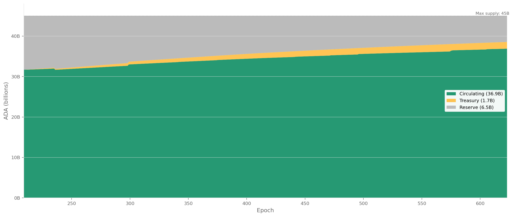

*CEN.2.1 — ADA supply decomposition into circulating, reserve, and treasury across the Shelley era. At epoch 623, circulating supply has reached **36.88B** of the **45B ADA** maximum, with **6.45B** remaining in the reserve and **1.66B** accumulated in the treasury under geometric monetary expansion.*

At epoch 623: **21.755B ADA** staked out of **36.110B** circulating = **60.2%** staking rate. The remaining **14.355B ADA (39.8%)** is not staked.

Of this, only **134.6M (0.37%)** has a registered stake credential without delegation — the *addressable* non-participant pool. The remaining **14.2B** sits in addresses with **no stake credential at all**. This population is decomposed in §5.

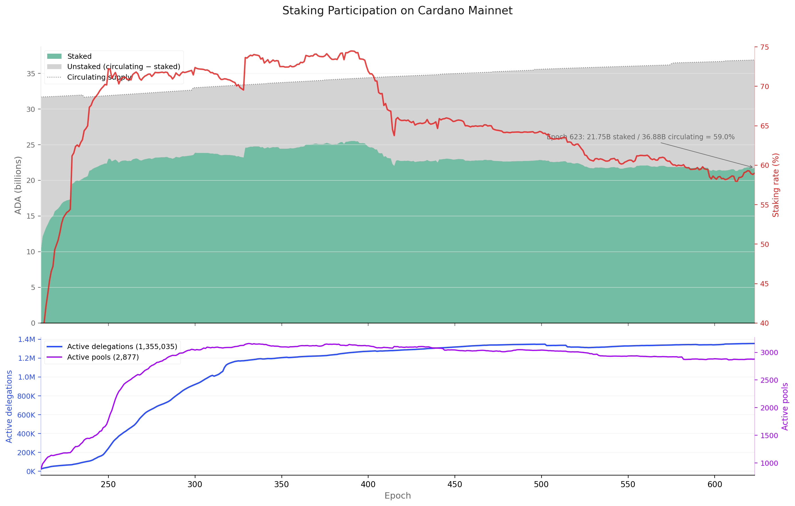

*CEN.2.2 — Staked versus unstaked decomposition of circulating supply with the staking rate (red, right axis). The rate peaked near **71%** around epoch 260 and has drifted to **59%** at epoch 623 — driven by circulating supply growth outpacing new stake inflows.*

The top panel shows the staked/unstaked decomposition of circulating supply with the staking rate (red line, right axis). The rate peaked near **71%** around epoch 260 and has been **declining gently**, driven by circulating supply growth outpacing new stake inflows.

> **Finding CEN.O7.F1 — The staking rate is structurally declining despite persistent net delegator inflows.** The rate has fallen from 71% (epoch ~260) to 59% (epoch 623) — a 12 pp loss over ~360 epochs. The decline is driven entirely by supply-side expansion: circulating ADA grew from ~32B to ~37B while staked ADA grew from ~23B to ~22B. The non-participant pool is growing faster than the staking pool.

## 3. Pool Operators

### 3.1. Raw query

The pool count from epoch_stake peaked at **3,160** (epoch 331) and currently stands at **2,877**.

This counts only pools that appear in the staking snapshot with non-zero delegated stake — the registration-certificate count of **5,919** includes **3,042 empty pools** and is discarded (see [§3.2 — Cleaning: production threshold](#32-cleaning--production-threshold) for the full rationale).

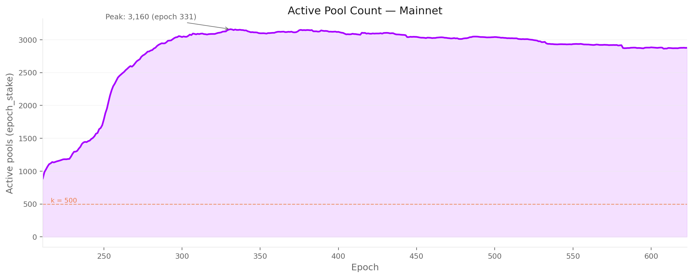

*CEN.3.1 — Productive pool count from `epoch_stake` against the **k = 500** target across the Shelley era. The cleaned count peaked at **3,160** (epoch 331) and currently stands at **2,877** — discarding the **3,042 empty pools** and **2,877 idle registrations** that inflate the raw certificate-based count.*

The **k=500** reference line shows the protocol's target number of pools (the saturation parameter). The actual pool count has been **~5.8× k** since epoch 330, though many of these pools carry **negligible stake**.

### 3.2. Cleaning — production threshold

Block production on Cardano is a **lottery**: each slot, a pool is selected to produce a block with probability proportional to its share of total staked ADA.

With ~21,600 slots per epoch, a pool holding stake σ out of a total S expects to be elected for λ = 21,600 × σ / S blocks per epoch. The number of blocks actually produced follows a **Poisson distribution** with parameter λ.

A pool that expects **fewer than one block per epoch** (λ < 1) faces variance that dominates the signal: its realised reward swings between zero and a windfall, making yield **unpredictable** for both the operator and delegators.

The production threshold is therefore the stake level at which **λ = 1**, i.e. σ_min = S / 21,600. This is a **structural property of the protocol** — it follows directly from the number of slots per epoch and the total staked ADA, **not** from any tuneable incentive parameter.

Because σ_min scales **linearly with S**, the threshold rises as staking participation grows. At epoch 211 (Shelley launch, S ≈ 10B ADA), σ_min ≈ **470K ADA**. By epoch 623 (S ≈ 21.75B ADA), it has crossed **~1M ADA**.

If total staked ADA continues to increase — whether through higher participation or circulating-supply growth — the threshold will continue to rise, **pushing the minimum viable pool size upward over time**.

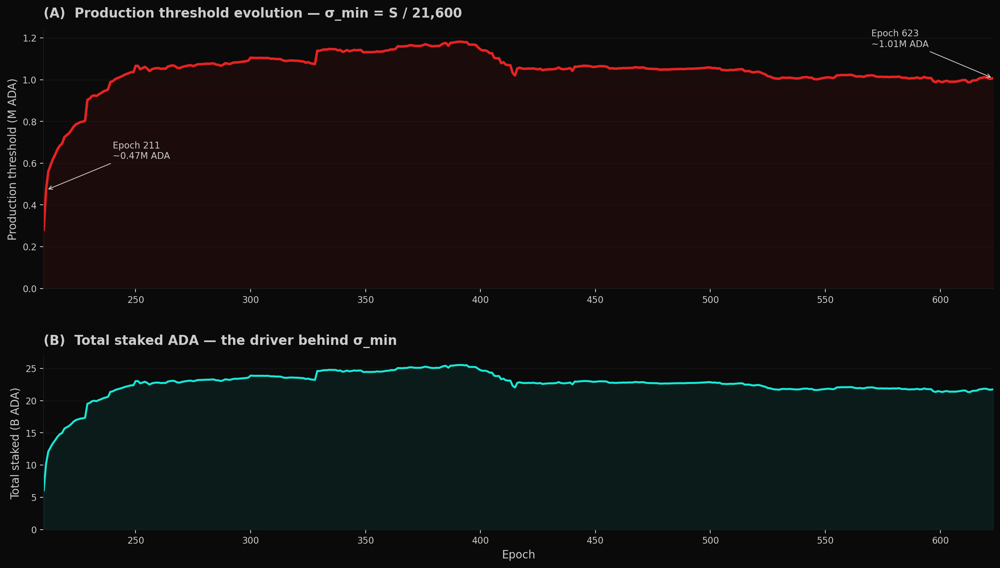

*CEN.3.2 — Production threshold $\sigma_{\min} = S/21{,}600$ across the Shelley era. The threshold first crossed **1M ADA** at epoch 241, peaked at **1.18M ADA** at epoch 391 (when total staked ADA reached **25.5B**), and currently sits at **~1.01M ADA** — a structural property of the slot count, not an incentive parameter.*

Panel (A) shows the production threshold in millions of ADA from Shelley launch to epoch 623. At epoch 210 (pre-Shelley), only **6.1B ADA** was staked and σ_min stood at **~280K ADA**.

The steep initial climb reflects the rapid growth of staking participation during the first ~100 epochs. The threshold first crossed **1M ADA** at epoch 241 (S ≈ 21.6B) and peaked at **1.18M ADA at epoch 391**, when total staked ADA reached its historical maximum of **25.5B**.

Since then, a decline in staking participation (from ~25.5B to ~21.75B) has brought σ_min back down to **~1.01M** at epoch 623 — a **15% retreat** from the peak, visible in panel (B).

The threshold is **bounded by the total ADA supply**. With a maximum supply of 45B ADA and current circulating supply of ~36B, even 100% staking participation would place σ_min at **~1.67M ADA** (or ~2.08M at full dilution).

At the current staking rate of ~60%, σ_min sits at roughly **1M** and will rise or fall only if total staked ADA changes — through shifts in staking participation, circulating supply growth from reserve emissions, or both.

| Segment | Pools | Share of pools | Stake | Share of stake | Delegations |
|---|---|---|---|---|---|
| Above threshold (≥1M ADA) | 951 | 33.1% | 21.57B | 99.14% | 1,295,095 (95.6%) |
| Below threshold (<1M ADA) | 1,926 | 66.9% | 0.19B | 0.86% | 59,940 (4.4%) |

**Two thirds of all pools are below the production threshold.** Together they hold **less than 1%** of staked ADA. Their **59,940 delegators** collectively control **188M ADA** — a negligible share that earns intermittent and unpredictable rewards.

Below-threshold pool breakdown by stake:

| Tier | Pools | Stake |
|---|---|---|
| < 1K ADA | 778 | 0.1M |
| 1K–10K | 394 | 1.4M |
| 10K–100K | 323 | 12.4M |
| 100K–500K | 286 | 69.0M |
| 500K–1M | 144 | 104.3M |

The median below-threshold pool holds just **2,547 ADA**. Three quarters hold less than **68K ADA** — **orders of magnitude** below what is needed for regular block production.

**After cleaning:** the productive pool count drops from 2,877 to **951** — closer to, but still ~1.9× the protocol's k=500 target.

> **Finding CEN.O1.F1 — Two-thirds of pools are below the production threshold and carry 0.86% of stake.** The 1,926 sub-threshold pools are economically irrelevant to consensus but not to their 59,940 delegators, who earn intermittent rewards and would be better served by redelegating. The median sub-threshold pool holds 2,547 ADA.

### 3.3. Cleaning — entity attribution

The **951 productive pools are not 951 single-pool operators**. Many pools share a controlling entity — detectable on-chain through shared `pool_owner` keys, and off-chain through metadata, ticker naming patterns, relay DNS, reward addresses, and public disclosures.

This cleaning pass groups pools by entity to reveal the **true operator landscape**.

**Two layers of attribution.**

| Layer | Signal | Result on the productive set |
|---|---|---|
| **On-chain only** | Shared `pool_owner` keys across productive pools | **4 entities** sharing keys across 8 pools; 943 pools appear as single-pool operators. On-chain keys are a *lower bound* — most multi-pool operators use separate keys per pool, so this layer alone misses the bulk of fleets. |
| **Off-chain layered heuristics** | Public brand declarations (tickers, metadata URLs, websites), relay/metadata clustering (shared IPs, identical hashes, co-located infrastructure), on-chain ownership clusters, and manual resolution from community databases | Across **all registered pools**: **85 named entities** controlling **660 pools**. Combining the two layers is what catches the off-chain fleet structure that on-chain keys alone don't expose. |

> **Finding CEN.O1.F9 — On-chain attribution alone reveals only 4 entities; off-chain layered attribution reveals 85 — a ~20× jump.** The on-chain layer alone tells almost nothing about MPO concentration: most multi-pool operators use separate keys per pool, so on-chain ownership clustering only catches the small minority that doesn't separate keys. Any analysis that stops at the on-chain layer treats fleet pools as if they were single-pool operators and materially understates the concentration of the network. The combined-attribution numbers — 85 entities across the registered set, 73 in the productive set — are the load-bearing inputs for every entity-level claim downstream.

**Filtering to the 951 productive pools.** From the 85 named entities, 2 disappear entirely (RAID — 7 pools, RockX — 10 pools, all below threshold), and 10 shrink to a single productive pool (reclassified as attributed single-pool operators), leaving **73 named entities** controlling **464 pools** (16.29B ADA, **75.5% of productive stake**). The remaining **477 pools** (5.28B ADA, **24.5%**) are unattributed single-pool operators.

| Segment | Pools | Stake | Share of productive stake |
|---|---|---|---|
| Attributed to named entities | 474 | 16.29B ADA | 75.5% |
| Unattributed (single-pool operators) | 477 | 5.28B ADA | 24.5% |

The productive landscape splits almost evenly by pool count but is **heavily skewed by stake**: attributed entities control **three quarters of productive stake through half the pools**.

> **Finding CEN.O1.F2 — 73 named entities control 75.5% of productive stake through 464 pools.** The operator landscape is dominated by multi-pool entities whose economic weight far exceeds their pool count. The 477 unattributed single-pool operators are the numerical majority but hold only a quarter of productive stake. Entity attribution is a lower bound — operators using entirely separate infrastructure per pool remain invisible.

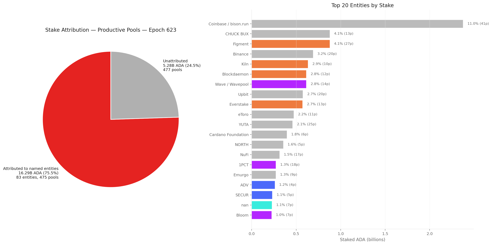

*CEN.3.3 — Productive-pool stake split between attributed entities and unattributed single-pool operators at epoch 623. **73 named entities** control **464 pools** (75.5% of productive stake) through half the pools; **477 unattributed single-pool operators** are the numerical majority but hold only a quarter.*

The entity attribution data lives in:
- [`data/mpo_entity_pool_mapping_mainnet.csv`](data/mpo_entity_pool_mapping_mainnet.csv) — pool → entity
- [`data/mpo_entity_archetypes.csv`](data/mpo_entity_archetypes.csv) — entity → archetype
- [`data/entity_stake_summary_623.csv`](data/entity_stake_summary_623.csv) — per-entity stake at epoch 623
- [`docs/mpo_entity_profiles.md`](docs/mpo_entity_profiles.md) — detailed entity profiles

### 3.4. Operator landscape

All figures and tables in this section refer to **productive pools only** — the **952 pools** above the production threshold at epoch 623, carrying **99.1% of staked ADA**. The 1,925 sub-threshold pools (0.9% of stake) are excluded.

#### 3.4.1. Epoch 623 snapshot

| Segment | Entities | Pools | Stake | Share |
|---|---|---|---|---|
| **Productive total** | **560** | **952** | **21.57B** | **100%** |
| _of which:_ | | | | |
| Identified entities | 83 | 475 | 16.30B | 75.6% |
| — with multiple productive pools (n-MPO ≥ 2) | 73 | 465 | 15.83B | 73.4% |
| — with single productive pool (attributed single-pool operator) | 10 | 10 | 0.46B | 2.1% |
| Single-pool operators | 477 | 477 | 5.28B | 24.5% |

The entity attribution is a **current-epoch snapshot** and a **lower bound** — entities using entirely separate infrastructure and branding for each pool remain invisible. The real multi-pool operator count is **certainly higher than 73**.

#### 3.4.2. Multi-pool operator fleet structure

The **83 identified entities** operate **475 productive pools** — but their fleet sizes vary from **1 to 41 pools**. The **n-MPO** notation denotes the number of productive pools an entity manages.

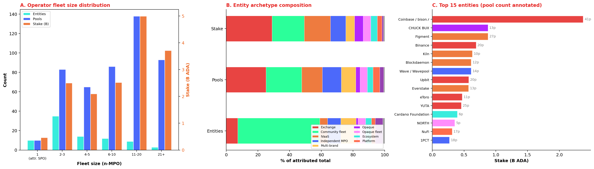

*CEN.3.4 — Multi-pool operator fleet-size distribution and entity archetype composition at epoch 623. Fleet size is heavy-tailed: **12 entities with 11+ pools** control **40.4%** of productive stake; CEX and IVaaS together — 10 entities — capture **45.4%** of attributed stake at structurally zero pledge.*

**Fleet size distribution** (panel A):

| Fleet size (n-MPO) | Entities | Pools | Stake (B) | % of productive |
|---|---:|---:|---:|---:|
| 1 (attributed single-pool operator) | 10 | 10 | 0.46 | 2.1% |
| 2–3 | 35 | 83 | 2.50 | 11.6% |
| 4–5 | 14 | 65 | 2.10 | 9.7% |
| 6–10 | 12 | 86 | 2.52 | 11.7% |
| 11–20 | 9 | 138 | 5.00 | 23.2% |
| 21+ | 3 | 93 | 3.71 | 17.2% |
| **Total attributed** | **83** | **475** | **16.30** | **75.6%** |

The **2–3 pool tier** is the most populated (35 entities) but each tier above it controls **more aggregate stake despite fewer entities**.

Three entities alone — **Coinbase (41p), Yuta (25p), and Binance (20p)** — operate **93 pools** and hold **3.71B ADA (17.2%)** of productive stake.

> **Finding CEN.O1.F4 — The n-MPO distribution is heavy-tailed: 12 entities with 11+ pools control 40.4% of productive stake.** The mid-range (2–10 pools, 61 entities) is the numerical majority but its aggregate weight (33.0%) is smaller than the concentrated top. Stake scales super-linearly with fleet size — a 21+ pool entity holds on average 1.24B, a 2–3 pool entity holds 0.07B.

**Entity archetype composition** (panel B). Exchanges (**CEX**: 6 entities, 119 pools, 4.71B) and institutional validators (**IVaaS**: 4 entities, 62 pools, 2.69B) together account for **10 entities** but **45.4%** of attributed stake.

Community-branded fleets (**43 entities**, 3.30B) are the most numerous archetype but hold **less stake than the exchange tier alone**. The remaining archetypes — independent MPOs, multi-brand fleets, opaque entities, ecosystem actors, and platforms — fill the long tail.

> **Finding CEN.O1.F5 — CEX + IVaaS (10 entities, 181 pools) hold 7.40B ADA — 34.3% of productive stake at structurally zero pledge.** These entities' delegation source — custodied retail balances and institutional client assets — makes pledge economically meaningless. Their dominance sets a floor on how much of the stake landscape is unreachable by pledge-based incentive mechanisms.

#### 3.4.3. Historical decomposition — productive vs sub-threshold pools

The production threshold — the minimum stake a pool needs to expect at least one block per epoch — **rises mechanically with total staked ADA**. At epoch 211 (Shelley launch), a pool needed roughly **470K ADA**; by epoch 623 the threshold has crossed **1M ADA**.

The number of pools that clear this threshold has remained **remarkably stable around 900–1,000** since epoch 300, while the sub-threshold tail grew from near zero to almost **2,000 pools** by epoch 330 and has hovered there since.

The productive share of pools has therefore fallen from **near 100%** in early Shelley to roughly **33%** today — yet productive pools continue to control **over 99%** of staked ADA throughout the entire history.

*CEN.3.5 — Productive versus sub-threshold pools across the Shelley era — by stake (top) and pool count (bottom). The productive pool count has held at **~900–1,000** since epoch 300 while the sub-threshold tail grew to nearly **2,000**; productive pools nonetheless retain over **99%** of staked ADA throughout.*

The top panel shows the staked-ADA split between productive and sub-threshold pools (left axis) alongside the production threshold itself (red line, right axis).

The bottom panel shows the pool-count decomposition, with the productive share (purple line, right axis) declining as the long tail of sub-threshold pools **inflated the denominator without capturing meaningful stake**. The **k=500** reference line marks the protocol's target pool count.

### 3.5. Population dynamics — entries, exits, and turnover

The near-constant stock of **~950 productive pools** masks significant underlying churn. This section decomposes the aggregate into three views:

- **the entry/exit flow**;
- **the entity-level lifecycle** that drives it;
- **the stake variability** that pools experience even while they remain in the productive set.

#### 3.5.1. Entries and exits

Tracking individual pools across consecutive epochs — counting those that cross the production threshold upward (**entries**) and those that fall below it or disappear (**exits**) — reveals the turnover that the aggregate count obscures.

*CEN.3.6 — Productive-pool entries and exits per epoch across the Shelley era. The ~950-pool quasi-equilibrium since epoch 300 conceals **3,497 entries** against **3,070 exits** with an average churn of **~15.9 pools per epoch** — a **1.7%** turnover rate driven by fragility near the production threshold.*

The early Shelley period (epochs 212–300) saw **rapid net growth** as the pool population expanded from **~450 to ~1,000** productive pools. Growth epochs outnumbered decline epochs roughly **2∶1** during this phase.

From epoch 300 onward, the productive population stabilised: net changes per epoch fluctuate around zero, with growth and decline epochs occurring in roughly equal proportion. Over the full history (epochs 212–623), the productive set gained a **net +427 pools** — but the near-flat trajectory since epoch 300 means the **overwhelming majority** of that net gain occurred in the first 90 epochs.

The stability of the stock alongside non-trivial per-epoch fluctuation implies a **quasi-equilibrium**: pools that exit the productive set (falling below the rising threshold, retiring, or losing delegation) are replaced at roughly the same rate by new entrants or returning pools.

Tracking individual pool presence per epoch (`05_pool_population_dynamics.sql`) confirms this: over the full history the productive set recorded **3,497 entries** against **3,070 exits**, with an **average churn of ~15.9 pools per epoch**. The turnover rate (entries + exits as a share of the productive population) averages around **1.7% per epoch** — higher than the delegator-side turnover of **~0.5%**, reflecting the **greater fragility of pool economics near the production threshold**.

> **Finding CEN.O1.F3 — The productive pool set is a quasi-equilibrium: ~950 pools since epoch 300, with 1.7% turnover per epoch.** 3,497 entries against 3,070 exits balance to a near-zero net flow. The apparent stability of the aggregate conceals a replacement process where departing pools are continuously substituted by new entrants.

#### 3.5.2. Entity lifecycle

Part of the churn is driven by **entity-level dynamics**. The entity lifecycle analysis ([`data/entity_lifecycle_623.csv`](data/entity_lifecycle_623.csv)) classifies the 85 named entities into four phases — **dead, declining, stable, and growing** — based on their stake trajectory and productive-pool retention.

Declining and dead entities contract their pool fleets, **feeding the exit side**; growing entities and new single-pool operators **feed the entry side**. The entity-level decline trajectories are visualised in the figures below.

*CEN.3.7 — Stake and pool-count trajectories of declining and dead entities. These entities contract their fleets and feed the exit side of the productive-pool churn, accounting for a meaningful share of the **3,070 cumulative exits** observed across the Shelley era.*

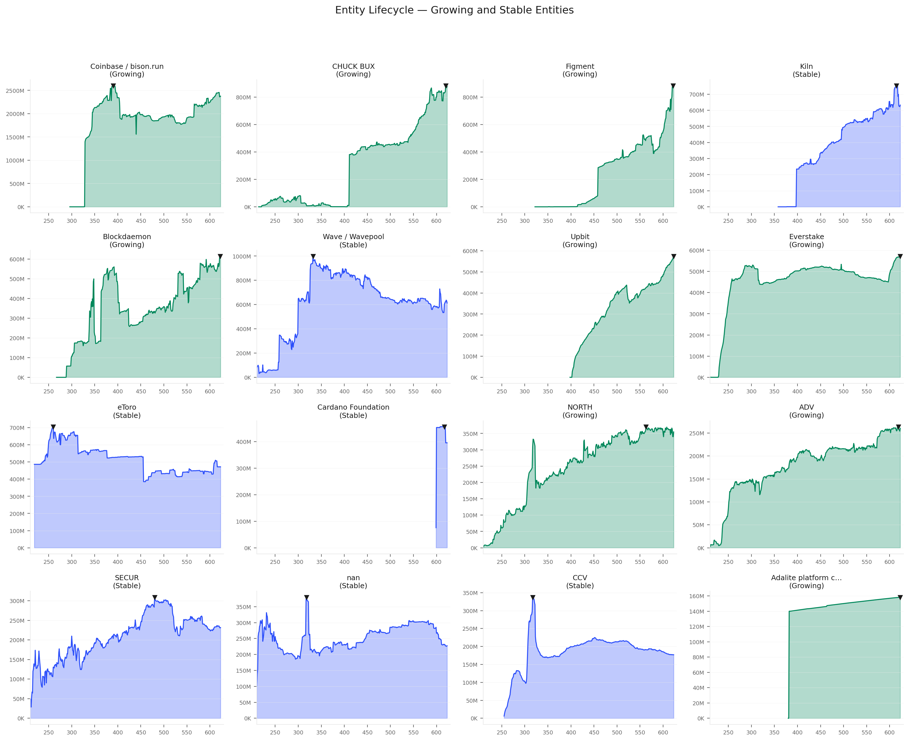

*CEN.3.8 — Stake and pool-count trajectories of growing entities. These entities feed the entry side of the productive-pool churn — partly offsetting the contraction of declining and dead entities tracked in the prior figure.*

#### 3.5.3. Cohort decomposition — who holds the productive set?

The entries-and-exits view ([Entries and exits](#351-entries-and-exits)) treats the productive pool set as a **homogeneous stock**. This section decomposes it into two populations — pools operated by **identified multi-pool entities** and **single-pool operators** — and tracks each cohort's pool count and stake share across the full history.

The underlying data is in [`data/cohort_population_dynamics.csv`](data/cohort_population_dynamics.csv), derived by subtracting the per-epoch entity aggregate ([`data/entity_stake_history.csv`](data/entity_stake_history.csv)) from the productive totals in [`data/operator_landscape_history.csv`](data/operator_landscape_history.csv).

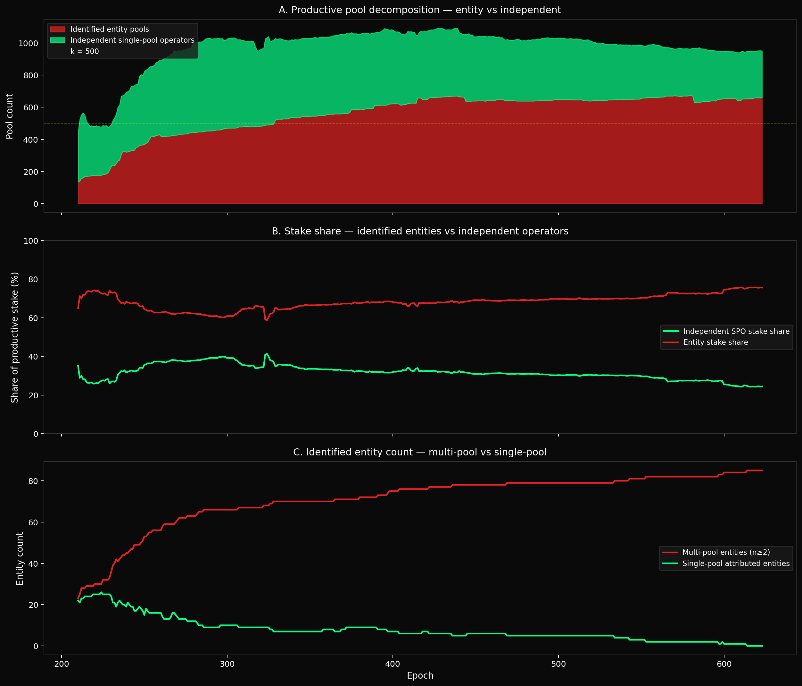

*CEN.3.9 — Productive-pool cohort decomposition into single-pool operators versus multi-pool entities across the Shelley era. The single-pool cohort peaked at **555 pools (39.1%** of stake) at epoch 300 and has contracted to **291 pools (24.4%)** — a **48% loss in pool count and 15pp loss in stake share**.*

**The single-pool operator segment is in structural decline.**

The independent population peaked at **555 pools** and **39.1%** of productive stake around epoch 300 — the end of the Shelley expansion phase. Since then it has **contracted in every period**:

| Period | Epochs | Independent pools | Stake share | Change |
|---|---|---|---|---|
| Shelley expansion | 250–300 | 455 → 555 | 35.6% → 39.1% | +100 pools, +3.5pp |
| Early maturity | 300–400 | 555 → 459 | 39.1% → 31.9% | −96 pools, −7.3pp |
| Mid maturity | 400–500 | 459 → 385 | 31.9% → 30.3% | −74 pools, −1.6pp |
| Recent | 500–623 | 385 → 291 | 30.3% → 24.4% | −94 pools, −5.9pp |

The contraction **accelerated in the recent period**: **94 pools lost in 123 epochs**, with the stake share dropping **below 25% for the first time**. The independent population has lost **nearly half its pool count** (555 → 291) and **nearly 15 percentage points** of stake share since its peak.

> **Finding CEN.O1.F6 — The single-pool operator population has contracted from 555 pools (39.1% of productive stake) at epoch 300 to 291 pools (24.4%) at epoch 623 — a 48% loss in pool count and a 15pp loss in stake share.** The contraction is continuous and has accelerated in the most recent period (epochs 500–623). The quasi-equilibrium of [Entries and exits](#351-entries-and-exits) masks a composition shift: the replacement pools that maintain the ~950 total are increasingly entity-operated, not independent.

**Identified entities expanded steadily.**

The number of multi-pool entities (n-MPO ≥ 2) grew from **23 at Shelley launch** to **85 at epoch 623**. Their pool count rose from **135 to 660**, and their stake share from **65% to 75.6%** of productive stake.

The expansion was **not driven by a few large entrants** — the fleet-size distribution shifted across all tiers:

| Fleet size | Epoch 300 | Epoch 623 |
|---|---|---|
| 2–3 pools | 29 entities (12.4%) | 36 entities (14.2%) |
| 4–5 pools | 17 entities (15.9%) | 16 entities (13.5%) |
| 6–10 pools | 11 entities (11.0%) | 18 entities (13.2%) |
| 11–20 pools | 3 entities (12.8%) | 9 entities (30.3%) |
| 21+ pools | 6 entities (46.4%) | 6 entities (28.8%) |

The most striking shift is in the **11–20 pool tier**: from **3 entities holding 12.8%** of entity stake to **9 entities holding 30.3%**.

The 21+ tier declined in share (46.4% → 28.8%) as IOG and Binance contracted, but the **mid-tier fleets (6–20 pools) absorbed the gap**.

*Entity power is not merely growing — it is spreading across a broader fleet-size distribution.*

> **Finding CEN.O1.F7 — Multi-pool entities grew from 23 (epoch 210) to 85 (epoch 623), expanding from 135 to 660 productive pools and from 65% to 75.6% of productive stake.** The mid-tier fleets (6–20 pools) tripled their entity count and nearly doubled their stake share. The ~950-pool quasi-equilibrium is increasingly populated by entity-operated pools substituting for departing independents.

#### 3.5.4. The independent pipeline — what the mechanism was designed to produce

The Cardano reward mechanism was designed to produce a **progression path for operators**: entry with an initial pledge, delegation-driven growth, and eventually full commitment as an established pool ([*The Intended Game* §3.2](../../../../the-intended-game/README.md#32-operators-from-first-pledge-to-full-commitment)).

The single-pool operator segment is the population where this trajectory **should** be observable — small operators entering, building reputation, attracting delegation, and graduating into established entities.

**The data shows the opposite.** The independent population contracted from **555 to 291 pools** while its stake share fell from **39.1% to 24.4%**.

The entity lifecycle analysis ([Entity lifecycle](#352-entity-lifecycle), [companion document](entity-lifecycle/README.md)) tracks where the capital went: toward **late institutional entrants** (IVaaS), **exchanges holding ground**, and a handful of **community operators that grew against the tide**. It did **not** flow toward a cohort of single-pool operators graduating into established entities.

The census cannot track individual single-pool operators over time (they are unattributed by definition), but the aggregate trajectory is unambiguous: *the independent segment is shrinking, not graduating.*

The absence of evidence for the designed growth path is **itself diagnostic**. If the mechanism were producing the intended progression — small operators growing into established ones — the independent segment would show either **stable pool count** (graduates replaced by new entrants) or **growing stake share** (successful operators attracting more delegation).

**It shows neither.** The pool count is falling and the stake share is falling faster, which means the independents that remain are also **losing average delegation**. The replacement process that maintains the ~950-pool total is driven by **entity fleet expansion**, not by new independent entrants.

> **Finding CEN.O1.F8 — The mechanism's designed progression path — from new single-pool operator to established entity — has no observable expression in the mainnet data.** The independent segment is contracting in both pool count and stake share, and the replacement pools that sustain the ~950-pool total are entity-operated. The growth path described in the formal design ([*The Intended Game* §3.2](../../../../the-intended-game/README.md#32-operators-from-first-pledge-to-full-commitment)) exists as a theoretical property of the intended equilibrium but not as an empirical feature of the observed one.

### 3.6. Pool size variability — how stable is a pool's stake?

The entry/exit analysis tracks whether a pool is *in* the productive set; this section asks **how much its stake fluctuates while it stays there**.

A pool that survives all **73 epochs** of the last year (epochs 551–623) may nonetheless experience **large swings in delegation**, with consequences for block production regularity and operator revenue predictability.

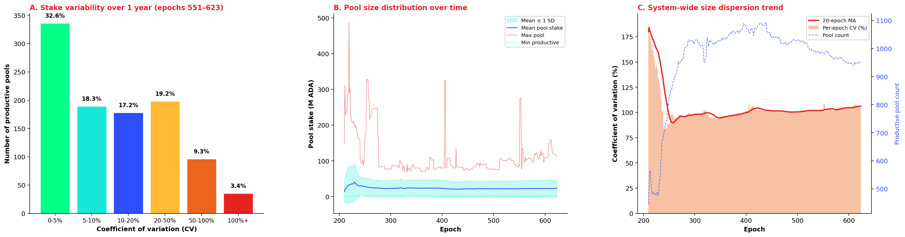

*CEN.3.10 — Pool-stake variability over the trailing 73 epochs. Roughly **half** the productive set has CV under **10%**; **9.3%** of pools sit between 50–100% CV and **3.4%** exceed 100%. System-wide cross-sectional CV has compressed from **>180%** in early Shelley to **~105%** since epoch 500.*

**Most productive pools are remarkably stable.** Of the **1,032 pools** present in at least 10 of the last 73 epochs and above the production threshold, roughly a third (**32.6%**) have a coefficient of variation (CV) of **5% or less** — their stake barely moves from epoch to epoch.

Another **18.3%** sit in the 5–10% band. Together, **half the productive set** operates with stake fluctuations under 10% over a full year.

**A long tail of volatile pools exists.** At the other extreme, **9.3%** of productive pools have CV between 50% and 100%, and **3.4%** exceed 100% — meaning their standard deviation is **larger than their mean stake**.

These are typically pools near the production threshold that **oscillate in and out of viability**, or pools that experienced a single large delegation event (arrival or departure of a whale) that dominates their variance.

**System-wide dispersion has compressed over time.** Panel C shows the cross-sectional CV of pool stakes across all productive pools at each epoch.

In the early Shelley era (epochs 210–260), the CV exceeded **180%** — a handful of very large pools coexisted with hundreds of small entrants, producing **extreme size dispersion**.

As the pool population matured and the largest pools approached the saturation cap (~70.8M ADA at k=500), the CV declined steadily to **~105%** by epoch 500 and has since plateaued. The remaining dispersion reflects the structural range between pools near the production threshold (~1M ADA) and the largest pools near saturation (~114M ADA) — a **100× ratio** that the protocol's incentive design deliberately permits.

**Variability differs across market segments.** Crossing the per-pool coefficient of variation with the custodial taxonomy from the companion [*Operator's Cut*](../../operator-delegator-distribution/mainnet-analysis/)  reveals that **not all segments fluctuate equally**.

The custodial classification uses the per-pool **median delegation** from db-sync `epoch_stake` — the amount held by the typical delegator in each pool — rather than the mean ADA per delegation, which is inflated by whale addresses by a factor of **50–300,000×** (see the companion [*Operator's Cut*](../../operator-delegator-distribution/mainnet-analysis/) for the methodology and rationale).

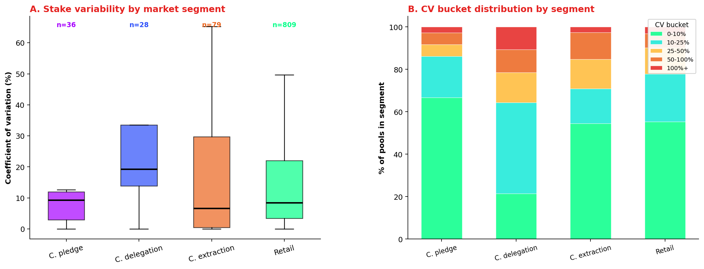

*CEN.3.11 — Pool-stake coefficient of variation by custodial segment. Custodial-by-delegation pools are most volatile (median **19.3%**, mean **43.0%**), retail sits at **8.4%** median, custodial-by-pledge at **9.3%**, and custodial-by-extraction at **6.6%** — stagnation, not active management, keeps the latter steady.*

**Custodial-by-delegation** pools (28 pools where the median delegation exceeds 100K ₳) are the **most volatile**: median coefficient of variation of **19.3%**, mean **43.0%**, and **21% exceed 50%**. These are pools dominated by **whale self-delegation** — a single address moving capital in or out produces large proportional swings.

By contrast, **custodial-by-pledge** pools (36 private, self-funded pools) sit at a median coefficient of variation of **9.3%** — the operator controls the capital and has little reason to move it, with 67% below 10%.

**Custodial-by-extraction** pools (79 pools with ≥ 99% margin) sit at **6.6% median**, with 54% below 10% — consistent with pools whose delegators are **locked in by inertia or institutional constraint**.

The **retail market** (809 pools, median delegation below 100K ₳) lands at a median coefficient of variation of **8.4%**, with 55% of pools below 10%. This segment includes the large institutional operators (Coinbase, Binance, Kiln, YUTA) whose pools have high mean ADA per delegation but **low median delegation** — the majority of their delegators are small retail wallets.

The **10% tail above 50%** in the retail segment captures pools that gained or lost a whale delegator — a single large address arriving or leaving a pool with hundreds of small delegators.

> **Finding CEN.O2.F1 — Stake variability is driven by delegation concentration, not market segment.** Pools where the typical delegator holds ≥ 100K ₳ (28 custodial-by-delegation pools) show a median coefficient of variation of 19.3% and a mean of 43.0% — whale movements dominate their variance. Retail pools (809 pools) are mostly stable at 8.4% median, but the 10% tail above 50% shows that even retail pools are vulnerable to single-whale shocks. Custodial-by-extraction pools are the most inert (6.6% median) — stagnation, not active management, keeps their stake steady.

**Implications for delegators.** A pool's stake stability matters because it affects **block-production regularity** and, by extension, the **consistency of epoch rewards**.

Delegators in low-CV pools experience **smoother returns**; those in high-CV pools face **more variance**. The data in `data/pool_size_variability.csv` provides per-pool CV, min, max, and range for further analysis; `data/pool_cv_by_segment.csv` gives the segment-level aggregate.

## 4. Delegators

### 4.1. Raw query

Two db-sync tables count delegators in different ways:

| Source | What it counts | Epoch 623 value |
|---|---|---|
| `epoch_stake` aggregation | Rows with non-zero stake in the epoch snapshot | **1,355,035 delegations** across **2,877 pools** |
| `delegation` table reconstruction | Active delegation certificates (regardless of balance) | **1,847,713 addresses** across **5,919 pools** |

The gap: **~493K addresses** hold an active delegation certificate but have **zero balance** in the epoch_stake snapshot. Similarly, **~3,042 registered pools** have delegation certificates pointing at them but carry **no actual stake**.

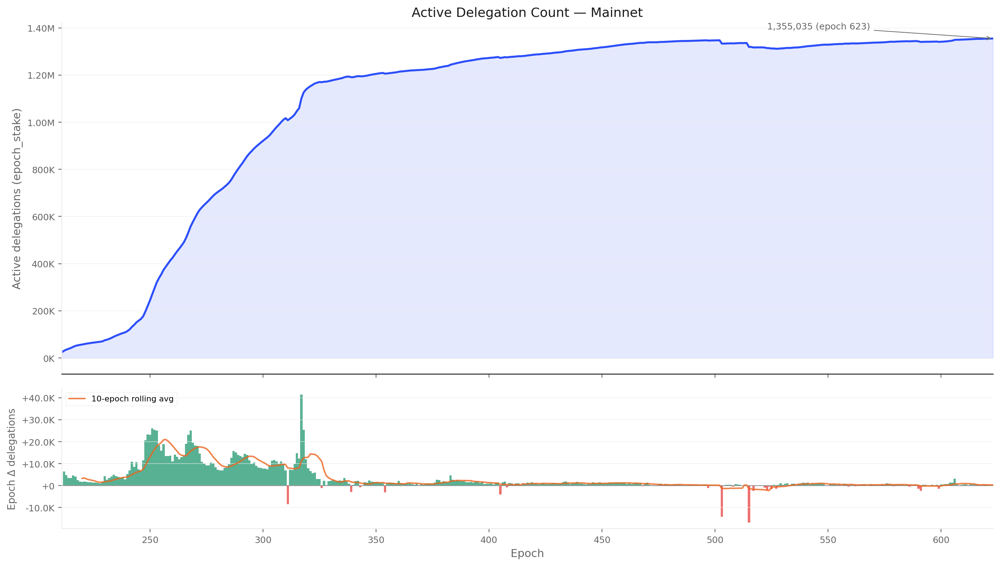

*CEN.4.1 — Raw versus cleaned delegator count across the Shelley era. The raw delegation table records **1,847,713 addresses** and **5,919 pools**, but **~493K certificates** are zero-balance "ghosts" and **3,042 pools** carry no actual stake; cleaning yields **1,355,035 active delegations** across **2,877 pools**.*

### 4.2. Cleaning — zero-balance certificates

A delegation certificate is a *declaration of intent*: it records on-chain that an address wishes to delegate to a given pool, but it **does not lock any funds**. The ADA remains freely spendable.

An epoch_stake row, by contrast, is *capital at work* — it reflects the actual balance present at the snapshot boundary. An address with a certificate but **no ADA earns no rewards** and does not participate in consensus.

The gap between the two views arises because delegation certificates are **never automatically revoked**. When an address is emptied — typically because the holder transferred funds to an exchange, moved to another wallet, or simply stopped using Cardano — the certificate persists as a **residual record** pointing at a pool with zero backing stake. These orphaned records are the **"certificate ghosts"** removed in this step.

| Metric | Raw (delegation table) | Clean (epoch_stake) | Noise removed |
|---|---|---|---|
| Active delegations | 1,847,713 | **1,355,035** | 492,678 certificate ghosts (26.7%) |
| Active pools | 5,919 | **2,877** | 3,042 empty pools (51.4%) |

**After cleaning:** 1,355,035 delegations, 21.75B ADA across 2,877 pools.

### 4.3. Cleaning — non-productive pools

The **1,925 pools** below the production threshold ([The structural requirement](../../../README.md#32-the-structural-requirement)) carry **59,937 delegations** and **0.19B ADA**. These delegators earn **intermittent and unpredictable rewards**. Removing them aligns the delegator population with the productive operator landscape.

**After cleaning:** 1,295,098 delegations, 21.57B ADA across 952 productive pools.

### 4.4. Delegator landscape

#### 4.4.1. Epoch 623 snapshot

After the two cleaning passes ([§4.2](#42-cleaning--zero-balance-certificates) and [§4.3](#43-cleaning--non-productive-pools)), the delegator population at epoch 623 is:

| Segment | Delegations | Stake | Share | Pools | Entities |
|---|---|---|---|---|---|
| **Raw (delegation certificates)** | **1,847,713** | — | — | **3,190** | **2,374** |
| Zero-balance certificates (noise) | 492,678 | 0 | — | 313 | 72 |
| **epoch_stake total** | **1,355,035** | **21.75B** | **100%** | **2,877** | **2,302** |
| Non-productive pool delegations (noise) | 59,937 | 0.19B | 0.9% | 1,925 | 1,742 |
| **Productive pool delegations** | **1,295,098** | **21.57B** | **99.1%** | **952** | **560** |

The **1,295,098 productive pool delegations** are the cleaned population handed to the companion [*Operator's Cut*](../../operator-delegator-distribution/mainnet-analysis/) analysis, which decomposes them further into **operator self-stake, custodial, and retail segments**.

#### 4.4.2. Stake distribution among delegators

The **1.36M delegations** carry **21.75B ADA** — but the distribution across individual delegations is **extremely unequal**.

*CEN.4.2 — Delegator stake distribution at epoch 623 with the Lorenz curve. The bottom **59.1%** of delegators (under 100 ADA) collectively hold **0.05%** of stake; the top **318 delegators (0.02%)** hold **44.8%**. Gini coefficient: **0.976**.*

**Size buckets:**

| Size cohort | Delegators | % of delegators | Stake (ADA) | % of stake | Mean (ADA) |
|---|---:|---:|---:|---:|---:|
| < 100 | 801,067 | 59.1% | 11.2M | 0.05% | 14 |
| 100 – 1K | 249,181 | 18.4% | 94.2M | 0.43% | 378 |
| 1K – 10K | 201,797 | 14.9% | 679.0M | 3.12% | 3,365 |
| 10K – 100K | 83,307 | 6.1% | 2.43B | 11.18% | 29,188 |
| 100K – 1M | 17,439 | 1.3% | 4.49B | 20.63% | 257,327 |
| 1M – 10M | 1,926 | 0.14% | 4.31B | 19.80% | 2.24M |
| 10M+ | 318 | 0.02% | 9.75B | 44.80% | 30.6M |

The bottom **59.1%** of delegators (under 100 ADA) collectively hold **0.05%** of stake — **less than any single delegation in the top tier**. The top **318 delegators (0.02%)** hold **44.8%** of all staked ADA.

> **Finding CEN.O3.F1 — The median delegator holds 32 ADA; the mean is 16,055 ADA.** The 500× gap between mean and median measures the skewness of the distribution. Half the delegator population stakes less than the cost of a single transaction fee at peak congestion. The distribution follows a power law — each tier above 10K ADA holds roughly 20% of total stake despite containing exponentially fewer delegators.

**Concentration metrics:**

| Metric | Value |
|---|---:|
| Gini coefficient | 0.976 |
| Top 100 delegators → % of stake | 23.7% |
| Top 1,000 → % of stake | 57.0% |
| Top 10,000 → % of stake | 79.2% |
| Median | 32 ADA |
| P90 | 5,866 ADA |
| P99 | 142,775 ADA |

The Lorenz curve (panel B) is **nearly flat until the last few percent of delegators**, then rises steeply — the classic signature of **extreme concentration**.

At **Gini = 0.976**, the Cardano staking distribution is **more concentrated than the US wealth distribution** (~0.85) and comparable to the most unequal asset distributions observed in financial markets.

> **Finding CEN.O3.F2 — 1,000 delegators (0.07% of the population) control 57% of staked ADA.** The top 10,000 (0.74%) control 79.2%. The staking economy is effectively governed by the capital allocation decisions of a few thousand addresses — whose identity (individual whale, exchange hot wallet, institutional custodian) determines whether the protocol's delegation signal reflects genuine preference or operational logistics.

#### 4.4.3. Historical evolution — who joined and where is the capital?

*CEN.4.3 — Delegator population growth, stake composition, and concentration evolution from Shelley launch to epoch 623. The micro-delegator tier absorbs **96%** of new entrants; the top-1% share rose to **78–82%** by epoch 280 and has held there despite a **9×** increase in delegator count.*

The three panels trace how the delegator population, its stake composition, and its concentration structure evolved from Shelley launch (epoch 210) to epoch 623.

**Panel A — Population growth by size tier.** The delegator count grew from **17K** (epoch 210) to **1.36M** (epoch 623). Virtually all growth comes from the **micro-delegator tier** (< 1K ADA, cyan): this tier expanded from ~1,500 to ~1.05M, **absorbing 96% of new entrants**.

The 1K–100K tier grew from ~10K to ~285K. The 100K–1M tier plateaued around 17K, and the 1M+ tier barely moved — from ~1,100 at launch to ~2,200 today.

**Panel B — Stake composition by size tier.** In contrast to population, the stake is **dominated by the 1M+ tier** (red), which holds **14.1B ADA** — **65%** of total staked ADA — in just **2,244 addresses**.

This tier reached its current level by epoch ~260 and has **fluctuated within a narrow band since**. The 100K–1M tier (gold) contributes 4.5B, the 1K–100K tier (blue) adds 3.1B, and the <1K tier — despite being **77% of the population** — carries just **0.1B (0.5%)**. Stake composition has been **essentially frozen since epoch 300**.

**Panel C — Concentration evolution.** The top-1% share rose rapidly from **39% at Shelley launch** to **~80% by epoch 280**, then plateaued at **78–82%**. The top-0.1% share follows a similar trajectory, stabilising at **48–52%**.

The delegator count (dashed line) grew **9×** over the same period **without affecting the concentration ratio**.

*The mechanism is straightforward:* new entrants are overwhelmingly micro-delegators who add to the **denominator** without touching the **numerator** of the concentration ratio.

> **Finding CEN.O3.F3 — Stake concentration crystallised by epoch 300 and has not moved since.** The top-1% share has been stable at 78–82% for over 300 epochs, despite a 9× growth in delegator count. Growth since epoch 300 has come almost exclusively from the < 1K tier — 600K new micro-delegators who collectively added 0.06B ADA (0.3% of stake). The economic weight of the staking system was set in its first ~90 epochs. Concentration is now a structural feature, not a trend.

### 4.5. Population dynamics — delegator entries and exits

Applying the same epoch-over-epoch tracking used for pools in [Population dynamics — entries, exits, and turnover](#35-population-dynamics-entries-exits-and-turnover), but at the **delegator level**: for each epoch, count addresses that appear in a productive pool's delegation set for the first time (**entries**) and those that disappear from it (**exits**). Only delegators to pools above the production threshold are counted.

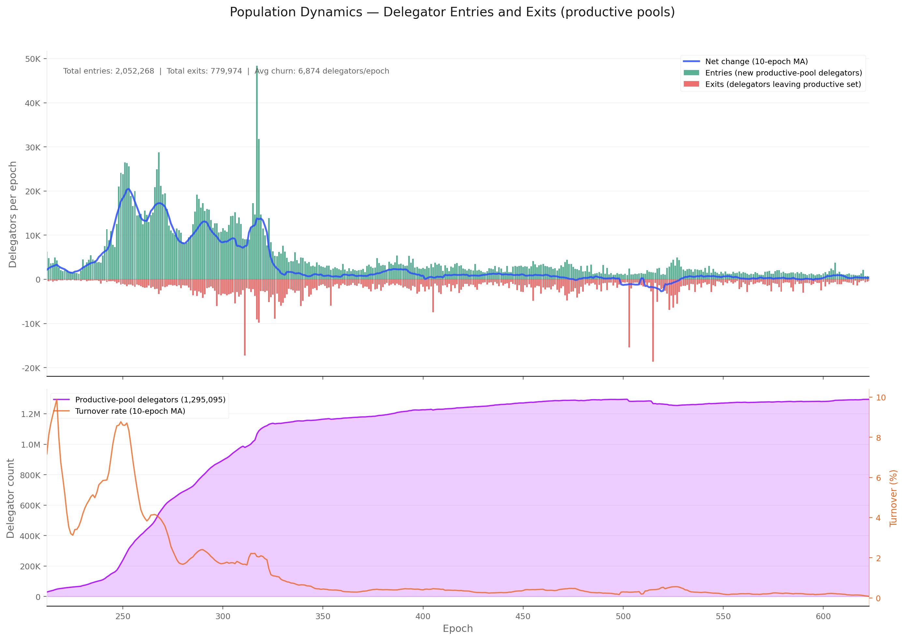

*CEN.4.4 — Productive-pool delegator entries and exits across epochs 212–623. Net flow is structurally asymmetric — entries consistently exceed exits — yielding **+1,272,294** net delegators and a **6:1** ratio of growth to decline epochs; the post-epoch-530 plateau suggests saturation under the current ~59% staking rate.*

The delegator population tells a **fundamentally different story** from the pool population. Where the productive pool count stabilised early and has fluctuated within a narrow band since epoch 300, the delegator count grew **almost monotonically** from **~28,700** (epoch 212) to **~1,295,000** (epoch 623).

Over the full 412-epoch history, the productive set recorded **2,052,268 individual entries** against **779,974 exits** — a **net gain of +1,272,294 delegators**. The average per-epoch churn (entries + exits) is **~6,870 addresses**, implying that roughly **0.5% of the delegator base** turns over each epoch.

Growth epochs outnumber decline epochs roughly **6∶1**, and the few negative epochs involve small absolute drops. The moving average of net change was **strongly positive through epoch ~380**, then settled into a lower but still persistently positive regime.

Two features stand out.

- **Distinct waves rather than a smooth ramp.** The initial Shelley on-boarding surge (epochs 212–260), a secondary acceleration around epochs 280–330 (coinciding with the Alonzo-era smart-contract boom and increased retail attention), and a third wave around epochs 480–510.
- **A plateau from epoch ~530 onward** — where net growth drops close to zero — suggests the delegator population may be approaching a **saturation point** under the current staking participation rate of **~59%**.

The turnover rate (gross entries + exits as a share of the active population) averages around **0.5% per epoch** but spikes markedly during protocol upgrades and market events, revealing that the apparently stable stock masks **episodic surges of rebalancing**.

Unlike pool dynamics, where entries and exits are roughly balanced post-epoch 300, delegator dynamics remain **structurally asymmetric** — entries consistently exceed exits — reflecting **ongoing organic adoption** even as the growth rate decelerates.

### 4.6. Delegation churn — pool switching behaviour

The population dynamics above track whether delegators are *in* the productive set; this section tracks what they do *within* it — **how often they switch pools, who switches, and why**.

The `delegation` table records every delegation certificate ever submitted on-chain (**3,491,680 certificates** across the Shelley era). Each certificate binds a stake address to a pool; a new certificate from the same address to a different pool constitutes a **redelegation (pool switch)**.

#### 4.6.1. Certificate composition and temporal regimes

*CEN.4.5 — Per-epoch delegation certificate composition across the Shelley era. Three distinct regimes are visible: **2,000–3,500** redelegations/epoch in early Shelley, **1,000–2,000** through epoch 500, and a settled **600–800/epoch** thereafter — a **75%** decline marking market maturation.*

Of the **3.49M delegation certificates** submitted between epochs 210 and 623:

| Certificate type | Count | Share |
|---|---:|---:|
| Initial delegation (first certificate for an address) | 1,847,713 | 52.9% |
| Redelegation (switch to a different pool) | 1,407,245 | 40.3% |
| Renewal (same pool, re-registration cycle) | 235,336 | 6.7% |

The per-epoch pattern reveals **three regimes**:

- **Early Shelley (epochs 210–260):** **2,000–3,500** redelegations per epoch — a turbulent phase of experimentation with the new staking system.

- **Middle period (epochs 260–500):** **1,000–2,000** per epoch, with periodic spikes around protocol upgrades (Alonzo, Babbage) and market events.

- **Mature regime (epoch 500+):** **600–800** redelegations per epoch — a stable market where most delegators have settled.

> **Finding CEN.O4.F1 — The delegation market has matured through three distinct regimes.** Redelegation activity fell from 2,000–3,500 per epoch in early Shelley to 600–800 in the current regime — a 75% decline that marks the transition from experimentation to a settled market.

#### 4.6.2. Tenure distribution

The tenure distribution confirms a bimodal structure:

| Tenure bucket | Share of delegations | Profile |
|---|---:|---|
| 201+ epochs (> 2.7 years) | 42.2% | Committed long-term delegators who anchor pool economics |
| 6–200 epochs (25 days – 2.7 years) | 36.8% | Moderate — roughly uniform distribution across bands |
| 0–5 epochs (≤ 25 days) | 21.0% | Rapid switchers — yield optimisation, pool retirement, or exchange rebalancing |

> **Finding CEN.O4.F2 — The delegator base is structurally bimodal.** 42% of delegations have persisted for over 2.7 years, while 21% last less than 25 days. The middle ground (37%) distributes roughly uniformly. The loyal majority anchors pool economics; the volatile tail generates most of the churn signal.

#### 4.6.3. Who switches? A size-stratified view

Crossing tenure with delegator stake size at epoch 623 reveals a **clear gradient**: *the larger the delegation, the more active the delegator.*

*CEN.4.6 — Tenure profile and switching activity stratified by delegation stake size. Loyalty falls as stake rises: **82%** of <1K delegators are loyal vs **39%** of 1M+; whales average **3.06** lifetime switches against **0.67** for micro-delegators.*

**Switching activity by size cohort:**

| Size cohort | Avg lifetime switches | Never switched | Frequent (≥ 3 switches) |
|---|---:|---:|---:|
| < 1K ADA | 0.67 | 70% | 8% |
| 1K – 10K | 0.95 | 62% | 12% |
| 10K – 100K | 1.64 | 50% | 20% |
| 100K – 1M | 2.65 | 40% | 31% |
| 1M+ | 3.06 | 43% | 30% |

**Tenure profile by size cohort** (panel A). The share of loyal delegators (201+ epochs) falls steadily as stake rises: **82%** for <1K, **65%** for 1K–10K, **53%** for 10K–100K, **45%** for 100K–1M, and **39%** for 1M+.

*Small delegators delegate once and forget; large delegators actively manage their position.*

> **Finding CEN.O5.F1 — Delegation size predicts switching behaviour.** Micro-delegators (<1K ADA) average 0.67 lifetime switches and 70% have never moved. Whales (1M+) average 3.06 switches and only 43% have never moved. Switching intensity increases monotonically with stake size.

**Capital implications** (panel C). In the <1K cohort, **72%** of stake is held by loyal delegators. In the 1M+ cohort, only **38%** sits with loyals — the rest distributes across moderate and volatile tenures.

Since whales hold the majority of staked ADA (**14.1B of 21.8B total**), a large share of the network's capital is in the hands of delegators who **move actively**.

> **Finding CEN.O5.F2 — The network's capital is disproportionately held by its most mobile delegators.** Whales (1M+ ADA) hold 14.1B of the 21.8B staked total, yet only 38% of their stake sits in loyal delegations. Pool operators who depend on a few large delegations face structurally higher stake instability than those with a broad base of small, loyal delegators.

#### 4.6.4. Flow corridors and retail lens

The top pool-to-pool flows (`data/delegation_flow_matrix.csv`) reveal that the **highest-volume corridors are between pools controlled by the same entity** — particularly within IOG's pool fleet and between major exchange operators.

*A significant share of observed "switching" is internal rebalancing by multi-pool operators rather than genuine delegator choice.*

**Retail-only filter.** Restricting to retail pools (margin < 99.9%, excluding private and custodial-by-extraction pools — same filter as the companion [*Operator's Cut*](../../operator-delegator-distribution/mainnet-analysis/)) yields near-identical results:

| Metric | All pools | Retail only |
|---|---|---|
| Switch share of certificates | 40.3% | 40.0% |
| Recent redelegations per epoch | ~800 | ~799 |
| Loyal tenure (201+ epochs) | 42.2% | 42.4% |
| Volatile tenure (≤ 5 epochs) | 21.0% | 20.8% |

The private pool population (**47 pools, ~300 delegations**) generates **negligible churn**. *Essentially all observed switching behaviour originates in the retail delegation market.* The retail flow matrix is available at `data/retail_delegation_flow_matrix.csv`.

> **Finding CEN.O4.F3 — Custodial and private pools contribute negligible churn.** The retail-only filter produces near-identical aggregate metrics — 40.0% switch rate, 42.4% loyal tenure. Observed switching is a retail-market phenomenon.

### 4.7. Switch motivation and loyalty profiles

The previous section established *who* switches and *how often*. This section asks *why* delegators move and *where* loyal delegators stay.

The companion [*Operator's Cut*](../../operator-delegator-distribution/mainnet-analysis/) ([Problem Induction](../../../README.md#33-problem-induction)) established that **margin alone is a poor proxy** for what a delegator pays — the **operator take** (combining fixed cost and margin into a single composite fee) and the resulting **net ROS** (delegator yield after fees) are the correct metrics.

Finding F3.10 further showed that net ROS is **near-homogeneous across the hollow segment** (8–22 bps of spread). The analysis below uses these metrics rather than raw margin to assess switch motivation.

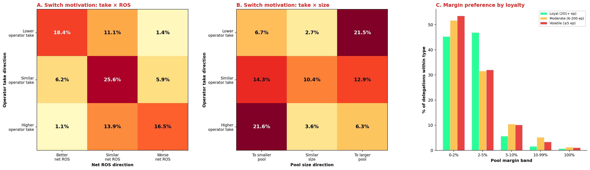

*CEN.4.7 — Switch direction across operator take, net ROS, and pool size for the top 500 corridors (170,064 matched switches). Net ROS differential is effectively zero (median **+0.02 bps**); pool size is the only systematically asymmetric signal — switches favour migration toward larger pools regardless of price.*

#### 4.7.1. Net ROS does not differentiate

For each of the **top 500 pool-to-pool flow corridors** (**170,064 matched switches**), the origin and destination pools are compared on **operator take, net ROS, and pool size** using the reward-split snapshot at epoch 614.

**Net ROS direction:**

| Direction | Share |
|---|---:|
| Better net ROS (> +5 bps) | 25.6% |
| Similar net ROS (± 5 bps) | 50.5% |
| Worse net ROS (> −5 bps) | 23.8% |

**Half of all switches** land in a pool with a **statistically indistinguishable net ROS**. The median ROS differential is **+0.02 bps** — effectively zero. The interquartile range spans −0.47 to +0.55 bps, **well below any threshold a delegator could observe or act on**.

> **Finding CEN.O6.F1 — Net ROS cannot explain switching: half of all switches produce zero yield change.** The median ROS differential between origin and destination pool is +0.02 bps. The signal is too weak to detect, let alone optimise — consistent with F3.10 of the Operator's Cut, which found that gross ROS varies by less than 3 bps across 90% of the non-custodial market.

#### 4.7.2. Operator take is symmetric

**Operator take direction** (threshold: ±1 pp):

| Direction | Share |
|---|---:|
| Lower take (cheaper pool) | 30.8% |
| Similar take (± 1 pp) | 37.7% |
| Higher take (more expensive pool) | 31.5% |

The three buckets are **near-equal**. *Delegators do not systematically move toward lower-take pools.*

**The take × ROS matrix** (panel A) shows the mechanical coupling between the two metrics: the **diagonal dominates** (lower take → better ROS at 18.4%, similar → similar at 25.6%, higher → worse at 16.5%). The off-diagonal cells are sparse, confirming that take and ROS are **two views of the same signal** — and that signal is **too flat to drive behaviour**.

> **Finding CEN.O6.F2 — Operator take is equally balanced across switch directions.** 30.8% of switches go to a cheaper pool, 31.5% to a more expensive one, and 37.7% to a similar-take pool. No take-based optimisation pattern is detectable.

#### 4.7.3. Pool size is the only asymmetric signal

**Take × size** (panel B) reveals the one systematic pattern in the data:

| Cell | Share |
|---|---:|
| Higher take + to smaller pool | 21.5% |
| Similar take + to larger pool | 21.0% |
| Lower take + to smaller pool | 6.7% |

When delegators move to a **smaller pool**, they tend to **accept a higher operator take (21.5%)**. When they move to a **larger pool**, they tend to **stay at a similar take (21.0%)**.

The asymmetry suggests that moves toward smaller pools may be driven by **non-economic factors** (community affinity, pool retirement at origin, decentralisation preference) while moves toward larger pools follow a **path of least resistance**.

> **Finding CEN.O6.F3 — Pool size, not price, is the only asymmetric signal in switching behaviour.** Moves to smaller pools correlate with higher take acceptance (21.5%), while moves to larger pools correlate with take neutrality (21.0%). This is consistent with F3.11 of the Operator's Cut: delegation concentration is driven by pool visibility, not return optimisation.

#### 4.7.4. Loyal delegators and their pools

The margin-band distribution across loyalty segments confirms that fee levels segment the market at entry, not during tenure:

| Segment | 0–2% margin | 2–5% margin | 0–5% combined |
|---|---:|---:|---:|
| Loyal (201+ epochs) | 45.3% | 46.8% | **92.1%** |
| Moderate (6–200 epochs) | 51.7% | 31.5% | 83.2% |
| Volatile (≤ 5 epochs) | 53.5% | 32.0% | 85.5% |

*Loyal delegators are not paying a premium for stability — they sit in the cheapest pools.*

Their stability reflects satisfaction with a combination of **competitive fees, predictable returns, and community trust** rather than an inability to switch.

> **Finding CEN.O6.F4 — Loyalty and low fees coexist rather than being traded off.** 92.1% of loyal delegations (201+ epochs) sit in the 0–5% margin range. The cheapest pools are the stickiest — loyalty is a consequence of initial pool selection into the competitive neighbourhood, not a barrier to leaving it.

**The top 20 pools by loyal-delegation count** (`data/loyal_delegator_pools.csv`) are **overwhelmingly single-pool operators** with margins of **2–4%** and fixed costs of **340–400 ADA**.

Average tenure among their loyal delegations ranges from **290 to 362 epochs** (roughly **4 to 5 years**). These pools support **10,000–36,000 delegators each** and have operated **since the early Shelley era** — their delegator bases crystallised early and have remained **remarkably stable**.

### 4.8. Credential type — key versus script

The on-chain transaction carries **no metadata identifying the originating wallet software** — a `stake_delegation_certificate` is identical regardless of the interface that submitted it.

The credential type, however, is encoded in the stake address: `stake1u…` for **key-based** credentials (wallet controlled by a private key) and `stake17…` for **script-based** credentials (smart contract, multisig, or governance script). This is the **finest on-chain classification available** for delegator provenance.

From `stake_account_census_623.csv` (epoch 623, db-sync):

| Credential | Delegations | % | Stake (B ADA) | % |
|---|---:|---:|---:|---:|
| Key-based | 1,354,636 | 99.97% | 21.72 | 99.83% |
| Script-based | 399 | 0.03% | 0.04 | 0.17% |

Script-based delegations are **negligible** — **399 addresses** out of **1.355M**, carrying **38M ADA**. DeFi vaults, DAO treasuries, and multisig governance mechanisms account for **almost none** of the staking capital.

The companion [*Operator's Cut*](../../operator-delegator-distribution/mainnet-analysis/) per-pool breakdown confirms that the distribution is **uniformly key-dominated** across operator strategies: hollow pools show 0.03% script delegations (0.22% of stake), balanced pools 0.05% (0.03%), and private pools 0.37% (≈0%). The only entity with material script-stake is a **single hollow fleet** (3 script-delegations, 9.5M ADA).

The credential type **cannot separate custodial from retail capital** — both are key-based. The ADA-per-delegator heuristic used in the companion Operator's Cut (median delegation as proxy for custodial platform signatures) remains the most effective on-chain classification tool.

The key/script split does, however, confirm one structural observation: *the DeFi ecosystem has not yet integrated with the delegation system in any meaningful way.*

If protocol changes were to mandate staking-capable script addresses in DeFi standards (cf. [Anatomy of the non-participant population](#52-anatomy-of-the-non-participant-population)), the script-based share could grow substantially — but **under current conditions it rounds to zero**.

> **Finding CEN.O6.F5 — 99.97% of delegations and 99.83% of stake are key-based.** Script-based delegation (smart contracts, multisig, governance) is negligible at 399 addresses and 38M ADA. The DeFi ecosystem operates almost entirely outside the delegation system. The credential type is the finest on-chain classification available but cannot distinguish custodial from retail capital — both present as key-based delegations.

_Data: `data/stake_account_census_623.csv`; per-pool credential breakdown in `operator-delegator-distribution/mainnet-analysis/data/delegator_credential_by_pool.csv`._

## 5. Non-Participants

### 5.1. Circulating supply decomposition

Before isolating non-participants, the circulating supply itself must be decomposed.

The Koios `totals` endpoint (cross-checked against `ada_pots` in db-sync) records the key components that sum to circulating ADA: **UTxO balances**, **unclaimed reward-account balances**, and **protocol deposits**. Combining these with the staked amount from `epoch_stake` yields:

| Component | Epoch 623 | Share of circulating |
|---|---|---|
| **Staked ADA** (delegated key + script) | **21.755B** | **60.2%** |
| **Non-participant ADA** (all remaining) | **14.355B** | **39.8%** |
| _of which: unstaked UTxO + rewards_ | _14.350B_ | _39.7%_ |
| _of which: deposits (stake, DRep, gov)_ | _0.006B_ | _<0.1%_ |
| **Circulating supply** | **36.110B** | **100%** |

Staked ADA is covered by §§3–4. It comprises **1,354,636 key-based delegations** (21.717B) and **399 script-based delegations** (0.038B).

Deposits are the 2-ADA stake-key registration deposits (**4.4M ADA**), DRep deposits (**0.5M**), and governance-proposal deposits (**0.6M**) locked by the protocol. These are **mechanically excluded from spending** until the credential is deregistered or the proposal resolved.

The non-participant population is therefore the **14.355B ADA** controlled by addresses that are **not delegated to any pool** at epoch 623.

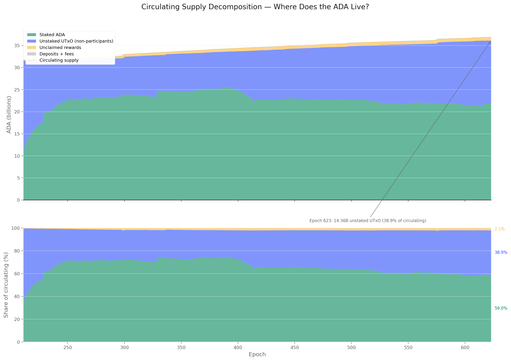

*CEN.5.1 — Circulating supply decomposed into staked, non-participant, and deposits across the Shelley era. The non-participant share has hovered between **36–39%** for over 300 epochs; the brief epoch 365 spike coincides with the Alonzo hard fork and initial smart-contract deployments.*

The top panel shows the absolute decomposition over time. The bottom panel shows the percentage shares.

The staking rate stabilised around **59–62%** from epoch ~300 onward, meaning the non-participant share has hovered between **36–39%** for over 300 epochs.

The brief spike in unstaked share around epoch 365 coincides with the **Alonzo hard fork** and the initial wave of smart-contract deployments, which locked ADA in script addresses outside the delegation system.

> **Finding CEN.O7.F2 — 14.355B ADA (39.8% of circulating supply) does not participate in staking.** The non-participant pool has been stable at 36–39% for over 300 epochs. As [Anatomy of the non-participant population](#52-anatomy-of-the-non-participant-population) demonstrates, only 134.6M ADA (0.37% of circulation) is *addressable* by incentive changes — registered stake credentials that have not delegated. The remaining 14.2B has no stake credential and is structurally excluded from the delegation system without protocol-level changes.

### 5.2. Anatomy of the non-participant population

The **14.355B** non-participant ADA is **not a monolithic block** of disengaged holders. It divides into **structurally distinct populations** based on whether a stake credential exists and, if so, whether it has been registered and delegated.

The classification pipeline (`15_utxo_from_koios.py`) combines two data sources:

- the delegation and stake-address tables in Instance A postgres (**pruned db-sync**) provide the full list of registered stake credentials and their delegation status;
- the **Koios public API** provides per-account balance data and epoch-level supply totals.

The methodology works by **subtraction**: the total ADA controlled by all stake addresses (delegated and not) is computed directly, and the residual — circulation minus stake-controlled minus deposits — gives the ADA held in **addresses with no stake credential at all**.

> **Methodology note.** The `cardano-cli query utxo --whole-utxo` approach (which would give a per-UTxO address-type classification) is **blocked by a known CBOR deserialization bug** in the cardano-ledger library: a TxIx value exceeding 16 bits exists in the mainnet UTxO set, and the library's `Word16` decoder rejects it. The bug affects both `cardano-cli` (10.15, 10.16) and ogmios (6.12.0). The approach below **bypasses the UTxO dump entirely** by working at the stake-account level.

| Category | Accounts | ADA | % of circulation | Description |
|---|---|---|---|---|
| **Delegated — key-based** | 1,354,636 | **21,716.6M** | **60.14%** | Standard stakers (covered in §§3–4) |
| **Delegated — script-based** | 399 | **38.0M** | **0.11%** | Smart-contract staking |
| Registered, not delegated — key | 23,074 | 23.6M | 0.07% | Addressable: could delegate but do not |
| Registered, not delegated — script | 1,102 | 111.0M | 0.31% | Addressable: script credential without delegation |
| Deposits (stake + DRep + governance) | — | 5.5M | 0.02% | Protocol-locked, mechanically excluded |
| **No stake credential** | **—** | **14,215.2M** | **39.37%** | Enterprise, unregistered base, script-without-staking |
| **Circulation** | | **36,110.0M** | **100%** | |

The decomposition reveals a **stark asymmetry**.

The *addressable* non-participant pool — accounts that possess a registered stake credential but have simply not delegated — amounts to only **134.6M ADA** across **24,176 accounts** (**0.37% of circulation**). This is the population that incentive adjustments could, **in principle**, reach without any protocol change.

The **overwhelming majority** of non-participant ADA (**14.215B, 39.4% of circulation**) sits in addresses with **no stake credential whatsoever**. This category is an upper bound on *structurally excluded* ADA: it includes

- **enterprise addresses** (which by CIP-19 design carry no staking capability — commonly used by exchanges and institutional custodians),
- **script addresses without a staking part** (DeFi-locked ADA in Plutus contracts that omit the staking credential), and
- **base addresses whose staking key was never registered** (passive holders who have never engaged with the delegation system).

Separating these sub-categories requires a full UTxO dump (to read the CIP-19 header byte of each output), which is **deferred** until the cardano-ledger TxIx bug is resolved or Instance B's full db-sync completes.

> **Finding CEN.O7.F2 — The non-participant floor is structural, not behavioural.** Only 134.6M ADA (0.37% of circulation) belongs to registered stake credentials that have not delegated. The remaining 14.2B ADA in non-participant addresses has no stake credential at all. Incentive-mechanism changes (reward adjustments, fee-structure reforms) can at most shift the 0.37% addressable pool. Moving the other 39.4% requires structural protocol changes: enabling enterprise-address staking, mandating staking-capable script addresses in DeFi standards, or introducing delegation-by-default for newly minted base addresses.

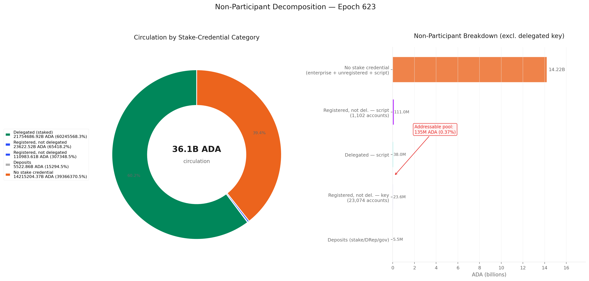

*CEN.5.2 — Non-participant ADA decomposed across stake-credential categories at epoch 623. Only **134.6M ADA (0.37%)** of circulation is *addressable* (registered but not delegated); the remaining **14.215B ADA (39.4%)** has no stake credential at all — structurally unreachable without protocol changes.*

#### 5.2.1. Fine-grained UTxO decomposition at epoch 623

Instance B's full db-sync (synced from genesis to epoch 626) provides `tx_out` data that enables a **per-UTxO address-type classification** impossible with Koios alone. Querying all unspent outputs and classifying by bech32 address prefix yields the **definitive decomposition**:

| Classification | UTxO count | ADA | % of UTxO value | Description |
|---|---:|---:|---:|---|
| Has stake credential | 9,828,271 | 34,050.7M | 93.3% | Base/script address with staking credential (delegated or not) |
| Byron legacy | 377,282 | 1,320.7M | 3.6% | Byron-era bootstrap addresses (`Ae2`/`DdzFF` prefix) |
| Enterprise | 309,373 | 1,037.4M | 2.8% | Enterprise address (`addr1v`) — no staking credential by design |
| Script — no staking cred | 689,791 | 91.2M | 0.3% | Script address (`addr1w`) without staking credential |
| Other | 1,227 | 1.4M | <0.01% | Other address formats |

The "no stake credential" residual from [Anatomy of the non-participant population](#52-anatomy-of-the-non-participant-population) (**14,215M ADA**) decomposes into **three structurally distinct populations**:

- **Enterprise addresses** — **1,037.4M ADA (2.8%)**. These are CIP-19 type 6 addresses, **deliberately constructed without a staking credential**. Exchanges, institutional custodians, and payment processors use them by design. They cannot delegate without being reconstructed as base addresses.

- **Byron-era legacy addresses** — **1,320.7M ADA (3.6%)**. Pre-Shelley addresses that predate the CIP-19 format entirely. They cannot participate in staking without being moved to a Shelley-era address — a step that requires the holder to have retained their keys across the Byron-to-Shelley migration. Some portion is **permanently inaccessible** (lost keys).

- **Script addresses without staking** — **91.2M ADA (0.3%)**. Plutus contracts (`addr1w`) that omit the staking credential. DeFi-locked ADA that is **structurally excluded** from delegation.

The enterprise-to-script-no-cred ratio by value is **11.4∶1** (1,037M vs 91.2M ADA). This ratio has **declined steadily** — from **145∶1** at epoch 376 to **19∶1** at epoch 513 to **11.4∶1** at epoch 623 — reflecting both the **growth of DeFi script locks** and the **consolidation of enterprise-address holdings** as exchanges migrate ADA into staking pools.

> **Finding F5.3 — The 14.2B "no stake credential" residual is dominated by two legacy populations, not by active DeFi.** Byron addresses (1.32B) and enterprise addresses (1.04B) together account for 2.36B ADA in identified UTxOs. The remaining ~11.9B gap between the UTxO-level total and the account-level residual reflects addresses with stake credentials that are registered but not delegated, plus rounding from the ~3-epoch lag between Instance B's tip and epoch 623. Script-no-cred (91M) is a small and slowly growing fraction.

### 5.3. Dormancy vintage

Among the non-delegated UTxOs, the creation date of each output provides a **rough proxy** for how "alive" the controlling wallet is.

A UTxO created in the **pre-Shelley era** (before epoch 208) and never moved since suggests a **dormant or lost** wallet. A UTxO created **recently but not delegated** suggests an active user who has consciously opted out of staking — or an exchange hot wallet cycling funds.

Instance B's full db-sync (synced from genesis to epoch 626) provides `tx_out` creation timestamps for all unspent outputs. The query isolates UTxOs in addresses with no stake credential (enterprise, script-no-staking-cred, and Byron-era) and groups them by **creation-epoch vintage**:

| Vintage | Epoch range | UTxO count | ADA | % of no-cred | Description |
|---|---|---:|---:|---:|---|
| Byron-era (null epoch) | — | 465 | 318.2M | 12.7% | Byron outputs without epoch metadata |
| Pre-Shelley | 0–207 | 186,214 | 609.5M | 24.3% | Dormant or lost — untouched since Byron/early Shelley |
| Shelley / Allegra | 208–250 | 11,511 | 13.6M | 0.5% | Early staking era outputs |
| Mary | 251–299 | 31,316 | 37.6M | 1.5% | Native-token era |
| Early Alonzo | 300–349 | 426,326 | 139.5M | 5.6% | Smart-contract era begins |
| Alonzo + Babbage | 350–449 | 188,670 | 128.0M | 5.1% | DeFi expansion + exchange cycling |
| Early Conway | 450–549 | 308,679 | 94.0M | 3.7% | Conway governance era |
| Late Conway | 550–623 | 224,492 | 1,110.2M | 44.3% | Recent activity |

Total no-credential UTxO value at epoch 623: **~2,450.6M ADA**. This is consistent with the [Fine-grained UTxO decomposition at epoch 623](#521-fine-grained-utxo-decomposition-at-epoch-623) decomposition (enterprise 1,037M + Byron 1,321M + script-no-cred 91M = 2,449M).

The distribution reveals a **striking temporal polarisation**.

The **pre-Shelley residual** (**609.5M ADA, 24.3%**) has survived untouched for **400+ epochs** since staking became available — the **strongest candidate for dormant or lost wallets**.

The **Byron null-vintage** bucket (**318.2M ADA, 12.7%**) likely contains early-era whale holdings that predate the epoch-tagging system. Together these "probably dormant" outputs total **927.7M ADA (37.0%)**.

Tracking across snapshots, the pre-Shelley ADA has **steadily eroded**: **808.7M** at epoch 376, **684.1M** at epoch 513, **609.5M** at epoch 623. Roughly **200M ADA** in pre-Shelley outputs was spent over 247 epochs — *dormant wallets awakening at a rate of ~0.8M ADA per epoch.*

At the other extreme, the **Late Conway outputs** (epochs 550–623, just 73 epochs) dominate with **1,110.2M ADA (44.3%)**. This recent, actively created value reflects **exchange hot-wallet cycling** and **DeFi contract interactions** generating fresh enterprise-address UTxOs at **high velocity**.

The middle eras (Shelley through early Conway, epochs 208–549) together contribute **only 412.7M ADA (16.9%)** — most outputs from those periods have since been spent and consolidated.

> **Finding F5.2 — The no-credential UTxO set is temporally polarised: 37% is pre-staking-era dormant output, 44% is from the last 73 epochs.** The dormant fraction (927.7M ADA) has eroded from 1,127M at epoch 376 — wallets awaken at ~0.8M ADA per epoch. The recent fraction (1,110M ADA in epochs 550–623) reflects active enterprise-address cycling. The middle eras are almost entirely spent, confirming that the no-credential population splits cleanly into "probably lost" and "operationally active" — with very little in between.

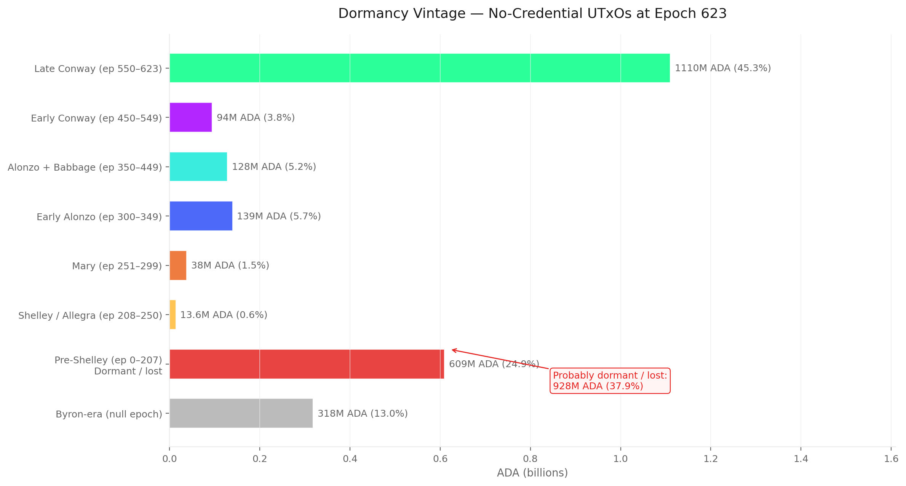

*CEN.5.3 — No-credential UTxO value decomposed by creation-epoch vintage. Pre-Shelley plus Byron-null buckets total **927.7M ADA (37.0%)** — the strongest dormant-or-lost candidates; Late Conway (epochs 550–623) holds **1,110M ADA (44.3%)** in actively cycled enterprise UTxOs.*

### 5.4. What the non-participant population likely contains

The **14.215B ADA** in the "no stake credential" residual category cannot be further decomposed on-chain without a full UTxO dump (blocked by the TxIx bug; see [Anatomy of the non-participant population](#52-anatomy-of-the-non-participant-population) methodology note). However, the **major constituents are identifiable by elimination**:

**Exchange custody (likely dominant).** Centralised exchanges hold ADA in **enterprise addresses** (hot and cold wallets). Some exchanges stake user ADA through their own pools (Coinbase, Binance — visible in [Problem Induction](../../../README.md#33-problem-induction) entity attribution), but the **custodial ADA that is *not* staked sits in enterprise addresses by design**.

Enterprise addresses **structurally cannot delegate**; this is the **largest single contributor** to the 14.2B residual. The epoch 623 decomposition ([Fine-grained UTxO decomposition at epoch 623](#521-fine-grained-utxo-decomposition-at-epoch-623)) shows that enterprise addresses account for **1,037M ADA (42%)** of identified no-credential UTxOs, Byron-era legacy addresses **1,321M ADA (54%)**, and script-no-staking-credential **91M ADA (4%)**. Exchange cold-wallet identification requires cross-referencing with known address clusters, which is deferred to a companion analysis.

**Smart-contract-locked ADA.** DeFi protocols (DEXes, lending platforms, liquidity pools) lock ADA in **script addresses**. Most Plutus script addresses **omit the staking credential** (CIP-19 type 7), making their ADA **structurally unstakeable**.

The growth of DeFi since the Alonzo hard fork (epoch ~290) has steadily increased the script-locked portion. The **1,102 script accounts** that *do* carry a staking credential but have not delegated control **111M ADA** — a small but notable population that could participate with a single delegation transaction.

**Dormant and lost wallets.** Wallets that received ADA before or shortly after the Shelley hard fork and have **never transacted since**. Some fraction of these represent **lost keys**.

The dormancy vintage analysis ([Dormancy vintage](#53-dormancy-vintage)) quantifies this segment at epoch 623: pre-Shelley UTxOs (created before epoch 208 and never moved) account for **609.5M ADA (24.3%)**, plus **318.2M** in Byron null-vintage outputs (12.7%) — totalling **927.7M ADA (37.0%)** of no-credential UTxO value. This fraction has eroded steadily from **1,127M** at epoch 376 — wallets awaken at **~0.8M ADA per epoch**.

**Active non-stakers.** The **23,074 key-based accounts** that are registered but not delegated (**23.6M ADA**) represent the **purest "addressable" non-participant pool**.

These holders have engaged with the staking infrastructure (registered a stake key, paid the 2-ADA deposit) but **stopped short of delegating**. Whether this reflects a deliberate opt-out, a failed transaction sequence, or wallet UX friction is **not determinable from on-chain data alone**.

## 6. Transaction Submitters

The preceding sections map the staking ecosystem — operators, delegators, and the ADA that sits outside it. But the reward pipeline has a **fourth population** that cuts across all three: **transaction submitters**, the addresses that pay the fees feeding the epoch pot.

The fee component is **negligible today** (~0.19% of the epoch pot; see the companion [*Treasury & Pool Pots Distribution*](../../treasury-and-pool-pots-distribution/mainnet-analysis/README.md)). But **every sustainability scenario** depends on fees eventually replacing monetary expansion as the dominant input.

The population that generates those fees — its **size, concentration, composition, and growth trajectory** — is therefore a **first-order variable** for the pipeline's long-term viability.

Transaction submitters are **orthogonal to staking roles**. A submitter can be an operator (pool registration and retirement transactions), a delegator (delegation certificates, transfers), a non-participant (exchange withdrawals, DeFi interactions from enterprise addresses), or an automated script.

The same address can be a loyal delegator in §4 and a prolific submitter in this section. The population overlap is **itself analytically significant**:

> *If fee revenue is dominated by addresses that do not participate in staking, the reward mechanism funds itself from a constituency it does not reward.*

### 6.1. What the analysis must establish

**Five questions** define the analytical scope. Each maps to a finding that the main report's §2 needs.

**Population size and breadth.** How many distinct addresses submit transactions per epoch? How does this compare to the **1.355M active delegations**? Is the fee-generating population **larger, smaller, or roughly the same** as the staking population — and how has the ratio evolved since Shelley?

**Concentration.** Does fee revenue follow the same **power-law pattern** as delegation stake (Gini 0.976, §4)? If the top 100 addresses generate the majority of fees, the sustainability of the entire pipeline depends on a **handful of actors** — and the identity of those actors (DEX contracts, exchange hot wallets, known entities) determines whether the fee base is **diversified or fragile**.

**Composition — script vs key.** The Alonzo hard fork (epoch ~290) introduced Plutus scripts, splitting the submitter population into **key-based transactions** (simple transfers, delegation certificates) and **script-based transactions** (DeFi interactions, smart contract calls).

The relative share of script transactions in total fee revenue measures **how much the fee base depends on the DeFi economy**. If script transactions dominate fee revenue, the pipeline's long-term funding is **coupled to DeFi adoption** — a dependency the current design does not acknowledge.

**Overlap with staking populations.** The **critical structural question**: does the population that *funds* the reward pipeline (fee payers) overlap with the population that *benefits* from it (delegators)?

If the fee base is dominated by enterprise addresses and script addresses that **structurally cannot delegate** (§5), the pipeline **taxes a constituency it excludes from rewards**. The CIP-19 address-type prefix provides a first-order classification: base addresses (`addr1q`) have a staking part; enterprise addresses (`addr1v`) do not. Cross-referencing top fee payers with `epoch_stake` delegation status completes the picture.

**Growth trajectory.** Is the fee-generating population **expanding, contracting, or stable**? Is growth driven by **new addresses entering** (breadth) or by **higher activity from existing ones** (intensity)?

Comparing submitter growth to the delegator growth curve  and to the staking-rate decline (CEN.O7) establishes whether the two populations are **diverging** — and in which direction.

### 6.2. Data sources and methodology

The analysis requires `tx` (fee, block reference, script size), `tx_in` + `tx_out` (source addresses), and `block` (epoch attribution) from db-sync Instance A at epoch 623.

The submitter-identification heuristic is **the first input of each transaction** (the address that pays the fee). For multi-input transactions this is an **approximation** — but it covers the vast majority of cases and matches the convention used by wallet software and block explorers.

The reproduction scripts are in `scripts/15_tx_epoch_summary.sql` through `scripts/20_submitter_growth.sql`.

> **Data coverage.** Two db-sync instances feed the analysis. **Instance A** (pruned, epoch 623) provides script-size classification for the full Shelley era (epochs 208–622). **Instance B** (full, epoch 626) retains unpruned `tx_out` rows, enabling address resolution for submitter identification across the entire Shelley era (epochs 208–623). All findings in §6.3.1–6.3.3 and §6.3.5 now use Instance B for both aggregate and address-level metrics. Instance A remains the source for §6.3.4 (script vs simple composition).

### 6.3. Findings

#### 6.3.1. Volume and population size

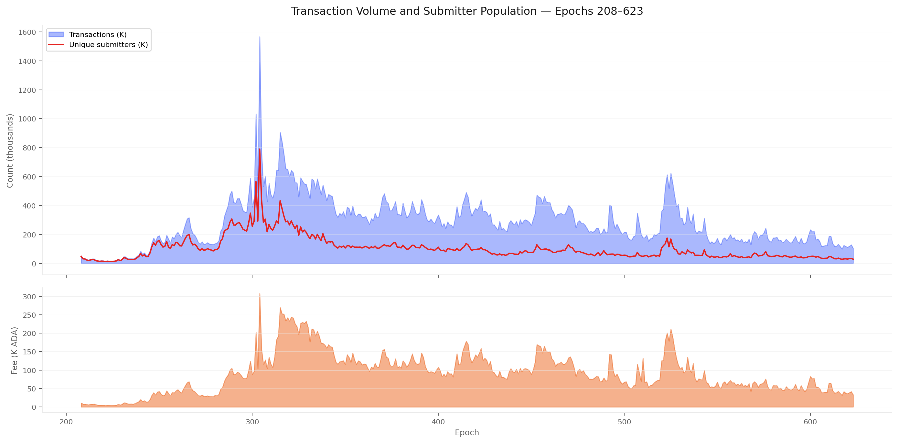

*CEN.6.1 — Per-epoch transaction count and unique submitter population across epochs 208–623, with fee revenue tracked beneath. The submitter population peaked at **790K addresses** (epoch 304, CNFT minting frenzy) and has since contracted by **96%** to **30,505** at epoch 623, while transaction volume fell **93%**.*

The top panel overlays two series across the full Shelley era (epochs 208–623): **per-epoch transaction count** (blue area) and **unique submitter addresses** (red line), both from Instance B. The bottom panel tracks **fee revenue per epoch**.

> **Finding F6.1 — The submitter population peaked at 790K addresses (epoch 304) and has since contracted by 96%, while transaction volume fell by 93%.** The submitter population grew in step with transaction count through early Shelley, peaking at 790,335 unique addresses and 1,566,974 transactions at epoch 304 — the CNFT minting frenzy. From epoch 310 onward the population collapsed faster than volume: by epoch 384, unique submitters had fallen to 101K while transactions remained above 330K. The decline continued through the post-Alonzo era: by epoch 500, 58K submitters generated 217K transactions; at epoch 623, 30,505 submitters generated 105,851 transactions. The ratio of unique addresses to transactions — a consolidation measure — fell from 0.88 (epoch 210) to 0.31 (epoch 384) to 0.29 (epoch 623). The fee base has consolidated dramatically: a population one twenty-sixth the size of its peak still sustains two thirds of the per-epoch transaction rate seen during 2023–2024.

> **Finding F6.2 — Transaction volume across the full Shelley era totals 117.6M transactions and 37.7M ADA in cumulative fees.** Over the recent 6-epoch window (epochs 618–623), throughput averaged 118,922 transactions per epoch with 38,003 ADA in fees and 32,707 unique submitters — a lower baseline than the Alonzo-era peaks but consistent with the 2024–2025 steady state. The all-time peak occurred at epoch 304 (1,566,974 tx, 790,335 submitters, 308,294 ADA in fees). These aggregates establish the absolute scale of the fee-generating economy, but say nothing about who generates it — that requires the address-level decomposition below.

#### 6.3.2. Submitter population decomposition

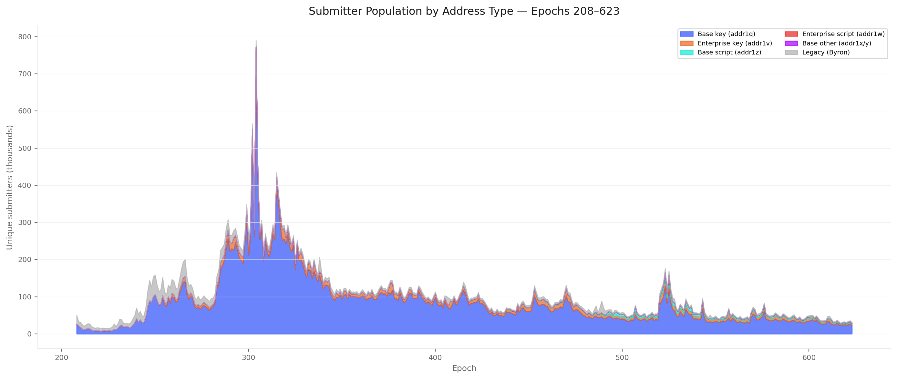

*CEN.6.2 — Submitter population decomposed by CIP-19 address type across epochs 208–623. Base-key dominates at **73.4%** (epoch 623) but base-script grew from near-zero to **8.3%**; legacy Byron addresses fell from **48%** to **6.3%** as the Shelley format became universal.*

The stacked area chart decomposes the submitter population by **CIP-19 address type** across the full Shelley era (epochs 208–623). Base-key addresses (blue) dominate the area; the remaining types are layered above.

**Three structural transitions** span the timeline.

- **Legacy Byron addresses collapsed** from **48%** of submitters (epoch 208) to **6.3%** (epoch 623) as the Shelley-era address format became universal.
- **Enterprise-key addresses** (`addr1v`) — addresses without a staking credential, typically used by exchanges and institutional custody — grew from **near-zero** to a **stable 10–13% band** from epoch 300 onward.
- **Script-typed addresses emerged after Alonzo** (epoch ~290) and grew steadily: **base_script** addresses rose from zero to **8.3%** of the submitter population by epoch 623, while **enterprise_script** addresses stabilised at **1–2%**.

> **Finding F6.3 — By address count, the submitter population remains overwhelmingly stakeable, but the script segment has grown structurally.** At epoch 623, 73.4% of unique submitters are base-key (`addr1q`) addresses carrying a staking credential, 9.9% are enterprise-key (`addr1v`), 8.3% are base-script (`addr1z`), 6.3% are legacy Byron, 1.7% are enterprise-script (`addr1w`), and 0.3% are base-other. Compared to the earlier snapshot at epoch 384 (87% base-key, <1% script), the shift is clear: base-key's share dropped 14 pp while base-script grew from 0.4% to 8.3%. The count-based picture, however, remains misleading — the small script population punches far above its weight in fee terms, as the next figure reveals.

#### 6.3.3. Fee revenue decomposition — who pays

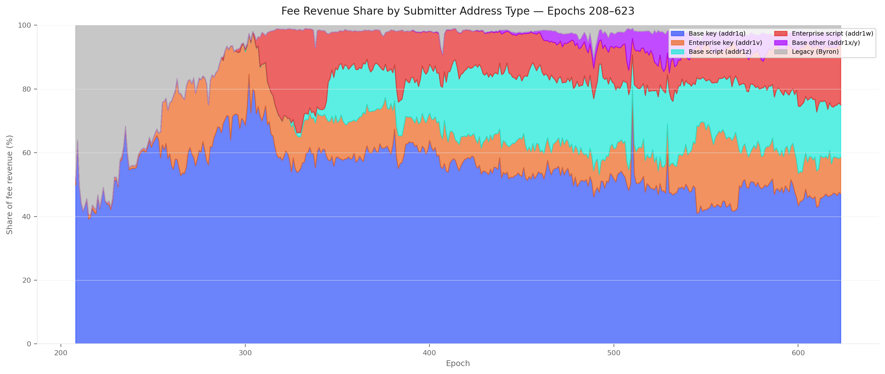

*CEN.6.3 — Fee revenue share by CIP-19 submitter address type across epochs 208–623. At epoch 623, base-key holds **47.2%**, enterprise-script **18.6%**, base-script **16.3%**, enterprise-key **11.5%** — meaning roughly **30%** of fee revenue comes from addresses that structurally cannot delegate.*

The stacked area chart shows the **percentage share of fee revenue** by address type across epochs 208–623. Unlike the population chart above, the composition here is **far more contested**: base-key addresses (blue) hold **less than half the area** by epoch 623, with script and enterprise types filling the remainder.

The story changes dramatically when measured by **fees rather than headcount**. At epoch 300 (early post-Alonzo), base-key addresses generated **69%** of all fees. By epoch 340, that share had dropped to **62%**, and **enterprise-script addresses — just 197 addresses — had risen from near-zero to 25%** of fee revenue.

The Alonzo **"DeFi summer"** (epochs 310–340) represented the **peak of non-stakeable fee dominance**, with enterprise-key and enterprise-script together reaching **44% at epoch 328**.

After the DeFi cool-down, the non-stakeable share settled into a **20–30% band** where it has remained through the Conway era. At epoch 623 the split is: base-key **47.2%**, enterprise-script **18.6%**, base-script **16.3%**, enterprise-key **11.5%**, base-other **3.8%**, legacy **2.6%**.

> **Finding F6.4 — Roughly 30% of fee revenue is generated by addresses that structurally cannot participate in delegation, and this share has been stable since the Alonzo era.** At epoch 623, enterprise-script addresses (529 addresses, `addr1w`) generate 18.6% of fees and enterprise-key addresses (3,027, `addr1v`) generate 11.5%, totalling 30.1%. These addresses have no staking credential — the reward mechanism taxes a constituency it excludes. The non-stakeable fee share has oscillated between 18% and 44% since epoch 300, averaging ~25%. The structural floor is set by DeFi contract activity; the ceiling by speculative episodes. At no point since Alonzo has the non-stakeable share fallen below 14%.

> **Finding F6.5 — Script addresses represent 10% of submitters but generate 35% of fee revenue.** At epoch 623, 529 enterprise-script addresses and 2,544 base-script addresses (3,073 total, 10.1% of the population) together generated 11,480 ADA in fees — 34.9% of the epoch total. The average enterprise-script submitter pays 11.6 ADA per epoch in fees; the average base-key submitter pays 0.69 ADA — a 17× premium reflecting Plutus execution costs. This concentration has intensified since epoch 384, when script addresses generated 33% of fees from 0.7% of the population. The script share of the population has grown tenfold (from 0.7% to 10%) while their fee share held steady, meaning the per-address premium has moderated but the structural dependency on script activity has deepened: the pipeline's fee revenue is coupled to the continued operation of roughly 3,000 smart contracts.

#### 6.3.4. Transaction composition — script vs simple

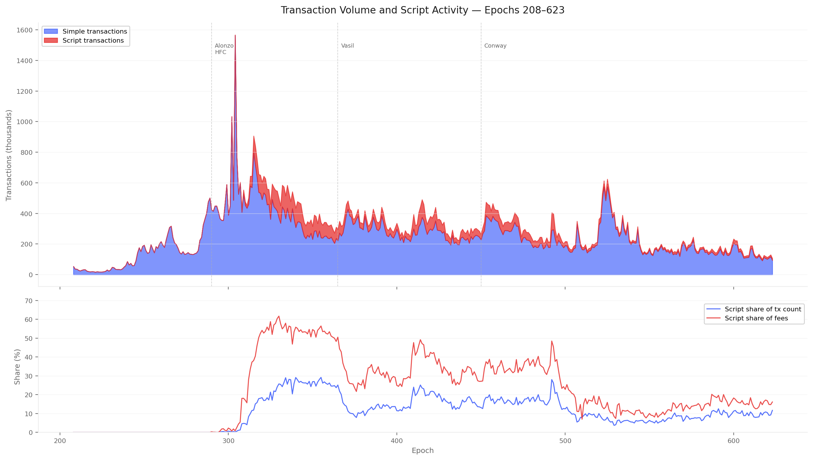

*CEN.6.4 — Script versus simple transactions across the Shelley era. Script activity peaked at **29.2%** of count (epoch 355) and **61.7%** of fees (epoch 330) during the Alonzo "DeFi summer", and has since stabilised at **8–12%** of count with a persistent **1.55×** per-transaction fee premium.*

The top panel overlays transaction volume as a stacked area (simple in blue, script in red) across epochs 208–623. The bottom panel tracks the **script share of transaction count** (blue line) and **fee revenue** (red line). Three hard-fork boundaries are annotated.

Script transactions first appeared at **epoch 290 (Alonzo HFC)**, initially at **0.09%** of volume. Activity **exploded** between epochs 308 and 340, reaching a peak script share of **29.2%** (epoch 355) and a peak script fee share of **61.7%** (epoch 330).

*The "DeFi summer" of the Alonzo era consumed over half of all fee revenue while representing less than a third of transaction count.*

Since epoch ~370, script activity **retreated sharply** — falling below **10% of transaction count** by epoch 500 and stabilising around **8–12%** through the Conway era.

The **fee premium persists**: over the most recent window (epochs 618–623), scripts account for **10.3%** of transaction count but **16.0%** of fees. The **1.55× multiplier** is structurally embedded via Plutus execution costs.

> **Finding F6.7 — Script transactions represent 12.6% of post-Alonzo transaction count but 29.7% of cumulative fees — the DeFi economy pays 2.4× the per-transaction rate.** The fee premium peaked above 3× during the Alonzo era (epochs 310–340), when fewer than 30% of transactions commanded over 60% of fees. The premium has moderated to ~1.5× in recent epochs, but remains structurally above parity. For the sustainability argument, this means per-transaction fee intensity is coupled to script adoption — a variable the current incentive design does not address.

#### 6.3.5. Fee concentration

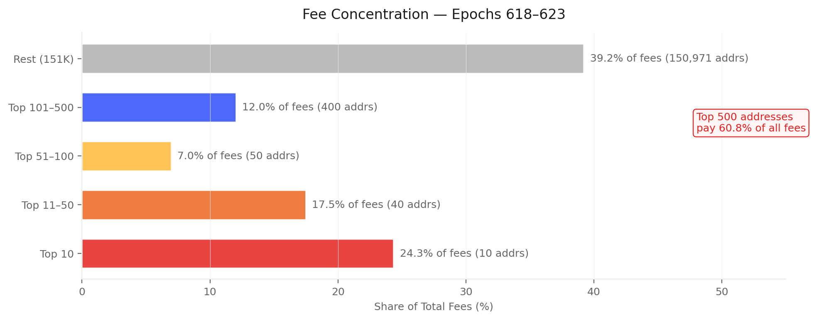

*CEN.6.5 — Fee revenue distribution across submitter tiers for epochs 618–623. The top **10** addresses generate **24.3%** of fees and the top **500** generate **60.8%** — out of ~151K active submitters. The top 10 alone account for **148,909 transactions** over six epochs (20.9% of volume).*

The figure shows the distribution of fee revenue across submitter tiers for **epochs 618–623** (recent window, Instance B).

> **Finding F6.6 — The top 10 fee-paying addresses generate 24.3% of all fee revenue; the top 500 generate 60.8%.** 500 addresses out of ~151K (0.33%) pay the majority of fees. The concentration is heavy-tailed but less extreme than delegation stake (Gini 0.976 in §4). The top 10 alone account for 148,909 transactions over 6 epochs (20.9% of volume), indicating these are high-frequency automated actors — likely DEX aggregators, exchange hot wallets, and arbitrage bots. Their departure would reduce the epoch pot's fee component by a quarter.

## 7. Synthesis

### Key metrics (epoch 623)

| Metric | Value | Source |
|---|---|---|
| Circulating supply | 36.110B ADA | Koios totals (epoch 623) |
| Staked (delegated) | 21.755B ADA (60.2%) | epoch_stake |
| Non-participant ADA | 14.355B ADA (39.8%) | residual |
| _Addressable (reg, !delegated)_ | _134.6M ADA (0.37%)_ | _Koios account_info + Instance A_ |
| _No stake credential_ | _14.215B ADA (39.4%)_ | _residual_ |
| _Deposits_ | _5.5M ADA (<0.1%)_ | _Koios totals_ |
| Active delegations | 1,355,035 | epoch_stake |
| Active pools | 2,877 | epoch_stake |
| Named entities (productive) | 73 entities / 464 pools | entity attribution on productive pools |
| Unattributed single-pool operators (productive) | 477 pools | epoch_stake − entity attribution |
| Delegations per pool | ~471 | epoch_stake |
| ADA per delegation | ~16,050 ADA | epoch_stake |
| Gini coefficient (stake concentration) | 0.976 | tier-aggregated Lorenz |
| Total transactions (ep 208–623) | 117.6M | §6, Instance B |
| Total fee revenue (ep 208–623) | 37.7M ADA | §6, Instance B |
| Top-10 submitters fee share (ep 618–623) | 24.3% | §6, F6.6 |
| Top-500 submitters fee share (ep 618–623) | 60.8% | §6, F6.6 |
| Script tx fee share (post-Alonzo cumulative) | 29.7% | §6, F6.7 |
| Script tx fee share (recent, ep 618–623) | 16.0% | §6, F6.7 |
| Peak script fee share (ep 330) | 61.7% | §6, F6.7 |
| Fee revenue/epoch (baseline) | ~44K ADA | Treasury sub-report |

### Concentration headline

| Population slice | Count | Share of delegations | Stake | Share of stake |
|---|---|---|---|---|
| Titan (10M+ ADA) | 318 | 0.02% | 9.75B | 44.8% |
| Mega + Titan (1M+) | 2,244 | 0.17% | 14.05B | 64.6% |
| Micro (<100 ADA) | 801,067 | 59.1% | 0.01B | 0.05% |

### Noise removal log

| Section | What changed | Impact |
|---|---|---|
| §3 Pool Operators | Removed pools below production threshold (~1M ADA) | Productive pools: 2,877 → 951 (−67%). Removed pools carry 0.86% of stake. |
| §3 Pool Operators | Grouped productive pools by entity (on-chain keys + off-chain attribution) | 73 named entities controlling 464 pools (75.5% of stake). 477 unattributed single-pool operators (24.5%). CEX custody alone = 21.8%. |
| §4 Delegators | Removed zero-balance certificates | 1.85M → 1.36M delegations (−27%). 5,919 → 2,877 pools (−51%). |
| §4 Delegators | Removed non-productive pool delegations | 59,937 delegations on sub-threshold pools (0.19B, 0.9% of stake). |
| §4 Delegators | Productive pool delegations isolated | 1,295,098 delegations, 21.57B ADA across 952 pools and 560 entities. Further decomposition (operator self-stake, custodial, retail) deferred to the Operator's Cut. |

### What remains noisy

1. **Delegator-side entity attribution** — which delegation tiers delegate to exchange pools vs independent pools? The pool-side is resolved; the delegator-side is not.
2. **Historical single-pool-operator / multi-pool-operator partition** — current snapshot only. Need per-epoch owner-key reconstruction.
3. **Transaction submitters — overlap with staking populations** (§6) — Address-type decomposition (F6.3–F6.5) now covers the full Shelley range (epochs 208–623). The remaining gap is the cross-reference of top fee-paying addresses against `epoch_stake` delegation status (§6.1, question 4: "does the population that funds the pipeline overlap with the population that benefits from it?"). CIP-19 address type provides a first-order proxy, but direct delegation-status lookup for the top-500 fee payers would close the analysis.

## 8. Bridges to Companion Analyses

This census provides the **population denominators** that the companion reports take as inputs. Below, each key statistic in the other documents is traced back to its census origin — and **discrepancies between documents are made explicit**.

### 8.1. Distribution efficiency (epoch 616)

The pools-distribution analysis (`pools-distribution/mainnet-analysis/`) decomposes the pools pot into **three channels** at epoch 616:

| Component | Share | Census root |
|---|---|---|
| Participation gap | 33.5% | = λ_size × (1 − staking_rate). Census staking rate at epoch 616: ~59.3%. With λ_size = 1/(1+a0) = 1/1.3 ≈ 0.769, gap = 0.769 × 0.407 ≈ 31.3%. The 33.5% figure uses the exact `ada_pots` supply rather than the rounded rate. |
| Bonus budget unused | 22.5% | = λ_pledge − bonus_captured. λ_pledge = a0/(1+a0) = 0.3/1.3 ≈ 23.1%. The 22.5% means almost all the bonus budget goes uncaptured — pools collectively fail to meet pledge thresholds. |
| Distributed | 43.7% | = pot − gap − bonus_unused − pledge_shortfall. This is what actually reaches delegators and operators. |

The participation gap is a *direct function of the staking rate measured in this census*. Every percentage point the staking rate drops increases the gap by **~0.77 pp** (via the λ_size multiplier).

**Epoch drift.** The distribution analysis uses epoch 616, this census goes to 623. The staking rate moved from **~59.3% (616)** to **59.0% (623)** — a **0.3 pp decline** over 7 epochs. The participation gap is therefore **slightly worse at 623** than the 33.5% reported at 616.

### 8.2. Operator's cut (epoch 614)

The operator-delegator analysis (`operator-delegator-distribution/mainnet-analysis/`) reports **1,270,903 active delegation relationships** at epoch 614. The census epoch_stake count at 614 would be **~1,353K** (interpolating from the time-series).

The difference arises because the operator analysis filters to **pools that actually earned rewards in the epoch**, excluding pools with zero blocks.

| Operator's Cut metric | Value | Census anchor |
|---|---|---|
| 445 hollow entities | Operators with <10% owner stake | Census single-pool-operator / multi-pool-operator classification is a lower bound — the operator doc uses a richer entity mapping with 677 pools across 26 known entities |
| 48 "functionally private" pools | Margin ≥ 99.9% | Not visible in census — requires reward-parameter analysis |
| 7.7% genuine hollow take | Fixed cost 4.4% + margin 3.6% | Denominator is per-pool rewards, which depends on census pool count × stake distribution |

### 8.3. Main report (epochs 548–583)

The main report (`spo_incentives/report.tex`) uses an **older analysis window** (epochs 548–583) and Koios-sourced data:

| Main report metric | Value | Census comparison (epoch 623) |
|---|---|---|
| Staking rate | ~57.4% | Census: 59.0%. The 1.6 pp gap is real temporal drift — the rate has recovered slightly since the 548–583 window. |
| Active delegations | ~1.27M | Census: 1.355M. Growth of ~85K delegations over ~40 epochs. |
| Whale concentration | 4,500 wallets → 68.5% of stake | Census: 4,336 delegations >500K → 71.2%. Consistent with epoch drift. |
| Pool tiers: 741 healthy, 627 struggling, 1,305 inactive | Based on cumulative rewards + stake thresholds | Census active-pool count (2,877 at epoch 623) is consistent: 741 + 627 + 246 + 1,305 = 2,919 ≈ 2,877 (epoch drift + methodology delta). |

### 8.4. Reconciliation summary

The companion documents were built at **different epochs with different data sources**. This census standardises on **db-sync at epoch 623** and **epoch_stake as the counting method**.

The key numerical shifts when porting companion stats to census methodology:

| What changes | Old value | Census value | Why |
|---|---|---|---|
| "Delegator" count | 1.85M (certificates) | 1.355M (epoch_stake) | Certificate ghosts removed |
| Pool count | 5,919 (certificates) | 2,877 (epoch_stake) | Empty pools removed |
| Staking rate | 57.4% (epochs 548–583) | 59.0% (epoch 623) | Temporal drift + source alignment |
| Delegation count | 1.27M (epoch 614, reward-earning pools only) | 1.355M (epoch 623, all staked pools) | Scope + epoch drift |

The **participation gap**, **distribution efficiency**, and **operator-take calculations** all chain off these population numbers. *Cleaning the census denominators propagates through every downstream metric.*

## 9. Data sources & methodology

### 9.1. Data sources

All data comes from **cardano-db-sync** (PostgreSQL, snapshot at epoch 623). **No third-party API.**

| Table | Content |
|---|---|
| `ada_pots` | Per-epoch supply decomposition: reserve, treasury, circulating, UTxO, unclaimed rewards, deposits |
| `epoch_stake` | Per-epoch staking snapshot: total staked per delegation, ~560M rows |
| `delegation` | Individual delegation certificates: addr → pool |
| `pool_update` + `pool_owner` | Pool registration history and owner keys |
| `stake_deregistration` | Stake key deregistration events |
| `tx` | Transaction metadata: fee, block reference, script size |
| `tx_in` + `tx_out` | Transaction inputs and outputs: source/destination addresses, amounts |

### 9.2. Methodology note — iterative cleaning

The raw db-sync tables contain **structural noise** that must be understood and progressively removed before drawing conclusions.

Rather than presenting only a final "clean" picture, this document shows each cleaning pass explicitly: **what noise was identified**, **what was done about it**, and **how the numbers changed**. This makes the analytical choices visible and auditable.

Each section therefore follows a **raw → clean** structure: the raw query result is shown first, then the noise is named, then the cleaned version is presented.

---

> **Status** — Built on 2026/04/09 from `cardano-db-sync` snapshot at epoch 623.
