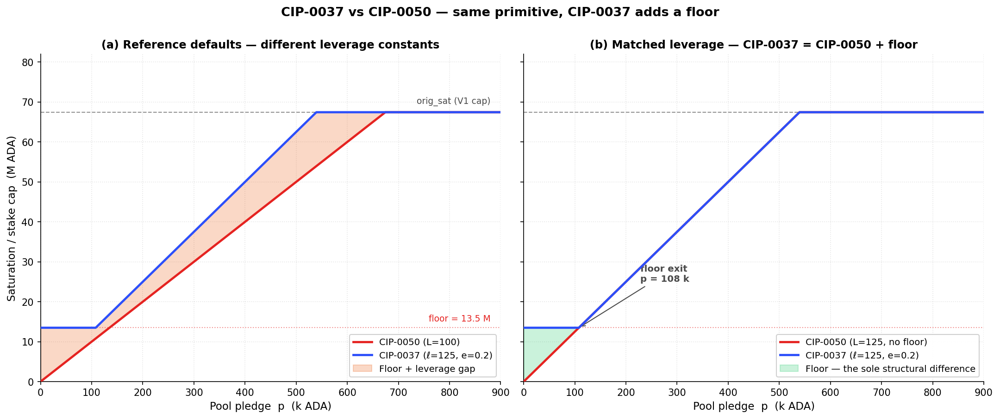
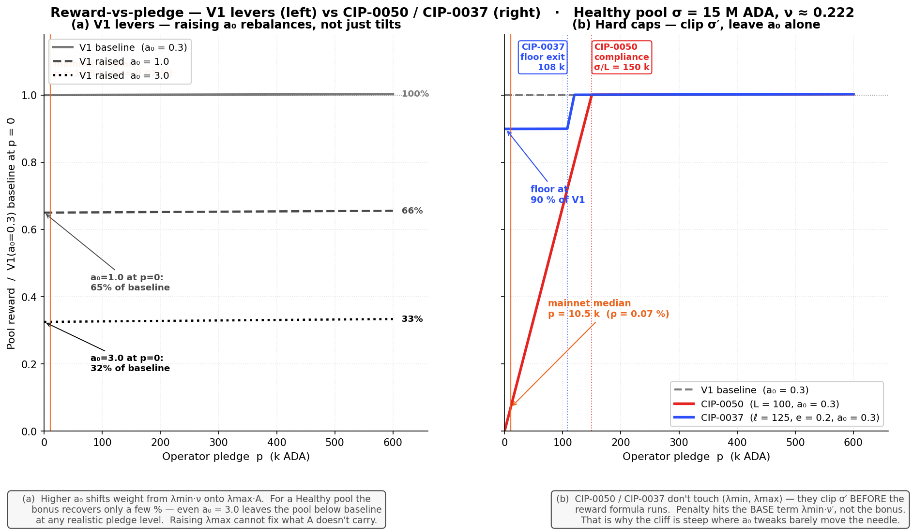
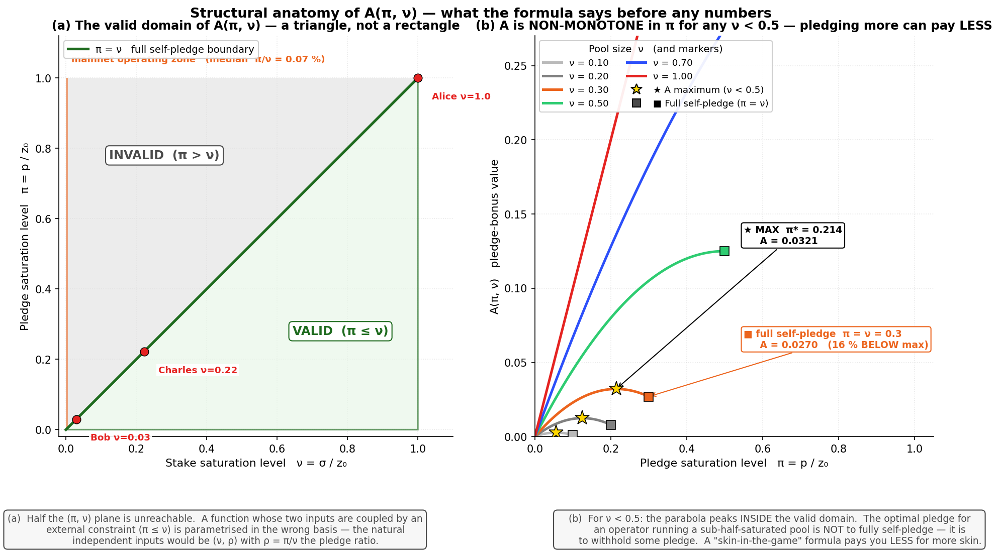
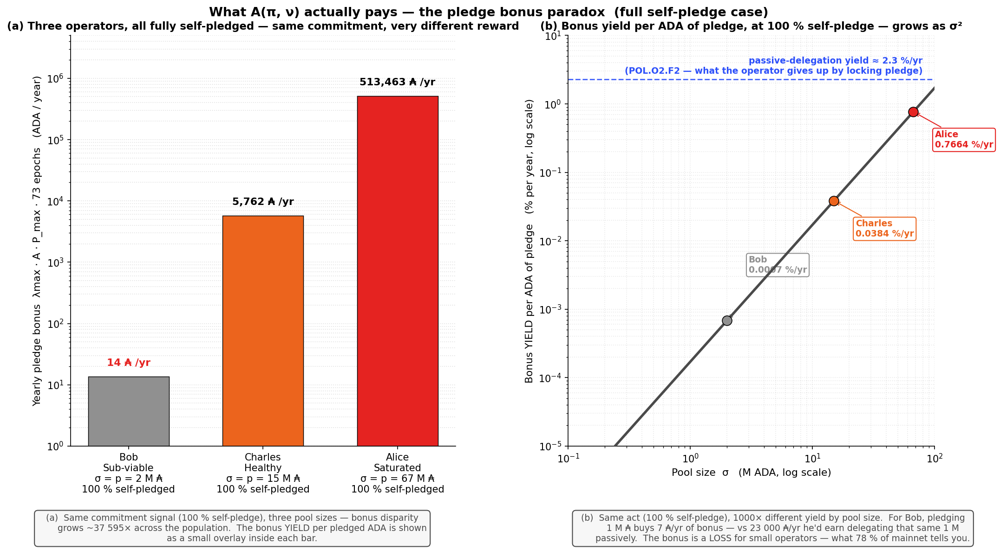
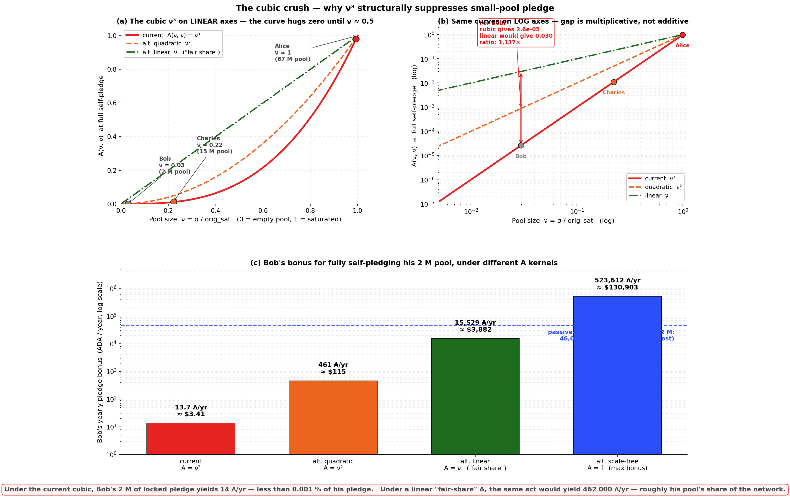

# Pools distribution — Stake-cap layer

This folder evaluates the CIPs that act on the **stake-cap layer** of the Cardano reward pipeline — the reward-eligible pool stake $\sigma'$ that enters the SL-D1 reward formula, *upstream* of the operator/member split that the [fee layer](../operator-delegator/README.md) reshapes.

The two CIPs in scope ([CIP-0050](cip-0050.md), [CIP-0037](cip-0037.md)) target a real broken signal that the [mainnet diagnostic](../../diagnostic/README.md) confirms: pledge is priced as irrelevant by the operator population. POL.O2.F2 — pledge yield (0.68 %/yr) is structurally dominated by passive-delegation yield (~2.3 %/yr); POL.O2.F1 — 78 % of staked ADA sits in pools with pledge ratio < 1 %; POL.O5.F3 — 41 of 48 saturation-scale MPOs forfeit the bonus. Both CIPs respond by making pledge **binding** on the reward formula — without sufficient pledge, the pool's reward-eligible stake is clipped.

**Verdict on both CIPs: no-go, for two stacked reasons.**

**The load-bearing piece is `A(ν, π)`, and neither CIP touches it.** V1 already exposes a pledge-incentive knob — `a₀`, the weight of the pledge bonus inside the reward envelope (current mainnet value `0.3`; full walkthrough in [Why a new instrument when V1 already has a pledge lever?](#2-why-a-new-instrument-when-v1-already-has-a-pledge-lever) below). Raising `a₀` rebalances the formula but does not make pledge "matter more" — every low-pledge pool earns less *before* the bonus can recover. CIP-0050 and CIP-0037 add a third lever (clip σ′ before the formula runs) on top of `a₀` and `k`, but they accept `A(ν, π)` as given. That function carries three structural pathologies:

- a permanent quadratic `ν²` size penalty applies at *every* pledge ratio — small pools are crushed regardless of how committed the operator is;
- a non-monotonicity in π for sub-half-saturated pools — a 2 M operator (ν ≈ 0.03) earns **8.7×** *more* bonus by pledging 51 % than by fully self-pledging. The formula explicitly incentivises small operators to *under-commit*;
- a cubic `ν³` collapse at full self-pledge — a saturated operator earns **37 595×** more bonus than a 2 M operator at maximum commitment, because the size factor cubes when the pledge factor saturates.

The σ′ clip changes *who can earn the V1 reward*; it does not repair what `A` does to the pledge signal. The relative bonus disparity, the under-commitment incentive, and the cubic crush all carry through unchanged.

**A genuine V2 stake-cap reform must redesign `A`** with three properties no CIP currently in scope delivers:

- a **smoother operator onset at low ν** — no cubic crush of small pools as they grow;
- a design that **does not privilege fully-private pools (π = 1)** — the V2 target is not "everyone runs a 100 %-pledged pool";
- explicit reward for the **balanced-commitment regime (π ≈ 0.5)** — pledge serving as a credible signal *and* the pool remaining open to delegation.

**Capital-capability bias compounds the `A` objection.** By making pledge binding, both CIPs implicitly discriminate by the operator's capital, not by operator quality. Custodial entities (~21 % of productive stake) hold custodied retail funds they legally cannot self-pledge — their reward collapses to the pledge floor regardless of operator quality. Retail small operators (POL.O6.F2 — 78 % of single-pool stake non-compliant at pledge < 2 %) mostly do not have the capital to raise pledge — their only response is reduced reward or exit. The reform rewards the population that *can* pledge and penalises the population that *cannot*, independent of whether the penalised pools produce reliable blocks, serve delegators well, or contribute to decentralisation by any other measure. Even if `A` were repaired, the σ′ primitive on its own would still pressure the wrong segment.

**Side effect on small-operator viability.** Small retail pools that have attracted delegation in reliance on V1 rules see their σ′ clipped — both operator revenue and delegator ROS drop. This is the *opposite direction* of the V2 [Operator Viability milestone](../../README.md#31-guarantee-operator-viability-across-the-entire-productive-population). A stake-cap instrument that restores pledge-as-signal is legitimate on its own terms, but it should not be deployed without an active viability instrument protecting the low-pledge retail population the stake-cap rule would otherwise penalise.

## Table of Contents

- [1. Stake-cap formulas](#1-stake-cap-formulas)
- [2. Why a new instrument when V1 already has a pledge lever?](#2-why-a-new-instrument-when-v1-already-has-a-pledge-lever)
  - [2.1. The `a₀` lever rebalances, it doesn't tilt](#21-the-a0-lever-rebalances-it-doesnt-tilt)
  - [2.2. The deeper bottleneck — A(ν, π) itself](#22-the-deeper-bottleneck-a-itself)
    - [2.2.1. Anatomy of the function — before any numbers](#221-anatomy-of-the-function-before-any-numbers)
    - [2.2.2. What A actually pays — three operators across three pledge levels](#222-what-a-actually-pays-three-operators-across-three-pledge-levels)
    - [2.2.3. The cubic ν³ — visualised](#223-the-cubic-3-visualised)
    - [2.2.4. What this means for the CIP critique](#224-what-this-means-for-the-cip-critique)
  - [2.3. What this implies for the CIP candidates in this folder](#23-what-this-implies-for-the-cip-candidates-in-this-folder)
- [3. Candidates](#3-candidates)
- [4. Composition](#4-composition)
- [5. Interaction with `k`](#5-interaction-with-k)
- [6. V2 milestone interaction](#6-v2-milestone-interaction)
- [7. Reading order](#7-reading-order)
- [8. References](#8-references)

## 1. Stake-cap formulas

**The shared intent.** Under V1, the saturation cap is a **constant** — `orig_sat = 1/k ≈ 67.44 M ₳` at `k = 500` — independent of pledge. A pool can attract delegation up to that ceiling regardless of how much pledge the operator puts up; pledge enters the reward calculation only via the small bonus term $a_0$ in the SL-D1 numerator (worth ≈ 30 % of the reward at $a_0 = 0.3$, but structurally dominated by passive-delegation yield — see POL.O2.F2).

Both CIPs in this folder share a single intent: **replace this constant horizontal cap with a function of pledge**. The new cap rises linearly with the operator's pledge until it reaches the V1 ceiling $\text{orig\_sat}$ — beyond that, the new rule and V1 coincide. The intent is identical for both candidates: *to earn the V1 ceiling, an operator must pledge enough; below that pledge level, the effective cap is reduced proportionally.*

Both candidates therefore reshape $\sigma'$ (reward-eligible pool stake) as a **linear function of pledge**, with the V1 ceiling $\text{orig\_sat} = 1/k$ as hard upper bound. They differ only on what happens below the slope:

| Mechanism | Simplified formula | Effective parameters |
| --- | --- | --- |
| V1 baseline | $\sigma' = \min(\sigma,\ \text{orig\_sat})$ | $k$ only |
| CIP-0050 — pledge-leverage cap | $\sigma' = \min\!\bigl(\sigma,\ \text{orig\_sat},\ L\cdot p\bigr)$ | $L$ (one scalar) |
| CIP-0037 — dynamic saturation | $\sigma' = \min\!\bigl(\sigma,\ \mathrm{clamp}(\ell\cdot p,\ e\cdot\text{orig\_sat},\ \text{orig\_sat})\bigr)$ | $(e, \ell)$ — $p_{100\%} = \text{orig\_sat}/\ell$ is derived |

**Structural kinship.** For any pool large enough that $\sigma \geq \text{orig\_sat}$, the two candidates are **the same primitive** — a linear-in-pledge slope capped at the V1 saturation — differing only on what happens when pledge is low:

- **CIP-0050** clips the stake cap to $L \cdot p$ — at zero pledge, $\sigma' = 0$ (hard break).
- **CIP-0037** clamps the stake cap to $\ell \cdot p$ but places a **floor** at $e \cdot \text{orig\_sat}$ — at zero pledge, $\sigma' = e \cdot \text{orig\_sat} \approx 13.49$ M ₳ at reference.

Reference leverages differ by convention ($\ell = 125$ vs $L = 100$), not by design intent.

Panel (b) matches leverage at $\ell = L = 125$ to isolate the floor as the sole structural difference. **CIP-0037 is CIP-0050 plus a floor** — both target V2 §3.2 pledge-as-signal and §3.4 concentration via the same mechanism; CIP-0037 softens the low-pledge edge at a three-scalar governance cost instead of a one-scalar one.

## 2. Why a new instrument when V1 already has a pledge lever?

V1 already exposes a pledge-incentive knob: the **pledge influence factor** $a_0$ (currently `0.3` on mainnet). It enters the SL-D1 reward envelope as the weight of the pledge-bonus term:

$$E(\nu, \pi) \;=\; \underbrace{\lambda_{\text{size}} \cdot \nu}_{\text{base — independent of pledge}} \;+\; \underbrace{\lambda_{\text{pledge}} \cdot A(\nu, \pi)}_{\text{bonus — pledge-sensitive}}$$

with $\lambda_{\text{size}} = 1/(1+a_0)$, $\lambda_{\text{pledge}} = a_0/(1+a_0)$, and the **pledge-bonus activation function**

$$A(\nu, \pi) \;:=\; \nu^2 \cdot \pi \cdot \bigl[1 - \pi(1-\nu)\bigr]$$

(Notation and derivation in [diagnostic / pools-distribution §2.3](../../diagnostic/sub-flows/pools-distribution/mainnet-analysis/README.md#234-normalized-coordinates-pool-size-and-pledge-ratio).)

**What ν and π actually mean.** Both are **dimensionless ratios** in $[0, 1]$ that capture the two structurally independent degrees of freedom an operator controls.

| Symbol | Definition | Range | What it measures | Concrete example |
|---|---|---:|---|---|
| **ν**  | $\sigma / z_0$ | $[0, 1]$ | **Stake saturation level** — what fraction of one fully-saturated V1 pool the *total* stake represents (with $z_0 = 1/k \approx$ 67.44 M ADA at mainnet $k=500$) | Healthy 15 M pool: $\nu = 15/67.44 = 0.222$.  Saturated pool: $\nu \approx 1$. |
| **π**  | $s / \sigma$ | $[0, 1]$ | **Within-pool pledge ratio** — fraction of the pool's stake that the operator commits as their own | Pool with 10 % pledge ratio: $\pi = 0.10$.  Fully self-pledged pool: $\pi = 1$.  Mainnet stake-weighted median: $\pi \approx 0.07\,\%$ (POL.O2.F1). |

ν and π are **structurally independent** — pool size and commitment fraction can vary freely, each on its own [0, 1] interval. The operating mainnet population sits very near the π = 0 axis: 78 % of staked ADA is in pools with π < 1 % (POL.O2.F1).

A reading shortcut: when you see **ν** in the formula, think *"how big is the pool relative to one full V1 pool"*. When you see **π**, think *"how much of the pool is the operator's own ADA"*.

The natural question is therefore: *why propose CIP-0050 / CIP-0037 instead of just raising `a₀`?* The answer requires looking at three nested layers — the lever's **shape**, the bonus function's **structure**, and what no proposal currently touches.

### 2.1. The `a₀` lever rebalances, it doesn't tilt

Raising `a₀` shifts more weight from the base term ($\lambda_{\text{size}}\nu$) onto the bonus term ($\lambda_{\text{pledge}}A$). For a low-pledge pool this *reduces* the base by more than the bonus can recover — the operator is punished smoothly, not catalysed.

Panel (a). For a Healthy pool ($\sigma = 15$ M, $\nu \approx 0.222$): raising $a_0$ from `0.3` → `1.0` drops the zero-pledge reward to **65 %** of baseline; raising to `3.0` drops it to **32 %**. The bonus barely recovers across the full pledge range — even at 600 k of self-pledge the higher-`a₀` curves stay below baseline. **The `a₀` lever cannot make pledge "matter more" without first making low-pledge pools earn less.**

Panel (b). CIP-0050 and CIP-0037 don't touch $(λ_{\min}, λ_{\max})$. They clip $\sigma'$ before the reward formula runs, so the penalty hits the **base term** $λ_{\min} \cdot \nu'$ — which is structurally *much larger* than $λ_{\max} \cdot A$ at any reasonable pool size. That is why their cliff is steep where `a₀` tweaks barely move the needle.

### 2.2. The deeper bottleneck — A(ν, π) itself

Both `a₀` (rebalancing) and CIP-0050 / CIP-0037 (clipping) operate **around** the A function. Neither modifies it. So before plugging any numbers in, dissect the function itself: what does it say structurally?

#### 2.2.1. Anatomy of the function — before any numbers

**(i) The factorisation: pure size factor × pledge-intensity factor.**

A admits a clean multiplicative decomposition:

$$A(\nu, \pi) \;=\; \underbrace{\nu^2}_{\text{size factor}} \;\cdot\; \underbrace{\pi \cdot \bigl[1 - \pi(1-\nu)\bigr]}_{\text{pledge-intensity factor}}$$

The two effects are independent and multiplicative. The **outer factor $\nu^2$** is a quadratic dependence on pool size — independent of pledge, applying at *every* commitment level. A pool earns bonus proportional to $\nu^2$ before any consideration of how much its operator pledges. The **inner factor** $\pi[1 - \pi(1-\nu)]$ controls how the pledge ratio modulates the bonus, with a weak coupling to $\nu$ via the $(1-\nu)$ term.

This is the load-bearing observation: *pool size enters the bonus quadratically as a pure penalty against small pools, regardless of how committed the operator is*. Even at the OPTIMAL pledge ratio for a given pool size, the bonus is still scaled by $\nu^2$.

**(ii) Tour of the corners and edges.**

| Configuration | Condition | A reduces to | Interpretation |
|---|---|---|---|
| Zero pledge | $\pi = 0$ | $A = 0$ | No bonus, sensible. |
| Saturated pool | $\nu = 1$ | $A = 1 \cdot \pi \cdot [1 - 0] = \pi$ | Linear in $\pi$, well-behaved. The only regime where A is monotone clean. |
| Full self-pledge | $\pi = 1$ | $A = \nu^2 \cdot 1 \cdot [1 - (1-\nu)] = \nu^3$ | The cubic collapse. |
| Designed maximum | $(\nu, \pi) = (1, 1)$ | $A = 1$ | Saturated pool fully self-pledged. |

The third row is where the elaborate quadratic construction collapses. At full self-pledge, the inner factor $\pi[1 - \pi(1-\nu)]$ degenerates to $\nu$, and combined with the outer $\nu^2$ produces $\nu^3$ — cubing sub-unit numbers. That cube is the load-bearing pathology, but as (i) made explicit, the underlying $\nu^2$ size penalty is permanent regardless of pledge.

**(iii) The pledge-intensity factor and what it was meant to do.**

The inner factor $\pi[1 - \pi(1-\nu)] = \pi - \pi^2(1-\nu)$ has two pieces with distinct intents. The linear $\pi$ part is the bilinear "more pledge → more bonus" signal. The quadratic $-\pi^2(1-\nu)$ part is a **splitting penalty** the SL-D1 design adds on purpose: an MPO who splits a fixed total pledge across $N$ pools shrinks the per-pool $\pi$, and the quadratic term penalises high-$\pi$/low-$\nu$ configurations the protocol associates with potential gaming.

The construction *does* achieve that intent in some regions. But it pays a heavy price elsewhere — pathology (iv) below.

**(iv) The structural defect — A is non-monotone in π for any ν < 0.5.**

Take the partial derivative of A with respect to π at fixed ν:

$$\frac{\partial A}{\partial \pi} \;=\; \nu^2 \bigl[1 - 2\pi(1-\nu)\bigr]$$

This is zero at $\pi^* = 1 / [2(1-\nu)]$ and negative for $\pi > \pi^*$. Two regimes follow:

- For $\nu \geq 0.5$: $\pi^* \geq 1$, so the maximum sits **at or beyond the boundary** of the unit interval. Inside $[0, 1]$, A is monotone increasing in $\pi$ — pledging more always earns more bonus. ✓
- For $\nu < 0.5$: $\pi^* < 1$, so the maximum sits **strictly inside** $[0, 1]$. Increasing pledge ratio from $\pi^*$ up to $\pi = 1$ (full self-pledge) **decreases** A. *Pledging more pays less.*

Worked example at $\nu = 0.3$ (a Healthy-tier pool around 20 M ADA):

| π | A(0.3, π) |
|---:|---:|
| 0.30 | 0.0233 |
| 0.50 | 0.0292 |
| 0.65 | 0.0319 |
| **0.714 (= π*)** | **0.0321 ← max** |
| 0.80 | 0.0317 |
| **1.00 (full self-pledge)** | **0.0270 — 16 % below the max** |

For a pool exactly at half-saturation ($\nu = 0.5$), the optimum is at $\pi = 1$. Below half-saturation, an operator who fully self-pledges *destroys* part of their bonus. The formula whose stated purpose is "skin in the game" pays you **less for putting in more skin**, for the entire population of pools below half-saturation — which is essentially the entire mainnet population.

Panel (b) of the figure shows this: each curve is A at fixed ν as a function of π over the unit interval. The gold star marks the interior maximum; the square marks the full self-pledge endpoint. For $\nu < 0.5$, the square is *below* the star.

**(v) Summary of structural critiques — before any numbers.**

1. The bonus has a **quadratic outer size penalty** $\nu^2$ that holds at every pledge ratio. Small pools are quadratically penalised for being small, before pledge enters the picture.
2. At full self-pledge ($\pi = 1$), the inner factor degenerates and A collapses to $\nu^3$ — the worst-case manifestation of the size penalty, compounding with a residual $\nu$ from the inner factor.
3. For any pool below half-saturation, A is non-monotone in $\pi$ — pledging beyond $\pi^* = 1/[2(1-\nu)]$ actively reduces the bonus.
4. The intended MPO-splitting penalty (the $-\pi^2(1-\nu)$ term) is achieved at the cost of (1)–(3).

These are pre-empirical defects: they hold regardless of mainnet data, regardless of what `a₀` is set to, regardless of CIP reforms acting on σ′. They are properties of the algebra. With this in hand, the next subsection puts numbers on what they mean for actual operators.

#### 2.2.2. What A actually pays — three operators across three pledge levels

**Cast.** Three honest operators, all running pools of different sizes:

- **Bob** runs a Sub-reliable 2 M ADA pool ($\nu \approx 0.03$).
- **Charles** runs a Healthy 15 M ADA pool ($\nu \approx 0.222$).
- **Alice** runs a Saturated 67 M ADA pool ($\nu \approx 0.99$).

All three are below half-saturation except Alice, so Bob and Charles already sit in the non-monotone regime described in (iv). Now follow the same three pledge configurations on each.

##### Scenario A — what mainnet actually does today (median pledge ratio 0.07 %)

This is where 78 % of staked ADA actually sits today (POL.O2.F1). Operators put down a token amount of pledge and earn near-zero bonus — but lose nothing significant either, because the opportunity cost of pledging that token amount is also small.

| Operator | Pool σ | Pledge p (0.07 %) | Yearly bonus from A |
|---|---:|---:|---:|
| Bob | 2 M | 1 400 ₳ | **0.3 ₳/yr** ($0.08) |
| Charles | 15 M | 10 500 ₳ | **18 ₳/yr** ($4.50) |
| Alice | 67 M | 47 000 ₳ | **362 ₳/yr** ($90) |

Even Alice — a Saturated pool with the median pledge ratio — only earns ~$90/yr in pledge bonus. The formula is essentially silent about pledge for everyone in this scenario. *This is the equilibrium the diagnostic captures.*

##### Scenario B — what CIP-0050 demands at L = 100  (1 % pledge ratio)

To reach the CIP-0050 compliance threshold (`p ≥ σ/L`), each operator must commit substantially more capital. The bonus *does* grow — but the disparity across pool sizes already shows up sharply.

| Operator | Pool σ | Pledge p (1 %) | Yearly bonus from A |
|---|---:|---:|---:|
| Bob | 2 M | 20 000 ₳ | **4.6 ₳/yr** |
| Charles | 15 M | 150 000 ₳ | **257 ₳/yr** |
| Alice | 67 M | 670 000 ₳ | **5 168 ₳/yr** |

Same act (1 % pledge ratio) — Alice earns **1 123× more bonus than Bob** for committing the same *fraction* of her pool. And Bob has just been asked to lock 20 000 ₳ ($5 000) of his own capital to earn 4.6 ₳/yr ($1.15) in bonus. *The yield on his pledge is 0.023 % vs 2.3 % passive — he loses ~100× by complying.*

##### Scenario C — the maximum signal anyone can give (100 % self-pledge, π = 1)

The strongest possible commitment: every ADA in the pool is the operator's own. No MPO games, no delegator slack — pure skin-in-the-game. This is the corner $\pi = 1$ and triggers the cubic collapse from (ii).

| Operator | Pool σ | Pledge p (100 %) | Yearly bonus from A |
|---|---:|---:|---:|
| Bob | 2 M | 2 M | **14 ₳/yr** |
| Charles | 15 M | 15 M | **5 762 ₳/yr** |
| Alice | 67 M | 67 M | **513 463 ₳/yr** |

Even at the *maximum possible commitment*, Alice earns **37 595× more bonus than Bob** — because the cubic $\nu^3$ that emerges at $\pi = 1$ collapses the bonus on pool size, not on the strength of the commitment signal.

Furthermore — and this is pathology (iv) made tangible — Bob is on the *wrong side* of the maximum. His optimal pledge ratio is $\pi^* = 1/[2(1-\nu)] = 1/(2 \cdot 0.9703) \approx 0.515$ (about 51 % of his pool, $p^* \approx 1.03$ M ADA). At full self-pledge he earns 14 ₳/yr; at the interior optimum he would earn ~122 ₳/yr — **8.7× more bonus by withholding half his potential pledge**. The formula explicitly incentivises him to *under-commit*.

Panel (a) is Scenario C as a bar chart at log scale (the disparity is too large for linear axes). Panel (b) re-expresses the same disparity as a "bonus yield" — bonus per ADA of pledge per year — and overlays the passive-delegation yield (~2.3 %/yr from POL.O2.F2) the operator gives up by locking that pledge: Bob's pledge yields **0.0007 %/yr** in bonus, Charles's **0.038 %/yr**, Alice's **0.77 %/yr**. All three are below passive delegation, but Bob is by far the most penalised.

#### 2.2.3. The cubic ν³ — visualised

Combine the corner-collapse from (ii) with the non-monotone pathology from (iv): the operator who gives the *strongest possible signal* (full self-pledge, $\pi = 1$) is paid by $\nu^3$ — a destruction operator on sub-unit numbers, layered on top of the permanent $\nu^2$ size penalty.

Panel (a) shows `ν³` (red) versus quadratic `ν²` (orange) and linear `ν` (green, "fair share"). On linear axes, the cubic curve hugs zero until `ν ≈ 0.5` and then leaps to 1 at full saturation — so anyone running a pool below half-saturation is in the flat region where pledge barely matters.

Panel (b) shows the same curves on log axes — the gap between cubic and linear is **multiplicative**, not additive. For Bob's `ν = 0.03`: the cubic gives `2.6 × 10⁻⁵`, while a linear A would give `0.030` — a **1 137× ratio**. That ratio is what the formula is destroying.

Panel (c) makes the cubic crush tangible in dollars. Bob's 2 M pool, fully self-pledged:

| A kernel | Bob's yearly bonus | In USD @ $0.25/ADA |
|---|---:|---:|
| **current  A = ν³** | 14 ₳/yr | $3.41 |
| alt. quadratic  A = ν² | 461 ₳/yr | $115 |
| alt. linear  A = ν   ("fair share") | 15 529 ₳/yr | $3 882 |
| alt. scale-free  A = 1 | 523 612 ₳/yr | $130 903 |

Compare to the **passive-delegation alternative**: if Bob delegates that 2 M instead of pledging it, he earns ~46 000 ₳/yr at 2.3 %/yr. Under the current cubic, pledging costs him ~46 000 ₳/yr in opportunity for 14 ₳/yr in bonus. *Pledging is a 3 286× loss for him.* Under a linear A, the bonus alone (15 529 ₳/yr) would be a third of his opportunity cost — pledging would still lose, but less catastrophically. Under the scale-free kernel, pledging would be net positive even for the smallest operator.

#### 2.2.4. What this means for the CIP critique

Walking through the structural anatomy and the three scenarios reveals one cumulative argument:

1. **The function is structurally awkward** before any data is plugged in (§2.2.1). Permanent quadratic size penalty $\nu^2$, non-monotonic in $\pi$ for sub-half-saturation pools, and at full self-pledge it collapses to a cubic.
2. **Mainnet today (Scenario A).** The bonus is silent for everyone. POL.O2.F1 is the predictable equilibrium of a formula with a near-zero gradient in the operating region.
3. **At CIP-0050 compliance (Scenario B).** The disparity across pool sizes becomes severe — Alice gets 1 123× more bonus than Bob for the same *relative* effort. Bob loses ~100× by complying.
4. **At maximum commitment (Scenario C).** The disparity becomes catastrophic — 37 595× — and the cubic $\nu^3$ at the corner $\pi = 1$ is the algebraic reason.

CIP-0050 and CIP-0037 modify the *enforcement* of pledge (clip $\sigma'$ if pledge is too low) but not the *pricing* of pledge inside A. After their reform, the relative bonus disparity across operator sizes remains identical; the non-monotone regime for $\nu < 0.5$ remains identical; the cubic collapse at full self-pledge remains identical. They patch around A without touching it.

A reform that touched A directly — replacing the kernel with one that doesn't impose the quadratic size penalty $\nu^2$ at every pledge ratio, or that doesn't cube small pools at full commitment — would be the most structural way to repair the pledge signal at its source. **No CIP currently in scope proposes this.** This is the deepest critique of both candidates in this folder: they accept A as given and patch around it, when A is the load-bearing piece of the pledge incentive.

This reading extends the formal critique at [diagnostic / pools-distribution §2.3.5](../../diagnostic/sub-flows/pools-distribution/mainnet-analysis/README.md#235-reader-friendly-reward-function): *"the bonus term $\lambda_{\text{pledge}}A(\nu, \pi)$ is non-linear and asymmetric in its two inputs. The outer factor $\nu^2$ imposes a quadratic size penalty that holds at every pledge ratio; at full self-pledge ($\pi = 1$) the inner factor degenerates and the bonus collapses to $\lambda_{\text{pledge}}\nu^3$ — the cubic that suppresses the bonus structurally for any pool below saturation."*

### 2.3. What this implies for the CIP candidates in this folder

The two CIPs in this folder accept the V1 reward formula as given and patch around it via $\sigma'$ clipping. Three honest readings follow from §2.1 and §2.2:

- **CIP-0050 and CIP-0037 are not strictly worse than raising `a₀`.** They achieve the same intent (make pledge bind) without the smooth-but-uniformly-painful penalty that an `a₀` raise imposes on every low-pledge pool. The cliff/floor shape is *different*, not necessarily *worse*.
- **The "MPO fleet-splitting" property neither `a₀` nor an A reform would deliver as cleanly.** CIP-0050's revenue-neutral pool-splitting ($N \cdot L \cdot (P/N) = L \cdot P$) is an *algebraic identity* of its primitive that smooth levers cannot reproduce without coordination across pools. This is the strongest standalone argument for the CIP-0050 family.
- **None of the three reform vectors (`a₀`, σ' clip, A redesign) are mutually exclusive — and the deepest one is missing from the conversation.** The CIP discussion treats `σ'` clipping as the only available primitive. A revision of A itself — removing the $\nu^2$ outer size penalty, or replacing the inner $\pi[1-\pi(1-\nu)]$ factor with a kernel that doesn't cube small pools at full commitment — would be the most structural way to repair the pledge signal at the right end of the formula. No CIP currently in scope proposes this.

The remainder of this folder evaluates the two `σ'`-clipping candidates on their own terms. The framing above is a reading aid, not a verdict — it reframes "is CIP-0050/0037 the right reform?" as "is `σ'` clipping the right *layer* of intervention?".

## 3. Candidates

| Candidate | Instrument | V2 primary | Evaluation | Source |
| --- | --- | --- | --- | --- |
| **CIP-0050** — Pledge Leverage-Based Staking Rewards | Pledge-leverage cap `L` | §3.2, §3.4 | [`cip-0050.md`](cip-0050.md) | [CIP-0050](https://cips.cardano.org/cip/CIP-0050) · PR [#242](https://github.com/cardano-foundation/CIPs/pull/242), [#1042](https://github.com/cardano-foundation/CIPs/pull/1042) |
| **CIP-0037** — Dynamic Saturation Based on Pledge | Pledge-linked saturation curve | §3.2, §3.4 | [`cip-0037.md`](cip-0037.md) | [CIP-0037](https://cips.cardano.org/cip/CIP-0037) · PR [#163](https://github.com/cardano-foundation/CIPs/pull/163) |

## 4. Composition

| Composition | Status |
| --- | --- |
| CIP-0050 ⊕ CIP-0037 (same-layer) | **Not canonical — redundant by construction.** Both instruments are the same linear-in-pledge primitive capped at `orig_sat`. Stacking them (`σ' = min(σ, orig_sat, L·p, sat₀₀₃₇(p))`) is technically well-defined but adds no expressive power over picking the stricter of the two envelopes and the floor choice |
| Stake-cap layer ⊕ fee layer (cross-layer) | **Clean** — different pipeline stages, no precedence rule required |

**Design decision — reduced to a single question.** Given the kinship in §1, picking between CIP-0050 and CIP-0037 is essentially **"floor or no floor?"**:

- **No floor (CIP-0050).** Zero-pledge pools collapse to $\sigma' = 0$ — the hardest possible pressure on the custodial-by-extraction segment (21 % of productive stake). One governance parameter $L$.
- **Floor (CIP-0037).** Zero-pledge pools keep 20 % of V1 capacity — softer landing for Sub-reliable tier and below; same clip from Healthy tier up. Two effective governance parameters $(e, \ell)$.

All other properties (monotonicity in pledge, MPO fleet-split penalty on the slope, entity-level §3.4 gap for ceiling-regime pools, §3.1 small-operator viability risk) carry across one-for-one.

## 5. Interaction with `k`

Stake-cap reforms and `k` are tightly coupled:

- **CIP-0050.** $L$ is dimensionless — independent of `k`. Text explicitly argues that $L$ converts a `k` raise from a concentration risk into a decentralisation lever.
- **CIP-0037.** Both the floor ($e \cdot \text{orig\_sat}$) and the ceiling ($\text{orig\_sat}$) are functions of `k` via $\text{orig\_sat} = \text{Supply}/k$. A `k` change *directly reshapes* the entire saturation curve; joint recalibration of $(e, \ell)$ is required to preserve the intended regime boundaries.

*Important scope note.* Both CIP-0050 and CIP-0037 **change the pool-distribution part of the SL-D1 formula** (via $\sigma'$ clipping and a new saturation function respectively). The standalone `k`-lever analysis at [`../operator-delegator/k-parameter.md`](../operator-delegator/k-parameter.md) deliberately holds the formula fixed. Once either CIP-0050 or CIP-0037 is active, the standalone analysis no longer directly applies — joint evaluation with the stake-cap primitive is required.

## 6. V2 milestone interaction

Stake-cap reforms tighten the viability envelope for undercapitalised independent operators — which is why V2 sequences **fee layer before stake-cap layer**. A stake-cap reform deployed without a fee-layer instrument risks displacing delegation away from the subthreshold tail V2 §3.1 aims to protect.

## 7. Reading order

1. [`cip-0050.md`](cip-0050.md) — the primitive in its cleanest one-scalar form ($L$). Start here: every structural finding on the slope carries into CIP-0037.
2. [`cip-0037.md`](cip-0037.md) — the same primitive with an added floor and two effective governance parameters $(e, \ell)$. Read as "CIP-0050 plus floor" — the §2.1 formula walkthrough makes the kinship explicit.

## 8. References

- **Folder parent:** [`../README.md`](../README.md).
- **Cross-layer subfolder:** [`../operator-delegator/README.md`](../operator-delegator/README.md).
- **Standalone `k`-lever analysis (held-formula-fixed assumption):** [`../operator-delegator/k-parameter.md`](../operator-delegator/k-parameter.md).
- **Head-to-head:** CIP-0050-vs-0037 comparison maintained as a separate working document.
- **Solution-evaluation landing + cross-CIP conclusion:** [`../README.md`](../README.md).

> **Status:** Active 2026/04/23. Subfolder of [`../README.md`](../README.md). Candidates that act on the stake-cap layer of the Cardano reward pipeline.
