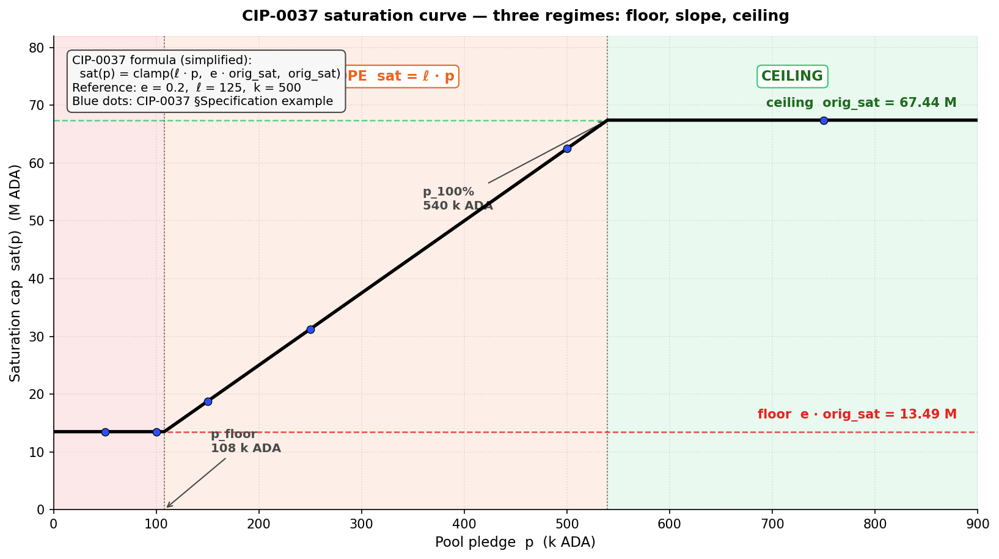

# CIP-0037 — Dynamic Saturation Based on Pledge

CIP-0037 replaces V1's flat saturation cap (`z₀ = 1/k`, ~67 M ADA) with a **pledge-indexed saturation curve**. Three regimes shape the curve: a **20 % floor** at zero or near-zero pledge (so a hollow pool still keeps a fifth of the V1 capacity), a **linear slope** in the mid-pledge range, and a **ceiling** at full pledge that recovers the V1 cap. Three new parameters — `e` (floor), `ℓ` (slope), `p_100%` (ceiling anchor) — control the curve.

The intent is the same as [CIP-0050](cip-0050.md): make pledge bind on the reward envelope so that V2 §3.2 (pledge as signal) and §3.4 (pool-level concentration) are addressed. The instrument is **softer**: where CIP-0050 sends zero-pledge pools to zero reward, CIP-0037 keeps them at 20 % of V1. In the simplified algebraic form, the two are the same primitive — a linear-in-pledge slope capped at `orig_sat` — with CIP-0037 adding a floor and a wider governance surface (three scalars vs CIP-0050's single `L`).

*The core question this evaluation asks: does CIP-0037's softer landing at the bottom and richer parametrisation justify the wider governance surface and the price-dependent calibration?*

The argument proceeds in three parts:

1. **Introduction** (§1). CIP identity card, origin and motivation (Casey Gibson, 2021), the diagnostic findings shared with CIP-0050, and the V2 §3 problem statement the proposal addresses.

2. **Mechanism** (§2). The formula in its simplified clamped form `sat(p) = clamp(ℓ·p, e·orig_sat, orig_sat)`, the three regimes (floor / slope / ceiling), structural properties (kinship with CIP-0050, MPO fleet-split penalty on the slope), and quantification at current mainnet parameters.

3. **Limits as a standalone proposal** (§3). Three synthesis findings — S1 (mechanical sharpness softened by the 20 % floor — Delivers), S2 (capital-capability bias matching CIP-0050 — Regresses), S3 (governance surface, price-robustness, entity-level §3.4 gap — Regresses + Blind spot).

The Executive summary below packages the verdict; the Findings summary table after it is the navigation index for §3.

## Executive summary

- **Verdict.** **Same target as CIP-0050, softer primitive.** A pledge-indexed saturation curve replaces the static $z_0 = 1/k$ ceiling, with three regimes: a **20 % floor** at zero / low pledge, a **linear slope** in the mid-pledge range, a **ceiling** at full pledge. Correctly targets V2 §3.2 (pledge signal) + pool-level §3.4 (concentration). Same capital-capability bias as CIP-0050 — penalises operators by their ability to self-pledge, not by operator quality — but with a softer landing for the smallest pools.
- **Instrument.** Three new parameters $(e, \ell, p_{100\%})$ — governance surface **3× larger** than CIP-0050's single $L$. $p_{100\%} = 500\,000$ ADA is an absolute anchor → the calibration is **price-dependent** (V2 §4.3 price-robustness compounds with price shifts). HFC required (new ledger rule).
- **Three synthesis findings carry the verdict** — detailed in §3 and re-surfaced inline:
  - **S1** — Structural sharpness on pledge-as-signal, softened at the bottom by the 20 % floor (3 [D] F's: §3.1).
  - **S2** — Capital-capability bias: Healthy-tier and above are materially clipped at the stake-weighted median retail pledge ratio (3 [R] + 1 [B] F's: §3.2).
  - **S3** — Governance / price-robustness / entity-level gaps (3 [R] + 1 [B] F's: §3.3).

## Findings summary

CIP evaluations use a three-level taxonomy mirroring the diagnostic's `SUBFLOW.O<n>.F<m>`: **S<n>** = synthesis finding; **F<m>** = quantified finding anchored in §2 / §3. Each F tagged **[D] Delivers / [R] Regresses / [B] Blind spot**.

| Code | Tag | Claim | Emerges in |
|---|---|---|---|
| **CIP-0037.S1** | | **Mechanically sharp on pledge-as-signal, softened at the bottom by the 20 % floor** | §3.1 |
| CIP-0037.S1.F1 | [D] | **Monotonicity in pledge.** $\partial \text{sat}/\partial p \geq 0$ on the slope regime; direct delivery on V2 §3.2 — higher pledge strictly widens the saturation envelope until the ceiling | §2.2, §3.1 |
| CIP-0037.S1.F2 | [D] | **20 % floor protects the smallest pools.** $\text{sat}(0) = 0.2 \cdot \text{orig\_sat} \approx 13.5$ M ₳ — a zero-pledge pool still keeps 20 % of the V1 saturation cap. Sub-block and Sub-reliable tiers (σ ≪ 13.5 M) see no clipping under zero pledge | §2.2, §2.3, §3.1 |
| CIP-0037.S1.F3 | [D] | **MPO fleet-split penalty.** Splitting a fixed pledge budget across $N$ pools moves each pool left on the saturation curve (per-pool pledge falls to $P/N$). For a 1 M ₳ pledge budget: 1-pool full 100 % of K; 8-pool split: 25 % of K each (62.5 k pledge on slope). Pool-level §3.4 concentration gain — less sharp than CIP-0050's revenue-neutral identity but directionally aligned | §2.3 MPO-split table, §3.1 |
| **CIP-0037.S2** | | **Capital-capability bias — Healthy-tier and above are clipped at the mainnet-typical pledge ratio; the discrimination is by capital capacity, not operator quality** | §3.2 |
| CIP-0037.S2.F1 | [R] | **Median retail reward cut at the Healthy tier and above.** At reference parameters ($e = 0.2$, $\ell = 125$, $p_{100\%} = 500$ k) and the stake-weighted median retail pledge ratio of **0.07 %** (POL.O2.F1), any pool with $p < 108$ k ADA is in the **floor regime** — σ' is clipped to 13.5 M regardless of σ. Healthy pools (3–38.5 M) lose 10–64 % of reward; Large-healthy / Near-saturation / Saturated pools lose 73–82 % | §2.3, §3.2 |
| CIP-0037.S2.F2 | [R] | **Custodial segment (21 % of productive stake) cannot respond.** Custodial-by-extraction (57 entities, 2.04 B ADA) hold custodied retail funds and cannot self-pledge — reward clipped to the 20 % floor regardless of operator quality. Custodial-by-pledge (10 entities, 1.59 B) already above ceiling, unaffected | §1.3, §3.2 |
| CIP-0037.S2.F3 | [R] | **Absolute-pledge threshold is pool-size-independent.** The ~108 k ADA needed to leave the floor regime is the same for a 2 M pool and a 50 M pool — so the fraction of σ that must be self-pledged to escape the floor *falls* as the pool grows. The reform is mechanically regressive: larger pools escape clipping more easily than smaller pools, at equal absolute pledge | §2.3, §3.2 |
| CIP-0037.S2.F4 | [B] | **The "operators will pledge more" bet is contradicted by POL.O2.F2 + POL.O5.F3.** Pledge yield is 0.68 %/yr at best vs ~2.3 %/yr passive delegation (POL.O2.F2). 41 of 48 saturation-scale MPOs already forfeit the bonus (POL.O5.F3). CIP-0037 reshapes the rules but does not flip the dominance relation — the population that has *chosen* not to pledge continues to face the same opportunity cost | §3.2 |
| **CIP-0037.S3** | | **Governance surface, price-robustness, and entity-level gaps compound with the S2 bias** | §3.3 |
| CIP-0037.S3.F1 | [R] | **Governance surface 3× larger than CIP-0050.** Three parameters $(e, \ell, p_{100\%})$ to calibrate vs one for CIP-0050. Joint re-calibration required on any `k` change (orig\_sat depends on k) and on any price shift (p\_100% is absolute ADA). V2 §4.4 governability cost is material | §1.4, §3.3 |
| CIP-0037.S3.F2 | [R] | **Price-dependence breaks V2 §4.3 price-robustness.** $p_{100\%} = 500\,000$ ADA is **absolute**, not a ratio. At ADA = \$0.10 the anchor costs operators \$50 k; at \$1.00 it costs \$500 k. The slope regime shifts correspondingly. CIP-0050's dimensionless $L$ is structurally robust; CIP-0037's calibration needs re-peg on price moves | §3.3 |
| CIP-0037.S3.F3 | [R] | **Entity-level §3.4 gap persists.** Custodial-by-pledge entities with native pledge exceeding $p_{100\%}$ bind no cap — they operate on the ceiling regime where σ' = orig\_sat regardless of pledge amount. The 10 entities / 1.59 B ₳ segment that dominates entity-level concentration today remains entirely unaffected | §3.3 |
| CIP-0037.S3.F4 | [B] | **§3.1 small-pool viability risk — softer than CIP-0050 but present.** Healthy-tier retail single-pool operators (214 entities, 2.44 B ₳ — operator-delegator §4.3.3) with sub-compliant pledge see 10–64 % of pool reward clipped. With the fee-layer split unchanged, operator take *and* delegator ROS fall together. Without a companion §3.1 instrument, CIP-0037 risks accelerating attrition in exactly the Healthy-tier single-pool population V2 §3.1 names as the priority | §3.3 |

*Cross-layer link.* CIP-0037 acts on the **right V2 layer** (reward-distribution, pre-split) — the layer the fee-layer critique ([`../operator-delegator/README.md`](../operator-delegator/README.md)) identifies as the principled home for distributional fixes. Its target is V2 §3.2 pledge-as-signal, not §3.1 viability — same as CIP-0050. Deploying CIP-0037 without an active §3.1 instrument carries the same small-pool viability risk, softened at the very bottom by the 20 % floor but still material for the Healthy tier and above.

*Same-layer pairing.* Stacking CIP-0037 with CIP-0050 ($\sigma' = \min(\sigma, \text{sat}(p), L \cdot p)$) is technically well-defined but not canonical — the two are alternative formulations of the same §3.2 + pool-level §3.4 intent. A coherent V2 package picks one.

## Table of Contents

- [Executive summary](#executive-summary)
- [Findings summary](#findings-summary)
- [1. Introduction](#1-introduction)
  - [1.1. Identity card](#11-identity-card)
  - [1.2. Origin and context](#12-origin-and-context)
  - [1.3. Related diagnostic findings](#13-related-diagnostic-findings)
  - [1.4. Missing CPSs — mapping to V2 §3](#14-missing-cpss-mapping-to-v2-3)
- [2. Mechanism](#2-mechanism)
  - [2.1. Formula](#21-formula)
  - [2.2. Structural properties (theorems, not predictions)](#22-structural-properties-theorems-not-predictions)
  - [2.3. Quantification at current mainnet parameters (epoch ~623, 2026/04)](#23-quantification-at-current-mainnet-parameters-epoch-623-202604)
- [3. Limits of CIP-0037 as a standalone proposal](#3-limits-of-cip-0037-as-a-standalone-proposal)
  - [3.1. S1 — Mechanical sharpness on pledge-as-signal, softened by the 20 % floor](#31-s1-mechanical-sharpness-on-pledge-as-signal-softened-by-the-20-floor)
  - [3.2. S2 — Capital-capability bias](#32-s2-capital-capability-bias)
  - [3.3. S3 — Governance, price-robustness, entity-level, and §3.1 gaps](#33-s3-governance-price-robustness-entity-level-and-31-gaps)
  - [3.4. References](#34-references)

## 1. Introduction

**CIP-0037 — "Dynamic Saturation Based on Pledge".** A 2021 proposal to replace the static $z_0 = 1/k$ saturation cap with a monotone function of pledge. The core idea: the "optimal pool size" should scale with the operator's capital commitment, so that splitting pledge across many pools mechanically shrinks each pool's reward envelope.

### 1.1. Identity card

| Field | Value |
| --- | --- |
| CIP number | CIP-0037 |
| Title | Dynamic Saturation Based on Pledge |
| Author | Casey Gibson |
| Created | 2021/12/03 |
| Category | Ledger |
| Status | Proposed (as of 2026/04) |
| Official page | [cips.cardano.org/cip/CIP-0037](https://cips.cardano.org/cip/CIP-0037) |
| Source (GitHub) | [cardano-foundation/CIPs / CIP-0037](https://github.com/cardano-foundation/CIPs/tree/master/CIP-0037) |
| Discussion PR | [cardano-foundation/CIPs #163](https://github.com/cardano-foundation/CIPs/pull/163) |

### 1.2. Origin and context

**Authorship and moment.** Written in December 2021 by Casey Gibson. The CIP's motivation (quoted from the CIP text):

> *"An SPO might have a pledge of 30,000 ADA across 10 pools, while another SPO might have 1,000,000 pledge but only has 1 pool with a small amount of active stake. Since there is no technical advantage to having a high pledge, the meaning and purpose of a pledge is redundant."*

The CIP proposes a saturation function $\text{sat}(p)$ that grows with pledge. Splitting a fixed pledge across more pools moves each pool left on the curve, reducing per-pool capacity.

**Scope.** CIP-0037 modifies **the saturation formula itself** — the pool-distribution stage of the reward pipeline. The fee-layer split (`minPoolCost`, `minPoolMargin`, `poolRate`) is untouched. It is therefore a pools-distribution-layer instrument with the same mechanical footprint as CIP-0050.

**Relation to other CIPs.**
- **CIP-0050** — the other stake-cap candidate. Same V2 targets (§3.2 + pool-level §3.4); different primitive (hard cap vs smooth curve). Same-layer pairing not canonical.
- **Fee-layer CIPs (CIP-0023, CIP-0082)** — compose cleanly on the mechanical axis (different pipeline stage) but target different V2 milestones.
- **`k` lever** — `orig\_sat = \text{Supply} / k$ is a reference scale for CIP-0037; any `k` change directly reshapes the saturation curve. Standalone k analysis: [`../operator-delegator/k-parameter.md`](../operator-delegator/k-parameter.md).

### 1.3. Related diagnostic findings

CIP-0037 targets the same pledge pathology as CIP-0050; the diagnostic findings that matter are the same core set, with CIP-0037-specific nuances around the floor and the three-parameter surface.

| Finding | Why shared | Supporting observations |
| --- | --- | --- |
| **POL.O2.F1 — 78 % of staked ADA at pledge ratio < 1 %; stake-weighted median 0.07 %** | At reference parameters ($e=0.2$, $\ell=125$, $p_{100\%}=500$ k), pools need ~108 k ADA of absolute pledge to leave the floor regime. The stake-weighted-median mainnet pool sits far below that threshold | — |
| **POL.O2.F2 — Pledge yield 0.68 %/yr vs ~2.3 %/yr passive delegation** | Same opportunity-cost argument as for CIP-0050: the reform amplifies the pledge incentive but does not flip the opportunity-cost comparison that explains the current non-pledge equilibrium | — |
| **POL.O5.F1 / POL.O5.F2 — 85 MPO entities operate 901 pools holding 75.4 % of participating stake; 48 are saturation-scale** | Entity-level concentration metric. CIP-0037's ceiling regime leaves large-pledge entities unconstrained — custodial-by-pledge segment not addressed | — |
| **POL.O5.F3 — 41 of 48 saturation-scale MPOs forfeit the pledge bonus today** | The population that *could* respond to CIP-0037 by increasing pledge has already shown it does not choose that option under current rules | — |
| **POL.O6.F2 — 78 % of single-pool stake has pledge ratio < 2 %** | Retail single-pool operators — the population V2 §3.1 targets — empirically do not pledge above the CIP-0037 floor-escape threshold. Their pool reward is clipped to 20 % of the V1 cap | — |
| **OPE.O7.F1 — Delegation is not sticky, not clearly yield-following** | The CIP's decentralisation story requires delegator migration toward higher-pledge alternatives; the diagnostic does not support this assumption at the scale needed | — |

### 1.4. Missing CPSs — mapping to V2 §3

CIP-0037's target is explicit: the pledge signal and the MPO pledge-dilution pathology. Mapped to V2 §3:

| V2 slot | What CIP-0037 proposes as the fix | Weight | Evidence base |
| --- | --- | --- | --- |
| [§3.2 Restore the notion of pledge among operators](../../README.md#32-restore-the-notion-of-pledge-among-operators) | $\text{sat}(p)$ — monotone in pledge; splitting pledge across pools shrinks per-pool capacity | **Primary** | POL.O2.F1, POL.O2.F2 |
| [§3.4 Reduce the concentration effects that distort both populations](../../README.md#34-reduce-the-concentration-effects-that-distort-both-populations) | Pool-level: MPO fleet expansion incurs a per-pool saturation penalty. Entity-level: not addressed — custodial-by-pledge entities operate on the ceiling regime | **Secondary (pool-level)** | POL.O5.F1 |
| [§3.1 Guarantee operator viability across the entire productive population](../../README.md#31-guarantee-operator-viability-across-the-entire-productive-population) | Not addressed by the instrument. The 20 % floor preserves *some* reward at low pledge, but Healthy-tier + retail single-pool operators with sub-compliant pledge see 10–64 % reward cut — a *worse* position than today at the fee-split level | **Out of scope — softly regressive** | OPE.O6.F4, POL.O6.F2 |
| [§3.3 Maintain and diversify a competitive delegator yield](../../README.md#33-maintain-and-diversify-a-competitive-delegator-yield) | Not addressed. Delegator ROS reshuffles via σ' clipping | **Out of reach** | — |

## 2. Mechanism

### 2.1. Formula

CIP-0037 replaces the static $z_0 = 1/k$ saturation cap with a pledge-indexed saturation function. Simplified from the canonical source (see errata below):

$$\boxed{\text{sat}(p) \;=\; \text{clamp}\bigl(\ell \cdot p,\;\; e \cdot \text{orig\_sat},\;\; \text{orig\_sat}\bigr)}$$

where $\text{clamp}(x, \text{lo}, \text{hi}) = \min(\text{hi}, \max(\text{lo}, x))$.

Parameters:

- $\text{orig\_sat} = \text{Supply} / k$ — the V1 baseline saturation cap (≈ 67.44 M ₳ at $k = 500$).
- $e$ — floor multiplier (reference: 0.2 → 20 % of V1 cap minimum).
- $\ell$ — pledge leverage constant (reference: 125).
- $p$ — pool pledge (absolute ADA).
- $p_{100\%} = \text{orig\_sat} / \ell$ — pledge level at which $\text{sat}$ reaches the ceiling (the CIP lists $p_{100\%}$ as a third parameter; it is in fact determined by $\ell$ and $k$). At reference, $p_{100\%} \approx 540\,000$ ADA — the CIP approximates this by the round figure $500\,000$.

The reward-eligible stake becomes $\sigma' = \min(\sigma, \text{sat}(p))$; the reward curve then applies to $\sigma'$: $\hat f' = \bar p \cdot P_{\max} \cdot E(\nu', \pi)$ with $\nu' = \sigma' / z_0$ and $\pi = s/\sigma$ (the pledge ratio is unchanged by the rule). The operator/member split is unchanged.

**Three regimes fall directly from the clamp.**



| Regime | Condition | sat(p) |
|---|---|---:|
| **Floor** | $p \leq e \cdot \text{orig\_sat} / \ell = 108$ k ADA | $e \cdot \text{orig\_sat}$ = 13.49 M |
| **Slope** | $108$ k $< p <$ $540$ k | $\ell \cdot p$ |
| **Ceiling** | $p \geq \text{orig\_sat} / \ell = 540$ k ADA | $\text{orig\_sat}$ = 67.44 M |

The blue dots on the curve are the six numerical example points the CIP itself publishes in its Specification section — they lie exactly on the clamped piecewise curve.

**Structural kinship with CIP-0050.** Read side-by-side, CIP-0037 and CIP-0050 are **the same primitive** applied to a large pool (σ ≥ orig_sat):

- **CIP-0050** effective cap on reward-eligible stake: $\min(\text{orig\_sat}, L \cdot p)$ — linear in pledge, V1 ceiling, **hard break at zero pledge**.
- **CIP-0037** effective cap: $\text{clamp}(\ell \cdot p, e \cdot \text{orig\_sat}, \text{orig\_sat})$ — linear in pledge with slope $\ell$, V1 ceiling, **floor at** $e \cdot \text{orig\_sat}$.

The slope is identical. Reference leverage differs only by convention ($\ell = 125$ vs $L = 100$). The **sole structural difference** is the floor:


Panel (a) uses each CIP's reference leverage (ℓ=125 for CIP-0037, L=100 for CIP-0050) — the gap conflates the 25 % leverage difference with the floor. Panel (b) matches leverage at $\ell = L = 125$ to **isolate the floor as the sole structural difference**. Reading this correctly reframes the two proposals: *CIP-0037 is CIP-0050 plus a floor.* Every S1 / S2 / S3 finding below carries across one-for-one, modulated by whether the floor binds in the regime considered.

**Design surface.**

| Property | Value |
| --- | --- |
| Effective governance parameters | $(e, \ell)$ — two scalars ($p_{100\%}$ is derived as $\text{orig\_sat}/\ell$) |
| Reference values | $e = 0.2$, $\ell = 125$ (⇒ $p_{100\%} \approx 540$ k) |
| Layer | Stake-cap (applied *before* reward curve) |
| Fee-layer split | Unchanged |
| Hard fork | Required (new ledger rule) |
| Re-registration | Not required |

> **Errata — reconciling the simplified form with the CIP source.** The canonical CIP-0037 specification publishes the formula as JavaScript:
>
> ```
> new_sat   = orig_sat * Math.max(e, min(1/k, pledge/orig_sat * l));
> final_sat = max(new_sat, orig_sat);
> ```
>
> with custom helper functions where `max(v1, v2)` returns the **smaller** value and `min(v1, v2)` returns the **larger** — the names are inverted relative to their semantics. Read with real-world semantics: the inner `real_max(1/k, p·ℓ/orig_sat)` is dominated by the slope term for any pledge above ≈ 1 080 ADA (the $1/k = 0.2\,\%$ guard is a numerical floor that never binds in practice), and the outer `final_sat` line clamps to the ceiling $\text{orig\_sat}$. The net operation is exactly $\text{clamp}(\ell \cdot p, e \cdot \text{orig\_sat}, \text{orig\_sat})$ — the form used above.

**Design surface.**

| Property | Value |
| --- | --- |
| New parameters | $(e, \ell, p_{100\%})$ — three anchors |
| Reference values | $e = 0.2$, $\ell = 125$, $p_{100\%} = 500\,000$ ADA |
| Layer | Stake-cap (applied *before* reward curve) |
| Fee-layer split | Unchanged |
| Hard fork | Required (new ledger rule) |
| Re-registration | Not required |
| Governance surface | 3 scalars |

### 2.2. Structural properties (theorems, not predictions)

| Property | Statement | Type |
|---|---|---|
| **Floor** | $\text{sat}(0) = e \cdot \text{orig\_sat}$ — zero-pledge pools retain $e = 20\,\%$ of V1 capacity | Algebraic |
| **Monotonicity in pledge** | $\partial \text{sat}/\partial p \geq 0$ on the slope regime (and weakly on the clamps) | Algebraic |
| **Three regimes** | Floor ($p < p_{\text{floor}}$), slope ($p_{\text{floor}} \leq p < p_{100\%}$), ceiling ($p \geq p_{100\%}$) | Algebraic |
| **MPO fleet-split penalty** | Splitting pledge budget $P$ across $N$ equal pools: each pool has $p = P/N$; per-pool sat shrinks (below $p_{100\%}$) as $N$ grows | Algebraic |
| **Price dependence** | $p_{100\%}$ is absolute ADA; fiat-denominated opportunity cost shifts with the ADA/USD rate | Structural |
| **k-dependence** | $\text{orig\_sat} = \text{Supply}/k$ — any $k$ change reshapes the entire curve | Structural |

The first four are the **design strengths**; the last two are governance-surface costs that distinguish CIP-0037 from CIP-0050's dimensionless primitive.

### 2.3. Quantification at current mainnet parameters (epoch ~623, 2026/04)

All calibrations use reference parameters ($e = 0.2$, $\ell = 125$, $p_{100\%} = 500$ k, $k = 500$, $\text{orig\_sat} = 67.44$ M ₳).

**Pledge-to-threshold mapping.** The pledge needed to exit the floor regime:

$$p_{\text{floor-exit}} = \frac{e \cdot \text{orig\_sat}}{\ell} = \frac{0.2 \cdot 67.44 \text{ M}}{125} \approx 108\,000 \text{ ₳}$$

**A pool with less than ~108 k ₳ of absolute pledge is in the floor regime regardless of pool size.** This is the single most important calibration consequence: escaping the floor requires an *absolute* pledge threshold, not a ratio.

**Saturation under reference parameters by pledge level:**

| Pledge (absolute ADA) | Regime | sat (ADA) | % of V1 cap |
|---:|---|---:|---:|
| 0 | Floor | 13.49 M | 20.0 % |
| 50 000 | Floor | 13.49 M | 20.0 % |
| 108 000 | Floor / Slope boundary | 13.49 M | 20.0 % |
| 150 000 | Slope | 18.75 M | 27.8 % |
| 250 000 | Slope | 31.25 M | 46.3 % |
| 500 000 | Slope (approaching ceiling) | 62.50 M | 92.7 % |
| 750 000 | Ceiling | 67.44 M | 100 % |
| 1 000 000+ | Ceiling | 67.44 M | 100 % |

**Effect on the nine-tier taxonomy** (hollow pool, $p = 0$):

| Canonical tier | Rep. σ | sat(0) = 13.49 M | σ' = min(σ, sat) | V1 reward fraction preserved |
|---|---:|---:|---:|---:|
| Zero-stake | 0 | 13.49 M | 0 | — |
| Dormant | 50 K | 13.49 M | 50 K | 100 % (unchanged) |
| Sub-block | 500 K | 13.49 M | 500 K | 100 % (unchanged) |
| Sub-reliable | 2 M | 13.49 M | 2 M | 100 % (unchanged) |
| Healthy | 15 M | 13.49 M | **13.49 M** | **~90 %** (mild clip) |
| Large healthy | 50 M | 13.49 M | **13.49 M** | **~27 %** (severe clip) |
| Near-saturation | 67 M | 13.49 M | **13.49 M** | **~20 %** (clipped to floor) |
| Saturated | 77 M | 13.49 M | **13.49 M** | **~18 %** (relative to V1 sat of 77 M pool ≈ 24 000 ₳/ep) |
| Oversaturated | 85 M | 13.49 M | **13.49 M** | **~16 %** |

*Reading the table.* The 20 % floor protects pools with σ ≤ 13.49 M — that is, **all tiers up to and including Sub-reliable** and the lower half of the Healthy tier. Above 13.49 M, zero-pledge pools are clipped in proportion to (13.49 M / σ). A zero-pledge Saturated pool (77 M) keeps ~18 % of its V1 reward.

**Stake-weighted effect on mainnet** (back-of-envelope from POL.O2.F1 + diagnostic §4.3.3, at reference parameters, hollow approximation for non-compliant pools):

| Segment | Stake | Typical pledge regime | Reward effect |
|---|---:|---|---|
| Custodial-by-pledge (treasury self-pledge) | 1.59 B ₳ | Ceiling | Unchanged |
| Custodial-by-extraction (custodied retail funds) | 2.04 B ₳ | Floor (p ≈ 0) | Clipped to 20 % cap |
| Custodial-by-delegation | 0.92 B ₳ | Mixed | Mixed |
| Retail compliant (pledge ratio ≥ ~1–2 %, absolute ≥ 108 k) | ~5.8 % × 17 B ≈ 0.99 B ₳ | Slope or ceiling | Mostly unchanged |
| Retail non-compliant (pledge below floor-exit threshold) | ~94 % × 17 B ≈ 16.0 B ₳ | Floor | **Clipped** — the clip fraction depends on σ: pools below 13.5 M unaffected; Healthy-tier pools above ~13.5 M lose 10 % or more; Large-healthy+ lose 73 % or more |

**MPO fleet-split example** (CIP's own worked case: 1 M ADA pledge budget, reference parameters):

| Pools | Pledge / pool | V1 per-pool cap | CIP-0037 per-pool cap | Total fleet cap |
|---:|---:|---:|---:|---:|
| 1 | 1 000 000 | 100 % of K | 100 % of K | 1 × 67.44 = 67.44 M |
| 2 | 500 000 | 100 % of K | ~92.7 % of K | 2 × 62.5 = 125 M |
| 4 | 250 000 | 100 % of K | ~46 % of K | 4 × 31 = 124 M |
| 8 | 125 000 | 100 % of K | ~28 % of K | 8 × 19 = 152 M |
| 16 | 62 500 | 100 % of K | 20 % (floor) | 16 × 13.5 = 216 M |

At reference parameters, a 16-pool MPO fleet with 1 M pledge actually gains fleet capacity vs single-pool (all 16 hit the floor) — the regressive tail the CIP aims to foreclose. But note this crosses the floor threshold: the penalty is only active while some pools sit on the slope regime. The CIP-0050 property "pool-splitting revenue-neutral" is **strictly tighter** than CIP-0037's slope-regime penalty.

## 3. Limits of CIP-0037 as a standalone proposal

### 3.1. S1 — Mechanical sharpness on pledge-as-signal, softened by the 20 % floor

Three [D] findings flow directly from the formula.

> **Finding CIP-0037.S1.F1 [D] — Monotonicity in pledge.** On the slope regime ($p_{\text{floor-exit}} \leq p < p_{100\%}$), $\partial \text{sat} / \partial p > 0$ — higher pledge strictly widens the saturation envelope. This is the direct delivery on V2 §3.2 pledge-as-signal: pledge becomes a load-bearing input to the reward calculation rather than a cosmetic yield nudge.

> **Finding CIP-0037.S1.F2 [D] — 20 % floor protects the smallest pools.** $\text{sat}(0) = 0.2 \cdot \text{orig\_sat} \approx 13.49$ M ₳. Any pool with total stake ≤ 13.49 M is unaffected under zero pledge — which covers Dormant, Sub-block, Sub-reliable, and the lower half of the Healthy tier in the canonical nine-tier taxonomy. Unlike CIP-0050, the instrument does not zero out hollow pools; it caps them at 20 % of the V1 saturation.

> **Finding CIP-0037.S1.F3 [D] — MPO fleet-split penalty on the slope regime.** Splitting a fixed pledge budget $P$ across $N$ equal pools places each pool at pledge $P/N$. On the slope regime (below $p_{100\%}$), per-pool saturation shrinks as $N$ grows — fleet splitting is no longer reward-free. Pool-level §3.4 concentration pressure.

**Caveat on S1.F3 relative to CIP-0050.** CIP-0050 makes pool-splitting **strictly revenue-neutral** (total reward cap across $N$ pools = single-pool cap for any pledge budget). CIP-0037 makes it revenue-neutral *only above the floor* — below the floor, a split fleet actually gains fleet capacity (every pool hits the 20 % floor). The hard-cap property of CIP-0050 is structurally tighter on §3.4 pool-level.

### 3.2. S2 — Capital-capability bias

> **Finding CIP-0037.S2.F1 [R] — Median retail pledge is in the floor regime; Healthy-tier and above are clipped.** At reference parameters, a pool needs **108 k ₳ of absolute pledge** to leave the floor regime. POL.O2.F1: stake-weighted median retail pledge ratio is 0.07 %; for a 15 M pool this is 10.5 k ₳ — an order of magnitude below the floor-exit threshold. Healthy-tier retail pools (σ > 13.49 M) with this pledge level are clipped to 13.49 M — a 10 % cut at the low end of the tier, growing to a 65 % cut at the top (σ = 38.5 M). Large-healthy, Near-saturation, and Saturated tiers lose 73 % or more of V1 reward.

> **Finding CIP-0037.S2.F2 [R] — Custodial-by-extraction (21 % of productive stake) cannot respond.** Custodial-by-extraction entities (57 entities, 2.04 B ADA) hold custodied retail funds they legally cannot self-pledge. Their pools operate at $p \approx 0$; under CIP-0037 they sit on the floor with σ' capped at 13.49 M. The affected population cannot adjust; the reform's response channel is closed for this segment.

> **Finding CIP-0037.S2.F3 [R] — The floor-exit threshold is pool-size-independent — mechanically regressive.** The ~108 k ADA to exit the floor is the same absolute pledge for a 2 M pool and a 50 M pool. The fraction of σ that must be self-pledged to escape the floor *falls* as the pool grows: for a 2 M pool, ~5.4 %; for a 15 M pool, ~0.72 %; for a 50 M pool, ~0.22 %. Larger operators can satisfy the reform at a smaller pledge ratio — the capital hurdle is easier at scale, exactly inverse to the V2 §3.4 concentration-reduction goal at the operator level.

> **Finding CIP-0037.S2.F4 [B] — The "operators will pledge more" bet is contradicted by POL.O2.F2 + POL.O5.F3.** Same as for CIP-0050: pledge yield 0.68 %/yr is structurally dominated by passive-delegation yield 2.3 %/yr; 41 of 48 saturation-scale MPOs already forfeit the bonus today. CIP-0037 changes the saturation curve but not the opportunity-cost comparison that produces the current non-pledge equilibrium.

**Composite reading of S2.** The 20 % floor softens CIP-0037 at the very bottom of the distribution (Sub-reliable and below) — a real advantage over CIP-0050's hard break. But from the Healthy tier upward, CIP-0037 clips **even more harshly than a naive reading of the floor suggests**, because the pool-size-independent floor-exit threshold means mid-tier retail pools need absolute pledge levels most operators do not have. The discrimination is by capital capability, same as CIP-0050.

### 3.3. S3 — Governance, price-robustness, entity-level, and §3.1 gaps

> **Finding CIP-0037.S3.F1 [R] — Governance surface 3× CIP-0050.** Three parameters $(e, \ell, p_{100\%})$ to calibrate, each with interlocking effects. Any `k` change reshapes the curve (via $\text{orig\_sat} = \text{Supply}/k$) and requires joint re-calibration of all three. V2 §4.4 governability cost is material.

> **Finding CIP-0037.S3.F2 [R] — Price-dependence breaks V2 §4.3 price-robustness.** $p_{100\%} = 500\,000$ ADA is **absolute**, not a ratio. The fiat cost of reaching full pledge shifts directly with the ADA/USD rate: at \$0.10 it costs \$50 k; at \$1.00 it costs \$500 k; at \$5.00 it costs \$2.5 M. Operator behaviour responds to fiat cost; the calibration needs to be re-peg'd on material price moves. CIP-0050's dimensionless $L$ is structurally price-invariant by construction.

> **Finding CIP-0037.S3.F3 [R] — Entity-level §3.4 concentration gap.** Custodial-by-pledge entities with native pledge above $p_{100\%}$ operate on the ceiling regime — σ' = orig_sat regardless of pledge size. The 10 entities / 1.59 B ADA segment that dominates entity-level concentration today is entirely unaffected by CIP-0037, same as under CIP-0050.

> **Finding CIP-0037.S3.F4 [B] — §3.1 small-pool viability risk — softer than CIP-0050 but present.** Healthy-tier retail single-pool operators (214 entities, 2.44 B ₳ per operator-delegator §4.3.3) with sub-compliant pledge see 10–64 % of pool reward clipped at reference parameters. Because the fee-layer split is unchanged, both operator take and delegator ROS drop proportionally. Without a companion §3.1 fee-layer instrument, CIP-0037 risks accelerating attrition in the Healthy-tier single-pool population V2 §3.1 names as the priority.

**Composite reading.** CIP-0037 and CIP-0050 share the same structural critique: correct target (§3.2 pledge signal), correct layer (reward-distribution pre-split), but capital-capability bias + §3.1 small-pool viability risk + entity-level §3.4 gap. CIP-0037's distinguishing features are (i) a genuine softening at the very bottom via the 20 % floor, (ii) a structural cost in governance surface (3 parameters) and price-robustness (absolute anchor).

**Precondition for constructive deployment.** Same as for CIP-0050: a §3.1 fee-layer viability instrument must be active first to protect the retail population most exposed to σ' clipping. Deployment order: (i) fee-layer viability secures §3.1 + §3.3; (ii) stake-cap instrument (CIP-0037 *or* CIP-0050) activates §3.2 + pool-level §3.4; (iii) `k` calibration leverages consolidation.

### 3.4. References

- **Missing-CPS anchors:** §1.4 of this file; V2 [§3.2 pledge signal](../../README.md#32-restore-the-notion-of-pledge-among-operators), [§3.4 concentration](../../README.md#34-reduce-the-concentration-effects-that-distort-both-populations), [§3.1 operator viability](../../README.md#31-guarantee-operator-viability-across-the-entire-productive-population).
- **Numerical baselines:** §2.3 of this file (pledge-to-threshold mapping, nine-tier effect, MPO fleet-split example); [pools-distribution §4.1.3](../../diagnostic/sub-flows/pools-distribution/mainnet-analysis/README.md#413-tier-definitions) (nine-tier taxonomy); [operator-delegator §4.3.3](../../diagnostic/sub-flows/operator-delegator-distribution/mainnet-analysis/README.md) (custodial / retail decomposition).
- **Diagnostic findings cited in this file:** POL.O2.F1, POL.O2.F2, POL.O5.F1, POL.O5.F2, POL.O5.F3, POL.O6.F2 (pools-distribution); OPE.O6.F4, OPE.O7.F1 (operator-delegator).
- **Companion CIP:** [`cip-0050.md`](cip-0050.md) — alternative stake-cap primitive (hard cap vs smooth curve). Same-layer pairing is not canonical; a coherent V2 package picks one.
- **Fee-layer companions (§3.1 instruments):** [`../operator-delegator/cip-0023.md`](../operator-delegator/cip-0023.md), [`../operator-delegator/cip-0082.md`](../operator-delegator/cip-0082.md). CIP-0037's precondition for constructive deployment is a fee-layer viability instrument active first.
- **Transversal lever:** [`../operator-delegator/k-parameter.md`](../operator-delegator/k-parameter.md) — standalone `k`-raise analysis. $\text{orig\_sat} = \text{Supply}/k$ means any `k` change directly reshapes the CIP-0037 curve; joint recalibration required.
- **Canonical source:** CIP-0037 official page at [cips.cardano.org/cip/CIP-0037](https://cips.cardano.org/cip/CIP-0037); source PR [#163](https://github.com/cardano-foundation/CIPs/pull/163).

> **Status:** Active 2026/04/23. Stake-cap-layer candidate. CIP identity and sources in §1; evaluation references in §3.4.
