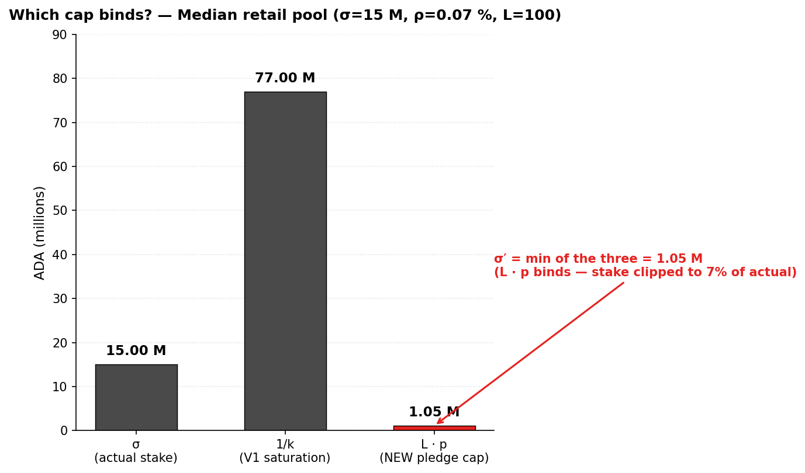
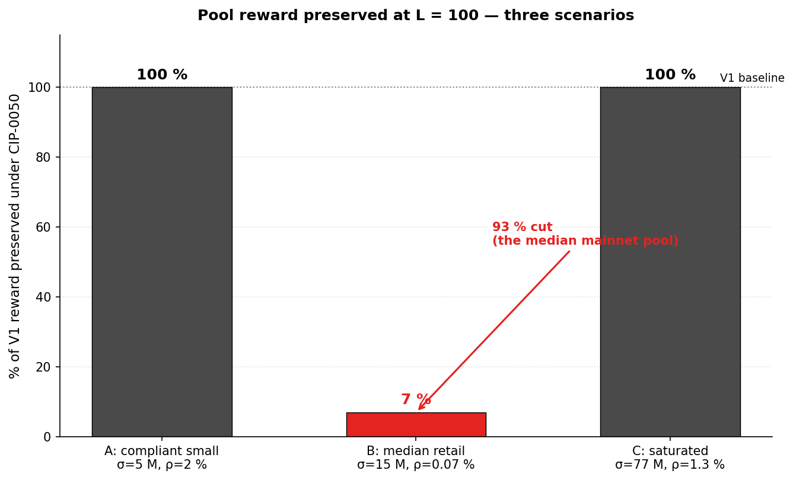
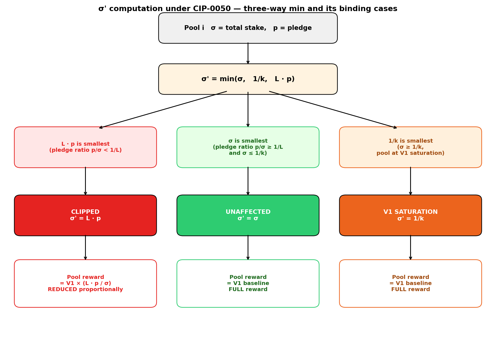
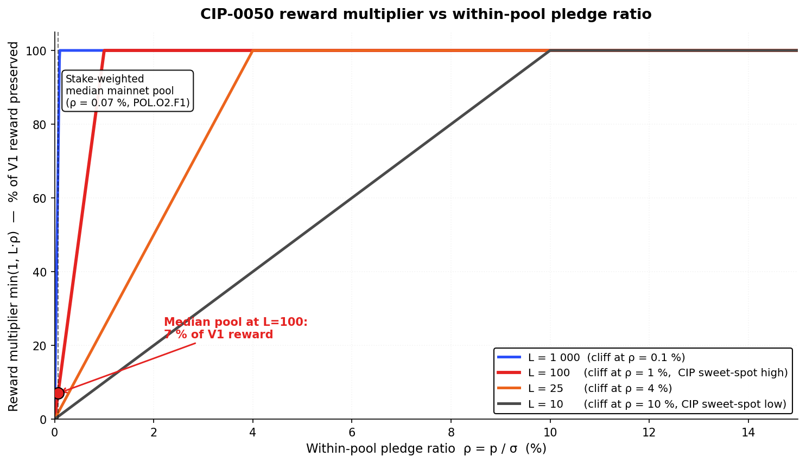
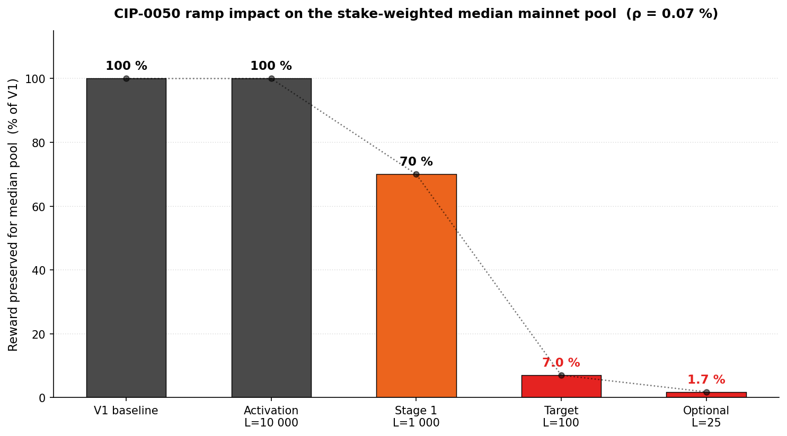
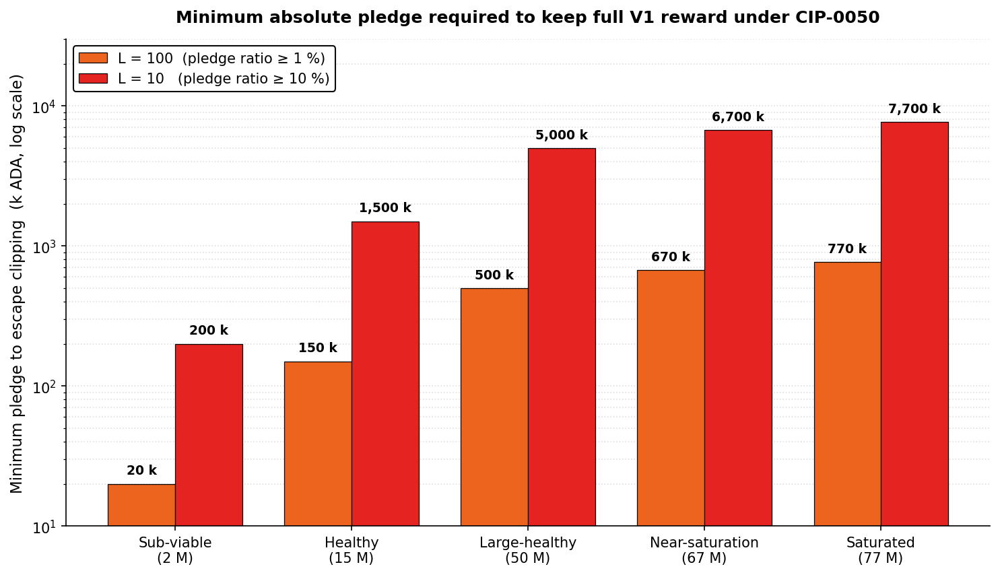
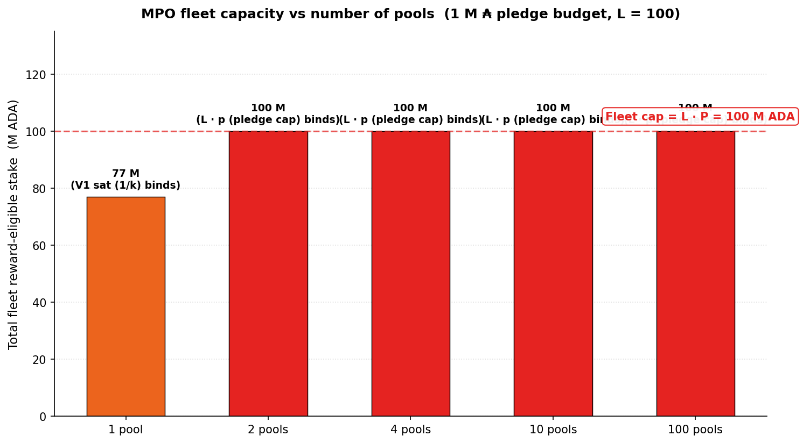
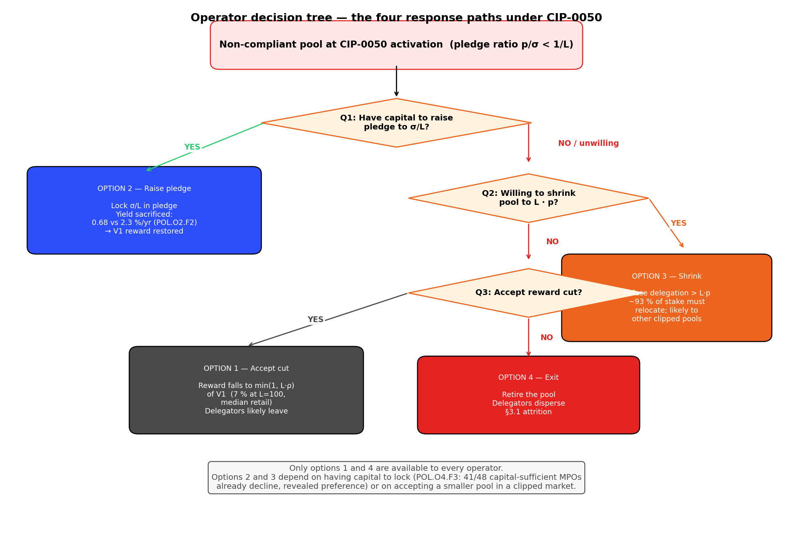
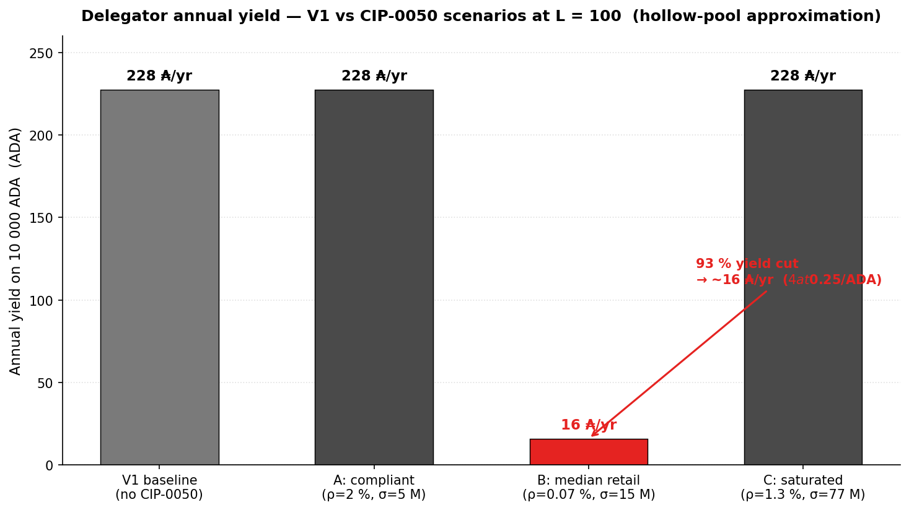
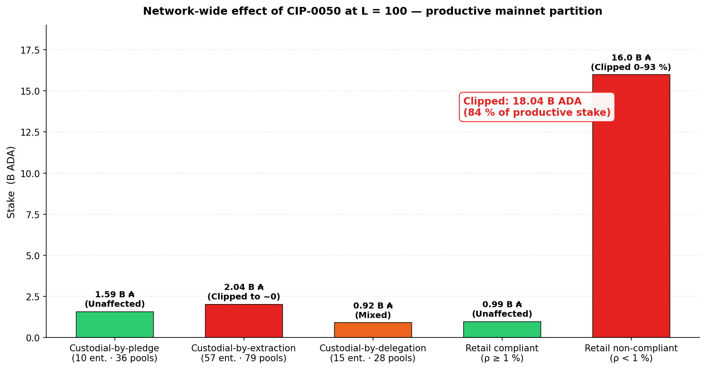

# CIP-0050 — Pledge Leverage-Based Staking Rewards

> **Status:** Active 2026/04/23. Stake-cap-layer candidate. CIP identity and sources in §1; evaluation references in §3.4.

CIP-0050 introduces a single new parameter — the **pledge leverage `L`** — that makes pledge a binding cap on each pool's reward-eligible stake. The new rule is `σ' = min(σ, 1/k, L · p)`: a pool can earn rewards on at most `L` times its operator's pledge, in addition to the existing V1 saturation cap. Pools with zero pledge collapse to zero reward; pool-splitting becomes revenue-neutral by construction. The reform sits **upstream of the operator/member split**, modifying the reward envelope itself rather than how the envelope is divided.

This is the **sharpest pledge-as-signal instrument** in the candidate bundle. It targets V2 §3.2 (pledge as signal) and §3.4 (pool-level concentration via Sybil cost) directly — the formula's structure now forces operators to demonstrate skin in the game to capture delegation. But it does so by discriminating on the operator's **capital capability**, not on operator quality or network contribution: a population that cannot self-pledge (custodial-by-extraction entities, under-capitalised retail operators) is penalised regardless of how reliably they produce blocks or serve delegators.

*The core question this evaluation asks: does CIP-0050 repair the pledge signal at an acceptable cost to the operator populations that cannot respond by raising pledge?*

The argument proceeds in three parts:

1. **Introduction** (§1). CIP identity card, origin and historical context, the diagnostic findings the proposal targets, and the V2 §3 problem statement (Missing CPS) it implicitly addresses.

2. **Mechanism** (§2). The formula and design surface, expressed in the (ν, π) basis with worked examples; the three binding regimes; structural properties that hold regardless of operator response; the reduced compliance condition `π < 1/L` that makes the rule mechanically simple.

3. **Limits as a standalone proposal** (§3). Three synthesis findings — S1 (mechanical sharpness — Delivers), S2 (capital-capability bias — Regresses), S3 (entity-level §3.4 gap and small-pool viability risk — Regresses + Blind spot) — each anchored in quantitative findings against the canonical 9-tier pool-size taxonomy and the n-MPO operator-fleet brackets.

The Executive summary below packages the verdict in one place; the Findings summary table after it is the navigation index for §3.

## Executive summary

- **Verdict.** **Sharpest pledge-as-signal instrument in the bundle.** A single scalar parameter $L$ makes pledge a binding cap on reward-eligible stake: $\sigma' = \min(\sigma, 1/k, L \cdot p)$. Zero-pledge pools collapse to zero reward; pool-splitting is revenue-neutral. But the instrument **discriminates by capital capability, not by operator quality** — a population that cannot self-pledge (custodial funds, under-capitalised retail operators) is penalised regardless of network contribution.
- **Instrument.** One new parameter `pledgeLeverage` ($L$, dimensionless). Modifies the reward-eligible stake $\sigma'$ used inside the SL-D1 formula, *upstream* of the operator/member split. HFC required (new ledger variable). Existing certificates preserved.
- **Three synthesis findings carry the verdict** — detailed in §3 and re-surfaced inline:
  - **S1** — Mechanical sharpness: zero-pledge hard break + pool-splitting revenue-neutral make pledge binding on the reward formula at the pool level (2 [D] F's: §3.1).
  - **S2** — Capital-capability bias: the reward rule discriminates by the operator's ability to self-pledge, not by operator quality; the population most affected is not the target the V2 §3.2 rationale names (2 [R] + 1 [B] F's: §3.2).
  - **S3** — Entity-level §3.4 concentration gap and viability risk to the small-pool tail (2 [R] + 1 [B] F's: §3.3).

## Findings summary

CIP evaluations use a three-level taxonomy mirroring the diagnostic's `SUBFLOW.O<n>.F<m>`: **S<n>** = synthesis finding; **F<m>** = quantified finding anchored in §2 / §3. Each F tagged **[D] Delivers / [R] Regresses / [B] Blind spot**.

| Code | Tag | Claim | Emerges in |
|---|---|---|---|
| **CIP-0050.S1** | | **Mechanically sharp on pledge-as-signal: zero-pledge hard break + revenue-neutral pool-splitting** | §3.1 |
| CIP-0050.S1.F1 | [D] | **Zero-pledge hard break.** $L \cdot 0 = 0$: any pool with $\pi = 0$ (no self-pledge) has $\sigma' = 0$ and earns zero reward regardless of delegation. Restores pledge as a binding constraint — direct delivery on V2 §3.2 pledge-as-signal | §2.2, §3.1 |
| CIP-0050.S1.F2 | [D] | **Pool-splitting revenue-neutral.** A pledge budget $P$ split across $N$ pools produces a total cap of $L \cdot P$ — identical to the single-pool cap. MPO fleet expansion delivers no reward advantage at the pool level — direct delivery on V2 §3.4 pool-level concentration | §2.2, §3.1 |
| **CIP-0050.S2** | | **Capital-capability bias: the reward rule discriminates by the operator's capacity to self-pledge, not by operator quality** | §3.2 |
| CIP-0050.S2.F1 | [R] | **Median retail pool is cut by ~93 %.** At L=100 and the stake-weighted median retail pledge ratio of 0.07 % (POL.O2.F1), $L \cdot p = 0.07 \sigma$ and $\sigma' = 0.07\sigma$. Pool reward drops to **~7 % of its V1 baseline**. 78 % of staked ADA sits in pools below the 1 % pledge-ratio threshold where the cap begins to bind | §2.3, §3.2 |
| CIP-0050.S2.F2 | [R] | **Custodial segment (21 % of productive stake) cannot respond.** Custodial-by-extraction entities (57 entities, 2.04 B ADA) hold custodied retail funds with structural $p = 0$; reward collapses to zero with no recourse. Custodial-by-pledge (10 entities, 1.59 B) already self-pledge at scale and are unaffected — but do not compete for retail delegation anyway | §1.3, §3.2 |
| CIP-0050.S2.F3 | [B] | **The bet that operators will pledge more is contradicted by the opportunity-cost data.** POL.O2.F2: pledge yield is 0.68 %/yr at best vs 2.3 %/yr on passive delegation. POL.O4.F3: 41 of 48 capital-sufficient MPOs already forfeit the bonus today. CIP-0050 shifts the rules but not the passive-delegation-vs-pledge comparison — and adds opportunity cost without flipping the dominance relation | §3.2 |
| **CIP-0050.S3** | | **Entity-level §3.4 concentration gap and §3.1 viability risk to the retail small-pool tail** | §3.3 |
| CIP-0050.S3.F1 | [R] | **Entity-level §3.4 gap.** Custodial-by-pledge entities with native pledge ≫ $L \cdot p$ bind neither cap — these are today's largest concentration of stake (10 entities, 1.59 B ADA) and remain untouched. The concentration metric that matters for Sybil resistance is entity-level, not pool-level | §3.3 |
| CIP-0050.S3.F2 | [R] | **§3.1 viability risk.** Retail small-pool operators with attracted delegation and low pledge (POL.O5.F2: 78 % of single-pool stake non-compliant) see reward clipped — and with the fee split unchanged, *both* operator take and delegator ROS fall proportionally. Without a companion fee-layer viability floor, CIP-0050 accelerates small-pool attrition | §3.3 |
| CIP-0050.S3.F3 | [B] | **The "new entrants will fill new slots" argument requires a delegator-response channel the diagnostic does not support.** OPE.O7.F1: delegation is not sticky but does not clearly follow yield; the population willing to migrate from a clipped pool to a higher-pledge alternative on ROS signal is narrow. The decentralisation gain therefore depends on a redistribution channel that may not materialise | §3.3 |

*Cross-layer link.* CIP-0050 acts on the **right V2 layer** (reward-distribution, pre-split) for a distribution fix — the layer the fee-layer critique ([`../operator-delegator/README.md`](../operator-delegator/README.md)) identified as the principled home for viability and concentration reforms. But the **target** is V2 §3.2 pledge-as-signal, not §3.1 viability. Deploying CIP-0050 without an active §3.1 instrument risks accelerating the very small-pool attrition V2 §3.1 is meant to prevent (see S3.F2).

## Table of Contents

- [Executive summary](#executive-summary)
- [Findings summary](#findings-summary)
- [1. Introduction](#1-introduction)
  - [1.1 Identity card](#11-identity-card)
  - [1.2 Origin and context](#12-origin-and-context)
  - [1.3 Related diagnostic findings](#13-related-diagnostic-findings)
  - [1.4 Missing CPSs — mapping to V2 §3](#14-missing-cpss--mapping-to-v2-3)
- [2. Mechanism](#2-mechanism)
  - [2.1 Formula](#21-formula)
  - [2.2 Walking through the formula — three scenarios](#22-walking-through-the-formula--three-scenarios)
  - [2.3 How much pledge does an operator need?](#23-how-much-pledge-does-an-operator-need)
  - [2.4 Visualising the σ' cap — the "pledge cliff" at the 1/L threshold](#24-visualising-the-σ-cap--the-pledge-cliff-at-the-1l-threshold)
  - [2.5 Structural properties (theorems, not predictions)](#25-structural-properties-theorems-not-predictions)
  - [2.6 What this means for different operator types — a worked map](#26-what-this-means-for-different-operator-types--a-worked-map)
  - [2.7 Operator decision tree — the four response paths](#27-operator-decision-tree--the-four-response-paths)
  - [2.8 The delegator perspective — what a 10 k delegator sees](#28-the-delegator-perspective--what-a-10-k-delegator-sees)
  - [2.9 The CIP's recommended deployment ramp](#29-the-cips-recommended-deployment-ramp)
  - [2.10 Network-wide effect at L = 100 — who is clipped, who is not](#210-network-wide-effect-at-l--100--who-is-clipped-who-is-not)
- [3. Limits of CIP-0050 as a standalone proposal](#3-limits-of-cip-0050-as-a-standalone-proposal)
  - [3.1 S1 — Mechanical sharpness on pledge-as-signal](#31-s1--mechanical-sharpness-on-pledge-as-signal)
  - [3.2 S2 — Capital-capability bias](#32-s2--capital-capability-bias)
  - [3.3 S3 — Entity-level gap and small-pool viability risk](#33-s3--entity-level-gap-and-small-pool-viability-risk)
  - [3.4 References](#34-references)

## 1. Introduction

**CIP-0050 — "Pledge Leverage-Based Staking Rewards".** A 2022 proposal (updated 2025) to make the pool-operator pledge into a binding cap on the reward-eligible stake of a pool. The core idea: convert pledge from a cosmetic bonus into a leverage limit.

### 1.1 Identity card

| Field | Value |
| --- | --- |
| CIP number | CIP-0050 |
| Title | Pledge Leverage-Based Staking Rewards |
| Authors | Michael Liesenfelt, Ryan Wiley, Rich Manderino, Stef M, Wayne, Homer J, Chad |
| Created | 2022/04/04 |
| Last updated | 2025/05/20 |
| Category | Ledger |
| Status | Proposed (as of 2026/04) |
| Official page | [cips.cardano.org/cip/CIP-0050](https://cips.cardano.org/cip/CIP-0050) |
| Source (GitHub) | [cardano-foundation/CIPs / CIP-0050](https://github.com/cardano-foundation/CIPs/tree/master/CIP-0050) |
| Discussion PRs | [#242 (original)](https://github.com/cardano-foundation/CIPs/pull/242), [#1042 (2025 update)](https://github.com/cardano-foundation/CIPs/pull/1042) |

### 1.2 Origin and context

**Authorship and moment.** Written in April 2022 by Michael Liesenfelt and co-authors, updated in May 2025. The authors' central observation: under $a_0 = 0.3$, the yield gap between zero-pledge and fully-pledged pools is ~22 % — "statistically unnoticed" by delegators and dominated by epoch-to-epoch variance. The CIP converts pledge from a *nudge* (a small yield advantage that delegators could notice) into a *constraint* (a hard cap on reward-eligible stake that makes pledge load-bearing).

**Scope.** CIP-0050 modifies **the reward-distribution formula itself** (the σ' clipping rule), not the fee-layer split. It is therefore a pools-distribution-layer instrument, not a fee-layer instrument. A pool with clipped σ' produces less reward in total; the split between operator and delegators remains whatever the fee-layer parameters (`minPoolCost`, `poolRate`) dictate.

**Relation to other CIPs in the evaluation bundle.**
- **Fee-layer CIPs (CIP-0023, CIP-0082)** act on a different layer (post-per-pool-allocation split). CIP-0050 composes cleanly with either on the mechanical axis — they act on sequential stages of the reward pipeline — but the two sets target different V2 milestones.
- **CIP-0037** is the other stake-cap candidate in this evaluation. Same target (§3.2 pledge signal + §3.4 concentration) via a different primitive (smooth saturation curve vs hard cap). A coherent V2 package picks one stake-cap instrument; stacking both is not canonical.
- **`k` lever** is the transversal parameter. CIP-0050 text argues $L$ converts a `k`-raise from a concentration risk into a decentralisation lever (stake-cap CIPs foreclose MPO fleet expansion; new slots therefore go to new operators rather than existing fleets). Standalone k-analysis: [`../operator-delegator/k-parameter.md`](../operator-delegator/k-parameter.md).

### 1.3 Related diagnostic findings

CIP-0050 targets exactly the pledge pathology our mainnet diagnostic documents. Six findings are directly relevant.

| Finding | Why shared | Supporting observations |
| --- | --- | --- |
| **POL.O2.F1 — 78 % of staked ADA sits in pools with pledge ratio < 1 %; stake-weighted median is 0.07 %** | CIP-0050 at L=100 begins to bind precisely at the 1 % pledge ratio. The median retail pool sits far below that threshold — so a majority-of-stake population is the direct subject of the reform | — |
| **POL.O2.F2 — Pledge yield is 0.68 %/yr at best (full saturation + full self-pledge) vs ~2.3 %/yr on passive delegation** | The CIP assumes operators will respond by increasing pledge. The opportunity-cost data shows pledge is dominated by passive delegation yield; shifting σ' rules does not flip this comparison. The *why* behind POL.O2.F1 is not the absence of the constraint; it is the economic dominance of the non-pledge choice | "The 'game' for operators is overwhelmingly about size (ν), not commitment (π)" — POL.O2.F2 |
| **POL.O4.F1 / POL.O4.F2 — 85 MPO entities operate 901 pools holding 16.4 B ₳ (75.4 % of participating stake); 48 of them are capital-sufficient** | The entity-level concentration metric that matters for Sybil resistance. CIP-0050 is revenue-neutral against pool-splitting but leaves the 10 custodial-by-pledge entities with native pledge unconstrained — and those entities hold a large share of stake today | — |
| **POL.O4.F3 — 41 of 48 capital-sufficient MPOs are non-compliant on pledge** | The population that *could* respond to CIP-0050 by increasing pledge has already shown it does not choose that option under current rules. CIP-0050 shifts the rules but the opportunity-cost calculus does not flip | — |
| **POL.O5.F2 — 78 % of single-pool stake is non-compliant (pledge ratio < 2 %). Compliant + exemplary hold 5.8 % — economically negligible** | Retail single-pool operators — the population V2 §3.1 targets — empirically do not pledge. CIP-0050 at L=100 clips this population's reward, accelerating attrition | — |
| **OPE.O7.F1 — Delegation is not sticky but not clearly yield-following either** | The CIP's "new entrants will fill the slots vacated by clipped pools" argument requires a delegator-response channel. OPE.O7.F1 shows the observed flow tracks brand / wallet / visibility rather than yield — the response channel is uncertain | — |

### 1.4 Missing CPSs — mapping to V2 §3

CIP-0050 ships with an explicit problem statement: pledge is priced as irrelevant, and the reward formula should make it binding. Mapped to V2 §3:

| V2 slot | What CIP-0050 proposes as the fix | Weight | Evidence base |
| --- | --- | --- | --- |
| [§3.2 Restore the notion of pledge among operators](../../README.md#32-restore-the-notion-of-pledge-among-operators) | $L \cdot p$ cap on reward-eligible stake — zero-pledge hard break, pool-splitting revenue-neutral | **Primary** | POL.O2.F1, POL.O2.F2 |
| [§3.4 Reduce the concentration effects that distort both populations](../../README.md#34-reduce-the-concentration-effects-that-distort-both-populations) | Revenue-neutral pool splitting → MPO fleet expansion no longer delivers reward advantage at the pool level | **Secondary (pool-level only)** | POL.O4.F1, POL.O4.F2 |
| [§3.1 Guarantee operator viability across the entire productive population](../../README.md#31-guarantee-operator-viability-across-the-entire-productive-population) | Not addressed by the instrument. The fee-layer split (`minPoolCost`, margin) is untouched; the σ' clip only makes low-pledge pools *worse* | **Out of scope** — and potentially regressive without a companion §3.1 instrument | OPE.O6.F4, POL.O5.F2 |
| [§3.3 Maintain and diversify a competitive delegator yield](../../README.md#33-maintain-and-diversify-a-competitive-delegator-yield) | Not addressed. Delegator ROS reshuffles via σ' clipping but the distribution narrows to pledge-compliant pools | **Out of reach** | — |

**Foundational point.** V2 §3.2 (pledge signal) and §3.4 (concentration) are downstream problems that V2 places *on top of* §3.1 (operator viability). CIP-0050 correctly targets §3.2 but does not address §3.1 — and per §3.2 of this file (S2 in the findings), it may actively worsen the §3.1 population. The instrument is coherent on its own terms but requires a companion §3.1 reform.

## 2. Mechanism

### 2.1 Formula

CIP-0050 modifies the reward-eligible stake $\sigma'$ entering the SL-D1 reward function (full treatment in [pools-distribution §2.3](../../diagnostic/sub-flows/pools-distribution/mainnet-analysis/README.md#23-reward-function)):

$$\sigma'^{(50)}_{i} = \min\!\left(\sigma_{i},\ \frac{1}{k},\ L \cdot p_{i}\right)$$

**Symbols — inherited from the SL-D1 formula as simplified in the sub-flow.** The RSS protocol normalises stake and pledge as **fractions of circulating supply**, not absolute ADA. Under that convention:

- $\sigma_i$ — pool $i$'s **total stake** (pledge + delegated), as a fraction of circulating supply.
- $p_i$ — pool $i$'s **pledge**, as a fraction of circulating supply.
- $k$ — target-pool count protocol parameter.
- $z_0 = 1/k$ — the **saturation threshold** as a fraction of circulating supply. At $k = 500$ and today's mainnet Supply, $z_0 \cdot \text{Supply} \approx 77$ M ADA in absolute terms.
- $L$ — new leverage cap, dimensionless ($L \geq 1$).

The reward curve is expressed in two **normalised coordinates** (from pools-distribution §2.3):

- **$\nu = \sigma / z_0$ — stake saturation level:** what fraction of one fully-saturated V1 pool the total stake represents. $\nu = 1$ means the pool is at V1 saturation; $\nu > 1$ means oversaturated.
- **$\pi = s / \sigma$ — within-pool pledge ratio:** the fraction of the pool's stake the operator commits as their own. $\pi = 0$ means hollow pool; $\pi = 1$ means full self-pledge.

These are independent coordinates over $[0, 1] \times [0, 1]$. The pool reward is $\hat f'(\nu, \pi, \bar p) = \bar p \cdot P_{\max} \cdot E(\nu, \pi)$ where $P_{\max} = R/k$ (reward ceiling) and $E(\nu, \pi)$ is the envelope function (see [pools-distribution §2.3](../../diagnostic/sub-flows/pools-distribution/mainnet-analysis/README.md#23-reward-function)).

**CIP-0050 in normalised coordinates.** Substituting $\sigma = \nu z_0$ and $p = s = \pi \nu z_0$ into the CIP formula and dividing by $z_0$:

$$\nu'^{(50)}_{i} \;=\; \min\!\left(\nu_{i},\ 1,\ L \cdot \pi_{i} \cdot \nu_{i}\right) \;=\; \nu_{i} \cdot \min\!\left(1,\ \tfrac{1}{\nu_{i}},\ L \cdot \pi_{i}\right)$$

For pools below or at V1 saturation ($\nu \leq 1$) the second term $1/\nu \geq 1$ is dominated, so the formula simplifies to $\nu' = \nu \cdot \min(1, L \cdot \pi)$. The reward becomes $\hat f' = \bar p \cdot P_{\max} \cdot E(\nu', \pi)$.

**Reading the formula — the three binding cases:**

| Constraint | What it does | When it binds |
| --- | --- | --- |
| $\nu$ (or $\sigma$) | The pool's actual total-stake saturation | Not binding by itself — it is the target $\nu'$ starts from |
| $1$ (or $1/k$) | The V1 saturation cap — same as today | When the pool is at or above saturation ($\nu \geq 1$, i.e. $\sigma \geq z_0$ ≈ 77 M ADA) |
| $L \cdot \pi \cdot \nu$ (or $L \cdot s$) | **New** — cap proportional to absolute pledge | When the **within-pool pledge ratio is too low**: $L \cdot \pi < 1$, i.e. $\pi < 1/L$ |

For $L = 100$: the new cap binds whenever the pool's **within-pool pledge ratio** $\pi$ falls below **1 %**. Above 1 %, CIP-0050 is invisible; at or below 1 %, the effective saturation level $\nu'$ is clipped to $L \cdot \pi \cdot \nu$ and the reward shrinks accordingly. *The compliance condition reduces to a direct threshold on the pledge ratio.*

**Visualising the three caps — which one wins, for the median retail pool.**

*Reading.* σ' = min of the three bars = **1.05 M ₳** (the third cap, $L \cdot p$). The new pledge cap slices the pool's reward-eligible stake down to 7 % of its actual size. This is the mechanical signature of CIP-0050: when the median mainnet pool is evaluated against the three caps, the new pledge cap is dramatically smaller than the other two, and it wins the min.

**Design surface.**

| Property | Value |
| --- | --- |
| New parameter | $L$ (`pledgeLeverage`), dimensionless |
| Range | $1 \leq L \leq 10\,000$ |
| CIP-recommended sweet spot | $L \in [10, 100]$ |
| Layer | Stake-cap (applied *before* reward curve) |
| Fee-layer split | Unchanged |
| Hard fork | Required (new ledger variable) |
| Re-registration | Not required |
| Governance surface | 1 scalar |

### 2.2 Walking through the formula — three scenarios

The three min-arguments ($\nu$, 1, $L\cdot\pi\cdot\nu$) — equivalently $(\sigma, 1/k, L\cdot s)$ in absolute units — carve the state space into three regimes. Each scenario below shows the four quantities $(\sigma, s, \nu, \pi)$ alongside the binding cap. $z_0 \approx 77$ M ADA at today's mainnet, L = 100.

**Scenario A — Compliant small pool (within-pool pledge ratio $\pi \geq 1/L = 1\,\%$).**

| Quantity | Value |
| --- | --- |
| Total stake $\sigma_{\text{abs}}$ | 5 M ₳ |
| Pledge $s_{\text{abs}}$ | 100 k ₳ |
| Stake saturation level $\nu = \sigma/z_0$ | 0.065 (6.5 % of V1 saturation) |
| Pledge ratio $\pi = s/\sigma$ | **0.020 (2 %)** — at or above $1/L = 1\,\%$ |
| $L \cdot \pi$ | 2.0 — greater than 1, so $L\cdot\pi\cdot\nu = 2\nu > \nu$, does **not** bind |
| $\nu' = \min(\nu, 1, L\cdot\pi\cdot\nu)$ | **$\nu$** — cap inactive |
| Pool reward | V1 baseline, unchanged |

**Scenario B — Non-compliant mainnet-median pool (within-pool pledge ratio 0.07 %).**

| Quantity | Value |
| --- | --- |
| Total stake $\sigma_{\text{abs}}$ | 15 M ₳ (Healthy tier) |
| Pledge $s_{\text{abs}}$ | 10.5 k ₳ (stake-weighted median per POL.O2.F1) |
| $\nu = \sigma / z_0$ | 0.195 (19.5 % of V1 saturation) |
| $\pi = s/\sigma$ | **0.0007 (0.07 %)** — far below $1/L = 1\,\%$ |
| $L \cdot \pi$ | 0.07 — less than 1, so $L\cdot\pi\cdot\nu = 0.07\,\nu < \nu$, **cap binds** |
| $\nu' = \min(\nu, 1, L\cdot\pi\cdot\nu)$ | $\nu' = L\cdot\pi\cdot\nu = $ **0.0136** (saturation level clipped to 1.4 % of V1) |
| Pool reward | $\nu'/\nu = L\cdot\pi = 0.07 \approx$ **7 % of V1 baseline** — 93 % cut |

**Scenario C — Saturated pool with thin pledge.**

| Quantity | Value |
| --- | --- |
| Total stake $\sigma_{\text{abs}}$ | 77 M ₳ (at saturation) |
| Pledge $s_{\text{abs}}$ | 1 M ₳ |
| $\nu = \sigma / z_0$ | 1.0 (at V1 saturation) |
| $\pi = s/\sigma$ | **0.013 (1.3 %)** — above $1/L = 1\,\%$ |
| $L \cdot \pi$ | 1.3 — greater than 1, so $L\cdot\pi\cdot\nu = 1.3 > 1$, the V1 cap (1) wins |
| $\nu' = \min(\nu, 1, L\cdot\pi\cdot\nu)$ | $\nu' = $ **1.0** (V1 saturation cap binds) |
| Pool reward | V1 baseline, unchanged |

**The core consequence.** For a given $L$, the reform partitions the pool population by a single threshold on the **within-pool pledge ratio** $\pi$: at or above $1/L$, CIP-0050 is inactive; below it, the effective saturation level $\nu'$ is clipped to $L \cdot \pi \cdot \nu$ and the pool reward scales with the clip ratio $\nu'/\nu = L \cdot \pi$. Scenarios A and C both illustrate "cap does not bind" but for different reasons — A is compliant on pledge ratio; C is bounded by V1 saturation before the pledge cap can bite.

**The three scenarios side by side.**

*Reading.* The two compliant pools (A and C) see zero change. The median retail pool (B) — which is where 78 % of staked ADA sits per POL.O2.F1 — is cut to 7 %. The reform draws a **binary line** on the pledge-ratio axis at $1/L$: above it, invisible; below it, severe.

### 2.3 How much pledge does an operator need?

For any pool with stake $\sigma$, the minimum pledge to escape clipping at $L = 100$ is:

$$p_{\min} = \frac{\sigma}{L} = \frac{\sigma}{100}$$

Worked across the canonical nine-tier taxonomy (from [pools-distribution §4.1.3](../../diagnostic/sub-flows/pools-distribution/mainnet-analysis/README.md#413-tier-definitions)):

| Tier | Representative σ | Minimum pledge to escape clipping at $L = 100$ | Minimum pledge at $L = 10$ |
|---|---:|---:|---:|
| Dormant | 50 K | 500 ₳ | 5 000 ₳ |
| Sub-production | 500 K | 5 000 ₳ | 50 000 ₳ |
| Sub-viable | 2 M | 20 000 ₳ | 200 000 ₳ |
| Healthy | 15 M | 150 000 ₳ | 1 500 000 ₳ |
| Large healthy | 50 M | 500 000 ₳ | 5 000 000 ₳ |
| Near-saturation | 67 M | 670 000 ₳ | 6 700 000 ₳ |
| Saturated | 77 M | 770 000 ₳ | 7 700 000 ₳ |

**Reading the table.** At $L = 100$, a Healthy-tier pool needs **150 k ADA** (≈ $37 k USD at \$0.25/ADA) to escape clipping. A Saturated-tier pool needs **770 k ADA** (≈ $192 k USD). At the tighter $L = 10$ the CIP considers, the pledge requirement is **10× higher** — a Healthy pool would need 1.5 M ADA (≈ $375 k USD).

### 2.4 Visualising the σ' cap — the "pledge cliff" at the 1/L threshold

**How the σ' is computed — the three-way min.**

*Reading the flow.* Each pool's effective stake σ' is the smallest of three caps. Which cap binds partitions the pool population into three regimes: **Clipped** (new pledge-leverage cap binds — pool reward reduced to V1 × L·p/σ), **Unaffected** (actual stake binds — full V1 reward), **V1 saturation** (the legacy 1/k cap still binds, CIP-0050 is a no-op for these pools).

**Reward preserved vs pledge ratio — the cliff shape at different L values.**

*Four curves shown: **L = 1 000** (near-inactive — cliff at 0.1 %), **L = 100** (CIP sweet-spot high end — cliff at 1 %), **L = 25**, **L = 10** (CIP sweet-spot low end — cliff at 10 %). Higher L = earlier cliff = less aggressive clipping. All curves are linear up to the cliff, then flat at 100 %. The median mainnet pool at ρ = 0.07 % (POL.O2.F1) is explicitly marked on the L=100 curve — 7 % of V1 reward preserved.*

**Where the mainnet stake sits today relative to the cliff.** The stake-weighted-median retail pledge ratio is **0.07 %** (POL.O2.F1). That is marked on the X axis above and falls in the clipped regime at every L ≥ 10. At the CIP's recommended $L = 100$, the median pool preserves only 7 % of its V1 reward.

**The ramp, seen from the median mainnet pool.**

*Reading.* Each step of the CIP's staged ramp compresses the median pool's reward by roughly an order of magnitude. The "activation" step ($L = 10\,000$) is designed to be a no-op — only pools with pledge ratio below 0.01 % are affected. At $L = 1\,000$ the median pool starts to feel the clip (~70 % preserved). At $L = 100$ (the CIP's long-run target) the median pool is reduced to 7 %. At the optional $L = 25$ step it falls to ~1.75 %.

**Summary table for precision:**

| Leverage $L$ | Cliff threshold (minimum compliant pledge ratio) | Median-pool reward fraction (π = 0.07 %) |
|---:|---:|---:|
| $L = 10\,000$ (near-inactive) | 0.01 % | ~100 % (essentially no effect) |
| $L = 1\,000$ | 0.1 % | ~70 % |
| $L = 100$ (CIP sweet-spot high end) | **1 %** | **~7 %** |
| $L = 25$ | 4 % | ~1.75 % |
| $L = 10$ (CIP sweet-spot low end) | 10 % | ~0.7 % |

### 2.5 Structural properties (theorems, not predictions)

Four properties follow directly from the formula — independent of any behavioural assumption:

| Property | Statement | Type |
|---|---|---|
| **Zero-pledge hard break** | $\pi = 0 \Rightarrow L \cdot p = 0 \Rightarrow \sigma' = 0 \Rightarrow \hat f' = 0$ | Algebraic |
| **Pool-splitting revenue-neutral** | A pledge budget $P$ split across $N$ pools of equal pledge $p = P/N$ gives a total cap $N \cdot (L \cdot P/N) = L \cdot P$ = single-pool cap | Algebraic |
| **Monotonicity in pledge** | $\partial \sigma'/\partial p \geq 0$ on the binding branch ($\sigma' = L\cdot p$); rewarding higher pledge is strictly (weakly) weighted | Algebraic |
| **Price invariance** | $L$ is dimensionless; the cap is a ratio | Structural |

These are the **design strengths** of CIP-0050. They hold regardless of whether operators respond behaviourally.

### 2.6 What this means for different operator types — a worked map

**A concrete example.** Consider three mainnet operator archetypes (profiles inferred from [operator-delegator §4.3.3](../../diagnostic/sub-flows/operator-delegator-distribution/mainnet-analysis/README.md)):

| Operator type | Pool stake σ | Self-pledge p | Pledge ratio | σ' at L=100 | V1 reward preserved | What they must do to stay whole |
|---|---:|---:|---:|---:|---:|---|
| **Everstake-style 11+ MPO** (per pool) | 33.4 M ₳ | ~30 k ₳ (0.09 %) | 0.09 % | 3.0 M ₳ | **9 %** | Add ~304 k ADA pledge per pool — for an 11-pool fleet, ~3.3 M ADA total |
| **Community single-pool** (typical retail) | 11.4 M ₳ | ~8 k ₳ (0.07 %) | 0.07 % | 0.8 M ₳ | **7 %** | Add ~106 k ADA pledge — ≈ $27 k USD at \$0.25/ADA |
| **Cardano Foundation / private treasury** | 77 M ₳ | large (e.g. 60 M ₳ at 78 % ratio) | ≥ 1 % | 77 M ₳ | **100 %** | Nothing — already compliant |

**The operator-level implication.** Compliance under CIP-0050 at $L = 100$ requires the operator to **lock 1 % of the pool's total stake as pledge**. Three populations face very different economics:

- **Custodial-by-extraction (CEX / IVaaS)** — *cannot* self-pledge (funds are custodied retail balances, legally separate from operator capital). σ collapses to σ' = 0. Their **only recourse is to attract pledge-holding partners or exit**.
- **Retail small-pool operators** — the median pool needs hundreds of thousand of ADA in additional self-pledge. Most operators in this segment **do not have this capital liquid**. Their realistic options are: (a) shrink the pool by refusing delegation beyond $L \cdot p$, (b) accept the reward cut, (c) exit.
- **Treasury / foundation pools** — already compliant by construction. The reform is a no-op for this segment.

The reform's **signal to the network** is: *"to operate a pool that captures delegation, you must prove 1 % of the pool's stake in personal capital"*. That signal is clean in principle — it is exactly the pledge-as-binding-commitment V2 §3.2 asks for — but it **selects for the operator's capital capability**, which does not correlate with operator quality or network contribution (see §3.2).

**Minimum pledge to escape clipping, by tier — a visual ladder.**

*Two bars per tier (orange = L=100, red = L=10). At L = 100, a Healthy-tier pool operator needs 150 k ₳ (~$37 k USD at \$0.25/ADA) of self-pledge. At L = 10, the same operator needs 1.5 M ₳ (~$375 k USD). The capital threshold scales **linearly with pool stake** (at fixed L) and **linearly with 1/L** (at fixed stake) — a quadratic compounding across the two axes as the ramp tightens.*

**The pool-size sweep at median pledge.** At the stake-weighted-median pledge ratio of 0.07 %, the fraction of reward preserved is the *same* for every pool size (7 %) — but the absolute stake clipped scales with σ:

| Tier | σ | Pledge at 0.07 % ratio | L · p (at L = 100) | σ' | V1 stake clipped away |
|---|---:|---:|---:|---:|---:|
| Sub-viable | 2 M | 1.4 k ₳ | 140 k | 140 k | **1.86 M ₳** (93 %) |
| Healthy | 15 M | 10.5 k ₳ | 1.05 M | 1.05 M | **13.95 M ₳** (93 %) |
| Large healthy | 50 M | 35 k ₳ | 3.5 M | 3.5 M | **46.5 M ₳** (93 %) |
| Near-saturation | 67 M | 47 k ₳ | 4.7 M | 4.7 M | **62.3 M ₳** (93 %) |
| Saturated | 77 M | 53.9 k ₳ | 5.39 M | 5.39 M | **71.6 M ₳** (93 %) |

*Reading the table.* The relative impact is uniform (7 % preserved everywhere at the same pledge ratio), but the absolute "stake in exile" grows linearly with the pool. A Saturated-tier pool with the median pledge ratio loses 71.6 M ₳ of reward-earning stake — the bulk of its delegation effectively becomes unrewarded overnight unless the operator raises pledge.

**What can an operator do?** A non-compliant operator facing the cap has four response paths. Using the **Healthy-tier 15 M ₳ pool** as the reference (10.5 k ₳ pledge = 0.07 % ratio):

| Option | Action | Outcome | Feasibility |
|---|---|---|---|
| 1 — **Accept the cut** | Do nothing | Pool reward falls to 7 % of V1; operator take and delegator ROS both cut proportionally (fee split is unchanged) | Always available; signals to delegators "this pool no longer competes" |
| 2 — **Raise pledge to compliance** | Add ~140 k ₳ pledge to reach 1 % ratio (~$35 k USD at $0.25/ADA) | Cap no longer binds; pool reward restored to V1 | Feasible only for operators with this much liquid capital; opportunity cost = pledge yield (0.68 %/yr) vs passive delegation (2.3 %/yr) — **negative on that axis alone** (POL.O2.F2) |
| 3 — **Shrink the pool** | Refuse delegation beyond $L \cdot p = 1.05$ M | Pool stays compliant but at a fraction of its current size; ~14 M ₳ of former delegation must relocate | Feasible but destructive: delegators seek new pools that are themselves likely clipped |
| 4 — **Exit** | Retire the pool | Stake and delegators both dispersed | Feasible; contributes to the small-pool attrition V2 §3.1 is meant to prevent |

Only options 1 and 4 are accessible to every operator. Options 2 and 3 depend respectively on having capital to lock and on being willing to shrink.

**MPO fleet example — the revenue-neutrality of pool-splitting (S1.F2 in action).** Consider an operator with 1 M ₳ of pledge capital and a fleet of delegation-attracting pools. Under V1 vs CIP-0050 at $L = 100$:

*Reading.* At $L = 100$ with 1 M ADA pledge, the fleet-wide reward-eligible cap is $L \cdot P = 100$ M ADA. Below 4 pools, the pools hit the V1 saturation cap ($1/k \approx 77$ M) before the pledge-leverage cap binds — so the fleet capacity is bounded by V1 saturation at ~77 M ADA. From 4 pools onward, $L \cdot p < 1/k$ per pool so the pledge-leverage cap binds and fleet capacity plateaus at exactly $L \cdot P$. **The MPO fleet-expansion reward advantage disappears**: splitting 1 M of pledge across 100 pools gives the same aggregate reward envelope as across 4 pools.

| Configuration | Pledge per pool | σ' per pool | Binding cap | Total fleet σ' |
|---|---:|---:|---|---:|
| 1 pool | 1 000 000 ₳ | up to 77 M | V1 saturation (1/k) | **77 M** |
| 2 pools | 500 000 ₳ | up to 77 M (pledge × 100 = 50 M — wait, clipped at 50 M, but σ can be up to 77 M, so binding is L·p = 50 M per pool) | $L \cdot p$ at 50 M each | **100 M** (2 × 50) |
| 4 pools | 250 000 ₳ | 25 M | $L \cdot p$ | **100 M** |
| 10 pools | 100 000 ₳ | 10 M | $L \cdot p$ | **100 M** |
| 100 pools | 10 000 ₳ | 1 M | $L \cdot p$ | **100 M** |

The corrected 2-pool row: with 500 k pledge per pool, $L \cdot p = 50$ M, which is below $1/k \approx 77$ M, so $L \cdot p$ binds at 50 M per pool and the fleet cap is 100 M (not 77 M). The chart above reflects the binding-cap logic: the two-pool case sits at 77 M only if pool σ ≤ 50 M each (reaching the V1 cap before the pledge cap). This nuance tightens the theorem but doesn't change the direction: **above the threshold where $L \cdot p < 1/k$, fleet capacity = $L \cdot P$ constant**.

### 2.7 Operator decision tree — the four response paths

*Reading the tree.* Options 1 and 4 are available to every operator; options 2 and 3 require specific conditions the majority of the mainnet retail population does not satisfy. The **central question** CIP-0050 poses to each operator is at the first decision node: "do you have 1/L of your pool's stake in liquid capital willing to lock it?". The diagnostic answers — for 78 % of stake, and for 41 of 48 capital-sufficient MPOs — no, by revealed preference.

### 2.8 The delegator perspective — what a 10 k delegator sees

A delegator holding 10 000 ₳ in a pool that gets clipped experiences the cut as a **per-ADA ROS reduction**. The net ROS formula under unchanged fee-layer parameters is approximately:

$$\text{Net ROS} \approx \text{Gross yield}_{V1} \cdot \frac{\sigma'}{\sigma} \cdot (1 - \text{effective fee rate})$$

The first factor is constant at ~2.275 %/yr for hollow pools (per [pools-distribution §4.1.2.1](../../diagnostic/sub-flows/pools-distribution/mainnet-analysis/README.md#4121-block-production-threshold)). The second factor is the CIP-0050 clip ratio. Using our three scenarios from §2.2:

| Scenario | Pool σ | Pledge ratio | σ' / σ | Gross yield (ADA/yr per 10k) | Net ROS after fee | Delegator yield change |
|---|---:|---:|---:|---:|---:|---|
| A — Compliant | 5 M | 2 % | 1.00 | 227 ₳ | ~2.25 % (fee minor) | **Unchanged** |
| B — Non-compliant median | 15 M | 0.07 % | 0.07 | **16 ₳** | **~0.14 %** | Drops by ~**93 %** |
| C — Saturated high-pledge | 77 M | 1.3 % | 1.00 | 227 ₳ | ~2.26 % | **Unchanged** |

A delegator in Scenario B — a typical retail pool on mainnet today — would see their **yield drop from ~227 ₳/yr to ~16 ₳/yr** per 10 k ADA staked. On 10 k ADA over a year, that is the difference between **$56 vs $4** at $0.25/ADA. At this level of compression, delegators have strong incentive to re-delegate — but per OPE.O7.F1, the observed delegator response to yield signals is not reliable, so whether the re-delegation actually occurs is the empirical open question (see §3.3).

**Delegator yield on 10 000 ADA — the three scenarios.**

*Reading.* Compliant pools (A, C) preserve the V1 yield. The median retail pool (B) — where 78 % of stake sits — collapses the delegator's yield by **~93 %**. A 10 k delegator earning ~$56/yr (V1) earns ~$4/yr (B) at $0.25/ADA. The compression is severe enough that a yield-responsive delegator would move; the empirical question (OPE.O7.F1) is whether delegators *are* yield-responsive in the data.

**Delegator-side optionality summary.**

- *If enough delegators move out of clipped pools quickly*, the reform delivers the intended redistribution.
- *If they don't* (the diagnostic's prior on delegator behaviour), the clipped pools stay clipped — operator revenue AND delegator ROS both fall. Everyone in Scenario B is worse off than before, with no compensating gain elsewhere.

### 2.9 The CIP's recommended deployment ramp

The CIP acknowledges that moving from today's regime (where pledge is cosmetic) to $L = 100$ is a shock and proposes a staged activation:

| Stage | $L$ | Cliff threshold | Rationale |
|---:|---:|---:|---|
| Activation | 10 000 | 0.01 % | Near-inactive — installs the parameter in the ledger; most pools already compliant |
| Stage 1 | 1 000 | 0.1 % | Mild clipping; operators can observe and adjust |
| Stage 2 | 100 | 1 % | CIP-recommended long-run target |
| Stage 3 (optional) | 25 | 4 % | Tighter Sybil floor |

**The ramp's implicit assumption.** Each step between stages gives operators time to adjust their pledge upward. The reform rests on the assumption that this adjustment occurs *before* the next step — otherwise the system moves through successive regressive states. Whether the adjustment actually happens is the empirical question analysed in §3.2 of this file.

### 2.10 Network-wide effect at L = 100 — who is clipped, who is not

**Stake-weighted partition of the 21.57 B ₳ productive mainnet (operator-delegator §4.3.3 + POL.O2.F1):**

*Colour encoding: **red = clipped**, **green = unaffected**, **orange = mixed**. The three leftmost segments are custodial (4.55 B ₳ total, 21.1 % of productive); the two rightmost are retail (17.02 B ₳, 78.9 %). The annotation surfaces the headline: ~18 B ADA — 84 % of productive stake — sits in pools where CIP-0050 at L=100 would clip or collapse.*

| Segment | Stake | Typical pledge ratio | Reward effect at L=100 |
|---|---:|---:|---|
| Custodial-by-pledge | 1.59 B ₳ | Very high (treasury self-pledge) | Unchanged — cap does not bind |
| Custodial-by-extraction | 2.04 B ₳ | ~0 (custodied retail funds) | **Collapses to ~0** |
| Custodial-by-delegation | 0.92 B ₳ | Whale-dependent | Mixed |
| Retail, pledge ≥ 1 % (compliant) | ~5.8 % × 17 B ≈ 0.99 B ₳ | ≥ 1 % | Unchanged |
| Retail, pledge < 1 % (non-compliant) | ~94 % × 17 B ≈ 16.0 B ₳ | Typically 0.07–1 % | **Clipped 0 – 93 %** |

**Approximately 18 B ₳ of productive stake (~83 %)** — Custodial-by-extraction (2.04 B clipped to ~0) plus Retail non-compliant (16 B clipped 0–93 %) — sits in pools where CIP-0050 at L=100 would bind and clip. A network-wide shock under any non-gradual ramp.

## 3. Limits of CIP-0050 as a standalone proposal

### 3.1 S1 — Mechanical sharpness on pledge-as-signal

The two [D] findings are the structural successes of the instrument and flow directly from the formula.

> **Finding CIP-0050.S1.F1 [D] — Zero-pledge hard break.** For any pool with $\pi = 0$, the cap $L \cdot p$ evaluates to zero and clips the entire stake. A zero-pledge pool earns zero reward under CIP-0050. This is the sharpest possible expression of "pledge is a binding signal" — it converts a cosmetic yield nudge (~22 % gap at $a_0 = 0.3$) into a total reward cut-off. Direct delivery on V2 §3.2.

> **Finding CIP-0050.S1.F2 [D] — Pool-splitting is revenue-neutral.** For an entity with pledge budget $P$ split across $N$ pools of equal pledge $p = P/N$, the total reward cap across the fleet is $N \cdot (L \cdot P/N) = L \cdot P$ — identical to what a single pool with the entire pledge would capture. The MPO fleet-expansion incentive disappears at the pool level under CIP-0050. Direct delivery on V2 §3.4 *pool-level* concentration.

These two properties are why CIP-0050 is the **sharpest pledge-as-signal instrument** in the bundle. They do not depend on behaviour; they hold as algebraic identities.

### 3.2 S2 — Capital-capability bias

The design is sharp on §3.2 but penalises populations by their capital capability, not by their network contribution. Three findings.

> **Finding CIP-0050.S2.F1 [R] — The median retail pool is cut by ~93 %.** At $L = 100$ and the stake-weighted median retail pledge ratio of **0.07 %** (POL.O2.F1), the cap binds at $0.07\sigma$ and pool reward drops to **~7 %** of its V1 baseline (§2.3 table). POL.O2.F1 also reports that **78 % of staked ADA** sits in pools with pledge ratio below 1 % — the threshold at which the cap begins not to bind. A majority of productive stake sees a material reward cut at the CIP's recommended endpoint.

> **Finding CIP-0050.S2.F2 [R] — The custodial segment (21 % of productive stake) cannot respond.** Custodial-by-extraction entities (57 entities, 2.04 B ADA — see [operator-delegator §4.3.3](../../diagnostic/sub-flows/operator-delegator-distribution/mainnet-analysis/README.md)) hold *custodied* retail funds they legally cannot self-pledge. CIP-0050 clips their stake to zero; their reward collapses with no available adjustment. The affected population is exactly the one that cannot change its behaviour in response to the reform — the response channel the CIP relies on is closed for this segment by definition.

> **Finding CIP-0050.S2.F3 [B] — The "operators will pledge more" bet is contradicted by the opportunity-cost data.** POL.O2.F2: pledge yield is **0.68 %/yr** at best vs **~2.3 %/yr** on passive delegation — pledge is structurally dominated by its alternative. POL.O4.F3: 41 of 48 capital-sufficient MPOs already forfeit the pledge bonus today (~40.2 M ₳/yr aggregate) rather than lock capital into a dominated position. CIP-0050 changes the rules but not the dominance relation — the population that has *chosen* not to pledge continues to face the same opportunity-cost argument against pledging. The bet the reform rests on is not empirically supported.

**Composite reading of S2.** CIP-0050 penalises two populations that cannot respond (custodial + capital-insufficient retail) and one that has *chosen* not to respond (capital-sufficient MPOs). The discrimination is by capital capability, not by operator quality or network contribution. A pool can produce blocks reliably, serve delegators well, and operate with integrity — and still be clipped to a fraction of its reward if its operator does not have the capital to self-pledge above 1 %.

### 3.3 S3 — Entity-level §3.4 gap and §3.1 viability risk

Two structural gaps in the reform's coverage, plus one blind spot on the delegator-response channel.

> **Finding CIP-0050.S3.F1 [R] — Entity-level §3.4 concentration is not addressed.** The pool-level §3.4 claim (S1.F2) holds, but the concentration metric that matters for network Sybil resistance is at the *entity* level. Custodial-by-pledge entities (10 entities, 1.59 B ADA — the largest concentration of stake on mainnet today) have native pledge that easily exceeds any reasonable $L \cdot p$ threshold. CIP-0050 leaves them entirely unconstrained. The reform reshapes the MPO retail fleet but does not touch the population that dominates entity-level concentration.

> **Finding CIP-0050.S3.F2 [R] — §3.1 small-pool viability is at risk.** Retail small-pool operators with low pledge and attracted delegation (POL.O5.F2: **78 %** of single-pool stake non-compliant at pledge ratio < 2 %) see their pool reward clipped under CIP-0050. Because the fee-layer split is unchanged, **both** operator take and delegator ROS fall proportionally — the pool becomes less attractive to delegators, who may exit, and less economically viable for the operator. Without a companion §3.1 fee-layer viability instrument, CIP-0050 accelerates small-pool attrition. The population V2 §3.1 names as the priority is the population most exposed to CIP-0050's downside.

> **Finding CIP-0050.S3.F3 [B] — "New entrants fill the vacated slots" requires an empirically weak delegator-response channel.** The CIP's decentralisation story is that delegation migrates from clipped (low-pledge) pools toward compliant (higher-pledge) alternatives, and that new operators emerge to supply those compliant alternatives. OPE.O7.F1: delegation flow is not sticky but does not clearly track yield either — the observed signal is brand / wallet / visibility, not ROS. The migration the reform needs to deliver its decentralisation gain is not guaranteed.

**Composite reading.** CIP-0050 is mechanically sharp on the target it names (pledge-as-signal, §3.2 + pool-level §3.4). It is not, on its own, a viability instrument — and under current mainnet conditions it creates viability risk for the retail small-pool population. A coherent V2 deployment would pair CIP-0050 with an active §3.1 fee-layer viability floor that protects the low-pledge small-pool tail *before* CIP-0050's cap begins to bind, not after.

**Precondition for constructive deployment.** CIP-0050 is coherent as step 2 of a three-step sequence: (i) fee-layer viability instrument secures §3.1 + §3.3; (ii) CIP-0050 activates §3.2 + pool-level §3.4; (iii) `k` calibration leverages the MPO-consolidation CIP-0050 induces. Deployment in any other order moves the productive landscape through a regressive intermediate state.

### 3.4 References

- **Missing-CPS anchors:** §1.4 of this file; V2 [§3.2 pledge signal](../../README.md#32-restore-the-notion-of-pledge-among-operators), [§3.4 concentration](../../README.md#34-reduce-the-concentration-effects-that-distort-both-populations), [§3.1 operator viability](../../README.md#31-guarantee-operator-viability-across-the-entire-productive-population).
- **Numerical baselines:** §2.3 of this file (pledge-ratio-to-clip mapping at L=100); [pools-distribution §4.1.3](../../diagnostic/sub-flows/pools-distribution/mainnet-analysis/README.md#413-tier-definitions) (nine-tier taxonomy); [operator-delegator §4.3.3](../../diagnostic/sub-flows/operator-delegator-distribution/mainnet-analysis/README.md) (custodial / retail decomposition).
- **Diagnostic findings cited in this file:** POL.O2.F1, POL.O2.F2, POL.O4.F1, POL.O4.F2, POL.O4.F3, POL.O5.F2 (pools-distribution); OPE.O6.F4, OPE.O7.F1 (operator-delegator).
- **Companion CIP:** [`cip-0037.md`](cip-0037.md) — alternative stake-cap primitive (smooth curve vs hard cap). Same-layer pairing is not canonical.
- **Fee-layer companions (§3.1 instruments):** [`../operator-delegator/cip-0023.md`](../operator-delegator/cip-0023.md), [`../operator-delegator/cip-0082.md`](../operator-delegator/cip-0082.md). CIP-0050's precondition for constructive deployment is a fee-layer viability instrument active first.
- **Transversal lever:** [`../operator-delegator/k-parameter.md`](../operator-delegator/k-parameter.md) — the standalone `k`-raise analysis; CIP-0050 is the stake-cap companion that converts a k-raise from a concentration risk into a decentralisation lever (CIP's own argument).
- **Canonical source:** CIP-0050 official page at [cips.cardano.org/cip/CIP-0050](https://cips.cardano.org/cip/CIP-0050); source PRs [#242](https://github.com/cardano-foundation/CIPs/pull/242) and [#1042](https://github.com/cardano-foundation/CIPs/pull/1042).
