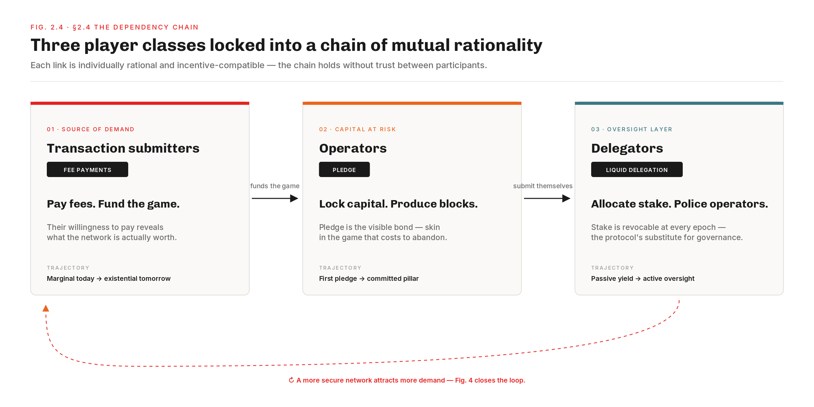
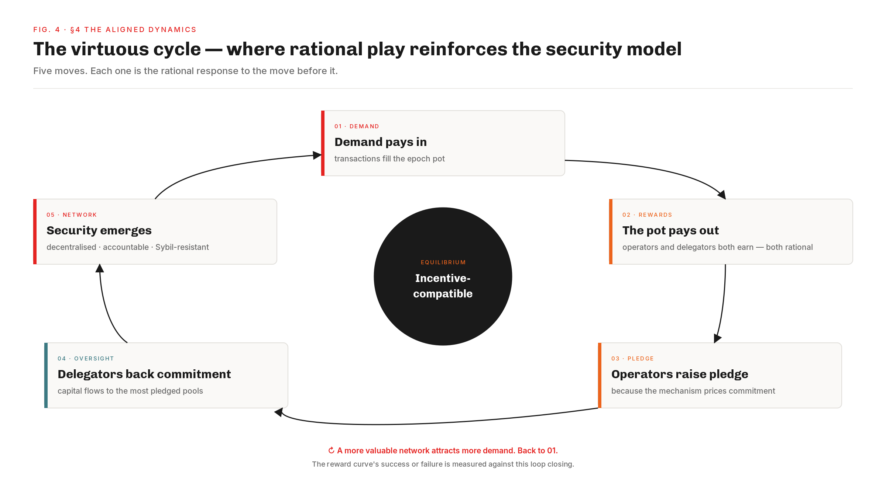

# Welcome — Cardano Reward System / The Holistic Reading

This is the work-in-progress website on  **Cardano Reward System / The Holistic Reading** — a holistic reading of today's reward mechanism, the **directions of exploration** that reading suggests for a successor, and an evaluation of the existing reward CIPs through the same holistic prism. The work is being conducted by the **Cardano Business Unit (CBU)** within . The aim: give the Cardano community a shared empirical and analytical foundation against which any proposal can be evaluated on common ground.

Nothing here is yet a deployed mechanism nor a finalised proposal — the analysis, the directions of exploration, and the CIP evaluation are all open to community challenge and refinement.

To begin, a **sample of seven insights** — a glimpse, across the reward system, of the drifts the diagnostic surfaces. Some have already been spotted, intuitively, by one or more of the existing reward CIPs that set out to address them; others appear here for the first time. A teaser, in the hope it will draw you deeper:

<article class="diag-teaser-box">
<header class="diag-teaser-box-head">
TREASURY · TRE.O1
M01
</header>

Reserve reward stock

13.29B → 6.45B ADA

Reserve · 5.5 yr · down 51.43% from Shelley inception

Observed paid rewards6.78M ADA per epoch

Funded by Tx fees0.17%

The chain still funds itself out of its own savings.

</article>

<article class="diag-teaser-box">
<header class="diag-teaser-box-head">
POOLS · POL.O3
μ04
</header>

Pledge paradox

0.07%

Stake-weighted median pledge · 78% of pools at ratio &lt; 1%

EPOCH POT LEAK

Bonus budget unused−3.43M ADA · 22.1%

95.6% of pledge-incentive budget returned to reserve

The formula offers a commitment bonus almost nobody collects.

</article>

<article class="diag-teaser-box">
<header class="diag-teaser-box-head">
OPERATOR-DELEGATOR · OPE.O8
M02
</header>

Yield collapse

5.3% → 2.0%

Average Yield Index · 5.5 yr · tracks the reserve

+12mo · Q2 2027~1.7%

+20mo · Q4 2027&lt; 1.5%

+42mo · Q3 2029&lt; 1.0%

Delegators earn less every epoch. The slope is straight.

</article>

<article class="diag-teaser-box">
<header class="diag-teaser-box-head">
POOLS · POL.O7
M03
</header>

Small SPO viability

~75%

Pools below the production threshold

Three quarters of pools sit below threshold · together less than 3% of staked ADA.

ADA price volatility further erodes what is left of their margin.

A small pool pays for the hardware. Not for the work.

</article>

<article class="diag-teaser-box">
<header class="diag-teaser-box-head">
POOLS · CEN.O2
μ02
</header>

MPO concentration

83 entities · 76.7%

Multi-pool operators control share of productive stake

555 → 291 single-pool operators · −38% in 5 years

SHARE OF EPOCH POT — PER EPOCH

Flow to 83 entities~5.2M ADA

76.7% of the 6.78M ADA epoch reward · captured by MPO clusters

Three quarters of the network runs on 83 entities.

</article>

<article class="diag-teaser-box">
<header class="diag-teaser-box-head">
DELEGATORS · CEN.O4
μ05
</header>

Delegator concentration

0.07% control 57%

Share of staked supply held by the top wallets

Crystallised at epoch 300 · 9× delegator growth has not shifted the top

SHARE OF EPOCH POT — PER EPOCH

Flow to top wallets~3.9M ADA

57% of the 6.78M ADA epoch reward · captured by &lt; 1 000 addresses

A thousand wallets decide where the rewards land.

</article>

<article class="diag-teaser-box">
<header class="diag-teaser-box-head">
NON-PARTICIPANTS · CEN.O1
μ01
</header>

Unstaked supply

39.8% unstaked

Share of ADA supply never delegated

Staking rate declining · 71% → 59% as supply growth outpaces inflows

FORGONE REWARD SHARE — PER EPOCH

Share if they staked~2.7M ADA

14.36B ADA × 39.8% of the 6.78M ADA epoch reward · at current 2.0% AYI

Most unstaked ADA is not even reachable by the reward curve.

</article>

## Why a holistic approach

Four pieces of work surround Cardano's reward mechanism today:

- **The formal design** — [*Delegation Incentives Design Specification (SL-D1)*](pdf-viewer.html?file=references/design-specs/delegation-incentives-design-spec_kant-brunjes-coutts_2019.pdf) by Kant, Brünjes & Coutts (2019), the original mathematical specification authored by IO Research before launch. Its companion paper [*Reward Sharing Schemes for Stake Pools*](pdf-viewer.html?file=references/research-papers/reward-sharing-schemes_brunjes-kiayias-et-al_2020.pdf) (Brünjes, Kiayias et al., EuroS&P 2020) proves *k* pools is a Nash equilibrium under specific assumptions.
- **A prior mainnet analysis** — [*Analysis of Cardano's Incentive Mechanism*](pdf-viewer.html?file=references/previous-analasys/spo-incentives-analysis_lopez-de-lara_2025.pdf) by Lopez de Lara (November 2025, tag **SD-L**), the first systematic look at the reward mechanism against on-chain evidence. The work on this site builds directly on it and extends the reflection.
- **Four reward-related CIPs** advanced through Intersect governance since launch: [CIP-0023](../solution-evaluation/operator-delegator/cip-0023.md), [CIP-0037](../solution-evaluation/pools-distribution/cip-0037.md), [CIP-0050](../solution-evaluation/pools-distribution/cip-0050.md), [CIP-0082](../solution-evaluation/operator-delegator/cip-0082.md) — each tackling a specific facet of the mechanism.
- **Five-and-a-half years of mainnet** — an empirical record large enough to confront design intent and to revisit any prior analysis on updated data.

What no document held in a single frame was *all four at once* — design intent, prior diagnostic, proposed fixes, and the current mainnet record — read against each other rather than in isolation. Cardano's reward mechanism was designed as a **single coherent equilibrium**, not a stack of separable parameters: pledge, delegation, the reward curve, the fee structure, the reserve schedule — all interact. A fix to one parameter without seeing the system as a whole risks moving the bottleneck rather than removing it. The drifts the diagnostic surfaces — only a small sample of which is previewed above — are not independent bugs; they are softer links in the same chain. Reading the four pieces against each other is what the work assembled on this site sets out to do, one document at a time. **Five documents, in sequence:**

<a class="cps-stage" href="../the-intended-game/README.md" title="Stage 01 — The Intended Game: plain-prose design baseline">
Stage 01
The Intended Game
Design intent &middot; baseline
</a>
&rarr;
<a class="cps-stage" href="../diagnostic/README.md" title="Stage 02 — Mainnet evidence: observations and findings, by sub-flow">
Stage 02
Mainnet evidence
Observations &amp; Findings
</a>
&rarr;
<a class="cps-stage" href="../generated-website/problem-statements.html" title="Stage 03 — Induced Problems: 9 proto-CPSs surfaced by the diagnostic">
Stage 03
Induced problem
9 proto-CPSs
</a>
&rarr;
<a class="cps-stage" href="../README.md" title="Stage 04 — Roadmap: directions of exploration and milestones">
Stage 04
Roadmap
Directions &amp; milestones
</a>
&rarr;
<a class="cps-stage" href="../solution-evaluation/README.md" title="Stage 05 — Evaluation of the four pre-existing reward CIPs against the diagnostic">
Stage 05
CIPs (Evaluation)
IntersectMBO governance
</a>

The work starts from the design intent. [*SL-D1*](pdf-viewer.html?file=references/design-specs/delegation-incentives-design-spec_kant-brunjes-coutts_2019.pdf) and [the EuroS&P paper](pdf-viewer.html?file=references/research-papers/reward-sharing-schemes_brunjes-kiayias-et-al_2020.pdf) are rigorous but dense, and the intent — *who plays, why they enter, how they progress, what equilibrium the formula is supposed to converge toward* — sits between the formulas, not on the surface. So we wrote the plain-prose companion SL-D1 never had: **[The Intended Game](../the-intended-game/README.md)**. It starts from the players — transaction submitters fund the epoch pot via fees, operators commit pledge and infrastructure, delegators allocate stake and police operators, and non-participants sit outside the game altogether. Each enters with a different motivation and holds a different strategic instrument; the reward curve's task is to make every link individually rational, so the chain holds without trust between participants.

Security in that chain rests on two pillars and two only — **pledge** (visible, declared, locked, costly to fake) and **liquid delegation** (continuous, revocable, non-consensual, no lockup). Together they are meant to produce four security properties as a joint output: Sybil resistance, accountability, decentralisation, and economic viability. The two pillars cannot be tuned separately — weaken either and all four properties degrade together. When everything holds, the system runs as a virtuous cycle: demand funds rewards, rewards select committed operators, committed operators secure the network, and a more secure network attracts more demand. A chain, not a stack — break any link and the cycle decays.

With that normative baseline in place, the next step was a systematic confrontation with mainnet evidence. [Lopez de Lara's November 2025 analysis](pdf-viewer.html?file=references/previous-analasys/spo-incentives-analysis_lopez-de-lara_2025.pdf) (**SD-L**) already opened that path; **[The Mainnet Diagnostic](../diagnostic/README.md)** picks it up, extends it on six more months of data, and reorganises the work around the four sub-flows of the reward pipeline — Treasury & Pool-Pots, Pools Distribution, Operator-Delegator split, Staking Census — each measuring divergence between the intended trajectory and the observed one, observation code by observation code. The seven boxes above are only a small sample of what it surfaces.

A diagnostic alone is not actionable. Each divergence has to be turned into a problem statement any successor can be evaluated against. **[Induced Problems](../generated-website/problem-statements.html)** consolidates them as **nine proto-CPSs** — five micro (μ01–μ05) and four macro (M01–M04), framed for the IntersectMBO governance process.

With both the diagnostic and the problem statements in hand, the four pre-existing reward CIPs can be read against the same prism. **[Existing reward CIPs — Evaluation](../solution-evaluation/README.md)** reads [CIP-0023](../solution-evaluation/operator-delegator/cip-0023.md), [CIP-0037](../solution-evaluation/pools-distribution/cip-0037.md), [CIP-0050](../solution-evaluation/pools-distribution/cip-0050.md), and [CIP-0082](../solution-evaluation/operator-delegator/cip-0082.md) against the same nine induced problems. The CIPs each spot real issues, intuitively — but they were drafted independently, before this diagnostic existed and without a system-wide framework, and a fix that looks right for one stage can be undone by a distortion at another. The evaluation asks whether the proposed fixes carry the weight the diagnostic asks of them.

Where they leave gaps, the work has to carry on. **[Roadmap](../README.md)** organises directions of exploration around the nine induced problems, with one priority rule: *root causes before scale-up*.

> **Status:** Active 2026/05/13. Landing page of *Cardano Reward System / The Holistic Reading*.
